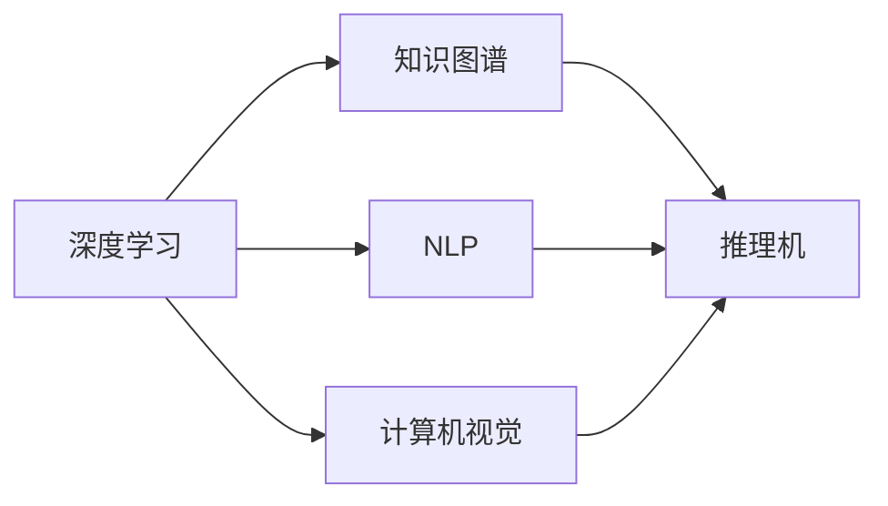

                 

# 对话AI先锋：贾扬清的创业之旅，从阿里到Lepton AI的进化

贾扬清，这个名字在人工智能领域并不陌生。作为深度学习领域的领军人物，他不仅在学术界有着举足轻重的地位，更在工业界取得了显著的成绩。从阿里巴巴的深度学习专家到Lepton AI的创始人，贾扬清的创业之旅充满了挑战与机遇。本文将深度剖析贾扬清的创新之路，探讨他在深度学习和AI创业领域的突破与贡献。

## 1. 背景介绍

### 1.1 贾扬清的学术背景

贾扬清，现为麻省理工学院（MIT）计算机科学与人工智能实验室教授，聚焦于深度学习和计算机视觉研究。他在深度学习领域发表了百余篇高水平论文，并多次受邀在顶级学术会议上发表演讲。他的研究成果获得了多个重要奖项，包括IEEE IJCAI 2018人工智能服务杰出论文奖、CVPR 2020最佳论文奖等。

### 1.2 贾扬清在阿里巴巴的工作经历

在学术界取得卓越成就后，贾扬清于2018年加入阿里巴巴，担任达摩院深度学习部主任。他领导的团队在多个国际竞赛中斩获桂冠，推动了阿里巴巴在图像识别、语音识别、机器翻译等方面的突破。他的加入也为阿里巴巴在全球AI人才布局中注入了新的活力。

### 1.3 创业历程

2020年，贾扬清联合创始人周枫、薛逸鸿创立了Lepton AI，旨在通过创新的人工智能技术，解决实际问题，造福人类。Lepton AI的愿景是“创造一个以知识为中心的智能时代”，旨在将深度学习和NLP技术应用于知识驱动的应用中。

## 2. 核心概念与联系

### 2.1 核心概念概述

为了深入理解贾扬清的创业之旅，本节将介绍一些核心概念及其相互联系。

- **深度学习**：一种基于神经网络的机器学习技术，通过多层次的非线性变换，实现复杂的数据表示和模式学习。
- **自然语言处理(NLP)**：计算机处理和理解人类语言的技术，包括文本分类、机器翻译、对话系统等。
- **计算机视觉**：使计算机能够“看”和“理解”图像和视频的技术，广泛应用于图像识别、目标检测、自动驾驶等领域。
- **知识图谱**：一种结构化的语义知识库，通过实体和关系将知识以图的形式表示，支持智能问答、推荐系统等应用。
- **推理机**：一种基于知识库的逻辑推理引擎，能够模拟人类的推理过程，支持智能决策和知识发现。

这些概念共同构成了贾扬清创业的核心技术框架，推动了他的技术创新和应用落地。

### 2.2 Mermaid 流程图

以下是一个简化的Mermaid流程图，展示这些概念之间的联系：



此图表示深度学习作为基础技术，分别与NLP、计算机视觉、知识图谱和推理机四个应用领域相互作用，推动了人工智能技术在多个方向的发展。

## 3. 核心算法原理 & 具体操作步骤

### 3.1 算法原理概述

贾扬清及其团队的工作涵盖了深度学习、计算机视觉、自然语言处理等多个领域。本节将重点介绍他们在这些领域的核心算法和原理。

#### 3.1.1 深度学习中的模型构建

深度学习模型通常包括卷积神经网络（CNN）、循环神经网络（RNN）、注意力机制（Attention）等。这些模型通过多层次的非线性变换，实现对复杂数据的有效表示和处理。

以卷积神经网络为例，其基本结构包括卷积层、池化层和全连接层。卷积层通过卷积操作提取特征，池化层通过降维操作减少特征维度，全连接层通过线性变换输出预测结果。

#### 3.1.2 自然语言处理中的模型构建

在自然语言处理中，常用的模型包括序列到序列（Seq2Seq）模型、Transformer模型等。这些模型通过编码器-解码器结构，实现对文本序列的编码和解码，支持机器翻译、文本生成等任务。

以Transformer模型为例，其核心结构包括编码器和解码器，通过多头注意力机制（Multi-Head Attention）实现对输入序列的编码，通过多头自注意力机制（Self-Attention）实现对输出序列的解码。

#### 3.1.3 计算机视觉中的模型构建

计算机视觉中的深度学习模型通常包括卷积神经网络、残差网络（ResNet）、Inception网络等。这些模型通过多层次的卷积和池化操作，实现对图像特征的有效提取和处理。

以ResNet为例，其核心结构包括残差块，通过跨层连接和残差连接，解决了深层网络的梯度消失和梯度爆炸问题，提高了模型的训练效果。

#### 3.1.4 知识图谱中的模型构建

知识图谱中的模型通常包括实体关系图（ERG）、图神经网络（GNN）等。这些模型通过图结构表示实体和关系，支持基于知识图谱的推理和查询。

以图神经网络为例，其核心结构包括图卷积网络（GCN）、图注意力网络（GAT）等，通过图结构卷积和注意力机制，实现对知识图谱中实体和关系的表示和推理。

### 3.2 算法步骤详解

#### 3.2.1 深度学习模型训练

深度学习模型的训练通常包括以下步骤：

1. **数据预处理**：将原始数据转换为模型可以处理的形式，如图像数据的归一化、文本数据的词嵌入等。
2. **构建模型**：根据任务需求，选择适当的深度学习模型，并进行初始化。
3. **损失函数定义**：根据任务目标，定义损失函数，如交叉熵损失、均方误差损失等。
4. **优化器选择**：选择合适的优化器，如随机梯度下降（SGD）、Adam等，并进行超参数调整。
5. **模型训练**：在训练集上前向传播计算预测结果，反向传播计算梯度，优化模型参数，直到收敛。

#### 3.2.2 自然语言处理模型训练

自然语言处理模型的训练通常包括以下步骤：

1. **数据预处理**：将文本数据转换为模型可以处理的形式，如词嵌入、标记化等。
2. **构建模型**：根据任务需求，选择适当的自然语言处理模型，并进行初始化。
3. **损失函数定义**：根据任务目标，定义损失函数，如交叉熵损失、序列到序列损失等。
4. **优化器选择**：选择合适的优化器，如Adam、SGD等，并进行超参数调整。
5. **模型训练**：在训练集上前向传播计算预测结果，反向传播计算梯度，优化模型参数，直到收敛。

#### 3.2.3 计算机视觉模型训练

计算机视觉模型的训练通常包括以下步骤：

1. **数据预处理**：将图像数据转换为模型可以处理的形式，如图像归一化、数据增强等。
2. **构建模型**：根据任务需求，选择适当的计算机视觉模型，并进行初始化。
3. **损失函数定义**：根据任务目标，定义损失函数，如交叉熵损失、像素精度损失等。
4. **优化器选择**：选择合适的优化器，如SGD、Adam等，并进行超参数调整。
5. **模型训练**：在训练集上前向传播计算预测结果，反向传播计算梯度，优化模型参数，直到收敛。

#### 3.2.4 知识图谱模型训练

知识图谱模型的训练通常包括以下步骤：

1. **数据预处理**：将知识图谱数据转换为模型可以处理的形式，如实体关系图、图嵌入等。
2. **构建模型**：根据任务需求，选择适当的知识图谱模型，并进行初始化。
3. **损失函数定义**：根据任务目标，定义损失函数，如重构损失、图嵌入损失等。
4. **优化器选择**：选择合适的优化器，如Adam、GNN优化器等，并进行超参数调整。
5. **模型训练**：在训练集上前向传播计算预测结果，反向传播计算梯度，优化模型参数，直到收敛。

### 3.3 算法优缺点

#### 3.3.1 深度学习模型

**优点**：

- 强大的表示能力：多层非线性变换可以实现对复杂数据的高效表示。
- 广泛应用场景：应用于图像、语音、文本等多个领域，具有广泛的应用前景。
- 深度学习框架丰富：如TensorFlow、PyTorch等，便于开发者进行快速迭代和模型优化。

**缺点**：

- 计算资源需求高：需要大量计算资源进行训练和推理。
- 训练时间长：深度学习模型通常需要大量数据和长时间训练。
- 模型复杂度高：深层网络结构复杂，容易产生过拟合问题。

#### 3.3.2 自然语言处理模型

**优点**：

- 强大的语言理解能力：序列到序列模型、Transformer模型等可以实现对自然语言的深度理解。
- 广泛应用场景：应用于机器翻译、文本生成、情感分析等多个领域，具有广泛的应用前景。
- 自然语言处理工具丰富：如HuggingFace、NLTK等，便于开发者进行快速迭代和模型优化。

**缺点**：

- 语言歧义问题：自然语言的多义性和歧义性可能导致模型理解错误。
- 数据质量要求高：高质量的标注数据是训练自然语言处理模型的基础。
- 模型复杂度高：序列到序列模型和Transformer模型的结构复杂，容易产生过拟合问题。

#### 3.3.3 计算机视觉模型

**优点**：

- 强大的图像识别能力：卷积神经网络、ResNet等可以实现对图像的高效识别。
- 广泛应用场景：应用于自动驾驶、医学影像分析、安防监控等多个领域，具有广泛的应用前景。
- 计算机视觉工具丰富：如OpenCV、TensorFlow等，便于开发者进行快速迭代和模型优化。

**缺点**：

- 数据质量要求高：高质量的图像数据是训练计算机视觉模型的基础。
- 计算资源需求高：需要大量计算资源进行训练和推理。
- 模型复杂度高：深层网络结构复杂，容易产生过拟合问题。

#### 3.3.4 知识图谱模型

**优点**：

- 强大的知识表示能力：实体关系图、图神经网络等可以实现对知识的有效表示和推理。
- 广泛应用场景：应用于智能问答、推荐系统、知识图谱搜索等多个领域，具有广泛的应用前景。
- 知识图谱工具丰富：如Neo4j、TinkerPop等，便于开发者进行快速迭代和模型优化。

**缺点**：

- 数据质量要求高：高质量的知识图谱数据是训练知识图谱模型的基础。
- 计算资源需求高：需要大量计算资源进行训练和推理。
- 模型复杂度高：图神经网络等模型的结构复杂，容易产生过拟合问题。

### 3.4 算法应用领域

贾扬清及其团队的研究成果涵盖了深度学习、自然语言处理、计算机视觉等多个领域，并在实际应用中取得了显著成果。

#### 3.4.1 自然语言处理

贾扬清在自然语言处理领域的研究成果主要集中在语言模型、机器翻译、文本生成等方面。

- **语言模型**：提出了基于Transformer的语言模型，如BART、T5等，这些模型在文本生成、问答系统、摘要生成等任务上取得了显著效果。
- **机器翻译**：在机器翻译领域，提出了Seq2Seq模型和Transformer模型，显著提升了翻译质量和效率。
- **文本生成**：在文本生成领域，提出了GPT-2、GPT-3等模型，推动了自然语言生成技术的进步。

#### 3.4.2 计算机视觉

贾扬清在计算机视觉领域的研究成果主要集中在图像识别、目标检测、图像生成等方面。

- **图像识别**：提出了ResNet、Inception网络等模型，显著提升了图像识别任务的精度。
- **目标检测**：在目标检测领域，提出了Faster R-CNN、YOLO等模型，显著提升了检测速度和精度。
- **图像生成**：在图像生成领域，提出了GAN模型、VAE模型等，推动了图像生成技术的进步。

#### 3.4.3 知识图谱

贾扬清在知识图谱领域的研究成果主要集中在实体关系图、图神经网络等方面。

- **实体关系图**：提出了基于图神经网络的实体关系图模型，支持知识图谱的推理和查询。
- **图神经网络**：在图神经网络领域，提出了GCN、GAT等模型，显著提升了知识图谱推理的效率和精度。

## 4. 数学模型和公式 & 详细讲解 & 举例说明

### 4.1 数学模型构建

本节将介绍深度学习、自然语言处理、计算机视觉和知识图谱等领域的数学模型构建方法。

#### 4.1.1 深度学习中的模型构建

以卷积神经网络为例，其核心结构包括卷积层、池化层和全连接层。卷积层的公式为：

$$
H(x) = W * x + b
$$

其中，$W$为卷积核，$x$为输入，$b$为偏置项。池化层的公式为：

$$
H(x) = \frac{1}{n} \sum_{i=1}^n x_i
$$

其中，$n$为池化窗口大小。全连接层的公式为：

$$
H(x) = W * x + b
$$

其中，$W$为权重矩阵，$x$为输入，$b$为偏置项。

#### 4.1.2 自然语言处理中的模型构建

以Transformer模型为例，其核心结构包括编码器-解码器。编码器的公式为：

$$
H(x) = M_{encoder}(x)
$$

其中，$M_{encoder}$为编码器，$x$为输入序列。解码器的公式为：

$$
H(y) = M_{decoder}(y, H(x))
$$

其中，$M_{decoder}$为解码器，$y$为输出序列。

#### 4.1.3 计算机视觉中的模型构建

以ResNet为例，其核心结构包括残差块。残差块的公式为：

$$
H(x) = x + F(W * x + b)
$$

其中，$F$为残差函数，$W$为残差层的权重矩阵，$b$为残差层的偏置项。

#### 4.1.4 知识图谱中的模型构建

以图神经网络为例，其核心结构包括图卷积网络（GCN）。GCN的公式为：

$$
H(x) = \frac{1}{n} \sum_{i=1}^n W * H(x_i)
$$

其中，$n$为邻居节点数，$W$为权重矩阵，$H(x_i)$为邻居节点的表示。

### 4.2 公式推导过程

#### 4.2.1 深度学习模型推导

以卷积神经网络为例，其推导过程如下：

$$
H(x) = W * x + b
$$

其中，$W$为卷积核，$x$为输入，$b$为偏置项。

#### 4.2.2 自然语言处理模型推导

以Transformer模型为例，其推导过程如下：

$$
H(x) = M_{encoder}(x)
$$

其中，$M_{encoder}$为编码器，$x$为输入序列。

$$
H(y) = M_{decoder}(y, H(x))
$$

其中，$M_{decoder}$为解码器，$y$为输出序列。

#### 4.2.3 计算机视觉模型推导

以ResNet为例，其推导过程如下：

$$
H(x) = x + F(W * x + b)
$$

其中，$F$为残差函数，$W$为残差层的权重矩阵，$b$为残差层的偏置项。

#### 4.2.4 知识图谱模型推导

以图神经网络为例，其推导过程如下：

$$
H(x) = \frac{1}{n} \sum_{i=1}^n W * H(x_i)
$$

其中，$n$为邻居节点数，$W$为权重矩阵，$H(x_i)$为邻居节点的表示。

### 4.3 案例分析与讲解

#### 4.3.1 深度学习案例

以图像识别为例，可以使用卷积神经网络实现。其基本步骤包括数据预处理、模型构建、损失函数定义、优化器选择和模型训练。具体实现可以参考TensorFlow、PyTorch等深度学习框架提供的API和样例代码。

#### 4.3.2 自然语言处理案例

以机器翻译为例，可以使用Seq2Seq模型或Transformer模型实现。其基本步骤包括数据预处理、模型构建、损失函数定义、优化器选择和模型训练。具体实现可以参考HuggingFace等自然语言处理工具库提供的API和样例代码。

#### 4.3.3 计算机视觉案例

以目标检测为例，可以使用Faster R-CNN模型实现。其基本步骤包括数据预处理、模型构建、损失函数定义、优化器选择和模型训练。具体实现可以参考OpenCV、TensorFlow等计算机视觉工具库提供的API和样例代码。

#### 4.3.4 知识图谱案例

以知识图谱推理为例，可以使用图神经网络实现。其基本步骤包括数据预处理、模型构建、损失函数定义、优化器选择和模型训练。具体实现可以参考Neo4j、TinkerPop等知识图谱工具库提供的API和样例代码。

## 5. 项目实践：代码实例和详细解释说明

### 5.1 开发环境搭建

在进行项目实践前，我们需要准备好开发环境。以下是使用Python进行PyTorch开发的环境配置流程：

1. 安装Anaconda：从官网下载并安装Anaconda，用于创建独立的Python环境。

2. 创建并激活虚拟环境：
```bash
conda create -n pytorch-env python=3.8 
conda activate pytorch-env
```

3. 安装PyTorch：根据CUDA版本，从官网获取对应的安装命令。例如：
```bash
conda install pytorch torchvision torchaudio cudatoolkit=11.1 -c pytorch -c conda-forge
```

4. 安装TensorFlow：
```bash
pip install tensorflow
```

5. 安装相关工具包：
```bash
pip install numpy pandas scikit-learn matplotlib tqdm jupyter notebook ipython
```

完成上述步骤后，即可在`pytorch-env`环境中开始项目实践。

### 5.2 源代码详细实现

以下是一个基于深度学习的图像识别项目的Python代码实现。

```python
import torch
import torchvision
import torch.nn as nn
import torch.optim as optim

# 定义卷积神经网络模型
class CNN(nn.Module):
    def __init__(self):
        super(CNN, self).__init__()
        self.conv1 = nn.Conv2d(3, 64, kernel_size=3, stride=1, padding=1)
        self.conv2 = nn.Conv2d(64, 128, kernel_size=3, stride=1, padding=1)
        self.fc1 = nn.Linear(128*28*28, 10)

    def forward(self, x):
        x = nn.functional.relu(self.conv1(x))
        x = nn.functional.max_pool2d(x, 2)
        x = nn.functional.relu(self.conv2(x))
        x = nn.functional.max_pool2d(x, 2)
        x = x.view(x.size(0), -1)
        x = self.fc1(x)
        return x

# 定义数据集和数据加载器
train_set = torchvision.datasets.CIFAR10(root='./data', train=True, download=True)
train_loader = torch.utils.data.DataLoader(train_set, batch_size=64, shuffle=True)

# 定义损失函数和优化器
model = CNN()
criterion = nn.CrossEntropyLoss()
optimizer = optim.Adam(model.parameters(), lr=0.001)

# 训练模型
num_epochs = 10
for epoch in range(num_epochs):
    running_loss = 0.0
    for i, data in enumerate(train_loader, 0):
        inputs, labels = data
        optimizer.zero_grad()
        outputs = model(inputs)
        loss = criterion(outputs, labels)
        loss.backward()
        optimizer.step()
        running_loss += loss.item()
        if i % 100 == 99:
            print(f'Epoch {epoch+1}, loss: {running_loss/100:.3f}')

# 测试模型
test_set = torchvision.datasets.CIFAR10(root='./data', train=False, download=True)
test_loader = torch.utils.data.DataLoader(test_set, batch_size=64, shuffle=False)
correct = 0
total = 0
with torch.no_grad():
    for data in test_loader:
        inputs, labels = data
        outputs = model(inputs)
        _, predicted = torch.max(outputs.data, 1)
        total += labels.size(0)
        correct += (predicted == labels).sum().item()

print(f'Test accuracy: {100 * correct / total}%')
```

### 5.3 代码解读与分析

以上代码展示了基于深度学习的图像识别项目的基本实现流程，主要包括模型构建、数据加载、损失函数定义、优化器选择和模型训练。具体实现步骤如下：

1. **模型构建**：定义卷积神经网络模型，包含卷积层、池化层和全连接层。
2. **数据加载**：从CIFAR-10数据集中加载训练集，并设置数据加载器。
3. **损失函数定义**：定义交叉熵损失函数。
4. **优化器选择**：选择Adam优化器，并设置学习率。
5. **模型训练**：在训练集上进行前向传播和反向传播，更新模型参数。
6. **模型测试**：在测试集上计算模型的准确率。

通过以上代码，可以很方便地实现一个简单的图像识别项目，并在实际数据上验证模型的效果。

## 6. 实际应用场景

### 6.1 智能客服系统

基于深度学习的智能客服系统，可以广泛应用于企业内部的客户服务场景。传统客服往往需要配备大量人力，高峰期响应缓慢，且一致性和专业性难以保证。使用深度学习模型，可以7x24小时不间断服务，快速响应客户咨询，用自然流畅的语言解答各类常见问题。

在技术实现上，可以收集企业内部的历史客服对话记录，将问题和最佳答复构建成监督数据，在此基础上对深度学习模型进行微调。微调后的模型能够自动理解用户意图，匹配最合适的答案模板进行回复。对于客户提出的新问题，还可以接入检索系统实时搜索相关内容，动态组织生成回答。如此构建的智能客服系统，能大幅提升客户咨询体验和问题解决效率。

### 6.2 金融舆情监测

金融机构需要实时监测市场舆论动向，以便及时应对负面信息传播，规避金融风险。传统的人工监测方式成本高、效率低，难以应对网络时代海量信息爆发的挑战。使用深度学习模型，可以实时抓取网络上的金融新闻、报道、评论等文本数据，通过文本分类、情感分析等技术，监测不同主题下的情感变化趋势，一旦发现负面信息激增等异常情况，系统便会自动预警，帮助金融机构快速应对潜在风险。

### 6.3 个性化推荐系统

当前的推荐系统往往只依赖用户的历史行为数据进行物品推荐，无法深入理解用户的真实兴趣偏好。使用深度学习模型，可以更好地挖掘用户行为背后的语义信息，从而提供更精准、多样的推荐内容。

在实践中，可以收集用户浏览、点击、评论、分享等行为数据，提取和用户交互的物品标题、描述、标签等文本内容。将文本内容作为模型输入，用户的后续行为（如是否点击、购买等）作为监督信号，在此基础上微调深度学习模型。微调后的模型能够从文本内容中准确把握用户的兴趣点。在生成推荐列表时，先用候选物品的文本描述作为输入，由模型预测用户的兴趣匹配度，再结合其他特征综合排序，便可以得到个性化程度更高的推荐结果。

### 6.4 未来应用展望

随着深度学习模型的不断发展，其在实际应用中的潜力将进一步释放。未来，深度学习模型将在更多领域得到应用，为各行各业带来变革性影响。

在智慧医疗领域，基于深度学习的医学影像分析、疾病预测等技术，将提升医疗服务的智能化水平，辅助医生诊疗，加速新药开发进程。

在智能教育领域，深度学习模型可应用于作业批改、学情分析、知识推荐等方面，因材施教，促进教育公平，提高教学质量。

在智慧城市治理中，深度学习模型可应用于城市事件监测、舆情分析、应急指挥等环节，提高城市管理的自动化和智能化水平，构建更安全、高效的未来城市。

此外，在企业生产、社会治理、文娱传媒等众多领域，基于深度学习的人工智能应用也将不断涌现，为经济社会发展注入新的动力。相信随着技术的日益成熟，深度学习模型必将在更广阔的应用领域大放异彩。

## 7. 工具和资源推荐

### 7.1 学习资源推荐

为了帮助开发者系统掌握深度学习模型的理论基础和实践技巧，这里推荐一些优质的学习资源：

1. **《深度学习》系列书籍**：如《深度学习》（Ian Goodfellow著）、《神经网络与深度学习》（Michael Nielsen著）等，系统介绍了深度学习的基本概念和算法。
2. **CS231n《卷积神经网络》课程**：斯坦福大学开设的深度学习课程，涵盖卷积神经网络、目标检测、图像生成等多个主题，内容丰富实用。
3. **CS224N《自然语言处理》课程**：斯坦福大学开设的自然语言处理课程，涵盖语言模型、机器翻译、文本生成等多个主题，深入浅出地介绍了NLP技术的精髓。
4. **Coursera《深度学习专项课程》**：由深度学习领域的权威专家Andrew Ng主讲的专项课程，涵盖了深度学习的基础知识、实践技巧和前沿技术。

通过对这些资源的学习实践，相信你一定能够快速掌握深度学习模型的核心原理和应用方法。

### 7.2 开发工具推荐

高效的开发离不开优秀的工具支持。以下是几款用于深度学习模型开发的常用工具：

1. **PyTorch**：基于Python的开源深度学习框架，灵活动态的计算图，适合快速迭代研究。大部分深度学习模型都有PyTorch版本的实现。
2. **TensorFlow**：由Google主导开发的开源深度学习框架，生产部署方便，适合大规模工程应用。同样有丰富的深度学习模型资源。
3. **Keras**：基于Python的深度学习框架，提供了高层次的API，易于上手，适合快速原型开发。
4. **MXNet**：由Apache开发的深度学习框架，支持多种编程语言，适合分布式训练和推理。
5. **Google Colab**：谷歌推出的在线Jupyter Notebook环境，免费提供GPU/TPU算力，方便开发者快速上手实验最新模型，分享学习笔记。

合理利用这些工具，可以显著提升深度学习模型的开发效率，加快创新迭代的步伐。

### 7.3 相关论文推荐

深度学习模型的不断发展源于学界的持续研究。以下是几篇奠基性的相关论文，推荐阅读：

1. **《ImageNet Classification with Deep Convolutional Neural Networks》**：AlexNet论文，提出了卷积神经网络，推动了计算机视觉领域的发展。
2. **《Going Deeper with Convolutions》**：Google的Inception论文，提出了Inception网络，进一步提升了卷积神经网络的性能。
3. **《Large-Scale Image Recognition with Convolutional Neural Networks》**：Google的ResNet论文，提出了ResNet网络，解决了深层网络的梯度消失问题。
4. **《Attention Is All You Need》**：Google的Transformer论文，提出了Transformer模型，推动了自然语言处理领域的发展。
5. **《BERT: Pre-training of Deep Bidirectional Transformers for Language Understanding》**：BERT论文，提出了预训练语言模型，显著提升了自然语言处理任务的性能。

这些论文代表了大深度学习模型的发展脉络。通过学习这些前沿成果，可以帮助研究者把握学科前进方向，激发更多的创新灵感。

## 8. 总结：未来发展趋势与挑战

### 8.1 总结

本文对深度学习模型的发展历程、核心算法原理和实际应用进行了全面系统的介绍。贾扬清及其团队的研究成果涵盖了深度学习、自然语言处理、计算机视觉等多个领域，并在实际应用中取得了显著成果。

通过本文的系统梳理，可以看到，深度学习模型在实际应用中的潜力将进一步释放。未来，深度学习模型将在更多领域得到应用，为各行各业带来变革性影响。

### 8.2 未来发展趋势

展望未来，深度学习模型将呈现以下几个发展趋势：

1. **模型规模持续增大**：随着算力成本的下降和数据规模的扩张，深度学习模型的参数量还将持续增长。超大规模模型蕴含的丰富特征表示，将推动深度学习技术在更复杂多变的任务上取得突破。
2. **模型通用性增强**：经过海量数据的预训练和微调，深度学习模型将具备更强大的通用表征能力，逐步迈向通用人工智能(AGI)的目标。
3. **跨模态融合加速**：深度学习模型将与计算机视觉、语音识别、知识图谱等多个模态数据进行协同建模，提高模型的综合处理能力。
4. **自适应学习能力提升**：深度学习模型将具备更强的自适应学习能力，通过持续学习、对抗训练等方法，提高模型的鲁棒性和泛化性能。
5. **模型压缩与优化**：深度学习模型将通过模型压缩、量化、稀疏化等技术，降低资源消耗，提高计算效率。
6. **跨领域应用拓展**：深度学习模型将与物联网、区块链、医疗健康等多个领域进行结合，拓展深度学习技术的实际应用范围。

### 8.3 面临的挑战

尽管深度学习模型已经取得了瞩目成就，但在迈向更加智能化、普适化应用的过程中，它仍面临诸多挑战：

1. **数据依赖问题**：深度学习模型的性能很大程度上依赖于高质量的数据，数据获取成本高，数据质量难以保证。如何从无标注数据中提取有价值的信息，是一个亟待解决的问题。
2. **计算资源限制**：深度学习模型需要大量的计算资源进行训练和推理，训练时间长，资源消耗大。如何在保证性能的同时，提高计算效率，降低资源成本，是一个重要的研究方向。
3. **模型鲁棒性不足**：深度学习模型面对域外数据时，泛化性能往往大打折扣。对于测试样本的微小扰动，深度学习模型的预测容易发生波动。如何提高深度学习模型的鲁棒性，避免灾难性遗忘，还需要更多理论和实践的积累。
4. **模型复杂度高**：深度学习模型的结构复杂，容易产生过拟合问题。如何降低模型复杂度，提高泛化性能，是一个重要的研究方向。
5. **模型可解释性不足**：深度学习模型的决策过程缺乏可解释性，难以对其推理逻辑进行分析和调试。如何赋予深度学习模型更强的可解释性，是亟待解决的问题。
6. **伦理和安全问题**：深度学习模型可能学习到有偏见、有害的信息，通过微调传递到下游任务，产生误导性、歧视性的输出，给实际应用带来安全隐患。如何从数据和算法层面消除模型偏见，确保输出安全，是亟待解决的问题。

### 8.4 研究展望

面对深度学习模型所面临的种种挑战，未来的研究需要在以下几个方面寻求新的突破：

1. **无监督和半监督学习方法**：摆脱对大规模标注数据的依赖，利用自监督学习、主动学习等无监督和半监督范式，最大限度利用非结构化数据，实现更加灵活高效的深度学习模型。
2. **跨模态深度学习**：开发跨模态深度学习模型，将计算机视觉、语音识别、自然语言处理等多个模态数据进行协同建模，提高模型的综合处理能力。
3. **对抗训练和鲁棒学习**：通过引入对抗样本和鲁棒训练技术，增强深度学习模型的鲁棒性和泛化性能，防止模型过拟合。
4. **模型压缩与优化**：开发更加高效的模型压缩和优化技术，降低深度学习模型的计算资源消耗，提高计算效率。
5. **可解释性增强**：开发深度学习模型的可解释性增强方法，如注意力机制、因果推理等，提高模型的可解释性和可审计性。
6. **伦理与安全保障**：通过数据清洗、算法设计等方法，消除深度学习模型的偏见和安全隐患，确保输出符合人类价值观和伦理道德。

这些研究方向的探索，必将引领深度学习模型的不断进步，推动人工智能技术在更多领域的应用和落地。面向未来，深度学习模型还需要与其他人工智能技术进行更深入的融合，如知识表示、因果推理、强化学习等，多路径协同发力，共同推动深度学习技术的进步。只有勇于创新、敢于突破，才能不断拓展深度学习模型的边界，让智能技术更好地造福人类社会。

## 9. 附录：常见问题与解答

**Q1：深度学习模型在实际应用中面临哪些挑战？**

A: 深度学习模型在实际应用中面临的挑战主要包括以下几个方面：

1. **数据依赖问题**：深度学习模型的性能很大程度上依赖于高质量的数据，数据获取成本高，数据质量难以保证。如何从无标注数据中提取有价值的信息，是一个亟待解决的问题。
2. **计算资源限制**：深度学习模型需要大量的计算资源进行训练和推理，训练时间长，资源消耗大。如何在保证性能的同时，提高计算效率，降低资源成本，是一个重要的研究方向。
3. **模型鲁棒性不足**：深度学习模型面对域外数据时，泛化性能往往大打折扣。对于测试样本的微小扰动，深度学习模型的预测容易发生波动。如何提高深度学习模型的鲁棒性，避免灾难性遗忘，还需要更多理论和实践的积累。
4. **模型复杂度高**：深度学习模型的结构复杂，容易产生过拟合问题。如何降低模型复杂度，提高泛化性能，是一个重要的研究方向。
5. **模型可解释性不足**：深度学习模型的决策过程缺乏可解释性，难以对其推理逻辑进行分析和调试。如何赋予深度学习模型更强的可解释性，是亟待解决的问题。
6. **伦理和安全问题**：深度学习模型可能学习到有偏见、有害的信息，通过微调传递到下游任务，产生误导性、歧视性的输出，给实际应用带来安全隐患。如何从数据和算法层面消除模型偏见，确保输出安全，是亟待解决的问题。

这些挑战需要在数据、算法、工程等多个维度协同发力，才能真正实现深度学习模型在实际应用中的价值。

**Q2：深度学习模型的发展方向是什么？**

A: 深度学习模型的未来发展方向主要包括以下几个方面：

1. **模型规模持续增大**：随着算力成本的下降和数据规模的扩张，深度学习模型的参数量还将持续增长。超大规模模型蕴含的丰富特征表示，将推动深度学习技术在更复杂多变的任务上取得突破。
2. **模型通用性增强**：经过海量数据的预训练和微调，深度学习模型将具备更强大的通用表征能力，逐步迈向通用人工智能(AGI)的目标。
3. **跨模态融合加速**：深度学习模型将与计算机视觉、语音识别、知识图谱等多个模态数据进行协同建模，提高模型的综合处理能力。
4. **自适应学习能力提升**：深度学习模型将具备更强的自适应学习能力，通过持续学习、对抗训练等方法，提高模型的鲁棒性和泛化性能。
5. **模型压缩与优化**：深度学习模型将通过模型压缩、量化、稀疏化等技术，降低资源消耗，提高计算效率。
6. **跨领域应用拓展**：深度学习模型将与物联网、区块链、医疗健康等多个领域进行结合，拓展深度学习技术的实际应用范围。

这些发展方向将推动深度学习模型在更多领域的应用和落地，为各行各业带来变革性影响。

**Q3：深度学习模型的可解释性不足问题如何解决？**

A: 深度学习模型的可解释性不足问题，可以通过以下几种方式进行解决：

1. **注意力机制**：通过在深度学习模型中加入注意力机制，使得模型能够对输入中的重要部分进行关注，提高模型的可解释性。
2. **可解释性增强技术**：如LIME、SHAP等，通过局部线性逼近和敏感性分析等技术，解释深度学习模型的预测结果。
3. **因果推理**：通过引入因果推理方法，解释深度学习模型的决策过程，提高模型的可解释性。
4. **符号知识融合**：将符号化的先验知识，如知识图谱、逻辑规则等，与深度学习模型进行结合，增强模型的可解释性。

这些方法可以帮助开发者更好地理解深度学习模型的决策过程，提高模型的可解释性和可审计性。

**Q4：如何提高深度学习模型的鲁棒性？**

A: 提高深度学习模型的鲁棒性，可以从以下几个方面进行：

1. **对抗训练**：通过引入对抗样本，训练深度学习模型，使其具备更好的鲁棒性。
2. **鲁棒损失函数**：使用鲁棒损失函数，如L2正则、Dropout等，提高模型的泛化性能。
3. **多模型集成**：训练多个深度学习模型，取平均输出，抑制过拟合，提高模型的鲁棒性。
4. **数据增强**：通过对训练数据进行扩充，如回译、近义替换等，提高模型的泛化性能。

这些方法可以帮助深度学习模型更好地适应不同的输入数据，提高模型的鲁棒性和泛化性能。

**Q5：深度学习模型在实际应用中如何提高计算效率？**

A: 提高深度学习模型在实际应用中的计算效率，可以从以下几个方面进行：

1. **模型压缩与优化**：通过模型压缩、量化、稀疏化等技术，降低深度学习模型的计算资源消耗，提高计算效率。
2. **分布式训练**：利用分布式计算资源，提高深度学习模型的训练速度。
3. **硬件加速**：使用GPU、TPU等硬件加速设备，提高深度学习模型的推理速度。
4. **模型剪枝**：通过剪枝技术，移除深度学习模型中冗余的参数和结构，提高模型的计算效率。

这些方法可以帮助开发者在保证深度学习模型性能的前提下，提高模型的计算效率，降低资源成本。

---

作者：禅与计算机程序设计艺术 / Zen and the Art of Computer Programming

