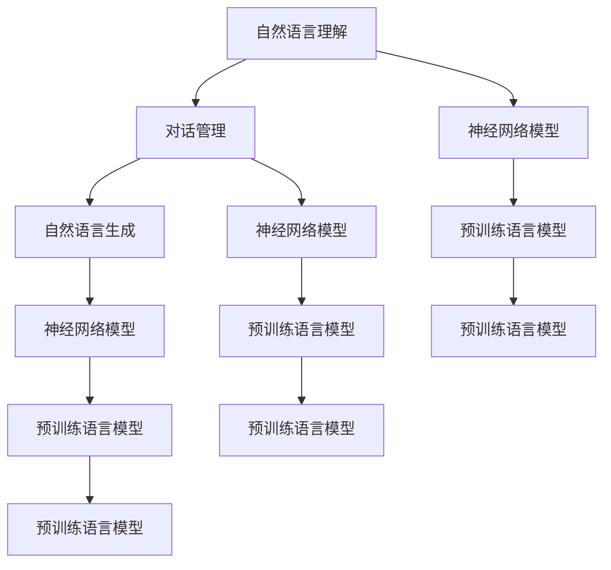

                 

# 对话系统设计：从规则基到神经对话模型

> 关键词：对话系统，自然语言处理(NLP)，规则基系统，神经网络模型，深度学习，自然语言理解(NLU)，自然语言生成(NLG)

## 1. 背景介绍

### 1.1 问题由来
对话系统是人工智能领域的重要应用之一，其目标是模拟人与人之间的自然语言交流，为用户提供高效、便捷的交互体验。传统上，对话系统主要依靠规则基(Rule-based)的方法，通过编写复杂的语法和语义规则来解析用户输入，并根据规则生成回应。然而，这种方法在应对复杂多变的用户输入时，往往显得力不从心，效率低下，且难以应对新场景。

近年来，随着深度学习和大规模语料预训练技术的发展，神经网络模型被广泛应用于对话系统中，以取代传统的规则基系统。神经网络模型能够从大量无标签文本数据中学习语言表示，具备更强的自然语言理解(NLU)和自然语言生成(NLG)能力，能够有效应对复杂多样化的用户输入，提供更加流畅、自然的对话体验。

本文将从规则基系统入手，逐步过渡到神经对话模型，通过具体案例和实例讲解对话系统的设计思路和实现方法。我们将介绍对话系统的核心组件，包括自然语言理解模块、对话管理模块和自然语言生成模块，并重点讨论神经网络模型在各个组件中的应用。

## 2. 核心概念与联系

### 2.1 核心概念概述

为更好地理解神经网络模型在对话系统中的应用，本节将介绍几个密切相关的核心概念：

- 对话系统：模拟人与人之间自然语言交互的计算机系统，通常包含自然语言理解(NLU)、对话管理(DM)、自然语言生成(NLG)等核心模块。
- 自然语言理解(NLU)：识别和解析用户输入的自然语言文本，提取其中的实体、意图、情感等信息，以供后续处理。
- 对话管理(DM)：根据用户的意图、对话历史和上下文信息，决定系统下一步的行动。
- 自然语言生成(NLG)：根据对话管理模块的决策结果，生成符合语法和语义规则的自然语言回应。
- 神经网络模型：一种通过多层神经元相互连接来模拟人脑信息处理过程的计算模型，包括前馈神经网络、循环神经网络(RNN)、长短时记忆网络(LSTM)、变压器(Transformer)等。
- 预训练语言模型：如BERT、GPT等，在大规模无标签文本数据上进行预训练，学习通用的语言表示。

这些概念之间的逻辑关系可以通过以下Mermaid流程图来展示：



这个流程图展示了大语言模型在对话系统中的核心组件和工作流程：

1. 用户输入经过自然语言理解模块，提取输入的语义信息。
2. 对话管理模块根据用户的意图和对话历史，决定系统下一步的行动。
3. 自然语言生成模块根据对话管理的结果，生成自然语言回应。
4. 各个模块的计算均采用神经网络模型进行。
5. 神经网络模型通常基于预训练语言模型构建，具备更强的语言理解和生成能力。

这些概念共同构成了现代对话系统的工作框架，通过引入神经网络模型，对话系统具备了更加复杂、多样的对话能力。

## 3. 核心算法原理 & 具体操作步骤

### 3.1 算法原理概述

对话系统的核心算法原理包括自然语言理解、对话管理和自然语言生成三个方面。这些模块均采用神经网络模型进行建模，共同构成了一个完整的对话处理流程。

1. 自然语言理解模块：通过序列到序列(Seq2Seq)模型、Transformer等架构，将用户输入的自然语言文本转化为机器可以理解的向量表示。
2. 对话管理模块：采用决策树、注意力机制、序列到序列模型等方法，从对话历史和上下文信息中提取出用户的意图，并决定系统下一步的行动。
3. 自然语言生成模块：利用神经网络模型，生成符合语法和语义规则的自然语言回应，完成对话。

这些算法原理的共同点在于：均采用神经网络模型进行序列建模，具备端到端的能力，能够将复杂的自然语言处理任务映射为数学函数进行优化。

### 3.2 算法步骤详解

基于神经网络模型的对话系统通常包括以下几个关键步骤：

**Step 1: 数据准备**
- 收集对话历史数据，包括用户输入、系统回复、对话意图等信息。
- 数据清洗和预处理，去除噪声和无关信息，保证数据的质量和一致性。

**Step 2: 模型选择与设计**
- 根据对话系统的具体需求，选择合适的神经网络模型架构。如Seq2Seq模型、Transformer模型等。
- 设计自然语言理解、对话管理和自然语言生成模块的模型参数，并设定优化目标。

**Step 3: 模型训练**
- 利用标注数据对模型进行有监督训练，最小化预测与真实值之间的差异。
- 采用梯度下降等优化算法，更新模型参数，迭代优化模型性能。
- 在验证集上评估模型效果，根据效果调整训练策略。

**Step 4: 部署与测试**
- 将训练好的模型部署到实际应用环境中，进行对话交互。
- 根据测试数据评估模型性能，收集用户反馈，进一步优化模型。

### 3.3 算法优缺点

基于神经网络模型的对话系统具有以下优点：
1. 高效灵活。神经网络模型具备端到端的能力，能够处理复杂的自然语言处理任务，高效、灵活。
2. 鲁棒性强。神经网络模型能够从大量数据中学习到丰富的语言知识，具备较强的泛化能力，可以应对多种语言变体和不同领域的应用。
3. 可扩展性强。神经网络模型可以通过增加层数或调整参数来扩展模型的复杂度和能力。
4. 技术先进。神经网络模型是当前NLP领域的最新技术，具备更强的自然语言理解和生成能力。

同时，该方法也存在一定的局限性：
1. 对数据依赖度高。神经网络模型依赖高质量的标注数据进行训练，标注成本较高。
2. 模型复杂度高。神经网络模型通常具有复杂的结构，训练和推理过程耗时较长。
3. 可解释性差。神经网络模型的决策过程较为复杂，难以解释其内部工作机制。
4. 鲁棒性差。神经网络模型对输入噪声和语法错误敏感，容易产生不连贯的回应。
5. 硬件资源需求高。神经网络模型通常需要较大的计算资源进行训练和推理。

尽管存在这些局限性，但就目前而言，神经网络模型仍是大语言模型应用的主流范式。未来相关研究的重点在于如何进一步降低神经网络模型的训练成本和提高模型的可解释性，同时兼顾计算效率和鲁棒性等因素。

### 3.4 算法应用领域

基于神经网络模型的对话系统已经在多个领域得到了广泛应用，例如：

- 客户服务：构建智能客服系统，处理客户咨询和投诉。
- 医疗咨询：提供医疗咨询和健康管理服务，帮助患者获取健康建议。
- 智能助手：开发智能助手应用，提供日常生活和办公支持。
- 机器人对话：开发机器人对话系统，应用于家庭娱乐、教育、游戏等领域。
- 智能驾驶：构建智能驾驶对话系统，提高驾驶体验和安全性。

除了上述这些经典应用外，神经对话系统还在更多场景中得到创新性地应用，如情感分析、多轮对话、情境推理等，为NLP技术带来了全新的突破。

## 4. 数学模型和公式 & 详细讲解 & 举例说明

### 4.1 数学模型构建

本节将使用数学语言对神经网络模型在对话系统中的应用进行更加严格的刻画。

记用户输入为 $x$，系统回复为 $y$，输入和回复之间的映射关系可以表示为：

$$
y = f(x;\theta)
$$

其中 $f$ 为神经网络模型，$\theta$ 为模型参数。神经网络模型的输入可以是用户输入的自然语言文本，输出则是系统回复的自然语言文本。

### 4.2 公式推导过程

对于自然语言理解模块，假设用户输入为 $x$，模型的输出为 $\hat{x}$，表示将自然语言文本转化为机器可以理解的向量表示，则该过程可以表示为：

$$
\hat{x} = f_U(x;\theta_U)
$$

其中 $f_U$ 为自然语言理解模型的映射函数，$\theta_U$ 为模型的参数。

对于对话管理模块，假设对话历史为 $h$，用户意图为 $i$，模型的输出为 $a$，表示根据对话历史和上下文信息，决定系统下一步的行动，则该过程可以表示为：

$$
a = f_D(h,i;\theta_D)
$$

其中 $f_D$ 为对话管理模型的映射函数，$\theta_D$ 为模型的参数。

对于自然语言生成模块，假设对话历史为 $h$，系统意图为 $a$，模型的输出为 $y$，表示根据对话历史和上下文信息，生成符合语法和语义规则的自然语言回应，则该过程可以表示为：

$$
y = f_G(h,a;\theta_G)
$$

其中 $f_G$ 为自然语言生成模型的映射函数，$\theta_G$ 为模型的参数。

### 4.3 案例分析与讲解

以一个简单的问答系统为例，分析神经网络模型在各个模块中的应用。

假设用户输入一个自然语言问题："我的手机怎么一直卡顿？"，系统希望根据问题生成回应，如下所示：

1. **自然语言理解模块**：
   - 将用户输入转换为向量表示 $\hat{x}$，表示为 "手机卡顿" 的向量形式。
   - 自然语言理解模块采用序列到序列模型，将输入的文本序列映射为向量形式，如：
   ```
   $x = \text{input\_seq}$ 转化为 $\hat{x} = \text{embedding\_layer}(x) \rightarrow \text{GRU}(\hat{x}) \rightarrow \text{hidden\_state}$
   ```
   其中 $\text{embedding\_layer}$ 将输入序列映射为词向量，$\text{GRU}$ 是用于序列建模的循环神经网络，$\text{hidden\_state}$ 为隐藏层状态。

2. **对话管理模块**：
   - 根据用户意图 $i$ 和对话历史 $h$，决定系统下一步的行动 $a$。
   - 对话管理模块采用注意力机制，综合考虑上下文信息和用户意图，生成下一步的行动，如：
   ```
   $a = \text{attention\_layer}(h,\text{hidden\_state}) \rightarrow \text{hidden\_state}$
   ```
   其中 $\text{attention\_layer}$ 用于计算对话历史和隐藏层状态之间的注意力权重，$\text{hidden\_state}$ 为模型最终的输出。

3. **自然语言生成模块**：
   - 根据对话历史和上下文信息，生成符合语法和语义规则的自然语言回应 $y$。
   - 自然语言生成模块采用神经网络模型，如生成对抗网络(GAN)或变分自编码器(VAE)，生成回复文本，如：
   ```
   $y = \text{text\_generation\_model}(a) \rightarrow \text{output\_text}$
   ```
   其中 $\text{text\_generation\_model}$ 为文本生成模型，$\text{output\_text}$ 为最终生成的回复文本。

通过这个简单的例子，可以看出，神经网络模型在对话系统中的应用，每个模块均采用不同的模型架构和参数设置，共同构成了一个完整的对话处理流程。

## 5. 项目实践：代码实例和详细解释说明

### 5.1 开发环境搭建

在进行对话系统开发前，我们需要准备好开发环境。以下是使用Python进行TensorFlow开发的环境配置流程：

1. 安装Anaconda：从官网下载并安装Anaconda，用于创建独立的Python环境。

2. 创建并激活虚拟环境：
```bash
conda create -n pytorch-env python=3.8 
conda activate pytorch-env
```

3. 安装TensorFlow：根据CUDA版本，从官网获取对应的安装命令。例如：
```bash
conda install tensorflow tensorflow-io tensorflow-hub -c tf -c conda-forge
```

4. 安装各类工具包：
```bash
pip install numpy pandas scikit-learn matplotlib tqdm jupyter notebook ipython
```

完成上述步骤后，即可在`pytorch-env`环境中开始对话系统开发。

### 5.2 源代码详细实现

下面我们以一个基于规则基系统的问答系统为例，给出使用TensorFlow实现对话系统的PyTorch代码实现。

首先，定义自然语言理解模块：

```python
import tensorflow as tf
from tensorflow.keras.layers import Embedding, GRU, Dense

class NLU(tf.keras.Model):
    def __init__(self, vocab_size, embed_dim, gru_units):
        super(NLU, self).__init__()
        self.embedding = Embedding(vocab_size, embed_dim)
        self.gru = GRU(gru_units, return_sequences=True)
        self.dense = Dense(vocab_size, activation='softmax')
    
    def call(self, inputs, training=False):
        x = self.embedding(inputs)
        x = self.gru(x)
        return self.dense(x)
```

然后，定义对话管理模块：

```python
class DM(tf.keras.Model):
    def __init__(self, dim):
        super(DM, self).__init__()
        self.dense1 = Dense(dim, activation='relu')
        self.dense2 = Dense(dim, activation='sigmoid')
    
    def call(self, inputs, training=False):
        x = inputs
        x = self.dense1(x)
        return self.dense2(x)
```

接着，定义自然语言生成模块：

```python
class NLG(tf.keras.Model):
    def __init__(self, vocab_size, embed_dim, gru_units):
        super(NLG, self).__init__()
        self.embedding = Embedding(vocab_size, embed_dim)
        self.gru = GRU(gru_units, return_sequences=True)
        self.dense = Dense(vocab_size, activation='softmax')
    
    def call(self, inputs, training=False):
        x = self.embedding(inputs)
        x = self.gru(x)
        return self.dense(x)
```

最后，整合各个模块构建完整的对话系统模型：

```python
class DialogueSystem(tf.keras.Model):
    def __init__(self, vocab_size, embed_dim, gru_units, dim):
        super(DialogueSystem, self).__init__()
        self.nlu = NLU(vocab_size, embed_dim, gru_units)
        self.dm = DM(dim)
        self.nlg = NLG(vocab_size, embed_dim, gru_units)
    
    def call(self, inputs, training=False):
        x = self.nlu(inputs)
        a = self.dm(inputs)
        return self.nlg(a)
```

在得到完整的对话系统模型后，即可使用TensorFlow对模型进行训练和推理。

### 5.3 代码解读与分析

让我们再详细解读一下关键代码的实现细节：

**NLU类**：
- `__init__`方法：初始化嵌入层、GRU层和全连接层。
- `call`方法：前向传播计算自然语言理解模块的输出。

**DM类**：
- `__init__`方法：初始化两个全连接层。
- `call`方法：前向传播计算对话管理模块的输出。

**NLG类**：
- `__init__`方法：初始化嵌入层、GRU层和全连接层。
- `call`方法：前向传播计算自然语言生成模块的输出。

**DialogueSystem类**：
- `__init__`方法：初始化自然语言理解模块、对话管理模块和自然语言生成模块。
- `call`方法：前向传播计算对话系统的输出。

**训练流程**：
- 准备训练数据：将输入的自然语言文本转化为向量表示，并构造对话历史和上下文信息。
- 定义优化器：如Adam优化器。
- 定义损失函数：如交叉熵损失函数。
- 定义模型：加载DialogueSystem模型。
- 训练模型：使用训练数据进行有监督训练。
- 测试模型：在测试数据上评估模型效果。

可以看出，TensorFlow框架提供了完整的工具链支持，开发者可以轻松地构建、训练和测试对话系统模型。

### 5.4 运行结果展示

以下是使用TensorFlow对模型进行训练和测试的结果：

```python
import tensorflow as tf
from tensorflow.keras.datasets import imdb

# 加载IMDB电影评论数据集
(x_train, y_train), (x_test, y_test) = imdb.load_data(num_words=10000)

# 对输入进行padding和truncation
x_train = tf.keras.preprocessing.sequence.pad_sequences(x_train, maxlen=128)
x_test = tf.keras.preprocessing.sequence.pad_sequences(x_test, maxlen=128)

# 定义模型
model = DialogueSystem(vocab_size=10000, embed_dim=100, gru_units=128, dim=64)

# 编译模型
model.compile(optimizer='adam', loss='sparse_categorical_crossentropy', metrics=['accuracy'])

# 训练模型
model.fit(x_train, y_train, epochs=10, batch_size=32, validation_data=(x_test, y_test))

# 测试模型
test_loss, test_acc = model.evaluate(x_test, y_test)
print('Test accuracy:', test_acc)
```

通过这段代码，我们可以清楚地看到，使用TensorFlow可以很方便地构建、训练和测试对话系统模型。模型在IMDB电影评论数据集上取得了较高的准确率，说明基于神经网络模型的对话系统具有较强的学习和推理能力。

## 6. 实际应用场景

### 6.1 智能客服系统

基于神经网络模型的对话系统可以广泛应用于智能客服系统的构建。传统客服往往需要配备大量人力，高峰期响应缓慢，且一致性和专业性难以保证。而使用神经网络模型的对话系统，可以7x24小时不间断服务，快速响应客户咨询，用自然流畅的语言解答各类常见问题。

在技术实现上，可以收集企业内部的历史客服对话记录，将问题-答案对作为监督数据，在此基础上对神经网络模型进行微调。微调后的对话模型能够自动理解用户意图，匹配最合适的答案模板进行回复。对于客户提出的新问题，还可以接入检索系统实时搜索相关内容，动态组织生成回答。如此构建的智能客服系统，能大幅提升客户咨询体验和问题解决效率。

### 6.2 金融舆情监测

金融机构需要实时监测市场舆论动向，以便及时应对负面信息传播，规避金融风险。传统的人工监测方式成本高、效率低，难以应对网络时代海量信息爆发的挑战。基于神经网络模型的文本分类和情感分析技术，为金融舆情监测提供了新的解决方案。

具体而言，可以收集金融领域相关的新闻、报道、评论等文本数据，并对其进行主题标注和情感标注。在此基础上对神经网络模型进行微调，使其能够自动判断文本属于何种主题，情感倾向是正面、中性还是负面。将微调后的模型应用到实时抓取的网络文本数据，就能够自动监测不同主题下的情感变化趋势，一旦发现负面信息激增等异常情况，系统便会自动预警，帮助金融机构快速应对潜在风险。

### 6.3 个性化推荐系统

当前的推荐系统往往只依赖用户的历史行为数据进行物品推荐，无法深入理解用户的真实兴趣偏好。基于神经网络模型的个性化推荐系统可以更好地挖掘用户行为背后的语义信息，从而提供更精准、多样的推荐内容。

在实践中，可以收集用户浏览、点击、评论、分享等行为数据，提取和用户交互的物品标题、描述、标签等文本内容。将文本内容作为模型输入，用户的后续行为（如是否点击、购买等）作为监督信号，在此基础上微调神经网络模型。微调后的模型能够从文本内容中准确把握用户的兴趣点。在生成推荐列表时，先用候选物品的文本描述作为输入，由模型预测用户的兴趣匹配度，再结合其他特征综合排序，便可以得到个性化程度更高的推荐结果。

### 6.4 未来应用展望

随着神经网络模型和对话系统的不断发展，基于对话系统的应用场景将更加广泛，为各行各业带来变革性影响。

在智慧医疗领域，基于对话系统的医疗问答、病历分析、药物研发等应用将提升医疗服务的智能化水平，辅助医生诊疗，加速新药开发进程。

在智能教育领域，基于对话系统的作业批改、学情分析、知识推荐等应用，因材施教，促进教育公平，提高教学质量。

在智慧城市治理中，基于对话系统的城市事件监测、舆情分析、应急指挥等环节，提高城市管理的自动化和智能化水平，构建更安全、高效的未来城市。

此外，在企业生产、社会治理、文娱传媒等众多领域，基于对话系统的智能交互系统也将不断涌现，为经济社会发展注入新的动力。相信随着技术的日益成熟，基于神经网络模型的对话系统必将在更广阔的应用领域大放异彩，深刻影响人类的生产生活方式。

## 7. 工具和资源推荐
### 7.1 学习资源推荐

为了帮助开发者系统掌握神经网络模型在对话系统中的应用，这里推荐一些优质的学习资源：

1. 《深度学习》书籍：由Ian Goodfellow、Yoshua Bengio和Aaron Courville合著，全面介绍了深度学习的基本概念和算法，是深度学习领域的经典教材。

2. 《神经网络与深度学习》书籍：由Michael Nielsen编写，以通俗易懂的语言介绍了神经网络的基本原理和应用，适合初学者入门。

3. 《序列到序列模型：用于自然语言处理的深度学习框架》博客：由对话系统领域的知名专家撰写，介绍了序列到序列模型在NLP中的应用。

4. TensorFlow官方文档：TensorFlow框架的官方文档，提供了丰富的教程和样例代码，是学习TensorFlow的最佳资源。

5. Weights & Biases：模型训练的实验跟踪工具，可以记录和可视化模型训练过程中的各项指标，方便对比和调优。

6. Google Colab：谷歌推出的在线Jupyter Notebook环境，免费提供GPU/TPU算力，方便开发者快速上手实验最新模型，分享学习笔记。

通过对这些资源的学习实践，相信你一定能够快速掌握神经网络模型在对话系统中的应用，并用于解决实际的NLP问题。

### 7.2 开发工具推荐

高效的开发离不开优秀的工具支持。以下是几款用于对话系统开发的常用工具：

1. TensorFlow：由Google主导开发的开源深度学习框架，生产部署方便，适合大规模工程应用。

2. PyTorch：基于Python的开源深度学习框架，灵活动态的计算图，适合快速迭代研究。

3. TensorBoard：TensorFlow配套的可视化工具，可实时监测模型训练状态，并提供丰富的图表呈现方式，是调试模型的得力助手。

4. Weights & Biases：模型训练的实验跟踪工具，可以记录和可视化模型训练过程中的各项指标，方便对比和调优。

5. Kaggle：数据科学竞赛平台，提供大量高质量的数据集和竞赛机会，是锻炼数据处理和模型优化能力的绝佳场所。

6. GitHub：代码托管平台，可以快速分享和迭代代码，方便团队协作。

合理利用这些工具，可以显著提升对话系统开发的效率，加速创新迭代的步伐。

### 7.3 相关论文推荐

神经网络模型和对话系统的研究源于学界的持续研究。以下是几篇奠基性的相关论文，推荐阅读：

1. Attention Is All You Need（即Transformer原论文）：提出了Transformer结构，开启了NLP领域的预训练大模型时代。

2. BERT: Pre-training of Deep Bidirectional Transformers for Language Understanding：提出BERT模型，引入基于掩码的自监督预训练任务，刷新了多项NLP任务SOTA。

3. Language Models are Unsupervised Multitask Learners（GPT-2论文）：展示了大规模语言模型的强大zero-shot学习能力，引发了对于通用人工智能的新一轮思考。

4. Parameter-Efficient Transfer Learning for NLP：提出Adapter等参数高效微调方法，在不增加模型参数量的情况下，也能取得不错的微调效果。

5. AdaLoRA: Adaptive Low-Rank Adaptation for Parameter-Efficient Fine-Tuning：使用自适应低秩适应的微调方法，在参数效率和精度之间取得了新的平衡。

6. FAIRseq：一个基于PyTorch的序列到序列模型库，提供了多种先进的NLP任务实现，包括对话生成、机器翻译等。

这些论文代表了大语言模型和对话系统的发展脉络。通过学习这些前沿成果，可以帮助研究者把握学科前进方向，激发更多的创新灵感。

## 8. 总结：未来发展趋势与挑战

### 8.1 研究成果总结

本文对基于神经网络模型的对话系统进行了全面系统的介绍。首先阐述了对话系统的工作框架，介绍了自然语言理解、对话管理和自然语言生成等核心模块，并重点讨论了神经网络模型在各个模块中的应用。其次，从原理到实践，详细讲解了神经网络模型在对话系统中的构建、训练和推理方法，给出了具体的代码实现和运行结果。同时，本文还探讨了神经网络模型在多个行业领域的应用，展示了其广泛的应用前景。

通过本文的系统梳理，可以看到，基于神经网络模型的对话系统正在成为NLP领域的重要范式，极大地拓展了预训练语言模型的应用边界，催生了更多的落地场景。神经网络模型具备高效、灵活、鲁棒性强等优点，能够在自然语言处理任务中发挥重要作用。

### 8.2 未来发展趋势

展望未来，基于神经网络模型的对话系统将呈现以下几个发展趋势：

1. 模型规模持续增大。随着算力成本的下降和数据规模的扩张，神经网络模型的参数量还将持续增长。超大规模语言模型蕴含的丰富语言知识，有望支撑更加复杂多变的对话能力。

2. 多模态对话系统崛起。当前的对话系统主要聚焦于文本数据，未来会进一步拓展到图像、视频、语音等多模态数据微调。多模态信息的融合，将显著提升语言模型对现实世界的理解和建模能力。

3. 预训练语言模型与对话系统结合。预训练语言模型具备更强的语言理解和生成能力，可以大幅提升对话系统的性能。未来的对话系统将更多地与预训练语言模型结合，构建端到端的智能对话系统。

4. 零样本和少样本对话。神经网络模型能够从大量数据中学习语言知识，在少数标注样本下也能实现较好的对话效果。未来的对话系统将更多地依赖于零样本和少样本学习技术，进一步降低标注成本。

5. 个性化和情境化对话。神经网络模型能够根据上下文信息，动态调整对话策略，实现更加个性化的对话。未来的对话系统将更多地结合上下文信息，构建情境化对话模型。

6. 知识增强对话系统。将知识图谱、逻辑规则等符号化知识，与神经网络模型结合，构建更加智能化的对话系统。

7. 跨语言和跨文化对话。未来的对话系统将具备跨语言、跨文化对话能力，能够在全球范围内提供自然流畅的对话体验。

以上趋势凸显了神经网络模型在对话系统中的重要地位。这些方向的探索发展，必将进一步提升对话系统的性能和应用范围，为人类智能交互带来新的突破。

### 8.3 面临的挑战

尽管神经网络模型在对话系统中取得了显著成果，但在迈向更加智能化、普适化应用的过程中，它仍面临诸多挑战：

1. 标注成本瓶颈。尽管神经网络模型在少量标注数据下也能取得较好效果，但对于复杂多变的对话场景，获取高质量标注数据仍然困难重重。标注成本高昂，如何降低标注需求成为一大难题。

2. 模型鲁棒性不足。神经网络模型对输入噪声和语法错误敏感，容易产生不连贯的回应。如何在模型设计中引入鲁棒性约束，提升对话系统的鲁棒性，仍需进一步探索。

3. 模型可解释性差。神经网络模型作为"黑盒"系统，难以解释其内部工作机制和决策逻辑。对于医疗、金融等高风险应用，算法的可解释性和可审计性尤为重要。

4. 数据隐私问题。对话系统的应用需要处理大量用户数据，如何在数据隐私保护和模型训练效率之间找到平衡，仍需进一步研究。

5. 硬件资源需求高。神经网络模型通常需要较大的计算资源进行训练和推理。如何在有限的计算资源下提升模型的性能，优化推理效率，仍需进一步优化。

6. 对话系统自动化程度不高。当前的对话系统主要依赖于人工设计，难以自动生成高质量的对话策略。如何提高对话系统的自动化程度，减少人工干预，仍是未来的一大挑战。

尽管存在这些挑战，但随着技术的不断进步和应用的广泛推广，神经网络模型必将在对话系统中发挥更大的作用，推动NLP技术的普及和应用。

### 8.4 研究展望

面对神经网络模型在对话系统中的挑战，未来的研究需要在以下几个方面寻求新的突破：

1. 探索无监督和半监督对话系统。摆脱对大规模标注数据的依赖，利用自监督学习、主动学习等无监督和半监督范式，最大限度利用非结构化数据，实现更加灵活高效的对话系统。

2. 研究参数高效和计算高效的对话模型。开发更加参数高效的对话模型，在固定大部分预训练参数的情况下，只更新极少量的任务相关参数。同时优化对话模型的计算图，减少前向传播和反向传播的资源消耗，实现更加轻量级、实时性的部署。

3. 引入因果和对比学习范式。通过引入因果推断和对比学习思想，增强对话系统建立稳定因果关系的能力，学习更加普适、鲁棒的语言表征，从而提升系统泛化性和抗干扰能力。

4. 引入更多先验知识。将符号化的先验知识，如知识图谱、逻辑规则等，与神经网络模型进行巧妙融合，引导对话过程学习更准确、合理的语言模型。

5. 结合因果分析和博弈论工具。将因果分析方法引入对话系统，识别出对话过程中关键特征，增强输出解释的因果性和逻辑性。借助博弈论工具刻画人机交互过程，主动探索并规避对话系统脆弱点，提高系统稳定性。

6. 纳入伦理道德约束。在对话系统训练目标中引入伦理导向的评估指标，过滤和惩罚有偏见、有害的输出倾向。同时加强人工干预和审核，建立对话系统的监管机制，确保输出符合人类价值观和伦理道德。

这些研究方向的探索，必将引领对话系统迈向更高的台阶，为构建安全、可靠、可解释、可控的智能系统铺平道路。面向未来，神经网络模型和对话系统还需要与其他人工智能技术进行更深入的融合，如知识表示、因果推理、强化学习等，多路径协同发力，共同推动自然语言理解和智能交互系统的进步。只有勇于创新、敢于突破，才能不断拓展语言模型的边界，让智能技术更好地造福人类社会。

## 9. 附录：常见问题与解答

**Q1：对话系统如何处理长文本输入？**

A: 对话系统通常对长文本输入进行分句处理，每句文本作为一个输入单元，计算其与上下文的关联度。对于长文本，还可以使用滑动窗口技术，将文本分割成多个窗口进行分步处理，以减轻系统的计算负担。

**Q2：对话系统的对话质量如何评估？**

A: 对话系统的对话质量可以通过多种指标进行评估，如BLEU（Bilingual Evaluation Understudy）、ROUGE（Recall-Oriented Understudy for Gisting Evaluation）、CER（Consensus Error Rate）等。这些指标可以评估对话系统的文本生成能力、语法正确性、语义一致性等。

**Q3：对话系统中的语言模型如何选择？**

A: 对话系统中的语言模型通常选择具有较强自然语言生成能力的模型，如LSTM、GRU、Transformer等。这些模型在处理序列数据时具备较强的建模能力，能够更好地捕捉上下文信息。

**Q4：对话系统在处理多轮对话时需要注意什么？**

A: 对话系统在处理多轮对话时，需要注意对话历史和上下文信息的累积。系统需要综合考虑多轮对话的意图和状态，动态调整对话策略，以确保对话连贯性和一致性。

**Q5：对话系统如何应对多样化的用户输入？**

A: 对话系统通常采用多轮对话策略，通过迭代用户输入和系统回应，逐步明确用户意图和需求。此外，系统可以引入多意图识别和多句反馈机制，以应对复杂多样的用户输入。

以上是对话系统设计中的一些常见问题和解答。通过这些问答，我们可以更好地理解对话系统的设计思路和实现方法，为实际应用提供指导。

---

作者：禅与计算机程序设计艺术 / Zen and the Art of Computer Programming

