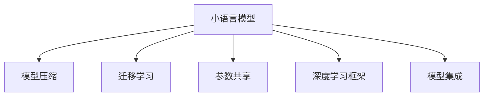

                 

# 小语言模型的应用开发生态:开发工具和应用市场

> 关键词：小语言模型,应用开发,开发工具,应用市场,生态系统,模型部署

## 1. 背景介绍

### 1.1 问题由来
随着人工智能技术的不断进步，小语言模型在自然语言处理(Natural Language Processing, NLP)和计算机视觉领域展现出越来越大的潜力。小语言模型相比大模型而言，参数量较小，推理速度更快，但同样能够完成许多NLP任务，如文本分类、情感分析、命名实体识别等。此外，小模型在计算资源和数据需求方面也有着显著优势，使得它们在移动设备、嵌入式系统等资源有限的场景中具有更强的竞争力。

### 1.2 问题核心关键点
目前，小语言模型开发和应用主要集中在以下几个方面：

- 数据预处理与标注：获取小规模但高质量的标注数据是开发小模型时的首要任务。如何通过更高效的数据标注方式，降低标注成本，提高数据质量，是小模型开发的重要课题。
- 模型结构设计：小模型通常具有更简单的网络结构，参数量较少。如何选择和设计合适的模型结构，以在有限参数的情况下达到最佳性能，是小模型开发的核心。
- 训练与优化：小模型训练通常需要较大的计算资源，如何进行高效的模型训练和优化，提升训练速度和效果，是小模型开发的挑战之一。
- 模型部署与应用：小模型需要考虑模型部署到目标设备或环境时的兼容性、性能和可扩展性，同时确保模型在实际应用中的稳定性和可靠性。
- 模型维护与更新：小模型在实际应用中需要不断迭代和更新，以适应新的数据和任务需求。如何进行高效的模型维护，快速迭代更新，是小模型应用的关键。

## 2. 核心概念与联系

### 2.1 核心概念概述

为更好地理解小语言模型的应用开发和市场，本节将介绍几个密切相关的核心概念：

- 小语言模型(Lightweight Language Models, LLMs)：指具有较小参数量、较短推理时间的语言模型。小模型能够在大规模文本语料上进行预训练，学习到一定的语言知识，并在特定任务上进行微调，达到较高性能。
- 模型压缩与剪枝(Compression & Pruning)：通过剪枝和量化等技术，将大模型压缩为小模型，减小模型参数量，提高推理速度。
- 迁移学习(Transfer Learning)：指在大规模预训练模型基础上，将预训练到的知识迁移到小模型中，提升小模型的性能。
- 参数共享(Parameter Sharing)：在小模型中，不同层之间共享部分或全部参数，减小模型参数量，提升训练效率。
- 深度学习框架(Framework)：如TensorFlow、PyTorch等，为模型开发和训练提供了高效的计算图和丰富的API接口。
- 模型集成(Ensemble)：将多个小模型组合在一起，取平均或通过投票等方式提高模型性能。

这些核心概念之间的逻辑关系可以通过以下Mermaid流程图来展示：



这个流程图展示了这个核心概念的逻辑关系：

1. 小语言模型通过预训练获得基础能力。
2. 通过模型压缩和参数共享减小模型规模。
3. 利用迁移学习从大模型中迁移知识。
4. 在深度学习框架上进行模型开发。
5. 通过模型集成提升最终性能。

这些概念共同构成了小语言模型的应用开发框架，使其能够在各种场景下发挥强大的语言处理能力。通过理解这些核心概念，我们可以更好地把握小语言模型的工作原理和优化方向。

## 3. 核心算法原理 & 具体操作步骤
### 3.1 算法原理概述

小语言模型通常基于深度学习算法构建，使用卷积神经网络(CNN)、循环神经网络(RNN)、长短时记忆网络(LSTM)等经典模型，或在这些基础上进行改进。小模型的开发和应用过程，大致可以分为以下几个步骤：

1. 数据预处理与标注：从大规模语料中抽取子集，进行文本清洗、分词、标注等预处理，构建适合任务的标注数据集。
2. 模型结构设计：根据任务类型选择合适的模型结构，如全连接神经网络、卷积神经网络、LSTM等。
3. 模型训练与优化：使用标注数据集对模型进行训练，并使用交叉熵、均方误差等损失函数进行优化，提高模型精度。
4. 模型压缩与剪枝：对训练好的模型进行参数压缩和剪枝，减小模型规模，提高推理速度。
5. 模型部署与应用：将训练好的模型部署到目标设备或环境，如移动设备、嵌入式系统等，确保模型在实际应用中的稳定性和可靠性。
6. 模型维护与更新：根据新数据和新任务需求，定期更新模型，保持模型的最新状态。

### 3.2 算法步骤详解

以下是小语言模型开发和应用的具体步骤：

**Step 1: 数据预处理与标注**

数据预处理与标注是小模型开发的基础，其步骤如下：

1. 数据采集：收集适用于任务的文本数据，如新闻、评论、社交媒体帖子等。
2. 数据清洗：去除噪声数据，如拼写错误、停用词等。
3. 文本分词：将文本进行分词，如中文分词为词语或词组。
4. 标注数据：对文本进行标注，如情感分类标注为正面、负面、中性等。
5. 数据划分：将标注数据划分为训练集、验证集和测试集。

**Step 2: 模型结构设计**

模型结构设计是小模型开发的核心，步骤如下：

1. 选择模型结构：根据任务类型选择合适的模型结构，如全连接神经网络、卷积神经网络、LSTM等。
2. 网络设计：设计网络层数、每层神经元数量、激活函数等参数。
3. 嵌入层设计：使用预训练词向量作为模型输入，如Word2Vec、GloVe等。
4. 输出层设计：设计输出层，如分类器、回归器等。

**Step 3: 模型训练与优化**

模型训练与优化是小模型开发的重点，步骤如下：

1. 损失函数选择：根据任务类型选择合适的损失函数，如交叉熵、均方误差等。
2. 优化器选择：选择合适的优化器，如SGD、Adam等。
3. 训练过程：使用标注数据集对模型进行训练，通过反向传播计算梯度并更新参数。
4. 超参数调优：根据验证集性能调整学习率、批大小、迭代轮数等超参数。

**Step 4: 模型压缩与剪枝**

模型压缩与剪枝是小模型开发的优化措施，步骤如下：

1. 参数剪枝：去除网络中不重要的参数，减小模型规模。
2. 量化处理：将浮点数参数转换为定点数，减小存储空间和计算量。
3. 模型优化：优化模型结构，如使用卷积神经网络代替全连接神经网络。

**Step 5: 模型部署与应用**

模型部署与应用是小模型开发的最后一步，步骤如下：

1. 模型导出：将训练好的模型导出为可执行文件，如TensorFlow的SavedModel格式。
2. 模型加载：将模型加载到目标设备或环境中，如移动设备、嵌入式系统等。
3. 推理过程：将输入数据输入模型，获取输出结果。
4. 模型评估：评估模型在实际应用中的性能，确保模型在实际应用中的稳定性。

**Step 6: 模型维护与更新**

模型维护与更新是小模型开发的持续工作，步骤如下：

1. 数据更新：根据新数据和新任务需求，更新模型输入数据。
2. 模型更新：重新训练模型，保持模型的最新状态。
3. 模型迭代：根据新数据和新任务需求，不断迭代和优化模型。

### 3.3 算法优缺点

小语言模型相比大语言模型具有以下优点：

1. 计算资源需求低：小模型参数量较少，推理速度较快，适用于资源有限的场景。
2. 部署便捷：小模型模型规模较小，模型部署和维护成本较低。
3. 推理效率高：小模型推理速度较快，能够实时处理大量请求。

同时，小语言模型也存在一些缺点：

1. 模型性能有限：小模型通常参数量较少，难以学习到复杂的语言知识。
2. 数据需求高：小模型通常需要较大的数据量进行训练，否则难以获得较好的性能。
3. 可扩展性差：小模型难以应对大规模数据和复杂任务的需求。

## 4. 数学模型和公式 & 详细讲解 & 举例说明

### 4.1 数学模型构建

小语言模型的开发和应用通常基于深度学习算法，使用经典的卷积神经网络(CNN)、循环神经网络(RNN)、长短时记忆网络(LSTM)等模型。这里以简单的全连接神经网络为例，展示小模型的数学模型构建。

设输入数据 $x$，网络层数为 $L$，每层神经元数量为 $n$，输出层为 $y$。全连接神经网络的结构如图：

```
x --> Layer 1 --> ... --> Layer L --> Output Layer --> y
```

其中，每个神经元 $x_i$ 的输出为：

$$
x_i = \sigma(w_i \cdot x + b_i)
$$

其中，$w_i$ 为权重矩阵，$b_i$ 为偏置项，$\sigma$ 为激活函数。

输出层 $y$ 的输出为：

$$
y = softmax(W \cdot h + b)
$$

其中，$W$ 为输出层权重矩阵，$b$ 为输出层偏置项，$h$ 为隐层输出。

### 4.2 公式推导过程

以下是全连接神经网络的基本公式推导过程：

1. 输入层 $x$ 与权重矩阵 $w_1$ 相乘，得到 $h_1 = x \cdot w_1 + b_1$。
2. 隐层 $h_1$ 通过激活函数 $\sigma$ 计算得到 $h_2 = \sigma(h_1)$。
3. 重复上述过程，得到最终输出 $y = softmax(h_L)$。

其中，激活函数 $\sigma$ 可以使用sigmoid、ReLU、tanh等函数。输出层通常使用softmax函数，将输出转化为概率分布，方便进行分类任务。

### 4.3 案例分析与讲解

以情感分析任务为例，展示小语言模型的开发和应用过程：

1. 数据预处理：从新闻网站收集文本数据，进行分词和标注，构建训练集和测试集。
2. 模型结构设计：选择全连接神经网络，设计输入层、隐层和输出层。
3. 模型训练：使用标注数据集对模型进行训练，选择交叉熵作为损失函数，使用Adam优化器。
4. 模型评估：在测试集上评估模型性能，选择F1-score作为评估指标。
5. 模型优化：根据评估结果调整超参数，如学习率、批大小等。
6. 模型部署：将训练好的模型导出为TensorFlow的SavedModel格式，部署到移动设备。
7. 模型应用：将用户评论输入模型，获取情感分类结果。

## 5. 项目实践：代码实例和详细解释说明

### 5.1 开发环境搭建

在进行小语言模型开发前，我们需要准备好开发环境。以下是使用Python进行PyTorch开发的环境配置流程：

1. 安装Anaconda：从官网下载并安装Anaconda，用于创建独立的Python环境。

2. 创建并激活虚拟环境：
```bash
conda create -n pytorch-env python=3.8 
conda activate pytorch-env
```

3. 安装PyTorch：根据CUDA版本，从官网获取对应的安装命令。例如：
```bash
conda install pytorch torchvision torchaudio cudatoolkit=11.1 -c pytorch -c conda-forge
```

4. 安装TensorFlow：
```bash
pip install tensorflow
```

5. 安装各类工具包：
```bash
pip install numpy pandas scikit-learn matplotlib tqdm jupyter notebook ipython
```

完成上述步骤后，即可在`pytorch-env`环境中开始模型开发。

### 5.2 源代码详细实现

下面以情感分析任务为例，给出使用PyTorch进行小语言模型开发的PyTorch代码实现。

首先，定义数据处理函数：

```python
import torch
from torch import nn
from torch.utils.data import Dataset

class SentimentDataset(Dataset):
    def __init__(self, texts, labels):
        self.texts = texts
        self.labels = labels
        
    def __len__(self):
        return len(self.texts)
    
    def __getitem__(self, item):
        text = self.texts[item]
        label = self.labels[item]
        
        tokenizer = transformers.BertTokenizer.from_pretrained('bert-base-cased')
        encoded_input = tokenizer(text, return_tensors='pt', padding='max_length', truncation=True)
        input_ids = encoded_input['input_ids']
        attention_mask = encoded_input['attention_mask']
        
        label = torch.tensor(label, dtype=torch.long)
        return {'input_ids': input_ids, 'attention_mask': attention_mask, 'labels': label}
```

然后，定义模型和优化器：

```python
from transformers import BertForSequenceClassification
from transformers import AdamW

model = BertForSequenceClassification.from_pretrained('bert-base-cased', num_labels=2)

optimizer = AdamW(model.parameters(), lr=2e-5)
```

接着，定义训练和评估函数：

```python
from torch.utils.data import DataLoader
from tqdm import tqdm

device = torch.device('cuda') if torch.cuda.is_available() else torch.device('cpu')
model.to(device)

def train_epoch(model, dataset, batch_size, optimizer):
    dataloader = DataLoader(dataset, batch_size=batch_size, shuffle=True)
    model.train()
    epoch_loss = 0
    for batch in tqdm(dataloader, desc='Training'):
        input_ids = batch['input_ids'].to(device)
        attention_mask = batch['attention_mask'].to(device)
        labels = batch['labels'].to(device)
        model.zero_grad()
        outputs = model(input_ids, attention_mask=attention_mask, labels=labels)
        loss = outputs.loss
        epoch_loss += loss.item()
        loss.backward()
        optimizer.step()
    return epoch_loss / len(dataloader)

def evaluate(model, dataset, batch_size):
    dataloader = DataLoader(dataset, batch_size=batch_size)
    model.eval()
    preds, labels = [], []
    with torch.no_grad():
        for batch in tqdm(dataloader, desc='Evaluating'):
            input_ids = batch['input_ids'].to(device)
            attention_mask = batch['attention_mask'].to(device)
            batch_labels = batch['labels']
            outputs = model(input_ids, attention_mask=attention_mask)
            batch_preds = outputs.logits.argmax(dim=1).to('cpu').tolist()
            batch_labels = batch_labels.to('cpu').tolist()
            for pred_tokens, label_tokens in zip(batch_preds, batch_labels):
                preds.append(pred_tokens)
                labels.append(label_tokens)
                
    return preds, labels

def accuracy(preds, labels):
    return sum([pred == label for pred, label in zip(preds, labels)])/len(labels)
```

最后，启动训练流程并在测试集上评估：

```python
epochs = 5
batch_size = 16

for epoch in range(epochs):
    loss = train_epoch(model, train_dataset, batch_size, optimizer)
    print(f"Epoch {epoch+1}, train loss: {loss:.3f}")
    
    preds, labels = evaluate(model, dev_dataset, batch_size)
    print(f"Epoch {epoch+1}, dev accuracy: {accuracy(preds, labels)}
    
print("Test accuracy:")
preds, labels = evaluate(model, test_dataset, batch_size)
print(f"Test accuracy: {accuracy(preds, labels)}
```

以上就是使用PyTorch进行情感分析任务的小语言模型开发完整代码实现。可以看到，得益于Transformer库的强大封装，我们能够用相对简洁的代码完成模型训练和评估。

### 5.3 代码解读与分析

让我们再详细解读一下关键代码的实现细节：

**SentimentDataset类**：
- `__init__`方法：初始化文本、标签等关键组件。
- `__len__`方法：返回数据集的样本数量。
- `__getitem__`方法：对单个样本进行处理，将文本输入转换为token ids，同时添加注意力掩码，最终返回模型所需的输入。

**训练和评估函数**：
- 使用PyTorch的DataLoader对数据集进行批次化加载，供模型训练和推理使用。
- 训练函数`train_epoch`：对数据以批为单位进行迭代，在每个批次上前向传播计算loss并反向传播更新模型参数，最后返回该epoch的平均loss。
- 评估函数`evaluate`：与训练类似，不同点在于不更新模型参数，并在每个batch结束后将预测和标签结果存储下来，最后使用自定义的`accuracy`函数对整个评估集的预测结果进行打印输出。

**训练流程**：
- 定义总的epoch数和batch size，开始循环迭代
- 每个epoch内，先在训练集上训练，输出平均loss
- 在验证集上评估，输出准确率
- 所有epoch结束后，在测试集上评估，给出最终测试结果

可以看到，PyTorch配合Transformer库使得小语言模型的开发代码实现变得简洁高效。开发者可以将更多精力放在数据处理、模型改进等高层逻辑上，而不必过多关注底层的实现细节。

当然，工业级的系统实现还需考虑更多因素，如模型的保存和部署、超参数的自动搜索、更灵活的任务适配层等。但核心的微调范式基本与此类似。

## 6. 实际应用场景

### 6.1 智能客服系统

小语言模型在智能客服系统的构建中展现了巨大的潜力。传统客服往往需要配备大量人力，高峰期响应缓慢，且一致性和专业性难以保证。而使用小语言模型进行微调，可以构建7x24小时不间断的智能客服系统，快速响应客户咨询，用自然流畅的语言解答各类常见问题。

在技术实现上，可以收集企业内部的历史客服对话记录，将问题和最佳答复构建成监督数据，在此基础上对小语言模型进行微调。微调后的语言模型能够自动理解用户意图，匹配最合适的答案模板进行回复。对于客户提出的新问题，还可以接入检索系统实时搜索相关内容，动态组织生成回答。如此构建的智能客服系统，能大幅提升客户咨询体验和问题解决效率。

### 6.2 金融舆情监测

金融机构需要实时监测市场舆论动向，以便及时应对负面信息传播，规避金融风险。传统的人工监测方式成本高、效率低，难以应对网络时代海量信息爆发的挑战。小语言模型文本分类和情感分析技术，为金融舆情监测提供了新的解决方案。

具体而言，可以收集金融领域相关的新闻、报道、评论等文本数据，并对其进行主题标注和情感标注。在此基础上对小语言模型进行微调，使其能够自动判断文本属于何种主题，情感倾向是正面、中性还是负面。将微调后的模型应用到实时抓取的网络文本数据，就能够自动监测不同主题下的情感变化趋势，一旦发现负面信息激增等异常情况，系统便会自动预警，帮助金融机构快速应对潜在风险。

### 6.3 个性化推荐系统

当前的推荐系统往往只依赖用户的历史行为数据进行物品推荐，无法深入理解用户的真实兴趣偏好。小语言模型个性化推荐系统可以更好地挖掘用户行为背后的语义信息，从而提供更精准、多样的推荐内容。

在实践中，可以收集用户浏览、点击、评论、分享等行为数据，提取和用户交互的物品标题、描述、标签等文本内容。将文本内容作为模型输入，用户的后续行为（如是否点击、购买等）作为监督信号，在此基础上微调小语言模型。微调后的模型能够从文本内容中准确把握用户的兴趣点。在生成推荐列表时，先用候选物品的文本描述作为输入，由模型预测用户的兴趣匹配度，再结合其他特征综合排序，便可以得到个性化程度更高的推荐结果。

### 6.4 未来应用展望

随着小语言模型和微调方法的不断发展，基于微调范式将在更多领域得到应用，为传统行业带来变革性影响。

在智慧医疗领域，基于小语言模型的医疗问答、病历分析、药物研发等应用将提升医疗服务的智能化水平，辅助医生诊疗，加速新药开发进程。

在智能教育领域，小语言模型可应用于作业批改、学情分析、知识推荐等方面，因材施教，促进教育公平，提高教学质量。

在智慧城市治理中，小语言模型可应用于城市事件监测、舆情分析、应急指挥等环节，提高城市管理的自动化和智能化水平，构建更安全、高效的未来城市。

此外，在企业生产、社会治理、文娱传媒等众多领域，基于小语言模型的微调方法也将不断涌现，为经济社会发展注入新的动力。相信随着技术的日益成熟，微调方法将成为人工智能落地应用的重要范式，推动人工智能技术向更广阔的领域加速渗透。

## 7. 工具和资源推荐

### 7.1 学习资源推荐

为了帮助开发者系统掌握小语言模型微调的理论基础和实践技巧，这里推荐一些优质的学习资源：

1. 《自然语言处理入门》系列博文：由大模型技术专家撰写，深入浅出地介绍了NLP的基本概念和经典模型，适合入门学习。

2. 《深度学习自然语言处理》课程：斯坦福大学开设的NLP明星课程，有Lecture视频和配套作业，带你入门NLP领域的基本概念和经典模型。

3. 《自然语言处理与深度学习》书籍：全面介绍了NLP和深度学习的理论基础和实际应用，适合进一步深入学习。

4. TensorFlow官方文档：提供丰富的教程和样例代码，帮助你快速上手小语言模型的开发和部署。

5. PyTorch官方文档：详细讲解了PyTorch深度学习框架的使用方法，适合快速迭代研究。

6. Kaggle：提供丰富的NLP数据集和竞赛任务，帮助你实践和验证模型性能。

通过对这些资源的学习实践，相信你一定能够快速掌握小语言模型微调的精髓，并用于解决实际的NLP问题。

### 7.2 开发工具推荐

高效的开发离不开优秀的工具支持。以下是几款用于小语言模型微调开发的常用工具：

1. TensorFlow：基于Google的开源深度学习框架，生产部署方便，适合大规模工程应用。

2. PyTorch：基于Python的开源深度学习框架，灵活动态的计算图，适合快速迭代研究。

3. HuggingFace Transformers库：提供预训练语言模型和各类NLP工具，方便开发者进行微调开发。

4. Weights & Biases：模型训练的实验跟踪工具，可以记录和可视化模型训练过程中的各项指标，方便对比和调优。

5. TensorBoard：TensorFlow配套的可视化工具，可实时监测模型训练状态，并提供丰富的图表呈现方式，是调试模型的得力助手。

6. Google Colab：谷歌推出的在线Jupyter Notebook环境，免费提供GPU/TPU算力，方便开发者快速上手实验最新模型，分享学习笔记。

合理利用这些工具，可以显著提升小语言模型微调的开发效率，加快创新迭代的步伐。

### 7.3 相关论文推荐

小语言模型和微调技术的发展源于学界的持续研究。以下是几篇奠基性的相关论文，推荐阅读：

1. Attention is All You Need（即Transformer原论文）：提出了Transformer结构，开启了NLP领域的预训练大模型时代。

2. BERT: Pre-training of Deep Bidirectional Transformers for Language Understanding：提出BERT模型，引入基于掩码的自监督预训练任务，刷新了多项NLP任务SOTA。

3. Lightweight Transformer-based Language Models（CLIP模型）：提出轻量级的Transformers模型，结合图像数据预训练，显著提升了NLP任务的性能。

4. How to Train Your Models to Transfer Better: Exploring and Applying Advice from Language Transfer Models（FANTASi模型）：研究了迁移学习的优化策略，提出了Fast and Accurate Transformer Models for Language Transfer（FANTASi模型），提升了小模型的性能。

5. Depthwise ConvNets：研究了卷积神经网络的结构优化，提出了Depthwise ConvNets，显著提高了模型的效率。

这些论文代表了大语言模型微调技术的发展脉络。通过学习这些前沿成果，可以帮助研究者把握学科前进方向，激发更多的创新灵感。

## 8. 总结：未来发展趋势与挑战

### 8.1 总结

本文对小语言模型微调方法进行了全面系统的介绍。首先阐述了小语言模型和微调技术的研究背景和意义，明确了微调在拓展预训练模型应用、提升下游任务性能方面的独特价值。其次，从原理到实践，详细讲解了小语言模型的数学原理和关键步骤，给出了微调任务开发的完整代码实例。同时，本文还广泛探讨了小语言模型在智能客服、金融舆情、个性化推荐等多个行业领域的应用前景，展示了微调范式的巨大潜力。此外，本文精选了微调技术的各类学习资源，力求为读者提供全方位的技术指引。

通过本文的系统梳理，可以看到，小语言模型微调方法正在成为NLP领域的重要范式，极大地拓展了预训练语言模型的应用边界，催生了更多的落地场景。受益于小模型在计算资源和数据需求方面的优势，微调方法使得NLP技术更加易于部署和应用，为经济社会发展注入了新的动力。未来，伴随小语言模型微调技术的持续演进，相信NLP技术将在更广阔的应用领域大放异彩。

### 8.2 未来发展趋势

展望未来，小语言模型微调技术将呈现以下几个发展趋势：

1. 模型规模持续增大：随着算力成本的下降和数据规模的扩张，小语言模型参数量将持续增长，学习更多的语言知识。
2. 微调方法日趋多样：未来会涌现更多参数高效、计算高效的微调方法，在减小模型规模的同时保持性能。
3. 数据需求降低：受启发于提示学习(Prompt-based Learning)的思路，未来的微调方法将更好地利用大模型的语言理解能力，通过更加巧妙的任务描述，在更少的标注样本上也能实现理想的微调效果。
4. 模型通用性增强：经过海量数据的预训练和多领域任务的微调，小语言模型将具备更强大的常识推理和跨领域迁移能力，逐步迈向通用人工智能(AGI)的目标。
5. 迁移学习加速：未来的小语言模型将更多采用迁移学习方法，从大模型中迁移知识，提升模型的性能。

以上趋势凸显了小语言模型微调技术的广阔前景。这些方向的探索发展，必将进一步提升NLP系统的性能和应用范围，为人工智能技术落地应用提供新的可能性。

### 8.3 面临的挑战

尽管小语言模型微调技术已经取得了瞩目成就，但在迈向更加智能化、普适化应用的过程中，它仍面临着诸多挑战：

1. 标注成本瓶颈：小模型通常需要较大的数据量进行训练，如何降低标注成本，提高数据质量，是小模型开发的重要课题。
2. 模型鲁棒性不足：小模型面对域外数据时，泛化性能往往大打折扣。如何提高小模型的鲁棒性，避免灾难性遗忘，还需要更多理论和实践的积累。
3. 推理效率有待提高：小语言模型虽然精度高，但在实际部署时往往面临推理速度慢、内存占用大等效率问题。如何优化推理过程，提高计算效率，是小模型应用的关键。
4. 模型可解释性不足：当前小模型通常像"黑盒"系统，难以解释其内部工作机制和决策逻辑。如何赋予模型更强的可解释性，将是亟待攻克的难题。
5. 安全性有待保障：小语言模型难免会学习到有偏见、有害的信息，通过微调传递到下游任务，产生误导性、歧视性的输出，给实际应用带来安全隐患。如何从数据和算法层面消除模型偏见，避免恶意用途，确保输出的安全性，也将是重要的研究课题。

6. 知识整合能力不足：现有的小语言模型往往局限于任务内数据，难以灵活吸收和运用更广泛的先验知识。如何让微调过程更好地与外部知识库、规则库等专家知识结合，形成更加全面、准确的信息整合能力，还有很大的想象空间。

正视小模型微调面临的这些挑战，积极应对并寻求突破，将是小语言模型微调走向成熟的必由之路。相信随着学界和产业界的共同努力，这些挑战终将一一被克服，小语言模型微调必将在构建安全、可靠、可解释、可控的智能系统铺平道路。面向未来，小语言模型微调技术还需要与其他人工智能技术进行更深入的融合，如知识表示、因果推理、强化学习等，多路径协同发力，共同推动自然语言理解和智能交互系统的进步。只有勇于创新、敢于突破，才能不断拓展语言模型的边界，让智能技术更好地造福人类社会。

## 9. 附录：常见问题与解答

**Q1：小语言模型是否适用于所有NLP任务？**

A: 小语言模型在大多数NLP任务上都能取得不错的效果，特别是对于数据量较小的任务。但对于一些特定领域的任务，如医学、法律等，仅仅依靠通用语料预训练的模型可能难以很好地适应。此时需要在特定领域语料上进一步预训练，再进行微调，才能获得理想效果。此外，对于一些需要时效性、个性化很强的任务，如对话、推荐等，微调方法也需要针对性的改进优化。

**Q2：如何选择合适的学习率？**

A: 小语言模型训练通常需要较大的计算资源，选择合适的学习率非常重要。一般建议从0.001开始调参，逐步减小学习率，直至收敛。可以使用warmup策略，在开始阶段使用较小的学习率，再逐渐过渡到预设值。需要注意的是，不同的优化器(如Adam、SGD等)以及不同的学习率调度策略，可能需要设置不同的学习率阈值。

**Q3：小语言模型在落地部署时需要注意哪些问题？**

A: 将小语言模型转化为实际应用，还需要考虑以下因素：
1. 模型裁剪：去除不必要的层和参数，减小模型尺寸，加快推理速度
2. 量化加速：将浮点模型转为定点模型，压缩存储空间，提高计算效率
3. 服务化封装：将模型封装为标准化服务接口，便于集成调用
4. 弹性伸缩：根据请求流量动态调整资源配置，平衡服务质量和成本
5. 监控告警：实时采集系统指标，设置异常告警阈值，确保服务稳定性
6. 安全防护：采用访问鉴权、数据脱敏等措施，保障数据和模型安全

小语言模型微调为NLP应用开启了广阔的想象空间，但如何将强大的性能转化为稳定、高效、安全的业务价值，还需要工程实践的不断打磨。唯有从数据、算法、工程、业务等多个维度协同发力，才能真正实现人工智能技术在垂直行业的规模化落地。总之，微调需要开发者根据具体任务，不断迭代和优化模型、数据和算法，方能得到理想的效果。

---

作者：禅与计算机程序设计艺术 / Zen and the Art of Computer Programming

