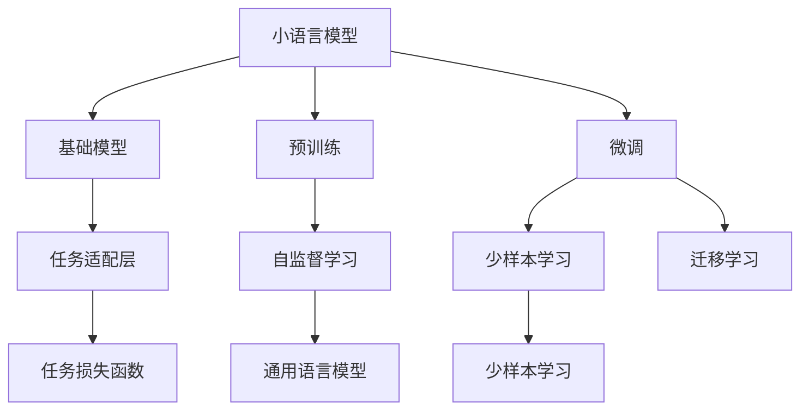

                 

# 小语言模型的潜力：颠覆基础模型领域

> 关键词：小语言模型, 基础模型, 预训练, 微调, 少样本学习, 迁移学习, Transformer, GPT-3, BERT, 参数高效微调, 大模型优化, 数据增强

## 1. 背景介绍

### 1.1 问题由来
近年来，深度学习技术在自然语言处理(NLP)领域取得了显著进展，大语言模型(Giant Language Models)成为了推动技术进步的重要动力。这些大模型通过在大规模无标签文本数据上进行预训练，学习到了丰富的语言知识和常识，展示了强大的语言理解和生成能力。然而，大模型往往具有数亿个参数，占用了大量的计算资源和存储空间，部署和维护成本高昂，限制了其在实际应用中的普及。

为了应对这一挑战，小语言模型(Small Language Models)应运而生。小模型相对大模型具有更少的参数、更低的计算需求和更小的内存占用，可以在资源受限的设备上高效运行。与大模型相比，小模型更易于部署和维护，适合于资源有限的场景，如嵌入式设备、移动端应用等。

本文旨在探讨小语言模型的潜力，并探讨其在基础模型领域可能带来的颠覆性影响。通过系统介绍小语言模型的原理、训练方法、应用场景及其优化策略，旨在为开发者和研究者提供全面的技术指引，推动小语言模型在更多实际问题中的应用。

## 2. 核心概念与联系

### 2.1 核心概念概述

为更好地理解小语言模型的潜力，本节将介绍几个密切相关的核心概念：

- 小语言模型(Small Language Models)：指参数量较少的预训练语言模型。与大模型相比，小模型在保持一定语言理解能力的同时，显著减小了模型尺寸和计算资源消耗。

- 基础模型(Fundamental Models)：指用于执行特定NLP任务的基础组件，如文本分类、命名实体识别、情感分析等。

- 预训练(Pre-training)：指在大规模无标签文本数据上，通过自监督学习任务训练通用语言模型的过程。预训练使得模型学习到语言的通用表示。

- 微调(Fine-tuning)：指在预训练模型的基础上，使用下游任务的少量标注数据，通过有监督学习优化模型在特定任务上的性能。

- 少样本学习(Few-shot Learning)：指在只有少量标注样本的情况下，模型能够快速适应新任务的学习方法。

- 迁移学习(Transfer Learning)：指将一个领域学习到的知识，迁移应用到另一个不同但相关的领域的学习范式。

- Transformer：一种基于自注意力机制的深度学习模型，通过并行化计算大大提升了语言模型训练和推理的效率。

- GPT-3和BERT：当前最先进的预训练大语言模型，展示了强大的语言生成和理解能力。

这些核心概念之间的逻辑关系可以通过以下Mermaid流程图来展示：



这个流程图展示了一下小语言模型的核心概念及其之间的关系：

1. 小语言模型通过预训练获得基础能力。
2. 基础模型是执行特定NLP任务的基础组件。
3. 微调是对基础模型进行任务特定的优化，通常使用少量标注数据进行训练。
4. 少样本学习指模型在少量标注数据下仍能快速适应新任务。
5. 迁移学习是连接基础模型与下游任务的桥梁，可以通过微调或少样本学习来实现。

这些概念共同构成了小语言模型的学习和应用框架，使其能够高效地执行NLP任务。

## 3. 核心算法原理 & 具体操作步骤
### 3.1 算法原理概述

小语言模型在基础模型领域的应用主要基于以下核心算法：

- 预训练：通过在大规模无标签文本数据上进行自监督学习，学习语言的通用表示。
- 微调：在大规模预训练基础上，使用下游任务的少量标注数据进行有监督学习，优化模型在特定任务上的性能。
- 少样本学习：在标注数据不足的情况下，利用模型对少量示例的泛化能力进行快速学习。
- 迁移学习：将预训练模型学到的知识，迁移到下游任务中，提升模型的泛化能力。

这些算法原理通过数学模型和优化算法相结合，在小语言模型的训练和优化过程中起着至关重要的作用。

### 3.2 算法步骤详解

小语言模型的训练和优化一般包括以下几个关键步骤：

**Step 1: 准备预训练模型和数据集**
- 选择合适的预训练语言模型作为初始化参数，如BERT、GPT-2等。
- 准备下游任务的数据集，划分为训练集、验证集和测试集。

**Step 2: 添加任务适配层**
- 根据任务类型，在预训练模型顶层设计合适的输出层和损失函数。
- 对于分类任务，通常在顶层添加线性分类器和交叉熵损失函数。
- 对于生成任务，通常使用语言模型的解码器输出概率分布，并以负对数似然为损失函数。

**Step 3: 设置微调超参数**
- 选择合适的优化算法及其参数，如 Adam、SGD 等，设置学习率、批大小、迭代轮数等。
- 设置正则化技术及强度，包括权重衰减、Dropout、Early Stopping 等。
- 确定冻结预训练参数的策略，如仅微调顶层，或全部参数都参与微调。

**Step 4: 执行梯度训练**
- 将训练集数据分批次输入模型，前向传播计算损失函数。
- 反向传播计算参数梯度，根据设定的优化算法和学习率更新模型参数。
- 周期性在验证集上评估模型性能，根据性能指标决定是否触发 Early Stopping。
- 重复上述步骤直到满足预设的迭代轮数或 Early Stopping 条件。

**Step 5: 测试和部署**
- 在测试集上评估微调后模型，对比微调前后的精度提升。
- 使用微调后的模型对新样本进行推理预测，集成到实际的应用系统中。
- 持续收集新的数据，定期重新微调模型，以适应数据分布的变化。

以上是使用小语言模型进行微调的一般流程。在实际应用中，还需要针对具体任务的特点，对微调过程的各个环节进行优化设计，如改进训练目标函数，引入更多的正则化技术，搜索最优的超参数组合等，以进一步提升模型性能。

### 3.3 算法优缺点

小语言模型在基础模型领域的应用具有以下优点：

1. 参数高效：小模型相对于大模型具有更少的参数，降低了计算需求和内存占用，适合于资源受限的设备。
2. 泛化能力强：小模型在少量标注数据下仍能取得较好的性能，适用于数据量较小的任务。
3. 部署便捷：小模型训练和推理速度较快，容易部署和维护。
4. 开发灵活：小模型可以通过参数高效微调等技术，进一步提升模型性能，适应更多实际需求。

同时，小语言模型也存在一定的局限性：

1. 性能上限：小模型由于参数量有限，可能在某些任务上无法达到大模型的表现。
2. 数据依赖：虽然小模型对标注数据的需求较少，但在一些复杂任务上仍需大量标注数据。
3. 迁移能力：小模型的迁移学习能力可能受限于预训练数据和任务类型。
4. 鲁棒性不足：小模型面对噪声和扰动时，可能表现出较差的鲁棒性。

尽管存在这些局限性，但小语言模型在基础模型领域的应用前景广阔，通过合理的训练和优化策略，可以有效提升其性能和应用范围。

### 3.4 算法应用领域

小语言模型在基础模型领域的应用已经得到了广泛的应用，覆盖了几乎所有常见的NLP任务，例如：

- 文本分类：如情感分析、主题分类、意图识别等。通过微调使模型学习文本-标签映射。
- 命名实体识别：识别文本中的人名、地名、机构名等特定实体。通过微调使模型掌握实体边界和类型。
- 关系抽取：从文本中抽取实体之间的语义关系。通过微调使模型学习实体-关系三元组。
- 问答系统：对自然语言问题给出答案。将问题-答案对作为微调数据，训练模型学习匹配答案。
- 机器翻译：将源语言文本翻译成目标语言。通过微调使模型学习语言-语言映射。
- 文本摘要：将长文本压缩成简短摘要。将文章-摘要对作为微调数据，使模型学习抓取要点。
- 对话系统：使机器能够与人自然对话。将多轮对话历史作为上下文，微调模型进行回复生成。

除了上述这些经典任务外，小语言模型也被创新性地应用到更多场景中，如可控文本生成、常识推理、代码生成、数据增强等，为NLP技术带来了全新的突破。随着小语言模型的不断进步，相信NLP技术将在更广阔的应用领域大放异彩。

## 4. 数学模型和公式 & 详细讲解 & 举例说明
### 4.1 数学模型构建

本节将使用数学语言对小语言模型的微调过程进行更加严格的刻画。

记小语言模型为 $M_{\theta}$，其中 $\theta$ 为模型参数。假设微调任务的训练集为 $D=\{(x_i,y_i)\}_{i=1}^N, x_i \in \mathcal{X}, y_i \in \mathcal{Y}$。

定义模型 $M_{\theta}$ 在输入 $x$ 上的损失函数为 $\ell(M_{\theta}(x),y)$，则在数据集 $D$ 上的经验风险为：

$$
\mathcal{L}(\theta) = \frac{1}{N} \sum_{i=1}^N \ell(M_{\theta}(x_i),y_i)
$$

微调的优化目标是最小化经验风险，即找到最优参数：

$$
\theta^* = \mathop{\arg\min}_{\theta} \mathcal{L}(\theta)
$$

在实践中，我们通常使用基于梯度的优化算法（如SGD、Adam等）来近似求解上述最优化问题。设 $\eta$ 为学习率，$\lambda$ 为正则化系数，则参数的更新公式为：

$$
\theta \leftarrow \theta - \eta \nabla_{\theta}\mathcal{L}(\theta) - \eta\lambda\theta
$$

其中 $\nabla_{\theta}\mathcal{L}(\theta)$ 为损失函数对参数 $\theta$ 的梯度，可通过反向传播算法高效计算。

### 4.2 公式推导过程

以下我们以二分类任务为例，推导交叉熵损失函数及其梯度的计算公式。

假设模型 $M_{\theta}$ 在输入 $x$ 上的输出为 $\hat{y}=M_{\theta}(x) \in [0,1]$，表示样本属于正类的概率。真实标签 $y \in \{0,1\}$。则二分类交叉熵损失函数定义为：

$$
\ell(M_{\theta}(x),y) = -[y\log \hat{y} + (1-y)\log (1-\hat{y})]
$$

将其代入经验风险公式，得：

$$
\mathcal{L}(\theta) = -\frac{1}{N}\sum_{i=1}^N [y_i\log M_{\theta}(x_i)+(1-y_i)\log(1-M_{\theta}(x_i))]
$$

根据链式法则，损失函数对参数 $\theta_k$ 的梯度为：

$$
\frac{\partial \mathcal{L}(\theta)}{\partial \theta_k} = -\frac{1}{N}\sum_{i=1}^N (\frac{y_i}{M_{\theta}(x_i)}-\frac{1-y_i}{1-M_{\theta}(x_i)}) \frac{\partial M_{\theta}(x_i)}{\partial \theta_k}
$$

其中 $\frac{\partial M_{\theta}(x_i)}{\partial \theta_k}$ 可进一步递归展开，利用自动微分技术完成计算。

在得到损失函数的梯度后，即可带入参数更新公式，完成模型的迭代优化。重复上述过程直至收敛，最终得到适应下游任务的最优模型参数 $\theta^*$。

## 5. 项目实践：代码实例和详细解释说明
### 5.1 开发环境搭建

在进行小语言模型微调实践前，我们需要准备好开发环境。以下是使用Python进行PyTorch开发的环境配置流程：

1. 安装Anaconda：从官网下载并安装Anaconda，用于创建独立的Python环境。

2. 创建并激活虚拟环境：
```bash
conda create -n pytorch-env python=3.8 
conda activate pytorch-env
```

3. 安装PyTorch：根据CUDA版本，从官网获取对应的安装命令。例如：
```bash
conda install pytorch torchvision torchaudio cudatoolkit=11.1 -c pytorch -c conda-forge
```

4. 安装Transformers库：
```bash
pip install transformers
```

5. 安装各类工具包：
```bash
pip install numpy pandas scikit-learn matplotlib tqdm jupyter notebook ipython
```

完成上述步骤后，即可在`pytorch-env`环境中开始微调实践。

### 5.2 源代码详细实现

下面我们以命名实体识别(NER)任务为例，给出使用Transformers库对BERT模型进行微调的PyTorch代码实现。

首先，定义NER任务的数据处理函数：

```python
from transformers import BertTokenizer
from torch.utils.data import Dataset
import torch

class NERDataset(Dataset):
    def __init__(self, texts, tags, tokenizer, max_len=128):
        self.texts = texts
        self.tags = tags
        self.tokenizer = tokenizer
        self.max_len = max_len
        
    def __len__(self):
        return len(self.texts)
    
    def __getitem__(self, item):
        text = self.texts[item]
        tags = self.tags[item]
        
        encoding = self.tokenizer(text, return_tensors='pt', max_length=self.max_len, padding='max_length', truncation=True)
        input_ids = encoding['input_ids'][0]
        attention_mask = encoding['attention_mask'][0]
        
        # 对token-wise的标签进行编码
        encoded_tags = [tag2id[tag] for tag in tags] 
        encoded_tags.extend([tag2id['O']] * (self.max_len - len(encoded_tags)))
        labels = torch.tensor(encoded_tags, dtype=torch.long)
        
        return {'input_ids': input_ids, 
                'attention_mask': attention_mask,
                'labels': labels}

# 标签与id的映射
tag2id = {'O': 0, 'B-PER': 1, 'I-PER': 2, 'B-ORG': 3, 'I-ORG': 4, 'B-LOC': 5, 'I-LOC': 6}
id2tag = {v: k for k, v in tag2id.items()}

# 创建dataset
tokenizer = BertTokenizer.from_pretrained('bert-base-cased')

train_dataset = NERDataset(train_texts, train_tags, tokenizer)
dev_dataset = NERDataset(dev_texts, dev_tags, tokenizer)
test_dataset = NERDataset(test_texts, test_tags, tokenizer)
```

然后，定义模型和优化器：

```python
from transformers import BertForTokenClassification, AdamW

model = BertForTokenClassification.from_pretrained('bert-base-cased', num_labels=len(tag2id))

optimizer = AdamW(model.parameters(), lr=2e-5)
```

接着，定义训练和评估函数：

```python
from torch.utils.data import DataLoader
from tqdm import tqdm
from sklearn.metrics import classification_report

device = torch.device('cuda') if torch.cuda.is_available() else torch.device('cpu')
model.to(device)

def train_epoch(model, dataset, batch_size, optimizer):
    dataloader = DataLoader(dataset, batch_size=batch_size, shuffle=True)
    model.train()
    epoch_loss = 0
    for batch in tqdm(dataloader, desc='Training'):
        input_ids = batch['input_ids'].to(device)
        attention_mask = batch['attention_mask'].to(device)
        labels = batch['labels'].to(device)
        model.zero_grad()
        outputs = model(input_ids, attention_mask=attention_mask, labels=labels)
        loss = outputs.loss
        epoch_loss += loss.item()
        loss.backward()
        optimizer.step()
    return epoch_loss / len(dataloader)

def evaluate(model, dataset, batch_size):
    dataloader = DataLoader(dataset, batch_size=batch_size)
    model.eval()
    preds, labels = [], []
    with torch.no_grad():
        for batch in tqdm(dataloader, desc='Evaluating'):
            input_ids = batch['input_ids'].to(device)
            attention_mask = batch['attention_mask'].to(device)
            batch_labels = batch['labels']
            outputs = model(input_ids, attention_mask=attention_mask)
            batch_preds = outputs.logits.argmax(dim=2).to('cpu').tolist()
            batch_labels = batch_labels.to('cpu').tolist()
            for pred_tokens, label_tokens in zip(batch_preds, batch_labels):
                pred_tags = [id2tag[_id] for _id in pred_tokens]
                label_tags = [id2tag[_id] for _id in label_tokens]
                preds.append(pred_tags[:len(label_tags)])
                labels.append(label_tags)
                
    print(classification_report(labels, preds))
```

最后，启动训练流程并在测试集上评估：

```python
epochs = 5
batch_size = 16

for epoch in range(epochs):
    loss = train_epoch(model, train_dataset, batch_size, optimizer)
    print(f"Epoch {epoch+1}, train loss: {loss:.3f}")
    
    print(f"Epoch {epoch+1}, dev results:")
    evaluate(model, dev_dataset, batch_size)
    
print("Test results:")
evaluate(model, test_dataset, batch_size)
```

以上就是使用PyTorch对BERT进行命名实体识别任务微调的完整代码实现。可以看到，得益于Transformers库的强大封装，我们可以用相对简洁的代码完成BERT模型的加载和微调。

### 5.3 代码解读与分析

让我们再详细解读一下关键代码的实现细节：

**NERDataset类**：
- `__init__`方法：初始化文本、标签、分词器等关键组件。
- `__len__`方法：返回数据集的样本数量。
- `__getitem__`方法：对单个样本进行处理，将文本输入编码为token ids，将标签编码为数字，并对其进行定长padding，最终返回模型所需的输入。

**tag2id和id2tag字典**：
- 定义了标签与数字id之间的映射关系，用于将token-wise的预测结果解码回真实的标签。

**训练和评估函数**：
- 使用PyTorch的DataLoader对数据集进行批次化加载，供模型训练和推理使用。
- 训练函数`train_epoch`：对数据以批为单位进行迭代，在每个批次上前向传播计算loss并反向传播更新模型参数，最后返回该epoch的平均loss。
- 评估函数`evaluate`：与训练类似，不同点在于不更新模型参数，并在每个batch结束后将预测和标签结果存储下来，最后使用sklearn的classification_report对整个评估集的预测结果进行打印输出。

**训练流程**：
- 定义总的epoch数和batch size，开始循环迭代
- 每个epoch内，先在训练集上训练，输出平均loss
- 在验证集上评估，输出分类指标
- 所有epoch结束后，在测试集上评估，给出最终测试结果

可以看到，PyTorch配合Transformers库使得BERT微调的代码实现变得简洁高效。开发者可以将更多精力放在数据处理、模型改进等高层逻辑上，而不必过多关注底层的实现细节。

当然，工业级的系统实现还需考虑更多因素，如模型的保存和部署、超参数的自动搜索、更灵活的任务适配层等。但核心的微调范式基本与此类似。

## 6. 实际应用场景
### 6.1 智能客服系统

小语言模型在智能客服系统中的应用具有广泛的前景。传统的客服系统依赖大量人力，难以应对高峰期用户激增的情况，同时人力成本高昂。小语言模型可以通过微调实现快速适应特定业务需求，提供7x24小时不间断服务，自动处理用户的常见咨询问题，提升客户满意度。

在技术实现上，可以收集企业内部的历史客服对话记录，将问题和最佳答复构建成监督数据，在此基础上对预训练模型进行微调。微调后的对话模型能够自动理解用户意图，匹配最合适的答案模板进行回复。对于用户提出的新问题，还可以接入检索系统实时搜索相关内容，动态组织生成回答。如此构建的智能客服系统，能大幅提升客户咨询体验和问题解决效率。

### 6.2 金融舆情监测

金融市场舆情监测对及时应对负面信息传播，规避金融风险具有重要意义。小语言模型可以在短时间内通过微调学习到市场舆情的关键特征，自动判断文本属于何种主题，情感倾向是正面、中性还是负面。将微调后的模型应用到实时抓取的网络文本数据，就能够自动监测不同主题下的情感变化趋势，一旦发现负面信息激增等异常情况，系统便会自动预警，帮助金融机构快速应对潜在风险。

### 6.3 个性化推荐系统

当前的推荐系统往往只依赖用户的历史行为数据进行物品推荐，无法深入理解用户的真实兴趣偏好。小语言模型可以通过微调学习到用户对物品的兴趣点，从而提供更加精准、多样的推荐内容。

在实践中，可以收集用户浏览、点击、评论、分享等行为数据，提取和用户交互的物品标题、描述、标签等文本内容。将文本内容作为模型输入，用户的后续行为（如是否点击、购买等）作为监督信号，在此基础上微调预训练语言模型。微调后的模型能够从文本内容中准确把握用户的兴趣点。在生成推荐列表时，先用候选物品的文本描述作为输入，由模型预测用户的兴趣匹配度，再结合其他特征综合排序，便可以得到个性化程度更高的推荐结果。

### 6.4 未来应用展望

随着小语言模型和微调方法的不断发展，其在基础模型领域的应用前景将更加广阔。未来，小语言模型有望在以下方向取得突破：

1. 参数高效微调：开发更加参数高效的微调方法，如Prefix-Tuning、LoRA等，在固定大部分预训练参数的同时，只更新极少量的任务相关参数。

2. 数据增强：利用数据增强技术，如回译、近义替换等方式扩充训练集，进一步提升模型泛化能力。

3. 少样本学习：研究在少量标注数据下仍能快速适应新任务的少样本学习方法，降低数据获取成本。

4. 迁移学习：通过迁移学习，将预训练模型学到的知识迁移到新的任务中，提高模型的迁移能力。

5. 多模态融合：将视觉、语音等多模态信息与文本信息进行协同建模，提高模型的综合理解能力。

6. 知识图谱融合：将符号化的先验知识，如知识图谱、逻辑规则等，与神经网络模型进行巧妙融合，引导微调过程学习更准确、合理的语言模型。

这些技术的发展，将进一步提升小语言模型的性能和应用范围，推动其在更广泛领域的应用。未来，小语言模型有望在智慧医疗、智能教育、智慧城市治理等众多领域发挥重要作用，为经济社会发展注入新的动力。

## 7. 工具和资源推荐
### 7.1 学习资源推荐

为了帮助开发者系统掌握小语言模型微调的理论基础和实践技巧，这里推荐一些优质的学习资源：

1. 《Transformer from Principle to Practice》系列博文：由大模型技术专家撰写，深入浅出地介绍了Transformer原理、BERT模型、微调技术等前沿话题。

2. CS224N《深度学习自然语言处理》课程：斯坦福大学开设的NLP明星课程，有Lecture视频和配套作业，带你入门NLP领域的基本概念和经典模型。

3. 《Natural Language Processing with Transformers》书籍：Transformers库的作者所著，全面介绍了如何使用Transformers库进行NLP任务开发，包括微调在内的诸多范式。

4. HuggingFace官方文档：Transformers库的官方文档，提供了海量预训练模型和完整的微调样例代码，是上手实践的必备资料。

5. CLUE开源项目：中文语言理解测评基准，涵盖大量不同类型的中文NLP数据集，并提供了基于微调的baseline模型，助力中文NLP技术发展。

通过对这些资源的学习实践，相信你一定能够快速掌握小语言模型微调的精髓，并用于解决实际的NLP问题。
###  7.2 开发工具推荐

高效的开发离不开优秀的工具支持。以下是几款用于小语言模型微调开发的常用工具：

1. PyTorch：基于Python的开源深度学习框架，灵活动态的计算图，适合快速迭代研究。大部分预训练语言模型都有PyTorch版本的实现。

2. TensorFlow：由Google主导开发的开源深度学习框架，生产部署方便，适合大规模工程应用。同样有丰富的预训练语言模型资源。

3. Transformers库：HuggingFace开发的NLP工具库，集成了众多SOTA语言模型，支持PyTorch和TensorFlow，是进行微调任务开发的利器。

4. Weights & Biases：模型训练的实验跟踪工具，可以记录和可视化模型训练过程中的各项指标，方便对比和调优。与主流深度学习框架无缝集成。

5. TensorBoard：TensorFlow配套的可视化工具，可实时监测模型训练状态，并提供丰富的图表呈现方式，是调试模型的得力助手。

6. Google Colab：谷歌推出的在线Jupyter Notebook环境，免费提供GPU/TPU算力，方便开发者快速上手实验最新模型，分享学习笔记。

合理利用这些工具，可以显著提升小语言模型微调任务的开发效率，加快创新迭代的步伐。

### 7.3 相关论文推荐

小语言模型和微调技术的发展源于学界的持续研究。以下是几篇奠基性的相关论文，推荐阅读：

1. Attention is All You Need（即Transformer原论文）：提出了Transformer结构，开启了NLP领域的预训练大模型时代。

2. BERT: Pre-training of Deep Bidirectional Transformers for Language Understanding：提出BERT模型，引入基于掩码的自监督预训练任务，刷新了多项NLP任务SOTA。

3. Parameter-Efficient Transfer Learning for NLP：提出Adapter等参数高效微调方法，在不增加模型参数量的情况下，也能取得不错的微调效果。

4. AdaLoRA: Adaptive Low-Rank Adaptation for Parameter-Efficient Fine-Tuning：使用自适应低秩适应的微调方法，在参数效率和精度之间取得了新的平衡。

5. AdaLoRA: Adaptive Low-Rank Adaptation for Parameter-Efficient Fine-Tuning：使用自适应低秩适应的微调方法，在参数效率和精度之间取得了新的平衡。

这些论文代表了大语言模型微调技术的发展脉络。通过学习这些前沿成果，可以帮助研究者把握学科前进方向，激发更多的创新灵感。

## 8. 总结：未来发展趋势与挑战
### 8.1 总结

本文对小语言模型的潜力进行了全面系统的介绍。首先阐述了小语言模型在基础模型领域的应用背景和优势，明确了小语言模型在资源受限设备上的高效适用性。其次，从原理到实践，详细讲解了小语言模型的数学模型和优化算法，给出了微调任务开发的完整代码实例。同时，本文还广泛探讨了小语言模型在智能客服、金融舆情、个性化推荐等多个行业领域的应用前景，展示了小语言模型的广泛潜力。此外，本文精选了小语言模型微调技术的各类学习资源，力求为开发者提供全方位的技术指引。

通过本文的系统梳理，可以看到，小语言模型在基础模型领域具有广阔的应用前景，可以通过合理的训练和优化策略，在资源受限的设备上实现高效、精准的NLP应用。未来，随着小语言模型的不断进步，其在NLP领域的应用将更加广泛，成为推动人工智能技术发展的关键力量。

### 8.2 未来发展趋势

展望未来，小语言模型在基础模型领域的应用将呈现以下几个发展趋势：

1. 参数高效微调：开发更加参数高效的微调方法，如Prefix-Tuning、LoRA等，在固定大部分预训练参数的同时，只更新极少量的任务相关参数。

2. 数据增强：利用数据增强技术，如回译、近义替换等方式扩充训练集，进一步提升模型泛化能力。

3. 少样本学习：研究在少量标注数据下仍能快速适应新任务的少样本学习方法，降低数据获取成本。

4. 迁移学习：通过迁移学习，将预训练模型学到的知识迁移到新的任务中，提高模型的迁移能力。

5. 多模态融合：将视觉、语音等多模态信息与文本信息进行协同建模，提高模型的综合理解能力。

6. 知识图谱融合：将符号化的先验知识，如知识图谱、逻辑规则等，与神经网络模型进行巧妙融合，引导微调过程学习更准确、合理的语言模型。

以上趋势凸显了小语言模型在基础模型领域的应用前景。这些方向的探索发展，必将进一步提升小语言模型的性能和应用范围，为人工智能技术的发展注入新的活力。

### 8.3 面临的挑战

尽管小语言模型在基础模型领域的应用前景广阔，但在迈向更加智能化、普适化应用的过程中，它仍面临着诸多挑战：

1. 性能上限：小模型由于参数量有限，可能在某些任务上无法达到大模型的表现。

2. 数据依赖：虽然小模型对标注数据的需求较少，但在一些复杂任务上仍需大量标注数据。

3. 迁移能力：小模型的迁移学习能力可能受限于预训练数据和任务类型。

4. 鲁棒性不足：小模型面对噪声和扰动时，可能表现出较差的鲁棒性。

尽管存在这些局限性，但小语言模型在基础模型领域的应用前景广阔，通过合理的训练和优化策略，可以有效提升其性能和应用范围。

### 8.4 研究展望

面对小语言模型所面临的种种挑战，未来的研究需要在以下几个方面寻求新的突破：

1. 探索无监督和半监督微调方法。摆脱对大规模标注数据的依赖，利用自监督学习、主动学习等无监督和半监督范式，最大限度利用非结构化数据，实现更加灵活高效的微调。

2. 研究参数高效和计算高效的微调范式。开发更加参数高效的微调方法，在固定大部分预训练参数的同时，只更新极少量的任务相关参数。同时优化微调模型的计算图，减少前向传播和反向传播的资源消耗，实现更加轻量级、实时性的部署。

3. 融合因果和对比学习范式。通过引入因果推断和对比学习思想，增强小语言模型建立稳定因果关系的能力，学习更加普适、鲁棒的语言表征，从而提升模型泛化性和抗干扰能力。

4. 引入更多先验知识。将符号化的先验知识，如知识图谱、逻辑规则等，与神经网络模型进行巧妙融合，引导小语言模型学习更准确、合理的语言模型。同时加强不同模态数据的整合，实现视觉、语音等多模态信息与文本信息的协同建模。

5. 结合因果分析和博弈论工具。将因果分析方法引入小语言模型，识别出模型决策的关键特征，增强输出解释的因果性和逻辑性。借助博弈论工具刻画人机交互过程，主动探索并规避模型的脆弱点，提高系统稳定性。

6. 纳入伦理道德约束。在模型训练目标中引入伦理导向的评估指标，过滤和惩罚有偏见、有害的输出倾向。同时加强人工干预和审核，建立模型行为的监管机制，确保输出符合人类价值观和伦理道德。

这些研究方向的探索，必将引领小语言模型微调技术迈向更高的台阶，为构建安全、可靠、可解释、可控的智能系统铺平道路。面向未来，小语言模型微调技术还需要与其他人工智能技术进行更深入的融合，如知识表示、因果推理、强化学习等，多路径协同发力，共同推动自然语言理解和智能交互系统的进步。只有勇于创新、敢于突破，才能不断拓展小语言模型的边界，让智能技术更好地造福人类社会。

## 9. 附录：常见问题与解答

**Q1：小语言模型是否适用于所有NLP任务？**

A: 小语言模型在大多数NLP任务上都能取得不错的效果，特别是对于数据量较小的任务。但对于一些特定领域的任务，如医学、法律等，仅仅依靠通用语料预训练的模型可能难以很好地适应。此时需要在特定领域语料上进一步预训练，再进行微调，才能获得理想效果。此外，对于一些需要时效性、个性化很强的任务，如对话、推荐等，小语言模型也需要针对性的改进优化。

**Q2：如何选择合适的学习率？**

A: 小语言模型通常比大模型更适合较小的学习率。在微调过程中，建议从1e-5开始调参，逐步减小学习率，直至收敛。也可以使用warmup策略，在开始阶段使用较小的学习率，再逐渐过渡到预设值。需要注意的是，不同的优化器(如Adam、SGD等)以及不同的学习率调度策略，可能需要设置不同的学习率阈值。

**Q3：在微调过程中如何缓解过拟合问题？**

A: 过拟合是微调面临的主要挑战，尤其是在标注数据不足的情况下。常见的缓解策略包括：
1. 数据增强：通过回译、近义替换等方式扩充训练集
2. 正则化：使用L2正则、Dropout、Early Stopping等避免过拟合
3. 对抗训练：引入对抗样本，提高模型鲁棒性
4. 参数高效微调：只调整少量参数(如Adapter、Prefix等)，减小过拟合风险
5. 多模型集成：训练多个微调模型，取平均输出，抑制过拟合

这些策略往往需要根据具体任务和数据特点进行灵活组合。只有在数据、模型、训练、推理等各环节进行全面优化，才能最大限度地发挥小语言模型的潜力。

**Q4：小语言模型在部署时需要注意哪些问题？**

A: 将小语言模型转化为实际应用，还需要考虑以下因素：
1. 模型裁剪：去除不必要的层和参数，减小模型尺寸，加快推理速度
2. 量化加速：将浮点模型转为定点模型，压缩存储空间，提高计算效率
3. 服务化封装：将模型封装为标准化服务接口，便于集成调用
4. 弹性伸缩：根据请求流量动态调整资源配置，平衡服务质量和成本
5. 监控告警：实时采集系统指标，设置异常告警阈值，确保服务稳定性
6. 安全防护：采用访问鉴权、数据脱敏等措施，保障数据和模型安全

合理利用这些工具，可以显著提升小语言模型微调任务的开发效率，加快创新迭代的步伐。

---

作者：禅与计算机程序设计艺术 / Zen and the Art of Computer Programming

