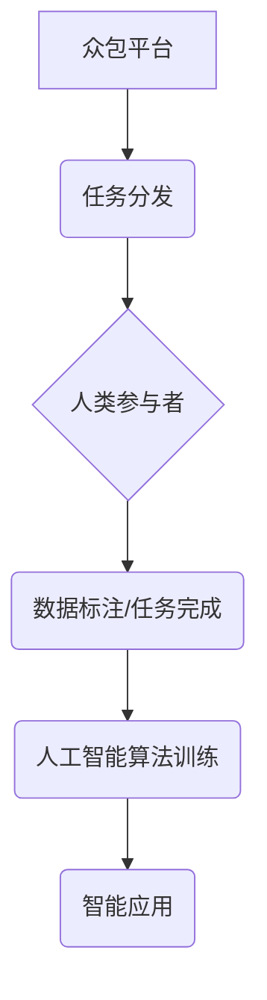

                 

## 众包的新前沿：人类计算

> 关键词：众包、人类计算、人工智能、机器学习、数据标注、任务分发、协作计算、云计算

### 1. 背景介绍

众包，即利用互联网平台将任务分发给大众参与完成，已成为一种新兴的商业模式和社会现象。从早期简单的问卷调查和数据收集，到如今涵盖图像识别、语音识别、文本翻译等复杂任务，众包的应用范围不断拓展。

人类计算，是指利用人类的智慧和认知能力来解决计算机难以处理的问题。它强调人类和机器的协同合作，将人类的优势与机器的计算能力相结合，从而实现更高效、更智能的计算。

近年来，随着人工智能和机器学习技术的快速发展，人类计算迎来了新的机遇。人工智能算法需要大量的数据进行训练，而众包平台可以提供海量的标注数据，为人工智能算法的训练和优化提供支持。同时，人类的判断力和创造力在某些领域仍然不可替代，例如需要理解复杂语义、进行创意设计等。

### 2. 核心概念与联系

**2.1 核心概念**

* **众包 (Crowdsourcing):** 利用互联网平台将任务分发给大众参与完成，以获取更广泛的资源和智慧。
* **人类计算 (Human Computation):** 利用人类的智慧和认知能力来解决计算机难以处理的问题，强调人类和机器的协同合作。
* **人工智能 (Artificial Intelligence):** 使计算机能够像人类一样学习、推理和解决问题。
* **机器学习 (Machine Learning):** 一种人工智能技术，通过算法从数据中学习，不断改进其性能。

**2.2 架构关系**



**2.3 联系分析**

众包平台为人类计算提供了基础设施和资源，将任务分发给大众参与者，并收集他们的成果。这些成果，例如数据标注、文本分类等，可以作为人工智能算法的训练数据，从而推动人工智能技术的进步。

人工智能算法的不断发展，也为人类计算提供了更强大的工具和手段。例如，人工智能可以自动识别图像中的物体，帮助人类更快、更准确地完成数据标注任务。

### 3. 核心算法原理 & 具体操作步骤

**3.1 算法原理概述**

众包平台通常采用一些算法来管理任务分发、参与者匹配和结果评估。常见的算法包括：

* **任务分发算法:** 根据任务类型、参与者技能和可用时间等因素，将任务分配给合适的参与者。
* **参与者匹配算法:** 根据参与者的历史表现、技能水平和兴趣爱好等因素，将参与者与合适的任务匹配。
* **结果评估算法:** 对参与者完成的任务进行评估，识别高质量的结果并奖励参与者。

**3.2 算法步骤详解**

1. **任务发布:** 平台管理员发布任务，包括任务描述、要求、奖励等信息。
2. **参与者注册:** 潜在参与者注册平台账号，并填写个人信息、技能水平等。
3. **任务分配:** 平台根据任务分发算法，将任务分配给合适的参与者。
4. **任务完成:** 参与者完成任务并提交结果。
5. **结果评估:** 平台根据结果评估算法，对参与者完成的任务进行评估，并给予相应的奖励。
6. **反馈和改进:** 平台收集参与者反馈，并根据反馈信息改进任务设计、算法参数等。

**3.3 算法优缺点**

* **优点:** 能够有效利用大众的智慧和资源，降低任务成本，提高任务效率。
* **缺点:** 难以保证所有参与者的诚信和工作质量，需要建立有效的激励机制和质量控制机制。

**3.4 算法应用领域**

* **数据标注:** 为人工智能算法提供训练数据。
* **文本分类:** 将文本分类到不同的类别。
* **图像识别:** 识别图像中的物体和场景。
* **语音识别:** 将语音转换为文本。
* **创意设计:** 利用大众的创意和灵感进行设计。

### 4. 数学模型和公式 & 详细讲解 & 举例说明

**4.1 数学模型构建**

众包平台的效率可以被视为一个函数，其输入是任务数量、参与者数量、任务复杂度等因素，输出是完成任务的时间和成本。

我们可以用以下数学模型来表示：

$$Efficiency = f(Task\_Number, Worker\_Number, Task\_Complexity)$$

其中：

* **Efficiency:** 效率，可以表示为完成任务的时间或成本。
* **Task\_Number:** 任务数量。
* **Worker\_Number:** 参与者数量。
* **Task\_Complexity:** 任务复杂度。

**4.2 公式推导过程**

我们可以通过分析任务分发、参与者匹配和结果评估等环节，推导具体的公式。例如，任务分发算法可以根据参与者的技能水平和任务复杂度，计算每个参与者完成任务的预期时间，并选择完成时间最短的参与者进行分配。

**4.3 案例分析与讲解**

假设一个众包平台需要标注1000张图片，每个图片需要标注5个物体。平台有100个参与者，每个参与者每小时可以标注50张图片。

根据上述模型，我们可以计算出完成任务的预期时间：

$$Time = \frac{Task\_Number}{Worker\_Number * Hourly\_Rate}$$

$$Time = \frac{1000}{100 * 50} = 0.2 \ hours$$

即，预计需要0.2小时才能完成所有任务。

### 5. 项目实践：代码实例和详细解释说明

**5.1 开发环境搭建**

* **操作系统:** Linux/macOS/Windows
* **编程语言:** Python
* **框架:** Flask/Django
* **数据库:** MySQL/PostgreSQL

**5.2 源代码详细实现**

```python
from flask import Flask, request, jsonify

app = Flask(__name__)

# 任务列表
tasks = [
    {
        'id': 1,
        'title': '标注图片',
        'description': '标注100张图片中的物体',
        'reward': 10
    }
]

@app.route('/tasks', methods=['GET'])
def get_tasks():
    return jsonify({'tasks': tasks})

@app.route('/tasks/<int:task_id>', methods=['GET'])
def get_task(task_id):
    task = next((task for task in tasks if task['id'] == task_id), None)
    if task:
        return jsonify({'task': task})
    else:
        return jsonify({'error': '任务不存在'}), 404

if __name__ == '__main__':
    app.run(debug=True)
```

**5.3 代码解读与分析**

* 该代码实现了一个简单的众包平台API，可以获取任务列表和单个任务信息。
* `tasks` 列表存储了平台上的所有任务，每个任务包含id、标题、描述和奖励等信息。
* `get_tasks()` 函数返回所有任务列表。
* `get_task()` 函数根据任务id返回单个任务信息。

**5.4 运行结果展示**

运行该代码后，可以访问以下API接口：

* `http://127.0.0.1:5000/tasks`: 获取所有任务列表。
* `http://127.0.0.1:5000/tasks/1`: 获取任务id为1的任务信息。

### 6. 实际应用场景

**6.1 数据标注**

众包平台可以用于标注图像、文本、音频等数据，为人工智能算法提供训练数据。例如，可以利用众包平台标注交通场景中的车辆、行人等物体，用于训练自动驾驶算法。

**6.2 文本分类**

众包平台可以用于分类文本，例如新闻文章、社交媒体帖子等。可以利用众包平台将文本分类到不同的类别，例如体育、财经、娱乐等，用于新闻聚合、广告投放等应用。

**6.3 翻译任务**

众包平台可以用于翻译文本，例如将英文文档翻译成中文。可以利用众包平台的参与者进行翻译，并通过机器翻译算法进行校对和优化。

**6.4 创意设计**

众包平台可以用于创意设计，例如设计logo、海报、产品包装等。可以利用众包平台的参与者进行设计，并通过投票机制选择最佳方案。

**6.5 未来应用展望**

随着人工智能技术的不断发展，众包平台在人类计算领域的应用将更加广泛。例如，可以利用众包平台进行科学研究、医疗诊断、法律判决等领域的人类计算。

### 7. 工具和资源推荐

**7.1 学习资源推荐**

* **书籍:**
    * 《众包：利用互联网的力量，完成任何事情》
    * 《人类计算：人工智能的未来》
* **在线课程:**
    * Coursera: 人工智能
    * edX: 人工智能与机器学习

**7.2 开发工具推荐**

* **众包平台:** Amazon Mechanical Turk, Upwork, Clickworker
* **编程语言:** Python, JavaScript
* **框架:** Flask, Django

**7.3 相关论文推荐**

* **Human Computation: A Survey**
* **Crowdsourcing for Artificial Intelligence**

### 8. 总结：未来发展趋势与挑战

**8.1 研究成果总结**

众包和人类计算已经取得了显著的成果，在数据标注、文本分类、翻译等领域发挥着重要作用。人工智能算法的不断发展，为人类计算提供了更强大的工具和手段。

**8.2 未来发展趋势**

* **更智能的算法:** 未来，众包平台将采用更智能的算法，例如强化学习算法，以提高任务分配、参与者匹配和结果评估的效率。
* **更丰富的应用场景:** 人类计算将应用于更多领域，例如科学研究、医疗诊断、法律判决等。
* **更安全的平台:** 为了保障参与者的权益和数据安全，众包平台将更加注重安全性和隐私保护。

**8.3 面临的挑战**

* **数据质量控制:** 众包平台需要建立有效的机制来保证数据质量，避免低质量数据影响人工智能算法的训练和性能。
* **参与者激励机制:** 需要设计有效的激励机制，鼓励参与者积极完成任务，并提高任务完成的质量。
* **伦理问题:** 人类计算涉及到伦理问题，例如数据隐私、算法偏见等，需要进行深入研究和探讨。

**8.4 研究展望**

未来，人类计算将继续发展，并与人工智能技术深度融合，为人类社会带来更多价值。需要加强对人类计算的理论研究和实践探索，解决面临的挑战，推动人类计算的健康发展。

### 9. 附录：常见问题与解答

**9.1 如何注册众包平台？**

大多数众包平台都提供简单的注册流程，通常需要填写个人信息、技能水平等信息。

**9.2 如何找到合适的任务？**

众包平台通常提供任务搜索功能，可以根据任务类型、奖励等条件进行筛选。

**9.3 如何保证任务质量？**

众包平台通常采用一些机制来保证任务质量，例如任务评分、参与者评价等。

**9.4 如何获得奖励？**

完成任务后，平台会根据预设的奖励机制向参与者支付奖励。

**9.5 众包平台有哪些安全风险？**

众包平台存在一些安全风险，例如数据泄露、诈骗等，需要参与者提高警惕，保护个人信息和财产安全。


作者：禅与计算机程序设计艺术 / Zen and the Art of Computer Programming 
<end_of_turn>

