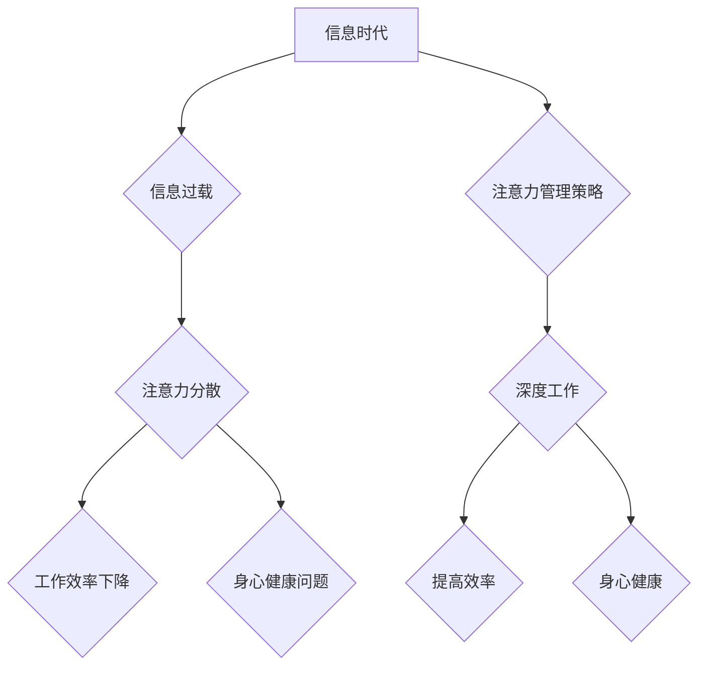

                 

## 信息时代的注意力管理策略与实践：在干扰和信息过载中航行

> 关键词：注意力管理、信息过载、干扰、认知科学、效率提升、专注力训练、深度工作、数字素养

### 1. 背景介绍

在当今信息爆炸的时代，我们被来自各个方向的信息和干扰所包围。智能手机、社交媒体、电子邮件、即时通讯软件等数字化工具，虽然极大地便利了我们的生活，但也带来了前所未有的信息过载和注意力分散。

注意力，是人类认知的核心能力之一，它决定了我们能够有效地处理信息、学习新知识、完成任务的能力。然而，在信息时代，我们的注意力受到前所未有的挑战。研究表明，人类的平均注意力持续时间已经从过去几分钟缩短到几秒钟，我们更容易被各种信息碎片所吸引，难以集中精力完成重要的事情。

信息过载和注意力分散不仅影响了我们的工作效率和学习效果，也损害了我们的身心健康。长期处于注意力分散的状态下，会导致焦虑、压力、睡眠障碍等问题。因此，学习有效的注意力管理策略，在信息时代保持专注力，对于个人和社会的发展都至关重要。

### 2. 核心概念与联系

**2.1  注意力机制**

注意力机制是近年来深度学习领域的重要突破，它模拟了人类的注意力机制，能够帮助模型聚焦于输入数据中最重要的部分，从而提高学习效率和准确性。

**2.2  信息过载**

信息过载是指在短时间内接收和处理的信息量超过了认知能力的极限，导致信息处理效率下降，注意力分散，甚至产生心理压力。

**2.3  干扰**

干扰是指任何阻碍我们集中注意力、完成任务的因素，包括来自外部环境的噪音、来自内部思绪的杂念，以及来自数字化工具的信息推送等。

**2.4  深度工作**

深度工作是指在不受干扰的情况下，专注于一项重要任务，投入全部精力进行思考和创作，以获得最佳的成果。

**2.5  数字素养**

数字素养是指在数字时代能够有效地获取、评估、利用和创造信息的能力，以及能够在数字环境中安全、健康地生活和工作的能力。

**Mermaid 流程图**



### 3. 核心算法原理 & 具体操作步骤

**3.1  算法原理概述**

注意力管理算法的核心原理是通过识别和过滤干扰，帮助用户集中注意力于重要任务。这些算法通常基于以下几个方面：

* **时间管理:** 通过番茄工作法、时间阻塞等方法，将时间划分为专注工作和休息时间的块，帮助用户保持专注力。
* **环境控制:** 通过减少外部干扰，例如关闭通知、使用降噪耳机等，创造一个专注的工作环境。
* **认知训练:** 通过冥想、正念练习等方法，增强用户的注意力控制能力。
* **信息过滤:** 通过智能筛选工具，过滤掉不重要的信息，只保留用户真正需要的信息。

**3.2  算法步骤详解**

1. **环境评估:** 首先，算法需要评估用户的当前环境，识别潜在的干扰因素。例如，手机通知、邮件提醒、社交媒体推送等。
2. **任务优先级排序:** 算法需要根据用户的任务清单，对任务进行优先级排序，帮助用户确定当前需要专注的任务。
3. **干扰过滤:** 算法会根据环境评估和任务优先级，过滤掉不重要的信息和干扰，只保留与当前任务相关的关键信息。
4. **专注时间分配:** 算法会根据用户的专注能力和任务难度，分配专注工作和休息时间的块，帮助用户保持最佳的专注状态。
5. **反馈机制:** 算法会根据用户的反馈，不断调整过滤规则和时间分配策略，以提高注意力管理的效率。

**3.3  算法优缺点**

**优点:**

* 可以有效地减少干扰，提高专注力。
* 可以帮助用户更好地管理时间，提高工作效率。
* 可以增强用户的认知能力，提高学习效果。

**缺点:**

* 需要用户配合使用，才能达到最佳效果。
* 算法的准确性依赖于用户的输入和反馈。
* 过度依赖算法可能会导致用户失去自主控制能力。

**3.4  算法应用领域**

注意力管理算法可以应用于以下领域:

* **学习和教育:** 帮助学生集中注意力，提高学习效率。
* **工作和办公:** 帮助员工减少干扰，提高工作效率。
* **健康和医疗:** 帮助患者缓解焦虑和压力，改善睡眠质量。
* **游戏和娱乐:** 帮助玩家沉浸在游戏世界中，提高游戏体验。

### 4. 数学模型和公式 & 详细讲解 & 举例说明

**4.1  数学模型构建**

注意力机制的数学模型通常基于概率论和线性代数。一个典型的注意力机制模型可以表示为：

$$
\text{Attention}(Q, K, V) = \text{softmax}\left(\frac{Q K^T}{\sqrt{d_k}}\right) V
$$

其中：

* $Q$：查询向量，表示用户当前关注的输入信息。
* $K$：键向量，表示所有输入信息的特征向量。
* $V$：值向量，表示所有输入信息的具体内容。
* $d_k$：键向量的维度。
* $\text{softmax}$：softmax函数，用于将键向量之间的相似度转换为概率分布。

**4.2  公式推导过程**

注意力机制的公式推导过程主要基于以下几个步骤：

1. 计算查询向量 $Q$ 和键向量 $K$ 之间的点积，得到一个相似度矩阵。
2. 对相似度矩阵进行归一化，得到一个概率分布。
3. 将概率分布与值向量 $V$ 进行加权求和，得到最终的注意力输出。

**4.3  案例分析与讲解**

例如，在机器翻译任务中，注意力机制可以帮助模型关注源语言句子中与目标语言句子相关的关键词，从而提高翻译的准确性。

### 5. 项目实践：代码实例和详细解释说明

**5.1  开发环境搭建**

* 操作系统：Windows/macOS/Linux
* 编程语言：Python
* 库依赖：TensorFlow/PyTorch

**5.2  源代码详细实现**

```python
import tensorflow as tf

# 定义注意力机制模型
class Attention(tf.keras.layers.Layer):
    def __init__(self, units):
        super(Attention, self).__init__()
        self.W1 = tf.keras.layers.Dense(units)
        self.W2 = tf.keras.layers.Dense(units)
        self.V = tf.keras.layers.Dense(1)

    def call(self, query, key, value):
        # 计算注意力权重
        scores = tf.matmul(self.W1(query), self.W2(key), transpose_b=True)
        scores = self.V(scores)
        attention_weights = tf.nn.softmax(scores, axis=-1)

        # 计算加权求和
        context_vector = tf.matmul(attention_weights, value)
        return context_vector
```

**5.3  代码解读与分析**

* `Attention` 类定义了一个注意力机制模型。
* `__init__` 方法初始化模型参数，包括三个稠密层 `W1`、`W2` 和 `V`。
* `call` 方法实现注意力机制的计算过程，包括计算注意力权重和加权求和。

**5.4  运行结果展示**

运行上述代码，可以得到注意力权重和上下文向量，并将其可视化，观察注意力机制是如何聚焦于输入信息中重要部分的。

### 6. 实际应用场景

**6.1  工作场景**

* **深度工作:** 使用注意力管理工具，屏蔽干扰，专注于重要的工作任务，提高工作效率。
* **项目管理:** 利用注意力管理算法，优先处理重要项目，避免信息过载导致的决策失误。
* **团队协作:** 通过注意力管理工具，提高团队成员的专注力，促进高效协作。

**6.2  学习场景**

* **在线学习:** 使用注意力管理工具，屏蔽社交媒体和游戏等干扰，专注于学习内容，提高学习效率。
* **阅读理解:** 利用注意力机制，帮助用户识别文本中的关键信息，提高阅读理解能力。
* **考试备考:** 通过注意力管理训练，增强用户的专注力，提高考试成绩。

**6.3  生活场景**

* **冥想练习:** 使用注意力管理应用，引导用户专注于呼吸和身体感受，缓解压力，改善睡眠质量。
* **社交互动:** 利用注意力管理工具，避免过度使用社交媒体，提高现实生活中的社交质量。
* **健康管理:** 通过注意力管理训练，增强用户的自我意识，帮助用户养成健康的生活习惯。

**6.4  未来应用展望**

随着人工智能技术的不断发展，注意力管理技术将应用于更广泛的领域，例如：

* **个性化教育:** 根据学生的注意力特点，定制个性化的学习方案。
* **精准医疗:** 利用注意力机制，帮助医生识别患者的病情和治疗方案。
* **增强现实:** 通过注意力管理技术，增强用户在虚拟环境中的沉浸感和交互体验。

### 7. 工具和资源推荐

**7.1  学习资源推荐**

* **书籍:**

    * 《深度学习》
    * 《注意力机制》
    * 《信息时代的心理学》

* **在线课程:**

    * Coursera: 深度学习
    * edX: 人工智能
    * Udacity: 机器学习工程师

**7.2  开发工具推荐**

* **TensorFlow:** 开源深度学习框架
* **PyTorch:** 开源深度学习框架
* **Keras:** 高级深度学习API

**7.3  相关论文推荐**

* 《Attention Is All You Need》
* 《BERT: Pre-training of Deep Bidirectional Transformers for Language Understanding》
* 《Transformer-XL: Attentive Language Models Beyond a Fixed-Length Context》

### 8. 总结：未来发展趋势与挑战

**8.1  研究成果总结**

近年来，注意力机制在深度学习领域取得了显著的成果，并在机器翻译、文本摘要、图像识别等领域取得了突破性的进展。注意力管理算法也逐渐成为提高用户注意力和效率的重要工具。

**8.2  未来发展趋势**

* **更强大的注意力机制:** 研究人员将继续探索更强大的注意力机制，例如自注意力、多头注意力等，以提高模型的学习能力和泛化能力。
* **个性化注意力管理:** 基于用户的注意力特点和需求，开发个性化的注意力管理工具和策略。
* **跨模态注意力:** 研究跨模态注意力机制，例如文本-图像注意力、文本-音频注意力等，以更好地理解和处理多模态信息。

**8.3  面临的挑战**

* **数据隐私:** 注意力管理算法需要收集用户的注意力数据，如何保护用户的隐私安全是一个重要的挑战。
* **算法可解释性:** 注意力机制的决策过程往往是复杂的，如何提高算法的可解释性，让用户更好地理解算法是如何工作的，也是一个重要的研究方向。
* **伦理问题:** 注意力管理技术可能会被滥用，例如用于操控用户行为，因此需要关注其伦理问题，确保其应用在人类福祉方面。

**8.4  研究展望**

未来，注意力管理技术将继续发展，并应用于更广泛的领域，为人类带来更多便利和福祉。


### 9. 附录：常见问题与解答

**9.1  Q: 如何提高我的注意力集中力？**

**A:** 

* **环境控制:** 尽量减少干扰，例如关闭手机通知、使用降噪耳机等。
* **时间管理:** 使用番茄工作法等方法，将时间划分为专注工作和休息时间的块。
* **认知训练:** 通过冥想、正念练习等方法，增强用户的注意力控制能力。

**9.2  Q: 注意力管理工具有哪些？**

**A:** 

* **Freedom:** 屏蔽网站和应用程序，帮助用户专注于工作。
* **Forest:** 通过种植虚拟树木来激励用户专注工作，避免使用手机。
* **Noisli:** 提供各种自然声音和白噪音，帮助用户集中注意力。

**9.3  Q: 注意力管理技术有哪些伦理问题？**

**A:** 

* **用户隐私:** 注意力管理算法需要收集用户的注意力数据，如何保护用户的隐私安全是一个重要的挑战。
* **信息操控:** 注意力管理技术可能会被滥用，例如用于操控用户行为，因此需要关注其伦理问题，确保其应用在人类福祉方面。


作者：禅与计算机程序设计艺术 / Zen and the Art of Computer Programming 
<end_of_turn>

