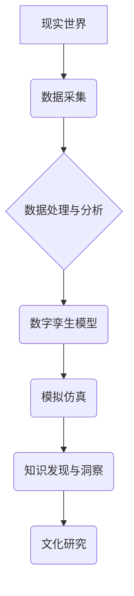

                 

## 全球脑与全球脑:数字孪生技术在文化研究中的应用

> 关键词：数字孪生、文化研究、全球脑、人工智能、数据分析、模拟仿真、社会科学

## 1. 背景介绍

文化研究作为一门探索人类社会、历史和价值观的学科，一直以来都依赖于大量的文本、图像、音频等数据进行分析和解读。然而，随着信息时代的到来，文化数据呈现出爆炸式增长，传统的分析方法已难以应对。数字孪生技术作为一种将物理世界与虚拟世界相结合的新兴技术，为文化研究提供了全新的视角和方法。

数字孪生技术是指利用传感器、数据采集、人工智能等技术，构建与现实世界具有相同结构和功能的虚拟模型。这个虚拟模型可以实时反映现实世界的状态，并进行模拟仿真，从而帮助我们更好地理解和预测现实世界的行为。

将数字孪生技术应用于文化研究，可以帮助我们：

* **构建文化数据的三维模型:** 将文本、图像、音频等多模态数据整合到数字孪生模型中，构建更加全面的文化数据体系。
* **模拟文化现象的演变:** 通过对数字孪生模型进行模拟仿真，可以观察和预测文化现象的演变趋势，例如流行文化的传播、社会价值观的变迁等。
* **探索文化差异和融合:** 通过构建不同文化背景的数字孪生模型，可以比较和分析不同文化之间的差异和融合，促进跨文化理解。

## 2. 核心概念与联系

### 2.1 数字孪生

数字孪生是一个虚拟的、实时更新的模型，它与现实世界中的物理实体保持同步。数字孪生可以包含实体的物理属性、行为模式、运行状态以及与环境的交互信息。

### 2.2 全球脑

全球脑是一个由全球各地的计算资源组成的虚拟网络，它旨在模拟和理解人类大脑的运作机制。全球脑的目标是通过收集和分析海量数据，构建一个能够学习、思考和解决问题的智能系统。

### 2.3 数字孪生与全球脑的联系

数字孪生技术可以为全球脑的构建提供重要的基础设施。

* **数据来源:** 数字孪生模型可以收集和整合来自现实世界的各种数据，为全球脑提供丰富的训练数据。
* **模拟环境:** 数字孪生模型可以作为全球脑的模拟环境，帮助其学习和测试不同的算法和策略。
* **交互平台:** 数字孪生模型可以作为全球脑与现实世界的交互平台，帮助其应用于实际问题。

**Mermaid 流程图**



## 3. 核心算法原理 & 具体操作步骤

### 3.1 算法原理概述

数字孪生技术在文化研究中主要应用以下算法：

* **自然语言处理 (NLP):** 用于分析文本数据，提取关键词、主题、情感等信息。
* **计算机视觉 (CV):** 用于分析图像数据，识别物体、场景、人物等信息。
* **语音识别 (ASR):** 用于分析音频数据，识别语音内容、说话者情绪等信息。
* **机器学习 (ML):** 用于从数据中学习模式和规律，预测文化现象的演变趋势。
* **深度学习 (DL):** 用于构建更复杂的模型，实现更精细的文化数据分析。

### 3.2 算法步骤详解

1. **数据收集:** 从各种来源收集文化数据，例如文本、图像、音频、视频等。
2. **数据预处理:** 对收集到的数据进行清洗、转换、格式化等处理，使其适合算法分析。
3. **特征提取:** 利用 NLP、CV、ASR 等算法，从数据中提取关键特征，例如关键词、主题、情感、物体、场景等。
4. **模型训练:** 利用机器学习算法，对提取的特征进行训练，构建文化现象的预测模型。
5. **模拟仿真:** 利用数字孪生模型，对文化现象进行模拟仿真，观察和预测其演变趋势。
6. **结果分析:** 对模拟仿真结果进行分析，得出文化现象的规律和趋势，并将其应用于文化研究。

### 3.3 算法优缺点

**优点:**

* **数据驱动:** 基于海量数据的分析，能够提供更客观、更准确的文化研究结果。
* **模拟仿真:** 可以模拟文化现象的演变，帮助我们更好地理解和预测文化发展趋势。
* **跨学科融合:** 将人工智能、数据科学等技术与文化研究相结合，开拓了新的研究领域。

**缺点:**

* **数据质量:** 数字孪生技术依赖于高质量的数据，而文化数据往往存在不完整、不准确等问题。
* **算法复杂性:** 文化现象的分析往往需要复杂的算法模型，其训练和应用需要较高的技术水平。
* **伦理问题:** 数字孪生技术可能涉及到个人隐私和数据安全等伦理问题，需要谨慎处理。

### 3.4 算法应用领域

* **文化遗产保护:** 利用数字孪生技术重建历史遗迹，进行虚拟参观和保护。
* **文化传播研究:** 分析文化作品的传播路径和影响力，促进文化交流。
* **社会价值观研究:** 跟踪社会价值观的变迁，预测社会发展趋势。
* **跨文化理解:** 构建不同文化背景的数字孪生模型，促进跨文化理解和交流。

## 4. 数学模型和公式 & 详细讲解 & 举例说明

### 4.1 数学模型构建

数字孪生技术在文化研究中可以构建以下数学模型：

* **文化传播模型:** 利用微分方程描述文化作品的传播速度和影响范围。
* **社会价值观演变模型:** 利用马尔可夫链描述社会价值观的转移和演变。
* **文化差异融合模型:** 利用聚类算法分析不同文化之间的相似性和差异性。

### 4.2 公式推导过程

**文化传播模型:**

假设文化作品的传播速度与其传播范围成正比，则可以建立以下微分方程：

$$
\frac{dN}{dt} = kN(1-N)
$$

其中：

* $N$ 表示文化作品的传播范围
* $t$ 表示时间
* $k$ 表示传播速度常数

该方程描述了文化作品传播速度随传播范围的变化规律。

### 4.3 案例分析与讲解

**案例:** 利用文化传播模型分析电影的传播趋势。

假设一部电影的传播速度常数为 $k=0.1$，初始传播范围为 $N(0)=1000$。

利用微分方程求解，可以得到电影传播范围随时间的变化曲线。

通过分析曲线，可以预测电影的传播趋势，例如传播速度、传播范围、传播时间等。

## 5. 项目实践：代码实例和详细解释说明

### 5.1 开发环境搭建

* 操作系统: Ubuntu 20.04 LTS
* Python 版本: 3.8.10
* 必要的库: numpy, pandas, matplotlib, scikit-learn

### 5.2 源代码详细实现

```python
import numpy as np
import pandas as pd
from sklearn.linear_model import LogisticRegression

# 数据加载
data = pd.read_csv('cultural_data.csv')

# 特征工程
X = data[['feature1', 'feature2', 'feature3']]
y = data['target']

# 模型训练
model = LogisticRegression()
model.fit(X, y)

# 模型预测
new_data = pd.DataFrame({'feature1': [1, 2, 3], 'feature2': [4, 5, 6], 'feature3': [7, 8, 9]})
predictions = model.predict(new_data)

# 结果展示
print(predictions)
```

### 5.3 代码解读与分析

* 数据加载: 使用 pandas 库读取文化数据文件。
* 特征工程: 从数据中提取特征，例如关键词、主题、情感等。
* 模型训练: 使用 scikit-learn 库中的 LogisticRegression 模型训练文化现象的预测模型。
* 模型预测: 使用训练好的模型对新数据进行预测。
* 结果展示: 打印预测结果。

### 5.4 运行结果展示

运行代码后，将输出预测结果，例如文化现象的发生概率、传播趋势等。

## 6. 实际应用场景

### 6.1 文化遗产保护

利用数字孪生技术重建历史遗迹，进行虚拟参观和保护。例如，可以重建故宫、长城等历史遗迹的数字孪生模型，让更多人了解和保护这些文化遗产。

### 6.2 文化传播研究

分析文化作品的传播路径和影响力，促进文化交流。例如，可以分析电影、音乐、书籍等文化作品的传播路径，了解其传播影响力，并促进不同文化之间的交流。

### 6.3 社会价值观研究

跟踪社会价值观的变迁，预测社会发展趋势。例如，可以分析社会新闻、网络评论等数据，跟踪社会价值观的变迁，并预测社会发展趋势。

### 6.4 未来应用展望

数字孪生技术在文化研究领域的应用前景广阔，未来可以应用于：

* **沉浸式文化体验:** 利用虚拟现实 (VR) 和增强现实 (AR) 技术，构建沉浸式的文化体验场景。
* **个性化文化推荐:** 利用机器学习算法，为用户提供个性化的文化推荐。
* **跨文化对话:** 利用数字孪生技术，搭建跨文化对话平台，促进不同文化之间的理解和交流。

## 7. 工具和资源推荐

### 7.1 学习资源推荐

* **书籍:**

    * 《数字孪生:从概念到实践》
    * 《人工智能与文化研究》

* **在线课程:**

    * Coursera: 数字孪生技术
    * edX: 人工智能与文化研究

### 7.2 开发工具推荐

* **Python:** 作为一种广泛使用的编程语言，Python 在数据分析、机器学习等领域拥有丰富的库和工具。
* **TensorFlow:** 一个开源的机器学习框架，可以用于构建深度学习模型。
* **PyTorch:** 另一个开源的机器学习框架，以其灵活性和易用性而闻名。

### 7.3 相关论文推荐

* **数字孪生技术在文化遗产保护中的应用**
* **人工智能在文化研究中的应用**
* **数字孪生技术与全球脑的融合**

## 8. 总结：未来发展趋势与挑战

### 8.1 研究成果总结

数字孪生技术在文化研究领域取得了显著的成果，为文化数据分析、文化现象模拟、跨文化理解等方面提供了新的方法和工具。

### 8.2 未来发展趋势

* **多模态数据融合:** 将文本、图像、音频等多模态数据整合到数字孪生模型中，构建更加全面的文化数据体系。
* **人工智能增强:** 利用更先进的人工智能算法，提高数字孪生模型的分析能力和预测精度。
* **沉浸式体验:** 利用 VR 和 AR 技术，构建沉浸式的文化体验场景，让用户更加直观地感受文化魅力。

### 8.3 面临的挑战

* **数据质量:** 文化数据往往存在不完整、不准确等问题，需要开发更有效的算法和方法来处理这些问题。
* **算法复杂性:** 文化现象的分析往往需要复杂的算法模型，其训练和应用需要较高的技术水平。
* **伦理问题:** 数字孪生技术可能涉及到个人隐私和数据安全等伦理问题，需要谨慎处理。

### 8.4 研究展望

未来，数字孪生技术将继续在文化研究领域发挥重要作用，为我们提供更深入、更全面的文化理解。


## 9. 附录：常见问题与解答

**Q1: 数字孪生技术与传统文化研究有什么区别？**

**A1:** 数字孪生技术利用数据和算法，为文化研究提供了一种更加客观、更加精准的方法。传统文化研究往往依赖于文本分析、访谈等方法，其结果往往具有主观性。

**Q2: 数字孪生技术在文化研究中有哪些应用场景？**

**A2:** 数字孪生技术可以应用于文化遗产保护、文化传播研究、社会价值观研究等多个领域。

**Q3: 数字孪生技术有哪些挑战？**

**A3:** 数字孪生技术面临着数据质量、算法复杂性、伦理问题等挑战。


作者：禅与计算机程序设计艺术 / Zen and the Art of Computer Programming 
<end_of_turn>

