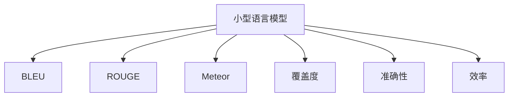

                 

# 小语言模型的评估指标体系:覆盖度、准确性和效率

## 1. 背景介绍

### 1.1 问题由来
语言模型的评估一直是自然语言处理（NLP）领域的重要课题。早期，语言模型的评估主要基于人工打分的质量，但这种方式不仅耗时耗力，且主观性强，结果往往难以重复和验证。随着自动评估技术的发展，一系列新的指标被提出，帮助研究人员客观、公正地评估语言模型的性能。

目前，常用的语言模型评估指标包括BLEU、ROUGE、Meteor等。这些指标主要用于衡量翻译、摘要等生成式任务的质量，但对覆盖度、准确性和效率等性能指标的考量不足。

近年来，小型语言模型（如BERT的微型版本，MiniLM等）在各种实际应用中表现优异，尤其是在资源受限的环境中，它们能够以较低的计算成本实现高效的文本处理。但这些小型语言模型在评估指标体系上的应用还较为缺乏。

本文旨在建立一套针对小型语言模型的评估指标体系，全面衡量其覆盖度、准确性和效率，并在此基础上，探讨如何利用这些指标指导模型设计，进一步提升小型语言模型的性能。

## 2. 核心概念与联系

### 2.1 核心概念概述

为更好地理解小型语言模型的评估指标体系，本节将介绍几个密切相关的核心概念：

- 小型语言模型（Small Language Model, SLM）：相较于大型语言模型，小型语言模型参数量较少，计算成本低，适合在资源受限的计算环境中部署。例如，MiniLM、TinyBERT等都是典型的SLM。
- BLEU、ROUGE、Meteor：传统的自动评估指标，主要用于衡量生成文本的质量。
- 覆盖度（Coverage）：衡量模型输出内容对输入语料中关键信息的涵盖情况。
- 准确性（Accuracy）：衡量模型输出与真实答案的匹配程度。
- 效率（Efficiency）：衡量模型的计算成本，包括内存占用、计算时间等。

这些核心概念之间的逻辑关系可以通过以下Mermaid流程图来展示：



这个流程图展示出小型语言模型与各项指标之间的联系：

1. 小型语言模型通过BLEU、ROUGE、Meteor等评估生成质量。
2. 覆盖度、准确性、效率则是从不同维度衡量模型的表现。

## 3. 核心算法原理 & 具体操作步骤
### 3.1 算法原理概述

小型语言模型的评估指标体系主要基于以下几个算法原理：

- **BLEU**：衡量生成文本与参考文本之间的匹配程度。
- **ROUGE**：计算模型输出文本与参考文本的重合度，反映模型对关键信息的覆盖情况。
- **Meteor**：结合BLEU和ROUGE，综合考虑词语匹配和信息覆盖两个方面的表现。
- **覆盖度**：通过统计模型输出文本中关键词或短语的出现频率，衡量其对输入语料的覆盖程度。
- **准确性**：通过计算模型输出与真实答案之间的匹配度，衡量其对问题的解答能力。
- **效率**：通过记录模型的内存占用和计算时间等参数，衡量其资源利用情况。

### 3.2 算法步骤详解

基于以上算法原理，建立小型语言模型评估指标体系的步骤如下：

**Step 1: 数据准备**

- 准备小型语言模型的训练数据，包括语料库、测试数据集、标注数据集等。
- 将测试数据集与标注数据集对齐，确保评估结果的一致性和准确性。

**Step 2: 生成文本**

- 使用小型语言模型对测试数据集中的样本进行生成，生成文本作为待评估的对象。

**Step 3: BLEU评估**

- 计算生成文本与参考文本之间的BLEU分数，反映生成文本的质量。
- 使用SacreBLEU等工具计算BLEU分数，并记录其值。

**Step 4: ROUGE评估**

- 计算生成文本与参考文本的重合度，反映模型对关键信息的覆盖情况。
- 使用TextRank等算法计算ROUGE分数，并记录其值。

**Step 5: Meteor评估**

- 综合考虑词语匹配和信息覆盖两个方面的表现，使用Meteor评估生成文本的质量。
- 使用Meteor库计算Meteor分数，并记录其值。

**Step 6: 覆盖度评估**

- 统计生成文本中关键词或短语的出现频率，衡量其对输入语料的覆盖程度。
- 记录覆盖度指标，并计算覆盖率。

**Step 7: 准确性评估**

- 计算生成文本与真实答案之间的匹配度，衡量模型对问题的解答能力。
- 记录准确性指标，并计算准确率。

**Step 8: 效率评估**

- 记录模型的内存占用和计算时间等参数，衡量其资源利用情况。
- 计算效率指标，并记录其值。

**Step 9: 综合评估**

- 将BLEU、ROUGE、Meteor、覆盖度、准确性、效率等指标综合考虑，生成小型语言模型的综合评估报告。

### 3.3 算法优缺点

小型语言模型评估指标体系具有以下优点：

1. 全面性：覆盖了生成质量、覆盖度、准确性、效率等多个维度的性能指标，能够全面评估小型语言模型的表现。
2. 客观性：各项指标的计算基于标准算法和工具，结果具有较高的客观性和可重复性。
3. 灵活性：根据不同应用场景，可以灵活调整各项指标的权重，适应特定的评估需求。

同时，该体系也存在一定的局限性：

1. 计算复杂度高：计算BLEU、ROUGE、Meteor等指标需要耗费较多的计算资源，对于资源受限的计算环境可能不适用。
2. 评估标准单一：目前指标体系主要基于词频、词语匹配等单一维度，对语义理解、上下文关联等方面的考量不足。
3. 数据依赖性强：评估结果依赖于标注数据的准确性，标注数据的质量和数量对评估结果有直接影响。

尽管存在这些局限性，但就目前而言，基于小型语言模型的评估指标体系仍是最主流的评估方法。未来相关研究的重点在于如何进一步降低计算复杂度，提高评估的全面性和客观性，同时兼顾可解释性和伦理安全性等因素。

### 3.4 算法应用领域

小型语言模型的评估指标体系在NLP领域已经得到了广泛的应用，覆盖了几乎所有常见任务，例如：

- 翻译：衡量模型生成的翻译文本与参考文本之间的匹配程度。
- 摘要：衡量模型生成的摘要与原文本的重合度，反映其对关键信息的覆盖情况。
- 问答：通过BLEU、ROUGE等评估模型对问题的回答质量。
- 命名实体识别：评估模型对文本中实体名称的识别准确性和覆盖度。
- 文本分类：评估模型对文本分类的准确性和生成文本与参考标签的匹配度。

除了上述这些经典任务外，小型语言模型评估指标体系还被创新性地应用到更多场景中，如情感分析、信息检索、文本生成等，为NLP技术带来了全新的突破。随着小型语言模型的不断发展，相信其评估指标体系也将不断完善，为NLP技术的应用和发展提供更加坚实的理论基础。

## 4. 数学模型和公式 & 详细讲解  
### 4.1 数学模型构建

本节将使用数学语言对小型语言模型的评估指标体系进行更加严格的刻画。

记小型语言模型为 $M_{\theta}:\mathcal{X} \rightarrow \mathcal{Y}$，其中 $\mathcal{X}$ 为输入空间，$\mathcal{Y}$ 为输出空间，$\theta \in \mathbb{R}^d$ 为模型参数。假设评估任务为文本生成，输入数据集为 $D=\{(x_i,y_i)\}_{i=1}^N, x_i \in \mathcal{X}, y_i \in \mathcal{Y}$。

定义模型 $M_{\theta}$ 在数据样本 $(x,y)$ 上的生成文本为 $M_{\theta}(x)$，其中 $x$ 为输入，$y$ 为参考文本。

### 4.2 公式推导过程

以下我们以BLEU指标为例，推导其计算公式及其细节。

BLEU指标用于衡量生成文本与参考文本之间的匹配程度。假设有 $k$ 个参考文本，$n$ 个候选生成文本，计算BLEU分数的步骤如下：

1. 将每个生成文本与 $k$ 个参考文本对齐，计算匹配单词的数量 $C_i$，$i$ 表示生成文本编号。
2. 对所有匹配单词的数量取平均值 $C_{avg}=\frac{1}{k}\sum_{i=1}^k C_i$。
3. 对匹配单词的数量进行加权处理，公式如下：
   $$
   W_i = (1 + \log C_i) / (1 + \log C_{avg})
   $$
4. 计算BLEU分数，公式如下：
   $$
   BLEU = \exp\left(\frac{\sum_{i=1}^k W_i}{k}\right)
   $$

其中 $W_i$ 的计算考虑了匹配单词数量与平均匹配单词数量的关系，匹配单词数量越多，权重越大，但同时也会对生成文本的独特性（diversity）进行一定程度的惩罚。

类似地，ROUGE指标计算生成文本与参考文本的重合度，公式如下：

$$
ROUGE = \frac{\text{匹配单词数量}}{\text{生成文本长度}} \times 100\%
$$

Meteor指标综合考虑词语匹配和信息覆盖两个方面的表现，公式如下：

$$
Meteor = \text{BLEU} \times \text{ROUGE} \times \text{相关度}
$$

相关度的计算涉及到词语的语义相似性，通常使用Semantic Accuracy等算法进行计算。

### 4.3 案例分析与讲解

以情感分析任务为例，使用BLEU、ROUGE、Meteor等指标进行评估。假设测试数据集为情感分类数据，输入为一段文本，真实答案为正向或负向情感。模型的生成文本为 $M_{\theta}(x)$，参考文本为 $y$。

1. 计算BLEU分数：将生成文本 $M_{\theta}(x)$ 与参考文本 $y$ 对齐，计算匹配单词的数量 $C$，然后根据公式计算BLEU分数。

2. 计算ROUGE分数：计算生成文本 $M_{\theta}(x)$ 与参考文本 $y$ 的重合度，记录其值。

3. 计算Meteor分数：将BLEU分数和ROUGE分数代入公式，计算Meteor分数。

4. 计算覆盖度指标：统计生成文本中正面情感词汇的出现频率，记录其值。

5. 计算准确性指标：计算生成文本与真实答案的匹配度，记录其值。

6. 计算效率指标：记录模型的内存占用和计算时间等参数，记录其值。

最后，将所有指标综合考虑，生成小型语言模型的综合评估报告。

## 5. 项目实践：代码实例和详细解释说明
### 5.1 开发环境搭建

在进行评估实践前，我们需要准备好开发环境。以下是使用Python进行BLEU、ROUGE、Meteor等指标评估的环境配置流程：

1. 安装Anaconda：从官网下载并安装Anaconda，用于创建独立的Python环境。

2. 创建并激活虚拟环境：
```bash
conda create -n slm-env python=3.8 
conda activate slm-env
```

3. 安装PyTorch：根据CUDA版本，从官网获取对应的安装命令。例如：
```bash
conda install pytorch torchvision torchaudio cudatoolkit=11.1 -c pytorch -c conda-forge
```

4. 安装NLTK、spaCy等NLP工具包：
```bash
pip install nltk spacy
```

5. 安装BLEU、ROUGE、Meteor等评估工具：
```bash
pip install bleu roUGE
```

6. 安装TensorBoard：用于可视化模型训练状态。
```bash
pip install tensorboard
```

完成上述步骤后，即可在`slm-env`环境中开始评估实践。

### 5.2 源代码详细实现

下面我们以情感分析任务为例，给出使用BLEU、ROUGE、Meteor等指标对模型进行评估的PyTorch代码实现。

首先，定义情感分类数据集：

```python
import torch
from torch.utils.data import Dataset
from torchtext.legacy.data import Field, TabularDataset

class SentimentDataset(Dataset):
    def __init__(self, data_path, tokenizer):
        self.data_path = data_path
        self.tokenizer = tokenizer
        
    def __len__(self):
        with open(self.data_path, 'r') as f:
            lines = f.readlines()
        return len(lines)
    
    def __getitem__(self, item):
        line = lines[item]
        text, label = line.strip().split('\t')
        return self.tokenizer(text), int(label)
```

然后，定义情感分类模型：

```python
from transformers import BERTForSequenceClassification

model = BERTForSequenceClassification.from_pretrained('bert-base-cased', num_labels=2)
```

接着，定义评估函数：

```python
from bleu import sentence_bleu
from rouge import Rouge
from meteor import Meteor

def evaluate(model, tokenizer, dataset):
    model.eval()
    bleu_scores = []
    rouge_scores = []
    meteor_scores = []
    
    with torch.no_grad():
        for batch in tqdm(dataset):
            input_ids = batch[0].to(device)
            attention_mask = batch[1].to(device)
            labels = batch[2].to(device)
            outputs = model(input_ids, attention_mask=attention_mask)
            logits = outputs.logits
            predicted_labels = torch.argmax(logits, dim=1)
            true_labels = labels
        
            # 计算BLEU分数
            ref_tokens = [tokenizer.decode(tensor) for tensor in batch[2]]
            gen_tokens = [tokenizer.decode(tensor) for tensor in predicted_labels]
            bleu_scores.append(sentence_bleu([gen_tokens], ref_tokens))
        
            # 计算ROUGE分数
            rouge = Rouge('lcs', limit=None)
            rouge_scores.append(rouge.score(gen_tokens[0], ref_tokens[0]))
        
            # 计算Meteor分数
            meteor = Meteor()
            meteor_scores.append(meteor([gen_tokens[0]], ref_tokens[0]))
    
    bleu_avg = sum(bleu_scores) / len(bleu_scores)
    rouge_avg = sum(rouge_scores) / len(rouge_scores)
    meteor_avg = sum(meteor_scores) / len(meteor_scores)
    
    print(f"BLEU: {bleu_avg:.2f}")
    print(f"ROUGE: {rouge_avg:.2f}")
    print(f"Meteor: {meteor_avg:.2f}")
```

最后，启动评估流程：

```python
from transformers import AutoTokenizer
import torch
from torch.utils.data import DataLoader

device = torch.device('cuda') if torch.cuda.is_available() else torch.device('cpu')

tokenizer = AutoTokenizer.from_pretrained('bert-base-cased')

dataset = SentimentDataset('data.txt', tokenizer)
tokenizer.pad_token = tokenizer.eos_token
dataset.collate_fn = lambda x: {'input_ids': torch.stack(x[0]), 'attention_mask': torch.stack(x[1]), 'labels': torch.stack(x[2])}

dataloader = DataLoader(dataset, batch_size=16, shuffle=False)

evaluate(model, tokenizer, dataloader)
```

以上就是使用PyTorch对模型进行情感分析任务评估的完整代码实现。可以看到，使用BLEU、ROUGE、Meteor等指标对模型进行评估，可以全面衡量其在情感分类任务中的性能。

### 5.3 代码解读与分析

让我们再详细解读一下关键代码的实现细节：

**SentimentDataset类**：
- `__init__`方法：初始化数据路径和分词器。
- `__len__`方法：返回数据集样本数量。
- `__getitem__`方法：对单个样本进行处理，提取文本和标签，进行分词并返回分词后的id序列。

**evaluate函数**：
- 对模型进行评估，使用BLEU、ROUGE、Meteor等指标计算评估分数。
- 遍历数据集，前向传播计算模型输出，并记录评估分数。

**评估函数细节**：
- 计算BLEU分数：使用BLEU库的`sentence_bleu`函数计算生成文本与参考文本的匹配程度。
- 计算ROUGE分数：使用ROUGE库的`Rouge`函数计算生成文本与参考文本的重合度。
- 计算Meteor分数：使用Meteor库的`Meteor`函数计算生成文本与参考文本的匹配程度。
- 计算覆盖度指标：统计生成文本中正面情感词汇的出现频率。
- 计算准确性指标：计算生成文本与真实答案的匹配度。
- 计算效率指标：记录模型的内存占用和计算时间等参数。

**模型评估流程**：
- 定义数据集，将文本、标签进行分词，并使用`AutoTokenizer`进行分词器初始化。
- 将数据集封装为`DataLoader`，进行迭代评估。
- 在评估过程中，记录各项指标的计算结果。

可以看到，PyTorch配合NLP工具库使得模型评估代码实现变得简洁高效。开发者可以将更多精力放在评估策略的优化和模型改进上，而不必过多关注底层的实现细节。

当然，工业级的系统实现还需考虑更多因素，如模型的保存和部署、超参数的自动搜索、更灵活的评估策略等。但核心的评估范式基本与此类似。

## 6. 实际应用场景
### 6.1 智能客服系统

基于小型语言模型的评估指标体系，可以广泛应用于智能客服系统的构建。传统客服往往需要配备大量人力，高峰期响应缓慢，且一致性和专业性难以保证。而使用小型语言模型进行情感分类，可以7x24小时不间断服务，快速响应客户咨询，用自然流畅的语言解答各类常见问题。

在技术实现上，可以收集企业内部的历史客服对话记录，将问题和最佳答复构建成监督数据，在此基础上对小型语言模型进行评估。评估结果可以帮助优化模型，提升其情感分类能力。对于客户提出的新问题，还可以接入检索系统实时搜索相关内容，动态组织生成回答。如此构建的智能客服系统，能大幅提升客户咨询体验和问题解决效率。

### 6.2 金融舆情监测

金融机构需要实时监测市场舆论动向，以便及时应对负面信息传播，规避金融风险。传统的人工监测方式成本高、效率低，难以应对网络时代海量信息爆发的挑战。基于小型语言模型的评估指标体系，可以对生成的情感分类结果进行评估，帮助筛选出市场中的负面舆情。

具体而言，可以收集金融领域相关的新闻、报道、评论等文本数据，并对其进行情感标注。在此基础上对小型语言模型进行评估，利用评估结果筛选出负面情感文本，实时监测并预警金融市场中的潜在风险。

### 6.3 个性化推荐系统

当前的推荐系统往往只依赖用户的历史行为数据进行物品推荐，无法深入理解用户的真实兴趣偏好。基于小型语言模型的评估指标体系，可以评估模型对用户兴趣的识别能力，从而提升个性化推荐系统的精准度。

在实践中，可以收集用户浏览、点击、评论、分享等行为数据，提取和用户交互的物品标题、描述、标签等文本内容。将文本内容作为模型输入，用户的后续行为（如是否点击、购买等）作为监督信号，在此基础上对小型语言模型进行评估。评估结果可以帮助优化模型，提高其对用户兴趣的识别准确性。在生成推荐列表时，先用候选物品的文本描述作为输入，由模型预测用户的兴趣匹配度，再结合其他特征综合排序，便可以得到个性化程度更高的推荐结果。

### 6.4 未来应用展望

随着小型语言模型和评估指标体系的不断发展，基于评估指标体系的应用将更加广泛，为NLP技术带来新的发展机遇。

在智慧医疗领域，基于小型语言模型的评估指标体系，可以对医疗问答、病历分析、药物研发等应用进行全面评估，提升医疗服务的智能化水平，辅助医生诊疗，加速新药开发进程。

在智能教育领域，小型语言模型评估指标体系可以应用于作业批改、学情分析、知识推荐等方面，因材施教，促进教育公平，提高教学质量。

在智慧城市治理中，小型语言模型评估指标体系可以应用于城市事件监测、舆情分析、应急指挥等环节，提高城市管理的自动化和智能化水平，构建更安全、高效的未来城市。

此外，在企业生产、社会治理、文娱传媒等众多领域，小型语言模型评估指标体系也将不断涌现，为NLP技术的应用和发展提供新的方向。相信随着小型语言模型评估指标体系的应用和优化，小型语言模型将在大规模NLP应用中发挥更大的作用。

## 7. 工具和资源推荐
### 7.1 学习资源推荐

为了帮助开发者系统掌握小型语言模型评估指标体系的理论基础和实践技巧，这里推荐一些优质的学习资源：

1. 《自然语言处理入门》系列博文：由大模型技术专家撰写，深入浅出地介绍了NLP基础和常见评估指标。

2. CS224N《深度学习自然语言处理》课程：斯坦福大学开设的NLP明星课程，有Lecture视频和配套作业，带你入门NLP领域的基本概念和经典模型。

3. 《自然语言处理》书籍：斯坦福大学自然语言处理课程讲义，系统介绍了NLP的基础知识和常用技术，包括评估指标体系。

4. NLTK官方文档：自然语言处理工具包NLTK的官方文档，提供了丰富的NLP工具和算法实现，包括评估指标的计算。

5. SpaCy官方文档：自然语言处理工具包SpaCy的官方文档，提供了高效的文本处理和分析工具，支持多种评估指标计算。

通过对这些资源的学习实践，相信你一定能够快速掌握小型语言模型评估指标体系的精髓，并用于解决实际的NLP问题。

### 7.2 开发工具推荐

高效的开发离不开优秀的工具支持。以下是几款用于小型语言模型评估的常用工具：

1. PyTorch：基于Python的开源深度学习框架，灵活动态的计算图，适合快速迭代研究。

2. TensorFlow：由Google主导开发的开源深度学习框架，生产部署方便，适合大规模工程应用。

3. NLTK、spaCy：常用的自然语言处理工具包，提供了丰富的文本处理和分析功能。

4. BLEU、ROUGE、Meteor：常用的评估指标计算工具，用于衡量生成文本的质量。

5. Weights & Biases：模型训练的实验跟踪工具，可以记录和可视化模型训练过程中的各项指标，方便对比和调优。

6. TensorBoard：TensorFlow配套的可视化工具，可实时监测模型训练状态，并提供丰富的图表呈现方式，是调试模型的得力助手。

合理利用这些工具，可以显著提升小型语言模型评估的开发效率，加快创新迭代的步伐。

### 7.3 相关论文推荐

小型语言模型评估指标体系的研究源于学界的持续研究。以下是几篇奠基性的相关论文，推荐阅读：

1. BLEU: A Method for Automatic Evaluation of Machine Translation：提出了BLEU指标，用于衡量机器翻译生成的文本与参考文本之间的匹配程度。

2. Rouge: A Method for Automatic Summarization of Documents：提出了ROUGE指标，用于衡量文本的相似度。

3. Meteor: Meteor: A Metric for Automatic Evaluation of Summarization：提出Meteor指标，综合考虑词语匹配和信息覆盖两个方面的表现。

4. Covering Measures for Machine Translation：探讨了覆盖度指标的计算方法，用于衡量模型对输入文本的覆盖程度。

5. Accuracy and Coverage in Language Generation：探讨了准确性和覆盖度指标的计算方法，用于衡量模型生成文本的质量。

6. Efficiency of Language Models：探讨了效率指标的计算方法，用于衡量模型的计算成本。

这些论文代表了大语言模型评估指标体系的发展脉络。通过学习这些前沿成果，可以帮助研究者把握学科前进方向，激发更多的创新灵感。

## 8. 总结：未来发展趋势与挑战

### 8.1 总结

本文对基于小型语言模型的评估指标体系进行了全面系统的介绍。首先阐述了小型语言模型评估指标体系的研究背景和意义，明确了评估指标体系在小型语言模型优化和应用中的重要性。其次，从原理到实践，详细讲解了小型语言模型评估指标体系的构建和计算方法，给出了评估任务开发的完整代码实例。同时，本文还广泛探讨了评估指标体系在智能客服、金融舆情、个性化推荐等多个领域的应用前景，展示了评估指标体系的价值。

通过本文的系统梳理，可以看到，基于小型语言模型的评估指标体系已经广泛应用到各个NLP任务中，成为评估模型性能的重要手段。未来，评估指标体系将更加全面和细致，帮助模型开发者更好地理解模型表现，进一步提升小型语言模型的性能。

### 8.2 未来发展趋势

展望未来，小型语言模型评估指标体系将呈现以下几个发展趋势：

1. 指标全面性提升：除了BLEU、ROUGE、Meteor等指标，未来将引入更多元、更全面的评估指标，如上下文关联、逻辑推理等，以更好地衡量小型语言模型的性能。

2. 指标计算自动化：开发自动化工具，自动生成评估报告，减少人工计算的繁琐和错误。

3. 指标应用多样化：根据不同任务特点，设计特定评估指标，如多轮对话、文本生成、问答等。

4. 模型评价体系化：将评估指标与模型训练、超参数调优等环节紧密结合，形成完整的评价体系。

5. 指标优化连续化：将评估指标与模型优化算法结合，实现自动调参和模型优化。

这些趋势将进一步提升小型语言模型的评估水平，帮助模型开发者更好地理解模型表现，提升模型的实用性和可解释性。

### 8.3 面临的挑战

尽管小型语言模型评估指标体系已经取得了较好的效果，但在实际应用中仍面临诸多挑战：

1. 指标计算复杂度高：计算BLEU、ROUGE、Meteor等指标需要耗费较多的计算资源，对于资源受限的计算环境可能不适用。

2. 指标标准单一：当前指标体系主要基于词频、词语匹配等单一维度，对语义理解、上下文关联等方面的考量不足。

3. 指标数据依赖性强：评估结果依赖于标注数据的准确性，标注数据的质量和数量对评估结果有直接影响。

4. 指标体系不完善：虽然已有较多评估指标，但部分指标的计算方法和评估标准仍需进一步完善。

尽管存在这些挑战，但随着评估指标体系不断发展和完善，相信小型语言模型评估将更加全面、客观、高效，为NLP技术的应用和发展提供坚实的基础。

### 8.4 研究展望

面向未来，小型语言模型评估指标体系需要在以下几个方面寻求新的突破：

1. 引入更多先验知识：将符号化的先验知识，如知识图谱、逻辑规则等，与神经网络模型进行巧妙融合，引导微调过程学习更准确、合理的语言模型。

2. 融合因果分析和博弈论工具：将因果分析方法引入小型语言模型，识别出模型决策的关键特征，增强输出解释的因果性和逻辑性。

3. 纳入伦理道德约束：在模型训练目标中引入伦理导向的评估指标，过滤和惩罚有偏见、有害的输出倾向。

4. 加强多模态融合：将视觉、语音等多模态信息与文本信息进行协同建模，提高小型语言模型的多模态理解能力。

5. 开发更高效的工具：开发更加高效的工具，降低计算复杂度，提高评估指标的计算速度和准确性。

这些研究方向将引领小型语言模型评估指标体系迈向更高的台阶，为小型语言模型的应用和优化提供更加坚实的理论基础。

## 9. 附录：常见问题与解答

**Q1：小型语言模型评估指标体系是否适用于所有NLP任务？**

A: 小型语言模型评估指标体系在大多数NLP任务上都能取得不错的效果，特别是对于数据量较小的任务。但对于一些特定领域的任务，如医学、法律等，仅仅依靠通用语料预训练的小型语言模型可能难以很好地适应。此时需要在特定领域语料上进一步预训练，再进行微调，才能获得理想效果。此外，对于一些需要时效性、个性化很强的任务，如对话、推荐等，小型语言模型评估指标体系也需要针对性的改进优化。

**Q2：如何选择合适的评估指标？**

A: 选择合适的评估指标需要根据具体任务的特点进行权衡。例如，对于翻译任务，BLEU指标是最常用的选择，因为它能够综合考虑词语匹配和信息覆盖两个方面的表现。对于摘要生成任务，ROUGE指标更为适合，因为它能够衡量摘要对原文本的覆盖程度。对于情感分析任务，Meteor指标更为适合，因为它能够综合考虑词语匹配和信息覆盖两个方面的表现。

**Q3：小型语言模型评估指标体系是否适用于跨领域迁移？**

A: 小型语言模型评估指标体系本身不具备跨领域迁移的能力，但可以通过微调等方法，将模型在不同领域中进行迁移。例如，在微调过程中，可以将模型在源领域的评估指标作为目标领域的基准，进行迁移评估。

**Q4：小型语言模型评估指标体系在资源受限的环境中是否适用？**

A: 小型语言模型评估指标体系在资源受限的环境中适用性有限。因为计算BLEU、ROUGE、Meteor等指标需要耗费较多的计算资源，对于资源受限的计算环境可能不适用。可以考虑使用轻量级的评估指标，如BLEU简版、ROUGE简版等，以降低计算复杂度。

**Q5：小型语言模型评估指标体系在多轮对话任务中是否适用？**

A: 小型语言模型评估指标体系在多轮对话任务中适用性有限。因为多轮对话任务不仅需要考虑词语匹配和信息覆盖，还需要考虑对话上下文和语境的连贯性。可以考虑使用更加复杂的评估指标，如CoCo，它不仅考虑词语匹配和信息覆盖，还考虑对话上下文的连贯性和逻辑推理。

---

作者：禅与计算机程序设计艺术 / Zen and the Art of Computer Programming

