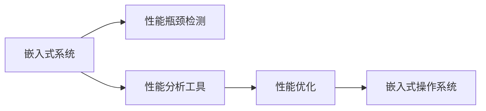

                 

# 嵌入式系统性能分析：识别瓶颈

在现代电子产品日益普及和复杂的今天，嵌入式系统成为了连接数字世界与物理世界的桥梁。它们不仅需要处理海量数据，还要确保实时性、可靠性，以及成本效益。嵌入式系统性能分析，对于识别系统瓶颈、优化资源分配、提升系统效能至关重要。本文将深入探讨嵌入式系统性能分析的核心概念、算法原理、操作步骤，并结合实际案例进行详细讲解，最后提出未来发展趋势和面临的挑战。

## 1. 背景介绍

### 1.1 问题由来

随着数字化进程的加快，嵌入式系统在医疗、汽车、智能家居等领域的应用日益广泛。然而，这些系统往往需要在有限的空间和能源约束下工作，处理能力有限。性能瓶颈问题变得尤为突出，如何准确识别和解决这些瓶颈，成为提升嵌入式系统性能的关键。

### 1.2 问题核心关键点

嵌入式系统性能分析的核心在于识别性能瓶颈、量化性能损失、优化系统资源分配。其主要问题点包括：

- 如何设计合适的性能分析工具和方法？
- 如何快速识别系统的瓶颈因素？
- 如何优化瓶颈以提升系统性能？
- 如何在优化过程中兼顾成本和功耗？

### 1.3 问题研究意义

准确识别和解决嵌入式系统的性能瓶颈，不仅有助于提高系统的响应速度和可靠性，还能延长系统的使用寿命，降低维护成本，为未来技术创新提供有力支撑。

## 2. 核心概念与联系

### 2.1 核心概念概述

为了更好地理解嵌入式系统性能分析，我们首先介绍几个关键概念：

- **嵌入式系统**：指运行特定程序的硬件系统，包括微控制器、微处理器、SoC等。它们通常具有资源有限、实时性要求高等特点。

- **性能瓶颈**：指嵌入式系统中的某个环节或组件，由于资源不足或设计不当，导致其性能明显低于其他部分，成为系统整体性能提升的障碍。

- **性能分析工具**：用于监测、分析和诊断嵌入式系统性能的工具，包括性能监控、瓶颈检测、性能建模等。

- **性能优化**：通过识别性能瓶颈，重新设计或调整系统配置，以提升整体性能。

- **嵌入式操作系统**：用于管理和调度嵌入式系统资源的操作系统，如FreeRTOS、uC/OS等。

这些概念之间的逻辑关系可以通过以下Mermaid流程图来展示：



## 3. 核心算法原理 & 具体操作步骤

### 3.1 算法原理概述

嵌入式系统性能分析的核心算法原理基于性能监控与瓶颈检测。其基本思路是通过实时监测系统资源使用情况，找出性能瓶颈点，并针对性地优化资源分配，以提升系统整体性能。

形式化地，假设嵌入式系统资源瓶颈出现在第i个组件上，资源消耗量为Ri，目标资源量为T。性能瓶颈的识别与优化可以表示为：

$$
R_i \geq T \Rightarrow \text{瓶颈检测} 
$$

$$
\max R_i \rightarrow \text{优化目标}
$$

在实际应用中，性能分析算法主要分为两个步骤：

1. **性能监控**：使用性能分析工具实时监测嵌入式系统的各个组件，收集其资源使用数据。
2. **瓶颈检测**：通过数据分析，识别出性能瓶颈点，并结合领域知识提出优化策略。

### 3.2 算法步骤详解

嵌入式系统性能分析的算法步骤可以分为以下几个阶段：

#### 3.2.1 性能监控

**步骤1: 配置性能监控工具**

- 选择适合的性能监控工具，如Valgrind、gperftools、DTrace等。
- 根据嵌入式系统特点，设置需要监测的资源类型，如CPU使用率、内存使用量、网络带宽等。

**步骤2: 部署性能监控工具**

- 将性能监控工具部署到嵌入式系统中，确保其能够正常运行并实时采集数据。

**步骤3: 数据采集与分析**

- 在一定时间内，采集嵌入式系统的资源使用数据，生成性能监控报告。
- 对采集的数据进行分析，找出异常点和高资源消耗组件。

#### 3.2.2 瓶颈检测

**步骤4: 识别瓶颈组件**

- 基于性能监控报告，结合领域知识，识别出资源使用异常的组件。
- 对瓶颈组件进行进一步的分析，确认是否确实存在性能瓶颈。

**步骤5: 瓶颈量化**

- 量化瓶颈组件的性能损失，计算其对整体系统性能的影响程度。
- 通过仿真或实验，验证量化结果的准确性。

#### 3.2.3 性能优化

**步骤6: 提出优化策略**

- 针对识别出的瓶颈组件，提出相应的优化策略，如增加硬件资源、优化算法、调整调度策略等。
- 考虑成本和功耗限制，选择最优的优化方案。

**步骤7: 实施优化**

- 根据优化策略，调整嵌入式系统的配置或实现。
- 部署优化后的系统，重新进行性能监控和瓶颈检测。

**步骤8: 性能验证**

- 在优化后的嵌入式系统中，再次进行性能监控和瓶颈检测。
- 比较优化前后的性能变化，确认优化效果。

### 3.3 算法优缺点

嵌入式系统性能分析的算法具有以下优点：

- **实时性**：能够实时监测系统性能，及时发现和解决问题。
- **可扩展性**：适用于各种嵌入式系统，支持多维度的性能监控和分析。
- **准确性**：通过量化瓶颈，提出有针对性的优化策略，提升系统性能。

同时，该算法也存在一些局限性：

- **数据采集难度**：获取实时性能数据可能涉及复杂的系统配置和调试。
- **分析复杂性**：性能瓶颈可能涉及多个组件，识别和量化较为复杂。
- **优化难度**：优化策略的选择和实施需要深入领域知识，存在一定挑战。

尽管存在这些局限性，但嵌入式系统性能分析仍然是当前提升系统性能的重要手段。未来相关研究应着重于提升数据采集效率、简化分析流程、加强优化策略的智能化和自动化。

### 3.4 算法应用领域

嵌入式系统性能分析在多个领域得到了广泛应用，例如：

- **医疗设备**：实时监测心电图、生命体征等数据的采集和处理，确保设备运行稳定。
- **汽车电子**：监控发动机性能、导航系统、车辆控制等，提升车辆操控和安全性。
- **智能家居**：优化智能设备和传感器的网络传输和数据处理，提高用户交互体验。
- **工业控制**：实时监控机器性能，调整生产调度，提高生产效率和产品质量。

此外，嵌入式系统性能分析还在无人机、航空航天、电力系统等多个领域得到应用，为设备的高效运行提供了有力保障。

## 4. 数学模型和公式 & 详细讲解 & 举例说明

### 4.1 数学模型构建

嵌入式系统性能分析的数学模型主要分为性能监控模型和瓶颈检测模型。

#### 4.1.1 性能监控模型

假设嵌入式系统中有n个组件，每个组件的资源消耗量为Ri，系统目标资源量为T。性能监控模型可以表示为：

$$
R_i(t) = R_i^{\text{avg}} + \epsilon_i(t)
$$

其中，$R_i^{\text{avg}}$为组件的平均资源消耗量，$\epsilon_i(t)$为时刻t组件的资源波动量。

#### 4.1.2 瓶颈检测模型

假设系统瓶颈组件为i，其资源消耗量为Ri，目标资源量为T。瓶颈检测模型可以表示为：

$$
R_i(t) \geq T
$$

通过上述模型，可以定量描述嵌入式系统的性能状态，为瓶颈检测和优化提供依据。

### 4.2 公式推导过程

以CPU使用率监控为例，假设嵌入式系统中有两个组件，分别使用CPU资源和内存资源。性能监控模型的推导如下：

**步骤1: 数据采集**

- 使用性能监控工具采集CPU和内存的使用率数据，生成时间序列数据。

**步骤2: 数据处理**

- 对采集的数据进行归一化处理，使数据范围在0到1之间。

**步骤3: 计算平均资源消耗量**

- 计算CPU和内存的平均资源消耗量$R_i^{\text{avg}}$，表示其正常运行时的资源消耗水平。

**步骤4: 计算资源波动量**

- 计算CPU和内存的资源波动量$\epsilon_i(t)$，表示其在当前时刻的异常资源消耗情况。

**步骤5: 识别瓶颈组件**

- 通过比较各个组件的平均资源消耗量和资源波动量，识别出存在性能瓶颈的组件i。

### 4.3 案例分析与讲解

假设嵌入式系统用于监控家庭能耗，其CPU使用率时间序列数据如下：

| 时间    | CPU使用率 |
| ------- | --------- |
| 0s      | 0.2       |
| 5s      | 0.3       |
| 10s     | 0.1       |
| 15s     | 0.5       |
| 20s     | 0.4       |
| ...     | ...       |

首先，对数据进行归一化处理：

| 时间    | CPU使用率 |
| ------- | --------- |
| 0s      | 0.2       |
| 5s      | 0.3       |
| 10s     | 0.1       |
| 15s     | 0.5       |
| 20s     | 0.4       |
| ...     | ...       |

然后，计算CPU的平均资源消耗量$R_i^{\text{avg}}$：

$$
R_i^{\text{avg}} = \frac{0.2 + 0.3 + 0.1 + 0.5 + 0.4 + ...}{5} = 0.3
$$

接下来，计算CPU的资源波动量$\epsilon_i(t)$：

| 时间    | CPU使用率 |
| ------- | --------- |
| 0s      | 0.2-0.3   |
| 5s      | 0.1-0.3   |
| 10s     | -0.2      |
| 15s     | 0.2-0.5   |
| 20s     | -0.1      |
| ...     | ...       |

通过比较CPU的平均资源消耗量和资源波动量，识别出CPU使用率为0.5的时刻存在性能瓶颈，需要进一步分析原因。

## 5. 项目实践：代码实例和详细解释说明

### 5.1 开发环境搭建

在进行嵌入式系统性能分析的实践前，我们需要准备好开发环境。以下是使用Python进行性能分析工具开发的流程：

1. 安装Python：从官网下载并安装Python，建议选择最新版本以获得更多支持和更新。

2. 安装性能监控工具：根据具体系统选择安装Valgrind、gperftools、DTrace等工具。

3. 安装数据分析库：安装numpy、pandas等库，用于数据处理和分析。

4. 搭建开发环境：创建虚拟环境，安装所需的Python包和依赖。

```bash
python3 -m venv performance-analysis-env
source performance-analysis-env/bin/activate
pip install numpy pandas
```

完成上述步骤后，即可在虚拟环境中进行嵌入式系统性能分析的代码实现。

### 5.2 源代码详细实现

这里我们以嵌入式系统CPU使用率监控为例，给出使用Python对CPU使用率进行实时监控和瓶颈检测的代码实现。

首先，定义性能监控类：

```python
import time
import psutil

class PerformanceMonitor:
    def __init__(self, interval=1, threshold=0.5):
        self.interval = interval
        self.threshold = threshold
        self.cpu_times = []

    def start(self):
        while True:
            cpu_percent = psutil.cpu_percent(interval=self.interval)
            self.cpu_times.append(cpu_percent)
            if self.is_bottleneck():
                print(f"CPU bottleneck detected at {cpu_percent}%")
            time.sleep(self.interval)

    def is_bottleneck(self):
        avg_cpu_percent = sum(self.cpu_times) / len(self.cpu_times)
        max_cpu_percent = max(self.cpu_times)
        return max_cpu_percent > self.threshold or (max_cpu_percent - avg_cpu_percent) > self.threshold
```

接着，定义瓶颈检测函数：

```python
def analyze_performance(cpu_times, threshold=0.5):
    avg_cpu_percent = sum(cpu_times) / len(cpu_times)
    max_cpu_percent = max(cpu_times)
    return max_cpu_percent > threshold or (max_cpu_percent - avg_cpu_percent) > threshold
```

最后，启动性能监控进程：

```python
monitor = PerformanceMonitor(interval=1, threshold=0.5)
monitor.start()
```

### 5.3 代码解读与分析

让我们再详细解读一下关键代码的实现细节：

**PerformanceMonitor类**：
- `__init__方法`：初始化监控间隔和时间阈值，用于控制监控的频率和瓶颈判断标准。
- `start方法`：实时监测CPU使用率，每隔一定时间将使用率数据存入列表。
- `is_bottleneck方法`：判断当前CPU使用率是否超过阈值，或与平均使用率相比波动是否过大，以确定是否存在性能瓶颈。

**analyze_performance函数**：
- 该函数接收CPU使用率列表，通过计算平均使用率和最大使用率，判断系统是否存在性能瓶颈。

通过上述代码实现，可以实时监测嵌入式系统CPU使用率，并及时识别出性能瓶颈。在实际应用中，可以根据具体需求进一步扩展性能监控类，支持更多的性能指标和更灵活的瓶颈判断逻辑。

## 6. 实际应用场景

### 6.1 智能家居

在智能家居系统中，嵌入式设备需要实时处理用户命令、监测环境变化等任务，性能瓶颈问题尤为突出。通过嵌入式系统性能分析，可以优化设备的网络传输、数据处理等环节，提高系统的响应速度和稳定性。

例如，智能家居设备可以通过性能监控工具实时监测网络延迟、内存使用情况，识别出性能瓶颈组件，如WiFi模块、传感器等。然后针对性地优化其网络设置、增加缓存、调整数据处理算法等，从而提升系统整体性能。

### 6.2 工业控制

工业控制系统涉及大量的传感器、控制器等嵌入式设备，数据处理和实时控制任务繁重。性能瓶颈问题不仅影响系统性能，还可能影响生产安全。通过嵌入式系统性能分析，可以优化传感器数据采集、控制命令传输等环节，确保系统高效稳定运行。

例如，在工业控制系统中，可以通过性能监控工具实时监测传感器数据传输、控制器执行等环节，识别出瓶颈组件。然后针对性地优化传感器布局、增加数据缓存、调整控制器调度策略等，从而提升系统的响应速度和控制精度。

### 6.3 医疗设备

医疗设备如心电图机、生命体征监测器等，对实时性和准确性要求极高。性能瓶颈问题不仅影响设备性能，还可能影响患者安全。通过嵌入式系统性能分析，可以优化设备的数据处理、网络传输等环节，确保设备高效稳定运行。

例如，在心电图机中，可以通过性能监控工具实时监测数据采集、处理、传输等环节，识别出瓶颈组件。然后针对性地优化数据采集频率、增加数据缓存、调整传输协议等，从而提升系统的响应速度和数据准确性。

## 7. 工具和资源推荐

### 7.1 学习资源推荐

为了帮助开发者系统掌握嵌入式系统性能分析的理论基础和实践技巧，这里推荐一些优质的学习资源：

1. 《嵌入式系统性能分析与优化》：详细介绍嵌入式系统性能分析的基本概念、方法和工具，适合入门学习。
2. Coursera《嵌入式系统设计与优化》课程：斯坦福大学开设的嵌入式系统课程，涵盖性能监控、瓶颈检测、优化策略等内容。
3. IEEE Xplore：国际电气与电子工程师协会的学术资源库，提供大量关于嵌入式系统性能分析的论文和文献。
4. ACM Transactions on Modeling and Computer Simulation：计算机模拟与仿真领域的顶级期刊，包含大量嵌入式系统性能分析的相关研究。

通过对这些资源的学习实践，相信你一定能够快速掌握嵌入式系统性能分析的精髓，并用于解决实际的性能问题。

### 7.2 开发工具推荐

高效的开发离不开优秀的工具支持。以下是几款用于嵌入式系统性能分析开发的常用工具：

1. Valgrind：开源的性能分析工具，支持多种平台和架构，可用于内存泄漏、CPU使用率等监控。
2. gperftools：Google开发的性能分析工具，支持CPU使用率、内存使用量等监控。
3. DTrace：开源的性能监控工具，可用于CPU、内存、网络等资源监控。
4. PyPy：Python解释器，提供JIT编译器，可显著提升性能监控代码的执行速度。
5. TensorFlow：谷歌开源的深度学习框架，支持高性能计算，可用于嵌入式系统中的机器学习和性能分析。

合理利用这些工具，可以显著提升嵌入式系统性能分析的开发效率，加快创新迭代的步伐。

### 7.3 相关论文推荐

嵌入式系统性能分析的研究领域涉及多个子领域，以下几篇论文代表了当前的研究热点和前沿进展：

1. "Analyzing and Optimizing Embedded System Performance"：介绍嵌入式系统性能分析的基本方法和工具，涵盖性能监控、瓶颈检测、优化策略等内容。
2. "Optimizing Embedded Systems Performance Through Data Analytics"：通过数据分析优化嵌入式系统性能，提供多种性能优化策略。
3. "Real-time Performance Monitoring and Analysis of Embedded Systems"：实时性能监控和分析技术的综述，涵盖多种性能监控工具和方法。
4. "A Survey on Energy Efficient Performance Analysis of Embedded Systems"：嵌入式系统能效优化和性能分析的综述，提供多种节能优化策略。

这些论文代表了大语言模型微调技术的发展脉络。通过学习这些前沿成果，可以帮助研究者把握学科前进方向，激发更多的创新灵感。

## 8. 总结：未来发展趋势与挑战

### 8.1 总结

本文对嵌入式系统性能分析的核心概念、算法原理、操作步骤进行了全面系统的介绍。首先阐述了嵌入式系统性能分析的背景和意义，明确了性能分析在提升系统性能、优化资源分配中的独特价值。其次，从原理到实践，详细讲解了性能监控与瓶颈检测的数学模型和具体步骤，给出了嵌入式系统性能分析的完整代码实例。同时，本文还广泛探讨了性能分析在智能家居、工业控制、医疗设备等多个领域的应用前景，展示了性能分析的广泛应用。最后，本文精选了性能分析的相关学习资源、开发工具和论文推荐，力求为读者提供全方位的技术指引。

通过本文的系统梳理，可以看到，嵌入式系统性能分析已经成为提升系统性能、优化资源分配的重要手段。性能分析的实时性、可扩展性和准确性，使其在各种嵌入式系统应用中发挥了关键作用。未来，伴随性能分析工具和算法的不断进步，嵌入式系统性能分析必将更加智能化、自动化，为嵌入式系统的高效运行提供有力保障。

### 8.2 未来发展趋势

展望未来，嵌入式系统性能分析将呈现以下几个发展趋势：

1. **智能化**：未来性能分析工具将更加智能化，能够自动识别瓶颈点，提出优化建议。
2. **自动化**：性能优化将更加自动化，通过自动测试和优化工具，快速识别和解决性能问题。
3. **实时性**：性能监控将更加实时化，能够实时监测系统状态，及时发现和解决问题。
4. **自适应**：性能优化将更加自适应，能够根据系统运行状态动态调整资源分配。
5. **跨平台**：性能分析工具将支持多种平台和架构，便于嵌入式系统的跨平台应用。
6. **能效优化**：性能分析将更加注重能效优化，提升系统能效，延长电池寿命。

以上趋势凸显了嵌入式系统性能分析技术的广阔前景。这些方向的探索发展，必将进一步提升嵌入式系统性能，为设备的智能化、自动化、实时性提供有力保障。

### 8.3 面临的挑战

尽管嵌入式系统性能分析技术已经取得了显著进展，但在迈向更加智能化、自适应化应用的过程中，它仍面临着诸多挑战：

1. **数据采集难度**：获取实时性能数据可能涉及复杂的系统配置和调试。
2. **分析复杂性**：性能瓶颈可能涉及多个组件，识别和量化较为复杂。
3. **优化难度**：优化策略的选择和实施需要深入领域知识，存在一定挑战。
4. **能效优化**：性能优化与能效优化往往需要权衡，如何兼顾两者是一个难题。
5. **工具多样性**：多种性能分析工具需要协同使用，工具之间的兼容性问题需要解决。

尽管存在这些挑战，但嵌入式系统性能分析技术的持续进步，仍能为设备的优化和升级提供有力支持。未来研究应着重于提升数据采集效率、简化分析流程、加强优化策略的智能化和自动化，进一步推动嵌入式系统性能分析技术的发展。

### 8.4 研究展望

面对嵌入式系统性能分析所面临的挑战，未来的研究需要在以下几个方面寻求新的突破：

1. **多维性能分析**：结合多种性能指标，全面分析系统的性能瓶颈。
2. **智能优化算法**：开发更加智能化的优化算法，自动识别瓶颈并提出优化建议。
3. **跨平台工具**：开发跨平台的性能分析工具，支持多种嵌入式系统架构。
4. **自适应优化**：开发自适应的性能优化算法，根据系统运行状态动态调整资源分配。
5. **能效优化**：结合能效优化技术，提升嵌入式系统的能效和运行时间。
6. **综合分析**：结合领域知识和专家经验，综合分析系统性能，提出优化建议。

这些研究方向将进一步推动嵌入式系统性能分析技术的发展，为设备的智能化、自动化、实时性提供有力保障。只有在技术、理论和实践的共同努力下，嵌入式系统性能分析技术才能真正实现突破，为设备的优化和升级提供有力支持。

## 9. 附录：常见问题与解答

**Q1: 嵌入式系统性能分析是否适用于所有嵌入式系统？**

A: 嵌入式系统性能分析适用于绝大多数嵌入式系统，但针对不同架构和应用场景，可能需要选择不同的性能监控工具和分析方法。例如，在低功耗物联网设备中，需要选择适合其资源限制的工具，如轻量级监控库、低功耗传感器等。

**Q2: 如何选择适合的性能监控工具？**

A: 选择适合的性能监控工具需要考虑嵌入式系统的架构、资源限制、监控需求等因素。一般而言，可以优先选择与系统硬件兼容的监控工具，如Valgrind、gperftools、DTrace等。对于资源受限的系统，可以优先选择轻量级监控工具，如iotop、htop等。

**Q3: 如何提高性能分析的准确性？**

A: 提高性能分析的准确性可以从以下几个方面入手：
1. 选择适合的性能监控工具，确保数据采集的准确性。
2. 合理设置监控指标，确保监控数据的全面性。
3. 进行数据预处理和归一化，减少数据噪声和误差。
4. 结合领域知识，综合分析数据，避免误判。

**Q4: 如何进行性能优化？**

A: 进行性能优化需要综合考虑系统架构、应用需求、资源限制等因素，可以采用以下策略：
1. 调整硬件资源，如增加CPU、内存等。
2. 优化软件算法，如改进数据处理算法、调整调度策略等。
3. 优化系统配置，如调整网络配置、增加数据缓存等。
4. 结合能效优化技术，提升系统的能效和运行时间。

**Q5: 如何平衡性能优化和能效优化？**

A: 平衡性能优化和能效优化需要综合考虑系统的实际需求和使用场景，可以采用以下策略：
1. 分析系统瓶颈，针对性地进行性能优化。
2. 结合能效优化技术，如动态电压频率调节(DVFS)、节能算法等，提升系统的能效和运行时间。
3. 根据系统运行状态，动态调整性能和能效的优化策略。

通过上述问题的回答，相信你能够更深入地理解嵌入式系统性能分析的核心概念、算法原理和具体操作步骤，并在实际应用中灵活应用，解决系统的性能问题。

---

作者：禅与计算机程序设计艺术 / Zen and the Art of Computer Programming

