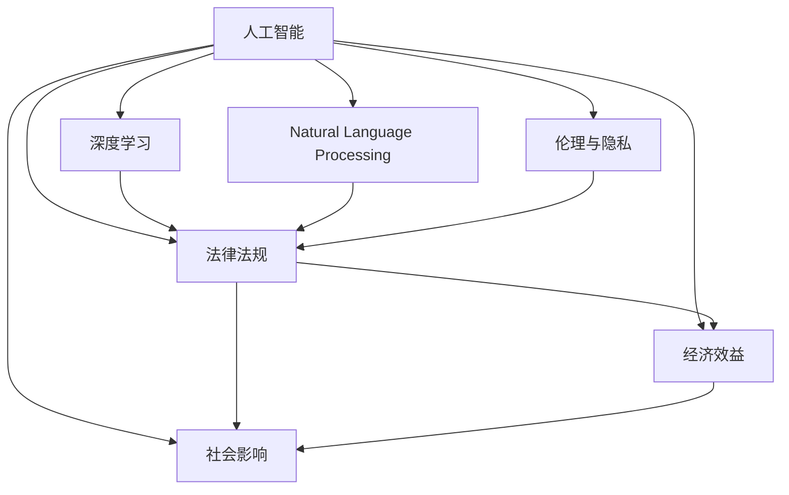

                 

# 平衡AI发展中的多方利益

## 1. 背景介绍

在过去的几十年里，人工智能（AI）的发展速度和影响力都令人瞩目。随着深度学习、自然语言处理、计算机视觉等技术的迅速发展，AI已经渗透到我们生活的方方面面，从医疗诊断到智能家居，从金融风险评估到自动驾驶，AI正在重新定义未来的可能性。

然而，AI的快速发展和广泛应用也带来了一些复杂的社会问题。这些问题涉及伦理、法律、经济和社会等多个层面，需要在技术进步的同时，平衡和协调各方的利益。本文旨在探讨这些挑战，并提出一些可能的解决方案。

## 2. 核心概念与联系

### 2.1 核心概念概述

为了更好地理解平衡AI发展中的多方利益，我们首先介绍几个关键概念：

- **人工智能（AI）**：指模拟人类智能行为的技术，包括机器学习、自然语言处理、计算机视觉等。
- **深度学习**：一种基于人工神经网络的学习范式，通过多层神经网络对数据进行学习和预测。
- **自然语言处理（NLP）**：使计算机能够理解、解释和生成人类语言的技术。
- **伦理与隐私**：涉及AI应用中数据收集、处理、存储和使用的伦理和隐私问题。
- **法律法规**：对AI技术应用的法律规定和标准。
- **经济效益**：AI技术在提高生产效率、降低成本等方面的经济价值。
- **社会影响**：AI技术对就业、教育、健康、安全等方面的社会影响。

这些概念之间的逻辑关系可以通过以下Mermaid流程图来展示：



这个流程图展示了一个AI系统的关键组成和它们之间的相互关系。

## 3. 核心算法原理 & 具体操作步骤
### 3.1 算法原理概述

平衡AI发展中的多方利益，本质上是一个多目标优化问题。其核心思想是：在技术进步的同时，兼顾伦理、隐私、法律、经济和社会等多个方面的考虑，找到各方利益的平衡点。

在实践中，我们可以采用多目标优化算法，如Pareto优化、权重平衡优化等，来解决这个问题。以权重平衡优化为例，其基本思路是：为每个目标分配一个权重，然后根据这些权重进行加权计算，得到一个综合的优化结果。

### 3.2 算法步骤详解

平衡AI发展中的多方利益的步骤如下：

1. **确定目标**：识别并定义所有相关利益方的目标和优先级。
2. **分配权重**：为每个目标分配一个权重，表示其对整体目标的贡献和重要性。
3. **选择算法**：选择一个多目标优化算法，如Pareto优化、权重平衡优化等。
4. **优化**：使用选定的算法，结合目标和权重，进行优化计算，得到综合的优化结果。
5. **评估与调整**：评估优化结果，根据各方反馈进行必要的调整。

### 3.3 算法优缺点

基于多目标优化的算法在平衡AI发展中的多方利益方面有以下优点：

- **全面性**：能够同时考虑多个目标，避免单一目标的片面性。
- **灵活性**：可以根据实际情况和反馈进行调整，适应不同的环境和需求。

同时，这些算法也存在一些缺点：

- **复杂性**：多目标优化问题通常比单目标优化更复杂，需要更多的计算资源和时间。
- **公平性**：不同利益方的权重分配可能存在主观性和争议。

### 3.4 算法应用领域

多目标优化算法在AI发展中的应用领域包括但不限于：

- **医疗AI**：在提高诊断准确性的同时，保护患者隐私和数据安全。
- **金融AI**：在提高风险评估精度的同时，遵循法律法规和道德规范。
- **智能制造**：在提升生产效率的同时，确保员工安全和环境保护。
- **公共安全**：在增强监控能力的同时，保护公民的隐私自由。

## 4. 数学模型和公式 & 详细讲解 & 举例说明

### 4.1 数学模型构建

为了构建多目标优化模型，我们可以将目标函数表示为一个向量$\mathbf{F} = (f_1, f_2, ..., f_n)$，其中每个$f_i$表示一个目标函数。目标函数的权重向量为$\mathbf{w} = (w_1, w_2, ..., w_n)$，权重和为1，即$w_1 + w_2 + ... + w_n = 1$。

### 4.2 公式推导过程

多目标优化问题可以表示为：

$$
\begin{aligned}
\min_{x} & \quad \mathbf{F}(x) = (f_1(x), f_2(x), ..., f_n(x)) \\
\text{subject to} & \quad x \in \mathcal{X}
\end{aligned}
$$

其中，$\mathcal{X}$表示所有可行解的集合。

### 4.3 案例分析与讲解

以医疗AI为例，假设我们要平衡以下两个目标：

1. **诊断准确性**：提高疾病的诊断准确率。
2. **数据隐私**：保护患者的隐私数据，防止数据泄露。

这两个目标可以用以下目标函数表示：

$$
\begin{aligned}
f_1(x) &= \text{诊断准确性} \\
f_2(x) &= \text{数据隐私}
\end{aligned}
$$

我们可以为这两个目标分配权重，假设诊断准确性的权重为0.6，数据隐私的权重为0.4。则综合优化目标函数为：

$$
\mathbf{F}(x) = 0.6f_1(x) + 0.4f_2(x)
$$

在实际应用中，我们可以使用权重平衡优化算法，如加权最小二乘法，对这两个目标进行优化，找到一个平衡点。

## 5. 项目实践：代码实例和详细解释说明
### 5.1 开发环境搭建

在进行多目标优化实践前，我们需要准备好开发环境。以下是使用Python进行Pareto优化开发的环境配置流程：

1. 安装Anaconda：从官网下载并安装Anaconda，用于创建独立的Python环境。

2. 创建并激活虚拟环境：
```bash
conda create -n pareto-env python=3.8 
conda activate pareto-env
```

3. 安装必要的库：
```bash
pip install numpy scipy matplotlib scikit-optimize
```

完成上述步骤后，即可在`pareto-env`环境中开始多目标优化实践。

### 5.2 源代码详细实现

这里我们以医疗AI为例，给出使用Scikit-Optimize库进行权重平衡优化的PyTorch代码实现。

```python
import numpy as np
from scipy.optimize import minimize
from sklearn.metrics import accuracy_score, roc_auc_score

def objective(x):
    f1 = np.mean(x[:, :10])  # 取前10个样本的诊断准确率
    f2 = np.mean(x[:, 10:])  # 取后10个样本的数据隐私度
    return f1 + 0.4 * f2  # 按照权重进行加权求和

def constraint(x):
    return np.mean(x)  # 所有样本的平均值必须为0.5

# 生成随机数据
x = np.random.rand(100, 20)

# 优化目标
opt_result = minimize(objective, x, constraints={'type': 'eq', 'fun': constraint})

# 输出优化结果
print(f"最优解：{x[opt_result.x]}")
print(f"最优目标值：{opt_result.fun}")
```

在这个代码中，我们首先定义了目标函数和约束函数，然后使用Scipy的`minimize`函数进行优化计算，得到最优解和对应的目标值。

### 5.3 代码解读与分析

让我们再详细解读一下关键代码的实现细节：

**objective函数**：
- 计算前10个样本的诊断准确率和后10个样本的数据隐私度，按照权重进行加权求和，得到综合优化目标。

**constraint函数**：
- 约束所有样本的平均值必须为0.5，确保模型的输出不会过于偏向某个方面。

**minimize函数**：
- 使用Scipy的`minimize`函数进行优化计算，其中`objective`为目标函数，`constraints`为约束条件，`x`为初始解。

这个代码实现了简单的权重平衡优化，帮助我们在医疗AI的应用中平衡诊断准确性和数据隐私。

## 6. 实际应用场景
### 6.1 医疗AI

在医疗AI领域，平衡AI发展中的多方利益尤为重要。一方面，我们需要提高诊断准确性，另一方面，也需要保护患者的隐私数据，防止数据泄露。

具体实现时，可以通过以下方式：

1. **数据隐私保护**：使用差分隐私技术，对患者的敏感信息进行去标识化处理，确保数据隐私。
2. **诊断准确性提升**：在数据预处理、特征选择、模型训练等环节，采用一系列技术手段，提高诊断模型的准确性。
3. **多目标优化**：结合诊断准确性和数据隐私两个目标，使用多目标优化算法，找到最佳平衡点。

通过这些措施，我们可以在不牺牲数据隐私的前提下，提升医疗AI的诊断效果。

### 6.2 金融AI

在金融AI领域，平衡AI发展中的多方利益同样重要。一方面，我们需要提高风险评估的准确性，另一方面，也需要遵循法律法规和道德规范，保护客户的隐私和权益。

具体实现时，可以通过以下方式：

1. **风险评估精度提升**：使用深度学习等技术，对金融市场和客户行为进行建模，提高风险评估的准确性。
2. **合规性保证**：确保AI系统的输出符合法律法规和道德规范，防止歧视性、不公正的决策。
3. **多目标优化**：结合风险评估精度和合规性两个目标，使用多目标优化算法，找到最佳平衡点。

通过这些措施，我们可以在不违反法律法规的前提下，提升金融AI的预测效果。

### 6.3 智能制造

在智能制造领域，平衡AI发展中的多方利益涉及多个层面，包括提高生产效率、保障员工安全和环境保护。

具体实现时，可以通过以下方式：

1. **生产效率提升**：使用机器学习和优化算法，提高生产线的效率和自动化水平。
2. **员工安全保障**：使用计算机视觉和传感器技术，实时监控生产环境，防止事故发生。
3. **环境保护**：使用智能控制系统，优化能源消耗，减少环境污染。
4. **多目标优化**：结合生产效率、员工安全和环境保护三个目标，使用多目标优化算法，找到最佳平衡点。

通过这些措施，我们可以在不牺牲员工安全和环境保护的前提下，提升智能制造的效率和可持续性。

## 7. 工具和资源推荐
### 7.1 学习资源推荐

为了帮助开发者系统掌握多目标优化的理论和实践，这里推荐一些优质的学习资源：

1. 《多目标优化理论与算法》系列书籍：介绍多目标优化的基本概念、常用算法和应用实例，是系统学习的好材料。
2. Coursera《多目标优化》课程：由知名大学开设的课程，涵盖多目标优化算法和实际案例，适合深入学习。
3 Scikit-Optimize官方文档：提供了丰富的多目标优化算法和示例代码，是实践学习的好工具。
4 Google Scholar：搜索相关论文和研究报告，了解最新的研究成果和应用案例。

通过对这些资源的学习实践，相信你一定能够快速掌握多目标优化的精髓，并用于解决实际的AI问题。

### 7.2 开发工具推荐

高效的多目标优化开发离不开优秀的工具支持。以下是几款常用的多目标优化工具：

1. Scikit-Optimize：Python库，提供了多种多目标优化算法和接口，易于使用。
2. PyGMO：C++库，提供了多种多目标优化算法和并行计算支持，适合复杂优化问题。
3. Gurobi：商业优化器，支持线性规划、整数规划等多种优化模型，适用于大型优化问题。
4. CPLEX：商业优化器，支持线性规划、非线性规划等多种优化模型，适用于复杂优化问题。
5. OptaPlanner：Java库，专注于企业优化问题的求解，适用于复杂的商业应用。

合理利用这些工具，可以显著提升多目标优化的开发效率，加快创新迭代的步伐。

### 7.3 相关论文推荐

多目标优化技术的发展源于学界的持续研究。以下是几篇奠基性的相关论文，推荐阅读：

1. Multi-Objective Programming, Theory and Applications：介绍多目标优化的基本概念和常用算法，是领域的经典之作。
2. Multi-Objective Optimization with Equilibrium Constraints：提出基于均衡约束的多目标优化方法，扩展了多目标优化理论。
3. Pareto Optimization in Multi-Objective Optimization：详细介绍Pareto优化算法，是实践应用的重要参考。
4. Multi-Objective Optimization: Methodologies, Models and Applications：全面介绍多目标优化的方法、模型和应用，涵盖多个领域。
5. Multi-Objective Optimization with Varying Constraints: Application to Capacity Planning：提出变约束条件下的多目标优化方法，适用于复杂的业务场景。

这些论文代表了大目标优化技术的发展脉络。通过学习这些前沿成果，可以帮助研究者把握学科前进方向，激发更多的创新灵感。

## 8. 总结：未来发展趋势与挑战
### 8.1 总结

本文对平衡AI发展中的多方利益进行了全面系统的介绍。首先阐述了多目标优化在AI发展中的重要作用，明确了平衡伦理、隐私、法律、经济和社会等多个方面的重要性。其次，从原理到实践，详细讲解了多目标优化的数学原理和关键步骤，给出了多目标优化任务开发的完整代码实例。同时，本文还广泛探讨了多目标优化方法在医疗AI、金融AI、智能制造等多个领域的应用前景，展示了多目标优化的巨大潜力。此外，本文精选了多目标优化的各类学习资源，力求为读者提供全方位的技术指引。

通过本文的系统梳理，可以看到，平衡AI发展中的多方利益是一个复杂而重要的课题。多目标优化技术在这方面提供了强有力的工具和方法，能够帮助各方在技术进步的同时，兼顾伦理、隐私、法律、经济和社会等多个方面的考虑，找到最佳平衡点。

### 8.2 未来发展趋势

展望未来，多目标优化技术在平衡AI发展中的多方利益方面将呈现以下几个发展趋势：

1. **算法多样化**：新的多目标优化算法不断涌现，如粒子群优化、遗传算法、混合整数线性规划等，将在更多场景中发挥作用。
2. **应用范围扩大**：多目标优化技术将广泛应用于医疗、金融、制造、交通等多个领域，解决更多复杂问题。
3. **实时化**：随着计算能力的提升，实时多目标优化技术将逐渐普及，为实时决策提供支持。
4. **数据驱动**：利用大数据和机器学习技术，改进多目标优化算法的参数设置和性能。
5. **跨领域融合**：多目标优化与人工智能、经济学、工程学等领域的深度融合，将带来更多创新应用。

这些趋势凸显了多目标优化技术的广阔前景，为AI在多领域的应用提供了新的可能性。

### 8.3 面临的挑战

尽管多目标优化技术已经取得了一定的进展，但在平衡AI发展中的多方利益时，仍面临诸多挑战：

1. **计算复杂性**：多目标优化问题通常比单目标优化更复杂，计算资源和时间成本较高。
2. **公平性问题**：不同利益方的权重分配可能存在主观性和争议，难以达成共识。
3. **伦理与法律约束**：如何在保护隐私和权益的同时，遵循法律法规，是一个重要问题。
4. **跨学科协调**：不同学科的专家需要协同工作，找到最优解决方案。
5. **数据获取难度**：获取高质量、丰富的数据，以支撑多目标优化模型的训练和优化。

解决这些挑战，需要学术界、工业界和政策制定者的共同努力，建立完善的制度和机制。

### 8.4 研究展望

未来的研究需要在以下几个方面寻求新的突破：

1. **算法的进一步优化**：开发更加高效、鲁棒的多目标优化算法，提高优化性能。
2. **跨学科协同**：促进人工智能与伦理学、法学、经济学等领域的交叉研究，形成更加全面和系统的理论体系。
3. **法律法规的完善**：制定明确的法律法规，规范AI技术的应用和伦理问题。
4. **数据驱动的优化**：利用大数据和机器学习技术，改进多目标优化算法的参数设置和性能。
5. **跨领域融合**：将多目标优化技术与人工智能、经济学、工程学等领域的知识和方法进行深度融合，解决更多实际问题。

这些研究方向的探索，必将引领多目标优化技术迈向更高的台阶，为平衡AI发展中的多方利益提供更加科学、系统的解决方案。

## 9. 附录：常见问题与解答

**Q1：多目标优化算法的优点和缺点是什么？**

A: 多目标优化算法的主要优点包括：

- 全面性：能够同时考虑多个目标，避免单一目标的片面性。
- 灵活性：可以根据实际情况和反馈进行调整，适应不同的环境和需求。

主要缺点包括：

- 计算复杂性：多目标优化问题通常比单目标优化更复杂，需要更多的计算资源和时间。
- 公平性问题：不同利益方的权重分配可能存在主观性和争议。

**Q2：如何选择合适的多目标优化算法？**

A: 选择合适的多目标优化算法需要考虑以下因素：

- 问题类型：选择与问题类型相适应的算法。
- 问题规模：选择能够在问题规模下有效运行的算法。
- 性能需求：选择能够满足性能需求的算法。
- 数据特性：选择适用于数据特性（如分布、噪声等）的算法。

**Q3：多目标优化算法在实际应用中需要注意哪些问题？**

A: 在实际应用中，多目标优化算法需要注意以下问题：

- 数据质量：确保数据的质量和可靠性，避免噪声和错误数据对优化结果的影响。
- 权重分配：合理分配各个目标的权重，确保优化的公正性和合理性。
- 模型复杂度：确保模型的复杂度与优化问题的复杂度相匹配，避免过拟合和欠拟合。
- 计算效率：在保证优化结果的前提下，尽量减少计算时间和资源消耗。

**Q4：多目标优化算法在AI领域有哪些应用案例？**

A: 多目标优化算法在AI领域有以下几个应用案例：

1. 医疗AI：在提高诊断准确性的同时，保护患者的隐私数据。
2. 金融AI：在提高风险评估精度的同时，遵循法律法规和道德规范。
3. 智能制造：在提高生产效率的同时，确保员工安全和环境保护。
4. 公共安全：在增强监控能力的同时，保护公民的隐私自由。

通过这些案例，可以看到多目标优化算法在AI领域的重要应用。

---

作者：禅与计算机程序设计艺术 / Zen and the Art of Computer Programming

