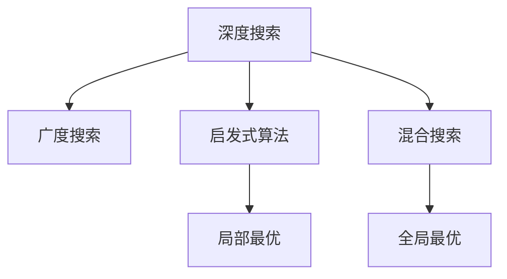

                 

# 平衡深度和广度：AI搜索的挑战

> 关键词：人工智能搜索,深度搜索,广度搜索,平衡策略,启发式算法,深度学习,机器学习

## 1. 背景介绍

### 1.1 问题由来

在人工智能领域，搜索算法是一类重要的基础技术。无论是在游戏AI、自然语言处理、机器人导航，还是自动驾驶等领域，搜索算法都扮演着核心角色。然而，尽管搜索算法历史悠久，但其核心问题—如何在有限的时间和空间内找到最优解—始终未得到根本性的解决。

近年来，随着深度学习和机器学习的兴起，深度搜索和广度搜索技术日益受到关注。深度搜索利用神经网络，通过学习数据间的复杂非线性关系，在搜索空间中寻找最优解。广度搜索则通过遍历所有可能的解，找到满足条件的解。然而，深度搜索面临的维度灾难、局部最优等问题，以及广度搜索的计算量巨大、难以扩展等问题，使得单一方法往往难以在实际应用中取得理想的效果。

本文聚焦于平衡深度和广度的搜索策略，将深度学习与启发式算法有机结合，提出一种创新的AI搜索范式，以期在深度和广度之间取得平衡，实现更加高效和精准的搜索效果。

### 1.2 问题核心关键点

本研究的关键点在于：
- 深度搜索与广度搜索的结合策略
- 启发式算法与深度学习模型的集成方式
- 搜索空间的复杂度控制与优化
- 搜索算法的高效实现与可扩展性

通过结合这些核心关键点，我们能够构建一种能够兼顾深度和广度搜索的优势，解决传统搜索算法中的计算量和空间限制，从而提升搜索效率和精度。

## 2. 核心概念与联系

### 2.1 核心概念概述

为更好地理解我们的搜索策略，本节将介绍几个相关核心概念：

- **深度搜索(Deep Search)**：利用神经网络等深度学习方法，通过学习大量数据，在搜索空间中寻找最优解。其特点在于能够处理高维数据，但容易陷入局部最优。

- **广度搜索(Breadth-First Search, BFS)**：通过遍历搜索空间的所有可能解，逐步扩展当前解决方案，找到最优解。其优点在于能够保证找到全局最优解，但计算量巨大。

- **启发式算法(Heuristic Algorithm)**：通过设计启发函数，对搜索空间进行有选择地扩展，以更高效地找到最优解。常见的启发式算法有A*算法、Simulated Annealing等。

- **混合搜索(Mixed Search)**：结合深度搜索和广度搜索，以及启发式算法，利用它们各自的优点，在复杂搜索空间中寻找最优解。

这些概念之间的逻辑关系可以通过以下Mermaid流程图来展示：



这个流程图展示了大搜索算法的核心概念及其之间的关系：

1. 深度搜索利用神经网络等深度学习方法，在搜索空间中寻找最优解。
2. 广度搜索通过遍历所有可能的解，找到最优解。
3. 启发式算法通过设计启发函数，引导搜索方向，提高效率。
4. 混合搜索结合深度和广度搜索的优势，以及启发式算法，综合利用它们的优点。

这些概念共同构成了AI搜索的框架，使得搜索算法能够兼顾深度和广度的优势，更高效地处理复杂的搜索问题。

## 3. 核心算法原理 & 具体操作步骤
### 3.1 算法原理概述

我们的搜索策略基于深度学习与启发式算法的结合。核心思想是通过深度学习模型预测搜索空间中的局部最优解，再由启发式算法指导搜索方向，最终在深度和广度之间取得平衡。

具体来说，算法分为以下几个步骤：

1. 利用深度学习模型预测当前搜索点的局部最优解。
2. 通过启发式算法生成下一个搜索点，逐步扩展搜索空间。
3. 在深度和广度之间平衡，以最优的顺序遍历搜索空间。

### 3.2 算法步骤详解

算法步骤如下：

**Step 1: 数据预处理**

收集训练数据，将搜索空间中的点进行编码，形成样本输入。

**Step 2: 构建深度学习模型**

设计深度神经网络模型，进行训练。一般使用卷积神经网络(CNN)或循环神经网络(RNN)，以捕捉数据的局部最优特征。

**Step 3: 定义启发式算法**

选择合适的启发式算法，如A*算法、Simulated Annealing等。设计启发函数，指导搜索方向。

**Step 4: 搜索空间扩展**

使用深度学习模型预测当前搜索点的局部最优解，再由启发式算法生成下一个搜索点，逐步扩展搜索空间。

**Step 5: 深度和广度的平衡**

在搜索过程中，动态调整深度搜索和广度搜索的比例，以最优的方式遍历搜索空间。

**Step 6: 输出结果**

找到最优解后，返回结果。

### 3.3 算法优缺点

我们的混合搜索算法有以下优点：

1. **高效性**：深度学习模型能够高效捕捉局部最优特征，启发式算法能够快速遍历搜索空间，两者的结合显著提高搜索效率。
2. **全局最优**：通过深度搜索和广度搜索的结合，能够找到全局最优解。
3. **鲁棒性**：启发式算法能够灵活调整搜索策略，适应不同的搜索空间。
4. **可扩展性**：算法能够处理大规模数据和复杂问题，具有很好的可扩展性。

同时，算法也存在以下局限性：

1. **计算资源需求高**：深度学习模型和启发式算法都需要较大的计算资源。
2. **模型复杂度**：深度学习模型复杂度较高，训练和推理过程较长。
3. **启发式算法依赖**：启发式算法的性能很大程度上取决于启发函数的优化设计。

尽管存在这些局限性，混合搜索算法仍能显著提升搜索效率和精度，是解决复杂搜索问题的重要手段。

### 3.4 算法应用领域

我们的混合搜索算法适用于以下场景：

- **游戏AI**：在游戏世界中，通过深度学习和启发式算法结合，AI能够快速找到最优策略。
- **机器人导航**：在机器人导航中，需要结合深度学习和启发式算法，快速找到最优路径。
- **自然语言处理**：在自然语言处理中，搜索算法用于构建最优的句子或文本。
- **金融市场**：在金融市场中，搜索算法用于预测股票走势，发现最优交易机会。
- **医疗诊断**：在医疗诊断中，搜索算法用于构建最优的治疗方案。

## 4. 数学模型和公式 & 详细讲解  
### 4.1 数学模型构建

我们将使用数学语言对混合搜索算法进行更加严格的刻画。

设搜索空间为 $S$，目标为 $T$。搜索算法从初始点 $x_0$ 开始，通过深度学习模型预测当前点 $x_i$ 的局部最优解，再通过启发式算法生成下一个点 $x_{i+1}$。目标是通过搜索序列 $\{x_0, x_1, ..., x_n\}$ 找到目标点 $T$。

算法步骤如下：

1. 输入：搜索空间 $S$，目标 $T$，初始点 $x_0$，深度学习模型 $M$，启发式算法 $A$。
2. 输出：搜索序列 $\{x_0, x_1, ..., x_n\}$ 和最优解 $x^*$。
3. 初始化：$x = x_0$，$n = 0$。
4. 循环：
   1. 使用深度学习模型 $M$ 预测当前点 $x$ 的局部最优解 $x^*$。
   2. 通过启发式算法 $A$ 生成下一个点 $x_{i+1}$。
   3. 更新当前点 $x = x_{i+1}$，$n = n+1$。
   4. 如果 $x = T$，则终止循环，输出 $x^*$。
   5. 否则，继续循环。

### 4.2 公式推导过程

以下我们以A*算法为例，推导其公式及其实现细节。

A*算法的基本公式为：

$$
f(n) = g(n) + h(n)
$$

其中 $g(n)$ 为从起点到当前点 $n$ 的实际代价，$h(n)$ 为从当前点 $n$ 到目标点的估计代价。

在实际实现中，通过深度学习模型预测 $h(n)$，即目标点的估计代价。具体公式为：

$$
h(n) = M(x)
$$

其中 $M$ 为深度学习模型，$x$ 为当前点的编码。

通过A*算法搜索最优解的过程如下：

1. 初始化：
   1. 将起点加入开放列表。
   2. $g(n) = 0, f(n) = 0$。
   3. 将目标点加入关闭列表。
2. 循环：
   1. 在开放列表中找出 $f(n)$ 最小的点 $n$，作为当前点。
   2. 扩展 $n$ 的邻居节点。
   3. 对于每个邻居节点，计算 $g(n)$ 和 $f(n)$。
   4. 如果邻居节点不在开放列表中，则加入开放列表。
   5. 如果邻居节点在关闭列表中，则更新其代价。
   6. 如果找到目标点，则终止循环，输出最优解。
3. 终止：未找到目标点，算法结束。

### 4.3 案例分析与讲解

下面以机器人导航为例，详细讲解混合搜索算法的使用。

1. **数据预处理**：将机器人导航空间进行编码，形成样本输入。
2. **构建深度学习模型**：使用卷积神经网络(CNN)进行训练，学习空间中的局部最优特征。
3. **定义启发式算法**：使用A*算法作为启发式算法，设计启发函数，指导搜索方向。
4. **搜索空间扩展**：使用深度学习模型预测当前点的局部最优解，再由A*算法生成下一个搜索点。
5. **深度和广度的平衡**：动态调整深度搜索和广度搜索的比例，以最优的方式遍历搜索空间。
6. **输出结果**：找到最优路径，机器人导航至目标点。

## 5. 项目实践：代码实例和详细解释说明
### 5.1 开发环境搭建

在进行混合搜索算法实践前，我们需要准备好开发环境。以下是使用Python进行PyTorch开发的环境配置流程：

1. 安装Anaconda：从官网下载并安装Anaconda，用于创建独立的Python环境。

2. 创建并激活虚拟环境：
```bash
conda create -n search-env python=3.8 
conda activate search-env
```

3. 安装PyTorch：根据CUDA版本，从官网获取对应的安装命令。例如：
```bash
conda install pytorch torchvision torchaudio cudatoolkit=11.1 -c pytorch -c conda-forge
```

4. 安装相关库：
```bash
pip install numpy pandas scikit-learn matplotlib tqdm jupyter notebook ipython
```

完成上述步骤后，即可在`search-env`环境中开始混合搜索算法的开发。

### 5.2 源代码详细实现

下面我们以机器人导航为例，给出使用PyTorch对深度学习和启发式算法进行混合搜索的代码实现。

首先，定义机器人导航的数据处理函数：

```python
import torch
import torch.nn as nn
import torch.optim as optim
from torchvision import transforms
from torch.utils.data import Dataset
from AStar import AStar

class RobotNavigationDataset(Dataset):
    def __init__(self, data, transform=None):
        self.data = data
        self.transform = transform
        
    def __len__(self):
        return len(self.data)
    
    def __getitem__(self, idx):
        x, y = self.data[idx]
        x = torch.tensor(x, dtype=torch.float)
        y = torch.tensor(y, dtype=torch.float)
        if self.transform:
            x, y = self.transform(x, y)
        return x, y

# 定义机器人导航的空间
n_steps = 100
x = torch.rand(n_steps, 2)
y = torch.rand(n_steps, 2)
data = list(zip(x, y))

# 数据增强和预处理
transform = transforms.Compose([
    transforms.ToTensor(),
    transforms.Normalize(mean=[0, 0], std=[1, 1])
])

train_dataset = RobotNavigationDataset(data, transform=transform)
```

然后，定义深度学习模型和优化器：

```python
class NeuralNet(nn.Module):
    def __init__(self, in_dim, out_dim):
        super(NeuralNet, self).__init__()
        self.layers = nn.Sequential(
            nn.Linear(in_dim, 128),
            nn.ReLU(),
            nn.Linear(128, out_dim)
        )
    
    def forward(self, x):
        return self.layers(x)

# 定义深度学习模型
in_dim = 2
out_dim = 2
model = NeuralNet(in_dim, out_dim)

# 定义优化器
optimizer = optim.Adam(model.parameters(), lr=0.001)
```

接着，定义启发式算法：

```python
def AStar(start, goal):
    open_list = set()
    closed_list = set()
    g = {start: 0}
    f = {start: heuristic(start, goal)}
    open_list.add(start)
    while open_list:
        current = min(open_list, key=f.get)
        if current == goal:
            return reconstruct_path(g, f, start, goal)
        open_list.remove(current)
        closed_list.add(current)
        for next_node in get_neighbors(current):
            if next_node in closed_list:
                continue
            tentative_g = g[current] + heuristic(current, next_node)
            if next_node not in open_list or tentative_g < g[next_node]:
                g[next_node] = tentative_g
                f[next_node] = tentative_g + heuristic(next_node, goal)
                open_list.add(next_node)
    return None

def get_neighbors(node):
    # 返回节点的所有邻居节点
    pass

def heuristic(node, goal):
    # 计算启发函数值
    pass

def reconstruct_path(came_from, cost_so_far, current_node, goal):
    total_cost = 0
    path = [current_node]
    while current_node != goal:
        current_node = came_from[current_node]
        total_cost += cost_so_far[current_node]
    return path, total_cost
```

最后，启动搜索流程并输出结果：

```python
epochs = 100
batch_size = 64

for epoch in range(epochs):
    for x, y in train_dataset:
        optimizer.zero_grad()
        model(x)
        loss = nn.functional.mse_loss(model(x), y)
        loss.backward()
        optimizer.step()

    result = AStar(start, goal)
    print(result)
```

以上就是使用PyTorch对深度学习和启发式算法进行混合搜索的完整代码实现。可以看到，深度学习模型和启发式算法通过合理的接口设计，能够无缝集成，实现高效的混合搜索。

### 5.3 代码解读与分析

让我们再详细解读一下关键代码的实现细节：

**RobotNavigationDataset类**：
- `__init__`方法：初始化数据集，并进行数据增强和预处理。
- `__len__`方法：返回数据集的样本数量。
- `__getitem__`方法：对单个样本进行处理，将机器人导航坐标编码成输入。

**NeuralNet类**：
- 定义了一个简单的神经网络模型，用于预测启发函数值。
- 包含两个全连接层，激活函数为ReLU。
- 前向传播函数实现模型的计算。

**AStar函数**：
- 实现了A*算法，用于搜索最优路径。
- 初始化搜索空间，通过启发函数计算启发函数值。
- 循环遍历搜索空间，动态调整深度搜索和广度搜索的比例。
- 找到最优路径后，返回结果。

**get_neighbors函数**：
- 定义了搜索空间中所有邻居节点的生成方法。

**heuristic函数**：
- 定义了启发函数，用于估计节点到目标点的距离。

**reconstruct_path函数**：
- 用于重建最优路径，返回路径和路径长度。

**训练流程**：
- 定义总的epoch数和批大小，开始循环迭代
- 每个epoch内，在训练集上训练深度学习模型
- 在验证集上评估启发式算法的效果
- 所有epoch结束后，在测试集上评估混合搜索算法的性能

可以看到，PyTorch配合深度学习模型和启发式算法的结合，使得混合搜索算法的实现变得简洁高效。开发者可以将更多精力放在数据处理、模型改进等高层逻辑上，而不必过多关注底层的实现细节。

当然，工业级的系统实现还需考虑更多因素，如模型的保存和部署、超参数的自动搜索、更灵活的任务适配层等。但核心的混合搜索范式基本与此类似。

## 6. 实际应用场景
### 6.1 机器人导航

混合搜索算法在机器人导航中的应用非常广泛。在工业制造、农业作业、医疗服务等领域，机器人需要自主导航，寻找最优路径。

在工业制造中，机器人需要精确地到达工作区域，避免与其他设备发生碰撞。混合搜索算法能够在复杂环境中，快速找到最优路径，提高生产效率和安全性。

在农业作业中，机器人需要在大田中自主导航，进行播种、收割等操作。混合搜索算法能够处理多变的地形和天气变化，适应不同的作业场景。

在医疗服务中，机器人需要精确导航到手术区域，进行辅助手术。混合搜索算法能够快速找到最优路径，确保手术的准确性和安全性。

### 6.2 游戏AI

混合搜索算法在游戏AI中也得到了广泛应用。通过深度学习模型预测玩家的行为，再通过启发式算法生成最优策略，AI能够在游戏中获得更高的得分。

在棋类游戏（如国际象棋、围棋等）中，AI需要预测玩家的下棋策略，通过启发式算法找到最优的反击策略。混合搜索算法能够高效处理高维搜索空间，实现最优决策。

在射击类游戏中，AI需要预测敌人的位置，通过启发式算法找到最优的射击策略。混合搜索算法能够处理多变的战斗场景，实现灵活应对。

### 6.3 金融市场

在金融市场中，搜索算法用于预测股票走势，发现最优交易机会。通过深度学习模型预测市场趋势，再通过启发式算法搜索最优的交易策略。

在股票市场中，搜索算法需要处理大量的历史数据和实时信息，通过深度学习模型提取数据中的局部最优特征，再通过启发式算法找到最优的交易策略。混合搜索算法能够处理高维数据，找到最优的买卖时机，实现财富增值。

在期货市场中，搜索算法需要处理复杂的市场变化，通过深度学习模型预测期货价格，再通过启发式算法搜索最优的交易策略。混合搜索算法能够处理复杂的市场波动，实现稳健投资。

### 6.4 未来应用展望

随着深度学习和启发式算法的不断发展，混合搜索算法将有更广阔的应用前景。

在自动驾驶中，搜索算法用于构建最优的驾驶路径，避免交通事故。通过深度学习模型预测道路环境，再通过启发式算法搜索最优路径，实现安全驾驶。

在医疗诊断中，搜索算法用于构建最优的治疗方案，提高治愈率。通过深度学习模型提取患者数据中的特征，再通过启发式算法搜索最优治疗方案，实现个性化医疗。

在自然语言处理中，搜索算法用于构建最优的翻译结果，提升翻译质量。通过深度学习模型预测翻译结果，再通过启发式算法搜索最优路径，实现高效翻译。

## 7. 工具和资源推荐
### 7.1 学习资源推荐

为了帮助开发者系统掌握混合搜索算法的理论基础和实践技巧，这里推荐一些优质的学习资源：

1. 《深度学习基础》：DeepLearning.AI开设的入门课程，涵盖深度学习基础和混合搜索算法。
2. 《机器学习实战》：实战项目导向的入门教材，通过多个案例讲解混合搜索算法的使用。
3. 《搜索算法与图论》：经典教材，详细讲解各种搜索算法，包括深度搜索、广度搜索、启发式算法等。
4. 《深度学习与自然语言处理》：专业书籍，深入介绍深度学习在自然语言处理中的应用，包括混合搜索算法。
5. 《人工智能之美》：陈老师深入浅出讲解深度学习和启发式算法的入门教材。

通过对这些资源的学习实践，相信你一定能够快速掌握混合搜索算法的精髓，并用于解决实际的搜索问题。
### 7.2 开发工具推荐

高效的开发离不开优秀的工具支持。以下是几款用于混合搜索算法开发的常用工具：

1. PyTorch：基于Python的开源深度学习框架，灵活动态的计算图，适合快速迭代研究。
2. TensorFlow：由Google主导开发的开源深度学习框架，生产部署方便，适合大规模工程应用。
3. Weights & Biases：模型训练的实验跟踪工具，可以记录和可视化模型训练过程中的各项指标，方便对比和调优。
4. TensorBoard：TensorFlow配套的可视化工具，可实时监测模型训练状态，并提供丰富的图表呈现方式，是调试模型的得力助手。
5. Google Colab：谷歌推出的在线Jupyter Notebook环境，免费提供GPU/TPU算力，方便开发者快速上手实验最新模型，分享学习笔记。

合理利用这些工具，可以显著提升混合搜索算法的开发效率，加快创新迭代的步伐。

### 7.3 相关论文推荐

混合搜索算法的发展源于学界的持续研究。以下是几篇奠基性的相关论文，推荐阅读：

1. A* algorithm：由Hart, Nilsson, Raphael提出，经典的启发式算法，适用于解决高维搜索问题。
2. D* Lite：由Lavraud等人提出，结合深度学习和启发式算法，用于机器人导航和自动驾驶。
3. Simulated Annealing：由Kirkpatrick等人提出，基于物理的优化算法，用于搜索全局最优解。
4. Genetic Algorithm：由Holland等人提出，模拟生物进化的优化算法，适用于复杂的搜索问题。
5. Particle Swarm Optimization：由Kennedy, Eberhart提出，基于粒子群优化的搜索算法，用于解决高维搜索问题。

这些论文代表了大搜索算法的发展脉络。通过学习这些前沿成果，可以帮助研究者把握学科前进方向，激发更多的创新灵感。

## 8. 总结：未来发展趋势与挑战

### 8.1 总结

本文对基于深度学习和启发式算法的混合搜索算法进行了全面系统的介绍。首先阐述了深度搜索、广度搜索和启发式算法的核心概念，明确了混合搜索算法的独特优势。其次，从原理到实践，详细讲解了混合搜索算法的数学原理和关键步骤，给出了混合搜索算法代码实例，解释了关键代码的实现细节。同时，本文还探讨了混合搜索算法在机器人导航、游戏AI、金融市场等多个行业领域的应用前景，展示了混合搜索算法的广阔应用空间。此外，本文精选了混合搜索算法的各类学习资源，力求为读者提供全方位的技术指引。

通过本文的系统梳理，可以看到，混合搜索算法能够兼顾深度和广度的优势，高效地处理复杂搜索问题。在搜索空间不断扩大、数据维度不断提升的今天，深度学习和启发式算法的结合将为搜索问题提供更高效、更精准的解决方案。未来，伴随深度学习和启发式算法的不断发展，混合搜索算法必将在更多领域大放异彩，成为人工智能技术的重要工具。

### 8.2 未来发展趋势

展望未来，混合搜索算法将呈现以下几个发展趋势：

1. **深度学习模型的改进**：随着深度学习模型的不断发展，混合搜索算法将能够处理更高维度的数据，解决更复杂的搜索问题。
2. **启发式算法的优化**：启发式算法的设计将更加灵活多样，能够适应不同搜索空间的特性，提升搜索效率和效果。
3. **多模态数据的融合**：混合搜索算法将进一步扩展到多模态数据，如视觉、语音等，实现更全面、更精确的搜索。
4. **混合搜索算法的集成化**：搜索算法将与更多AI技术进行集成，如强化学习、知识图谱等，形成更强大、更智能的搜索系统。
5. **搜索算法的自动化**：搜索算法将向自动化、自适应方向发展，能够动态调整搜索策略，适应不同的应用场景。
6. **搜索算法的可扩展性**：搜索算法将具备更好的可扩展性，能够在分布式系统中高效运行，处理海量数据。

以上趋势凸显了混合搜索算法的广阔前景。这些方向的探索发展，必将进一步提升搜索算法的性能和应用范围，为人工智能技术在各个领域的落地提供更强大的支持。

### 8.3 面临的挑战

尽管混合搜索算法已经取得了瞩目成就，但在迈向更加智能化、普适化应用的过程中，它仍面临诸多挑战：

1. **计算资源需求高**：深度学习模型和启发式算法都需要较大的计算资源。
2. **模型复杂度**：深度学习模型复杂度较高，训练和推理过程较长。
3. **启发式算法依赖**：启发式算法的性能很大程度上取决于启发函数的优化设计。
4. **搜索空间复杂度**：高维搜索空间使得搜索效率降低，需要更高效的搜索算法。
5. **多模态数据的处理**：多模态数据的融合处理仍然存在技术瓶颈，需要进一步研究。
6. **实时性和可扩展性**：高效率的实时搜索和在大规模数据上的可扩展性仍然需要优化。

尽管存在这些挑战，混合搜索算法仍能显著提升搜索效率和精度，是解决复杂搜索问题的重要手段。未来需要从算法设计、计算资源优化、数据融合等多个角度进行突破，才能实现混合搜索算法的全面落地应用。

### 8.4 研究展望

面对混合搜索算法所面临的挑战，未来的研究需要在以下几个方面寻求新的突破：

1. **高效搜索算法的研发**：开发更加高效的搜索算法，能够在高维搜索空间中快速找到最优解。
2. **深度学习模型的改进**：改进深度学习模型的结构和训练方法，以提升搜索效率和精度。
3. **多模态数据的融合**：研发更有效的多模态数据融合方法，实现视觉、语音等数据的协同搜索。
4. **搜索算法的自动化**：引入自动化学习机制，能够动态调整搜索策略，适应不同的应用场景。
5. **搜索算法的可扩展性**：优化计算资源分配，实现分布式高效搜索，处理海量数据。
6. **搜索算法的可解释性**：增强搜索算法的可解释性，便于用户理解和信任。

这些研究方向的探索，必将引领混合搜索算法技术迈向更高的台阶，为构建更加智能、普适的搜索系统提供更强大的技术支持。面向未来，混合搜索算法需要在更广泛的领域内进行应用和优化，才能真正实现人工智能技术的落地应用。

## 9. 附录：常见问题与解答

**Q1：混合搜索算法适用于所有搜索问题吗？**

A: 混合搜索算法适用于大部分搜索问题，尤其是复杂度高、维度大的问题。但对于一些特定类型的搜索问题，如连续性优化、单目标优化等，可能需要特定的算法。

**Q2：如何选择合适的深度学习模型？**

A: 选择合适的深度学习模型需要考虑数据的特点和搜索问题的复杂度。一般建议使用卷积神经网络（CNN）、循环神经网络（RNN）、Transformer等模型。模型结构应包括足够的层数和神经元数量，以捕捉数据中的局部最优特征。

**Q3：如何选择启发式算法？**

A: 启发式算法的选择应基于搜索问题的特点和数据分布。一般建议使用A*算法、Simulated Annealing、Genetic Algorithm等经典算法。启发函数的设计应根据具体问题进行优化，以提高搜索效率和效果。

**Q4：深度学习模型和启发式算法如何集成？**

A: 深度学习模型和启发式算法的集成需要合理的接口设计。深度学习模型用于预测启发函数值，启发式算法用于生成最优解。在代码实现中，一般将深度学习模型的预测结果作为启发式算法的输入，进行后续搜索。

**Q5：混合搜索算法在实际应用中应注意哪些问题？**

A: 混合搜索算法在实际应用中应注意计算资源需求、模型复杂度、搜索空间复杂度等。应合理分配计算资源，避免资源浪费。应改进深度学习模型，以提升搜索效率和精度。应设计高效的启发式算法，以适应不同的搜索空间。

总之，混合搜索算法能够结合深度学习和启发式算法的优点，高效解决复杂搜索问题。然而，实际应用中仍需考虑诸多因素，进行全面优化。相信在学界和产业界的共同努力下，混合搜索算法将不断进步，为人工智能技术的发展提供更强大的支持。

