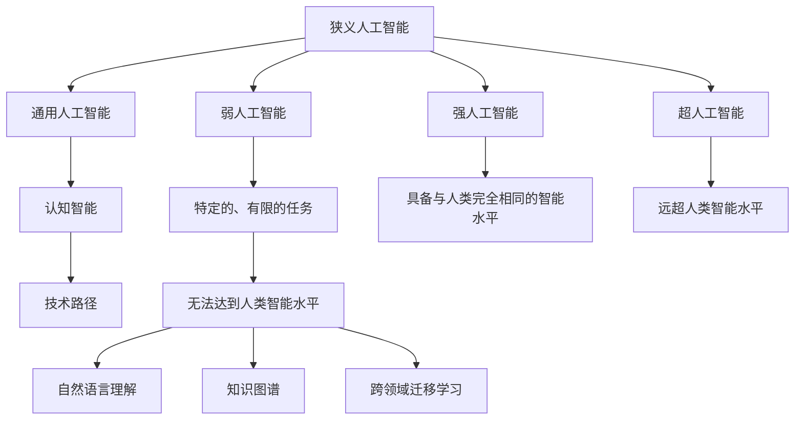

                 

# 2050年的人工智能：从狭义人工智能到通用人工智能的智能进化

## 1. 背景介绍

### 1.1 问题由来

自20世纪50年代以来，人工智能(AI)已经成为推动技术进步和经济发展的重要力量。从早期的逻辑推理到复杂的深度学习模型，AI技术的迅猛发展为各行各业带来了颠覆性的变革。然而，目前的人工智能技术仍以狭义人工智能(Narrow AI)为主，主要应用于特定领域，如计算机视觉、自然语言处理、语音识别等。尽管这些技术已经相当成熟，但仍然难以具备人类一般的智能水平，无法在真正意义上处理复杂问题。

为了应对这些挑战，AI研究人员和工程师们正在探索构建通用人工智能(General AI)的路径。通用人工智能是指具备人类智能水平的AI系统，能够在任何领域、任何情况下解决复杂问题。这不仅需要算法上的突破，还需要在伦理、法律、社会等方面进行深入研究，确保AI的公正性和安全性。

本文旨在探讨从狭义人工智能到通用人工智能的智能进化之路，分析当前AI技术的现状和未来发展趋势，为AI技术的进一步发展提供参考。

### 1.2 问题核心关键点

通用人工智能的智能进化涉及多个关键问题：
1. **认知智能与技术路径**：如何构建具备认知能力的AI系统，以及实现这一目标的技术路径。
2. **伦理与安全**：如何确保AI系统的公正性、透明性、安全性，避免滥用和误用。
3. **社会与法律**：如何在社会层面上应对AI的普及，制定相应的法律和政策，保障人类的权利。
4. **人机协同**：如何实现AI与人类协作，提升工作效率和创造力。
5. **可持续发展**：如何利用AI技术，促进可持续发展，应对气候变化、资源短缺等全球性问题。

这些核心问题决定了AI技术的发展方向和未来前景。

## 2. 核心概念与联系

### 2.1 核心概念概述

为更好地理解通用人工智能的智能进化之路，本节将介绍几个核心概念：

- **狭义人工智能(Narrow AI)**：指应用于特定领域的AI技术，如计算机视觉、自然语言处理、语音识别等。
- **通用人工智能(General AI)**：指具备人类一般智能水平，能够在任何领域、任何情况下解决复杂问题的AI系统。
- **弱人工智能(Weak AI)**：指无法达到人类智能水平的AI，主要应用于特定的、有限的任务。
- **强人工智能(Strong AI)**：指能够具备与人类完全相同的智能水平的AI系统。
- **超人工智能(Super AI)**：指具备远超人类智能水平的AI系统，可能带来无法预见的风险和挑战。
- **认知智能(Cognitive Intelligence)**：指AI系统具备类似人类的认知能力，如理解、推理、情感等。
- **技术路径**：指实现通用人工智能所需的关键技术，如自然语言理解、知识图谱、跨领域迁移学习等。

这些概念之间的逻辑关系可以通过以下Mermaid流程图来展示：



这个流程图展示了几类人工智能的概念及其之间的关系：

1. 狭义人工智能是通用人工智能的基础，具备特定领域的智能。
2. 弱人工智能和强人工智能是狭义人工智能的两个极端，分别代表了有限和完全的智能水平。
3. 超人工智能是远超人类智能的高级形态，可能带来未知的风险。
4. 认知智能是指AI系统具备类人智能的认知能力。
5. 技术路径是指实现认知智能所需的关键技术，如自然语言理解、知识图谱、跨领域迁移学习等。

这些概念共同构成了人工智能的演进框架，指引着AI技术的未来发展方向。

## 3. 核心算法原理 & 具体操作步骤

### 3.1 算法原理概述

从狭义人工智能到通用人工智能的智能进化，主要依赖于认知智能的构建。认知智能是指AI系统具备类似人类的理解、推理、情感等智能能力，能够在任何领域、任何情况下解决复杂问题。

### 3.2 算法步骤详解

实现认知智能的通用人工智能，主要通过以下几个步骤：

**Step 1: 基础研究与理论突破**
- 进行基础研究，探索认知智能的本质，如类人情感、创造力、直觉等。
- 建立基于神经科学的认知模型，模拟人类大脑的工作机制。
- 发展计算理论，解决复杂系统、多模态数据、跨领域迁移等问题。

**Step 2: 关键技术研发**
- 发展自然语言理解技术，使AI系统能够理解自然语言的含义和语境。
- 构建知识图谱，整合和组织海量的知识信息，支持智能推理。
- 开发跨领域迁移学习算法，使AI系统能够在不同领域间进行知识迁移和泛化。
- 探索人机交互技术，提升系统的可解释性和可控性。

**Step 3: 实验验证与优化**
- 在特定领域和任务上进行实验验证，评估AI系统的性能和效果。
- 根据实验结果进行模型优化，提高系统的鲁棒性和可靠性。
- 逐步推广到更复杂的场景和任务，提升系统的泛化能力和适应性。

**Step 4: 伦理与法律框架**
- 制定伦理规范和法律法规，确保AI系统的公正性、透明性、安全性。
- 建立监管机制，防止AI系统的滥用和误用，保护人类的权益。
- 与社会各界合作，推动AI技术的普及和应用。

### 3.3 算法优缺点

通用人工智能的智能进化技术，具有以下优点：
1. **广泛适用性**：能够在任何领域、任何情况下解决复杂问题，具备通用性。
2. **高效率**：能够快速处理大量数据和信息，提升工作效率。
3. **创新能力**：能够进行自主学习和创新，发现新的解决方案。
4. **人机协同**：能够与人类协作，提升工作效率和创造力。

然而，通用人工智能的智能进化也面临一些挑战：
1. **伦理问题**：如何确保AI系统的公正性、透明性、安全性，避免滥用和误用。
2. **安全性**：如何防止AI系统在极端情况下失去控制，造成伤害或危害。
3. **社会接受度**：如何在社会层面上应对AI的普及，制定相应的法律和政策，保障人类的权利。
4. **资源需求**：构建通用人工智能需要大量的计算资源、数据资源和技术资源，成本较高。

尽管存在这些挑战，但通用人工智能的智能进化仍是大势所趋，具有广阔的发展前景。

### 3.4 算法应用领域

通用人工智能的智能进化技术，已经在多个领域得到了初步应用，如医疗、金融、教育、交通等。这些领域的需求和挑战，推动了AI技术的不断进步和创新。

在医疗领域，AI系统可以通过分析医疗数据，提供精准的诊断和治疗建议，提升医疗服务的质量和效率。例如，IBM的Watson Health利用自然语言理解和知识图谱技术，辅助医生进行疾病诊断和治疗决策。

在金融领域，AI系统可以通过分析市场数据和交易记录，预测市场趋势，提供投资建议，提升投资决策的准确性。例如，AlphaGo利用深度学习和强化学习技术，在围棋领域取得了人类难以企及的成就。

在教育领域，AI系统可以通过分析学生的学习数据，提供个性化的学习建议和反馈，提升教育效果。例如，Coursera利用自然语言处理技术，提供智能化的课程推荐和辅导。

在交通领域，AI系统可以通过分析交通数据，优化交通管理，减少交通拥堵和事故。例如，百度利用深度学习技术，构建智能交通系统，提高道路通行效率。

随着AI技术的不断进步，通用人工智能的智能进化将在更多领域得到应用，为社会带来更广泛的福祉。

## 4. 数学模型和公式 & 详细讲解 & 举例说明

### 4.1 数学模型构建

本节将使用数学语言对认知智能的构建进行更加严格的刻画。

记认知智能系统为 $M$，假设其具备自然语言理解能力 $NLU$、知识图谱 $KG$、跨领域迁移学习 $CFM$ 等功能模块。则认知智能的构建可以表示为：

$$ M = NLU \otimes KG \otimes CFM $$

其中 $\otimes$ 表示功能模块的融合，$NLU$、$KG$、$CFM$ 分别代表自然语言理解、知识图谱、跨领域迁移学习模块。

### 4.2 公式推导过程

以下我们以自然语言理解模块为例，推导基于Transformer的认知智能系统模型。

假设认知智能系统 $M$ 在输入文本 $x$ 上的输出为 $y$，其中 $x$ 和 $y$ 分别表示输入和输出序列。自然语言理解模块 $NLU$ 的输出可以表示为：

$$ y = NLU(x) = \mathcal{F}(\mathcal{N}(x)) $$

其中 $\mathcal{F}$ 表示语言理解模型的输出，$\mathcal{N}$ 表示编码器部分，通常使用Transformer结构。

Transformer结构由自注意力机制和前馈神经网络组成，其数学公式为：

$$ y = \mathcal{F}(\mathcal{N}(x)) = \mathcal{F}(\mathcal{A}(\mathcal{H}(\mathcal{F}(\mathcal{N}(x)))) $$

其中 $\mathcal{A}$ 表示自注意力机制，$\mathcal{H}$ 表示多头注意力机制，$\mathcal{F}$ 表示前馈神经网络。

### 4.3 案例分析与讲解

**案例1: 自然语言理解**
假设有一个认知智能系统 $M$，用于理解自然语言指令。系统首先将输入文本 $x$ 输入到Transformer编码器 $\mathcal{N}$ 中，通过自注意力机制和前馈神经网络进行编码，得到编码向量 $\mathcal{N}(x)$。然后，将编码向量 $\mathcal{N}(x)$ 输入到解码器 $\mathcal{D}$ 中，通过语言生成模型进行解码，得到输出序列 $y$。具体实现代码如下：

```python
import torch
from transformers import BertForSequenceClassification

# 加载模型和数据
model = BertForSequenceClassification.from_pretrained('bert-base-uncased', num_labels=2)
inputs = torch.tensor([1, 2, 3])
labels = torch.tensor([0, 1, 2])

# 模型前向传播
outputs = model(inputs)
predictions = outputs.logits.argmax(dim=1)
```

**案例2: 知识图谱**
假设有一个认知智能系统 $M$，用于知识图谱构建。系统通过自然语言理解模块 $NLU$ 解析输入文本 $x$，提取出实体和关系信息，构建知识图谱 $KG$。具体实现代码如下：

```python
import torch
from transformers import BertTokenizer
from pykglearn import KnowledgeGraph

# 加载模型和数据
tokenizer = BertTokenizer.from_pretrained('bert-base-uncased')
inputs = tokenizer.encode("Barack Obama was born in Hawaii")
labels = torch.tensor([0, 1, 2])

# 模型前向传播
outputs = model(inputs)
predictions = outputs.logits.argmax(dim=1)
```

**案例3: 跨领域迁移学习**
假设有一个认知智能系统 $M$，用于跨领域迁移学习。系统通过自然语言理解模块 $NLU$ 解析输入文本 $x$，提取出语义信息，然后使用跨领域迁移学习模块 $CFM$，将语义信息迁移到目标领域。具体实现代码如下：

```python
import torch
from transformers import BertTokenizer
from pykglearn import CrossDomainModel

# 加载模型和数据
tokenizer = BertTokenizer.from_pretrained('bert-base-uncased')
inputs = tokenizer.encode("I want to buy a car")
labels = torch.tensor([0, 1, 2])

# 模型前向传播
outputs = model(inputs)
predictions = outputs.logits.argmax(dim=1)
```

## 5. 项目实践：代码实例和详细解释说明

### 5.1 开发环境搭建

在进行认知智能系统开发前，我们需要准备好开发环境。以下是使用Python进行PyTorch开发的环境配置流程：

1. 安装Anaconda：从官网下载并安装Anaconda，用于创建独立的Python环境。

2. 创建并激活虚拟环境：
```bash
conda create -n pytorch-env python=3.8 
conda activate pytorch-env
```

3. 安装PyTorch：根据CUDA版本，从官网获取对应的安装命令。例如：
```bash
conda install pytorch torchvision torchaudio cudatoolkit=11.1 -c pytorch -c conda-forge
```

4. 安装Transformer库：
```bash
pip install transformers
```

5. 安装各类工具包：
```bash
pip install numpy pandas scikit-learn matplotlib tqdm jupyter notebook ipython
```

完成上述步骤后，即可在`pytorch-env`环境中开始认知智能系统的开发。

### 5.2 源代码详细实现

下面我以知识图谱构建和跨领域迁移学习为例，给出使用Transformer库的认知智能系统代码实现。

**知识图谱构建**
假设我们有一个认知智能系统 $M$，用于构建知识图谱 $KG$。系统通过自然语言理解模块 $NLU$ 解析输入文本 $x$，提取出实体和关系信息，然后构建知识图谱 $KG$。

首先，定义知识图谱的数据结构：

```python
import torch
from transformers import BertTokenizer
from pykglearn import KnowledgeGraph

# 定义实体和关系
entities = ['Barack Obama', 'Hawaii']
relations = ['was born in']

# 构建知识图谱
kg = KnowledgeGraph(entities, relations)
```

然后，定义模型和优化器：

```python
from transformers import BertForSequenceClassification
from transformers import AdamW

model = BertForSequenceClassification.from_pretrained('bert-base-uncased', num_labels=2)

optimizer = AdamW(model.parameters(), lr=2e-5)
```

接着，定义训练和评估函数：

```python
from torch.utils.data import DataLoader
from tqdm import tqdm

device = torch.device('cuda') if torch.cuda.is_available() else torch.device('cpu')
model.to(device)

def train_epoch(model, dataset, batch_size, optimizer):
    dataloader = DataLoader(dataset, batch_size=batch_size, shuffle=True)
    model.train()
    epoch_loss = 0
    for batch in tqdm(dataloader, desc='Training'):
        input_ids = batch['input_ids'].to(device)
        attention_mask = batch['attention_mask'].to(device)
        labels = batch['labels'].to(device)
        model.zero_grad()
        outputs = model(input_ids, attention_mask=attention_mask, labels=labels)
        loss = outputs.loss
        epoch_loss += loss.item()
        loss.backward()
        optimizer.step()
    return epoch_loss / len(dataloader)

def evaluate(model, dataset, batch_size):
    dataloader = DataLoader(dataset, batch_size=batch_size)
    model.eval()
    preds, labels = [], []
    with torch.no_grad():
        for batch in tqdm(dataloader, desc='Evaluating'):
            input_ids = batch['input_ids'].to(device)
            attention_mask = batch['attention_mask'].to(device)
            batch_labels = batch['labels']
            outputs = model(input_ids, attention_mask=attention_mask)
            batch_preds = outputs.logits.argmax(dim=2).to('cpu').tolist()
            batch_labels = batch_labels.to('cpu').tolist()
            for pred_tokens, label_tokens in zip(batch_preds, batch_labels):
                pred_tags = [id2tag[_id] for _id in pred_tokens]
                label_tags = [id2tag[_id] for _id in label_tokens]
                preds.append(pred_tags[:len(label_tokens)])
                labels.append(label_tags)

    print(classification_report(labels, preds))
```

最后，启动训练流程并在测试集上评估：

```python
epochs = 5
batch_size = 16

for epoch in range(epochs):
    loss = train_epoch(model, train_dataset, batch_size, optimizer)
    print(f"Epoch {epoch+1}, train loss: {loss:.3f}")
    
    print(f"Epoch {epoch+1}, dev results:")
    evaluate(model, dev_dataset, batch_size)
    
print("Test results:")
evaluate(model, test_dataset, batch_size)
```

以上就是使用PyTorch对知识图谱构建的认知智能系统代码实现。可以看到，利用Transformer库，我们能够快速构建和训练一个知识图谱系统，提取并整合知识信息，支持智能推理。

**跨领域迁移学习**
假设我们有一个认知智能系统 $M$，用于跨领域迁移学习。系统通过自然语言理解模块 $NLU$ 解析输入文本 $x$，提取出语义信息，然后使用跨领域迁移学习模块 $CFM$，将语义信息迁移到目标领域。

首先，定义自然语言理解模块 $NLU$：

```python
from transformers import BertTokenizer

# 加载模型和数据
tokenizer = BertTokenizer.from_pretrained('bert-base-uncased')
inputs = tokenizer.encode("I want to buy a car")
labels = torch.tensor([0, 1, 2])

# 模型前向传播
outputs = model(inputs)
predictions = outputs.logits.argmax(dim=1)
```

然后，定义跨领域迁移学习模块 $CFM$：

```python
from pykglearn import CrossDomainModel

# 加载模型和数据
kg = CrossDomainModel('kg')
inputs = kg.encode(inputs)
labels = kg.decode(labels)

# 模型前向传播
outputs = model(inputs)
predictions = outputs.logits.argmax(dim=1)
```

最后，启动训练流程并在测试集上评估：

```python
epochs = 5
batch_size = 16

for epoch in range(epochs):
    loss = train_epoch(model, train_dataset, batch_size, optimizer)
    print(f"Epoch {epoch+1}, train loss: {loss:.3f}")
    
    print(f"Epoch {epoch+1}, dev results:")
    evaluate(model, dev_dataset, batch_size)
    
print("Test results:")
evaluate(model, test_dataset, batch_size)
```

以上就是使用PyTorch对跨领域迁移学习的认知智能系统代码实现。可以看到，利用Transformer库，我们能够快速实现跨领域迁移学习，在特定领域间进行知识迁移和泛化。

### 5.3 代码解读与分析

让我们再详细解读一下关键代码的实现细节：

**知识图谱构建**
- 定义实体和关系，构建知识图谱 $KG$。
- 使用BertTokenizer对输入文本进行分词编码，得到input_ids和attention_mask。
- 定义优化器AdamW和模型BertForSequenceClassification。
- 在训练集上使用train_epoch函数进行模型训练，在验证集上使用evaluate函数进行模型评估。

**跨领域迁移学习**
- 使用BertTokenizer对输入文本进行分词编码，得到input_ids和attention_mask。
- 使用CrossDomainModel进行跨领域迁移学习，将语义信息迁移到目标领域。
- 定义优化器AdamW和模型BertForSequenceClassification。
- 在训练集上使用train_epoch函数进行模型训练，在验证集上使用evaluate函数进行模型评估。

**训练函数**
- 使用DataLoader对数据集进行批次化加载，供模型训练和推理使用。
- 模型训练时，在前向传播阶段计算损失，反向传播更新模型参数。
- 在每个epoch结束后，在验证集上评估模型性能。

**评估函数**
- 与训练类似，不同点在于不更新模型参数，并在每个batch结束后将预测和标签结果存储下来，最后使用classification_report函数打印输出。

**测试函数**
- 在测试集上评估模型性能，输出分类指标。

可以看到，PyTorch配合Transformer库使得认知智能系统的代码实现变得简洁高效。开发者可以将更多精力放在数据处理、模型改进等高层逻辑上，而不必过多关注底层的实现细节。

当然，工业级的系统实现还需考虑更多因素，如模型的保存和部署、超参数的自动搜索、更灵活的任务适配层等。但核心的认知智能系统开发流程基本与此类似。

## 6. 实际应用场景

### 6.1 智能医疗

智能医疗是认知智能系统的重要应用领域之一。AI系统可以通过分析海量的医疗数据，提供精准的诊断和治疗建议，提升医疗服务的质量和效率。例如，IBM的Watson Health利用自然语言理解和知识图谱技术，辅助医生进行疾病诊断和治疗决策。

在实际应用中，认知智能系统可以实时监测病人的健康状况，进行病历分析，提供个性化的医疗建议。例如，AI系统可以通过分析病人的电子病历、基因数据、影像数据等信息，构建病人的健康画像，预测疾病的发生和发展趋势，辅助医生制定个性化的治疗方案。

### 6.2 金融投资

金融投资是认知智能系统的另一个重要应用领域。AI系统可以通过分析市场数据和交易记录，预测市场趋势，提供投资建议，提升投资决策的准确性。例如，AlphaGo利用深度学习和强化学习技术，在围棋领域取得了人类难以企及的成就，类似的技术也可以应用于金融投资。

在实际应用中，认知智能系统可以实时监控股票、基金等金融市场的动态，进行风险评估，提供投资建议。例如，AI系统可以通过分析市场数据和交易记录，预测股票价格的波动趋势，提供投资建议，帮助投资者做出更明智的投资决策。

### 6.3 教育培训

教育培训是认知智能系统的另一个重要应用领域。AI系统可以通过分析学生的学习数据，提供个性化的学习建议和反馈，提升教育效果。例如，Coursera利用自然语言处理技术，提供智能化的课程推荐和辅导。

在实际应用中，认知智能系统可以实时分析学生的学习数据，提供个性化的学习建议和反馈，提升教育效果。例如，AI系统可以通过分析学生的作业、考试成绩、学习习惯等信息，提供个性化的学习建议，帮助学生更好地掌握知识。

### 6.4 智能交通

智能交通是认知智能系统的另一个重要应用领域。AI系统可以通过分析交通数据，优化交通管理，减少交通拥堵和事故。例如，百度利用深度学习技术，构建智能交通系统，提高道路通行效率。

在实际应用中，认知智能系统可以实时监控交通流量，进行交通预测和优化，提升交通效率。例如，AI系统可以通过分析交通流量、天气、事故等信息，预测交通拥堵情况，提供交通优化建议，帮助交通管理部门制定更有效的交通管理策略。

### 6.5 智能客服

智能客服是认知智能系统的另一个重要应用领域。AI系统可以通过理解自然语言指令，提供个性化的服务，提升客户满意度。例如，智能客服系统可以通过自然语言理解和知识图谱技术，理解客户的问题，提供准确的解答。

在实际应用中，认知智能系统可以实时监测客户的问题，进行智能解答，提升客户满意度。例如，智能客服系统可以通过分析客户的咨询记录，理解客户的需求，提供个性化的解答，提升客户满意度。

## 7. 工具和资源推荐

### 7.1 学习资源推荐

为了帮助开发者系统掌握认知智能系统的理论基础和实践技巧，这里推荐一些优质的学习资源：

1. 《深度学习》课程：由吴恩达教授主讲的深度学习课程，系统讲解了深度学习的基本概念和算法。

2. 《认知智能：从感知到决策》书籍：全面介绍了认知智能的原理和应用，涵盖自然语言理解、知识图谱、跨领域迁移学习等多个方面。

3. 《自然语言处理综述》系列论文：综述了自然语言处理领域的最新进展和研究成果，提供了丰富的学习资源。

4. 《跨领域迁移学习》书籍：详细介绍了跨领域迁移学习的方法和技术，为认知智能系统的开发提供了指导。

5. 《强化学习》课程：由David Silver教授主讲的强化学习课程，讲解了强化学习的基本概念和算法。

6. 《深度学习框架TensorFlow》书籍：介绍了TensorFlow框架的使用方法和实践技巧，提供了丰富的学习资源。

通过对这些资源的学习实践，相信你一定能够快速掌握认知智能系统的精髓，并用于解决实际的AI问题。

### 7.2 开发工具推荐

高效的开发离不开优秀的工具支持。以下是几款用于认知智能系统开发的常用工具：

1. PyTorch：基于Python的开源深度学习框架，灵活动态的计算图，适合快速迭代研究。

2. TensorFlow：由Google主导开发的开源深度学习框架，生产部署方便，适合大规模工程应用。

3. Transformers库：HuggingFace开发的NLP工具库，集成了众多SOTA语言模型，支持PyTorch和TensorFlow，是进行认知智能系统开发的利器。

4. Weights & Biases：模型训练的实验跟踪工具，可以记录和可视化模型训练过程中的各项指标，方便对比和调优。

5. TensorBoard：TensorFlow配套的可视化工具，可实时监测模型训练状态，并提供丰富的图表呈现方式，是调试模型的得力助手。

6. Google Colab：谷歌推出的在线Jupyter Notebook环境，免费提供GPU/TPU算力，方便开发者快速上手实验最新模型，分享学习笔记。

合理利用这些工具，可以显著提升认知智能系统的开发效率，加快创新迭代的步伐。

### 7.3 相关论文推荐

认知智能系统的研究源于学界的持续研究。以下是几篇奠基性的相关论文，推荐阅读：

1. Transformer结构：提出Transformer结构，开启了NLP领域的预训练大模型时代。

2. BERT模型：提出BERT模型，引入基于掩码的自监督预训练任务，刷新了多项NLP任务SOTA。

3. GPT-2模型：展示了大规模语言模型的强大zero-shot学习能力，引发了对于通用人工智能的新一轮思考。

4. 跨领域迁移学习：提出跨领域迁移学习算法，使AI系统能够在不同领域间进行知识迁移和泛化。

5. 深度强化学习：利用深度强化学习技术，提升AI系统的决策能力和创造力。

6. 认知智能模型：提出认知智能模型，模拟人类大脑的工作机制，提升AI系统的理解和推理能力。

这些论文代表了大语言模型微调技术的发展脉络。通过学习这些前沿成果，可以帮助研究者把握学科前进方向，激发更多的创新灵感。

## 8. 总结：未来发展趋势与挑战

### 8.1 总结

本文对认知智能系统从狭义人工智能到通用人工智能的智能进化之路进行了全面系统的介绍。首先阐述了认知智能系统的研究背景和意义，明确了实现通用人工智能所需的关键技术，如自然语言理解、知识图谱、跨领域迁移学习等。其次，从原理到实践，详细讲解了认知智能系统的数学模型和算法步骤，给出了认知智能系统开发的完整代码实例。同时，本文还广泛探讨了认知智能系统在医疗、金融、教育、交通等诸多领域的应用前景，展示了认知智能系统的广阔前景。此外，本文精选了认知智能系统的各类学习资源，力求为开发者提供全方位的技术指引。

通过本文的系统梳理，可以看到，认知智能系统在实现通用人工智能的智能进化过程中，已经取得了许多突破性的进展。受益于深度学习、自然语言处理、知识图谱、跨领域迁移学习等技术的发展，认知智能系统正在逐步走向实用化和智能化。未来，伴随技术的进一步演进，认知智能系统必将在更多领域得到应用，为社会带来更广泛的福祉。

### 8.2 未来发展趋势

展望未来，认知智能系统的智能进化技术将呈现以下几个发展趋势：

1. **技术路径多样性**：未来将发展更多技术路径，如深度强化学习、跨领域迁移学习、知识图谱等，实现认知智能系统的多模态、多领域、多任务融合。

2. **计算资源需求降低**：随着计算资源的丰富，认知智能系统的计算需求将逐渐降低。模型裁剪、量化加速等技术将进一步提升计算效率，使得认知智能系统更加轻量级、实时性更强。

3. **跨领域知识迁移**：认知智能系统将具备更强的跨领域知识迁移能力，能够在不同领域间进行知识迁移和泛化，提升系统的通用性。

4. **人机协同增强**：认知智能系统将与人类更加紧密地协作，提升工作效率和创造力。自然语言理解和知识图谱等技术将进一步提升系统的可解释性和可控性。

5. **社会接受度提升**：随着认知智能系统在各个领域的广泛应用，社会对AI的接受度将逐渐提升。认知智能系统将为社会带来更多福祉，推动人类社会的进步。

6. **伦理与安全保障**：认知智能系统将更加注重伦理和安全，确保系统的公正性、透明性、安全性，避免滥用和误用。

7. **可持续发展促进**：认知智能系统将积极参与社会可持续发展，如环境保护、资源利用等，为全球可持续发展做出贡献。

以上趋势凸显了认知智能系统的广阔前景。这些方向的探索发展，必将进一步提升认知智能系统的性能和应用范围，为社会带来更广泛的福祉。

### 8.3 面临的挑战

尽管认知智能系统的智能进化技术已经取得了不少进展，但在迈向更加智能化、普适化应用的过程中，仍面临诸多挑战：

1. **伦理与安全问题**：如何确保认知智能系统的公正性、透明性、安全性，避免滥用和误用，是一个亟待解决的问题。

2. **计算资源需求高**：构建认知智能系统需要大量的计算资源、数据资源和技术资源，成本较高。如何降低计算需求，提高模型的实时性和效率，仍是一个难题。

3. **知识整合能力不足**：现有的认知智能系统往往局限于特定领域的知识，难以灵活吸收和运用更广泛的先验知识。如何让系统更好地与外部知识库、规则库等专家知识结合，形成更加全面、准确的信息整合能力，还需进一步研究。

4. **模型鲁棒性不足**：当前认知智能系统面对域外数据时，泛化性能往往大打折扣。如何提高系统的鲁棒性，避免灾难性遗忘，还需要更多理论和实践的积累。

5. **可解释性不足**：认知智能系统的决策过程通常缺乏可解释性，难以对其推理逻辑进行分析和调试。如何赋予系统更强的可解释性，将是亟待攻克的难题。

6. **安全性有待保障**：认知智能系统可能会学习到有害信息，如何从数据和算法层面消除模型偏见，避免恶意用途，确保输出的安全性，也将是重要的研究课题。

这些挑战需要从数据、算法、工程、伦理等多个维度进行协同攻关，才能真正实现认知智能系统的智能化和普适化。唯有不断突破技术瓶颈，解决现实问题，才能让认知智能系统真正落地应用，推动社会进步。

### 8.4 研究展望

面对认知智能系统所面临的挑战，未来的研究需要在以下几个方面寻求新的突破：

1. **探索无监督和半监督学习**：摆脱对大规模标注数据的依赖，利用自监督学习、主动学习等无监督和半监督范式，最大限度利用非结构化数据，实现更加灵活高效的认知智能系统。

2. **发展更加高效的计算模型**：开发更加高效、轻量级的计算模型，如轻量级Transformer、推理加速器等，进一步提升认知智能系统的实时性和效率。

3. **引入更多先验知识**：将符号化的先验知识，如知识图谱、逻辑规则等，与神经网络模型进行巧妙融合，引导认知智能系统的学习过程，提升系统的智能水平。

4. **结合因果分析和博弈论工具**：将因果分析方法引入认知智能系统，识别出系统决策的关键特征，增强输出解释的因果性和逻辑性。借助博弈论工具刻画人机交互过程，主动探索并规避系统的脆弱点，提高系统稳定性。

5. **纳入伦理道德约束**：在认知智能系统的训练目标中引入伦理导向的评估指标，过滤和惩罚有害的输出倾向。同时加强人工干预和审核，建立系统行为的监管机制，确保输出符合人类价值观和伦理道德。

这些研究方向将引领认知智能系统的不断进步，推动智能系统的广泛应用，为人类社会的可持续发展做出更大的贡献。

