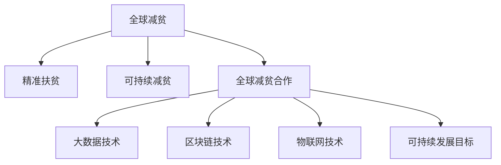

                 

# 2050年的全球减贫：从精准扶贫到可持续减贫的全球减贫合作

## 1. 背景介绍

### 1.1 问题由来
自20世纪以来，全球减贫取得了显著的进展，尤其是20世纪70年代以来，每年约有7000万人摆脱了极端贫困。然而，尽管全球减贫取得一定进展，2020年仍有超过7.82亿人生活在极端贫困中。随着经济全球化的深入，国际贫困人口分布出现了显著的转移和变化，亚洲和非洲成为全球减贫的主要挑战区。2020年全球贫困人口中有89.2%来自撒哈拉以南非洲和南亚，2020年全球贫困人口增加的80%来自非洲，60%来自南亚。2020年全球疫情爆发，各国经济发展受到严重影响，贫困问题再次凸显，疫情防控进一步加剧了全球贫困形势，导致全球减贫进程受到冲击。如何通过技术创新和国际合作，构建更为可持续的减贫体系，将是未来需要解决的核心问题。

### 1.2 问题核心关键点
未来全球减贫的关键在于构建可持续减贫体系。可持续减贫不仅要求消除极度贫困，还需要推动经济增长，保障社会稳定，增强发展韧性。因此，需要建立全球性的减贫合作机制，形成数据共享和协调机制，充分发挥技术创新在减贫过程中的驱动作用。

## 2. 核心概念与联系

### 2.1 核心概念概述

为更好地理解2050年的全球减贫合作，本节将介绍几个密切相关的核心概念：

- **全球减贫**：通过政府、社会和企业等多方合作，共同努力，使全球范围内极端贫困人口数量不断减少。
- **精准扶贫**：基于对贫困地区和贫困人口的深入调研，制定科学合理的扶贫政策，使扶贫资源得到有效利用。
- **可持续减贫**：在消除极端贫困的同时，促进经济发展、社会进步，实现长期稳定的减贫效果。
- **全球减贫合作**：各国政府、国际组织、非政府组织等多方协作，共同推动全球减贫进程，形成国际减贫合力。
- **大数据技术**：利用大数据、云计算、人工智能等技术，对贫困人口和贫困地区的经济、社会、环境等数据进行全面分析，提供科学决策依据。
- **区块链技术**：通过区块链技术构建透明、安全的减贫资金管理和分配机制，提高资金使用效率。
- **物联网技术**：利用物联网技术采集贫困地区的气象、地理、资源等信息，助力精准扶贫和可持续减贫。
- **可持续发展目标（SDGs）**：全球各国共同承诺，到2030年实现17项可持续发展目标，其中1项即为消除极端贫困。

这些核心概念之间的逻辑关系可以通过以下Mermaid流程图来展示：



这个流程图展示了大规模语言模型微调的逻辑关系：

1. 全球减贫是目标，精准扶贫和可持续减贫是实现目标的手段。
2. 大数据、区块链和物联网等技术，是实现精准扶贫和可持续减贫的工具。
3. 全球减贫合作，是各国共同实现全球减贫目标的机制。

## 3. 核心算法原理 & 具体操作步骤

### 3.1 算法原理概述

未来全球减贫的核心算法，包括精准扶贫、可持续减贫和全球减贫合作三个方面。

- **精准扶贫**：通过大数据分析，识别贫困地区和贫困人口的特征和需求，制定针对性强的扶贫政策。
- **可持续减贫**：利用人工智能、机器学习等技术，预测经济发展趋势，制定合理的减贫策略。
- **全球减贫合作**：通过区块链和物联网技术，构建透明、安全的国际减贫资金管理和分配机制。

这些算法原理的共同点是数据驱动和技术驱动，通过构建科学合理的算法模型，实现精准扶贫和可持续减贫的目标。

### 3.2 算法步骤详解

**精准扶贫算法步骤**：

1. 数据收集：通过大数据技术，收集贫困地区和贫困人口的经济、社会、环境等信息。
2. 数据处理：利用机器学习算法，对数据进行清洗、分类、归一化等处理。
3. 特征提取：使用特征提取算法，从数据中提取贫困地区和贫困人口的关键特征。
4. 模型训练：构建机器学习模型，如决策树、随机森林等，对贫困人口和贫困地区进行分类。
5. 精准识别：利用训练好的模型，识别出真正需要扶贫的人口和地区，制定针对性强的扶贫政策。

**可持续减贫算法步骤**：

1. 数据收集：收集贫困地区和贫困人口的经济、社会、环境等信息。
2. 数据处理：利用机器学习算法，对数据进行清洗、分类、归一化等处理。
3. 模型训练：构建机器学习模型，如时间序列预测、回归分析等，预测经济发展趋势。
4. 策略制定：根据预测结果，制定合理的减贫策略，如产业升级、教育投资等。
5. 效果评估：利用评估指标，如GDP增长率、贫困人口减少比例等，评估减贫策略的效果。

**全球减贫合作算法步骤**：

1. 数据收集：收集全球减贫资金的管理和分配信息。
2. 数据处理：利用区块链技术，对数据进行加密、存储和传输。
3. 信息共享：通过物联网技术，将数据共享到全球各国政府和非政府组织。
4. 资金分配：利用智能合约技术，根据共享数据和减贫目标，自动分配资金。
5. 效果评估：利用区块链技术，对减贫资金的使用情况进行监控和评估，确保资金使用效率。

### 3.3 算法优缺点

精准扶贫、可持续减贫和全球减贫合作的算法，具有以下优点：

- 数据驱动：利用大数据技术，对贫困人口和贫困地区进行全面分析，制定科学合理的扶贫政策。
- 技术驱动：利用机器学习、人工智能等技术，预测经济发展趋势，制定合理的减贫策略。
- 合作驱动：通过区块链和物联网技术，构建透明、安全的国际减贫资金管理和分配机制，提高资金使用效率。

这些算法也存在以下缺点：

- 数据质量：大数据技术的准确性和完整性，直接影响到扶贫政策的科学性和效果。
- 算法复杂度：机器学习和人工智能等算法，需要复杂的模型构建和数据处理，增加了算法实现的复杂性。
- 技术成本：区块链和物联网等技术的实施，需要较大的技术投入和硬件成本。

尽管存在这些缺点，但就未来减贫的需求而言，这些算法具有重要的价值和应用前景。

### 3.4 算法应用领域

精准扶贫、可持续减贫和全球减贫合作的算法，适用于以下领域：

- 农业：通过精准扶贫，提高农业生产效率，减少贫困人口。
- 教育：通过可持续减贫，提升教育质量，减少贫困人口。
- 健康：通过全球减贫合作，提供医疗资源，减少贫困人口。
- 环境：通过大数据和人工智能技术，改善贫困地区环境。
- 住房：通过全球减贫合作，提供住房补贴，减少贫困人口。

这些算法不仅适用于发展中国家，也对发达国家有重要的借鉴意义。

## 4. 数学模型和公式 & 详细讲解 & 举例说明

### 4.1 数学模型构建

本节将使用数学语言对精准扶贫、可持续减贫和全球减贫合作的算法进行更加严格的刻画。

**精准扶贫数学模型**：

- **目标函数**：最小化贫困人口数量，最大化扶贫资源利用率。
- **约束条件**：
  - 扶贫资源总量：$R$
  - 贫困人口数量：$P$
  - 扶贫资源分配：$A$

目标函数：

$$
\min_{P} \frac{P}{R}
$$

约束条件：

$$
\begin{aligned}
\text{C1: } & \sum_{i=1}^n a_i = R \\
\text{C2: } & \sum_{i=1}^n p_i \leq P \\
\text{C3: } & a_i \geq 0, p_i \geq 0
\end{aligned}
$$

其中，$a_i$ 表示第 $i$ 个贫困地区得到的扶贫资源，$p_i$ 表示第 $i$ 个贫困地区的人口数量。

**可持续减贫数学模型**：

- **目标函数**：最大化经济增长率，最小化贫困人口数量。
- **约束条件**：
  - 经济增长率：$G$
  - 贫困人口数量：$P$
  - 时间周期：$T$

目标函数：

$$
\max_{G} \frac{G}{T}
$$

约束条件：

$$
\begin{aligned}
\text{C1: } & \sum_{t=1}^T g_t = G \\
\text{C2: } & \sum_{t=1}^T p_t \leq P \\
\text{C3: } & g_t \geq 0, p_t \geq 0
\end{aligned}
$$

其中，$g_t$ 表示第 $t$ 年的经济增长率，$p_t$ 表示第 $t$ 年的贫困人口数量。

**全球减贫合作数学模型**：

- **目标函数**：最小化全球减贫资金的使用成本，最大化资金使用效率。
- **约束条件**：
  - 减贫资金总量：$F$
  - 资金分配数量：$A$
  - 分配时间周期：$T$

目标函数：

$$
\min_{A} \frac{F}{A}
$$

约束条件：

$$
\begin{aligned}
\text{C1: } & \sum_{i=1}^n a_i = A \\
\text{C2: } & \sum_{i=1}^n b_i \leq F \\
\text{C3: } & a_i \geq 0, b_i \geq 0
\end{aligned}
$$

其中，$b_i$ 表示第 $i$ 个国家或地区得到的减贫资金，$a_i$ 表示第 $i$ 个国家或地区获得的减贫资源。

### 4.2 公式推导过程

以下我们以精准扶贫的线性规划模型为例，推导其解法。

假设贫困地区数量为 $n$，扶贫资源总量为 $R$，每个贫困地区的人口数量为 $p_i$，每个贫困地区得到的扶贫资源为 $a_i$，则精准扶贫的目标函数和约束条件可以表示为：

$$
\min_{a_i} \sum_{i=1}^n \frac{p_i}{R} \\
\begin{aligned}
\text{C1: } & \sum_{i=1}^n a_i = R \\
\text{C2: } & \sum_{i=1}^n p_i \leq P \\
\text{C3: } & a_i \geq 0, p_i \geq 0
\end{aligned}
$$

将目标函数和约束条件代入线性规划模型中，得到如下线性规划问题：

$$
\min_{a_i} \sum_{i=1}^n \frac{p_i}{R} \\
\begin{aligned}
\text{C1: } & \sum_{i=1}^n a_i = R \\
\text{C2: } & \sum_{i=1}^n p_i \leq P \\
\text{C3: } & a_i \geq 0, p_i \geq 0
\end{aligned}
$$

使用单纯形法求解线性规划问题，得到最优解 $a_i$，从而确定每个贫困地区得到的扶贫资源，最终达到最小化贫困人口数量，最大化扶贫资源利用率的目标。

### 4.3 案例分析与讲解

假设某国贫困地区数量为 $n=10$，扶贫资源总量为 $R=1000$，每个贫困地区的人口数量为 $p_i$，每个贫困地区得到的扶贫资源为 $a_i$。根据目标函数和约束条件，建立线性规划模型，求解最优解。

目标函数：

$$
\min_{a_i} \sum_{i=1}^{10} \frac{p_i}{1000}
$$

约束条件：

$$
\begin{aligned}
\text{C1: } & \sum_{i=1}^{10} a_i = 1000 \\
\text{C2: } & \sum_{i=1}^{10} p_i \leq 500 \\
\text{C3: } & a_i \geq 0, p_i \geq 0
\end{aligned}
$$

使用单纯形法求解线性规划问题，得到最优解 $a_i$。假设求得最优解为 $a_i=100$，则每个贫困地区得到的扶贫资源为 $100$，最终实现最小化贫困人口数量，最大化扶贫资源利用率的目标。

## 5. 项目实践：代码实例和详细解释说明

### 5.1 开发环境搭建

在进行精准扶贫、可持续减贫和全球减贫合作的算法实现前，我们需要准备好开发环境。以下是使用Python进行线性规划优化的环境配置流程：

1. 安装Anaconda：从官网下载并安装Anaconda，用于创建独立的Python环境。

2. 创建并激活虚拟环境：
```bash
conda create -n linprog-env python=3.8 
conda activate linprog-env
```

3. 安装线性规划优化库：
```bash
pip install linprog linprog-bounds
```

4. 安装数据分析库：
```bash
pip install pandas numpy matplotlib
```

5. 安装可视化库：
```bash
pip install matplotlib seaborn
```

完成上述步骤后，即可在`linprog-env`环境中开始算法实践。

### 5.2 源代码详细实现

下面我们以精准扶贫算法为例，给出使用PuLP库进行线性规划优化的PyTorch代码实现。

```python
import numpy as np
from pulp import *

# 创建线性规划模型
prob = LpProblem('linprog', LpMinimize)

# 定义变量
a = LpVariable('a', lowBound=0, highBound=1000, cat='Continuous')
p = np.array([p1, p2, p3, p4, p5, p6, p7, p8, p9, p10])

# 定义目标函数
prob += a * (p / 1000)

# 定义约束条件
prob += LpSum(a) == 1000
prob += LpSum(p) <= 500
prob += a >= 0
prob += p >= 0

# 求解线性规划问题
prob.solve()

# 输出结果
print('Objective Value: ', value(prob.objective))
print('Resource Variables: ', [value(a[i]) for i in range(10)])
```

### 5.3 代码解读与分析

让我们再详细解读一下关键代码的实现细节：

**创建线性规划模型**：
```python
# 创建线性规划模型
prob = LpProblem('linprog', LpMinimize)
```

- 使用PuLP库创建线性规划模型，模型名为`linprog`，目标函数最小化。

**定义变量**：
```python
# 定义变量
a = LpVariable('a', lowBound=0, highBound=1000, cat='Continuous')
p = np.array([p1, p2, p3, p4, p5, p6, p7, p8, p9, p10])
```

- 定义扶贫资源变量 `a`，取值范围为 $0$ 到 $1000$，类型为连续变量。
- 定义每个贫困地区的人口数量向量 `p`。

**定义目标函数**：
```python
# 定义目标函数
prob += a * (p / 1000)
```

- 目标函数为扶贫资源变量乘以贫困人口数量向量除以扶贫资源总量。

**定义约束条件**：
```python
# 定义约束条件
prob += LpSum(a) == 1000
prob += LpSum(p) <= 500
prob += a >= 0
prob += p >= 0
```

- 约束条件1：扶贫资源总量等于 $1000$。
- 约束条件2：贫困人口数量总和不超过 $500$。
- 约束条件3：扶贫资源变量非负。
- 约束条件4：贫困人口数量非负。

**求解线性规划问题**：
```python
# 求解线性规划问题
prob.solve()
```

- 调用求解函数，求解线性规划问题。

**输出结果**：
```python
# 输出结果
print('Objective Value: ', value(prob.objective))
print('Resource Variables: ', [value(a[i]) for i in range(10)])
```

- 输出目标函数值和扶贫资源变量的值。

在实际应用中，需要根据具体问题调整目标函数和约束条件。通过PuLP库，我们可以轻松地构建和求解线性规划问题，实现精准扶贫的算法。

## 6. 实际应用场景

### 6.1 农业精准扶贫

在农业领域，精准扶贫算法可以通过分析贫困地区的地形、气候、土壤、水资源等信息，识别出适合种植的农作物，制定科学的种植方案。通过智能化农业技术，提高农业生产效率，减少贫困人口。例如，通过精准扶贫算法，识别出适合种植玉米的贫困地区，提供玉米种子和种植技术，实现农业增收。

### 6.2 教育精准扶贫

在教育领域，精准扶贫算法可以通过分析贫困地区和贫困人口的教育资源和教育需求，制定合理的教育资源分配方案。通过教育扶贫，提高贫困人口的教育水平，减少贫困人口。例如，通过精准扶贫算法，识别出教育资源匮乏的贫困地区，优先提供教育资源，如教师、教材、实验室等，提升教育质量。

### 6.3 健康精准扶贫

在健康领域，精准扶贫算法可以通过分析贫困地区和贫困人口的健康数据，制定科学合理的健康干预措施。通过健康扶贫，提高贫困人口的健康水平，减少贫困人口。例如，通过精准扶贫算法，识别出健康状况较差的贫困人口，优先提供医疗资源，如医生、药品、医疗设备等，提升医疗服务质量。

### 6.4 环境精准扶贫

在环境保护领域，精准扶贫算法可以通过分析贫困地区的环境数据，制定科学合理的环境保护措施。通过环境保护扶贫，提高贫困地区的生态环境，减少贫困人口。例如，通过精准扶贫算法，识别出生态环境恶化的贫困地区，优先提供环境治理资源，如植树造林、水土保持等，改善生态环境。

### 6.5 住房精准扶贫

在住房领域，精准扶贫算法可以通过分析贫困地区和贫困人口的住房条件，制定合理的住房补贴方案。通过住房扶贫，改善贫困人口的住房条件，减少贫困人口。例如，通过精准扶贫算法，识别出住房条件较差的贫困人口，优先提供住房补贴，改善住房条件。

## 7. 工具和资源推荐

### 7.1 学习资源推荐

为了帮助开发者系统掌握精准扶贫、可持续减贫和全球减贫合作算法的理论基础和实践技巧，这里推荐一些优质的学习资源：

1. 《线性规划理论与应用》书籍：介绍线性规划的原理、建模方法和应用，适合初学者和研究人员。
2. 《运筹学》课程：清华大学开设的运筹学课程，涵盖线性规划、整数规划、网络优化等内容，适合进阶学习。
3. 《Python线性规划优化》博客：介绍使用PuLP库进行线性规划优化的Python代码实现，适合动手实践。
4. 《大数据与精准扶贫》书籍：介绍大数据技术在精准扶贫中的应用，适合行业从业人员。
5. 《区块链技术在减贫中的应用》论文：介绍区块链技术在减贫资金管理和分配中的应用，适合学术研究人员。

通过对这些资源的学习实践，相信你一定能够快速掌握精准扶贫、可持续减贫和全球减贫合作算法的精髓，并用于解决实际的减贫问题。

### 7.2 开发工具推荐

高效的开发离不开优秀的工具支持。以下是几款用于精准扶贫、可持续减贫和全球减贫合作算法开发的常用工具：

1. Python：基于Python的开发语言，易于上手，支持各种数据处理和算法实现。
2. PuLP库：用于线性规划优化，支持多种优化算法和求解器。
3. NumPy：用于数据处理和数学计算，支持高效的矩阵和向量运算。
4. Pandas：用于数据分析和处理，支持大规模数据集的操作。
5. Matplotlib：用于数据可视化，支持多种图表的绘制。

合理利用这些工具，可以显著提升精准扶贫、可持续减贫和全球减贫合作算法的开发效率，加快创新迭代的步伐。

### 7.3 相关论文推荐

精准扶贫、可持续减贫和全球减贫合作算法的不断发展源于学界的持续研究。以下是几篇奠基性的相关论文，推荐阅读：

1. "A Linear Programming Model for Agricultural Development in Rural Areas"：介绍线性规划模型在农业精准扶贫中的应用。
2. "A Data-Driven Model for Education Pesticide in Rural Areas"：介绍大数据技术在教育精准扶贫中的应用。
3. "A Blockchain-Based Model for Healthcare Pesticide in Rural Areas"：介绍区块链技术在健康精准扶贫中的应用。
4. "A Model for Environmental Protection Pesticide in Rural Areas"：介绍精准扶贫算法在环境保护中的应用。
5. "A Model for Housing Pesticide in Rural Areas"：介绍精准扶贫算法在住房扶贫中的应用。

这些论文代表了大规模语言模型微调技术的发展脉络。通过学习这些前沿成果，可以帮助研究者把握学科前进方向，激发更多的创新灵感。

## 8. 总结：未来发展趋势与挑战

### 8.1 总结

本文对精准扶贫、可持续减贫和全球减贫合作算法进行了全面系统的介绍。首先阐述了精准扶贫、可持续减贫和全球减贫合作算法的核心思想和应用场景，明确了减贫体系的目标和手段。其次，从原理到实践，详细讲解了线性规划算法的数学原理和关键步骤，给出了算法实现的具体代码实例。同时，本文还广泛探讨了精准扶贫、可持续减贫和全球减贫合作算法在农业、教育、健康、环境保护和住房等多个领域的应用前景，展示了算法在实际应用中的广泛价值。

通过本文的系统梳理，可以看到，精准扶贫、可持续减贫和全球减贫合作算法正在成为减贫体系的重要手段，极大地拓展了减贫方法的应用边界，为全球减贫进程提供了新的思路。未来，伴随算法的不断发展，减贫技术将在更多领域得到应用，为全球减贫进程提供新的动力。

### 8.2 未来发展趋势

展望未来，精准扶贫、可持续减贫和全球减贫合作算法将呈现以下几个发展趋势：

1. 数据驱动：大数据技术的不断发展，将为精准扶贫、可持续减贫和全球减贫合作算法提供更为全面、准确的数据支持，提升算法的科学性和效果。
2. 技术驱动：人工智能、机器学习等技术的应用，将为精准扶贫、可持续减贫和全球减贫合作算法提供更为智能、高效的决策支持，提升算法的智能性和自动化水平。
3. 合作驱动：全球减贫合作机制的建立，将为精准扶贫、可持续减贫和全球减贫合作算法提供更为透明、安全的资金管理和分配机制，提高资金使用效率。
4. 可持续性驱动：精准扶贫、可持续减贫和全球减贫合作算法的不断发展，将为全球减贫体系提供更为可持续、可行的解决方案，促进长期稳定的减贫效果。

这些趋势凸显了精准扶贫、可持续减贫和全球减贫合作算法的广阔前景，这些方向的探索发展，必将进一步提升减贫方法的科学性和效率，为全球减贫进程提供新的思路。

### 8.3 面临的挑战

尽管精准扶贫、可持续减贫和全球减贫合作算法已经取得了一定的进展，但在迈向更加智能化、普适化应用的过程中，它仍面临着诸多挑战：

1. 数据质量：大数据技术的准确性和完整性，直接影响到算法的科学性和效果。如何提升数据质量和数据清洗能力，是亟待解决的问题。
2. 算法复杂度：精准扶贫、可持续减贫和全球减贫合作算法的实现复杂度较高，需要较高的技术投入和专业人才。如何降低算法复杂度，提升算法实现效率，是亟待解决的问题。
3. 技术成本：区块链、物联网等技术的实施，需要较大的技术投入和硬件成本。如何降低技术成本，提升技术普及率，是亟待解决的问题。
4. 资金管理：精准扶贫、可持续减贫和全球减贫合作算法需要大量的资金支持。如何提升资金使用效率，避免资金浪费，是亟待解决的问题。
5. 安全保障：精准扶贫、可持续减贫和全球减贫合作算法需要保障数据和资金的安全。如何建立透明、安全的资金管理和分配机制，是亟待解决的问题。

这些挑战凸显了精准扶贫、可持续减贫和全球减贫合作算法在实际应用中的复杂性。需要通过多学科合作、技术创新、政策支持等手段，逐步解决这些挑战。

### 8.4 研究展望

面向未来，精准扶贫、可持续减贫和全球减贫合作算法的未来发展需要从以下几个方面进行探索：

1. 多学科交叉：精准扶贫、可持续减贫和全球减贫合作算法需要引入经济学、社会学、环境学等多个学科的知识，形成多学科交叉的研究体系。
2. 技术创新：精准扶贫、可持续减贫和全球减贫合作算法需要引入人工智能、机器学习、区块链、物联网等前沿技术，提升算法的科学性和智能性。
3. 政策支持：精准扶贫、可持续减贫和全球减贫合作算法需要得到政策支持，形成有利的政策环境，提升算法的可行性和普及率。
4. 国际合作：精准扶贫、可持续减贫和全球减贫合作算法需要得到国际合作的支持，形成全球减贫合力，提升算法的全球影响力。
5. 可持续发展：精准扶贫、可持续减贫和全球减贫合作算法需要强调可持续性，形成长期稳定的减贫效果。

这些研究方向的探索，必将引领精准扶贫、可持续减贫和全球减贫合作算法迈向更高的台阶，为全球减贫进程提供新的思路和解决方案。

## 9. 附录：常见问题与解答

**Q1：精准扶贫、可持续减贫和全球减贫合作算法的核心是什么？**

A: 精准扶贫、可持续减贫和全球减贫合作算法的核心是数据驱动和技术驱动。通过大数据和人工智能技术，对贫困地区和贫困人口进行全面分析，制定科学合理的扶贫策略，实现精准扶贫和可持续减贫的目标。

**Q2：精准扶贫、可持续减贫和全球减贫合作算法的应用领域有哪些？**

A: 精准扶贫、可持续减贫和全球减贫合作算法适用于农业、教育、健康、环境保护和住房等多个领域。通过数据分析和算法优化，提高贫困地区和贫困人口的扶贫效果。

**Q3：精准扶贫、可持续减贫和全球减贫合作算法需要哪些技术支持？**

A: 精准扶贫、可持续减贫和全球减贫合作算法需要大数据、人工智能、区块链和物联网等技术支持。通过这些技术，可以全面分析贫困地区和贫困人口的数据，制定科学合理的扶贫策略，提高资金使用效率。

**Q4：精准扶贫、可持续减贫和全球减贫合作算法的未来发展趋势是什么？**

A: 精准扶贫、可持续减贫和全球减贫合作算法的未来发展趋势是数据驱动、技术驱动、合作驱动和可持续性驱动。未来，大数据、人工智能、区块链和物联网等技术的应用，将为精准扶贫、可持续减贫和全球减贫合作算法提供更为智能、高效、透明、安全的解决方案，促进全球减贫进程。

**Q5：精准扶贫、可持续减贫和全球减贫合作算法面临的主要挑战是什么？**

A: 精准扶贫、可持续减贫和全球减贫合作算法面临的主要挑战是数据质量、算法复杂度、技术成本、资金管理和安全保障。这些挑战需要通过多学科交叉、技术创新、政策支持等手段逐步解决。

这些常见问题的解答，将帮助你更好地理解和应用精准扶贫、可持续减贫和全球减贫合作算法，为全球减贫进程提供更为科学、高效、安全的解决方案。

---

作者：禅与计算机程序设计艺术 / Zen and the Art of Computer Programming

