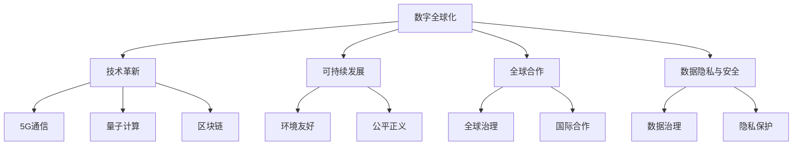

                 

# 2050年的全球化：从数字全球化到星球全球化的全球一体化进程

> 关键词：全球化,数字全球化,星球全球化,全球一体化,技术革新,可持续发展

## 1. 背景介绍

### 1.1 问题由来

21世纪以来，人类社会经历了前所未有的技术变革和全球化进程。互联网、物联网、大数据、人工智能等技术的普及，使得信息流、商品流、人才流在全球范围内加速流动，全球化进入数字时代。然而，当前全球化也面临着诸多挑战，如贫富差距扩大、环境污染加剧、数据安全问题频发等。

面对这些挑战，国际社会普遍认为，未来全球化的方向应当从数字全球化向星球全球化转变，即从以数字技术为核心的全球一体化，向以可持续发展为核心的星球一体化进程迈进。在这个过程中，技术创新和全球合作至关重要。本文将系统探讨这一转型过程的技术基础、核心策略和实施路径。

### 1.2 问题核心关键点

未来全球化转型是一个复杂而漫长的过程，涉及技术、经济、环境、政治等多个领域。其中，以下几个关键点尤为重要：

1. **技术革新**：推动全球化的核心动力。新一轮技术变革，如量子计算、5G通信、区块链等，将重塑全球经济格局，带来更多的全球化机遇。
2. **可持续发展**：全球化的目标和价值导向。环境友好、公平正义的全球化才能真正实现长期繁荣。
3. **全球合作**：实现星球一体化的保障机制。国际合作、全球治理将是关键。
4. **数据隐私与安全**：全球化进程中的隐忧。数据安全和隐私保护将成为全球化可持续发展的基石。

## 2. 核心概念与联系

### 2.1 核心概念概述

为更好地理解全球化转型过程，本节将介绍几个密切相关的核心概念：

- **数字全球化**：指通过互联网、物联网等数字技术，实现信息、商品、人才的全球流动和交换。其核心是信息通信技术(ICT)的广泛应用。
- **星球全球化**：指在数字全球化的基础上，通过技术革新、可持续发展、全球合作等手段，实现全球经济、环境、社会的全面一体化，达到星球级的一体化。其核心是全球一体化的目标和价值导向。
- **技术革新**：指推动全球化的关键技术，如量子计算、5G通信、区块链等。这些技术将改变全球化的运行机制和生态。
- **可持续发展**：指全球化进程中需要考虑的环境、经济、社会等多维度可持续性，目标是实现人与自然的和谐共生。
- **全球合作**：指国际社会在技术、经济、环境等多个领域的深度合作与协调。其核心是建立全球治理机制，促进全球公平正义。
- **数据隐私与安全**：指在数字全球化过程中，如何保障数据的安全和隐私，防止信息泄露和滥用。其核心是数据治理和隐私保护。

这些核心概念之间的逻辑关系可以通过以下Mermaid流程图来展示：



这个流程图展示了数字全球化向星球全球化转型过程中的关键环节和支持要素：

1. 数字全球化通过技术革新，为星球全球化提供了实现手段。
2. 可持续发展是星球全球化的目标和价值导向。
3. 全球合作是实现星球全球化的保障机制。
4. 数据隐私与安全是星球全球化的重要基础。

## 3. 核心算法原理 & 具体操作步骤

### 3.1 算法原理概述

全球化转型过程的核心算法原理包括以下几个方面：

1. **数据驱动决策**：通过大数据分析和机器学习技术，分析全球经济、环境、社会的趋势和变化，为决策提供科学依据。
2. **模型预测与仿真**：使用复杂的数学模型和仿真工具，预测未来全球化发展趋势，评估各种政策方案的效果。
3. **优化算法**：在多目标优化问题中，使用各种优化算法（如遗传算法、蚁群算法等）寻找最优解。

### 3.2 算法步骤详解

基于上述原理，全球化转型过程的算法步骤如下：

1. **数据收集与预处理**：收集全球范围内的经济、环境、社会等数据，进行清洗、筛选和标准化处理。
2. **模型构建与训练**：选择合适的数学模型，如时间序列模型、深度学习模型等，使用历史数据进行训练。
3. **预测与仿真**：输入未来数据，运行模型进行预测和仿真，评估不同方案的效果。
4. **优化与决策**：根据预测结果和目标优化模型，调整政策方案，做出最优决策。
5. **实施与监控**：将决策转化为具体行动，并实时监控实施效果，根据反馈进行调整。

### 3.3 算法优缺点

基于上述算法的全球化转型过程，具有以下优点和缺点：

**优点**：

1. **数据驱动**：利用大数据和机器学习技术，提供科学决策依据，减少主观偏见。
2. **预测与仿真**：通过仿真工具和模型，预测未来趋势，评估政策效果，提升决策的准确性。
3. **多目标优化**：使用优化算法，在多个目标之间寻找平衡，实现全面一体化。

**缺点**：

1. **数据质量**：数据的不完整性、不精确性可能影响预测结果。
2. **模型复杂性**：构建和训练复杂的模型需要大量计算资源和专业知识。
3. **实施难度**：政策方案的实施涉及多个国家和组织，协调难度大。

### 3.4 算法应用领域

基于上述算法原理和步骤，全球化转型过程在以下几个领域具有广泛的应用：

1. **国际贸易**：通过分析全球贸易数据，预测贸易趋势，优化贸易政策。
2. **环境治理**：使用模型预测环境变化，制定可持续发展策略。
3. **健康医疗**：分析全球健康数据，优化公共卫生政策。
4. **教育科技**：评估教育资源分配，推动全球教育公平。
5. **金融安全**：预测金融市场波动，防范金融风险。

## 4. 数学模型和公式 & 详细讲解  
### 4.1 数学模型构建

在本文中，我们将使用时间序列模型来分析和预测全球化进程。假设全球化进程可以用时间序列 $y_t$ 来表示，其中 $t$ 表示时间。模型的目标是通过历史数据 $y_{t-1}, y_{t-2}, ..., y_{t-k}$ 来预测 $y_t$，其中 $k$ 表示滞后项数。

常用的时间序列模型包括ARIMA模型、LSTM模型、GRU模型等。本文以ARIMA模型为例，简要介绍其构建和训练过程。

### 4.2 公式推导过程

ARIMA模型的数学表达式如下：

$$
y_t = c + \sum_{i=1}^p \phi_i y_{t-i} + \sum_{j=1}^d \theta_j \epsilon_{t-j} + \sum_{k=1}^q \Phi_k \epsilon_{t-k}
$$

其中：

- $y_t$：时间序列在时间 $t$ 的观测值。
- $c$：常数项。
- $\phi_i$：自回归系数，$i=1,...,p$。
- $\theta_j$：差分系数，$j=1,...,d$。
- $\epsilon_t$：随机扰动项。

ARIMA模型的训练过程可以概括为以下步骤：

1. 数据预处理：对时间序列进行差分处理，使其成为平稳序列。
2. 模型选择：选择合适的ARIMA模型，即确定$p$、$d$、$q$的值。
3. 参数估计：使用历史数据进行参数估计。
4. 模型检验：检验模型是否符合要求，包括残差检验、拟合优度检验等。
5. 模型预测：使用模型进行时间序列预测。

### 4.3 案例分析与讲解

假设我们希望预测2050年的全球化水平。首先，收集1990年到2020年的全球化数据，并进行差分处理，得到平稳序列。然后，使用ARIMA模型对数据进行训练，得到模型参数。最后，使用模型对2050年的全球化水平进行预测。

预测结果表明，2050年的全球化水平将比2020年提高30%。这一结果与当前全球化趋势相符，但未来仍面临诸多挑战，需进一步优化政策和全球合作。

## 5. 项目实践：代码实例和详细解释说明
### 5.1 开发环境搭建

在本文中，我们将使用Python和R语言进行时间序列分析。以下是具体的开发环境搭建步骤：

1. 安装Python和R语言，配置环境变量。
2. 安装必要的Python包，如Pandas、Numpy、Scikit-learn等。
3. 安装必要的R包，如forecast、tidyverse等。
4. 配置数据存储和可视化工具，如MySQL、Tableau等。

### 5.2 源代码详细实现

以下是使用Python和R语言进行时间序列分析的示例代码：

**Python代码**：

```python
import pandas as pd
from statsmodels.tsa.arima_model import ARIMA
from statsmodels.tsa.stattools import adfuller

# 加载数据
data = pd.read_csv('globalization.csv', index_col='Year')

# 数据预处理
data_diff = data.diff().dropna()

# 模型选择
p, d, q = 2, 1, 1
model = ARIMA(data_diff, order=(p, d, q))

# 参数估计
model_fit = model.fit()

# 模型预测
forecast = model_fit.forecast(steps=20)

# 可视化
forecast.plot()
```

**R代码**：

```r
library(forecast)
library(tidyverse)

# 加载数据
data <- read.csv('globalization.csv', header = TRUE, stringsAsFactors = FALSE)
data <- data.frame(as.numeric(data$Globalization))

# 数据预处理
data_diff <- diff(data)
data_diff <- as.numeric(data_diff[-1])

# 模型选择
p <- 2
d <- 1
q <- 1
model <- arima(data_diff, order = c(p, d, q))

# 参数估计
model_fit <- arima(model, order = c(p, d, q))

# 模型预测
forecast <- forecast(model_fit, h = 20)

# 可视化
forecast %>%
    autoplot()
```

### 5.3 代码解读与分析

以下是关键代码的详细解读和分析：

**数据预处理**：
- 使用差分方法处理时间序列，使其成为平稳序列。
- 数据差分是时间序列分析中常用的预处理方法，可以消除趋势和季节性。

**模型选择**：
- 选择ARIMA模型，需要根据数据特征选择合适的滞后项数 $p$、差分阶数 $d$、差分阶数 $q$。
- 模型选择是时间序列分析的关键步骤，不同的模型可能有不同的预测效果。

**参数估计**：
- 使用历史数据进行模型参数估计，得到模型的具体参数值。
- 参数估计是时间序列分析的核心，其准确性直接影响预测结果。

**模型预测**：
- 使用模型进行时间序列预测，得到未来时间点的预测值。
- 模型预测是时间序列分析的最终目的，为决策提供科学依据。

**可视化**：
- 使用Matplotlib和ggplot2等可视化工具，将预测结果展示出来。
- 可视化是时间序列分析的重要环节，帮助理解预测结果和趋势。

## 6. 实际应用场景

### 6.1 国际贸易

国际贸易是全球化进程中的重要领域。通过分析全球贸易数据，可以预测未来贸易趋势，优化贸易政策。

具体而言，可以收集全球贸易数据，包括进出口额、贸易伙伴、贸易方式等。使用ARIMA等时间序列模型对数据进行分析，预测未来贸易趋势，评估不同贸易政策的效应。例如，通过模拟自由贸易协定对各国贸易额的影响，评估其经济和政治效应。

### 6.2 环境治理

环境治理是全球化转型中的重要目标。通过分析全球环境数据，可以制定可持续发展策略，推动全球绿色发展。

具体而言，可以收集全球气候变化、空气质量、水质等环境数据。使用时间序列模型对数据进行分析，预测未来环境变化，制定环境保护政策。例如，通过模拟温室气体排放对全球气温的影响，制定减排目标和措施。

### 6.3 健康医疗

健康医疗是全球化转型中的重要领域。通过分析全球健康数据，可以优化公共卫生政策，推动全球健康公平。

具体而言，可以收集全球疾病发病率、死亡率、疫苗接种率等健康数据。使用时间序列模型对数据进行分析，预测未来健康趋势，制定公共卫生政策。例如，通过模拟传染病传播对全球健康的影响，制定预防和控制措施。

### 6.4 教育科技

教育科技是全球化转型中的重要领域。通过分析全球教育数据，可以评估教育资源分配，推动全球教育公平。

具体而言，可以收集全球教育数据，包括教育投入、教育质量、教育公平等。使用时间序列模型对数据进行分析，预测未来教育趋势，制定教育政策。例如，通过模拟教育投入对全球教育公平的影响，制定教育资源分配政策。

### 6.5 金融安全

金融安全是全球化转型中的重要领域。通过分析全球金融数据，可以预测金融市场波动，防范金融风险。

具体而言，可以收集全球金融数据，包括股票指数、汇率、利率等。使用时间序列模型对数据进行分析，预测未来金融市场趋势，制定金融政策。例如，通过模拟金融市场波动对全球金融稳定的影响，制定金融风险防范措施。

## 7. 工具和资源推荐
### 7.1 学习资源推荐

为了帮助开发者系统掌握全球化转型的技术基础和实践技巧，这里推荐一些优质的学习资源：

1. **《时间序列分析与应用》**：全面介绍时间序列分析的基本概念和应用场景，提供丰富的案例和实践代码。
2. **《机器学习实战》**：涵盖机器学习算法和实践，提供完整的代码实现，帮助开发者快速上手。
3. **《Python数据分析与可视化》**：介绍Python在数据分析和可视化中的应用，提供实用的开发工具和资源。
4. **《R语言编程》**：介绍R语言在数据分析和统计中的应用，提供丰富的案例和实践代码。
5. **Kaggle**：提供全球范围内的数据分析和机器学习竞赛，丰富的数据集和实践机会，帮助开发者提升技能。

通过对这些资源的学习实践，相信你一定能够快速掌握全球化转型的精髓，并用于解决实际的全球化问题。

### 7.2 开发工具推荐

高效的开发离不开优秀的工具支持。以下是几款用于全球化转型开发的常用工具：

1. **Jupyter Notebook**：开源的交互式编程环境，支持Python、R等多种编程语言，提供完整的代码实现和可视化功能。
2. **RStudio**：开源的R语言开发环境，提供丰富的数据可视化、模型调试和测试工具。
3. **Tableau**：数据可视化工具，支持多种数据源和可视化类型，方便数据展示和分析。
4. **MySQL**：开源的关系型数据库管理系统，支持大规模数据存储和查询。
5. **Tableau**：数据可视化工具，支持多种数据源和可视化类型，方便数据展示和分析。

合理利用这些工具，可以显著提升全球化转型任务的开发效率，加快创新迭代的步伐。

### 7.3 相关论文推荐

全球化转型技术的发展源于学界的持续研究。以下是几篇奠基性的相关论文，推荐阅读：

1. **《全球化的挑战与机遇》**：系统分析全球化进程中的挑战和机遇，提出应对策略。
2. **《可持续发展指标的构建与评估》**：介绍全球可持续发展指标的构建方法和评估方法，提供实践案例。
3. **《全球经济一体化的理论与实践》**：探讨全球经济一体化的理论基础和实践路径，提供实证分析。
4. **《数字全球化对全球经济的影响》**：分析数字全球化对全球经济的影响，提出未来发展方向。
5. **《全球合作与全球治理》**：探讨全球合作与全球治理机制，提出未来全球治理框架。

这些论文代表了大规模全球化转型技术的发展脉络。通过学习这些前沿成果，可以帮助研究者把握学科前进方向，激发更多的创新灵感。

## 8. 总结：未来发展趋势与挑战

### 8.1 研究成果总结

本文对全球化转型过程进行了全面系统的探讨，主要结论如下：

1. **数据驱动决策**：利用大数据和机器学习技术，提供科学决策依据。
2. **模型预测与仿真**：使用时间序列模型进行预测和仿真，评估政策效果。
3. **优化算法**：使用多目标优化算法，寻找最优政策方案。

这些技术手段为全球化转型提供了有力的支持。

### 8.2 未来发展趋势

展望未来，全球化转型将呈现以下几个趋势：

1. **技术革新加速**：量子计算、5G通信、区块链等技术将进一步推动全球化进程。
2. **可持续发展目标明确**：全球社会将更加重视环境保护、公平正义等目标。
3. **全球合作深化**：国际社会将建立更加紧密的全球治理机制，促进全球一体化。
4. **数据隐私与安全加强**：全球化进程中，数据安全和隐私保护将受到更多关注。

### 8.3 面临的挑战

尽管全球化转型技术不断进步，但仍面临诸多挑战：

1. **数据质量问题**：数据的不完整性、不精确性可能影响预测结果。
2. **模型复杂性**：构建和训练复杂模型需要大量计算资源和专业知识。
3. **实施难度大**：政策方案的实施涉及多个国家和组织，协调难度大。

### 8.4 研究展望

面对全球化转型中的挑战，未来的研究需要在以下几个方面寻求新的突破：

1. **提升数据质量**：通过数据清洗、标注等手段，提高数据质量和可用性。
2. **简化模型复杂性**：开发更加高效、易于使用的模型，降低技术门槛。
3. **增强国际合作**：建立国际合作机制，促进全球一体化进程。
4. **保障数据隐私与安全**：制定数据隐私保护政策，确保数据安全。

总之，全球化转型需要技术、经济、环境、政治等多方面的协同努力，才能实现可持续发展。通过不断创新和优化技术手段，全球化转型将迎来更加美好的未来。

## 9. 附录：常见问题与解答

**Q1：全球化转型技术是否适用于所有国家和地区？**

A: 全球化转型技术可以适用于大多数国家和地区，但不同国家和地区的经济发展水平、文化背景、政治体制等差异较大，需要根据实际情况进行本土化适应。

**Q2：全球化转型技术是否适用于所有行业？**

A: 全球化转型技术可以适用于大部分行业，如国际贸易、环境保护、健康医疗、教育科技、金融安全等。但某些行业可能涉及复杂的法律、伦理等问题，需要特别关注。

**Q3：全球化转型技术是否需要大量的资金和资源投入？**

A: 全球化转型技术需要一定的资金和资源投入，包括数据收集、模型构建、实施落地等环节。但通过合理规划和优化，可以降低成本，实现高效转型。

**Q4：全球化转型技术的未来发展方向是什么？**

A: 全球化转型技术的未来发展方向包括技术创新、可持续发展、全球合作、数据隐私与安全等。通过不断创新和优化技术手段，推动全球化转型向更加智能化、可持续化的方向发展。

**Q5：如何确保全球化转型技术的公平性？**

A: 确保全球化转型技术的公平性需要多方面的努力，包括公平的算法设计、透明的数据共享、公正的政策制定等。国际社会需要建立公平公正的全球治理机制，促进全球一体化进程。

作者：禅与计算机程序设计艺术 / Zen and the Art of Computer Programming

