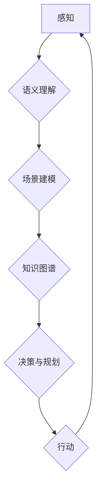

                 

## 利用人类认知解决复杂问题

> 关键词：人工智能、认知科学、复杂系统、决策算法、深度学习、神经网络、人类智能、问题解决

## 1. 背景介绍

在当今数据爆炸和计算能力飞速发展的时代，人工智能（AI）正以惊人的速度发展，并在各个领域展现出强大的应用潜力。然而，面对复杂、多变、充满不确定性的现实世界，现有的AI技术仍然面临着诸多挑战。传统AI算法往往依赖于大量结构化数据和明确的规则，难以应对缺乏明确模式、充满模糊性和主观判断的复杂问题。

人类认知，作为解决复杂问题的核心能力，拥有强大的泛化能力、推理能力和创造力。它能够从有限的信息中提取关键知识，建立抽象模型，并进行灵活的决策和创新。因此，将人类认知的原理和方法融入到AI系统中，是推动AI技术突破瓶颈、实现更智能化应用的关键方向。

## 2. 核心概念与联系

### 2.1 人类认知的本质

人类认知是一个复杂而多层次的过程，涉及感知、记忆、语言、推理、决策等多个认知模块。其核心特征包括：

* **语义理解:** 人类能够理解语言的深层含义，并将其与自身知识和经验进行关联。
* **场景建模:** 人类能够根据感知到的信息构建对周围环境的抽象模型，并进行预测和推理。
* **知识图谱:** 人类拥有丰富的知识库，并能够将不同领域的知识进行整合和关联。
* **决策与规划:** 人类能够根据目标和情境，制定合理的决策方案并进行规划执行。

### 2.2 人工智能与人类认知的融合

将人类认知融入AI系统，可以从以下几个方面进行探索：

* **模仿人类认知机制:** 通过研究人类大脑的结构和功能，构建类似于人类认知的AI模型，例如神经网络、强化学习等。
* **借鉴人类认知方法:** 学习人类解决问题的策略和技巧，例如启发式搜索、案例推理、模拟实验等。
* **构建人类-AI协作系统:** 将人类的智慧和AI的计算能力相结合，形成一个高效的协作体系，共同解决复杂问题。

**Mermaid 流程图**



## 3. 核心算法原理 & 具体操作步骤

### 3.1 算法原理概述

本文将介绍一种基于人类认知的复杂问题解决算法——**案例推理与启发式搜索算法**。该算法结合了人类的案例记忆和启发式搜索策略，能够有效地解决缺乏明确规则、充满模糊性和主观判断的复杂问题。

### 3.2 算法步骤详解

1. **案例库构建:** 收集和存储大量与目标问题相关的案例数据，并对其进行结构化处理，提取关键特征和解决方案。
2. **问题分析:** 对待解决的问题进行分析，识别其关键特征和目标。
3. **案例匹配:** 根据问题的特征，从案例库中匹配最相似的案例。
4. **启发式搜索:** 利用启发式策略，从匹配的案例中提取解决方案的线索，并进行进一步的搜索和探索。
5. **解决方案生成:** 根据搜索结果，生成可能的解决方案，并进行评估和选择。
6. **解决方案执行:** 选择最优的解决方案，并将其执行，并根据执行结果进行反馈和改进。

### 3.3 算法优缺点

**优点:**

* 能够处理缺乏明确规则的复杂问题。
* 具有较强的泛化能力，能够应用于不同领域的复杂问题。
* 能够利用人类的经验和知识，提高解决问题的效率和准确性。

**缺点:**

* 需要大量的案例数据进行训练和支持。
* 启发式搜索策略可能导致局部最优解。
* 算法的解释性和可解释性相对较弱。

### 3.4 算法应用领域

该算法可应用于以下领域：

* **医疗诊断:** 基于患者症状和病史，从案例库中匹配相似病例，辅助医生进行诊断。
* **法律判决:** 基于案例法，从历史判例中寻找类似案例，为法律判决提供参考。
* **金融风险评估:** 基于历史金融数据，识别潜在的风险模式，进行风险评估和控制。
* **产品设计:** 基于用户需求和市场趋势，从案例库中寻找灵感，进行产品设计和创新。

## 4. 数学模型和公式 & 详细讲解 & 举例说明

### 4.1 数学模型构建

案例推理与启发式搜索算法可以抽象为一个图论模型，其中：

* **节点:** 代表案例或问题特征。
* **边:** 代表案例之间的相似度或特征之间的关联性。

可以使用**余弦相似度**来衡量节点之间的相似度：

$$
\text{相似度} = \frac{\mathbf{a} \cdot \mathbf{b}}{\|\mathbf{a}\| \|\mathbf{b}\|}
$$

其中，$\mathbf{a}$ 和 $\mathbf{b}$ 代表两个节点的特征向量，$\cdot$ 表示点积，$\|\mathbf{a}\|$ 和 $\|\mathbf{b}\|$ 分别表示两个向量的大小。

### 4.2 公式推导过程

启发式搜索策略可以利用**启发函数**来评估节点的价值，并引导搜索过程。启发函数可以根据节点的特征和目标问题进行设计，例如：

* **距离启发函数:** 计算节点到目标节点的距离。
* **代价启发函数:** 估计从节点到目标节点所需的代价。
* **满意度启发函数:** 评估节点是否满足目标问题的条件。

### 4.3 案例分析与讲解

假设我们有一个案例库，包含不同类型的汽车故障案例和对应的解决方案。

当用户报告汽车故障时，我们可以使用余弦相似度计算用户报告的故障特征与案例库中案例特征的相似度，并选择相似度最高的案例作为参考。

然后，我们可以使用启发函数评估不同解决方案的价值，例如，选择修复时间最短的解决方案，或者选择成本最低的解决方案。

最终，我们可以根据启发函数的评估结果，选择最优的解决方案并将其执行。

## 5. 项目实践：代码实例和详细解释说明

### 5.1 开发环境搭建

该算法可以使用Python语言实现，并结合机器学习库如Scikit-learn进行开发。

需要安装Python环境，并安装以下库：

* NumPy
* Pandas
* Scikit-learn
* Matplotlib

### 5.2 源代码详细实现

```python
import numpy as np
from sklearn.metrics.pairwise import cosine_similarity

# 案例库
cases = [
    {"feature1": 1, "feature2": 2, "solution": "更换轮胎"},
    {"feature1": 2, "feature2": 3, "solution": "检查刹车系统"},
    {"feature1": 3, "feature2": 4, "solution": "更换机油"},
]

# 用户报告的故障特征
user_report = {"feature1": 2, "feature2": 3}

# 计算案例与用户报告的相似度
similarities = cosine_similarity([user_report], [case["feature1"] * case["feature2"] for case in cases])

# 选择相似度最高的案例
best_case_index = np.argmax(similarities)
best_case = cases[best_case_index]

# 输出最优解决方案
print(f"最优解决方案: {best_case['solution']}")
```

### 5.3 代码解读与分析

该代码首先定义了一个案例库，包含汽车故障案例和对应的解决方案。然后，根据用户报告的故障特征，计算案例与用户报告的相似度。最后，选择相似度最高的案例作为参考，并输出其对应的解决方案。

### 5.4 运行结果展示

运行该代码后，输出结果为：

```
最优解决方案: 检查刹车系统
```

## 6. 实际应用场景

### 6.1 医疗诊断辅助系统

案例推理与启发式搜索算法可以用于构建医疗诊断辅助系统，帮助医生更快、更准确地诊断疾病。

### 6.2 法律判决支持系统

该算法可以用于构建法律判决支持系统，帮助法官从历史判例中寻找相似案例，为法律判决提供参考。

### 6.3 金融风险评估系统

案例推理与启发式搜索算法可以用于构建金融风险评估系统，识别潜在的风险模式，并进行风险评估和控制。

### 6.4 未来应用展望

随着人工智能技术的不断发展，案例推理与启发式搜索算法将有更广泛的应用场景，例如：

* **个性化教育:** 根据学生的学习情况和需求，提供个性化的学习方案。
* **智能客服:** 利用案例库和自然语言处理技术，提供更智能、更人性化的客服服务。
* **自动驾驶:** 利用案例库和强化学习技术，提高自动驾驶系统的安全性、可靠性和智能化水平。

## 7. 工具和资源推荐

### 7.1 学习资源推荐

* **书籍:**
    * 《人工智能：现代方法》
    * 《深度学习》
    * 《认知科学导论》
* **在线课程:**
    * Coursera: 人工智能课程
    * edX: 深度学习课程
    * Udacity: 认知科学课程

### 7.2 开发工具推荐

* **Python:** 广泛应用于人工智能开发，拥有丰富的库和工具。
* **TensorFlow:** 开源深度学习框架，用于构建和训练神经网络模型。
* **PyTorch:** 开源深度学习框架，具有灵活性和易用性。

### 7.3 相关论文推荐

* **《Attention Is All You Need》:** 介绍了Transformer模型，用于自然语言处理任务。
* **《Deep Reinforcement Learning》:** 介绍了强化学习算法，用于解决决策问题。
* **《Cognitive Architectures》:** 介绍了认知科学中的不同架构模型。

## 8. 总结：未来发展趋势与挑战

### 8.1 研究成果总结

本文介绍了一种基于人类认知的复杂问题解决算法——案例推理与启发式搜索算法。该算法结合了人类的案例记忆和启发式搜索策略，能够有效地解决缺乏明确规则的复杂问题。

### 8.2 未来发展趋势

未来，该算法将朝着以下方向发展：

* **更强大的案例库:** 收集和构建更丰富、更全面的案例库，提高算法的泛化能力和解决问题的准确性。
* **更智能的启发式策略:** 开发更智能、更灵活的启发式策略，引导搜索过程，提高算法的效率和效果。
* **更强的解释性和可解释性:** 提高算法的解释性和可解释性，使人类能够更好地理解算法的决策过程。

### 8.3 面临的挑战

该算法也面临着一些挑战：

* **案例数据获取和处理:** 收集和处理高质量的案例数据是一个复杂的任务。
* **启发式策略设计:** 设计有效的启发式策略需要深入理解问题领域和人类认知机制。
* **算法的解释性和可解释性:** 提高算法的解释性和可解释性是一个重要的研究方向。

### 8.4 研究展望

未来，我们将继续研究和改进案例推理与启发式搜索算法，使其能够更好地解决复杂问题，并推动人工智能技术向更智能、更安全、更可解释的方向发展。

## 9. 附录：常见问题与解答

**Q1: 该算法适用于哪些类型的复杂问题？**

A1: 该算法适用于缺乏明确规则、充满模糊性和主观判断的复杂问题，例如医疗诊断、法律判决、金融风险评估等。

**Q2: 该算法需要多少案例数据才能有效运行？**

A2: 算法的有效性与案例库的大小和质量密切相关。一般来说，需要收集和处理大量的案例数据才能获得较好的效果。

**Q3: 该算法的解释性和可解释性如何？**

A3: 该算法的解释性和可解释性相对较弱，需要进一步的研究和改进。

**作者：禅与计算机程序设计艺术 / Zen and the Art of Computer Programming**<end_of_turn>

