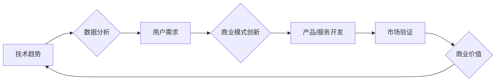

                 

## 利用技术洞察进行创新创业

> 关键词：技术洞察、创新创业、人工智能、机器学习、数据分析、商业模式、技术趋势、市场需求

## 1. 背景介绍

在当今科技日新月异的时代，创新创业已成为推动经济发展和社会进步的强大引擎。然而，单纯依靠创意和激情不足以保证创业项目的成功。越来越多的创业者意识到，**技术洞察**是获得竞争优势、开拓新市场、实现可持续发展的关键。

技术洞察是指通过深入理解技术趋势、应用场景和用户需求，识别出潜在的商业机会，并将其转化为可行的产品或服务的能力。它需要具备以下几个方面的能力：

* **技术前沿的掌握:** 关注最新的技术发展动态，了解新兴技术的应用场景和潜力。
* **数据分析和解读:** 能够从海量数据中挖掘有价值的信息，识别出用户需求和市场趋势。
* **商业模式创新:** 将技术洞察转化为可行的商业模式，创造新的价值和盈利点。
* **跨领域合作:** 与不同领域的专家进行合作，整合资源，推动技术成果的落地应用。

## 2. 核心概念与联系

技术洞察的核心在于将技术能力与商业需求相结合，形成一个闭环的创新体系。

**Mermaid 流程图:**



**核心概念原理和架构:**

* **技术趋势:** 关注科技发展方向，例如人工智能、大数据、云计算等，识别出具有颠覆性潜力的技术。
* **数据分析:** 利用数据挖掘、机器学习等技术，从海量数据中提取有价值的信息，洞察用户需求和市场趋势。
* **用户需求:** 深入了解用户的痛点、需求和期望，为产品或服务的开发提供方向。
* **商业模式创新:** 将技术洞察转化为可行的商业模式，创造新的价值和盈利点。
* **产品/服务开发:** 基于技术洞察和用户需求，开发具有竞争力的产品或服务。
* **市场验证:** 将产品或服务推向市场，通过用户反馈和数据分析进行验证和优化。
* **商业价值:** 实现产品的商业化，创造价值并获得回报。

## 3. 核心算法原理 & 具体操作步骤

### 3.1  算法原理概述

**机器学习算法**是技术洞察的核心工具之一，它能够从数据中学习模式和规律，并用于预测和决策。常见的机器学习算法包括：

* **监督学习:** 利用标记数据训练模型，例如分类、回归等。
* **无监督学习:** 从未标记数据中发现模式和结构，例如聚类、降维等。
* **强化学习:** 通过试错学习，优化策略以获得最大奖励。

### 3.2  算法步骤详解

**以监督学习为例，其基本步骤如下:**

1. **数据收集和预处理:** 收集相关数据，并进行清洗、转换、特征工程等预处理工作。
2. **模型选择:** 根据具体任务选择合适的机器学习算法模型。
3. **模型训练:** 利用标记数据训练模型，调整模型参数以最小化误差。
4. **模型评估:** 利用测试数据评估模型的性能，例如准确率、召回率等。
5. **模型部署:** 将训练好的模型部署到实际应用场景中。

### 3.3  算法优缺点

**优点:**

* **自动化学习:** 可以自动从数据中学习模式和规律，无需人工编程。
* **高准确率:** 在某些领域，机器学习算法可以达到甚至超过人类的准确率。
* **持续优化:** 可以通过不断收集数据和训练模型，不断提高模型的性能。

**缺点:**

* **数据依赖:** 机器学习算法需要大量高质量的数据进行训练。
* **黑盒效应:** 一些复杂的机器学习模型难以解释其决策过程。
* **计算资源:** 训练大型机器学习模型需要大量的计算资源。

### 3.4  算法应用领域

机器学习算法广泛应用于各个领域，例如：

* **推荐系统:** 根据用户的历史行为推荐相关商品或内容。
* **图像识别:** 自动识别图像中的物体、场景和人脸。
* **自然语言处理:** 处理和理解人类语言，例如机器翻译、文本摘要等。
* **金融风险控制:** 识别和预测金融风险，例如欺诈检测、信用评分等。

## 4. 数学模型和公式 & 详细讲解 & 举例说明

### 4.1  数学模型构建

**线性回归模型**是机器学习中一个基础的监督学习算法，用于预测连续变量。其数学模型如下:

$$
y = \beta_0 + \beta_1x_1 + \beta_2x_2 + ... + \beta_nx_n + \epsilon
$$

其中:

* $y$ 是预测变量
* $x_1, x_2, ..., x_n$ 是自变量
* $\beta_0, \beta_1, ..., \beta_n$ 是模型参数
* $\epsilon$ 是误差项

### 4.2  公式推导过程

线性回归模型的目标是找到最佳的模型参数，使预测值与实际值之间的误差最小化。常用的损失函数是均方误差 (MSE):

$$
MSE = \frac{1}{n}\sum_{i=1}^{n}(y_i - \hat{y}_i)^2
$$

其中:

* $n$ 是样本数量
* $y_i$ 是实际值
* $\hat{y}_i$ 是预测值

通过最小化 MSE，可以得到最佳的模型参数。

### 4.3  案例分析与讲解

假设我们要预测房屋价格，自变量包括房屋面积、房间数量、地理位置等。我们可以使用线性回归模型，根据历史房价数据训练模型，并预测新房子的价格。

## 5. 项目实践：代码实例和详细解释说明

### 5.1  开发环境搭建

* Python 3.x
* scikit-learn 机器学习库
* pandas 数据处理库
* matplotlib 数据可视化库

### 5.2  源代码详细实现

```python
import pandas as pd
from sklearn.linear_model import LinearRegression
from sklearn.model_selection import train_test_split
from sklearn.metrics import mean_squared_error

# 加载数据
data = pd.read_csv('house_price_data.csv')

# 选择特征和目标变量
X = data[['area', 'rooms', 'location']]
y = data['price']

# 将数据分为训练集和测试集
X_train, X_test, y_train, y_test = train_test_split(X, y, test_size=0.2, random_state=42)

# 创建线性回归模型
model = LinearRegression()

# 训练模型
model.fit(X_train, y_train)

# 预测测试集数据
y_pred = model.predict(X_test)

# 计算均方误差
mse = mean_squared_error(y_test, y_pred)

# 打印结果
print(f'均方误差: {mse}')
```

### 5.3  代码解读与分析

* 首先，加载数据并选择特征和目标变量。
* 然后，将数据分为训练集和测试集，用于训练和评估模型。
* 创建线性回归模型并训练模型，使用训练数据学习模型参数。
* 使用训练好的模型预测测试集数据，并计算预测结果与实际值的误差。

### 5.4  运行结果展示

运行代码后，会输出模型的均方误差值，该值越小，模型的预测精度越高。

## 6. 实际应用场景

技术洞察在各个行业都有广泛的应用场景，例如：

* **医疗保健:** 利用人工智能分析病历数据，辅助医生诊断疾病、制定治疗方案。
* **金融服务:** 利用机器学习识别欺诈交易、评估信用风险、个性化推荐金融产品。
* **零售业:** 利用数据分析预测客户需求、优化库存管理、个性化推荐商品。
* **教育行业:** 利用人工智能个性化学习路径、自动批改作业、提供智能辅导。

### 6.4  未来应用展望

随着人工智能、大数据等技术的不断发展，技术洞察将发挥更加重要的作用。未来，技术洞察将更加深入、更加智能，并应用于更多领域，例如：

* **个性化定制:** 根据用户的个性化需求，定制产品和服务。
* **智能决策:** 利用人工智能辅助决策，提高决策效率和准确性。
* **预测未来趋势:** 利用数据分析预测未来市场趋势和用户需求。

## 7. 工具和资源推荐

### 7.1  学习资源推荐

* **在线课程:** Coursera, edX, Udacity 等平台提供丰富的机器学习和数据分析课程。
* **书籍:** 《Python机器学习》、《深入理解机器学习》等书籍可以帮助你深入学习机器学习算法和应用。
* **博客和论坛:** Kaggle, Towards Data Science 等平台提供大量的机器学习博客文章和论坛讨论。

### 7.2  开发工具推荐

* **Python:** 作为机器学习和数据分析的常用语言，Python 提供丰富的库和工具，例如 scikit-learn, pandas, numpy 等。
* **Jupyter Notebook:** 用于交互式编程和数据可视化的工具，方便机器学习开发和调试。
* **云计算平台:** AWS, Azure, GCP 等云计算平台提供强大的计算资源和机器学习服务。

### 7.3  相关论文推荐

* **《机器学习》** by Tom Mitchell
* **《深度学习》** by Ian Goodfellow, Yoshua Bengio, and Aaron Courville

## 8. 总结：未来发展趋势与挑战

### 8.1  研究成果总结

技术洞察已经取得了显著的成果，在各个领域都产生了深远的影响。机器学习算法的不断发展，使得技术洞察更加智能化和自动化。

### 8.2  未来发展趋势

未来，技术洞察将朝着以下几个方向发展:

* **更深入的理解:** 利用更先进的算法和模型，更深入地理解用户需求和市场趋势。
* **更智能的决策:** 利用人工智能辅助决策，提高决策效率和准确性。
* **更个性化的体验:** 根据用户的个性化需求，定制产品和服务。

### 8.3  面临的挑战

技术洞察的发展也面临着一些挑战:

* **数据隐私和安全:** 如何保护用户数据隐私和安全，是技术洞察发展面临的重要挑战。
* **算法偏见:** 机器学习算法可能存在偏见，需要进行算法调优和数据清洗，避免算法歧视。
* **解释性问题:** 一些复杂的机器学习模型难以解释其决策过程，需要开发更可解释的模型。

### 8.4  研究展望

未来，需要加强技术洞察领域的理论研究和应用探索，解决上述挑战，推动技术洞察的健康发展。

## 9. 附录：常见问题与解答

**Q1: 如何获取高质量的数据用于训练机器学习模型?**

**A1:** 可以从公开数据平台、企业内部数据、用户行为数据等渠道获取数据。需要注意的是，数据需要进行清洗、转换和特征工程等预处理工作，以提高模型的训练效果。

**Q2: 如何选择合适的机器学习算法?**

**A2:** 需要根据具体任务和数据特点选择合适的算法。例如，对于分类任务，可以考虑使用逻辑回归、支持向量机等算法；对于回归任务，可以考虑使用线性回归、决策树等算法。

**Q3: 如何评估机器学习模型的性能?**

**A3:** 可以使用准确率、召回率、F1-score、均方误差等指标评估模型的性能。

**Q4: 如何部署机器学习模型到实际应用场景?**

**A4:** 可以使用云计算平台、容器技术等方式部署模型，并将其集成到应用程序中。


作者：禅与计算机程序设计艺术 / Zen and the Art of Computer Programming 
<end_of_turn>

