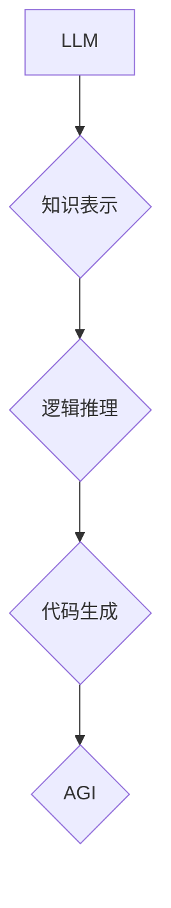

                 

## 图灵完备LLM:通向AGI的关键一步

> 关键词：图灵完备性、LLM、AGI、通用人工智能、知识表示、推理能力、代码生成

## 1. 背景介绍

近年来，大型语言模型（LLM）在自然语言处理领域取得了令人瞩目的成就，例如文本生成、翻译、问答等。这些模型通过学习海量文本数据，掌握了语言的复杂模式和结构，展现出强大的文本理解和生成能力。然而，现有的LLM仍然存在一些局限性，例如缺乏推理能力、难以处理复杂逻辑问题、对新知识的学习能力有限。

图灵完备性是人工智能领域一个重要的概念，指的是一个系统能够执行任何能够被有效地计算的任务。图灵完备性被认为是通用人工智能（AGI）的关键要素，因为只有具备图灵完备性的系统才能真正像人类一样思考、学习和解决问题。

## 2. 核心概念与联系

**2.1 图灵完备性**

图灵完备性是指一个系统能够模拟任何图灵机，从而能够执行任何能够被有效地计算的任务。图灵机是一种理论上的计算模型，被认为是所有计算问题的通用解决方案。

**2.2 LLM**

大型语言模型（LLM）是一种基于深度学习的统计模型，通过学习海量文本数据，掌握了语言的复杂模式和结构。LLM通常采用 Transformer 架构，能够处理长序列文本，并展现出强大的文本理解和生成能力。

**2.3 图灵完备LLM**

图灵完备LLM是指能够实现图灵完备性的LLM。这意味着这类模型不仅能够理解和生成文本，还可以执行任何能够被有效地计算的任务，例如逻辑推理、代码生成、数学证明等。

**2.4 连接关系**

LLM本身并不具备图灵完备性，但可以通过一些技术手段实现图灵完备性。例如，可以将LLM与逻辑推理引擎、知识图谱等其他技术结合，构建一个更强大的智能系统。

**Mermaid 流程图**



## 3. 核心算法原理 & 具体操作步骤

**3.1 算法原理概述**

实现图灵完备LLM的关键在于赋予模型更强的推理能力和知识表示能力。这可以通过以下几种方法实现：

* **逻辑推理引擎:** 将LLM与逻辑推理引擎结合，使模型能够进行逻辑推理和推导。
* **知识图谱:** 将LLM与知识图谱结合，使模型能够理解和利用结构化知识。
* **符号计算:** 将LLM与符号计算系统结合，使模型能够进行数学运算和符号操作。
* **强化学习:** 使用强化学习算法训练LLM，使其能够学习更复杂的策略和决策规则。

**3.2 算法步骤详解**

1. **数据预处理:** 收集和预处理大量文本数据和知识数据，构建训练数据集。
2. **LLM训练:** 使用Transformer架构训练LLM，使其能够理解和生成文本。
3. **知识表示:** 将知识数据转化为结构化的知识表示形式，例如知识图谱。
4. **逻辑推理引擎集成:** 将逻辑推理引擎与LLM集成，使模型能够进行逻辑推理和推导。
5. **符号计算集成:** 将符号计算系统与LLM集成，使模型能够进行数学运算和符号操作。
6. **强化学习训练:** 使用强化学习算法训练LLM，使其能够学习更复杂的策略和决策规则。
7. **模型评估:** 使用各种评估指标评估模型的性能，例如推理准确率、代码生成质量等。

**3.3 算法优缺点**

**优点:**

* 能够执行任何能够被有效地计算的任务。
* 具备强大的文本理解和生成能力。
* 可以学习和利用结构化知识。

**缺点:**

* 训练成本高昂。
* 模型规模庞大，部署难度大。
* 仍然存在一些局限性，例如对复杂场景的处理能力有限。

**3.4 算法应用领域**

* **通用人工智能:** 图灵完备LLM是通向AGI的关键一步。
* **科学研究:** 可以用于科学发现、数据分析和模型构建。
* **软件开发:** 可以用于代码生成、代码理解和软件测试。
* **教育:** 可以用于个性化学习、智能辅导和知识问答。

## 4. 数学模型和公式 & 详细讲解 & 举例说明

**4.1 数学模型构建**

图灵完备LLM的数学模型通常基于概率论和统计学，例如：

* **语言模型:** 使用概率分布来表示单词序列的可能性。
* **逻辑推理模型:** 使用符号逻辑和推理规则来表示知识和推理过程。
* **知识图谱模型:** 使用图论和关系数据库来表示知识和实体之间的关系。

**4.2 公式推导过程**

例如，语言模型可以使用以下公式来计算单词序列的概率：

$$P(w_1, w_2, ..., w_n) = \prod_{i=1}^{n} P(w_i | w_1, w_2, ..., w_{i-1})$$

其中，$w_i$ 表示第 $i$ 个单词，$P(w_i | w_1, w_2, ..., w_{i-1})$ 表示给定前 $i-1$ 个单词的条件下，第 $i$ 个单词出现的概率。

**4.3 案例分析与讲解**

例如，假设我们有一个语言模型，它已经学习了以下单词序列的概率分布：

* $P("hello" | "") = 0.1$
* $P("world" | "hello") = 0.5$
* $P("!" | "hello world") = 0.8$

那么，我们可以使用这个模型来计算以下句子出现的概率：

"hello world !"

$$P("hello world !" ) = P("hello" | "") * P("world" | "hello") * P("!" | "hello world") = 0.1 * 0.5 * 0.8 = 0.04$$

## 5. 项目实践：代码实例和详细解释说明

**5.1 开发环境搭建**

* Python 3.7+
* PyTorch 或 TensorFlow
* CUDA 和 cuDNN (可选，用于GPU加速)

**5.2 源代码详细实现**

由于篇幅限制，这里只提供一个简单的代码示例，展示如何将LLM与逻辑推理引擎结合：

```python
from transformers import AutoModelForSeq2SeqLM
from pylogic import LogicEngine

# 加载预训练的LLM模型
model = AutoModelForSeq2SeqLM.from_pretrained("gpt2")

# 创建逻辑推理引擎
logic_engine = LogicEngine()

# 定义一个逻辑规则
logic_engine.add_rule("If A then B")

# 使用LLM生成文本
input_text = "A is true"
output_text = model.generate(input_text)

# 使用逻辑推理引擎推理
result = logic_engine.infer(output_text)

# 打印结果
print(result)
```

**5.3 代码解读与分析**

* 首先，我们加载一个预训练的LLM模型，例如GPT-2。
* 然后，我们创建一个逻辑推理引擎，并添加一个逻辑规则。
* 接着，我们使用LLM生成文本，例如根据输入文本"A is true"生成文本"B is true"。
* 最后，我们使用逻辑推理引擎推理，根据逻辑规则判断生成的文本是否正确。

**5.4 运行结果展示**

运行结果将取决于LLM模型的训练数据和逻辑规则的定义。如果LLM模型能够正确理解输入文本，并且逻辑规则是正确的，那么推理结果将是正确的。

## 6. 实际应用场景

**6.1 代码生成**

图灵完备LLM可以根据自然语言描述生成代码，例如：

* 用户输入："创建一个函数，计算两个数的和。"
* LLM输出：

```python
def sum(a, b):
  return a + b
```

**6.2 自动问答**

图灵完备LLM可以理解复杂的问题，并从知识库中查找答案，例如：

* 用户输入："什么是量子力学？"
* LLM输出：

"量子力学是描述微观世界物质运动规律的物理学理论。"

**6.3 科学发现**

图灵完备LLM可以帮助科学家分析数据、发现模式和提出假设，例如：

* 分析基因组数据，发现新的疾病基因。
* 分析天文观测数据，发现新的天体。

**6.4 未来应用展望**

图灵完备LLM有潜力改变许多领域，例如：

* **医疗保健:** 辅助医生诊断疾病、制定治疗方案。
* **教育:** 提供个性化学习体验、智能辅导。
* **金融:** 自动化金融分析、风险管理。

## 7. 工具和资源推荐

**7.1 学习资源推荐**

* **书籍:**

* "深度学习" by Ian Goodfellow, Yoshua Bengio, and Aaron Courville
* "自然语言处理" by Dan Jurafsky and James H. Martin

* **在线课程:**

* Coursera: 深度学习
* edX: 自然语言处理

**7.2 开发工具推荐**

* **Python:** 广泛用于深度学习和人工智能开发。
* **PyTorch:** 一个开源的深度学习框架。
* **TensorFlow:** 另一个开源的深度学习框架。

**7.3 相关论文推荐**

* "Attention Is All You Need" by Vaswani et al. (2017)
* "BERT: Pre-training of Deep Bidirectional Transformers for Language Understanding" by Devlin et al. (2018)

## 8. 总结：未来发展趋势与挑战

**8.1 研究成果总结**

近年来，图灵完备LLM的研究取得了显著进展，例如：

* **模型规模的扩大:** 模型参数数量不断增加，模型能力不断提升。
* **训练方法的改进:** 新的训练方法，例如强化学习，使模型能够学习更复杂的策略和决策规则。
* **应用领域的拓展:** 图灵完备LLM的应用领域不断扩展，例如代码生成、自动问答、科学发现等。

**8.2 未来发展趋势**

* **更强大的模型:** 模型规模将继续扩大，模型能力将进一步提升。
* **更有效的训练方法:** 新的训练方法将使模型能够更快、更有效地学习。
* **更广泛的应用:** 图灵完备LLM将应用于更多领域，例如医疗保健、教育、金融等。

**8.3 面临的挑战**

* **训练成本:** 图灵完备LLM的训练成本非常高昂。
* **模型安全性:** 图灵完备LLM可能被用于恶意目的，例如生成虚假信息、进行网络攻击等。
* **伦理问题:** 图灵完备LLM的开发和应用引发了一些伦理问题，例如人工智能的责任、人工智能的偏见等。

**8.4 研究展望**

未来，图灵完备LLM的研究将继续深入，解决上述挑战，推动人工智能技术的发展。


## 9. 附录：常见问题与解答

**9.1 如何评估图灵完备LLM的性能？**

评估图灵完备LLM的性能是一个复杂的问题，需要考虑多种因素，例如推理准确率、代码生成质量、知识理解能力等。常用的评估指标包括：

* **BLEU:** 用于评估机器翻译质量。
* **ROUGE:** 用于评估文本摘要质量。
* **GLUE:** 用于评估自然语言理解任务的性能。

**9.2 图灵完备LLM的训练需要哪些数据？**

图灵完备LLM的训练需要大量文本数据和知识数据。文本数据可以包括书籍、文章、对话等，知识数据可以包括知识图谱、数据库等。

**9.3 图灵完备LLM的应用有哪些？**

图灵完备LLM的应用非常广泛，例如：

* 代码生成
* 自动问答
* 科学发现
* 医疗诊断
* 教育辅导

**9.4 图灵完备LLM的未来发展趋势是什么？**

图灵完备LLM的未来发展趋势包括：

* 模型规模的扩大
* 训练方法的改进
* 应用领域的拓展

作者：禅与计算机程序设计艺术 / Zen and the Art of Computer Programming


<end_of_turn>

