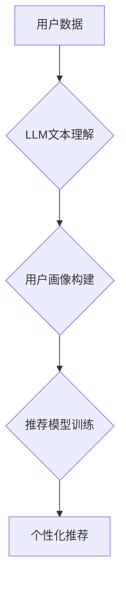

                 

## 基于LLM的推荐系统用户画像精细化

> 关键词：LLM, 用户画像, 推荐系统, 自然语言处理, 深度学习, 个性化推荐

## 1. 背景介绍

推荐系统作为互联网时代的重要技术支柱，在电商、社交媒体、内容平台等领域发挥着至关重要的作用。其核心目标是根据用户的历史行为、偏好和上下文信息，预测用户对特定商品、内容或服务感兴趣，并提供个性化的推荐。传统的推荐系统主要依赖于协同过滤、内容过滤和基于规则等方法，但这些方法往往难以捕捉用户复杂多样的需求和行为模式。

近年来，大语言模型（LLM）的快速发展为推荐系统带来了新的机遇。LLM 拥有强大的文本理解和生成能力，能够从海量文本数据中学习用户兴趣、需求和偏好，并生成更精准、更个性化的推荐。基于LLM的推荐系统能够更好地理解用户意图，提供更丰富的推荐内容，提升用户体验。

## 2. 核心概念与联系

### 2.1 用户画像

用户画像是指对用户进行深入分析和描述，构建出用户特征、行为模式、兴趣爱好等方面的综合性画像。传统的用户画像通常基于用户基本信息、浏览历史、购买记录等结构化数据，而基于LLM的推荐系统能够利用用户的文本数据，例如评论、反馈、聊天记录等，构建更精细、更全面的用户画像。

### 2.2 LLM

大语言模型（LLM）是一种基于深度学习的强大人工智能模型，能够理解和生成人类语言。LLM 通过训练海量文本数据，学习语言的语法、语义和上下文关系，从而具备强大的文本理解、生成、翻译、问答等能力。

### 2.3 推荐系统

推荐系统旨在根据用户的历史行为、偏好和上下文信息，预测用户对特定商品、内容或服务感兴趣，并提供个性化的推荐。推荐系统可以分为基于内容的推荐、基于协同过滤的推荐和基于混合方法的推荐等多种类型。

**核心概念与架构流程图**



## 3. 核心算法原理 & 具体操作步骤

### 3.1 算法原理概述

基于LLM的推荐系统通常采用以下核心算法原理：

* **文本嵌入:** 将用户文本数据（例如评论、描述、对话）转换为向量表示，以便LLM能够理解和处理。
* **用户画像生成:** 利用LLM对用户文本数据进行分析，提取用户的兴趣、偏好、需求等特征，构建用户画像。
* **推荐模型训练:** 基于用户画像和商品信息，训练推荐模型，例如基于深度学习的推荐模型，以预测用户对特定商品的兴趣。
* **个性化推荐:** 根据用户的实时行为和上下文信息，结合推荐模型的预测结果，生成个性化的推荐列表。

### 3.2 算法步骤详解

1. **数据收集:** 收集用户文本数据，例如评论、反馈、聊天记录、浏览历史等。
2. **数据预处理:** 对用户文本数据进行清洗、去噪、分词、词性标注等预处理，以便LLM能够有效地理解和处理数据。
3. **文本嵌入:** 利用预训练的LLM模型，将用户文本数据转换为向量表示，例如使用BERT、RoBERTa等模型进行文本嵌入。
4. **用户画像构建:** 利用LLM对用户文本嵌入进行分析，提取用户的兴趣、偏好、需求等特征，构建用户画像。
5. **推荐模型训练:** 基于用户画像和商品信息，训练推荐模型，例如使用深度学习的推荐模型，例如Transformer、Graph Neural Networks等。
6. **个性化推荐:** 根据用户的实时行为和上下文信息，结合推荐模型的预测结果，生成个性化的推荐列表。

### 3.3 算法优缺点

**优点:**

* 能够更好地理解用户复杂多样的需求和行为模式。
* 能够从海量文本数据中提取更丰富的用户特征。
* 能够生成更精准、更个性化的推荐。

**缺点:**

* 需要大量的训练数据和计算资源。
* 模型训练和部署成本较高。
* 存在潜在的偏见和歧视问题。

### 3.4 算法应用领域

* **电商推荐:** 为用户推荐个性化的商品。
* **内容推荐:** 为用户推荐个性化的文章、视频、音乐等内容。
* **社交媒体推荐:** 为用户推荐个性化的朋友、群组、话题等。
* **教育推荐:** 为用户推荐个性化的学习资源和课程。

## 4. 数学模型和公式 & 详细讲解 & 举例说明

### 4.1 数学模型构建

基于LLM的推荐系统通常采用以下数学模型：

* **用户-商品交互矩阵:** 用来表示用户对商品的评分或偏好，其中每个元素表示用户对商品的交互行为。

* **嵌入向量:** 将用户和商品映射到低维向量空间，以便进行相似度计算。

* **损失函数:** 用于衡量推荐模型的预测结果与实际交互行为之间的差异。

### 4.2 公式推导过程

**用户嵌入:**

$$
u_i = \text{Embedding}(user_i)
$$

**商品嵌入:**

$$
v_j = \text{Embedding}(item_j)
$$

**预测评分:**

$$
\hat{r}_{ij} = \text{Score}(u_i, v_j)
$$

**损失函数:**

$$
L = \sum_{i,j} \text{Loss}(\hat{r}_{ij}, r_{ij})
$$

其中：

* $u_i$ 表示用户 $i$ 的嵌入向量。
* $v_j$ 表示商品 $j$ 的嵌入向量。
* $\hat{r}_{ij}$ 表示模型预测的用户 $i$ 对商品 $j$ 的评分。
* $r_{ij}$ 表示用户 $i$ 对商品 $j$ 的真实评分。
* $\text{Embedding}$ 表示文本嵌入函数。
* $\text{Score}$ 表示相似度计算函数。
* $\text{Loss}$ 表示损失函数。

### 4.3 案例分析与讲解

假设我们有一个电商平台，用户对商品进行评分。我们可以使用基于LLM的推荐系统，将用户的评论数据作为输入，训练一个推荐模型。

1. **数据收集:** 收集用户的商品评论数据。
2. **数据预处理:** 对评论数据进行清洗、去噪、分词、词性标注等预处理。
3. **文本嵌入:** 利用预训练的LLM模型，将评论数据转换为向量表示。
4. **用户画像构建:** 利用LLM对用户评论嵌入进行分析，提取用户的兴趣、偏好、需求等特征，构建用户画像。
5. **推荐模型训练:** 基于用户画像和商品信息，训练一个推荐模型，例如使用Transformer模型。
6. **个性化推荐:** 根据用户的实时行为和上下文信息，结合推荐模型的预测结果，生成个性化的商品推荐列表。

## 5. 项目实践：代码实例和详细解释说明

### 5.1 开发环境搭建

* Python 3.7+
* PyTorch 或 TensorFlow
* Transformers 库
* 其他必要的库，例如 numpy、pandas、scikit-learn 等

### 5.2 源代码详细实现

```python
# 导入必要的库
import torch
from transformers import AutoTokenizer, AutoModel

# 加载预训练的LLM模型和词典
model_name = "bert-base-uncased"
tokenizer = AutoTokenizer.from_pretrained(model_name)
model = AutoModel.from_pretrained(model_name)

# 定义文本嵌入函数
def get_user_embedding(text):
    inputs = tokenizer(text, return_tensors="pt")
    outputs = model(**inputs)
    return outputs.last_hidden_state[:, 0, :]

# 定义推荐模型
class RecommenderModel(torch.nn.Module):
    def __init__(self, embedding_dim):
        super(RecommenderModel, self).__init__()
        self.embedding_dim = embedding_dim

    def forward(self, user_embedding, item_embedding):
        # 计算用户和商品的相似度
        similarity = torch.cosine_similarity(user_embedding, item_embedding)
        return similarity

# 实例化推荐模型
model = RecommenderModel(embedding_dim=768)

# 训练推荐模型
# ...

# 生成个性化推荐
def generate_recommendations(user_text, item_embeddings):
    user_embedding = get_user_embedding(user_text)
    recommendations = model(user_embedding, item_embeddings)
    # 根据相似度排序推荐
    sorted_indices = torch.argsort(recommendations, descending=True)
    return sorted_indices

```

### 5.3 代码解读与分析

* 代码首先导入必要的库，并加载预训练的LLM模型和词典。
* 定义了文本嵌入函数 `get_user_embedding`，将用户文本转换为向量表示。
* 定义了推荐模型 `RecommenderModel`，计算用户和商品的相似度。
* 实例化推荐模型，并进行训练。
* 定义了 `generate_recommendations` 函数，根据用户的文本输入和商品嵌入向量，生成个性化的商品推荐。

### 5.4 运行结果展示

运行代码后，可以根据用户的文本输入，生成个性化的商品推荐列表。

## 6. 实际应用场景

### 6.1 电商推荐

基于LLM的推荐系统可以帮助电商平台更好地理解用户的需求，推荐更精准、更个性化的商品。例如，可以根据用户的评论数据，推荐用户可能感兴趣的商品，或者根据用户的浏览历史，推荐用户可能需要的商品。

### 6.2 内容推荐

基于LLM的推荐系统可以帮助内容平台更好地推荐用户感兴趣的内容。例如，可以根据用户的阅读历史，推荐用户可能感兴趣的文章，或者根据用户的观看历史，推荐用户可能喜欢的视频。

### 6.3 社交媒体推荐

基于LLM的推荐系统可以帮助社交媒体平台更好地推荐用户可能感兴趣的朋友、群组、话题等。例如，可以根据用户的兴趣爱好，推荐用户可能认识的朋友，或者根据用户的社交行为，推荐用户可能感兴趣的群组。

### 6.4 未来应用展望

基于LLM的推荐系统在未来将有更广泛的应用场景，例如：

* **个性化教育推荐:** 为学生推荐个性化的学习资源和课程。
* **医疗健康推荐:** 为患者推荐个性化的医疗方案和健康建议。
* **金融理财推荐:** 为用户推荐个性化的理财产品和投资建议。

## 7. 工具和资源推荐

### 7.1 学习资源推荐

* **书籍:**
    * 《深度学习》
    * 《自然语言处理》
    * 《推荐系统》
* **在线课程:**
    * Coursera: 深度学习
    * edX: 自然语言处理
    * fast.ai: 推荐系统

### 7.2 开发工具推荐

* **Python:** 
* **PyTorch:** 深度学习框架
* **TensorFlow:** 深度学习框架
* **Transformers:** 预训练语言模型库

### 7.3 相关论文推荐

* **BERT: Pre-training of Deep Bidirectional Transformers for Language Understanding**
* **Attention Is All You Need**
* **Recurrent Neural Network Based Language Model**

## 8. 总结：未来发展趋势与挑战

### 8.1 研究成果总结

基于LLM的推荐系统在理解用户需求、生成个性化推荐方面取得了显著进展。LLM的强大文本理解能力使得推荐系统能够从更丰富的用户数据中学习，生成更精准、更个性化的推荐。

### 8.2 未来发展趋势

* **更强大的LLM模型:** 未来将会有更强大的LLM模型出现，能够更好地理解用户需求和生成更个性化的推荐。
* **多模态推荐:** 将文本数据与其他模态数据，例如图像、音频、视频等结合，构建更全面的用户画像，生成更精准的推荐。
* **联邦学习:** 利用联邦学习技术，在保护用户隐私的前提下，训练更强大的推荐模型。

### 8.3 面临的挑战

* **数据隐私:** 基于LLM的推荐系统需要处理大量的用户数据，如何保护用户隐私是一个重要的挑战。
* **模型解释性:** LLM模型的决策过程往往难以解释，如何提高模型的解释性是一个重要的研究方向。
* **计算资源:** 训练和部署大型LLM模型需要大量的计算资源，如何降低计算成本是一个重要的挑战。

### 8.4 研究展望

未来基于LLM的推荐系统将朝着更智能、更个性化、更安全的方向发展。研究者将继续探索新的算法、模型和技术，以解决当前面临的挑战，并为用户提供更优质的推荐体验。

## 9. 附录：常见问题与解答

**Q1: 基于LLM的推荐系统与传统的推荐系统相比有什么优势？**

**A1:** 基于LLM的推荐系统能够更好地理解用户的复杂需求和行为模式，从海量文本数据中提取更丰富的用户特征，生成更精准、更个性化的推荐。

**Q2: 如何解决基于LLM的推荐系统的数据隐私问题？**

**A2:** 可以采用联邦学习技术，在保护用户隐私的前提下，训练更强大的推荐模型。

**Q3: 如何提高基于LLM的推荐系统的模型解释性？**

**A3:** 可以采用可解释机器学习方法，例如LIME、SHAP等，解释LLM模型的决策过程。


作者：禅与计算机程序设计艺术 / Zen and the Art of Computer Programming 
<end_of_turn>

