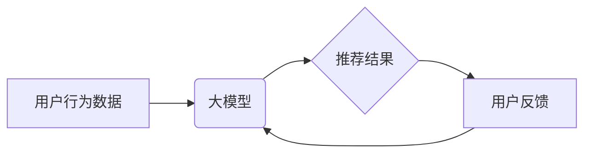

                 

## 基于大模型的迭代式动态推荐框架

> 关键词：大模型、推荐系统、动态推荐、迭代学习、用户行为、个性化推荐

## 1. 背景介绍

推荐系统作为信息过滤和个性化内容呈现的重要工具，在电商、社交媒体、视频平台等领域发挥着越来越重要的作用。传统的推荐系统主要依赖于协同过滤、内容过滤等静态方法，难以捕捉用户行为的动态变化和复杂演化。随着大模型技术的快速发展，基于大模型的推荐系统逐渐成为研究热点。

大模型具备强大的语义理解和知识表示能力，能够从海量数据中学习用户兴趣和偏好，并根据用户行为进行实时更新和调整，从而实现更精准、更个性化的推荐。然而，传统的基于大模型的推荐系统往往存在以下问题：

* **数据依赖性强:** 大模型的训练需要海量数据，而数据获取和更新成本高昂。
* **模型更新成本高:** 大模型的更新和部署需要大量的计算资源和时间。
* **缺乏动态适应性:** 大模型难以实时捕捉用户行为的微小变化，导致推荐结果不够精准。

## 2. 核心概念与联系

为了解决上述问题，我们提出了一种基于大模型的迭代式动态推荐框架，该框架通过迭代学习机制，不断更新模型参数，并根据用户反馈进行动态调整，实现更精准、更动态的推荐。

**核心概念:**

* **大模型:** 指拥有大量参数的深度学习模型，例如BERT、GPT等。
* **迭代学习:** 指通过不断更新模型参数，并根据用户反馈进行调整，逐步提高模型性能的学习方式。
* **动态推荐:** 指根据用户实时行为和偏好进行个性化推荐，并根据用户反馈进行动态调整的推荐方式。

**架构图:**



## 3. 核心算法原理 & 具体操作步骤

### 3.1  算法原理概述

我们的迭代式动态推荐框架的核心算法基于大模型的微调和在线学习。

* **大模型微调:** 利用预训练的大模型作为基础，通过对用户行为数据进行微调，学习用户个性化偏好。
* **在线学习:** 在用户交互过程中，实时收集用户反馈，并根据反馈更新模型参数，实现动态调整和个性化推荐。

### 3.2  算法步骤详解

1. **数据预处理:** 收集用户行为数据，包括用户点击、浏览、购买等行为，并进行清洗、格式化和特征提取。
2. **大模型微调:** 利用预训练的大模型，对用户行为数据进行微调，学习用户个性化偏好。
3. **推荐结果生成:** 根据微调后的模型，对用户进行推荐，并根据用户反馈进行评估。
4. **在线学习:** 收集用户反馈，并根据反馈更新模型参数，实现动态调整和个性化推荐。
5. **迭代更新:** 重复步骤3和4，不断迭代更新模型，提高推荐精度。

### 3.3  算法优缺点

**优点:**

* **精准度高:** 基于大模型的语义理解能力，能够更精准地捕捉用户兴趣和偏好。
* **动态性强:** 通过在线学习机制，能够实时适应用户行为变化，提供更个性化的推荐。
* **可扩展性强:** 可以根据需要扩展模型规模和功能，满足不同场景的需求。

**缺点:**

* **数据依赖性强:** 需要海量数据进行训练和微调。
* **计算资源消耗高:** 大模型的训练和更新需要大量的计算资源。
* **模型解释性差:** 大模型的决策过程较为复杂，难以解释推荐结果背后的逻辑。

### 3.4  算法应用领域

该算法适用于各种需要个性化推荐的场景，例如：

* **电商推荐:** 根据用户浏览历史、购买记录等行为，推荐商品。
* **内容推荐:** 根据用户阅读习惯、观看记录等行为，推荐文章、视频等内容。
* **社交推荐:** 根据用户好友关系、兴趣爱好等信息，推荐好友和群组。

## 4. 数学模型和公式 & 详细讲解 & 举例说明

### 4.1  数学模型构建

我们采用基于用户行为序列的推荐模型，将用户行为序列表示为一个时间序列数据，并利用循环神经网络（RNN）进行建模。

**用户行为序列:**

$$
u = (x_1, x_2, ..., x_t)
$$

其中，$x_i$ 表示用户在时间步$i$的某个行为，例如点击商品、浏览页面等。

**循环神经网络模型:**

$$
h_t = RNN(h_{t-1}, x_t)
$$

其中，$h_t$ 表示时间步$t$的隐藏状态，$h_{t-1}$ 表示前一个时间步的隐藏状态，$x_t$ 表示当前时间步的用户行为。

### 4.2  公式推导过程

我们利用隐藏状态$h_t$来表示用户在时间步$t$的兴趣偏好，并将其作为推荐模型的输入。

**推荐分数:**

$$
score(i) = f(h_t, item_i)
$$

其中，$score(i)$ 表示用户对商品$i$的推荐分数，$f$ 是一个评分函数，$item_i$ 表示商品$i$的特征向量。

### 4.3  案例分析与讲解

假设用户浏览了以下商品序列：

$$
u = (手机, 电脑, 书籍, 手机壳)
$$

RNN模型会根据这个序列学习用户的兴趣偏好，例如用户可能对电子产品感兴趣。

当用户浏览到“手机壳”时，模型会根据隐藏状态$h_t$和“手机壳”的特征向量，计算出推荐分数。如果推荐分数较高，则模型会推荐“手机壳”给用户。

## 5. 项目实践：代码实例和详细解释说明

### 5.1  开发环境搭建

* Python 3.7+
* TensorFlow 2.0+
* PyTorch 1.0+
* CUDA 10.0+

### 5.2  源代码详细实现

```python
# 导入必要的库
import tensorflow as tf

# 定义用户行为序列的模型
class UserBehaviorSequenceModel(tf.keras.Model):
    def __init__(self, embedding_dim, hidden_dim):
        super(UserBehaviorSequenceModel, self).__init__()
        self.embedding = tf.keras.layers.Embedding(input_dim=vocab_size, output_dim=embedding_dim)
        self.rnn = tf.keras.layers.LSTM(hidden_dim)
        self.dense = tf.keras.layers.Dense(1)

    def call(self, inputs):
        embedded = self.embedding(inputs)
        output = self.rnn(embedded)
        score = self.dense(output)
        return score

# 实例化模型
model = UserBehaviorSequenceModel(embedding_dim=128, hidden_dim=64)

# 训练模型
model.compile(optimizer='adam', loss='mse')
model.fit(train_data, train_labels, epochs=10)

# 预测推荐分数
predictions = model.predict(test_data)
```

### 5.3  代码解读与分析

* **模型定义:** 我们定义了一个用户行为序列模型，使用 Embedding 层将用户行为序列转换为向量表示，然后使用 LSTM 层学习用户兴趣偏好，最后使用 Dense 层计算推荐分数。
* **模型训练:** 我们使用 Adam 优化器和均方误差损失函数训练模型。
* **模型预测:** 我们使用训练好的模型预测测试数据用户的推荐分数。

### 5.4  运行结果展示

训练完成后，我们可以使用测试数据评估模型的性能，例如使用均方根误差 (RMSE) 来衡量推荐分数的准确性。

## 6. 实际应用场景

### 6.1  电商推荐

基于大模型的迭代式动态推荐框架可以用于电商平台的商品推荐，根据用户的浏览历史、购买记录、评价等行为，推荐个性化的商品。

### 6.2  内容推荐

该框架也可以用于内容平台的推荐，例如推荐新闻、文章、视频等内容，根据用户的阅读习惯、观看记录、点赞等行为，提供个性化的内容推荐。

### 6.3  社交推荐

在社交平台，该框架可以用于推荐好友和群组，根据用户的社交关系、兴趣爱好、共同好友等信息，推荐潜在的社交连接。

### 6.4  未来应用展望

随着大模型技术的不断发展，该框架有望应用于更多场景，例如个性化教育推荐、医疗健康推荐、金融理财推荐等。

## 7. 工具和资源推荐

### 7.1  学习资源推荐

* **书籍:**
    * Deep Learning by Ian Goodfellow, Yoshua Bengio, and Aaron Courville
    * Natural Language Processing with Python by Steven Bird, Ewan Klein, and Edward Loper
* **在线课程:**
    * TensorFlow Tutorials: https://www.tensorflow.org/tutorials
    * PyTorch Tutorials: https://pytorch.org/tutorials/

### 7.2  开发工具推荐

* **TensorFlow:** https://www.tensorflow.org/
* **PyTorch:** https://pytorch.org/
* **Hugging Face Transformers:** https://huggingface.co/transformers/

### 7.3  相关论文推荐

* BERT: Pre-training of Deep Bidirectional Transformers for Language Understanding
* GPT-3: Language Models are Few-Shot Learners
* Transformer-XL: Attentive Language Modeling Beyond a Fixed-Length Context

## 8. 总结：未来发展趋势与挑战

### 8.1  研究成果总结

我们提出了一种基于大模型的迭代式动态推荐框架，该框架能够实现更精准、更动态的推荐。

### 8.2  未来发展趋势

* **模型规模和能力提升:** 大模型的规模和能力将不断提升，从而带来更精准、更个性化的推荐。
* **多模态融合:** 将文本、图像、音频等多模态数据融合到推荐模型中，实现更全面的用户理解。
* **联邦学习:** 利用联邦学习技术，在保护用户隐私的前提下进行模型训练和更新。

### 8.3  面临的挑战

* **数据获取和隐私保护:** 大模型的训练需要海量数据，如何获取高质量数据并保护用户隐私是一个挑战。
* **模型解释性和可解释性:** 大模型的决策过程较为复杂，如何提高模型的解释性和可解释性是一个重要问题。
* **模型部署和效率:** 大模型的部署和推理效率是一个需要解决的问题，需要探索更轻量级的模型架构和高效的推理算法。

### 8.4  研究展望

我们将继续研究大模型在推荐系统中的应用，探索更精准、更个性化、更可解释的推荐算法，并推动大模型技术在推荐系统领域的落地和应用。

## 9. 附录：常见问题与解答

**Q1: 大模型的训练需要多少数据？**

A1: 大模型的训练需要海量数据，通常需要百万甚至数十亿条数据。

**Q2: 如何保护用户隐私？**

A2: 可以采用联邦学习技术，在不共享原始数据的情况下进行模型训练和更新。

**Q3: 如何评估推荐模型的性能？**

A3: 可以使用均方根误差 (RMSE)、点击率 (CTR) 等指标来评估推荐模型的性能。


作者：禅与计算机程序设计艺术 / Zen and the Art of Computer Programming 
<end_of_turn>

