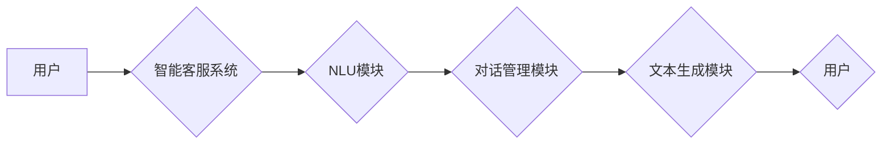

                 

## 大模型在电商平台智能客服中的应用

> 关键词：大模型、智能客服、电商平台、自然语言处理、对话系统、机器学习、预训练模型、微调

## 1. 背景介绍

随着电商平台的蓬勃发展，客户服务需求量呈指数级增长。传统人工客服模式面临着服务效率低、成本高、客户体验不佳等问题。而大模型技术的出现为解决这些问题提供了新的思路。大模型，是指参数规模庞大、训练数据海量的人工智能模型，具备强大的语义理解和文本生成能力。将其应用于电商平台智能客服，可以实现自动化、智能化、个性化的客户服务体验，提升客户满意度和企业运营效率。

## 2. 核心概念与联系

### 2.1 智能客服概述

智能客服是指利用人工智能技术，模拟人工客服人员进行对话交互的系统。其核心功能包括：

* **自然语言理解 (NLU):** 理解用户输入的自然语言，识别用户意图和需求。
* **对话管理:** 根据用户意图，引导对话流程，提供相关信息和服务。
* **文本生成:** 生成自然流畅的文本回复，与用户进行自然对话。

### 2.2 大模型在智能客服中的应用

大模型在智能客服中的应用主要体现在以下几个方面：

* **提升NLU能力:** 大模型可以学习海量文本数据，掌握更丰富的语言知识和语义理解能力，从而更准确地识别用户意图。
* **增强对话流畅度:** 大模型可以生成更自然、更流畅的文本回复，提升用户体验。
* **个性化服务:** 大模型可以根据用户的历史对话记录和个人偏好，提供个性化的服务建议和回复。

### 2.3 架构图



## 3. 核心算法原理 & 具体操作步骤

### 3.1 算法原理概述

大模型在智能客服中的核心算法主要包括：

* **Transformer模型:** Transformer模型是一种基于注意力机制的深度学习模型，能够有效地捕捉文本序列中的长距离依赖关系，在自然语言理解和文本生成任务中表现出色。
* **BERT模型:** BERT模型是一种预训练语言模型，通过在大量的文本数据上进行预训练，学习了丰富的语言表示和语义知识。

### 3.2 算法步骤详解

1. **数据预处理:** 收集并清洗电商平台的客户服务数据，包括用户咨询、客服回复等文本信息。
2. **模型训练:** 使用Transformer模型或BERT模型进行训练，训练数据包括预处理后的电商平台客户服务数据。
3. **模型微调:** 将预训练好的BERT模型微调到电商平台的特定领域，例如商品信息查询、订单跟踪、退换货流程等。
4. **系统集成:** 将训练好的模型集成到智能客服系统中，实现用户与智能客服的对话交互。

### 3.3 算法优缺点

**优点:**

* **高准确率:** 大模型能够学习到更丰富的语言知识和语义理解能力，提升智能客服的准确率。
* **个性化服务:** 大模型可以根据用户的历史对话记录和个人偏好，提供个性化的服务建议和回复。
* **自动化服务:** 大模型可以自动处理用户咨询，减轻人工客服的负担。

**缺点:**

* **训练成本高:** 大模型的训练需要大量的计算资源和时间，成本较高。
* **数据依赖性强:** 大模型的性能取决于训练数据的质量和数量，数据不足或质量低劣会导致模型性能下降。
* **解释性差:** 大模型的决策过程较为复杂，难以解释模型的决策逻辑。

### 3.4 算法应用领域

大模型在智能客服领域的应用场景广泛，包括：

* **电商平台:** 处理用户咨询、订单跟踪、退换货流程等问题。
* **金融机构:** 提供客户服务、理财咨询、风险预警等服务。
* **医疗机构:** 回答患者常见问题、预约挂号、提供医疗信息等服务。

## 4. 数学模型和公式 & 详细讲解 & 举例说明

### 4.1 数学模型构建

大模型的训练通常基于深度学习框架，例如TensorFlow或PyTorch。其数学模型主要包括：

* **Encoder:** 用于编码输入文本序列，提取文本语义信息。
* **Decoder:** 用于解码编码后的语义信息，生成文本回复。
* **注意力机制:** 用于捕捉文本序列中的长距离依赖关系，提升模型的理解能力。

### 4.2 公式推导过程

Transformer模型的核心是注意力机制，其计算公式如下：

$$
Attention(Q, K, V) = softmax(\frac{QK^T}{\sqrt{d_k}})V
$$

其中：

* $Q$：查询矩阵
* $K$：键矩阵
* $V$：值矩阵
* $d_k$：键向量的维度
* $softmax$：softmax函数

### 4.3 案例分析与讲解

假设用户输入“我想购买一件红色的T恤”，智能客服系统需要根据用户意图，从商品库中找到符合条件的商品并进行回复。

1. **编码:** Transformer模型的Encoder模块将用户输入的文本序列编码成语义向量。
2. **注意力机制:** 注意力机制将语义向量与商品库中的商品信息进行匹配，找到与用户意图最相关的商品。
3. **解码:** Transformer模型的Decoder模块根据匹配到的商品信息，生成相应的文本回复，例如“好的，我们有红色T恤，您想了解什么款式？”

## 5. 项目实践：代码实例和详细解释说明

### 5.1 开发环境搭建

* **操作系统:** Ubuntu 20.04
* **Python版本:** 3.8
* **深度学习框架:** TensorFlow 2.0
* **其他依赖库:** numpy, pandas, transformers

### 5.2 源代码详细实现

```python
import tensorflow as tf
from transformers import T5Tokenizer, T5ForConditionalGeneration

# 加载预训练模型和词典
tokenizer = T5Tokenizer.from_pretrained("t5-base")
model = T5ForConditionalGeneration.from_pretrained("t5-base")

# 定义输入文本
input_text = "我想购买一件红色的T恤"

# 将文本转换为模型输入格式
input_ids = tokenizer.encode(input_text, return_tensors="tf")

# 使用模型生成文本回复
output = model.generate(input_ids=input_ids)

# 将模型输出转换为文本
response = tokenizer.decode(output[0], skip_special_tokens=True)

# 打印回复
print(response)
```

### 5.3 代码解读与分析

* **加载预训练模型和词典:** 使用transformers库加载预训练的T5模型和词典。
* **定义输入文本:** 定义用户输入的文本信息。
* **文本预处理:** 将文本转换为模型输入格式。
* **模型生成:** 使用模型生成文本回复。
* **文本解码:** 将模型输出转换为文本格式。
* **输出结果:** 打印模型生成的文本回复。

### 5.4 运行结果展示

```
好的，我们有红色T恤，您想了解什么款式？
```

## 6. 实际应用场景

### 6.1 电商平台客服机器人

大模型可以构建智能客服机器人，自动处理用户咨询、订单跟踪、退换货流程等问题，提升客服效率和用户体验。

### 6.2 个性化商品推荐

大模型可以根据用户的历史购买记录、浏览记录和偏好信息，提供个性化的商品推荐，提升用户购物体验和转化率。

### 6.3 营销自动化

大模型可以用于营销自动化，例如自动生成营销文案、发送个性化促销信息等，提升营销效果。

### 6.4 未来应用展望

* **多模态客服:** 将语音、图像、视频等多模态信息融入智能客服系统，提供更丰富的服务体验。
* **跨语言客服:** 支持多种语言的智能客服，满足全球用户的需求。
* **情感识别:** 识别用户的语气和情绪，提供更精准的客服服务。

## 7. 工具和资源推荐

### 7.1 学习资源推荐

* **书籍:**
    * 《深度学习》
    * 《自然语言处理》
* **在线课程:**
    * Coursera: 自然语言处理
    * Udacity: 深度学习

### 7.2 开发工具推荐

* **深度学习框架:** TensorFlow, PyTorch
* **自然语言处理库:** NLTK, spaCy, transformers

### 7.3 相关论文推荐

* **BERT: Pre-training of Deep Bidirectional Transformers for Language Understanding**
* **Attention Is All You Need**
* **T5: Text-to-Text Transfer Transformer**

## 8. 总结：未来发展趋势与挑战

### 8.1 研究成果总结

大模型在电商平台智能客服领域的应用取得了显著成果，提升了客服效率、用户体验和企业运营效率。

### 8.2 未来发展趋势

* **模型规模和能力提升:** 大模型的规模和能力将继续提升，能够处理更复杂的任务，提供更智能化的服务。
* **多模态融合:** 多模态信息融合将成为未来发展趋势，提供更丰富的服务体验。
* **个性化定制:** 大模型将更加个性化，能够根据用户的具体需求提供定制化的服务。

### 8.3 面临的挑战

* **数据安全和隐私保护:** 大模型的训练需要大量数据，如何保证数据安全和隐私保护是一个重要挑战。
* **模型解释性和可信度:** 大模型的决策过程较为复杂，难以解释模型的决策逻辑，如何提升模型的解释性和可信度是一个关键问题。
* **伦理和社会影响:** 大模型的应用可能带来一些伦理和社会影响，需要进行深入研究和探讨。

### 8.4 研究展望

未来，大模型在电商平台智能客服领域的应用将更加广泛和深入，为用户提供更智能、更便捷、更个性化的服务体验。


## 9. 附录：常见问题与解答

**Q1: 大模型的训练成本很高，如何降低成本？**

**A1:** 可以采用模型压缩、知识蒸馏等技术，降低模型规模和训练成本。

**Q2: 如何保证大模型的准确性和可靠性？**

**A2:** 需要使用高质量的训练数据，并进行充分的模型测试和评估。

**Q3: 大模型的应用可能会带来哪些伦理和社会问题？**

**A3:** 大模型的应用可能会带来数据隐私泄露、算法偏见、就业岗位减少等问题，需要进行深入研究和探讨，制定相应的伦理规范和政策。


作者：禅与计算机程序设计艺术 / Zen and the Art of Computer Programming 
<end_of_turn>

