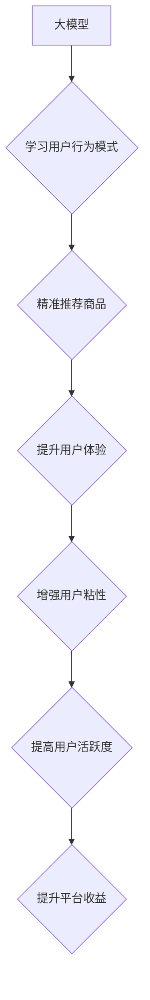

                 

## 大模型如何提升电商平台的用户粘性与长期活跃度

> 关键词：大模型、电商平台、用户粘性、长期活跃度、推荐系统、个性化服务、自然语言处理、对话系统

## 1. 背景介绍

在当今数字化时代，电商平台已成为人们购物、娱乐、社交的重要平台。然而，用户粘性和长期活跃度一直是电商平台面临的巨大挑战。用户在海量商品和平台的选择面前，容易流失，平台需要不断探索新的方式来提升用户体验，增强用户粘性。

近年来，大模型技术蓬勃发展，其强大的学习和推理能力为电商平台带来了新的机遇。大模型能够从海量数据中学习用户行为模式、商品特征和市场趋势，为用户提供更精准、更个性化的服务，从而提升用户粘性和长期活跃度。

## 2. 核心概念与联系

### 2.1 大模型

大模型是指参数量巨大、训练数据海量的人工智能模型。其强大的学习能力使其能够在自然语言处理、计算机视觉、语音识别等领域取得突破性进展。

### 2.2 电商平台用户粘性

用户粘性是指用户对电商平台的依赖程度和重复使用频率。高用户粘性意味着用户更频繁地访问平台、进行购买和参与互动，从而为平台带来持续的流量和收益。

### 2.3 电商平台长期活跃度

长期活跃度是指用户在平台上持续活跃的时间长度。高长期活跃度意味着用户能够长期保持对平台的兴趣和参与，为平台带来稳定的用户群体和品牌忠诚度。

**大模型与电商平台用户粘性与长期活跃度的关系**



## 3. 核心算法原理 & 具体操作步骤

### 3.1 算法原理概述

大模型在提升电商平台用户粘性和长期活跃度方面主要通过以下算法原理实现：

* **深度学习**: 大模型基于深度神经网络，能够从海量数据中学习复杂的模式和关系，例如用户偏好、商品关联、市场趋势等。
* **推荐系统**: 大模型可以构建个性化的推荐系统，根据用户的历史行为、浏览记录、购买偏好等信息，推荐用户可能感兴趣的商品，提高用户购物体验和转化率。
* **自然语言处理**: 大模型可以理解和处理用户自然语言输入，例如用户评论、搜索词、咨询内容等，为用户提供更精准、更人性化的服务。
* **对话系统**: 大模型可以构建智能对话系统，与用户进行自然流畅的对话，解答用户疑问、提供商品信息、完成交易等，提升用户购物体验和服务效率。

### 3.2 算法步骤详解

**1. 数据收集与预处理**: 收集用户行为数据、商品信息、市场数据等，并进行清洗、转换、格式化等预处理操作，为模型训练提供高质量数据。

**2. 模型选择与训练**: 选择合适的深度学习模型，例如Transformer、BERT等，并根据数据特点进行模型训练，优化模型参数，提高模型性能。

**3. 模型评估与调优**: 使用测试数据评估模型性能，并根据评估结果对模型参数进行调优，不断提升模型精度和效率。

**4. 系统部署与上线**: 将训练好的模型部署到电商平台，并进行系统测试和优化，确保模型能够稳定运行并提供高质量服务。

**5. 数据监控与模型更新**: 持续监控模型运行情况，收集用户反馈，并根据数据变化和用户需求，对模型进行更新和迭代，保持模型的有效性和时效性。

### 3.3 算法优缺点

**优点**:

* **精准推荐**: 大模型能够从海量数据中学习用户偏好，提供更精准的商品推荐，提高用户购物体验和转化率。
* **个性化服务**: 大模型可以根据用户的不同需求和行为模式，提供个性化的服务，例如个性化商品推荐、定制化购物体验等。
* **智能化交互**: 大模型可以构建智能对话系统，与用户进行自然流畅的交互，提升用户购物体验和服务效率。

**缺点**:

* **数据依赖**: 大模型的性能依赖于训练数据的质量和数量，数据不足或数据质量低会影响模型效果。
* **计算资源**: 训练大模型需要大量的计算资源和时间，成本较高。
* **模型解释性**: 大模型的决策过程较为复杂，难以解释模型的决策逻辑，这可能会导致用户对模型结果的信任度降低。

### 3.4 算法应用领域

大模型在电商平台的应用领域非常广泛，例如：

* **商品推荐**: 根据用户的历史行为、浏览记录、购买偏好等信息，推荐用户可能感兴趣的商品。
* **搜索引擎**: 理解用户的搜索意图，提供更精准的搜索结果。
* **个性化营销**: 根据用户的兴趣爱好、消费习惯等信息，进行个性化的营销推广。
* **客户服务**: 构建智能客服系统，自动解答用户疑问，提供快速高效的客户服务。

## 4. 数学模型和公式 & 详细讲解 & 举例说明

### 4.1 数学模型构建

大模型的训练过程本质上是一个优化问题，目标是找到模型参数，使得模型在训练数据上的预测性能达到最大。常用的数学模型包括：

* **损失函数**: 用于衡量模型预测结果与真实值的差距，常见的损失函数包括均方误差 (MSE)、交叉熵损失 (Cross-Entropy Loss) 等。
* **优化算法**: 用于更新模型参数，使得损失函数值不断减小，常见的优化算法包括梯度下降 (Gradient Descent)、Adam 优化器等。

### 4.2 公式推导过程

**均方误差 (MSE)**

$$MSE = \frac{1}{n} \sum_{i=1}^{n} (y_i - \hat{y}_i)^2$$

其中：

* $y_i$ 为真实值
* $\hat{y}_i$ 为模型预测值
* $n$ 为样本数量

**梯度下降 (Gradient Descent)**

$$\theta = \theta - \alpha \nabla J(\theta)$$

其中：

* $\theta$ 为模型参数
* $\alpha$ 为学习率
* $\nabla J(\theta)$ 为损失函数 $J(\theta)$ 的梯度

### 4.3 案例分析与讲解

假设我们训练一个商品推荐模型，目标是预测用户对商品的点击率。我们可以使用 MSE 作为损失函数，梯度下降算法作为优化算法，不断更新模型参数，使得模型预测的点击率与实际点击率的差距最小。

## 5. 项目实践：代码实例和详细解释说明

### 5.1 开发环境搭建

* Python 3.x
* TensorFlow 或 PyTorch 深度学习框架
* Jupyter Notebook 或 VS Code 代码编辑器

### 5.2 源代码详细实现

```python
# 导入必要的库
import tensorflow as tf

# 定义模型结构
model = tf.keras.Sequential([
    tf.keras.layers.Embedding(input_dim=vocab_size, output_dim=embedding_dim),
    tf.keras.layers.LSTM(units=128),
    tf.keras.layers.Dense(units=1, activation='sigmoid')
])

# 编译模型
model.compile(optimizer='adam', loss='binary_crossentropy', metrics=['accuracy'])

# 训练模型
model.fit(x_train, y_train, epochs=10, batch_size=32)

# 评估模型
loss, accuracy = model.evaluate(x_test, y_test)
print('Loss:', loss)
print('Accuracy:', accuracy)
```

### 5.3 代码解读与分析

* **模型结构**: 该代码定义了一个简单的深度学习模型，包含 Embedding 层、LSTM 层和 Dense 层。Embedding 层将用户和商品的 ID 映射到低维向量空间，LSTM 层捕捉用户行为序列中的时间依赖关系，Dense 层输出点击率预测结果。
* **模型编译**: 使用 Adam 优化器、二分类交叉熵损失函数和准确率作为评估指标编译模型。
* **模型训练**: 使用训练数据训练模型，设置训练轮数和批处理大小。
* **模型评估**: 使用测试数据评估模型性能，输出损失值和准确率。

### 5.4 运行结果展示

训练完成后，可以将模型应用于实际场景，例如预测用户对商品的点击率，并根据预测结果进行商品推荐。

## 6. 实际应用场景

### 6.1 个性化商品推荐

大模型可以根据用户的历史购买记录、浏览记录、评分等信息，学习用户的商品偏好，并推荐用户可能感兴趣的商品。

### 6.2 智能客服系统

大模型可以构建智能客服系统，自动解答用户常见问题，例如商品信息、订单查询、退换货政策等，提高用户服务效率。

### 6.3 内容推荐与个性化营销

大模型可以分析用户的阅读习惯、兴趣爱好等信息，推荐用户可能感兴趣的内容，例如文章、视频、活动等，并进行个性化营销推广。

### 6.4 未来应用展望

随着大模型技术的不断发展，其在电商平台的应用场景将更加广泛，例如：

* **虚拟试衣间**: 利用大模型和计算机视觉技术，实现虚拟试衣间功能，帮助用户在线试穿衣服，提升购物体验。
* **个性化穿搭建议**: 根据用户的体型、风格偏好等信息，利用大模型提供个性化穿搭建议，提升用户购物决策效率。
* **智能商品描述生成**: 利用大模型自动生成商品描述，提高商品信息质量和用户体验。

## 7. 工具和资源推荐

### 7.1 学习资源推荐

* **书籍**:
    * 《深度学习》 by Ian Goodfellow, Yoshua Bengio, Aaron Courville
    * 《自然语言处理入门》 by Jacob Eisenstein
* **在线课程**:
    * Coursera: 深度学习 Specialization
    * Udacity: 自然语言处理 Nanodegree
* **开源项目**:
    * TensorFlow: https://www.tensorflow.org/
    * PyTorch: https://pytorch.org/

### 7.2 开发工具推荐

* **Jupyter Notebook**: https://jupyter.org/
* **VS Code**: https://code.visualstudio.com/

### 7.3 相关论文推荐

* **BERT**: Devlin, J., Chang, M. W., Lee, K., & Toutanova, K. (2018). BERT: Pre-training of deep bidirectional transformers for language understanding. arXiv preprint arXiv:1810.04805.
* **Transformer**: Vaswani, A., Shazeer, N., Parmar, N., Uszkoreit, J., Jones, L., Gomez, A. N., ... & Polosukhin, I. (2017). Attention is all you need. In Advances in neural information processing systems (pp. 5998-6008).

## 8. 总结：未来发展趋势与挑战

### 8.1 研究成果总结

大模型在提升电商平台用户粘性和长期活跃度方面取得了显著成果，例如精准推荐、个性化服务、智能化交互等。

### 8.2 未来发展趋势

* **模型规模与性能提升**: 大模型规模将继续扩大，模型性能将进一步提升，能够处理更复杂的任务，提供更精准的服务。
* **多模态融合**: 大模型将融合文本、图像、音频等多模态数据，提供更全面的用户体验。
* **边缘计算与部署**: 大模型将部署到边缘设备，实现更低延迟、更高效率的服务。

### 8.3 面临的挑战

* **数据安全与隐私**: 大模型训练需要海量数据，如何保障数据安全和用户隐私是一个重要挑战。
* **模型解释性**: 大模型的决策过程较为复杂，难以解释模型的决策逻辑，这可能会导致用户对模型结果的信任度降低。
* **可解释性与公平性**: 确保大模型的决策结果可解释、公平、无偏见是一个重要的伦理挑战。

### 8.4 研究展望

未来研究将重点关注以下方面：

* **开发更安全、更隐私的训练方法**: 探索联邦学习、差分隐私等技术，保障数据安全和用户隐私。
* **提升模型解释性**: 研究模型可解释性技术，帮助用户理解模型的决策逻辑。
* **构建更公平、更可信的模型**: 探索模型公平性评估方法，并开发算法来 mitigate 模型偏见。


## 9. 附录：常见问题与解答

**Q1: 大模型训练需要多少计算资源？**

A1: 大模型训练需要大量的计算资源，例如 GPU、TPU 等。具体需要的计算资源取决于模型规模、训练数据量等因素。

**Q2: 如何评估大模型的性能？**

A2: 大模型的性能可以通过多种指标评估，例如准确率、召回率、F1-score 等。具体的评估指标取决于模型的应用场景。

**Q3: 如何部署大模型到实际应用场景？**

A3: 大模型的部署方式多种多样，例如云端部署、边缘部署等。具体的部署方式取决于应用场景和资源限制。


作者：禅与计算机程序设计艺术 / Zen and the Art of Computer Programming 
<end_of_turn>

