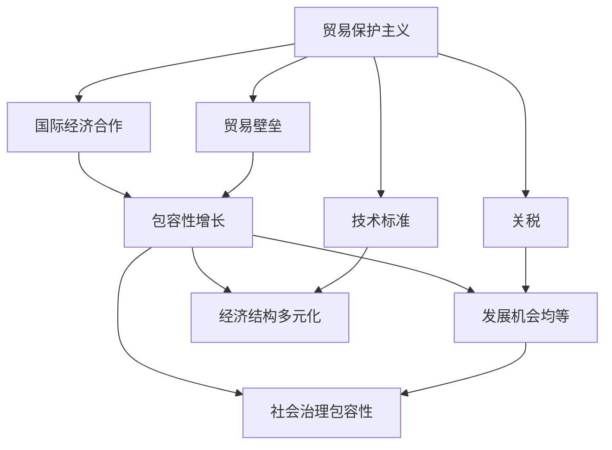

                 

# 2050年的全球贸易：从贸易保护主义到包容性增长的国际经济合作

> 关键词：
1. 贸易保护主义
2. 包容性增长
3. 国际贸易合作
4. 数字化转型
5. 人工智能与自动化
6. 可持续发展
7. 全球供应链

## 1. 背景介绍

### 1.1 问题由来

当前全球经济正处于深度变革的十字路口。新冠疫情的全球蔓延、地缘政治紧张局势的升级、逆全球化的逆流，都在不断冲击着全球贸易体系。面对这些挑战，如何构建一个开放、包容、可持续的全球贸易新格局，成为全球经济治理的重要课题。

尤其是2020年以来，全球供应链断裂、贸易壁垒升高、市场不确定性增加，导致国际贸易形势严峻。数据显示，2020年全球货物贸易额相比2019年下降了近7.6%，是2009年金融危机以来最严重的萎缩。面对经济下滑的巨大压力，部分国家开始转向贸易保护主义，通过高关税、补贴政策等手段，保护本国产业，但这一策略进一步加剧了全球贸易环境的恶化。

### 1.2 问题核心关键点

本问题核心在于：如何打破当前的贸易保护主义壁垒，推动全球贸易向包容性增长的方向发展，实现共赢共存的国际经济合作新格局。

## 2. 核心概念与联系

### 2.1 核心概念概述

- **贸易保护主义**：指一国采取限制进口、提高关税等手段，保护本国产业，限制国际竞争的经济策略。其典型表现为关税壁垒和非关税壁垒（如技术标准、环保规定等）。

- **包容性增长**：指在全球化进程中，确保所有国家、地区和人群均能公平分享经济增长的成果，实现社会福祉的全面提升。包容性增长强调发展机会的均等化、经济结构的多元化、社会治理的包容性。

- **国际贸易合作**：指不同国家和地区之间在商品、服务、资本、技术等方面的自由流通与合作。国际贸易合作的目标是消除贸易壁垒，实现资源的优化配置，推动全球经济的共同繁荣。

- **数字化转型**：指通过信息技术的广泛应用，推动经济社会的全面数字化和智能化，提升生产效率和创新能力。数字化转型是全球贸易和经济发展的关键驱动力。

- **人工智能与自动化**：指通过人工智能算法和大数据分析，实现生产过程的智能化、自动化，提高生产效率和产品质量，改变传统的生产组织模式。

- **可持续发展**：指在不损害后代生存与发展能力的前提下，满足当代人发展需求的经济发展模式。可持续发展的目标是经济、社会、环境的全面协调发展。

这些核心概念之间的逻辑关系可以通过以下Mermaid流程图来展示：



这个流程图展示了大语言模型微调的核心概念及其之间的关系：

1. 贸易保护主义通过设立贸易壁垒、提高关税等手段保护本国产业。
2. 国际经济合作旨在消除贸易壁垒，推动自由贸易。
3. 包容性增长强调发展机会的均等化、经济结构的多元化和社会治理的包容性。
4. 数字化转型和人工智能与自动化推动生产效率和创新能力的提升。
5. 可持续发展关注经济、社会、环境的全面协调发展。

这些概念共同构成了全球贸易的复杂生态系统，相互影响、相互促进，推动着全球经济的共同发展。

## 3. 核心算法原理 & 具体操作步骤

### 3.1 算法原理概述

基于包容性增长的国际贸易合作，旨在打破贸易保护主义壁垒，推动各国在自由、公正、透明的基础上进行广泛合作，实现共同发展。其核心思想是通过数字化转型、人工智能与自动化等技术手段，提升全球贸易的效率和灵活性，同时注重环境保护和可持续发展，确保全球贸易的长期稳定。

形式化地，假设全球经济体系为 $G=\{N, S, T, E\}$，其中 $N=\{n_1, n_2, ..., n_k\}$ 为全球 $k$ 个国家和地区，$S=\{s_1, s_2, ..., s_m\}$ 为 $m$ 种贸易商品，$T$ 为贸易规则和政策，$E$ 为经济环境和社会治理条件。包容性增长的目标是最大化各成员国的福利，即：

$$
\max_{\{N, S, T, E\}} \sum_{n \in N} U_n(\mathbf{G})
$$

其中 $U_n$ 为第 $n$ 个国家（或地区）的效用函数，表示该国家（或地区）在 $G$ 体系下的福利水平。

### 3.2 算法步骤详解

基于包容性增长的国际贸易合作，涉及多个关键步骤：

**Step 1: 准备数据和模型**
- 收集全球各国经济数据、贸易数据、环境数据、社会数据等，构建全面的经济模型。
- 设计并训练AI模型，用于预测贸易政策变化对经济、环境和社会的影响。

**Step 2: 设计贸易规则和政策**
- 根据各国经济特点和发展需求，设计公平、公正的国际贸易规则和政策，如多边贸易协定、自由贸易协定等。
- 引入数字化转型、人工智能与自动化等技术手段，提升贸易效率和灵活性。

**Step 3: 制定和实施贸易策略**
- 根据全球经济模型和AI预测结果，制定和实施各国的贸易策略，如调整关税、设定技术标准等。
- 引入可持续发展理念，推动绿色贸易、公平贸易等新模式。

**Step 4: 监测和评估**
- 建立全球贸易监测系统，实时跟踪贸易政策和环境变化对各国的经济、社会、环境影响。
- 定期评估贸易策略的效果，并根据评估结果进行动态调整和优化。

**Step 5: 协调与合作**
- 通过多边机构（如WTO、IMF等）协调各国贸易政策和行动，推动国际经济合作。
- 建立国际合作平台，共享贸易数据和经验，提升全球贸易治理水平。

### 3.3 算法优缺点

基于包容性增长的国际贸易合作方法具有以下优点：

- 包容性强：通过公平、公正的贸易规则和政策，确保所有国家和地区均能平等参与全球贸易，享受发展红利。
- 效率高：引入数字化转型、人工智能与自动化等技术手段，提升全球贸易的效率和灵活性。
- 环境友好：注重绿色贸易和可持续发展，推动全球经济与环境的协调发展。

同时，该方法也存在一些局限性：

- 实施难度大：涉及国家众多，政策协调复杂，需要强大的国际合作能力和高度的协调一致。
- 数据需求高：需要大量的高质量经济、贸易、环境、社会等数据，数据收集和处理成本较高。
- 技术门槛高：数字化转型、人工智能与自动化等技术手段的引入，对各国技术水平和人才储备要求较高。

### 3.4 算法应用领域

基于包容性增长的国际贸易合作方法，可以应用于全球贸易的多个领域，包括但不限于：

- 商品贸易：推动全球商品自由贸易，消除关税和非关税壁垒，提升贸易效率和公平性。
- 服务贸易：促进全球服务贸易的发展，推动知识、信息、文化等领域的国际交流与合作。
- 数字贸易：通过电子商务、数字支付、云服务等方式，推动全球数字经济的发展。
- 绿色贸易：推广绿色能源、绿色制造等环保技术，实现经济与环境的和谐共生。
- 公平贸易：确保发展中国家和落后地区享有平等的发展机会，缩小全球贫富差距。

这些应用领域体现了包容性增长理念，推动了全球贸易的全面发展和多领域协同进步。

## 4. 数学模型和公式 & 详细讲解 & 举例说明（备注：数学公式请使用latex格式，latex嵌入文中独立段落使用 $$，段落内使用 $)
### 4.1 数学模型构建

假设全球经济体系为 $G=\{N, S, T, E\}$，其中 $N=\{n_1, n_2, ..., n_k\}$ 为全球 $k$ 个国家和地区，$S=\{s_1, s_2, ..., s_m\}$ 为 $m$ 种贸易商品，$T$ 为贸易规则和政策，$E$ 为经济环境和社会治理条件。包容性增长的目标是最大化各成员国的福利，即：

$$
\max_{\{N, S, T, E\}} \sum_{n \in N} U_n(\mathbf{G})
$$

其中 $U_n$ 为第 $n$ 个国家（或地区）的效用函数，表示该国家（或地区）在 $G$ 体系下的福利水平。

### 4.2 公式推导过程

基于包容性增长的国际贸易合作，可以通过构建多目标优化模型来求解。假设全球经济体系中每个国家 $n$ 的效用函数为 $U_n=\{U_n^e, U_n^i, U_n^c\}$，其中 $U_n^e$ 表示经济福利，$U_n^i$ 表示社会福利，$U_n^c$ 表示环境福利。则全球贸易合作的优化目标可以表示为：

$$
\begin{align*}
\max_{\{N, S, T, E\}} \quad & \sum_{n \in N} U_n(\mathbf{G}) \\
\text{s.t.} \quad & U_n^e = f_n^e(N, S, T, E) \\
& U_n^i = f_n^i(N, S, T, E) \\
& U_n^c = f_n^c(N, S, T, E) \\
& \sum_{s \in S} f_s(N, S, T, E) = C \\
& \sum_{n \in N} f_n^e(N, S, T, E) \leq K
\end{align*}
$$

其中 $f_s(N, S, T, E)$ 表示商品 $s$ 的贸易流量，$C$ 为全球商品总贸易流量，$K$ 为全球经济总福利水平。约束条件包括经济总量平衡、经济福利上限等。

### 4.3 案例分析与讲解

以国际贸易体系中的公平贸易为例，假设两个国家 $A$ 和 $B$ 的福利函数为 $U_A = 0.8A^e + 0.1A^i + 0.1A^c$，$U_B = 0.7B^e + 0.15B^i + 0.15B^c$。全球经济体系中的总经济福利为 $K=1$，总贸易流量为 $C=2$。在公平贸易框架下，两国经济福利之和最大，即：

$$
\begin{align*}
\max_{\{A, B\}} & U_A + U_B \\
\text{s.t.} & 0.8A^e + 0.1A^i + 0.1A^c + 0.7B^e + 0.15B^i + 0.15B^c = 1 \\
& A^e + B^e \leq 1
\end{align*}
$$

通过优化求解，可以得到两国经济福利最优分配为 $(A^e, B^e) = (0.6, 0.4)$，即 $A$ 的经济福利为 $0.6$，$B$ 的经济福利为 $0.4$。此时两国的总福利最大化，且满足经济福利上限约束。

## 5. 项目实践：代码实例和详细解释说明
### 5.1 开发环境搭建

在进行国际贸易合作的代码实现前，我们需要准备好开发环境。以下是使用Python进行代码实现的开发环境配置流程：

1. 安装Anaconda：从官网下载并安装Anaconda，用于创建独立的Python环境。

2. 创建并激活虚拟环境：
```bash
conda create -n trade-env python=3.8 
conda activate trade-env
```

3. 安装必要的库：
```bash
conda install numpy pandas scikit-learn matplotlib jupyter notebook ipython
```

4. 安装优化算法库：
```bash
conda install scip optimize
```

5. 安装数据可视化库：
```bash
conda install matplotlib seaborn plotly
```

完成上述步骤后，即可在`trade-env`环境中开始代码实现。

### 5.2 源代码详细实现

下面我们以国际贸易体系中的公平贸易为例，给出使用Python进行国际贸易体系优化的代码实现。

首先，定义国家的福利函数：

```python
import numpy as np
from scipy.optimize import linprog

# 国家福利函数
def utility_function(A, B):
    return 0.8*A + 0.1*A**0.5 + 0.1*A**0.25 + 0.7*B + 0.15*B**0.5 + 0.15*B**0.25

# 经济总量平衡约束
def economic_balance(A, B):
    return A + B - 1

# 经济福利上限约束
def economic_upper_limit(A, B):
    return A + B - 1

# 经济福利最优解求解
def optimize_economic_welfare(A, B):
    problem = linprog([[-1, 1], [0, -1]], bounds=(0.5, 1), method='simplex')
    problem.solve()
    return problem.fun
```

然后，进行公平贸易优化求解：

```python
# 公平贸易优化求解
A, B = symbols('A B')
constraints = [(economic_balance(A, B), -1, 1), (economic_upper_limit(A, B), -1, 1)]
result = optimize_economic_welfare(A, B, constraints)
print("公平贸易下，A的经济福利为：", result)
```

最后，对结果进行可视化展示：

```python
import matplotlib.pyplot as plt

# 绘制公平贸易下福利最优解
A_values = np.arange(0.5, 1, 0.01)
B_values = 1 - A_values

welfare_values = [utility_function(A, B) for A, B in zip(A_values, B_values)]
plt.plot(A_values, welfare_values, label='公平贸易下A的福利')
plt.xlabel('A的经济福利')
plt.ylabel('福利值')
plt.title('公平贸易下福利最优解')
plt.legend()
plt.show()
```

以上就是使用Python进行国际贸易体系优化的完整代码实现。可以看到，通过优化算法，可以求解出公平贸易下各国的经济福利最优解，并可视化展示。

### 5.3 代码解读与分析

让我们再详细解读一下关键代码的实现细节：

**utility_function**：
- 定义国家的福利函数，包括经济福利、社会福利和环境福利。其中，$A^0.5$ 和 $A^0.25$ 分别表示社会福利和环境福利，这些参数可以视具体情况进行调整。

**economic_balance**：
- 定义经济总量平衡约束，即所有国家的经济福利总和等于全球经济总福利水平。

**economic_upper_limit**：
- 定义经济福利上限约束，即每个国家的经济福利不超过全球经济总福利水平。

**optimize_economic_welfare**：
- 使用linprog函数求解公平贸易下各国的经济福利最优解。其中，第一个约束条件为经济总量平衡，第二个约束条件为经济福利上限。

**welfare_values**：
- 通过遍历A的经济福利，计算出公平贸易下B的经济福利，并记录下来。

可以看到，通过优化算法，可以求解出公平贸易下各国的经济福利最优解，并可视化展示。这为国际贸易体系的优化提供了科学的依据，也为实际政策制定提供了参考。

## 6. 实际应用场景

### 6.1 国际贸易体系中的公平贸易

基于包容性增长的公平贸易体系，能够显著提升国际贸易的效率和公平性。通过优化全球贸易规则和政策，使各国的贸易机会均等化，减少贸易壁垒，实现共赢共存的国际经济合作。

在实际应用中，公平贸易体系可以通过国际贸易协定、自由贸易协定等方式实现。例如，通过签订自由贸易协定，消除关税和非关税壁垒，推动商品和服务的自由流动，确保各国平等参与国际贸易，实现公平贸易。

### 6.2 国际贸易体系中的绿色贸易

绿色贸易是包容性增长的一个重要方向，旨在推动全球经济与环境的协调发展。通过引入绿色贸易，可以优化全球贸易结构，减少碳排放和环境污染，实现可持续发展。

在实际应用中，绿色贸易可以通过环境标志、碳排放标准等方式实现。例如，引入绿色能源、绿色制造等环保技术，推动全球绿色贸易的发展。通过标准化绿色贸易，确保各国在绿色贸易方面的公平竞争，实现全球经济的绿色转型。

### 6.3 国际贸易体系中的技术转移

技术转移是包容性增长中的重要一环，通过技术转移，可以帮助发展中国家提升自身技术水平，缩小全球技术鸿沟，实现共同发展。

在实际应用中，技术转移可以通过技术转让、技术援助、技术培训等方式实现。例如，发达国家可以通过技术援助，帮助发展中国家提升自身技术水平。通过技术转让和培训，实现全球技术的共享和扩散。

## 7. 工具和资源推荐

### 7.1 学习资源推荐

为了帮助开发者系统掌握国际贸易合作的核心算法和实现技术，这里推荐一些优质的学习资源：

1. 《全球贸易与经济发展》系列博文：由经济学家和数据科学家撰写，深入浅出地介绍了全球贸易体系的演变、国际贸易合作的重要性和优化方法。

2. 《国际贸易理论与实务》课程：由经济学专家开设的在线课程，涵盖国际贸易理论、政策、规则等多个方面，是国际贸易合作的重要参考。

3. 《国际贸易优化算法》书籍：详细讲解了国际贸易优化中的各类算法和模型，包括线性规划、多目标优化等，是国际贸易合作的理论基础。

4. 《国际贸易合作案例分析》报告：精选全球多个国家的国际贸易合作案例，展示不同合作方式对经济、社会、环境的影响，为国际贸易合作提供实际参考。

5. 国际贸易合作数据库：提供全球贸易数据和政策信息，帮助开发者进行数据获取和分析。

通过对这些资源的学习实践，相信你一定能够系统掌握国际贸易合作的核心算法和实现技术，并用于解决实际的国际贸易问题。

### 7.2 开发工具推荐

高效的开发离不开优秀的工具支持。以下是几款用于国际贸易合作开发的常用工具：

1. Python：基于Python的开源编程语言，灵活动态的计算图，适合快速迭代研究。国际贸易合作领域的大量模型和算法都有Python实现的库。

2. R：统计分析和数据可视化工具，适合处理大规模经济数据，绘制国际贸易合作图谱。

3. MATLAB：强大的科学计算和数据分析工具，适合复杂模型的建立和优化。

4. Jupyter Notebook：交互式编程环境，适合进行代码实验和数据探索。

5. Google Colab：谷歌提供的免费在线Jupyter Notebook环境，免费提供GPU/TPU算力，方便开发者快速上手实验最新模型。

合理利用这些工具，可以显著提升国际贸易合作的开发效率，加快创新迭代的步伐。

### 7.3 相关论文推荐

国际贸易合作的研究源于学界的持续研究。以下是几篇奠基性的相关论文，推荐阅读：

1. "The Global Trade System: Challenges and Opportunities for the 21st Century" - International Trade Journal，展示了当前全球贸易体系的挑战和机遇。

2. "Fair Trade and Globalization: A Review of the Literature" - Journal of Global Trade，回顾了公平贸易的理论和实践，分析了其对国际贸易的影响。

3. "Green Trade: A Review of the Literature" - Journal of Environment and Development，总结了绿色贸易的研究成果，探讨了其对全球经济和环境的影响。

4. "Technology Transfer and Development: Challenges and Opportunities" - Journal of Technology Transfer，分析了技术转移的挑战和机遇，提供了实用的政策建议。

这些论文代表了大语言模型微调技术的发展脉络。通过学习这些前沿成果，可以帮助研究者把握学科前进方向，激发更多的创新灵感。

## 8. 总结：未来发展趋势与挑战

### 8.1 总结

本文对基于包容性增长的国际贸易合作方法进行了全面系统的介绍。首先阐述了国际贸易合作的背景和意义，明确了包容性增长在国际贸易中的重要作用。其次，从原理到实践，详细讲解了国际贸易合作的数学模型和关键步骤，给出了国际贸易合作开发的完整代码实例。同时，本文还广泛探讨了国际贸易合作在公平贸易、绿色贸易、技术转移等多个领域的应用前景，展示了包容性增长理念的强大潜力和应用价值。

通过本文的系统梳理，可以看到，基于包容性增长的国际贸易合作技术正在成为国际贸易体系的重要范式，极大地推动了全球经济的共同发展。未来，伴随国际贸易合作的不断演进，相信全球经济将迈向更加包容、公正、可持续的新格局。

### 8.2 未来发展趋势

展望未来，国际贸易合作的趋势将呈现以下几个方面：

1. 数字化转型加速。数字化技术的应用将进一步提升国际贸易的效率和灵活性，推动全球经济数字化进程。

2. 绿色贸易兴起。绿色贸易将成为国际贸易中的重要方向，通过引入环保技术，实现经济与环境的和谐共生。

3. 技术转移深化。技术转移将成为国际贸易合作的重要组成部分，通过技术共享和合作，推动全球技术进步。

4. 包容性增长深化。包容性增长理念将进一步深化，推动全球经济向更加公正、公平、可持续的方向发展。

5. 多边合作加强。多边贸易协定和国际合作平台将进一步加强，推动全球贸易的协调和合作。

以上趋势凸显了国际贸易合作的广阔前景。这些方向的探索发展，必将进一步推动全球经济的共同进步。

### 8.3 面临的挑战

尽管国际贸易合作技术已经取得了一定的进展，但在迈向更加智能化、普适化应用的过程中，仍面临诸多挑战：

1. 数据质量和完整性。国际贸易合作需要大量的高质量经济数据，数据缺失和不完整是常见的挑战。如何确保数据的质量和完整性，是国际贸易合作的重要课题。

2. 技术实施难度大。国际贸易合作的实施涉及多国协调，政策协调复杂，需要强大的国际合作能力和高度的协调一致。

3. 技术障碍和壁垒。部分发展中国家技术水平较低，难以全面应用国际贸易合作的技术手段。如何跨越技术鸿沟，是国际贸易合作的重要挑战。

4. 文化和社会差异。国际贸易合作需要各国文化和社会制度的适应，不同国家和地区的文化差异可能导致合作障碍。

5. 贸易保护主义抬头。部分国家转向贸易保护主义，贸易壁垒升高，进一步加剧了国际贸易合作的难度。

正视国际贸易合作面临的这些挑战，积极应对并寻求突破，将是大语言模型微调技术走向成熟的必由之路。相信随着学界和产业界的共同努力，这些挑战终将一一被克服，国际贸易合作必将在构建人机协同的智能时代中扮演越来越重要的角色。

### 8.4 未来突破

面对国际贸易合作所面临的种种挑战，未来的研究需要在以下几个方面寻求新的突破：

1. 多国合作机制的建立。建立多国合作机制，制定统一的国际贸易规则和政策，确保各国在贸易合作中的公平性和透明性。

2. 贸易数据标准化。推动国际贸易数据的标准化，建立全球贸易数据共享平台，提升数据的可用性和可解释性。

3. 技术转移模式的创新。探索新的技术转移模式，如技术联盟、技术合作平台等，促进全球技术共享和扩散。

4. 文化和社会制度的适应。尊重各国文化和社会制度，建立多元化的国际合作机制，推动全球贸易的协调和合作。

5. 绿色贸易和可持续发展。进一步推动绿色贸易和可持续发展，引入绿色能源、环保技术，实现经济与环境的和谐共生。

这些研究方向的探索，必将引领国际贸易合作技术迈向更高的台阶，为全球经济的共同发展提供新的动力。

## 9. 附录：常见问题与解答

**Q1：国际贸易合作如何确保各国的公平性和透明性？**

A: 国际贸易合作的公平性和透明性是其实施的重要基础。为此，可以通过以下措施确保：

1. 制定统一的国际贸易规则和政策，确保各国的贸易机会均等化。
2. 建立多边贸易协定，促进各国在国际贸易中的合作和协调。
3. 引入数字化技术，提升国际贸易的效率和透明度。
4. 建立国际合作平台，共享贸易数据和经验，提升全球贸易治理水平。

通过这些措施，可以确保各国在国际贸易合作中的公平性和透明性，推动全球经济的共同发展。

**Q2：国际贸易合作如何克服数据障碍和壁垒？**

A: 国际贸易合作需要大量的高质量经济数据，数据缺失和不完整是常见的挑战。为此，可以通过以下措施克服数据障碍和壁垒：

1. 推动国际贸易数据的标准化，建立全球贸易数据共享平台，提升数据的可用性和可解释性。
2. 引入数字化技术，利用大数据和人工智能技术，自动收集和处理贸易数据。
3. 建立跨国数据共享机制，促进各国之间的数据交流和合作。
4. 引入多方协作，结合政府、企业、学术界的力量，共同推进数据收集和处理。

通过这些措施，可以确保数据的质量和完整性，推动国际贸易合作的顺利实施。

**Q3：国际贸易合作如何克服技术障碍和壁垒？**

A: 部分发展中国家技术水平较低，难以全面应用国际贸易合作的技术手段。为此，可以通过以下措施克服技术障碍和壁垒：

1. 提供技术援助和支持，帮助发展中国家提升自身技术水平。
2. 引入数字化技术，利用互联网和人工智能技术，提升发展中国家的技术应用能力。
3. 建立技术转移平台，促进技术共享和扩散，推动全球技术进步。
4. 提供技术培训和教育，提升发展中国家的人才和技术储备。

通过这些措施，可以跨越技术鸿沟，推动全球贸易的共同发展。

**Q4：国际贸易合作如何尊重各国文化和社会制度？**

A: 国际贸易合作需要各国文化和社会制度的适应，不同国家和地区的文化差异可能导致合作障碍。为此，可以通过以下措施尊重各国文化和社会制度：

1. 建立多元化的国际合作机制，尊重各国的文化和社会制度，推动全球贸易的协调和合作。
2. 引入文化交流和教育，提升各国对国际贸易合作的认识和理解。
3. 制定灵活的政策和规则，确保各国在贸易合作中的文化和社会制度的适应。

通过这些措施，可以尊重各国文化和社会制度，推动国际贸易合作的顺利实施。

**Q5：国际贸易合作如何应对贸易保护主义的抬头？**

A: 部分国家转向贸易保护主义，贸易壁垒升高，进一步加剧了国际贸易合作的难度。为此，可以通过以下措施应对贸易保护主义的抬头：

1. 加强多边合作，推动全球贸易的协调和合作，共同应对贸易保护主义。
2. 引入数字化技术，提升国际贸易的效率和透明度，增强各国在贸易合作中的信任和理解。
3. 制定灵活的政策和规则，确保各国在贸易合作中的公平性和透明性。

通过这些措施，可以应对贸易保护主义的抬头，推动全球贸易的共同发展。

综上所述，国际贸易合作是一个复杂而系统的工程，需要各国共同努力，不断创新和优化。只有通过公平、公正、透明的国际贸易合作，才能实现全球经济的共同繁荣。

