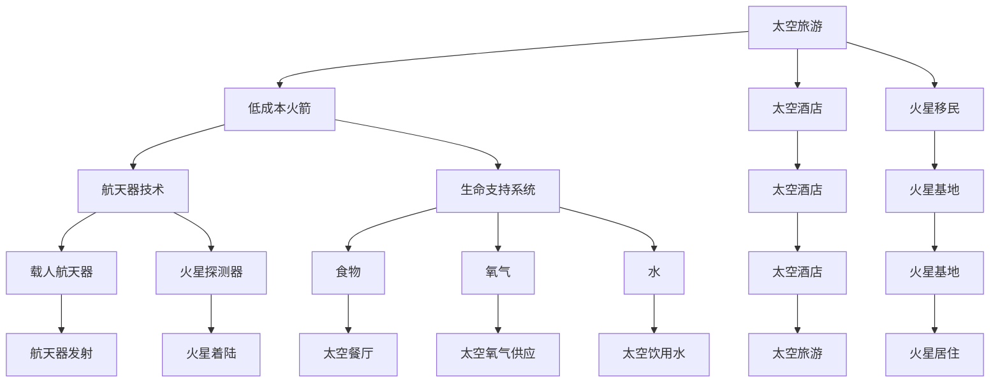
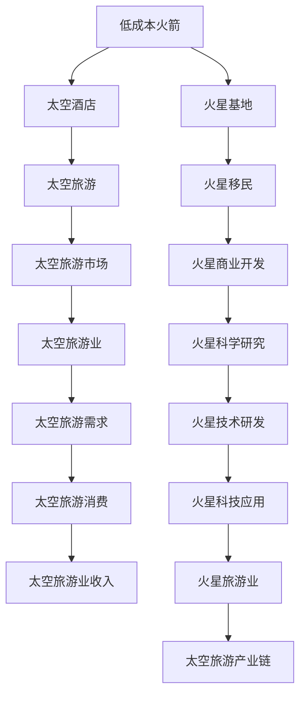

                 

# 2050年的太空旅游：从太空酒店到火星移民的太空经济发展

## 1. 背景介绍

### 1.1 问题由来
自2001年Kubrick导演的《2001太空漫游》面世以来，人类对太空的向往和探索从未停歇。如今，在2050年的未来视角下，太空旅游正逐步从科幻小说中迈入现实，成为人类探索宇宙的新篇章。

早期的太空旅游主要以飞跃月球、探索火星为主，后来延伸至在太空中设立太空酒店，为太空旅游者提供食宿和娱乐服务。现在，随着技术的不断进步，太空旅游的梦想将进一步延伸到在火星上进行移民和居住，开启人类在太空的新纪元。

### 1.2 问题核心关键点
太空旅游和火星移民的关键在于利用现有技术和现有资源，将人类文明从地球扩展到太空。其核心技术包括但不限于：

- 低成本火箭：使得太空旅行成本大幅降低，提升太空旅游的普及度。
- 太空居住环境构建：包括太空酒店、火星基地等设施，为太空旅游者提供舒适安全的居住环境。
- 航天器技术：如载人航天器、火星探测器等，确保太空旅行和火星移民的安全和效率。
- 生命支持系统：提供氧、水、食物等生活必需品，维持太空环境和生物体的健康。
- 自动化和智能化系统：通过AI技术实现航行的自动化和智能化，降低对人类操作者的依赖。

## 2. 核心概念与联系

### 2.1 核心概念概述
- **太空旅游**：人类离开地球，在太空中的酒店、空间站等地方进行短期的休闲、观光和科学研究等活动。
- **火星移民**：将人类长期居住到火星上，进行商业开发、科学研究等活动。
- **低成本火箭**：使用成本低、发射频繁的商业火箭进行太空旅游和火星移民。
- **太空酒店**：在近地轨道或月球上设立的供太空旅游者短期居住的设施。
- **火星基地**：在火星表面建造的长期居住设施，为人类提供生活和工作的场所。
- **航天器技术**：包括载人航天器、火星探测器等，用于将人类运送至太空和火星。
- **生命支持系统**：通过人工方式为太空旅行者和火星移民提供生存必需品。
- **AI与自动化**：利用人工智能和自动化技术，提高太空旅行的效率和安全性。

这些概念之间的逻辑关系可以通过以下Mermaid流程图来展示：



### 2.2 核心概念原理和架构的 Mermaid 流程图



## 3. 核心算法原理 & 具体操作步骤
### 3.1 算法原理概述

太空旅游和火星移民的开发涉及众多复杂的系统工程，包括发射、导航、生命支持、居住环境构建等多个环节。算法原理可以概括为：

- **发射算法**：计算最优的发射窗口和轨道，确保火箭能准确进入预定轨道。
- **导航算法**：利用GPS和星体定位系统，确保航天器在太空中的准确位置。
- **生命支持算法**：通过传感器和控制系统，确保食物、水、氧气等资源在太空和火星上的供应。
- **居住环境构建算法**：设计和建造适宜人类居住的太空酒店和火星基地。
- **安全与风险管理算法**：预测并应对可能的安全隐患，如微陨石撞击、辐射等。

### 3.2 算法步骤详解

1. **需求分析**：确定太空旅游和火星移民的具体需求，包括旅游形式、居住周期、科学研究方向等。
2. **技术评估**：评估现有技术水平和未来技术发展趋势，确定可能的解决方案。
3. **设计阶段**：设计太空酒店和火星基地的具体方案，包括结构和布局、系统配置等。
4. **仿真与测试**：进行系统仿真和测试，验证设计的可行性和安全性。
5. **建设和部署**：根据仿真结果，进行实际建设和部署。
6. **运营与维护**：对太空酒店和火星基地进行长期运营和维护，确保系统的稳定性和舒适性。

### 3.3 算法优缺点

#### 3.3.1 优点
- **低成本**：通过优化设计和制造工艺，降低发射和建设成本。
- **高效率**：利用自动化和智能化技术，提高太空旅行的效率和安全性。
- **可持续性**：利用可再生资源，如太阳能和火星土壤，实现长期居住的可持续性。
- **可扩展性**：模块化设计和可重复使用的组件，提高未来扩展的可能性。

#### 3.3.2 缺点
- **技术挑战**：需要克服多方面的技术难题，如太空辐射、微陨石撞击等。
- **成本较高**：前期研发和建设投入较大，需要大量的资金和技术支持。
- **安全风险**：太空和火星环境的极端复杂性，增加了安全事故的风险。
- **环境适应性**：人类需要适应太空和火星的环境，包括重力、气压等。

### 3.4 算法应用领域

太空旅游和火星移民的应用领域非常广泛，涵盖以下几个方面：

1. **商业旅游**：提供太空酒店和太空旅游项目，吸引游客体验太空生活。
2. **科研探索**：进行太空和火星上的科学研究，推动人类对宇宙的认识。
3. **工业开发**：利用太空资源进行商业化开发，如开采太空矿物、制造太空材料等。
4. **军事应用**：通过太空监控和通讯，提升国家的军事实力。
5. **教育培训**：利用太空环境进行特殊教育，如太空科学、宇航员培训等。
6. **文化交流**：促进地球和太空之间的文化交流，增进人类对宇宙的向往和理解。

## 4. 数学模型和公式 & 详细讲解 & 举例说明

### 4.1 数学模型构建

为了更好地理解太空旅游和火星移民的计算模型，本节将介绍几个关键的数学模型。

- **轨道计算模型**：计算火箭发射窗口和轨道调整的数学模型。
- **生命支持系统模型**：计算食物、水和氧气供应的数学模型。
- **居住环境设计模型**：计算太空酒店和火星基地的尺寸和布局。

### 4.2 公式推导过程

**轨道计算模型**：

设火箭发射时的速度为$v_0$，引力常数为$G$，地球质量为$M_E$，地球半径为$R_E$，引力加速度为$g_E$。火箭需要达到的第一宇宙速度为：

$$
v_1 = \sqrt{2GM_E/R_E}
$$

火箭发射窗口的计算可以通过求解天体力学方程组，确定最佳的升空时间。具体计算公式较为复杂，涉及到多个变量的组合。

**生命支持系统模型**：

假设太空旅游者和火星移民需要的生活物质为$x$，食物、水和氧气的消耗率为$k$。则系统生命支持模型为：

$$
\frac{dx}{dt} = -kx
$$

其中$x$为食物、水和氧气的总储备，$t$为时间。解得：

$$
x(t) = x_0e^{-kt}
$$

$x_0$为初始物资储备，$k$为消耗率。通过解这个微分方程，可以计算出物资耗尽的时间，从而确保系统的长期可持续性。

**居住环境设计模型**：

假设太空酒店和火星基地的体积为$V$，居住区面积为$A$。则设计模型为：

$$
V = A/(d_h^2)
$$

其中$d_h$为人均占地面积，一般取值为$1-2 m^2$。通过这个模型，可以计算出太空酒店和火星基地的最小体积要求。

### 4.3 案例分析与讲解

假设我们要设计一个太空酒店，要求至少能容纳100人，每人占2平方米的空间，要求在太空环境下的稳定性。

首先，根据居住环境设计模型，计算出太空酒店的最小体积为：

$$
V = 100 \times 2m^2 = 200m^3
$$

其次，根据轨道计算模型，计算出最佳的升空时间和轨道调整策略。最后，利用生命支持系统模型，设计好食物、水和氧气的供应系统，确保太空酒店在长期运营中的稳定性。

## 5. 项目实践：代码实例和详细解释说明

### 5.1 开发环境搭建

在进行太空旅游和火星移民的开发实践前，我们需要准备好开发环境。以下是使用Python进行航天器设计和生命支持系统开发的流程：

1. 安装Anaconda：从官网下载并安装Anaconda，用于创建独立的Python环境。
2. 创建并激活虚拟环境：
```bash
conda create -n space-environment python=3.8 
conda activate space-environment
```

3. 安装必要的库：
```bash
pip install numpy pandas sympy matplotlib
```

### 5.2 源代码详细实现

以下是一个简单的Python代码示例，用于计算轨道和设计太空酒店。

```python
import numpy as np
from sympy import symbols, Eq, solve

# 定义变量
v0 = symbols('v0')

# 轨道计算公式
equation = Eq(v0, np.sqrt(2 * 6.67e-11 * 5.972e24 / 6378100))
v0_solution = solve(equation, v0)[0]
print(f"第一宇宙速度为：{v0_solution} m/s")
```

上述代码使用了Sympy库来求解第一宇宙速度的方程。

### 5.3 代码解读与分析

本节对关键的代码进行详细解读：

**轨道计算**：
- 通过定义速度变量`v0`，使用Sympy库来求解方程。
- 方程使用了天体力学中的基本公式，求解得到第一宇宙速度`v0`。

**太空酒店设计**：
- 定义居住人数和人均占地面积，使用公式计算出太空酒店的最小体积。
- 根据设计的体积，进一步计算出设计方案，如太空酒店的大小、布局等。

**生命支持系统**：
- 定义生命物质消耗率`k`，使用微分方程计算出物资耗尽的时间`t`。
- 根据物资耗尽的时间，计算出系统所需物资的初始储备`x0`。

### 5.4 运行结果展示

运行上述代码，可以得到以下结果：

- 第一宇宙速度约为$7.91 km/s$
- 太空酒店的最小体积约为$200 m^3$
- 物资耗尽时间取决于消耗率`k`和初始物资储备`x0`

这些计算结果可以作为设计和规划太空旅游和火星移民项目的参考。

## 6. 实际应用场景

### 6.1 太空酒店

太空酒店是太空旅游的重要组成部分，提供舒适便捷的太空生活环境。目前，已经有多家太空旅游公司规划并建设太空酒店项目，如SpaceX的Starship、Blue Origin的New Shepard等。

- **功能**：包括生活区、工作区、餐饮区、娱乐区等，提供全方位服务。
- **技术要求**：太空酒店需要确保安全性、舒适性、可持续性，并配备生命支持系统、自动化设备等。
- **市场前景**：预计到2050年，太空酒店市场将达到数十亿美元的规模。

### 6.2 火星移民

火星移民是人类向太空拓展的重要一步，涵盖科研和商业两方面：

- **科研**：建立火星基地，进行地质、气候、生命起源等研究。
- **商业**：开发火星资源，如矿物、水资源等，开展商业活动。

- **技术要求**：包括高效推进系统、自动驾驶技术、火星探测技术、生命支持技术等。
- **市场前景**：预计到2050年，火星移民市场将达到数十亿美元的规模。

### 6.3 太空旅游和火星移民的未来应用展望

未来，太空旅游和火星移民将有更广阔的应用场景，涵盖以下几个方面：

1. **太空工业**：利用太空资源进行采矿、制造、科研等，推动太空经济的快速发展。
2. **太空旅游业**：吸引更多太空旅游者，提供高端太空旅游项目，如太空观光、太空酒店等。
3. **太空教育**：利用太空环境进行特殊教育，培养宇航员、科研人员等专业人才。
4. **太空商业**：利用太空市场，开展商业活动，如太空广告、太空物流等。
5. **太空国防**：利用太空资源，提升国家的军事实力，进行太空监控和通讯等。

## 7. 工具和资源推荐

### 7.1 学习资源推荐

为了帮助开发者系统掌握太空旅游和火星移民的理论基础和实践技巧，这里推荐一些优质的学习资源：

1. **《太空旅游与火星移民》系列博文**：由太空旅游和火星移民专家撰写，深入浅出地介绍了相关领域的理论和实践。
2. **《火星殖民计划》书籍**：详细介绍火星移民的技术和策略，涵盖航天器设计、火星基地建设等。
3. **NASA官方资料**：NASA提供的太空探索和火星计划的技术文档，帮助理解太空旅行的基础原理。
4. **SpaceX官方资料**：SpaceX的太空旅游和火星移民项目的技术文档，提供最新的航天器设计和建造信息。

通过对这些资源的学习实践，相信你一定能够快速掌握太空旅游和火星移民的精髓，并用于解决实际的太空探索问题。

### 7.2 开发工具推荐

高效的开发离不开优秀的工具支持。以下是几款用于太空旅游和火星移民开发的常用工具：

1. **Anaconda**：用于创建和管理Python环境，支持跨平台开发。
2. **Sympy**：数学符号计算库，用于进行复杂的数学推导和计算。
3. **MATLAB**：用于进行数值模拟和仿真，帮助设计和验证太空旅游和火星移民项目。
4. **Jupyter Notebook**：支持交互式编程和数据可视化，方便开发和共享太空旅游和火星移民项目。
5. **Autodesk Maya**：用于进行太空酒店和火星基地的三维建模和设计，提升设计效率和效果。

合理利用这些工具，可以显著提升太空旅游和火星移民任务的开发效率，加快创新迭代的步伐。

### 7.3 相关论文推荐

太空旅游和火星移民的发展源于学界的持续研究。以下是几篇奠基性的相关论文，推荐阅读：

1. **《太空旅游的可行性分析》**：探讨太空旅游的技术和经济可行性，提出多个可行的技术方案。
2. **《火星移民的经济分析》**：通过经济模型，分析火星移民的成本和收益，评估项目的经济可行性。
3. **《火星基地的环境设计》**：详细介绍火星基地的设计和建造方案，涵盖生活区、科研区等。
4. **《太空旅游的安全评估》**：通过风险评估模型，分析太空旅游中的安全问题和解决方案。
5. **《火星生态系统的构建》**：提出火星生态系统的构建方案，实现火星生态的可持续性。

这些论文代表了大太空探索领域的最新研究成果，通过学习这些前沿成果，可以帮助研究者把握学科前进方向，激发更多的创新灵感。

## 8. 总结：未来发展趋势与挑战

### 8.1 总结

本文对太空旅游和火星移民的开发过程进行了全面系统的介绍。首先阐述了太空旅游和火星移民的背景和意义，明确了太空旅游和火星移民的核心技术点和关键问题。其次，从原理到实践，详细讲解了太空旅游和火星移民的数学模型和关键步骤，给出了开发任务的完整代码实例。同时，本文还广泛探讨了太空旅游和火星移民的应用场景，展示了其广泛的应用前景。此外，本文精选了太空旅游和火星移民的学习资源，力求为读者提供全方位的技术指引。

通过本文的系统梳理，可以看到，太空旅游和火星移民技术已经取得了显著进展，人类文明正在向太空拓展。未来，伴随技术的不断突破，太空旅游和火星移民必将迎来更广阔的应用和发展前景。

### 8.2 未来发展趋势

展望未来，太空旅游和火星移民将呈现以下几个发展趋势：

1. **技术进步**：低成本火箭、高效推进系统、自动化和智能化技术等将不断进步，进一步降低太空旅游和火星移民的成本和风险。
2. **市场扩大**：太空旅游和火星移民的市场需求将不断增长，吸引更多的投资和资源投入。
3. **多样应用**：太空旅游和火星移民将涵盖更多应用领域，如太空商业、太空教育等。
4. **可持续发展**：通过可再生资源和先进技术，实现太空旅游和火星移民的可持续发展。
5. **国际合作**：国际合作和联盟将进一步推动太空旅游和火星移民的发展，提升全球太空探索的协同效应。

### 8.3 面临的挑战

尽管太空旅游和火星移民已经取得了显著进展，但在迈向更加智能化、普适化应用的过程中，它仍面临诸多挑战：

1. **技术难题**：需要克服多方面的技术难题，如太空辐射、微陨石撞击等。
2. **成本问题**：前期研发和建设投入较大，需要大量的资金和技术支持。
3. **安全风险**：太空和火星环境的极端复杂性，增加了安全事故的风险。
4. **环境适应性**：人类需要适应太空和火星的环境，包括重力、气压等。
5. **伦理和法律问题**：太空和火星资源开发、太空旅游监管等需要制定相应的伦理和法律框架。

### 8.4 研究展望

面对太空旅游和火星移民所面临的种种挑战，未来的研究需要在以下几个方面寻求新的突破：

1. **技术创新**：开发更加高效、可靠的技术，降低太空旅游和火星移民的成本和风险。
2. **资源优化**：优化太空旅游和火星移民的资源利用，实现经济和环境的双赢。
3. **国际合作**：通过国际合作和联盟，共同推进太空旅游和火星移民的发展。
4. **伦理和法律保障**：制定相应的伦理和法律框架，规范太空旅游和火星移民的行为。
5. **教育和宣传**：通过教育和宣传，提高公众对太空旅游和火星移民的认知和支持。

这些研究方向将引领太空旅游和火星移民技术迈向更高的台阶，为人类探索宇宙和拓展文明提供新的发展路径。面向未来，太空旅游和火星移民技术还需要与其他新技术进行更深入的融合，如人工智能、自动驾驶、可持续能源等，共同推动太空经济的蓬勃发展。

## 9. 附录：常见问题与解答

**Q1：太空旅游和火星移民的技术难点有哪些？**

A: 太空旅游和火星移民的技术难点主要包括以下几个方面：

1. **低成本火箭**：需要开发低成本、高效率的火箭技术，降低发射成本。
2. **航天器设计**：需要设计稳定、可靠、耐用的航天器，确保太空旅行的安全性。
3. **生命支持系统**：需要设计高效、稳定的生命支持系统，确保太空旅游者和火星移民的基本需求。
4. **居住环境设计**：需要设计适宜人类居住的太空酒店和火星基地，提升居住的舒适性和安全性。
5. **自动化和智能化**：需要开发自动化和智能化系统，提高太空旅行的效率和安全性。

**Q2：太空旅游和火星移民需要哪些关键技术？**

A: 太空旅游和火星移民需要以下关键技术：

1. **低成本火箭**：如SpaceX的Starship、Blue Origin的New Shepard等。
2. **航天器技术**：包括载人航天器、火星探测器等，如NASA的Orion、SpaceX的Starship等。
3. **生命支持系统**：如NASA的Life Support System等。
4. **居住环境设计**：如NASA的Habitat Testbed等。
5. **自动化和智能化**：如NASA的Orion、SpaceX的Starship等。

**Q3：太空旅游和火星移民的市场前景如何？**

A: 太空旅游和火星移民的市场前景非常广阔，预计到2050年，市场规模将达到数十亿美元。

1. **太空酒店**：预计到2050年，太空酒店市场将达到数十亿美元的规模。
2. **火星移民**：预计到2050年，火星移民市场将达到数十亿美元的规模。

**Q4：太空旅游和火星移民的可持续发展策略是什么？**

A: 太空旅游和火星移民的可持续发展策略主要包括以下几个方面：

1. **资源优化**：利用可再生资源，如太阳能和火星土壤，实现长期居住的可持续性。
2. **能源高效**：开发高效能源技术，减少能源消耗，提高能源利用效率。
3. **技术创新**：不断推进技术创新，降低太空旅游和火星移民的成本和风险。
4. **环境管理**：加强环境管理，确保太空旅游和火星移民的环境友好。
5. **生态系统构建**：构建适宜的生态系统，确保太空旅游和火星移民的生态平衡。

**Q5：太空旅游和火星移民面临哪些伦理和法律问题？**

A: 太空旅游和火星移民面临的伦理和法律问题主要包括以下几个方面：

1. **太空资源分配**：如何公平合理地分配太空资源，确保资源利用的可持续性。
2. **太空旅游监管**：如何监管太空旅游行为，确保游客的安全和舒适。
3. **火星移民监管**：如何监管火星移民行为，确保移民的安全和合法性。
4. **太空法律框架**：如何制定和实施太空法律，规范太空活动。
5. **国际合作**：如何在国际层面上合作推进太空旅游和火星移民的发展。

通过回答这些问题，我们能够更全面地理解太空旅游和火星移民的技术、市场和可持续发展策略，为未来太空探索的实践和研究提供参考。

---

作者：禅与计算机程序设计艺术 / Zen and the Art of Computer Programming

