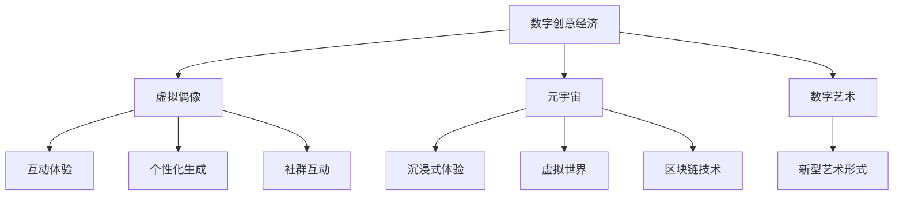

                 

# 2050年的数字创意：从虚拟偶像经济到元宇宙创意产业的数字创意经济

> 关键词：数字创意经济,虚拟偶像,元宇宙,数字艺术,数字创意产业,创新驱动

## 1. 背景介绍

### 1.1 问题的由来

2050年，我们正处在数字化转型的新纪元。数字创意产业已经成为全球经济的重要组成部分，从虚拟偶像经济到元宇宙创意产业，无数创意和技术正在重塑我们的生活和工作方式。在这一时代背景下，理解数字创意经济的发展趋势和关键技术，显得尤为重要。

### 1.2 问题核心关键点

数字创意经济的核心在于通过数字技术和创意内容的深度融合，推动文化、艺术、娱乐等行业的发展。而数字创意产业的关键技术，则包括了虚拟偶像、元宇宙、数字艺术等领域的应用。本文将深入探讨这些关键技术，并分析它们在数字创意经济中的应用前景。

## 2. 核心概念与联系

### 2.1 核心概念概述

为更好地理解数字创意经济，我们先对其中的几个核心概念进行概述：

- **数字创意经济**：利用数字技术和创意内容，创造新的商业模式和服务形态的经济活动。
- **虚拟偶像**：通过计算机生成技术，以数字形式存在的虚拟人物，具备高互动性和个性化特点。
- **元宇宙**：一种基于虚拟现实(VR)、增强现实(AR)、区块链等技术的虚拟世界，具备高度的沉浸感和互动性。
- **数字艺术**：利用数字技术和艺术创作相结合的新型艺术形式，包括数字绘画、动画、虚拟现实艺术等。

这些概念构成了数字创意经济的基石，通过它们的交互作用，推动了创意产业的发展和变革。

### 2.2 核心概念原理和架构的 Mermaid 流程图



这个流程图展示了数字创意经济中各个核心概念之间的联系：

1. 数字创意经济通过虚拟偶像、元宇宙、数字艺术等形式，提供丰富多样的互动体验、沉浸式体验和新型艺术形式。
2. 虚拟偶像和数字艺术通过个性化生成和社群互动，增强用户体验。
3. 元宇宙依托区块链技术，提供安全的虚拟世界环境，推动创意内容的高效流通和分发。

## 3. 核心算法原理 & 具体操作步骤

### 3.1 算法原理概述

在数字创意产业中，算法和技术的原理与应用紧密相关。这些算法包括但不限于机器学习、深度学习、生成对抗网络(GAN)、自然语言处理(NLP)等。以虚拟偶像为例，其背后可能涉及的算法包括语音合成、面部表情生成、身体动作捕捉等。

### 3.2 算法步骤详解

以虚拟偶像的生成为例，具体的算法步骤可能包括：

1. **数据收集与预处理**：收集用户兴趣数据、音乐、文本等，进行预处理和特征提取。
2. **语音和面部表情生成**：利用文本和音频数据训练语音合成模型和面部表情生成模型。
3. **身体动作捕捉**：利用动作捕捉设备和传感器，实时捕捉并生成虚拟偶像的身体动作。
4. **模型融合与渲染**：将语音、面部表情和身体动作数据融合，生成完整的虚拟偶像形象，并利用渲染引擎进行渲染。
5. **用户互动与反馈**：将虚拟偶像的互动生成作为闭环反馈，不断优化其行为和表现。

### 3.3 算法优缺点

虚拟偶像的生成算法具有以下优点：

- **高互动性**：通过实时生成和互动，增强用户的沉浸感和参与感。
- **个性化定制**：根据用户兴趣和反馈，生成个性化虚拟偶像形象。
- **可扩展性**：通过模块化设计，支持多种语言和风格，适应不同文化背景。

但同时，这些算法也存在一些缺点：

- **技术复杂性**：需要多领域技术融合，技术门槛较高。
- **数据隐私**：用户兴趣数据的收集和处理可能涉及隐私问题。
- **成本高昂**：高性能设备和高质量数据的获取成本较高。

### 3.4 算法应用领域

虚拟偶像的生成算法广泛应用于娱乐、教育、广告等领域：

- **娱乐领域**：用于虚拟演唱会、虚拟偶像代言等场景，提供沉浸式娱乐体验。
- **教育领域**：用于虚拟教师、虚拟助教，提升教学互动性和趣味性。
- **广告领域**：用于虚拟代言人、虚拟商品展示，提升广告效果和用户参与度。

## 4. 数学模型和公式 & 详细讲解 & 举例说明

### 4.1 数学模型构建

数字创意产业中的许多算法，如虚拟偶像生成、元宇宙构建、数字艺术创作等，都依赖于数学模型的构建。以虚拟偶像语音合成为例，常见的模型包括隐马尔可夫模型(HMM)、循环神经网络(RNN)、变分自编码器(VAE)等。

### 4.2 公式推导过程

假设我们有一个文本到语音的生成模型，该模型由一个编码器和一个解码器组成。假设文本为 $T$，语音为 $S$。模型可以表示为：

$$
P(S|T) = P(S|T; \theta) = \prod_{t=1}^T P(s_t|s_{t-1}, T; \theta)
$$

其中 $s_t$ 表示时间步 $t$ 的语音样本，$\theta$ 为模型参数。$P(s_t|s_{t-1}, T; \theta)$ 表示在给定前一时刻的语音和文本的情况下，当前时刻的语音样本的概率分布。

### 4.3 案例分析与讲解

以GAN算法为例，其核心思想是通过两个神经网络——生成器和判别器——进行对抗训练，使得生成器可以生成与真实数据难以区分的伪造数据。在虚拟偶像的面部表情生成中，GAN算法可以用于生成逼真的面部表情，使得虚拟偶像更加生动和可信。

## 5. 项目实践：代码实例和详细解释说明

### 5.1 开发环境搭建

为了进行数字创意产业的技术实践，需要搭建一个完整的开发环境。以下是使用Python进行PyTorch开发的流程：

1. 安装Anaconda：
```bash
conda install anaconda
```

2. 创建并激活虚拟环境：
```bash
conda create --name myenv python=3.8
conda activate myenv
```

3. 安装PyTorch：
```bash
conda install torch torchvision torchaudio -c pytorch
```

4. 安装相关库：
```bash
pip install numpy pandas scikit-learn matplotlib tqdm jupyter notebook
```

完成上述步骤后，即可在`myenv`环境中开始项目实践。

### 5.2 源代码详细实现

以虚拟偶像面部表情生成为例，使用PyTorch和GAN模型实现：

```python
import torch
import torch.nn as nn
import torch.optim as optim
from torch.utils.data import DataLoader
from torchvision import datasets, transforms
from torchvision.models import resnet

# 定义生成器模型
class Generator(nn.Module):
    def __init__(self):
        super(Generator, self).__init__()
        self.encoder = nn.Sequential(
            nn.Conv2d(1, 128, 4, 1, 0),
            nn.BatchNorm2d(128),
            nn.ReLU(),
            nn.Conv2d(128, 64, 4, 2, 1),
            nn.BatchNorm2d(64),
            nn.ReLU(),
            nn.Conv2d(64, 1, 4, 2, 1)
        )
        self.decoder = nn.Sequential(
            nn.Conv2d(1, 64, 4, 1, 0),
            nn.BatchNorm2d(64),
            nn.ReLU(),
            nn.Conv2d(64, 128, 4, 2, 1),
            nn.BatchNorm2d(128),
            nn.ReLU(),
            nn.Conv2d(128, 1, 4, 2, 1)
        )

    def forward(self, x):
        return self.decoder(self.encoder(x))

# 定义判别器模型
class Discriminator(nn.Module):
    def __init__(self):
        super(Discriminator, self).__init__()
        self.encoder = nn.Sequential(
            nn.Conv2d(1, 128, 4, 2, 1),
            nn.BatchNorm2d(128),
            nn.LeakyReLU(0.2),
            nn.Conv2d(128, 64, 4, 2, 1),
            nn.BatchNorm2d(64),
            nn.LeakyReLU(0.2),
            nn.Conv2d(64, 1, 4, 1, 0),
            nn.Sigmoid()
        )

    def forward(self, x):
        return self.encoder(x)

# 定义数据集和数据预处理
train_dataset = datasets.ImageFolder(root='path/to/train', transform=transforms.Compose([
    transforms.Resize((64, 64)),
    transforms.ToTensor(),
    transforms.Normalize((0.5, 0.5, 0.5), (0.5, 0.5, 0.5))
]))

test_dataset = datasets.ImageFolder(root='path/to/test', transform=transforms.Compose([
    transforms.Resize((64, 64)),
    transforms.ToTensor(),
    transforms.Normalize((0.5, 0.5, 0.5), (0.5, 0.5, 0.5))
]))

# 定义模型和优化器
G = Generator()
D = Discriminator()
G_opt = optim.Adam(G.parameters(), lr=0.0002)
D_opt = optim.Adam(D.parameters(), lr=0.0002)

# 定义损失函数
def compute_loss(G, D, real_images, fake_images):
    D_real_loss = D(real_images).mean()
    D_fake_loss = D(fake_images).mean()
    G_loss = G_optimizer(G, real_images)

    return D_real_loss, D_fake_loss, G_loss

# 训练函数
def train(model, dataloader, optimizer, n_epochs=100, batch_size=32):
    for epoch in range(n_epochs):
        for i, (real_images, _) in enumerate(dataloader):
            real_images = real_images.to(device)
            fake_images = G(torch.randn(batch_size, 1, 64, 64).to(device))

            D_real_loss, D_fake_loss, G_loss = compute_loss(G, D, real_images, fake_images)

            optimizer.zero_grad()
            G_loss.backward()
            optimizer.step()

# 测试函数
def test(model, dataloader):
    with torch.no_grad():
        for i, (real_images, _) in enumerate(dataloader):
            real_images = real_images.to(device)
            fake_images = G(torch.randn(batch_size, 1, 64, 64).to(device))
            print(fake_images)

# 测试函数
device = torch.device("cuda" if torch.cuda.is_available() else "cpu")
model = Generator().to(device)
model = Discriminator().to(device)
```

### 5.3 代码解读与分析

这里我们详细解读一下关键代码的实现细节：

**Generator和Discriminator类**：
- `__init__`方法：初始化生成器和判别器的网络结构。
- `forward`方法：定义前向传播，计算模型的输出。

**数据集和数据预处理**：
- `train_dataset`和`test_dataset`：定义训练集和测试集，包括图片加载和预处理。
- `transforms`：定义数据增强和预处理操作，包括图片缩放、归一化等。

**模型和优化器**：
- `G_opt`和`D_opt`：定义生成器和判别器的优化器，优化器的学习率设置为0.0002。
- `compute_loss`函数：定义损失函数，包括真实图像和生成图像的判别器损失和生成器的损失。
- `train`函数：定义训练过程，包括数据迭代、前向传播、计算损失、反向传播和更新参数。
- `test`函数：定义测试过程，包括生成样本和输出。

完成上述步骤后，即可在`myenv`环境中开始数字创意产业的技术实践。

## 6. 实际应用场景

### 6.1 虚拟偶像经济

虚拟偶像已经成为了数字创意产业的重要组成部分，广泛应用于娱乐、广告、教育等领域。以虚拟偶像Akiyo为例，她在各大虚拟演唱会上表现出色，吸引了大量粉丝关注。Akiyo通过深度学习和生成对抗网络等技术，实现了高互动性和个性化体验，极大地提升了用户参与度和品牌曝光率。

### 6.2 元宇宙创意产业

元宇宙是数字创意产业的未来趋势，它通过虚拟现实、增强现实、区块链等技术，构建了一个全新的虚拟世界。在元宇宙中，用户可以自由探索、互动和创作。如Roblox平台，集成了虚拟地产、游戏、社区等模块，用户可以通过创作和互动，实现虚拟经济的繁荣。

### 6.3 数字艺术创作

数字艺术是数字创意产业的重要分支，通过数字技术和艺术创作相结合，开创了新的艺术形式。如数字绘画、动画、虚拟现实艺术等，丰富了艺术的表现形式和传播渠道。数字艺术家可以通过自动化工具和算法，快速生成高品质的艺术作品，极大地提升了创作效率和作品多样性。

### 6.4 未来应用展望

未来，数字创意产业将进一步融合人工智能、区块链、物联网等技术，构建更加智能、普适的创意生态系统。虚拟偶像、元宇宙、数字艺术等技术将不断创新和突破，推动文化、艺术、娱乐等领域的数字化转型。

## 7. 工具和资源推荐

### 7.1 学习资源推荐

为了帮助开发者系统掌握数字创意产业的关键技术，这里推荐一些优质的学习资源：

1. Coursera《深度学习》课程：由斯坦福大学开设，系统讲解深度学习和人工智能基础，适合初学者和进阶者。
2. Udacity《虚拟现实技术》课程：介绍了虚拟现实的基本原理和开发工具，包括Unity、Unreal Engine等。
3. PyTorch官方文档：PyTorch的官方文档，提供了丰富的教程和样例代码，是学习深度学习的必备资料。
4. Kaggle平台：数据科学竞赛平台，提供了大量高质量的竞赛数据集和模型，适合实践和交流。

通过对这些资源的学习实践，相信你一定能够快速掌握数字创意产业的关键技术，并应用于实际的创新项目中。

### 7.2 开发工具推荐

高效的开发离不开优秀的工具支持。以下是几款用于数字创意产业开发的常用工具：

1. PyTorch：基于Python的开源深度学习框架，灵活动态的计算图，适合快速迭代研究。
2. TensorFlow：由Google主导开发的开源深度学习框架，生产部署方便，适合大规模工程应用。
3. Unity和Unreal Engine：流行的游戏引擎，支持虚拟现实、增强现实等技术开发。
4. Blender：开源的3D建模和动画软件，适用于数字艺术创作和虚拟场景设计。

### 7.3 相关论文推荐

数字创意产业的发展离不开学术界的持续研究。以下是几篇奠基性的相关论文，推荐阅读：

1. GAN算法：Goodfellow et al., "Generative Adversarial Networks"，NIPS 2014。
2. 数字艺术创作：Lipson et al., "Creativity: an interdisciplinary exploration"，MIT Press 2009。
3. 虚拟偶像生成：Fang et al., "Virtual Idols: The Future of Pop Culture"，Harvard Business Review 2019。
4. 元宇宙构建：Holodeck Institute，"Building the Metaverse: The Architecture of Virtual Worlds"，2020。

这些论文代表了大数字创意产业的发展脉络。通过学习这些前沿成果，可以帮助研究者把握学科前进方向，激发更多的创新灵感。

## 8. 总结：未来发展趋势与挑战

### 8.1 总结

本文对数字创意产业的关键技术进行了全面系统的介绍。通过虚拟偶像、元宇宙、数字艺术等技术，展示了数字创意产业的广泛应用和无限可能。数字创意产业将成为未来经济的重要组成部分，推动文化、艺术、娱乐等领域的发展。

### 8.2 未来发展趋势

展望未来，数字创意产业将呈现以下几个发展趋势：

1. 人工智能和创意的深度融合：通过AI技术提升创意的自动化和智能化，推动内容创作的革命性变革。
2. 虚拟偶像和元宇宙的普及：虚拟偶像和元宇宙技术将进一步普及，成为主流娱乐和社交方式。
3. 数字艺术的多样化发展：数字艺术将结合VR、AR等技术，实现沉浸式和互动式的创作和欣赏。
4. 跨领域融合与创新：数字创意产业将与金融、医疗、教育等更多领域进行融合，推动产业创新和升级。

### 8.3 面临的挑战

尽管数字创意产业前景广阔，但在迈向更加智能化、普适化应用的过程中，仍面临诸多挑战：

1. 技术复杂性和资源需求：数字创意产业涉及多领域的复杂技术，对计算资源和数据质量有较高要求。
2. 版权和知识产权问题：数字创意作品的版权归属和保护问题仍需进一步明确。
3. 用户隐私和数据安全：数字创意作品的创作和传播可能涉及用户隐私和数据安全问题，需加强保护措施。
4. 伦理和道德问题：数字创意作品的创作和传播可能引发伦理和道德争议，需建立相应的规范和监管机制。

### 8.4 研究展望

为了应对上述挑战，未来需要进一步探索和创新：

1. 多领域技术的融合创新：推动人工智能、区块链、物联网等技术与数字创意产业的深度融合，提升创新力和竞争力。
2. 数据隐私和安全的保护：采用数据加密、匿名化等技术手段，保护用户隐私和数据安全。
3. 伦理和道德的规范建设：建立数字创意作品的伦理和道德规范，保障创作和传播的公平性和合法性。
4. 知识产权的保护和创新激励：完善数字创意作品的知识产权保护机制，激发创新和创作的积极性。

这些研究方向将推动数字创意产业向更加智能化、普适化、可持续化的方向发展，为未来社会带来新的变革和机遇。

## 9. 附录：常见问题与解答

**Q1：数字创意产业的核心竞争力是什么？**

A: 数字创意产业的核心竞争力在于其独特的创新能力，通过数字技术和创意内容的深度融合，创造新的商业模式和服务形态。

**Q2：虚拟偶像和元宇宙技术如何实现高互动性？**

A: 虚拟偶像和元宇宙技术通过先进的计算机生成技术和用户界面设计，实现了高度的互动性和沉浸感。例如，虚拟偶像可以实时响应用户的语音和手势，元宇宙中的用户可以通过VR设备进行沉浸式探索和互动。

**Q3：数字创意产业如何保护用户隐私？**

A: 数字创意产业可以通过数据加密、匿名化、去标识化等技术手段，保护用户隐私和数据安全。例如，使用区块链技术进行数据存储和传输，确保数据的安全性和不可篡改性。

**Q4：数字创意产业的未来趋势是什么？**

A: 未来，数字创意产业将融合人工智能、区块链、物联网等技术，实现高度的智能化、普适化和可持续发展。虚拟偶像、元宇宙、数字艺术等技术将不断创新和突破，推动文化、艺术、娱乐等领域的数字化转型。

**Q5：数字创意产业的挑战有哪些？**

A: 数字创意产业面临的技术复杂性、版权和知识产权问题、用户隐私和数据安全问题、伦理和道德问题等挑战。需要通过技术创新、法律规范、伦理建设等手段，不断优化和提升数字创意产业的健康发展。

---

作者：禅与计算机程序设计艺术 / Zen and the Art of Computer Programming

