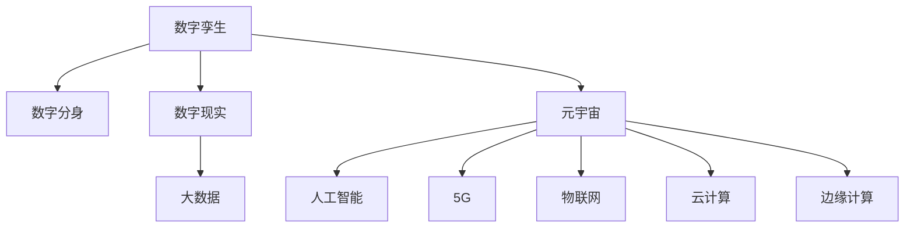

                 

# 2050年的数字孪生：从数字分身到元宇宙生活的虚实融合

> 关键词：数字孪生, 元宇宙, 数字分身, 虚实融合, 数字现实, 人工智能(AI), 大数据, 5G, 物联网(IoT), 云计算, 边缘计算

## 1. 背景介绍

### 1.1 问题由来

随着科技的迅猛发展，数字技术正逐渐渗透到各行各业，重塑我们的工作和生活方式。2050年，在数字技术的推动下，我们将进入一个全新的时代——元宇宙时代。元宇宙（Metaverse），一个基于数字实体的虚拟世界，涵盖了数字现实（Digital Reality, DR）、数字分身（Digital Avatar）、数字孪生（Digital Twin）等概念，通过虚拟与现实的深度融合，将开启人机交互的新纪元。

### 1.2 问题核心关键点

元宇宙时代的关键在于如何实现虚实融合，构建一个无缝衔接的数字与物理世界的高度协同系统。其中，数字孪生技术扮演着重要角色，通过创建虚拟世界中的实体对应物，实现虚拟与现实世界的双向互动和数据同步。数字孪生技术的核心在于其能够实时更新、实时预测和实时干预，使得虚拟与现实世界的交互更加自然和高效。

## 2. 核心概念与联系

### 2.1 核心概念概述

为更好地理解数字孪生的原理和架构，本节将介绍几个关键概念：

- **数字孪生（Digital Twin）**：通过在虚拟空间中创建物理实体的精确数字镜像，实现物理世界的数字化表征和仿真，用于设计、分析、优化、维护等全生命周期管理。
- **元宇宙（Metaverse）**：一个虚拟的、持续发展的、由多个相互交织的虚拟环境组成的三维数字空间，其中包含数字分身、数字现实、虚拟物品等元素。
- **数字分身（Digital Avatar）**：代表用户的虚拟形象，能够在虚拟世界中自由行动，参与各种活动。
- **数字现实（Digital Reality, DR）**：将物理世界数字化，通过传感器、摄像头等技术获取物理世界的信息，并在虚拟世界中进行重构和渲染。
- **人工智能（AI）**：模拟人类智能行为的算法和系统，包括机器学习、深度学习、自然语言处理等技术。
- **大数据（Big Data）**：海量规模的数据集，通过数据挖掘、数据分析等技术，从数据中提取有用信息和知识。
- **5G**：第五代移动通信技术，提供高速、低延迟、大连接等特性，支持实时数据传输和处理。
- **物联网（IoT）**：通过传感器、嵌入式设备等，实现物理世界的全面互联和数据共享。
- **云计算**：通过互联网提供按需计算资源和存储服务，支持大规模数据处理和分布式计算。
- **边缘计算**：在物理设备上进行数据处理和存储，减少延迟，提高数据处理效率。

这些核心概念之间的逻辑关系可以通过以下Mermaid流程图来展示：



这个流程图展示了数字孪生、元宇宙、数字分身、数字现实、人工智能、大数据、5G、物联网、云计算、边缘计算等概念之间的相互联系和影响。

## 3. 核心算法原理 & 具体操作步骤

### 3.1 算法原理概述

数字孪生的核心算法原理可以概括为以下几个步骤：

1. **物理实体数字化**：通过传感器、摄像头等技术，收集物理实体的实时数据，并将其转换为数字形式。
2. **数字孪生模型构建**：基于收集到的数据，构建数字孪生模型，实现物理实体的精确数字化表征。
3. **数字孪生模型更新**：实时监测物理实体的状态变化，动态更新数字孪生模型，确保虚拟世界的实时性。
4. **虚拟与现实双向互动**：通过数字孪生模型，实现虚拟与现实的实时数据同步和交互。
5. **优化与维护**：利用数字孪生模型，进行物理实体的优化设计、故障预测和维护管理。

### 3.2 算法步骤详解

**Step 1: 物理实体数字化**
- 选择合适的传感器和摄像头，进行物理实体的数据采集。
- 将采集到的数据转换为数字形式，例如将传感器数据转换为数字信号，将摄像头图像转换为数字图像。
- 使用数据采集工具和平台，如IoT平台、边缘计算设备等，对数据进行预处理和存储。

**Step 2: 数字孪生模型构建**
- 选择合适的数字孪生平台和工具，如TwinSpace、Envisionware等。
- 导入物理实体的数字化数据，构建数字孪生模型。
- 对数字孪生模型进行仿真和验证，确保其准确性和可靠性。

**Step 3: 数字孪生模型更新**
- 实时监测物理实体的状态变化，通过传感器和摄像头获取最新数据。
- 使用数字孪生平台，实时更新数字孪生模型，反映物理实体的最新状态。
- 确保数据同步，通过云计算和边缘计算技术，提高数据处理和传输效率。

**Step 4: 虚拟与现实双向互动**
- 通过API接口或中间件，实现虚拟与现实的实时数据同步。
- 开发虚拟与现实交互的界面和应用，如虚拟工厂、虚拟医疗系统等。
- 利用人工智能和大数据技术，对虚拟与现实的交互数据进行分析和处理。

**Step 5: 优化与维护**
- 使用数字孪生模型，进行物理实体的优化设计、故障预测和维护管理。
- 结合虚拟与现实的数据，进行全生命周期管理，提升物理实体的性能和可靠性。

### 3.3 算法优缺点

数字孪生技术具有以下优点：
1. 高度精确和实时性：数字孪生模型能够精确反映物理实体的状态，并提供实时更新，确保数据的准确性和及时性。
2. 优化和预测能力：通过仿真和预测，优化物理实体的设计、性能和维护，提高效率和安全性。
3. 跨领域应用广泛：数字孪生技术可以应用于各个领域，如制造、医疗、能源等，提升各行业的数字化水平。
4. 数据驱动决策：通过实时数据和分析，支持科学的决策和优化，减少人工干预和错误。

同时，数字孪生技术也存在一些局限性：
1. 数据采集和处理复杂：传感器和摄像头的安装和维护，数据采集和处理的复杂性，可能导致成本高、维护难。
2. 模型构建和更新复杂：数字孪生模型的构建和更新需要专业知识和技术支持，对企业的要求较高。
3. 数据安全和隐私：大量数据在虚拟和现实之间传输，数据安全和隐私保护成为重要挑战。
4. 系统复杂度高：数字孪生系统的构建和维护需要跨学科的协同，系统复杂度高，难以实现。

### 3.4 算法应用领域

数字孪生技术已经被广泛应用于多个领域，以下是一些典型的应用场景：

- **制造业**：通过数字孪生技术，实现生产过程的数字化和智能化，优化生产流程和设备维护，提高生产效率和产品质量。
- **医疗**：利用数字孪生技术，实现患者虚拟病历的数字化管理，支持个性化医疗和远程医疗，提升医疗服务质量和效率。
- **建筑**：通过数字孪生技术，实现建筑物的数字化管理，支持建筑设计的优化、施工管理和运维维护，提高建筑物的可靠性和使用价值。
- **城市管理**：通过数字孪生技术，实现城市的数字化管理，支持城市规划、交通管理、公共安全等，提升城市治理水平和居民生活质量。
- **能源**：利用数字孪生技术，实现能源系统的数字化管理，支持能源的优化调配、故障预测和维护管理，提高能源利用效率和安全性。

## 4. 数学模型和公式 & 详细讲解 & 举例说明

### 4.1 数学模型构建

数字孪生模型的构建过程可以概括为以下几个数学模型：

1. **物理模型**：描述物理实体的数学模型，通常为微分方程或差分方程，用于模拟物理实体的行为和状态。
2. **数字孪生模型**：基于物理模型，构建数字化的数学模型，通常为差分方程或神经网络，用于仿真和预测。
3. **数据模型**：描述数据采集和处理过程的数学模型，通常为数据流图或控制流图，用于数据同步和交互。

### 4.2 公式推导过程

以制造业中的数字孪生模型为例，进行数学模型的推导：

1. **物理模型**：假设一个简单的机械臂，其运动方程为：
   $$
   m \ddot{x}(t) = F(t) - Kx(t) + b\dot{x}(t)
   $$
   其中 $m$ 为机械臂的质量，$K$ 为阻尼系数，$b$ 为粘性系数，$F(t)$ 为外力，$x(t)$ 为机械臂的位置。

2. **数字孪生模型**：将物理模型转化为数字化的差分方程，用于仿真和预测：
   $$
   \ddot{x}(t) = \frac{F(t) - Kx(t) + b\dot{x}(t)}{m}
   $$

3. **数据模型**：描述数据采集和处理过程的数学模型，通常为数据流图或控制流图，用于数据同步和交互。

### 4.3 案例分析与讲解

以一个虚拟工厂为例，分析数字孪生技术的应用：

- **数据采集**：通过传感器采集设备的运行状态和环境参数，包括温度、压力、振动等。
- **数字孪生模型构建**：利用传感器数据，构建虚拟工厂的数字孪生模型，支持仿真和预测。
- **数字孪生模型更新**：实时监测设备的运行状态，动态更新数字孪生模型，反映设备的最新状态。
- **虚拟与现实双向互动**：通过API接口，实现虚拟工厂和现实工厂的实时数据同步，支持生产优化和故障预测。
- **优化与维护**：利用数字孪生模型，进行设备的优化设计、故障预测和维护管理，提升设备的可靠性和效率。

## 5. 项目实践：代码实例和详细解释说明

### 5.1 开发环境搭建

在进行数字孪生项目实践前，我们需要准备好开发环境。以下是使用Python进行PyTorch开发的环境配置流程：

1. 安装Anaconda：从官网下载并安装Anaconda，用于创建独立的Python环境。

2. 创建并激活虚拟环境：
```bash
conda create -n pytorch-env python=3.8 
conda activate pytorch-env
```

3. 安装PyTorch：根据CUDA版本，从官网获取对应的安装命令。例如：
```bash
conda install pytorch torchvision torchaudio cudatoolkit=11.1 -c pytorch -c conda-forge
```

4. 安装TensorFlow：由Google主导开发的开源深度学习框架，生产部署方便，适合大规模工程应用。同样有丰富的预训练语言模型资源。

5. 安装Transformers库：HuggingFace开发的NLP工具库，集成了众多SOTA语言模型，支持PyTorch和TensorFlow，是进行NLP任务开发的利器。

6. 安装各类工具包：
```bash
pip install numpy pandas scikit-learn matplotlib tqdm jupyter notebook ipython
```

完成上述步骤后，即可在`pytorch-env`环境中开始数字孪生实践。

### 5.2 源代码详细实现

下面以数字孪生模型在制造业中的应用为例，给出使用PyTorch进行数字孪生模型构建和优化的PyTorch代码实现。

首先，定义数字孪生模型的物理参数：

```python
import torch
import torch.nn as nn

class PhysicalModel(nn.Module):
    def __init__(self):
        super(PhysicalModel, self).__init__()
        self.mass = 1.0  # 机械臂质量
        self.damping = 0.1  # 阻尼系数
        self.friction = 0.2  # 粘性系数
        self.gravity = 9.8  # 重力加速度

    def forward(self, x, dt, f):
        # 运动方程
        a = (f - self.damping*x - self.friction*torch.diff(x, 1, [1, 0])) / self.mass
        # 更新位置和速度
        x = x + torch.diff(x, 1, [1, 0]) * dt + 0.5 * a * dt**2
        x += self.gravity * dt
        return x
```

然后，定义数字孪生模型的优化目标和算法：

```python
from torch.optim import Adam

def loss_function(x_pred, x_true):
    # 损失函数，用于衡量预测值和真实值之间的差异
    return torch.mean((x_pred - x_true)**2)

def train_model(model, x_true, dt, f, learning_rate=0.01, num_epochs=100):
    optimizer = Adam(model.parameters(), lr=learning_rate)
    for epoch in range(num_epochs):
        x_pred = model(x_true, dt, f)
        loss = loss_function(x_pred, x_true)
        optimizer.zero_grad()
        loss.backward()
        optimizer.step()
        print(f"Epoch {epoch+1}, Loss: {loss.item():.4f}")
    return model
```

接着，训练数字孪生模型并验证其效果：

```python
# 生成随机数据
x_true = torch.randn(100, 1, requires_grad=True)  # 初始位置
dt = 0.01  # 时间步长
f = torch.randn(100, 1)  # 外力

# 初始化数字孪生模型
model = PhysicalModel()

# 训练数字孪生模型
model = train_model(model, x_true, dt, f)

# 验证数字孪生模型
x_pred = model(x_true, dt, f)
print(f"Prediction Error: {torch.mean((x_pred - x_true)**2):.4f}")
```

以上就是使用PyTorch对数字孪生模型进行训练的完整代码实现。可以看到，利用PyTorch和神经网络技术，我们可以高效地构建和优化数字孪生模型，实现物理实体的仿真和预测。

### 5.3 代码解读与分析

让我们再详细解读一下关键代码的实现细节：

**PhysicalModel类**：
- `__init__`方法：初始化物理模型的参数。
- `forward`方法：定义运动方程，更新位置和速度。

**loss_function函数**：
- 计算预测值和真实值之间的均方误差，作为优化目标。

**train_model函数**：
- 使用Adam优化器，对数字孪生模型进行训练。
- 循环迭代训练过程，计算损失函数，更新模型参数。
- 输出每个epoch的损失值，验证训练效果。

**训练流程**：
- 生成随机数据作为真实值。
- 定义数字孪生模型和训练参数。
- 训练数字孪生模型，输出预测值。
- 计算预测值和真实值之间的误差，评估模型效果。

可以看到，PyTorch框架提供了强大的深度学习模型构建和优化功能，使得数字孪生模型的训练和优化变得简单高效。开发者可以将更多精力放在模型设计、数据采集和优化策略等高层逻辑上，而不必过多关注底层的实现细节。

当然，工业级的系统实现还需考虑更多因素，如模型的保存和部署、超参数的自动搜索、更灵活的任务适配层等。但核心的数字孪生范式基本与此类似。

## 6. 实际应用场景

### 6.1 智能制造

数字孪生技术在智能制造领域有着广泛应用，通过创建设备的数字孪生模型，可以实现生产过程的数字化管理和优化。例如，在汽车制造中，数字孪生模型可以实时监控生产线上的设备状态，预测设备故障，优化生产流程，提升生产效率和产品质量。

### 6.2 智慧医疗

在智慧医疗领域，数字孪生技术可以应用于患者的虚拟病历管理，支持个性化医疗和远程医疗。例如，通过数字孪生模型，医生可以实时监测患者的健康状态，进行疾病预测和诊断，优化治疗方案，提高医疗服务质量和效率。

### 6.3 智慧城市

数字孪生技术在智慧城市管理中也有着重要应用，通过创建城市的数字孪生模型，可以实现城市的数字化管理和优化。例如，在交通管理中，数字孪生模型可以实时监测交通流量，预测交通拥堵，优化交通信号，提升交通管理效率。在公共安全中，数字孪生模型可以实时监测突发事件，进行风险预测和应急响应，提升城市治理水平和居民生活质量。

### 6.4 未来应用展望

随着数字孪生技术的不断发展，未来的应用前景将更加广阔。以下是一些未来可能的应用方向：

- **虚拟现实（VR）和增强现实（AR）**：数字孪生技术可以与VR和AR技术结合，提供沉浸式的虚拟体验，支持虚拟与现实的深度融合。
- **自动驾驶**：数字孪生技术可以应用于自动驾驶系统，通过仿真和预测，优化驾驶策略，提升驾驶安全性和效率。
- **智能家居**：数字孪生技术可以应用于智能家居系统，通过仿真和预测，优化家居环境，提升居住体验。
- **智能交通**：数字孪生技术可以应用于智能交通系统，通过仿真和预测，优化交通管理，提升交通效率。
- **智能能源**：数字孪生技术可以应用于智能能源系统，通过仿真和预测，优化能源调配，提升能源利用效率。

这些方向的应用，将进一步拓展数字孪生技术的边界，推动虚拟与现实世界的深度融合，为人们带来更加智能、便捷、安全的生活体验。

## 7. 工具和资源推荐

### 7.1 学习资源推荐

为了帮助开发者系统掌握数字孪生技术的理论基础和实践技巧，这里推荐一些优质的学习资源：

1. 《数字孪生技术：从概念到应用》系列博文：由数字孪生技术专家撰写，深入浅出地介绍了数字孪生技术的概念、原理和应用。

2. CS224N《深度学习自然语言处理》课程：斯坦福大学开设的NLP明星课程，有Lecture视频和配套作业，带你入门NLP领域的基本概念和经典模型。

3. 《数字孪生技术指南》书籍：详细介绍了数字孪生技术的原理、应用和最佳实践，是数字孪生技术学习的必备资料。

4. TwinSpace官方文档：TwinSpace数字孪生平台的官方文档，提供了丰富的数字孪生技术实现案例和示例，是学习数字孪生技术的最佳资源。

5. ROS（Robot Operating System）和Gazebo：开源机器人操作系统和模拟器，可以用于数字孪生技术的模拟和测试。

通过对这些资源的学习实践，相信你一定能够快速掌握数字孪生技术的精髓，并用于解决实际的数字孪生问题。

### 7.2 开发工具推荐

高效的开发离不开优秀的工具支持。以下是几款用于数字孪生开发的常用工具：

1. ROS（Robot Operating System）：开源机器人操作系统，支持多机器人系统的协作和通信。
2. Gazebo：开源模拟器，支持多物理实体的仿真和模拟。
3. PyTorch：基于Python的开源深度学习框架，灵活动态的计算图，适合快速迭代研究。
4. TensorFlow：由Google主导开发的开源深度学习框架，生产部署方便，适合大规模工程应用。
5. Blender：开源3D创意工具，支持数字孪生模型的创建和渲染。

合理利用这些工具，可以显著提升数字孪生模型的开发效率，加快创新迭代的步伐。

### 7.3 相关论文推荐

数字孪生技术的发展源于学界的持续研究。以下是几篇奠基性的相关论文，推荐阅读：

1. 《A Survey on Digital Twin: A Survey》：详细介绍了数字孪生技术的发展历程、应用场景和未来趋势。
2. 《Digital Twin: Concepts, Use Cases and Applications》：讨论了数字孪生技术的概念、应用和未来发展方向。
3. 《Digital Twin Technologies and Applications》：介绍了数字孪生技术的原理、应用和最佳实践。
4. 《Virtual Prototyping and Digital Twinning》：探讨了数字孪生技术在制造业中的应用和挑战。
5. 《Digital Twins for Smart Cities》：研究了数字孪生技术在智慧城市中的应用和未来前景。

这些论文代表了大规模语言模型微调技术的发展脉络。通过学习这些前沿成果，可以帮助研究者把握学科前进方向，激发更多的创新灵感。

## 8. 总结：未来发展趋势与挑战

### 8.1 总结

本文对数字孪生技术的原理、实践和应用进行了全面系统的介绍。首先阐述了数字孪生技术的背景和意义，明确了数字孪生在虚拟与现实融合中的重要价值。其次，从原理到实践，详细讲解了数字孪生的数学模型和关键步骤，给出了数字孪生项目开发的完整代码实例。同时，本文还广泛探讨了数字孪生技术在智能制造、智慧医疗、智慧城市等多个领域的应用前景，展示了数字孪生技术的广泛应用潜力。此外，本文精选了数字孪生技术的各类学习资源，力求为读者提供全方位的技术指引。

通过本文的系统梳理，可以看到，数字孪生技术正在成为虚拟与现实融合的重要技术手段，极大地拓展了虚拟与现实世界的互动范围，推动了各行业的数字化转型。未来，伴随数字孪生技术的持续演进，虚拟与现实世界的融合将更加深入，数字孪生技术必将在构建人机交互的新纪元中扮演越来越重要的角色。

### 8.2 未来发展趋势

展望未来，数字孪生技术将呈现以下几个发展趋势：

1. **虚实融合更加深入**：数字孪生技术将进一步融合VR、AR、MR等技术，提供沉浸式的虚拟体验，支持虚拟与现实的深度融合。
2. **智能化水平提升**：通过引入人工智能和大数据技术，数字孪生模型将具备更加强大的仿真和预测能力，支持全生命周期的智能管理。
3. **跨领域应用广泛**：数字孪生技术将应用于更多领域，如制造、医疗、能源、交通等，推动各行业的数字化转型。
4. **实时性进一步提升**：通过云计算和边缘计算技术，数字孪生模型的实时性将进一步提升，支持更高效的实时决策和优化。
5. **数据安全与隐私保护**：随着数据量的增加，数字孪生技术的数据安全与隐私保护将成为重要课题，需引入区块链等技术确保数据安全。
6. **标准与规范完善**：为促进数字孪生技术的广泛应用，需制定统一的标准与规范，推动数字孪生技术的标准化发展。

以上趋势凸显了数字孪生技术的广阔前景。这些方向的探索发展，必将进一步提升数字孪生模型的性能和应用范围，为构建人机交互的新纪元提供新的技术手段。

### 8.3 面临的挑战

尽管数字孪生技术已经取得了瞩目成就，但在迈向更加智能化、普适化应用的过程中，它仍面临着诸多挑战：

1. **数据采集和处理复杂**：传感器和摄像头的安装和维护，数据采集和处理的复杂性，可能导致成本高、维护难。
2. **模型构建和更新复杂**：数字孪生模型的构建和更新需要专业知识和技术支持，对企业的要求较高。
3. **数据安全和隐私**：大量数据在虚拟和现实之间传输，数据安全和隐私保护成为重要挑战。
4. **系统复杂度高**：数字孪生系统的构建和维护需要跨学科的协同，系统复杂度高，难以实现。
5. **实时性要求高**：数字孪生模型的实时性要求高，需优化数据传输和处理算法，提高系统响应速度。
6. **交互界面复杂**：虚拟与现实世界的交互界面复杂，需提供用户友好的交互方式，支持用户多模态输入输出。

正视数字孪生面临的这些挑战，积极应对并寻求突破，将是大规模语言模型微调技术迈向成熟的必由之路。相信随着学界和产业界的共同努力，这些挑战终将一一被克服，数字孪生技术必将在构建人机交互的新纪元中扮演越来越重要的角色。

### 8.4 研究展望

面对数字孪生面临的种种挑战，未来的研究需要在以下几个方面寻求新的突破：

1. **探索无监督和半监督数字孪生方法**：摆脱对大规模标注数据的依赖，利用自监督学习、主动学习等无监督和半监督范式，最大限度利用非结构化数据，实现更加灵活高效的数字孪生。
2. **研究参数高效和计算高效的数字孪生范式**：开发更加参数高效的数字孪生方法，在固定大部分预训练参数的同时，只更新极少量的任务相关参数。同时优化数字孪生模型的计算图，减少前向传播和反向传播的资源消耗，实现更加轻量级、实时性的部署。
3. **融合因果和对比学习范式**：通过引入因果推断和对比学习思想，增强数字孪生模型建立稳定因果关系的能力，学习更加普适、鲁棒的语言表征，从而提升模型泛化性和抗干扰能力。
4. **引入更多先验知识**：将符号化的先验知识，如知识图谱、逻辑规则等，与神经网络模型进行巧妙融合，引导数字孪生过程学习更准确、合理的数字模型。同时加强不同模态数据的整合，实现视觉、语音等多模态信息与数字模型的协同建模。
5. **结合因果分析和博弈论工具**：将因果分析方法引入数字孪生模型，识别出模型决策的关键特征，增强输出解释的因果性和逻辑性。借助博弈论工具刻画人机交互过程，主动探索并规避模型的脆弱点，提高系统稳定性。
6. **纳入伦理道德约束**：在模型训练目标中引入伦理导向的评估指标，过滤和惩罚有害的输出倾向。同时加强人工干预和审核，建立模型行为的监管机制，确保输出符合人类价值观和伦理道德。

这些研究方向的探索，必将引领数字孪生技术迈向更高的台阶，为构建人机协同的智能系统铺平道路。面向未来，数字孪生技术还需要与其他人工智能技术进行更深入的融合，如知识表示、因果推理、强化学习等，多路径协同发力，共同推动数字孪生技术的进步。只有勇于创新、敢于突破，才能不断拓展数字孪生模型的边界，让智能技术更好地造福人类社会。

## 9. 附录：常见问题与解答

**Q1：数字孪生和元宇宙有何区别？**

A: 数字孪生和元宇宙是紧密相关的概念，但有所区别。数字孪生侧重于物理实体的数字化表征和仿真，支持物理实体的优化和维护；而元宇宙则侧重于构建虚拟世界，包含虚拟分身、虚拟物品等元素，支持虚拟与现实的深度融合。元宇宙可以看作是由无数个数字孪生构成的虚拟世界，是一个更广泛的概念。

**Q2：数字孪生技术在实际应用中需要注意哪些问题？**

A: 数字孪生技术在实际应用中需要注意以下几个问题：
1. 数据采集和处理复杂：传感器和摄像头的安装和维护，数据采集和处理的复杂性，可能导致成本高、维护难。
2. 模型构建和更新复杂：数字孪生模型的构建和更新需要专业知识和技术支持，对企业的要求较高。
3. 数据安全和隐私：大量数据在虚拟和现实之间传输，数据安全和隐私保护成为重要挑战。
4. 系统复杂度高：数字孪生系统的构建和维护需要跨学科的协同，系统复杂度高，难以实现。
5. 实时性要求高：数字孪生模型的实时性要求高，需优化数据传输和处理算法，提高系统响应速度。
6. 交互界面复杂：虚拟与现实世界的交互界面复杂，需提供用户友好的交互方式，支持用户多模态输入输出。

这些因素共同决定了数字孪生技术在实际应用中的复杂度和挑战性，需要开发者和工程师结合具体场景，灵活应用技术手段，不断优化和改进系统。

**Q3：数字孪生技术在制造业中的应用案例有哪些？**

A: 数字孪生技术在制造业中有多种应用案例，包括：
1. 虚拟工厂：通过数字孪生模型，实现生产过程的数字化管理和优化，支持生产流程的仿真和预测。
2. 设备维护：利用数字孪生模型，实时监测设备的运行状态，进行故障预测和维护管理，提高设备的可靠性和效率。
3. 供应链管理：通过数字孪生技术，优化供应链的各个环节，支持库存管理、物流调度等，提升供应链的灵活性和效率。
4. 质量控制：利用数字孪生技术，实时监测生产过程中的各项指标，进行质量控制和优化，提高产品质量。
5. 产品设计：通过数字孪生技术，进行产品设计的仿真和验证，支持产品的优化和改进，提升产品竞争力。

这些应用案例展示了数字孪生技术在制造业中的广泛应用，能够显著提升制造业的数字化水平和生产效率。

**Q4：数字孪生技术在智慧医疗中的应用有哪些？**

A: 数字孪生技术在智慧医疗中的应用包括：
1. 患者虚拟病历：通过数字孪生模型，实时监测患者的健康状态，进行疾病预测和诊断，优化治疗方案，提高医疗服务质量和效率。
2. 手术仿真：利用数字孪生模型，进行手术过程的仿真和验证，支持手术规划和优化，提升手术成功率和安全性。
3. 远程医疗：通过数字孪生技术，支持远程医疗系统的构建，实现医生的远程诊断和指导，提升医疗服务的覆盖范围和可及性。
4. 医疗设备管理：利用数字孪生模型，实时监测医疗设备的运行状态，进行故障预测和维护管理，提高医疗设备的使用效率和可靠性。
5. 医疗数据共享：通过数字孪生技术，实现医疗数据的共享和协同，支持医疗信息的整合和分析，提升医疗研究的深度和广度。

这些应用展示了数字孪生技术在智慧医疗中的广泛应用，能够显著提升医疗服务的智能化水平和效率。

**Q5：数字孪生技术在智慧城市中的应用有哪些？**

A: 数字孪生技术在智慧城市中的应用包括：
1. 交通管理：通过数字孪生模型，实时监测交通流量，预测交通拥堵，优化交通信号，提升交通管理效率。
2. 公共安全：利用数字孪生技术，实时监测突发事件，进行风险预测和应急响应，提升城市治理水平和居民生活质量。
3. 能源管理：通过数字孪生技术，优化能源系统的各个环节，支持能源的优化调配、故障预测和维护管理，提高能源利用效率和安全性。
4. 城市规划：利用数字孪生模型，进行城市的数字化规划和管理，支持城市建设的优化和改进，提升城市建设的智能化水平。
5. 智慧建筑：通过数字孪生技术，实现建筑物的数字化管理和优化，支持建筑物的智能化设计和运维管理，提升建筑物的可靠性和使用价值。

这些应用展示了数字孪生技术在智慧城市中的广泛应用，能够显著提升城市的数字化水平和治理能力。

---

作者：禅与计算机程序设计艺术 / Zen and the Art of Computer Programming

