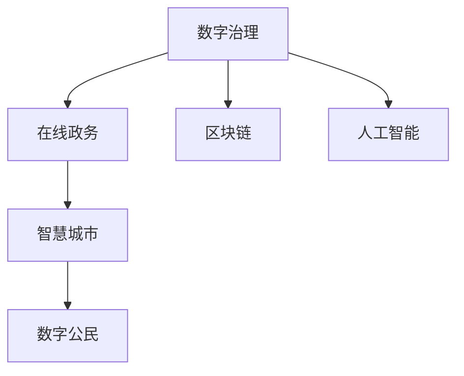

                 

# 2050年的数字治理：从在线政务到数字公民参与的数字民主实践

## 1. 背景介绍

### 1.1 问题由来

随着信息技术的飞速发展，数字治理已经成为全球各国政府治理现代化的重要方向。从传统的在线政务到如今的智慧城市，数字治理技术的应用深度和广度不断拓展，逐步向更加智能、协同、透明的方向演进。然而，尽管数字治理带来了诸多便利和效率，但仍然面临着诸多挑战，如数据孤岛、技术壁垒、隐私保护等。

### 1.2 问题核心关键点

数字治理的核心在于如何通过技术手段提升政府治理能力，实现更加高效、透明、民主的治理模式。其关键点包括：
1. 数据整合共享：打破政府部门之间的数据孤岛，实现跨部门、跨地域的协同治理。
2. 技术融合创新：将大数据、人工智能、区块链等新兴技术融入政务系统，提升治理智能化水平。
3. 公民参与互动：构建开放的在线政务平台，加强政府与公民的互动，提升政府透明度和公信力。
4. 隐私保护合规：确保个人信息安全，防止数据滥用和隐私泄露。
5. 数字化民主：通过数字技术实现更广泛的公民参与，推动政府决策民主化。

## 2. 核心概念与联系

### 2.1 核心概念概述

为更好地理解数字治理的核心概念及其联系，本节将介绍几个关键概念：

- 数字治理（Digital Governance）：利用数字技术，提升政府治理能力，实现高效、透明、民主的治理模式。
- 在线政务（E-Government）：通过互联网技术，构建电子化政务服务平台，提供便捷的公共服务。
- 智慧城市（Smart City）：利用大数据、物联网、人工智能等技术，构建城市管理、公共服务、市民生活等领域的智能化系统。
- 数字公民（Digital Citizen）：指具备数字化技能和意识，通过在线平台参与公共事务和政府决策的现代公民。
- 区块链（Blockchain）：一种去中心化的分布式账本技术，可以实现透明、安全的数据记录和共享。
- 人工智能（AI）：包括机器学习、深度学习、自然语言处理等技术，可实现智能决策、智能监管、智能服务等。

这些核心概念之间的逻辑关系可以通过以下Mermaid流程图来展示：



这个流程图展示出数字治理的核心概念及其之间的联系：

1. 数字治理是整体目标，通过在线政务、智慧城市、数字公民、区块链和人工智能等多种手段实现。
2. 在线政务是数字治理的基础，为公民提供便捷的公共服务。
3. 智慧城市通过技术创新，提升城市管理和公共服务的智能化水平。
4. 数字公民指具备数字素养的现代公民，通过在线平台参与公共事务，推动政府决策民主化。
5. 区块链和人工智能是数字治理的技术支撑，实现数据透明、安全、智能的记录和处理。

## 3. 核心算法原理 & 具体操作步骤
### 3.1 算法原理概述

数字治理的算法原理主要涉及以下几个方面：

- 数据整合共享算法：通过数据清洗、去重、标准化等技术手段，实现跨部门、跨地域的数据整合与共享。
- 智能决策算法：利用机器学习、深度学习等算法，从海量数据中提取知识，辅助政府决策。
- 区块链技术：通过分布式账本和共识机制，实现数据透明、不可篡改、可追溯的记录。
- 自然语言处理（NLP）：实现智能问答、情感分析等应用，提升在线政务服务的互动性和便捷性。

这些算法原理共同构成了数字治理的技术基础，为其高效、透明、民主的治理模式提供了有力支持。

### 3.2 算法步骤详解

数字治理的实现通常包括以下几个关键步骤：

**Step 1: 数据采集与预处理**
- 收集各类公共数据，如政府公开信息、企业运营数据、地理信息等。
- 对数据进行清洗、去重、标准化，确保数据质量。

**Step 2: 数据整合与共享**
- 设计数据共享协议和接口，实现跨部门、跨地域的数据整合与共享。
- 采用数据联邦技术，保护数据隐私和安全。

**Step 3: 智能决策支持**
- 利用机器学习、深度学习等算法，提取数据中的知识和规律，辅助政府决策。
- 构建决策模型，进行风险评估和预测分析，提升决策的科学性和准确性。

**Step 4: 区块链技术应用**
- 设计区块链网络，实现数据的透明、安全和可追溯。
- 利用智能合约技术，自动执行和记录决策过程，提高效率和透明度。

**Step 5: 自然语言处理与互动**
- 采用NLP技术，实现智能问答、情感分析等互动功能。
- 构建在线政务平台，提供便捷的公共服务和互动体验。

### 3.3 算法优缺点

数字治理的算法具有以下优点：
1. 提升治理效率：通过数据整合和智能决策，大幅提升政府治理能力。
2. 增强透明性：利用区块链和NLP技术，实现数据透明和公民参与。
3. 提升民主性：构建开放的在线政务平台，促进公民参与和民主决策。
4. 降低成本：减少传统政务的人力和纸质流程，提升资源利用效率。

同时，这些算法也存在一定的局限性：
1. 数据隐私和安全：海量数据收集和共享可能带来隐私泄露和数据滥用风险。
2. 技术复杂度：大数据、人工智能等技术需要高昂的技术成本和专业人才支持。
3. 标准化问题：不同部门和地区的数据格式和标准可能不一致，影响数据整合和共享。
4. 用户接受度：部分用户可能对数字政务服务存在技术恐惧和抵触情绪。
5. 技术依赖：过于依赖技术手段，可能导致政府治理能力的僵化和脆弱。

尽管存在这些局限性，但总体而言，数字治理的算法在提升政府治理效率、透明性和民主性方面具有显著优势。未来相关研究的重点在于如何进一步降低技术复杂度，增强数据隐私保护，提升用户接受度和满意度。

### 3.4 算法应用领域

数字治理的算法已经在多个领域得到应用，例如：

- 公共服务：通过在线政务平台，提供便捷的公共服务如医疗、教育、就业等。
- 城市管理：通过智慧城市平台，实现交通、环境、安全等领域的智能管理。
- 政策评估：利用数据分析和智能决策技术，进行政策效果评估和优化。
- 应急响应：利用大数据和人工智能技术，实现快速预警和应急响应。
- 金融监管：通过区块链和智能合约技术，提升金融监管的透明度和安全性。

这些应用场景展示了数字治理的广泛应用前景，未来将进一步拓展到更多领域，推动政府治理的现代化进程。

## 4. 数学模型和公式 & 详细讲解  
### 4.1 数学模型构建

本节将使用数学语言对数字治理的算法模型进行更加严格的刻画。

记数字治理的数据集为 $D=\{(x_i,y_i)\}_{i=1}^N$，其中 $x_i$ 为输入数据，$y_i$ 为对应的治理结果。假设数字治理的决策模型为 $M_{\theta}(x)$，其中 $\theta$ 为模型参数。

定义模型 $M_{\theta}$ 在数据样本 $(x,y)$ 上的损失函数为 $\ell(M_{\theta}(x),y)$，则在数据集 $D$ 上的经验风险为：

$$
\mathcal{L}(\theta) = \frac{1}{N} \sum_{i=1}^N \ell(M_{\theta}(x_i),y_i)
$$

其中 $\ell(\cdot,\cdot)$ 为损失函数，如均方误差、交叉熵等。

数字治理的目标是最小化经验风险，即找到最优参数：

$$
\theta^* = \mathop{\arg\min}_{\theta} \mathcal{L}(\theta)
$$

通过梯度下降等优化算法，不断更新模型参数 $\theta$，最小化损失函数 $\mathcal{L}$，得到数字治理的决策模型。

### 4.2 公式推导过程

以机器学习算法为例，假设数字治理的模型为线性回归模型，目标函数为均方误差：

$$
\ell(M_{\theta}(x),y) = \frac{1}{2} ||M_{\theta}(x) - y||^2_2
$$

其中 $||\cdot||_2$ 表示欧几里得范数。

定义经验风险：

$$
\mathcal{L}(\theta) = \frac{1}{N} \sum_{i=1}^N \ell(M_{\theta}(x_i),y_i)
$$

梯度下降算法更新参数 $\theta$：

$$
\theta \leftarrow \theta - \eta \nabla_{\theta}\mathcal{L}(\theta)
$$

其中 $\eta$ 为学习率，$\nabla_{\theta}\mathcal{L}(\theta)$ 为损失函数对参数 $\theta$ 的梯度，通过反向传播算法计算。

### 4.3 案例分析与讲解

以智慧城市交通管理为例，展示数字治理算法的应用。

假设智慧城市交通管理的目标是减少交通拥堵和事故。数据集包括历史交通流量、道路条件、天气条件、事故记录等。构建线性回归模型 $M_{\theta}(x)$ 预测未来交通拥堵情况。

数据预处理后，通过梯度下降算法优化模型参数 $\theta$，得到最小化经验风险的目标模型：

$$
\theta^* = \mathop{\arg\min}_{\theta} \mathcal{L}(\theta)
$$

最终模型输出 $M_{\theta^*}(x)$ 即可作为交通管理的决策依据。例如，根据模型预测的交通拥堵情况，可以动态调整信号灯、优化道路布局等措施，实现智慧城市交通管理的智能决策。

## 5. 项目实践：代码实例和详细解释说明
### 5.1 开发环境搭建

在进行数字治理项目实践前，我们需要准备好开发环境。以下是使用Python进行PyTorch开发的环境配置流程：

1. 安装Anaconda：从官网下载并安装Anaconda，用于创建独立的Python环境。

2. 创建并激活虚拟环境：
```bash
conda create -n pytorch-env python=3.8 
conda activate pytorch-env
```

3. 安装PyTorch：根据CUDA版本，从官网获取对应的安装命令。例如：
```bash
conda install pytorch torchvision torchaudio cudatoolkit=11.1 -c pytorch -c conda-forge
```

4. 安装TensorFlow：
```bash
pip install tensorflow
```

5. 安装各类工具包：
```bash
pip install numpy pandas scikit-learn matplotlib tqdm jupyter notebook ipython
```

完成上述步骤后，即可在`pytorch-env`环境中开始项目实践。

### 5.2 源代码详细实现

这里我们以智慧城市交通管理为例，展示使用PyTorch和TensorFlow进行数字治理项目的代码实现。

首先，定义数据处理函数：

```python
import pandas as pd
from sklearn.model_selection import train_test_split
from sklearn.preprocessing import StandardScaler

def load_data(path):
    data = pd.read_csv(path)
    features = data[['traffic_volume', 'weather', 'road_condition']]
    target = data['accident_count']
    return features, target

def preprocess_data(features, target):
    features = StandardScaler().fit_transform(features)
    features_train, features_test, target_train, target_test = train_test_split(features, target, test_size=0.2, random_state=42)
    return features_train, features_test, target_train, target_test
```

然后，定义模型和优化器：

```python
import torch
from torch import nn, optim
from tensorflow.keras.models import Sequential
from tensorflow.keras.layers import Dense, Input

class LinearRegression(nn.Module):
    def __init__(self, input_size, output_size):
        super(LinearRegression, self).__init__()
        self.linear = nn.Linear(input_size, output_size)

    def forward(self, x):
        return self.linear(x)

model = LinearRegression(input_size, output_size)
optimizer = optim.Adam(model.parameters(), lr=0.001)
```

接着，定义训练和评估函数：

```python
def train_epoch(model, features_train, target_train, optimizer):
    optimizer.zero_grad()
    outputs = model(features_train)
    loss = nn.MSELoss()(outputs, target_train)
    loss.backward()
    optimizer.step()
    return loss.item()

def evaluate(model, features_test, target_test):
    outputs = model(features_test)
    mse = nn.MSELoss()(outputs, target_test)
    return mse.item()
```

最后，启动训练流程并在测试集上评估：

```python
epochs = 100
for epoch in range(epochs):
    loss = train_epoch(model, features_train, target_train, optimizer)
    print(f"Epoch {epoch+1}, loss: {loss:.3f}")
    
test_loss = evaluate(model, features_test, target_test)
print(f"Test loss: {test_loss:.3f}")
```

以上就是使用PyTorch和TensorFlow对智慧城市交通管理进行数字治理项目的完整代码实现。可以看到，得益于这两个框架的强大功能和灵活性，我们能够较为方便地实现数字治理算法的代码实现。

### 5.3 代码解读与分析

让我们再详细解读一下关键代码的实现细节：

**load_data函数**：
- 加载数据集，从CSV文件中读取特征和目标变量。
- 将特征和目标变量分别赋值给features和target变量。

**preprocess_data函数**：
- 对特征进行标准化处理。
- 将数据集划分为训练集和测试集。
- 返回划分后的训练集和测试集的特征和目标变量。

**LinearRegression类**：
- 定义一个简单的线性回归模型。
- 包含一个线性层，将输入特征映射为输出目标。
- 使用Adam优化器更新模型参数。

**train_epoch函数**：
- 定义训练过程，包括前向传播、计算损失、反向传播和参数更新。
- 返回当前epoch的损失值。

**evaluate函数**：
- 定义评估过程，计算模型在测试集上的均方误差。
- 返回测试集的均方误差值。

**训练流程**：
- 定义总的epoch数，开始循环迭代
- 每个epoch内，先进行模型训练，输出当前epoch的损失值
- 在测试集上评估模型，输出测试集均方误差
- 重复上述过程直至所有epoch结束

可以看到，PyTorch和TensorFlow在实现数字治理算法时，都提供了丰富的工具和组件，方便开发者进行模型设计和优化。

## 6. 实际应用场景
### 6.1 智能政务系统

数字治理的智能政务系统可以广泛应用于政府内部管理和公共服务领域。传统政务系统往往存在信息孤岛、流程繁琐、服务效率低等问题。通过智能政务系统，政府可以实现跨部门、跨地域的数据整合和共享，提升公共服务的智能化水平。

在技术实现上，可以构建在线政务平台，集成各类公共服务模块，如电子证照、在线申报、在线咨询等。利用人工智能技术，对用户输入进行自然语言处理和智能推荐，提升服务效率和用户体验。

### 6.2 智慧城市治理

智慧城市是数字治理的重要应用场景，涉及城市管理的各个方面。通过智慧城市系统，可以实现智能交通、智能能源、智能安防等应用，提升城市管理效率和居民生活质量。

在技术实现上，可以构建智慧城市数据平台，整合各类数据源，实现数据共享和协同治理。利用机器学习和大数据分析技术，进行交通流量预测、能源消耗分析、环境质量监测等应用。

### 6.3 数字健康与医疗

数字治理在健康与医疗领域也有广泛应用，如电子病历、远程诊疗、健康管理等。通过数字健康与医疗系统，可以提升医疗服务效率，促进医疗资源的合理配置，提升居民健康水平。

在技术实现上，可以构建电子病历系统，整合各类医疗数据，实现医生间的信息共享和协同诊疗。利用自然语言处理技术，进行医疗咨询和智能推荐，提升医疗服务的便捷性和准确性。

### 6.4 未来应用展望

随着数字治理技术的不断发展，未来将有更多创新应用涌现，如智能应急响应、智慧教育、数字文化等，为社会治理和公共服务提供新的解决方案。

在智能应急响应方面，可以通过大数据和人工智能技术，实现快速预警和智能调度，提升灾害应对能力。在智慧教育方面，可以通过智能推荐和个性化学习，提升教育质量和公平性。在数字文化方面，可以通过数字博物馆、数字档案馆等应用，推动文化遗产的数字化保护和传承。

## 7. 工具和资源推荐
### 7.1 学习资源推荐

为了帮助开发者系统掌握数字治理的理论基础和实践技巧，这里推荐一些优质的学习资源：

1. 《智慧城市建设指南》系列书籍：详细介绍了智慧城市建设的标准和实践经验，涵盖数据采集、信息共享、智能应用等方面。

2. 《数字政府建设导则》系列文件：由国家相关部门发布，指导地方政府和企业构建数字政务系统。

3. 《人工智能与公共政策》课程：由多所大学开设的AI与政策结合的在线课程，涵盖智能治理、政策模拟等内容。

4. 《智慧城市与数字治理》国际会议论文集：汇集智慧城市和数字治理领域的最新研究成果，提供前沿知识。

5. 《区块链技术与数字治理》技术白皮书：介绍区块链技术在数字治理中的应用，提供技术参考和实践指南。

通过对这些资源的学习实践，相信你一定能够快速掌握数字治理的精髓，并用于解决实际的政府治理问题。

### 7.2 开发工具推荐

高效的开发离不开优秀的工具支持。以下是几款用于数字治理开发的常用工具：

1. PyTorch：基于Python的开源深度学习框架，灵活的计算图和丰富的模型库，适合智能政务和智慧城市系统开发。

2. TensorFlow：由Google主导开发的开源深度学习框架，强大的分布式计算能力和丰富的应用场景，适合大规模数据处理和复杂模型训练。

3. Keras：高层次的深度学习API，提供简单易用的接口，适合初学者和快速原型开发。

4. Jupyter Notebook：交互式数据科学和机器学习平台，支持多种编程语言和库，适合数据分析和模型调试。

5. Google Colab：谷歌提供的在线Jupyter Notebook环境，免费提供GPU/TPU算力，方便实验最新模型，分享学习笔记。

合理利用这些工具，可以显著提升数字治理项目的开发效率，加快创新迭代的步伐。

### 7.3 相关论文推荐

数字治理的研究源于学界的持续研究。以下是几篇奠基性的相关论文，推荐阅读：

1. "Digital Governance: A Conceptual Framework for Public Management"（数字治理的概念框架）：文章提出了数字治理的概念和应用场景，探讨了其对公共管理的影响。

2. "E-Government: A Virtual Environment for Government Processes"（在线政务：政府流程的虚拟环境）：介绍了在线政务系统的发展和应用，提供了政府流程优化的案例。

3. "Smart Cities: A Strategic Plan for Smart Governance"（智慧城市：智慧治理的战略计划）：提出智慧城市建设的标准和路径，探讨了智能城市治理的技术应用。

4. "Data Sharing in Smart Cities: Challenges and Solutions"（智慧城市的数据共享：挑战与解决方案）：分析了智慧城市数据共享的挑战和应对策略，提供了数据共享的实践经验。

5. "Blockchain for Digital Governance: A Survey"（区块链在数字治理中的应用：综述）：综述了区块链技术在数字治理中的应用，提供了技术应用的实践案例。

这些论文代表了大治理技术的发展脉络。通过学习这些前沿成果，可以帮助研究者把握学科前进方向，激发更多的创新灵感。

## 8. 总结：未来发展趋势与挑战
### 8.1 总结

本文对数字治理的理论基础和实践技巧进行了全面系统的介绍。首先阐述了数字治理在提升政府治理能力、实现高效、透明、民主治理模式方面的重要性，明确了其核心关键点，包括数据整合共享、智能决策、区块链和人工智能等技术手段。其次，从原理到实践，详细讲解了数字治理的数学模型和算法流程，给出了智慧城市交通管理的代码实例。同时，本文还广泛探讨了数字治理在智能政务、智慧城市、数字健康与医疗等多个领域的应用前景，展示了数字治理的广阔应用空间。此外，本文精选了数字治理的学习资源、开发工具和相关论文，力求为读者提供全方位的技术指引。

通过本文的系统梳理，可以看到，数字治理作为提升政府治理能力和社会治理现代化的重要手段，已经在多个领域得到了广泛应用，带来了显著的效率和透明度提升。未来，伴随数字技术的不断演进，数字治理还将拓展到更多领域，推动政府治理的现代化进程。

### 8.2 未来发展趋势

展望未来，数字治理将呈现以下几个发展趋势：

1. 数据驱动治理：通过大数据和人工智能技术，实现数据驱动的智慧治理，提升决策科学性和透明度。
2. 公民参与互动：构建开放的在线政务平台，加强政府与公民的互动，提升政府透明度和公信力。
3. 跨部门协同：打破部门间的信息孤岛，实现跨部门、跨地域的数据整合和协同治理。
4. 技术融合创新：将区块链、人工智能等新兴技术融入政务系统，提升治理智能化水平。
5. 数字化民主：通过数字技术实现更广泛的公民参与，推动政府决策民主化。
6. 隐私保护合规：确保个人信息安全，防止数据滥用和隐私泄露。

这些趋势展示了数字治理技术的未来发展方向，其不断演进将进一步提升政府治理能力和社会治理现代化水平。

### 8.3 面临的挑战

尽管数字治理技术已经取得了显著进展，但在迈向更加智能化、普适化应用的过程中，仍面临诸多挑战：

1. 数据隐私和安全：海量数据收集和共享可能带来隐私泄露和数据滥用风险。
2. 技术复杂度：大数据、人工智能等技术需要高昂的技术成本和专业人才支持。
3. 标准化问题：不同部门和地区的数据格式和标准可能不一致，影响数据整合和共享。
4. 用户接受度：部分用户可能对数字政务服务存在技术恐惧和抵触情绪。
5. 技术依赖：过于依赖技术手段，可能导致政府治理能力的僵化和脆弱。

尽管存在这些挑战，但总体而言，数字治理技术在提升政府治理效率、透明性和民主性方面具有显著优势。未来相关研究的重点在于如何进一步降低技术复杂度，增强数据隐私保护，提升用户接受度和满意度。

### 8.4 研究展望

面对数字治理面临的挑战，未来的研究需要在以下几个方面寻求新的突破：

1. 探索无监督和半监督治理方法。摆脱对大规模标注数据的依赖，利用自监督学习、主动学习等无监督和半监督范式，最大限度利用非结构化数据，实现更加灵活高效的治理。
2. 研究参数高效和计算高效的治理范式。开发更加参数高效的治理方法，在固定大部分预训练参数的同时，只更新极少量的治理相关参数。同时优化治理模型的计算图，减少前向传播和反向传播的资源消耗，实现更加轻量级、实时性的部署。
3. 融合因果和对比学习范式。通过引入因果推断和对比学习思想，增强治理模型建立稳定因果关系的能力，学习更加普适、鲁棒的语言表征，从而提升模型泛化性和抗干扰能力。
4. 引入更多先验知识。将符号化的先验知识，如知识图谱、逻辑规则等，与神经网络模型进行巧妙融合，引导治理过程学习更准确、合理的语言模型。同时加强不同模态数据的整合，实现视觉、语音等多模态信息与文本信息的协同建模。
5. 结合因果分析和博弈论工具。将因果分析方法引入治理模型，识别出模型决策的关键特征，增强输出解释的因果性和逻辑性。借助博弈论工具刻画人机交互过程，主动探索并规避治理模型的脆弱点，提高系统稳定性。
6. 纳入伦理道德约束。在治理模型训练目标中引入伦理导向的评估指标，过滤和惩罚有害的输出倾向。同时加强人工干预和审核，建立治理行为的监管机制，确保输出符合人类价值观和伦理道德。

这些研究方向的探索，必将引领数字治理技术迈向更高的台阶，为构建安全、可靠、可解释、可控的智能系统铺平道路。面向未来，数字治理技术还需要与其他人工智能技术进行更深入的融合，如知识表示、因果推理、强化学习等，多路径协同发力，共同推动社会治理的现代化进程。只有勇于创新、敢于突破，才能不断拓展治理模型的边界，让智能技术更好地造福人类社会。

## 9. 附录：常见问题与解答

**Q1：数字治理是否适用于所有公共服务领域？**

A: 数字治理技术在大多数公共服务领域都有应用潜力，但需要结合具体场景进行优化。对于涉及隐私和安全要求较高的领域，如司法、医疗等，需要特别注意数据隐私保护和合规性。而对于一些技术难度较大的领域，如精准农业、智能制造等，数字治理技术还需要更多的研究和实践探索。

**Q2：数字治理技术是否能够提升治理效率和透明性？**

A: 数字治理技术通过数据整合和智能决策，可以实现高效、透明、民主的治理模式。例如，通过智慧政务系统，可以实现跨部门协同和数据共享，提升公共服务效率和透明度。利用区块链和人工智能技术，实现数据透明和智能监管，提升治理的公平性和可信度。

**Q3：数字治理过程中需要注意哪些数据隐私和安全问题？**

A: 数字治理过程中，数据隐私和安全问题尤为重要。需要采取以下措施：
1. 数据匿名化：对敏感数据进行去标识化处理，保护个人隐私。
2. 数据加密：采用数据加密技术，防止数据泄露和篡改。
3. 访问控制：设计严格的数据访问权限，确保数据访问的安全性。
4. 审计和监控：建立数据使用日志，定期进行审计和监控，及时发现和应对数据安全威胁。

**Q4：数字治理的实施是否需要大量的资金和技术投入？**

A: 数字治理的实施确实需要大量的资金和技术投入，包括基础设施建设、技术研发和人才培养等。但对于政府而言，投入数字治理是一种长期的战略投资，有助于提升政府治理能力和社会治理现代化水平，具有显著的社会和经济效益。

**Q5：数字治理如何平衡技术创新与治理风险？**

A: 数字治理需要在技术创新和治理风险之间寻找平衡。具体措施包括：
1. 引入多学科协作：结合信息技术与公共管理、社会科学等领域的专家，共同进行治理方案设计。
2. 进行风险评估：在治理方案实施前，进行风险评估和预案制定，减少治理风险。
3. 逐步推进：分阶段实施治理方案，逐步优化和完善，确保治理效果的稳定性和可靠性。
4. 加强用户教育：通过宣传和培训，提升公众对数字治理的认识和接受度，减少技术恐惧和抵触情绪。

总之，数字治理技术需要在技术创新与治理风险之间寻求平衡，通过多学科协作和逐步推进，确保治理方案的有效性和可持续性。

---

作者：禅与计算机程序设计艺术 / Zen and the Art of Computer Programming

