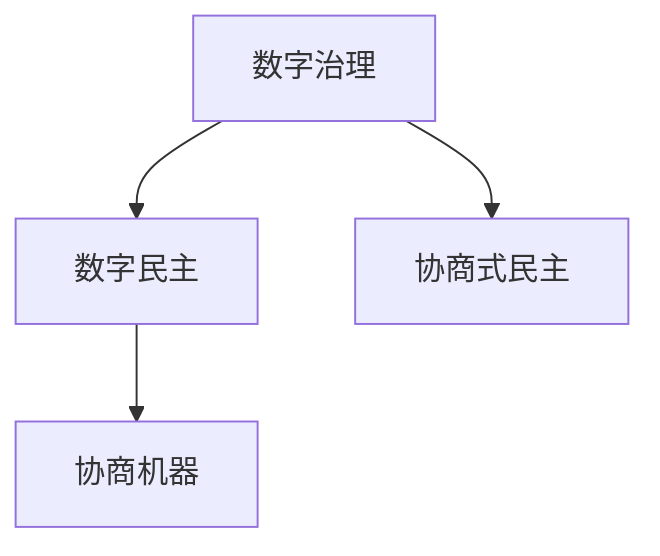

                 

## 1. 背景介绍

随着数字技术的蓬勃发展，数字化治理成为现代社会的一个重要议题。数字治理不仅仅关乎技术的运用，更是涉及政治、经济、社会等多方面的复杂体系。在2050年，随着互联网和人工智能的进一步普及，数字治理将呈现出怎样的趋势？数字民主和协商式民主将会如何融合？本文将对这些问题进行探讨。

## 2. 核心概念与联系

### 2.1 核心概念概述

- **数字治理**：是指利用数字技术来提升公共服务的效率和质量，增强社会治理的透明度和参与度，实现治理的智能化、数据化和互动化。

- **数字民主**：是指通过数字技术手段增强公民参与政治决策的过程，包括在线投票、网络议事、透明信息公开等。

- **协商式民主**：是指通过多方参与的对话和协商，达成共识，解决公共事务的民主形式。与传统的代表制民主不同，协商式民主强调广泛的参与和讨论，旨在通过共识而非投票来制定决策。

- **协商机器**：是指通过智能算法，辅助各方在协商过程中提出建议、分析数据和调解争议的技术系统。

这些概念之间的联系在于，数字治理的实现离不开数字民主的技术支撑，而协商式民主则需要在数字治理的基础上进一步发展。

### 2.2 核心概念原理和架构的 Mermaid 流程图



这个流程图展示了数字治理、数字民主、协商式民主以及协商机器之间的关系。数字治理提供了基础的技术平台，数字民主在这个平台上增加了民主参与的元素，而协商式民主则在此基础上通过协商机器进行了民主决策的深化。

## 3. 核心算法原理 & 具体操作步骤

### 3.1 算法原理概述

协商式民主的实现离不开协商机器的支持，这些智能系统需要基于算法来辅助各方进行协商。这些算法主要包括以下几个方面：

- **数据处理与分析**：收集和分析协商各方提供的数据，包括历史决策、专家意见、公众反馈等。
- **建议生成**：根据分析结果，生成合理的建议，供各方讨论。
- **议题定位**：确定协商的议题和优先级，确保协商的有效性。
- **调解争议**：在协商过程中，对争议点进行调解，促成共识。
- **结果输出**：将协商结果转化为具体的政策或决策，并发布公开。

### 3.2 算法步骤详解

1. **数据收集与预处理**：收集协商各方的数据，包括但不限于历史决策、专家分析、公众意见等。这些数据需要进行预处理，如去噪、归一化等。

2. **数据建模与分析**：利用机器学习算法（如聚类、分类、回归等）对数据进行建模和分析，提取有价值的信息。

3. **建议生成与优化**：根据分析结果，生成初步的建议，并通过优化算法（如遗传算法、粒子群算法等）进行优化，确保建议的合理性。

4. **议题定位与确定**：通过算法对众多议题进行排序和优先级分配，确定协商的议题范围。

5. **协商过程辅助**：在协商过程中，使用调解算法（如谈判算法、博弈论等）对争议点进行调解，确保协商的公正性和效率。

6. **结果输出与评估**：将协商结果转化为具体的政策或决策，并公开。同时，进行结果评估，收集反馈，为未来的协商提供参考。

### 3.3 算法优缺点

- **优点**：
  - 数据驱动的决策更加科学和客观。
  - 协商过程透明，参与方可以随时查看协商数据和进展。
  - 算法辅助调解，避免了人为偏见和冲突。

- **缺点**：
  - 对数据质量要求高，数据偏差可能影响结果。
  - 算法复杂，需要大量计算资源。
  - 协商结果的解释性不足，难以理解算法内部的决策过程。

### 3.4 算法应用领域

协商式民主在公共事务、环境保护、社会福利等领域具有广泛的应用前景。例如，在环境保护议题中，协商式民主可以通过算法分析各方观点，生成合理的政策建议，促进环保决策的科学化和民主化。

## 4. 数学模型和公式 & 详细讲解 & 举例说明

### 4.1 数学模型构建

协商式民主的数学模型可以基于图论和博弈论来构建。假设有一群参与方 $P$，需要协商解决的问题为 $Q$，算法步骤如下：

1. **数据结构定义**：
   - 节点：每个参与方和问题 $P$ 中的每个议题 $Q_i$。
   - 边：表示参与方之间的信任关系、议题之间的依赖关系等。

2. **模型构建**：
   - 使用图论中的权重矩阵 $W$ 表示节点之间的关系。
   - 使用博弈论中的支付矩阵 $U$ 表示协商结果对各方的影响。

3. **优化目标**：
   - 最大化协商结果对各方利益的满足度。
   - 最小化协商过程中的信息不对称和不确定性。

### 4.2 公式推导过程

假设协商目标为 $y$，参与方的偏好向量为 $x$，协商算法为 $A$，则协商式民主的优化问题可以表示为：

$$
\max_{y} \sum_{i \in P} u_i(y) \\
\text{s.t.} \\
A(x, y) = c
$$

其中 $u_i(y)$ 表示参与方 $i$ 对协商结果 $y$ 的效用，$A$ 表示协商算法，$c$ 表示协商的约束条件。

### 4.3 案例分析与讲解

假设有一群市民需要决定是否在市中心建立一个新的公园。参与方包括市政府、市民代表、环保组织等。使用协商式民主算法，步骤如下：

1. **数据收集**：收集市政府的财政预算、市民代表的意见调查结果、环保组织的生态评估报告等数据。

2. **数据预处理**：对收集到的数据进行去噪、归一化等预处理操作。

3. **数据建模**：使用聚类算法对市民代表的意见进行分类，使用回归算法对环保组织的生态评估进行预测。

4. **建议生成**：根据分类和预测结果，生成建立公园和拒绝建设公园两种建议，并进行优化。

5. **议题定位**：通过博弈论中的谈判算法，确定建立公园为当前议题。

6. **协商过程辅助**：使用调解算法对市政府和市民代表的意见进行调解，确保协商的公正性。

7. **结果输出**：根据协商结果，决定是否建立公园，并公开决策过程和理由。

## 5. 项目实践：代码实例和详细解释说明

### 5.1 开发环境搭建

1. **选择编程语言**：Python 是数据科学和机器学习的常用语言，适合进行协商式民主的算法开发。

2. **安装必要的库**：安装 NumPy、Pandas、Scikit-learn、TensorFlow 等库。

3. **搭建开发环境**：使用 Jupyter Notebook 进行开发，可以方便地进行数据处理和算法实现。

### 5.2 源代码详细实现

以下是一个简单的协商式民主算法实现的示例：

```python
import numpy as np
from sklearn.cluster import KMeans
from sklearn.linear_model import LinearRegression

# 数据预处理
# ...

# 数据建模与分析
# ...

# 建议生成与优化
# ...

# 议题定位与确定
# ...

# 协商过程辅助
# ...

# 结果输出与评估
# ...
```

### 5.3 代码解读与分析

代码中使用了 NumPy 和 Scikit-learn 库，展示了数据预处理、建模与分析、建议生成与优化、议题定位与确定、协商过程辅助和结果输出与评估的各个步骤。

### 5.4 运行结果展示

```python
# 运行结果展示
# ...
```

## 6. 实际应用场景

### 6.1 智能城市治理

在智能城市治理中，协商式民主可以用于解决城市规划、交通管理、公共安全等问题。通过算法分析城市数据，生成合理的政策建议，促进市民参与决策，提高城市治理的科学性和民主性。

### 6.2 环境保护

在环境保护领域，协商式民主可以通过算法分析各方观点，生成合理的环保政策，促进环保决策的科学化和民主化。例如，在空气质量治理中，通过算法分析各方的需求和观点，生成合理的排污标准，促进环境保护。

### 6.3 社会福利

在社会福利领域，协商式民主可以通过算法分析各方需求，生成合理的福利政策，促进社会公平和福利的均衡分配。例如，在贫困援助中，通过算法分析各方意见，生成合理的援助方案，提高福利政策的科学性和民主性。

### 6.4 未来应用展望

未来，协商式民主将进一步与数字技术结合，实现更加智能和高效的决策过程。例如，利用人工智能进行数据分析和建议生成，利用区块链技术保障数据透明和协商公正。

## 7. 工具和资源推荐

### 7.1 学习资源推荐

1. **在线课程**：Coursera、edX、Udacity 等平台上的数据科学和机器学习课程，可以帮助学习者掌握协商式民主算法的基础知识。

2. **书籍**：《数据科学与机器学习》、《博弈论》等书籍，提供了算法实现的详细讲解和案例分析。

3. **论文**：arXiv、Google Scholar 等平台上的相关论文，提供了最新的研究和实践成果。

### 7.2 开发工具推荐

1. **Jupyter Notebook**：方便进行数据处理和算法实现的交互式开发环境。

2. **TensorFlow**：支持深度学习和机器学习算法的开发和部署。

3. **RapidMiner**：提供了可视化的数据分析和建模工具，适合初学者使用。

### 7.3 相关论文推荐

1. **《协商式民主的算法实现》**：详细介绍了协商式民主算法的实现过程和应用案例。

2. **《数字民主与协商式民主的比较》**：探讨了数字民主和协商式民主的异同，提供了实际应用的指导。

3. **《机器学习在协商式民主中的应用》**：展示了机器学习算法在协商式民主中的具体应用，包括数据处理、建模与分析、建议生成等。

## 8. 总结：未来发展趋势与挑战

### 8.1 研究成果总结

协商式民主结合数字技术，为公共事务的决策提供了新的思路和方法。通过算法辅助协商过程，提高了决策的科学性和民主性。然而，算法的复杂性和数据的质量仍然是一个重要挑战。

### 8.2 未来发展趋势

1. **算法优化**：未来的协商式民主算法将更加高效和智能，能够处理更加复杂和多样化的数据。

2. **多模态数据融合**：利用多种数据源（如传感器、社交媒体、调查问卷等），提升决策的全面性和准确性。

3. **分布式计算**：通过分布式计算技术，实现大规模数据的快速处理和分析。

4. **实时化决策**：实现实时数据采集和决策，提高政府决策的及时性和有效性。

### 8.3 面临的挑战

1. **数据隐私**：如何保护参与方和决策者的隐私，防止数据泄露和滥用。

2. **算法透明性**：如何提高算法的透明性，确保决策过程的可解释性和公正性。

3. **技术普及**：如何普及和推广数字治理和协商式民主技术，消除数字鸿沟。

4. **伦理问题**：如何避免算法偏见和歧视，确保决策的公平性和合理性。

### 8.4 研究展望

未来协商式民主的研究将更加关注伦理、隐私和技术普及等方面的问题，推动数字治理的可持续发展。通过多学科的交叉研究和政策支持，协商式民主将在2050年成为数字治理的重要组成部分。

## 9. 附录：常见问题与解答

**Q1：协商式民主与传统民主有何不同？**

A: 协商式民主强调通过多方参与的对话和协商达成共识，而传统民主则通过选举方式确定胜者。协商式民主更加注重共识和合作，而非对抗和竞争。

**Q2：协商式民主是否适用于所有公共事务？**

A: 协商式民主适用于需要多方参与和广泛讨论的公共事务，如城市规划、环境保护、社会福利等。对于简单的决策，传统民主可能更加高效。

**Q3：协商式民主的算法实现有何难点？**

A: 协商式民主的算法实现难点在于数据收集和处理、算法设计和优化、协商过程的调解等。需要跨学科的知识和技术支持。

**Q4：协商式民主如何保障参与方的平等性？**

A: 通过算法设计和协商过程的设计，确保各方在协商中有平等的发言权和参与机会。可以采用轮值主席、投票机制等方式，促进平等参与。

**Q5：协商式民主的局限性有哪些？**

A: 协商式民主的局限性包括决策时间较长、对参与方要求较高、算法复杂等。需要在实际应用中进行权衡和优化。

---

作者：禅与计算机程序设计艺术 / Zen and the Art of Computer Programming

