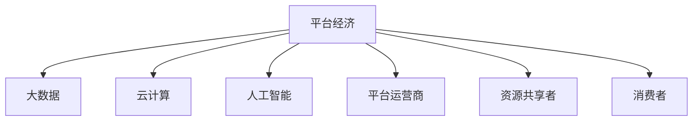

                 

# 2050年的数字经济：从平台经济到共享经济的商业模式创新

## 1. 背景介绍

### 1.1 问题由来

随着数字经济的迅速发展，平台经济成为主导全球经济增长的重要力量。然而，平台经济的弊端也日益凸显，如市场垄断、数据隐私、劳资剥削等问题。这些问题不仅引发了社会的不满，也导致政策层面的监管压力不断加大。

同时，共享经济的崛起带来了新的发展契机，它打破了传统的所有权模式，将闲置资源通过共享和交换的方式进行优化配置，有助于提高资源利用效率，缓解环境压力，促进社会公平。共享经济的发展，为数字经济提供了新的发展路径。

### 1.2 问题核心关键点

平台经济和共享经济的本质区别在于资源分配的方式和所有权的处理。平台经济基于市场垄断，通过集中资源，形成规模效应和网络效应，获得巨大利润。而共享经济则通过分散化资源的共享，以更小的成本获得更高效率的资源配置。

在技术层面，两种模式都基于大数据、云计算、人工智能等现代技术，但应用场景和商业模式有显著差异。平台经济多应用于消费品、服务市场等具有公共品特性的领域，如电商、交通、餐饮等。而共享经济则更多应用于具有个人化、服务化特征的领域，如出行、住宿、教育等。

### 1.3 问题研究意义

探讨从平台经济到共享经济的商业模式创新，有助于优化资源分配，提升经济效率，促进社会公平，为2050年的数字经济提供新的增长引擎。

本文聚焦于平台经济与共享经济模式的区别与联系，分析其商业模式创新路径，探索未来发展趋势，为行业发展提供理论指导和实践建议。

## 2. 核心概念与联系

### 2.1 核心概念概述

为更好地理解数字经济中平台经济与共享经济的商业模式创新，本节将介绍几个密切相关的核心概念：

- 平台经济(Platform Economy)：基于数字技术的市场，以中心化平台为载体，连接买卖双方，通过集中资源获取规模效应和网络效应，实现价值创造。

- 共享经济(Sharing Economy)：通过分散化资源的共享和交换，最大化资源利用率，降低交易成本，促进公平和可持续性，提升经济效益。

- 大数据(Big Data)：海量的、多维度、多结构的数据集，为决策提供依据，优化资源配置，实现精细化管理。

- 云计算(Cloud Computing)：通过互联网提供可扩展的计算和存储资源，实现资源的按需分配和灵活配置。

- 人工智能(Artificial Intelligence)：基于算法和大数据的智能系统，提供自动化、智能化的决策支持，提升效率和服务质量。

- 平台运营商(Platform Operator)：提供市场交易的第三方平台，通过数据、算法和技术手段，优化交易过程，实现利润最大化。

- 资源共享者(Resource Sharer)：提供闲置资源参与共享经济的个体或企业，通过共享获得额外收益。

- 消费者(Consumer)：获取服务的个体，根据自身需求选择资源和服务，实现价值交换。

这些概念之间的逻辑关系可以通过以下Mermaid流程图来展示：



这个流程图展示了大平台经济与共享经济的主要组成和关键元素。

## 3. 核心算法原理 & 具体操作步骤

### 3.1 算法原理概述

平台经济与共享经济的主要商业模式创新在于资源配置的优化与交易效率的提升。其核心算法原理包括以下几个方面：

1. **市场匹配算法(Market Matching Algorithm)**：通过数据分析和机器学习算法，优化交易匹配过程，提高资源配置效率。

2. **动态定价算法(Dynamic Pricing Algorithm)**：根据市场供需关系和资源特性，动态调整价格，实现资源最优配置。

3. **推荐系统(Recommendation System)**：利用大数据和算法推荐，提高用户满意度和服务体验。

4. **需求预测算法(Demand Forecasting Algorithm)**：通过历史数据分析，预测资源需求变化，优化资源供给策略。

5. **优化算法(Optimization Algorithm)**：采用运筹学和算法优化，提升平台运营效率和盈利能力。

### 3.2 算法步骤详解

基于平台经济与共享经济的商业模式创新，其算法步骤大致包括以下几个环节：

**Step 1: 数据收集与处理**

- 收集用户行为数据、交易数据、市场供需数据等，进行数据清洗和预处理。

**Step 2: 模型训练与优化**

- 构建市场匹配、动态定价、推荐系统、需求预测等模型，并进行训练和参数优化。

**Step 3: 模型部署与应用**

- 将优化后的模型部署到平台，实现实时资源配置、动态定价、个性化推荐等应用。

**Step 4: 反馈与迭代**

- 根据用户反馈和市场变化，不断调整模型参数和算法策略，提升平台性能和服务质量。

### 3.3 算法优缺点

平台经济与共享经济的商业模式创新算法具有以下优点：

1. 提高资源配置效率：通过大数据和算法优化，实现资源的最优匹配和动态定价，提高资源利用率。

2. 提升交易效率：通过智能推荐和需求预测，减少搜索和等待时间，提高交易速度。

3. 增强用户体验：通过个性化推荐和动态定价，提供更符合用户需求的服务，提升满意度。

4. 优化运营成本：通过智能运筹和算法优化，降低运营成本，提升盈利能力。

同时，这些算法也存在一些局限性：

1. 数据隐私问题：大量用户数据的收集和处理，可能引发数据隐私和安全问题。

2. 算法偏见：算法模型可能存在数据偏见和算法偏见，影响公平性。

3. 计算资源消耗：复杂算法需要大量的计算资源，可能面临计算成本高昂的问题。

4. 用户接受度：部分用户对算法推荐和动态定价可能存在抵触情绪。

### 3.4 算法应用领域

平台经济与共享经济的商业模式创新算法在多个领域得到了广泛应用：

1. 电商领域：通过智能推荐和动态定价，提升用户购买体验，优化库存管理。

2. 出行领域：通过智能匹配和动态定价，优化资源分配，提升出行效率。

3. 住宿领域：通过智能匹配和需求预测，优化房间配置，提高用户体验。

4. 医疗领域：通过智能推荐和需求预测，优化医疗资源配置，提高服务质量。

5. 教育领域：通过智能推荐和需求预测，优化课程推荐，提升教育效果。

6. 金融领域：通过智能推荐和动态定价，优化资产配置，提高金融服务效率。

## 4. 数学模型和公式 & 详细讲解

### 4.1 数学模型构建

平台经济与共享经济的主要算法模型包括：

1. **线性回归模型(Linear Regression Model)**：用于需求预测和市场匹配。

2. **决策树模型(Decision Tree Model)**：用于智能推荐和需求预测。

3. **随机森林模型(Random Forest Model)**：用于需求预测和智能推荐。

4. **协同过滤推荐算法(Collaborative Filtering Recommendation Algorithm)**：用于个性化推荐。

5. **深度学习模型(Deep Learning Model)**：用于动态定价和市场匹配。

### 4.2 公式推导过程

以线性回归模型为例，其基本公式为：

$$
y = \beta_0 + \beta_1x_1 + \beta_2x_2 + \ldots + \beta_nx_n + \epsilon
$$

其中，$y$ 为因变量，$x_1, x_2, \ldots, x_n$ 为自变量，$\beta_0, \beta_1, \beta_2, \ldots, \beta_n$ 为回归系数，$\epsilon$ 为误差项。

线性回归模型通过最小化误差平方和，求解回归系数：

$$
\beta = \mathop{\arg\min}_{\beta} \sum_{i=1}^N (y_i - \hat{y}_i)^2
$$

其中，$\hat{y}_i = \beta_0 + \beta_1x_{i1} + \beta_2x_{i2} + \ldots + \beta_nx_{in}$ 为预测值。

### 4.3 案例分析与讲解

以出行领域为例，假设有一家共享单车平台，通过收集用户骑行记录、天气、时间、季节等因素，使用线性回归模型预测需求量。模型训练后，可以将预测结果作为动态定价的基础，实现资源的最优配置。

## 5. 项目实践：代码实例和详细解释说明

### 5.1 开发环境搭建

在进行平台经济与共享经济的商业模式创新算法开发前，我们需要准备好开发环境。以下是使用Python进行Scikit-learn开发的环境配置流程：

1. 安装Anaconda：从官网下载并安装Anaconda，用于创建独立的Python环境。

2. 创建并激活虚拟环境：
```bash
conda create -n sklearn-env python=3.8 
conda activate sklearn-env
```

3. 安装Scikit-learn：
```bash
pip install scikit-learn
```

4. 安装各类工具包：
```bash
pip install numpy pandas scikit-learn matplotlib tqdm jupyter notebook ipython
```

完成上述步骤后，即可在`sklearn-env`环境中开始算法开发实践。

### 5.2 源代码详细实现

这里我们以线性回归模型为例，给出使用Scikit-learn对出行需求进行预测的Python代码实现。

首先，定义需求预测函数：

```python
from sklearn.linear_model import LinearRegression
from sklearn.metrics import mean_squared_error
import pandas as pd

def linear_regression_fit(X, y):
    model = LinearRegression()
    model.fit(X, y)
    return model

def linear_regression_predict(model, X_test):
    y_pred = model.predict(X_test)
    mse = mean_squared_error(y_test, y_pred)
    print(f"MSE: {mse:.3f}")
    return y_pred
```

然后，定义数据处理函数：

```python
def load_data(path):
    data = pd.read_csv(path)
    X = data[['time', 'weather', 'season', 'temperature']]
    y = data['demand']
    return X, y

def split_data(X, y, test_size=0.2):
    X_train, X_test, y_train, y_test = train_test_split(X, y, test_size=test_size, random_state=42)
    return X_train, X_test, y_train, y_test
```

接着，加载数据并训练模型：

```python
X, y = load_data('data.csv')
X_train, X_test, y_train, y_test = split_data(X, y)

model = linear_regression_fit(X_train, y_train)

y_pred = linear_regression_predict(model, X_test)
```

最后，在测试集上评估模型效果：

```python
mse = mean_squared_error(y_test, y_pred)
print(f"MSE: {mse:.3f}")
```

以上就是使用Scikit-learn对出行需求进行线性回归模型预测的完整代码实现。可以看到，Scikit-learn封装了线性回归模型，开发者只需调用函数即可实现需求预测。

### 5.3 代码解读与分析

让我们再详细解读一下关键代码的实现细节：

**load_data函数**：
- 使用Pandas库加载数据文件，并定义输入和输出变量。

**split_data函数**：
- 使用Scikit-learn的train_test_split函数，将数据集分为训练集和测试集，并进行标准化处理。

**linear_regression_fit函数**：
- 使用Scikit-learn的LinearRegression模型，对训练集进行线性回归训练，返回模型对象。

**linear_regression_predict函数**：
- 使用训练好的模型，对测试集进行预测，并计算预测误差的均方根误差(MSE)。

**主函数**：
- 依次调用数据加载、模型训练和预测等函数，并输出预测结果和误差评估。

可以看到，Scikit-learn大大简化了线性回归模型的开发流程，使算法实现更加简便。开发者可以将更多精力放在模型评估和优化上，而不必过多关注底层实现细节。

## 6. 实际应用场景

### 6.1 智能出行平台

基于平台经济与共享经济的商业模式创新算法，智能出行平台可以为用户提供实时、动态的出行解决方案。通过大数据和算法优化，平台能够根据用户需求和实时路况，推荐最优出行方式和路线，提高出行效率。

在技术实现上，平台可以收集用户出行历史数据、交通流量、天气状况等信息，构建线性回归和决策树模型，实现需求预测和智能推荐。同时，平台可以引入智能调度和动态定价算法，优化资源配置，提升用户体验。

### 6.2 共享住宿平台

共享住宿平台通过资源共享，为用户提供更便捷、更经济的住宿选择。平台可以基于用户历史行为数据、地理位置、时间等因素，使用协同过滤推荐算法，推荐最符合用户需求的房源。

在技术实现上，平台可以收集用户行为数据、房源信息、价格变化等数据，构建协同过滤和深度学习模型，实现个性化推荐和动态定价。同时，平台可以引入需求预测算法，优化房源配置，提高资源利用率。

### 6.3 在线教育平台

在线教育平台通过资源共享，为用户提供更个性化、更高效的教育服务。平台可以基于用户学习历史、偏好、评分等因素，使用推荐系统算法，推荐最适合的教育资源和课程。

在技术实现上，平台可以收集用户学习数据、课程评价、学习进度等数据，构建协同过滤和深度学习模型，实现个性化推荐和动态定价。同时，平台可以引入智能调度和需求预测算法，优化课程推荐和资源配置，提高用户满意度。

## 7. 工具和资源推荐

### 7.1 学习资源推荐

为了帮助开发者系统掌握平台经济与共享经济的商业模式创新算法，这里推荐一些优质的学习资源：

1. 《Python数据分析实战》系列博文：由数据科学家撰写，深入浅出地介绍了Python数据分析和机器学习库，如Pandas、Scikit-learn等，是入门数据分析的好资源。

2. 《机器学习实战》书籍：清华大学出版社出版的经典机器学习教材，涵盖线性回归、决策树、随机森林等多种算法，适合初学者和进阶者。

3. 《深度学习与自然语言处理》课程：斯坦福大学开设的深度学习课程，内容涵盖深度学习基础和NLP应用，提供了丰富的实践代码和案例。

4. Kaggle竞赛平台：全球最大的数据科学竞赛平台，提供海量数据集和算法竞赛，是锻炼算法能力的好地方。

5. GitHub开源项目：开源社区提供了大量优秀的算法实现和案例代码，开发者可以从中学习和借鉴。

通过对这些资源的学习实践，相信你一定能够快速掌握平台经济与共享经济的商业模式创新算法，并用于解决实际的业务问题。

### 7.2 开发工具推荐

高效的开发离不开优秀的工具支持。以下是几款用于平台经济与共享经济算法开发的常用工具：

1. Python：Python语言以其简洁、易读、易学的特点，成为数据科学和机器学习领域的主流语言，适合算法开发和数据分析。

2. Scikit-learn：基于Python的机器学习库，提供了丰富的算法实现，包括线性回归、决策树、协同过滤等多种算法，是数据科学家的必备工具。

3. TensorFlow：由Google主导开发的深度学习框架，功能强大、性能优异，适合大规模算法开发和部署。

4. PyTorch：由Facebook开发的深度学习框架，灵活、高效、易用，支持动态计算图，适合研究者和工程师。

5. Jupyter Notebook：交互式的编程环境，支持Python、R等多种语言，适合数据科学家的实验开发和报告展示。

6. Weights & Biases：模型训练的实验跟踪工具，可以记录和可视化模型训练过程中的各项指标，方便对比和调优。

7. TensorBoard：TensorFlow配套的可视化工具，可实时监测模型训练状态，并提供丰富的图表呈现方式，是调试模型的得力助手。

合理利用这些工具，可以显著提升平台经济与共享经济算法开发的效率，加快创新迭代的步伐。

### 7.3 相关论文推荐

平台经济与共享经济的商业模式创新算法在学界得到了广泛研究，以下是几篇奠基性的相关论文，推荐阅读：

1. Adaptive Boosting (AdaBoost)：提出了一种基于加权平均的集成学习算法，在提升模型准确率的同时，减少对计算资源的消耗。

2. k-Nearest Neighbor (k-NN)：提出了一种基于邻居距离的分类算法，具有简单、易于实现的特点，适用于小规模数据集。

3. Random Forest (RF)：提出了一种基于决策树的集成学习算法，具有高准确率、鲁棒性强等特点，适用于高维数据集。

4. Stochastic Gradient Descent (SGD)：提出了一种基于梯度下降的优化算法，具有计算高效、灵活调整等特点，适用于大规模数据集。

5. Collaborative Filtering (CF)：提出了一种基于用户行为和物品属性的推荐算法，具有高准确率、个性化强等特点，适用于在线推荐系统。

6. Deep Learning for Recommendation Systems：提出了一种基于神经网络的推荐算法，具有高准确率、自适应性强等特点，适用于复杂推荐场景。

这些论文代表了大平台经济与共享经济的商业模式创新算法的发展脉络。通过学习这些前沿成果，可以帮助研究者把握学科前进方向，激发更多的创新灵感。

## 8. 总结：未来发展趋势与挑战

### 8.1 总结

本文对平台经济与共享经济的商业模式创新算法进行了全面系统的介绍。首先阐述了平台经济与共享经济的基本概念和主要差异，明确了商业模式创新的关键点。其次，从原理到实践，详细讲解了算法的构建和实现流程，给出了实际应用场景的代码实例。同时，本文还广泛探讨了算法在多个行业领域的应用前景，展示了商业模式创新的广阔前景。

通过本文的系统梳理，可以看到，平台经济与共享经济的商业模式创新算法在大规模数据和复杂算法的支持下，已经广泛应用于多个行业，为数字经济的发展提供了强有力的支持。未来，伴随算法的不断演进和技术的持续创新，平台经济与共享经济将实现更高效、更公平、更可持续的资源配置，为2050年的数字经济带来新的增长动力。

### 8.2 未来发展趋势

展望未来，平台经济与共享经济的商业模式创新算法将呈现以下几个发展趋势：

1. 算法复杂度提升：随着数据量的增加和应用场景的复杂化，算法模型将变得更加复杂，性能和准确率将进一步提升。

2. 跨领域融合：算法将在多个领域进行跨领域融合，实现更高效、更智能的资源配置和业务优化。

3. 实时性和响应性增强：算法的实时性和响应性将进一步提升，实现更快速、更精准的服务提供。

4. 智能化和自动化水平提高：算法的智能化和自动化水平将进一步提高，实现更智能、更自动化的业务决策。

5. 用户个性化需求满足：算法将更注重用户个性化需求的满足，实现更精准、更个性化的服务推荐。

6. 算法的可解释性和透明度增强：算法将更注重其可解释性和透明度，减少用户对算法的抵触情绪。

以上趋势凸显了平台经济与共享经济的商业模式创新算法的广阔前景。这些方向的探索发展，必将进一步提升数字经济的效率和效益，为社会带来更大的福祉。

### 8.3 面临的挑战

尽管平台经济与共享经济的商业模式创新算法已经取得了显著进展，但在迈向更加智能化、普适化应用的过程中，仍面临诸多挑战：

1. 数据隐私和安全问题：平台经济与共享经济的数据处理和算法优化，可能涉及大量用户隐私数据，如何保护数据隐私和安全，是重要的问题。

2. 算法偏见和公平性：算法模型可能存在数据偏见和算法偏见，导致服务不平等，如何消除偏见，确保算法公平，是重要的问题。

3. 计算资源消耗：复杂算法需要大量的计算资源，如何降低计算成本，提高算法的可扩展性，是重要的问题。

4. 用户接受度和参与度：用户对算法推荐和动态定价可能存在抵触情绪，如何提高用户接受度和参与度，是重要的问题。

5. 监管和合规问题：算法模型的使用可能引发政策监管问题，如何合规使用算法，避免法律风险，是重要的问题。

6. 算法效果和业务效果的一致性：算法模型的效果可能与业务效果不一致，如何提升算法效果，实现业务目标，是重要的问题。

以上挑战凸显了平台经济与共享经济的商业模式创新算法的发展路径，需要在数据、算法、用户、监管等各方面进行全面优化和协调，才能实现更高效、更公平、更可持续的资源配置和业务优化。

### 8.4 研究展望

面向未来，平台经济与共享经济的商业模式创新算法的研究展望如下：

1. 探索跨领域算法融合：将不同领域的算法进行跨领域融合，实现更高效的资源配置和业务优化。

2. 研究用户参与机制：设计用户参与机制，提升用户对算法的信任和接受度，实现更公平、更可持续的资源配置。

3. 发展智能推荐系统：基于深度学习和大数据，发展更智能、更精准的推荐系统，实现更个性化的服务推荐。

4. 提升算法可解释性和透明度：设计更可解释、更透明的算法模型，提升用户对算法的理解和信任。

5. 实现业务与算法的协同优化：设计业务与算法协同优化的机制，实现更高效、更智能的业务决策。

6. 推动数据隐私和安全研究：推动数据隐私和安全技术的研发，确保用户数据的安全性和隐私性。

通过这些研究方向的研究和探索，相信平台经济与共享经济的商业模式创新算法将迈向更高的台阶，为数字经济的发展提供更强大的技术支撑。

## 9. 附录：常见问题与解答

**Q1: 平台经济与共享经济的主要区别是什么？**

A: 平台经济与共享经济的主要区别在于资源配置方式和所有权处理。平台经济通过集中资源，形成市场垄断，获取规模效应和网络效应。而共享经济通过分散化资源的共享和交换，实现资源的最优配置，降低交易成本，提高资源利用率。

**Q2: 平台经济与共享经济的商业模式创新有哪些优势？**

A: 平台经济与共享经济的商业模式创新具有以下优势：

1. 提高资源配置效率：通过大数据和算法优化，实现资源的最优匹配和动态定价，提高资源利用率。

2. 提升交易效率：通过智能推荐和需求预测，减少搜索和等待时间，提高交易速度。

3. 增强用户体验：通过个性化推荐和动态定价，提供更符合用户需求的服务，提升满意度。

4. 优化运营成本：通过智能运筹和算法优化，降低运营成本，提升盈利能力。

**Q3: 如何应对平台经济与共享经济中的数据隐私问题？**

A: 应对平台经济与共享经济中的数据隐私问题，可以采取以下措施：

1. 数据匿名化处理：通过数据去标识化，减少用户隐私泄露的风险。

2. 数据访问控制：对敏感数据进行访问控制，确保只有授权用户才能访问。

3. 数据加密存储：对存储的数据进行加密，防止数据泄露和篡改。

4. 隐私保护算法：使用隐私保护算法，如差分隐私、联邦学习等，确保用户隐私安全。

**Q4: 平台经济与共享经济中的算法偏见如何解决？**

A: 平台经济与共享经济中的算法偏见可以通过以下措施解决：

1. 数据多样性：收集多样化的数据，减少算法模型对特定数据集的依赖。

2. 算法去偏见技术：使用去偏见算法，如公平学习、对抗性训练等，消除算法中的偏见。

3. 多模型融合：设计多模型融合机制，提升算法模型的公平性和鲁棒性。

4. 人工干预：通过人工干预和监督，确保算法模型的公平性。

**Q5: 平台经济与共享经济中的用户接受度如何提升？**

A: 平台经济与共享经济中的用户接受度可以通过以下措施提升：

1. 用户反馈机制：建立用户反馈机制，及时收集用户意见和建议。

2. 个性化推荐：提供个性化推荐服务，提升用户满意度和体验。

3. 动态定价：采用动态定价策略，确保用户获得最优惠的价格。

4. 透明算法：提供透明的算法模型，增加用户对算法的信任。

总之，平台经济与共享经济的商业模式创新算法需要不断优化和调整，才能更好地服务于用户，实现更高效、更公平、更可持续的资源配置和业务优化。

---

作者：禅与计算机程序设计艺术 / Zen and the Art of Computer Programming

