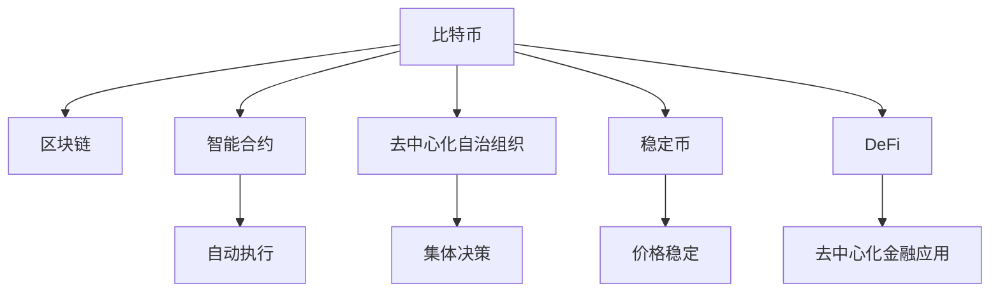

                 

## 1. 背景介绍

### 1.1 问题由来

随着技术的不断进步，尤其是区块链技术的成熟，数字货币的普及已经成为一个不可逆转的趋势。从比特币(Bitcoin)的诞生到以太坊(Ethereum)的兴起，再到各种山寨币的涌现，数字货币已经逐步从边缘走向主流。然而，这些加密资产与传统的纸币相比，依然存在诸多问题和挑战。2050年的数字货币将如何演变，成为当下人们热议的话题。本文将从历史的角度探讨数字货币的变迁，分析其未来的发展趋势。

### 1.2 问题核心关键点

数字货币的变迁始于密码学的应用。20世纪70年代，密码学首次被应用于数字货币。1991年，密码学研究者将数字货币的思想引入经济学，提出了电子现金的方案。2008年，中本聪(Satoshi Nakamoto)发表了《比特币：一个点对点的电子现金系统》，提出区块链的概念，标志着比特币的诞生。随后，以太坊等各类加密货币陆续出现，数字货币的技术和应用不断进步。

但数字货币的发展也面临着诸多挑战，如交易确认时间长、手续费高、存储风险、隐私泄露等。这些问题的解决将决定数字货币的未来。

### 1.3 问题研究意义

研究2050年的数字货币演变，有助于理解数字货币的发展规律，预测未来趋势，为金融技术的发展提供方向。数字货币不仅影响金融市场，还涉及货币政策、市场监管、用户隐私等多个方面。因此，深入了解其演变的规律和未来趋势，对于推动数字货币的普及和应用，构建安全的数字金融生态具有重要意义。

## 2. 核心概念与联系

### 2.1 核心概念概述

在讨论数字货币的演变时，我们需要理解以下核心概念：

- **比特币(Bitcoin)**：第一个去中心化的数字货币，采用区块链技术，通过分布式共识实现交易的透明性和不可篡改性。
- **区块链(Blockchain)**：一种去中心化的数据库技术，通过加密哈希函数保证数据不可篡改，通过分布式共识算法实现数据的同步和共享。
- **智能合约(Smart Contract)**：运行在区块链上的代码，用于自动化和去中心化的执行合同条款。
- **去中心化自治组织(DAO)**：由用户共同决策的组织形式，通过智能合约实现其内部治理和决策。
- **稳定币(Stablecoin)**：通过算法或其他机制实现价格稳定的加密货币，用于缓解比特币等波动性大的加密货币带来的风险。
- **DeFi(Decentralized Finance)**：基于区块链的去中心化金融系统，包括借贷、投资、保险等各类金融应用。

### 2.2 核心概念原理和架构的 Mermaid 流程图



这个流程图展示了数字货币的核心概念及其联系：

1. 比特币基于区块链技术，利用智能合约实现去中心化的交易和共识。
2. 去中心化自治组织和稳定币分别从治理和风险控制的角度，完善比特币等加密货币的生态系统。
3. DeFi通过智能合约等技术，构建去中心化的金融应用，为数字货币提供更广泛的应用场景。

## 3. 核心算法原理 & 具体操作步骤

### 3.1 算法原理概述

数字货币的核心算法原理主要包括以下几点：

- **分布式共识算法**：如PoW(工作量证明)、PoS(权益证明)等，保证区块链中所有节点的同步和数据的一致性。
- **加密算法**：如SHA256、RSA等，保障交易的机密性和不可篡改性。
- **智能合约**：通过代码实现自动化的合约条款，确保交易的公平性和透明性。

这些算法共同构成了数字货币的基础框架，为交易的安全、透明和去中心化提供了保障。

### 3.2 算法步骤详解

数字货币的核心算法步骤一般包括以下几个关键环节：

1. **创建钱包**：用户通过私钥生成公钥和地址，用于存储和管理数字货币。
2. **发起交易**：用户通过钱包发送交易请求，输入发送地址、接收地址、金额等参数。
3. **验证交易**：通过分布式共识算法和加密算法，验证交易的合法性和安全性。
4. **执行智能合约**：一旦交易被验证通过，智能合约自动执行相应的条款，完成交易。
5. **记录区块链**：交易信息被记录到区块链上，供后续验证和查询。

### 3.3 算法优缺点

数字货币的算法原理具有以下优点：

- **去中心化**：通过区块链等技术，实现去中心化的交易和共识，避免了中心化的信任问题。
- **透明性**：所有交易信息都被记录在区块链上，任何人都可以查询和验证。
- **安全性**：采用加密算法，保障交易的机密性和不可篡改性。
- **高效性**：通过智能合约实现自动化执行，降低交易成本和时间。

同时，数字货币的算法原理也存在一些局限性：

- **资源消耗**：尤其是PoW算法，需要大量的计算资源，导致能耗高。
- **网络延迟**：交易验证时间较长，可能影响用户体验。
- **安全性问题**：智能合约中的漏洞可能带来安全威胁，如DAO攻击等。

### 3.4 算法应用领域

数字货币的算法原理已应用于多个领域，包括金融、物流、供应链、医疗等。其中，金融领域的应用最为广泛，如跨境支付、外汇交易、借贷等。区块链技术在供应链管理中的应用也越来越普遍，通过智能合约和分布式共识实现供应链的透明性和可信性。

## 4. 数学模型和公式 & 详细讲解 & 举例说明

### 4.1 数学模型构建

在数字货币系统中，加密算法是其核心。以SHA256为例，其数学模型如下：

$$
\text{SHA256}(x) = \text{hash}(x)
$$

其中，$x$ 为输入的消息，$\text{hash}(x)$ 为输出的哈希值。SHA256算法将消息进行多次迭代，最终得到一个256位的哈希值。

### 4.2 公式推导过程

SHA256算法通过多次迭代计算哈希值，其具体推导过程如下：

1. 将消息$x$按64位分组，每个分组表示为一个512位的二进制数。
2. 初始化8个32位的整数作为哈希值。
3. 对消息$x$进行迭代计算，每次迭代包括4轮，每轮16次操作。
4. 每轮操作中，通过4个不同的函数$f_0$到$f_7$，对哈希值进行更新。
5. 最终得到256位的哈希值。

### 4.3 案例分析与讲解

以比特币的交易验证为例，其过程如下：

1. 发送方生成交易，输入发送地址、接收地址、金额等参数，并生成交易哈希值。
2. 发送方将交易哈希值和自己的私钥进行加密，生成签名。
3. 交易信息被广播到网络中，其他节点验证交易合法性。
4. 节点通过PoW算法计算出当前区块的最长链，并将交易信息添加到新区块中。
5. 新区块被其他节点接收，通过共识算法验证新区块的合法性。
6. 一旦新区块被验证通过，智能合约自动执行交易条款。

## 5. 项目实践：代码实例和详细解释说明

### 5.1 开发环境搭建

以下是使用Python和Flask框架搭建一个简单的数字货币系统的开发环境：

1. 安装Python和Flask：
```bash
pip install flask
```

2. 安装加密库：
```bash
pip install pysha256 cryptography
```

3. 创建项目目录，编写项目文件：
```bash
mkdir blockchain
cd blockchain
```

### 5.2 源代码详细实现

以下是数字货币系统的主要代码实现：

```python
from flask import Flask, request, jsonify
import hashlib
import json

app = Flask(__name__)

# 初始化区块链
blockchain = []

# 挖矿奖励
MINING_REWARD = 100

# 设置区块难度
DIFFICULTY = 5

def calculate_hash(data):
    return hashlib.sha256(data.encode()).hexdigest()

def proof_of_work():
    new_hash = calculate_hash(str(blockchain[-1]['previous_hash'] + str(blockchain[-1]['index'])))
    while new_hash[:DIFFICULTY] != '0' * DIFFICULTY:
        new_hash = calculate_hash(str(blockchain[-1]['previous_hash'] + str(blockchain[-1]['index']))
    return new_hash

def create_genesis_block():
    return {
        'index': 0,
        'previous_hash': '0' * 64,
        'timestamp': time.time(),
        'data': 'Genesis Block',
        'nonce': 0,
        'hash': calculate_hash(str('Genesis Block')),
        'confirmations': 0
    }

def create_new_block(data, previous_hash):
    new_block = {
        'index': len(blockchain) + 1,
        'previous_hash': previous_hash,
        'timestamp': time.time(),
        'data': data,
        'nonce': 0,
        'hash': calculate_hash(str(previous_hash) + str(new_block['index'])),
        'confirmations': 0
    }
    return new_block

def valid_proof(block, previous_proof):
    hash_operation = calculate_hash(str(previous_proof) + str(block['index']))
    return hash_operation[:DIFFICULTY] == '0' * DIFFICULTY

def get_next_proof(current_proof, previous_hash):
    new_proof = current_proof + 1
    while valid_proof(new_proof, previous_hash) is False:
        new_proof += 1
    return new_proof

@app.route('/blockchain', methods=['GET'])
def get_blockchain():
    return jsonify(blockchain)

@app.route('/add_block', methods=['POST'])
def add_block():
    new_block_data = request.get_json()
    if len(blockchain) == 0:
        new_block_data = create_genesis_block()
        blockchain.append(new_block_data)
    else:
        previous_hash = blockchain[-1]['hash']
        new_block_data['previous_hash'] = previous_hash
        new_block_data = create_new_block(json.dumps(new_block_data), previous_hash)
        blockchain.append(new_block_data)
    return jsonify(new_block_data)

@app.route('/mine', methods=['GET'])
def mine_block():
    if len(blockchain) == 0:
        new_block_data = create_genesis_block()
        blockchain.append(new_block_data)
        return jsonify(new_block_data)
    else:
        previous_hash = blockchain[-1]['hash']
        new_block_data = create_new_block(request.args.get('data'), previous_hash)
        new_proof = proof_of_work()
        new_block_data['nonce'] = get_next_proof(new_proof, previous_hash)
        new_block_data['hash'] = calculate_hash(str(new_proof) + str(new_block_data['index']))
        blockchain.append(new_block_data)
        return jsonify(new_block_data)

if __name__ == '__main__':
    app.run(host='0.0.0.0', port=5000)
```

### 5.3 代码解读与分析

以下是关键代码的解读和分析：

- **区块链的创建和管理**：
```python
blockchain = []

def create_genesis_block():
    return {
        'index': 0,
        'previous_hash': '0' * 64,
        'timestamp': time.time(),
        'data': 'Genesis Block',
        'nonce': 0,
        'hash': calculate_hash(str('Genesis Block')),
        'confirmations': 0
    }

def create_new_block(data, previous_hash):
    new_block = {
        'index': len(blockchain) + 1,
        'previous_hash': previous_hash,
        'timestamp': time.time(),
        'data': data,
        'nonce': 0,
        'hash': calculate_hash(str(previous_hash) + str(new_block['index'])),
        'confirmations': 0
    }
    return new_block
```

这些代码定义了区块链的基本结构和创建方法。`blockchain`是一个列表，用于存储所有的区块。`create_genesis_block`用于创建第一个区块，即创世区块。`create_new_block`用于创建新的区块，接收数据和前一个区块的哈希值作为输入。

- **挖矿操作**：
```python
def proof_of_work():
    new_hash = calculate_hash(str(blockchain[-1]['previous_hash'] + str(blockchain[-1]['index']))
    while new_hash[:DIFFICULTY] != '0' * DIFFICULTY:
        new_hash = calculate_hash(str(blockchain[-1]['previous_hash'] + str(blockchain[-1]['index']))
    return new_hash

def valid_proof(current_proof, previous_hash):
    hash_operation = calculate_hash(str(previous_hash) + str(current_proof))
    return hash_operation[:DIFFICULTY] == '0' * DIFFICULTY

def get_next_proof(current_proof, previous_hash):
    new_proof = current_proof + 1
    while valid_proof(new_proof, previous_hash) is False:
        new_proof += 1
    return new_proof
```

挖矿操作的核心在于计算哈希值，保证区块的合法性。`proof_of_work`函数通过不断迭代计算哈希值，直到符合难度要求。`valid_proof`函数用于验证哈希值是否符合难度要求。`get_next_proof`函数用于获取下一个证明值。

- **API接口的实现**：
```python
@app.route('/add_block', methods=['POST'])
def add_block():
    new_block_data = request.get_json()
    if len(blockchain) == 0:
        new_block_data = create_genesis_block()
        blockchain.append(new_block_data)
    else:
        previous_hash = blockchain[-1]['hash']
        new_block_data['previous_hash'] = previous_hash
        new_block_data = create_new_block(json.dumps(new_block_data), previous_hash)
        blockchain.append(new_block_data)
    return jsonify(new_block_data)

@app.route('/mine', methods=['GET'])
def mine_block():
    if len(blockchain) == 0:
        new_block_data = create_genesis_block()
        blockchain.append(new_block_data)
        return jsonify(new_block_data)
    else:
        previous_hash = blockchain[-1]['hash']
        new_block_data = create_new_block(request.args.get('data'), previous_hash)
        new_proof = proof_of_work()
        new_block_data['nonce'] = get_next_proof(new_proof, previous_hash)
        new_block_data['hash'] = calculate_hash(str(new_proof) + str(new_block_data['index']))
        blockchain.append(new_block_data)
        return jsonify(new_block_data)
```

API接口用于添加区块和挖矿操作。`/add_block`接口用于添加新区块，接收POST请求的数据，并根据区块链的长度创建新的区块。`/mine`接口用于挖矿操作，接收GET请求的数据，并根据区块链的最后一个区块计算新的区块。

## 6. 实际应用场景

### 6.1 智能合约的应用

智能合约是数字货币应用的重要方向之一。通过智能合约，可以实现自动化的金融应用，如借贷、投资等。智能合约的核心在于代码的执行，无需中心化的机构参与，能够提高效率和透明度。

### 6.2 去中心化金融（DeFi）

DeFi是数字货币应用的重要趋势之一。通过区块链和智能合约，用户可以不需要传统银行等中心化机构的参与，直接完成各种金融操作。DeFi应用包括借贷、交易、保险等，能够为用户提供更加自由、透明、高效的服务。

### 6.3 未来应用展望

未来的数字货币将更加智能化和普及化。随着区块链技术的不断进步，数字货币的应用场景将进一步扩大，如智能合约、DeFi等。同时，数字货币也将更加注重用户隐私和安全性，避免中心化的信任问题。

## 7. 工具和资源推荐

### 7.1 学习资源推荐

- **《区块链原理与应用》**：一本系统介绍区块链技术的书籍，涵盖区块链的原理、应用及发展趋势。
- **《比特币与区块链技术》**：一本详细介绍比特币和区块链技术的书籍，涵盖比特币的工作原理、区块链的机制及应用。
- **《区块链技术实战》**：一本实践性的区块链技术书籍，提供大量区块链应用的实际案例和开发经验。
- **Coursera区块链课程**：由斯坦福大学开设的区块链课程，涵盖区块链的原理、应用及最新进展。
- **EdX区块链课程**：由麻省理工学院开设的区块链课程，提供区块链的深入学习及应用实践。

### 7.2 开发工具推荐

- **Truffle**：一个基于以太坊的区块链开发框架，提供了智能合约的开发、测试和部署工具。
- **Remix IDE**：一个基于以太坊的智能合约开发平台，提供了智能合约的开发、测试和调试工具。
- **Metamask**：一个浏览器扩展，用于访问和管理以太坊钱包，支持智能合约的交易和执行。
- **Geth**：一个以太坊全节点客户端，用于区块链的开发、测试和部署。

### 7.3 相关论文推荐

- **《区块链技术：原理与实践》**：一篇关于区块链技术的论文，详细介绍了区块链的原理、机制及应用。
- **《智能合约：原理与实践》**：一篇关于智能合约的论文，详细介绍了智能合约的原理、机制及应用。
- **《区块链的安全性分析与防护》**：一篇关于区块链安全的论文，详细介绍了区块链的安全性问题及防护措施。
- **《区块链的性能优化与扩展》**：一篇关于区块链性能的论文，详细介绍了区块链的性能优化及扩展技术。

## 8. 总结：未来发展趋势与挑战

### 8.1 研究成果总结

本篇文章从历史和现实的角度，全面系统地介绍了数字货币的演变。数字货币的算法原理、实际应用和未来趋势得到了详细的阐述。通过对数字货币的研究，我们能够更深入地理解区块链技术，为未来的发展做好准备。

### 8.2 未来发展趋势

未来的数字货币将更加智能化和普及化。随着区块链技术的不断进步，数字货币的应用场景将进一步扩大，如智能合约、DeFi等。同时，数字货币也将更加注重用户隐私和安全性，避免中心化的信任问题。

### 8.3 面临的挑战

尽管数字货币的未来充满希望，但也面临着诸多挑战：

- **监管问题**：数字货币的监管问题仍然存在，不同国家的法律法规可能不一致，给数字货币的应用带来挑战。
- **安全性问题**：数字货币的安全性问题仍然存在，黑客攻击、智能合约漏洞等问题可能会给用户带来损失。
- **可扩展性问题**：区块链的可扩展性问题仍然存在，如何提高交易速度和网络吞吐量是一个重要研究方向。
- **用户接受度**：数字货币的用户接受度仍然较低，如何让更多的人接受和使用数字货币是一个重要问题。

### 8.4 研究展望

未来的数字货币研究将集中在以下几个方向：

- **去中心化治理**：如何实现去中心化的治理机制，提高系统的透明性和可信性。
- **跨链互操作**：如何实现不同区块链之间的互操作，实现数字资产的自由流动。
- **隐私保护**：如何保护用户的隐私，避免中心化的信任问题。
- **安全性提升**：如何提升数字货币的安全性，防范黑客攻击和智能合约漏洞。
- **性能优化**：如何提高区块链的性能，解决交易速度慢、网络拥堵等问题。

## 9. 附录：常见问题与解答

**Q1: 什么是区块链？**

A: 区块链是一种去中心化的数据库技术，通过加密哈希函数保证数据不可篡改，通过分布式共识算法实现数据的同步和共享。

**Q2: 什么是智能合约？**

A: 智能合约是运行在区块链上的代码，用于自动化和去中心化的执行合同条款。

**Q3: 数字货币与传统货币有何不同？**

A: 数字货币是一种基于区块链技术的电子货币，具有去中心化、透明性、安全性等优势。与传统货币相比，数字货币的交易速度快、成本低、安全性高。

**Q4: 数字货币的潜力有多大？**

A: 数字货币具有广阔的发展潜力，随着技术的不断进步，其应用场景将进一步扩大，如智能合约、DeFi等。数字货币不仅能够改变金融行业，还将深刻影响社会和经济生活的方方面面。

**Q5: 数字货币的未来发展方向是什么？**

A: 未来的数字货币将更加智能化和普及化。随着区块链技术的不断进步，数字货币的应用场景将进一步扩大，如智能合约、DeFi等。同时，数字货币也将更加注重用户隐私和安全性，避免中心化的信任问题。

