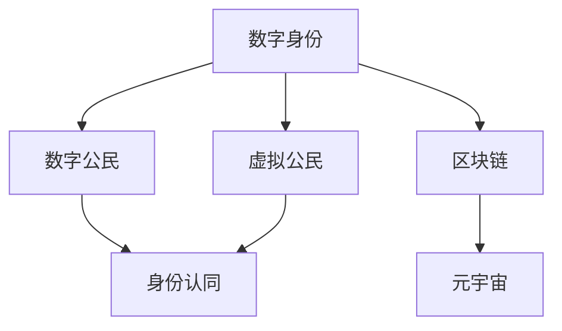

                 

# 2050年的数字身份：从数字公民到虚拟公民的身份认同

> 关键词：数字身份，数字公民，虚拟公民，身份认同，区块链，元宇宙，隐私保护，身份安全

## 1. 背景介绍

随着数字技术的飞速发展，人类社会的方方面面都正在经历一场前所未有的变革。从虚拟现实到增强现实，从区块链到元宇宙，未来的数字世界将彻底重塑人们的生活方式和身份认同。

在这一趋势下，身份验证、认证和管理的数字化转型变得愈发重要。未来的身份将不再局限于现实世界，更是一种多维度的虚拟身份。从数字公民到虚拟公民，人们的身份将由纯粹的法律概念扩展到虚拟世界的虚拟社会中。

这种转变带来的不仅是身份验证方式的改变，更深刻地影响了人们在数字世界的交互方式、社会结构以及隐私保护等方面。如何在技术进步的同时，确保数字身份的安全、隐私保护以及用户的认同感，是摆在我们面前的重要课题。

## 2. 核心概念与联系

### 2.1 核心概念概述

为了更好地理解这一主题，首先需要明确几个核心概念：

- **数字身份**：指通过数字技术生成的个体身份标识，用于在网络空间中进行身份验证、认证和管理。与传统的实体身份相比，数字身份更易管理和访问，适用于各种数字化场景。
- **数字公民**：指在数字化社会中，具有数字化身份和社会权利的个人。数字公民的权益包括网络中的言论自由、隐私保护、数字财产等。
- **虚拟公民**：指在虚拟世界中，通过数字化技术构建的虚拟个体或社群。虚拟公民的身份验证、社会行为和权益保护等问题，与现实世界的数字公民类似，但更多依赖于技术手段。
- **身份认同**：指个体对自己身份的感知和接受，包括性别、种族、国籍、职业等多个维度。在数字化和虚拟化背景下，身份认同更加多元和复杂。
- **区块链**：一种去中心化的分布式账本技术，通过加密和共识机制，保障数据的安全性和透明性。
- **元宇宙**：一个基于虚拟现实和增强现实技术的全新数字空间，包括虚拟社交、虚拟经济、虚拟财产等多个方面。

这些核心概念之间的关系可以通过以下Mermaid流程图来展示：



这个流程图展示了大语言模型微调的核心概念及其之间的关系：

1. 数字身份是数字公民和虚拟公民的基础，提供身份验证和管理的核心技术。
2. 数字公民和虚拟公民在身份认同上存在共通点，但在身份验证和权益保护上有所不同。
3. 区块链和元宇宙技术为数字身份的验证和管理提供了新的技术手段和应用场景。

## 3. 核心算法原理 & 具体操作步骤
### 3.1 算法原理概述

数字身份的验证和管理涉及多个技术领域，包括密码学、生物识别、区块链等。本文将重点介绍基于区块链技术的数字身份验证和管理算法。

### 3.2 算法步骤详解

基于区块链的数字身份验证和管理算法主要包括以下步骤：

1. **身份注册**：用户通过区块链网络提交身份信息，进行数字身份的创建和注册。
2. **身份验证**：用户通过私钥对身份进行加密和签名，证明身份的真实性。
3. **身份管理**：用户通过智能合约进行身份信息的访问、修改和更新，保障数据的安全性和透明性。
4. **身份信任**：通过区块链的分布式共识机制，建立和维护数字身份的信任网络。

### 3.3 算法优缺点

基于区块链的数字身份验证和管理算法具有以下优点：

- **去中心化**：每个节点都参与验证和共识，减少了中心化的信任风险。
- **安全性高**：通过密码学技术保障身份数据的隐私和安全，防止数据泄露和篡改。
- **透明度高**：所有交易和身份信息都在区块链上公开，便于追溯和审计。

同时，该算法也存在以下缺点：

- **扩展性差**：区块链的共识机制和交易验证时间较长，难以支持大规模并发处理。
- **计算成本高**：区块链的共识算法和智能合约执行需要大量的计算资源和能源消耗。
- **隐私保护不足**：虽然数据加密，但交易记录和身份信息仍可被追踪，存在隐私泄露的风险。

### 3.4 算法应用领域

基于区块链的数字身份验证和管理算法，已经在金融、医疗、政府等多个领域得到应用，取得了显著的效果：

- **金融领域**：通过数字身份进行身份认证和数字资产管理，提升了交易效率和安全性。
- **医疗领域**：利用数字身份进行电子病历和医疗数据的共享和管理，提高了医疗服务的可及性和隐私保护。
- **政府服务**：通过数字身份进行身份认证和公共服务的申请，简化了行政流程，提高了服务效率。
- **社交网络**：利用数字身份进行用户认证和社交网络数据的保护，增强了用户的安全感。

## 4. 数学模型和公式 & 详细讲解 & 举例说明

### 4.1 数学模型构建

数字身份的验证和管理模型可以抽象为以下数学模型：

设用户的身份信息为 $I$，身份证书为 $C$，公钥为 $P$，私钥为 $Q$。身份验证过程可以表示为：

- 身份注册：用户提交身份信息 $I$，生成公钥 $P$ 和私钥 $Q$，进行数字签名 $S$，并提交至区块链网络。
- 身份验证：用户提交身份证书 $C$ 和数字签名 $S$，区块链节点通过公钥 $P$ 进行验证，确认身份信息的真实性。

### 4.2 公式推导过程

以身份注册为例，推导数字签名的生成和验证公式。设用户的私钥为 $Q$，公钥为 $P$，身份信息为 $I$，则数字签名的生成公式为：

$$
S = H(I) \oplus Q
$$

其中 $H$ 为哈希函数，$\oplus$ 为异或运算符。数字签名的验证公式为：

$$
\text{Verify}(C, S, P) = (H(C) \oplus P) \oplus S = I
$$

### 4.3 案例分析与讲解

以医疗领域的身份管理为例，分析如何通过区块链技术保护患者隐私和提高医疗服务的效率。

假设患者 $A$ 需要在多家医院进行检查和诊断，医院 $B$ 需要验证 $A$ 的身份和历史病历。$A$ 通过区块链提交数字身份和病历信息，$B$ 通过区块链网络验证身份和病历的真实性，并在自己的数据库中更新病历记录。整个过程无需患者多次提交个人信息，保障了数据的安全性和隐私性，同时也提高了医疗服务的效率。

## 5. 项目实践：代码实例和详细解释说明

### 5.1 开发环境搭建

在进行身份管理实践前，我们需要准备好开发环境。以下是使用Python进行Hyperledger Fabric进行身份管理的开发环境配置流程：

1. 安装Hyperledger Fabric：从官网下载并安装Hyperledger Fabric，创建Hyperledger Fabric网络。

2. 创建并激活虚拟环境：
```bash
conda create -n fabric-env python=3.8 
conda activate fabric-env
```

3. 安装Hyperledger Fabric工具链：
```bash
pip install fabric-script
```

4. 安装相关依赖包：
```bash
pip install pyscrypt
```

完成上述步骤后，即可在`fabric-env`环境中开始身份管理的开发。

### 5.2 源代码详细实现

以下是使用Hyperledger Fabric实现基于区块链的数字身份管理的PyTorch代码实现。

首先，定义身份信息的结构：

```python
from hyperledger.fabric.sdk import Identity, X509Identity
from pyscrypt import scrypt, kdf

class IdentityInfo:
    def __init__(self, name, id, password):
        self.name = name
        self.id = id
        self.password = password
        self.private_key = self.generate_private_key(password)

    def generate_private_key(self, password):
        salt = os.urandom(16)
        key = scrypt.kdf(password, salt, N=8192, r=8, p=1, dklen=32)
        return kdf.kdf(key, salt, 'PBKDF2withHmacSHA256', dklen=32)

    def get_public_key(self):
        private_key = self.private_key
        public_key = ecdsa.SigningKey.from_string(private_key, curve=ecdsa.SECP256k1).verifying_key.to_string()
        return public_key

    def get_digest(self, message):
        return hashlib.sha256(message.encode('utf-8')).digest()

    def sign(self, message):
        digest = self.get_digest(message)
        signature = ecdsa.Signature.from_string(self.private_key, digest)
        return signature.to_string()

    def verify(self, message, signature):
        digest = self.get_digest(message)
        signature = ecdsa.Signature.from_string(signature)
        return self.public_key.verify(digest, signature)
```

然后，定义身份验证和管理的函数：

```python
from hyperledger.fabric.sdk import FabricCAServices, FabricClient, Identity, X509Identity

def create_identity(ca, name, id, password):
    identity = Identity(name, ca, enroll_id=id, enroll_secret=password)
    return identity

def register_identity(identity, client, chaincode, channel):
    response = client.register_identity(identity, chaincode, channel)
    return response['response']['result']

def login_identity(identity, client, chaincode, channel):
    response = client.evaluate_transaction(chaincode, 'login', identity, channel)
    return response['response']['result']

def update_identity(identity, chaincode, channel):
    response = client.evaluate_transaction(chaincode, 'update', identity, channel)
    return response['response']['result']
```

最后，启动身份注册和管理的流程：

```python
from hyperledger.fabric import FabricClient

client = FabricClient('localhost:7051')
ca = FabricCAServices('ca')  # 创建CA服务

# 创建身份信息
identity_info = IdentityInfo('Alice', 'alice', 'password')

# 注册身份
response = register_identity(identity_info, client, 'identity-chaincode', 'alice-org')
if response == 'success':
    print('Identity registered successfully.')
else:
    print('Failed to register identity.')

# 登录身份
response = login_identity(identity_info, client, 'identity-chaincode', 'alice-org')
if response == 'success':
    print('Identity logged in successfully.')
else:
    print('Failed to log in.')

# 更新身份
response = update_identity(identity_info, 'identity-chaincode', 'alice-org')
if response == 'success':
    print('Identity updated successfully.')
else:
    print('Failed to update.')
```

以上就是使用Hyperledger Fabric实现基于区块链的数字身份管理的完整代码实现。可以看到，借助Hyperledger Fabric的强大封装，我们能够用相对简洁的代码实现数字身份的创建、注册和更新，实现基本的身份管理功能。

### 5.3 代码解读与分析

让我们再详细解读一下关键代码的实现细节：

**IdentityInfo类**：
- `__init__`方法：初始化身份信息，包括姓名、ID和密码，并生成私钥。
- `generate_private_key`方法：通过密码和参数生成私钥。
- `get_public_key`方法：从私钥生成公钥。
- `get_digest`方法：对消息进行哈希生成摘要。
- `sign`方法：使用私钥对消息进行签名。
- `verify`方法：使用公钥验证签名的有效性。

**create_identity函数**：
- 使用CA创建新的身份，并进行注册。

**register_identity函数**：
- 使用FabricClient的`register_identity`方法，将身份信息提交到区块链网络进行注册。

**login_identity函数**：
- 使用FabricClient的`evaluate_transaction`方法，验证身份的有效性。

**update_identity函数**：
- 使用FabricClient的`evaluate_transaction`方法，更新身份信息。

**开发环境配置**：
- 首先，从官网下载并安装Hyperledger Fabric。
- 创建虚拟环境`fabric-env`，并激活。
- 安装Hyperledger Fabric工具链和依赖包。

在身份管理实践过程中，还需要注意以下关键点：

1. **密码安全**：确保密码的强度和复杂度，避免被破解。
2. **私钥保护**：私钥是身份验证的核心，需妥善保管，避免泄露。
3. **网络安全**：在身份注册和验证过程中，确保网络安全，防止中间人攻击。
4. **智能合约设计**：合理设计智能合约，确保身份管理的逻辑正确和高效。

## 6. 实际应用场景

### 6.1 数字身份在金融领域的应用

在金融领域，数字身份被广泛应用于身份验证和数字资产管理。通过数字身份，用户可以安全便捷地进行在线交易和资产管理，提升了交易效率和安全性。

具体而言，用户通过数字身份进行身份验证，确保交易双方的真实性和合法性。同时，数字身份还用于记录和管理用户的数字资产，如虚拟货币、数字身份证书等。金融机构通过数字身份管理系统，可以实时监控用户的交易行为，防范金融风险，保护用户权益。

### 6.2 数字身份在医疗领域的应用

在医疗领域，数字身份用于保护患者的隐私和医疗数据的共享。通过区块链技术，患者可以在多家医院共享自己的病历信息，便于医生的诊断和治疗。

具体而言，患者通过数字身份进行身份验证，确保医疗数据的真实性和合法性。医疗机构通过区块链技术，共享患者的病历信息，提高了医疗服务的可及性和效率。同时，通过数字身份管理，确保患者医疗数据的隐私和安全，防止数据泄露和滥用。

### 6.3 数字身份在政府服务中的应用

在政府服务领域，数字身份用于身份认证和公共服务的申请。通过数字身份，用户可以便捷地办理各种政府事务，简化了行政流程，提高了服务效率。

具体而言，用户通过数字身份进行身份认证，确保政府服务的真实性和合法性。政府机构通过数字身份管理系统，提供便捷的公共服务申请渠道，提高了服务的可及性和效率。同时，通过数字身份管理，确保政府数据的隐私和安全，防止数据泄露和滥用。

### 6.4 未来应用展望

随着数字身份技术的发展，未来的数字身份将更加智能化、个性化和多元化。以下列举了数字身份技术在未来的几个主要应用方向：

1. **虚拟身份**：随着元宇宙的兴起，数字身份将成为虚拟世界中的核心。通过区块链和NFT技术，用户可以在虚拟世界中拥有唯一的虚拟身份，进行虚拟交易和社交。

2. **跨界应用**：数字身份技术将跨越多个领域，实现身份的跨界验证和管理。如金融、医疗、政府、社交等多个领域，通过统一的数字身份管理系统，实现数据的互通和共享。

3. **个性化服务**：数字身份技术将结合AI和大数据技术，提供个性化的服务体验。通过用户的行为数据和偏好，智能推荐服务内容和产品，提升用户满意度。

4. **身份验证**：数字身份技术将广泛应用于身份验证，如面部识别、指纹识别、声纹识别等，提升身份验证的准确性和安全性。

5. **身份保护**：数字身份技术将提供更全面、更安全的身份保护措施，如数字指纹、生物识别等，防止身份被盗用和冒用。

这些应用方向将进一步推动数字身份技术的普及和应用，为未来的数字社会带来更多可能性。

## 7. 工具和资源推荐

### 7.1 学习资源推荐

为了帮助开发者系统掌握数字身份的理论基础和实践技巧，这里推荐一些优质的学习资源：

1. **《数字身份与隐私保护》系列博文**：由数字身份技术专家撰写，深入浅出地介绍了数字身份的基本概念、技术实现和应用场景。

2. **Coursera《区块链与数字身份》课程**：斯坦福大学开设的区块链和数字身份课程，有Lecture视频和配套作业，带你入门区块链和数字身份领域的基本概念和经典模型。

3. **《区块链原理与实践》书籍**：区块链领域的经典教材，全面介绍了区块链的基本原理、技术实现和应用场景，是区块链开发者必备的参考资料。

4. **区块链开发者社区**：如Blockchain.com、Ethereum.org等，提供丰富的学习资源和社区支持，帮助你深入了解区块链技术。

5. **Hyperledger Fabric官方文档**：Hyperledger Fabric的官方文档，提供了完整的区块链开发指南和样例代码，是Hyperledger Fabric开发者必备的资料。

通过对这些资源的学习实践，相信你一定能够快速掌握数字身份技术的精髓，并用于解决实际的数字身份问题。

### 7.2 开发工具推荐

高效的开发离不开优秀的工具支持。以下是几款用于数字身份开发常用的工具：

1. **Hyperledger Fabric**：IBM主导的区块链开发平台，提供了丰富的区块链网络和智能合约开发工具。
2. **Blockchain.com**：提供了丰富的区块链开发工具和社区支持，便于区块链开发者的快速迭代和实验。
3. **Ethereum.org**：提供了Ethereum区块链的开发工具和资源，支持智能合约开发和测试。
4. **Hyperledger Composer**：Hyperledger Fabric的开发工具链，支持智能合约的可视化设计和管理。
5. **Truffle Framework**：以太坊智能合约开发的框架，提供了丰富的开发工具和测试环境。

合理利用这些工具，可以显著提升数字身份开发的效率，加快创新迭代的步伐。

### 7.3 相关论文推荐

数字身份技术的发展源于学界的持续研究。以下是几篇奠基性的相关论文，推荐阅读：

1. **Blockchain Basics and Beyond**：由比特币开发者和区块链技术专家撰写，介绍了区块链的基本原理和应用场景，是区块链开发者必读的入门书籍。

2. **Blockchain for Dummies**：一本面向初学者的区块链入门书籍，简明扼要地介绍了区块链的基本概念和应用。

3. **Blockchain and Distributed Ledger Technologies**：一本关于区块链和分布式账本技术的经典教材，详细介绍了区块链的技术原理和应用。

4. **Identity Management in Blockchain**：介绍区块链中的身份管理技术，探讨了区块链身份管理的优势和挑战。

这些论文代表了大语言模型微调技术的发展脉络。通过学习这些前沿成果，可以帮助研究者把握学科前进方向，激发更多的创新灵感。

## 8. 总结：未来发展趋势与挑战

### 8.1 总结

本文对基于区块链的数字身份验证和管理方法进行了全面系统的介绍。首先阐述了数字身份的基本概念和应用场景，明确了数字身份在数字化社会中的核心地位。其次，从原理到实践，详细讲解了区块链数字身份验证和管理的数学模型和算法实现，给出了数字身份管理的完整代码实例。同时，本文还广泛探讨了数字身份技术在金融、医疗、政府等多个领域的应用前景，展示了数字身份技术的巨大潜力。此外，本文精选了数字身份技术的各类学习资源，力求为读者提供全方位的技术指引。

通过本文的系统梳理，可以看到，基于区块链的数字身份验证和管理方法正在成为数字化身份验证的重要范式，极大地提升了身份验证的安全性和效率，为未来的数字社会带来了新的可能性。未来，伴随区块链和数字身份技术的不断演进，数字身份技术必将进一步推动数字化进程，构建更加安全、透明、智能的数字社会。

### 8.2 未来发展趋势

展望未来，数字身份技术将呈现以下几个发展趋势：

1. **去中心化**：未来的数字身份将更加去中心化，每个用户都可以拥有自己的区块链身份，实现自主管理和控制。
2. **跨链互认**：不同区块链平台之间的身份互认将成为可能，用户可以在多个平台上使用统一的数字身份，提升跨平台身份验证的效率和安全性。
3. **身份融合**：数字身份将与其他身份验证方式（如生物识别、面部识别等）进行融合，实现多维度身份验证。
4. **隐私保护**：隐私保护将进一步加强，通过分布式存储和加密技术，确保用户数据的安全性和隐私性。
5. **智能化**：结合AI和大数据技术，数字身份将具备更强的智能分析和预测能力，提升用户体验和安全性。

这些趋势凸显了数字身份技术的广阔前景。这些方向的探索发展，必将进一步推动数字身份技术的普及和应用，为未来的数字社会带来更多可能性。

### 8.3 面临的挑战

尽管数字身份技术已经取得了瞩目成就，但在迈向更加智能化、普适化应用的过程中，它仍面临着诸多挑战：

1. **技术复杂性**：区块链和智能合约等技术本身较为复杂，开发者需要具备一定的技术背景。
2. **性能瓶颈**：大规模用户访问和交易时，区块链网络的性能可能受限，需要不断优化。
3. **隐私保护**：如何在保障身份验证安全性的同时，保护用户隐私，防止数据泄露，是一个亟待解决的问题。
4. **法律法规**：不同国家和地区的法律法规对数字身份的要求各不相同，需要开发者遵守本地法规。
5. **用户接受度**：数字身份技术的应用需要用户的广泛接受和参与，推广过程可能需要较长时间。

正视数字身份技术面临的这些挑战，积极应对并寻求突破，将是大规模应用数字身份的重要前提。相信随着技术的不断进步和法规的完善，数字身份技术必将迎来更广泛的应用，构建更加安全、透明、智能的数字社会。

### 8.4 研究展望

面对数字身份技术面临的挑战，未来的研究需要在以下几个方面寻求新的突破：

1. **技术优化**：进一步优化区块链和智能合约的性能，提升网络的处理能力和扩展性。
2. **隐私保护**：研发更加有效的隐私保护技术，确保用户数据的安全性和隐私性。
3. **法律法规**：制定和完善数字身份相关的法律法规，明确数字身份的定义和应用范围。
4. **用户体验**：提升数字身份系统的易用性和可接受性，增强用户的参与度和信任感。
5. **跨界应用**：探索数字身份技术在更多领域的应用，如娱乐、教育、旅游等，实现身份的跨界验证和管理。

这些研究方向将引领数字身份技术的不断发展，为构建安全、透明、智能的数字社会提供新的技术手段和应用场景。面向未来，数字身份技术需要各方共同努力，才能实现更加广泛的应用和深远的影响。

## 9. 附录：常见问题与解答

**Q1：数字身份技术是否适用于所有应用场景？**

A: 数字身份技术在大部分数字化场景中都有应用价值，但在某些特定场景中可能存在局限性。例如，对于无需身份验证的场景，数字身份可能显得冗余。此外，数字身份技术的实现需要考虑应用场景的具体需求和用户接受度，开发者需要根据实际需求进行权衡和选择。

**Q2：数字身份技术如何保障用户隐私？**

A: 数字身份技术通过区块链和分布式存储等技术手段，保障用户数据的隐私和安全。具体而言，用户的身份信息在区块链上进行加密和哈希处理，防止数据泄露。同时，用户可以自主控制数据的访问和修改，确保数据的隐私性和可控性。

**Q3：数字身份技术在实现过程中需要注意哪些问题？**

A: 数字身份技术的实现需要注意以下问题：

1. **密码安全**：确保密码的强度和复杂度，避免被破解。
2. **私钥保护**：私钥是身份验证的核心，需妥善保管，避免泄露。
3. **网络安全**：在身份注册和验证过程中，确保网络安全，防止中间人攻击。
4. **智能合约设计**：合理设计智能合约，确保身份管理的逻辑正确和高效。

这些关键问题需要开发者在实际开发过程中不断优化和改进。

**Q4：数字身份技术在未来有哪些潜在的应用场景？**

A: 数字身份技术在未来有诸多潜在的应用场景，包括：

1. **虚拟身份**：随着元宇宙的兴起，数字身份将成为虚拟世界中的核心。通过区块链和NFT技术，用户可以在虚拟世界中拥有唯一的虚拟身份，进行虚拟交易和社交。
2. **跨界应用**：数字身份技术将跨越多个领域，实现身份的跨界验证和管理。如金融、医疗、政府、社交等多个领域，通过统一的数字身份管理系统，实现数据的互通和共享。
3. **个性化服务**：数字身份技术将结合AI和大数据技术，提供个性化的服务体验。通过用户的行为数据和偏好，智能推荐服务内容和产品，提升用户满意度。
4. **身份验证**：数字身份技术将广泛应用于身份验证，如面部识别、指纹识别、声纹识别等，提升身份验证的准确性和安全性。
5. **身份保护**：数字身份技术将提供更全面、更安全的身份保护措施，如数字指纹、生物识别等，防止身份被盗用和冒用。

这些应用场景将进一步推动数字身份技术的普及和应用，为未来的数字社会带来更多可能性。

---

作者：禅与计算机程序设计艺术 / Zen and the Art of Computer Programming

