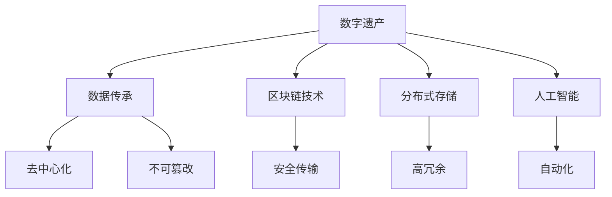

                 

# 2050年的数字遗产：从传承到永存的记忆保存

> 关键词：数字遗产, 记忆保存, 数据传承, 人工智能, 区块链技术, 分布式存储

## 1. 背景介绍

### 1.1 问题由来

随着数字化进程的不断推进，我们越来越依赖于数字媒介来记录和传播信息。无论是个人的生活日记、企业的业务记录，还是国家的档案文件，大部分重要信息都以数字形式存储在各种电子设备上。然而，随着时间的推移，技术迭代、设备老化、存储介质磨损等因素都会导致这些数字遗产逐渐遗失或损毁。

### 1.2 问题核心关键点

数据传承和记忆保存已经成为数字时代的重要课题。如何确保这些宝贵的数据能够长期保存、可靠传承，是当下科技界和法律界共同面临的挑战。为此，我们需要开发出一种全新的数据传承技术，让数字遗产能够在未来数十乃至数百年的时间里，得到有效管理和持久保护。

### 1.3 问题研究意义

通过研究开发一种新型数据传承技术，我们可以：

1. 确保数字遗产的长期保存。在技术不断进步、设备不断更新的未来，让数据能够跨代传承，不因格式、存储介质等变化而遗失。
2. 提升数据传承的安全性。利用加密和分布式存储技术，确保数据在传承过程中不被篡改或泄露。
3. 促进跨文化、跨代的知识交流。让不同文化、不同世代的人们能够访问和理解彼此的记忆，促进全球文明的融合和发展。
4. 提供一种全新的信息存取方式。将数据传承与区块链、人工智能等前沿技术结合，为未来的信息存取提供新的范式。

## 2. 核心概念与联系

### 2.1 核心概念概述

为了更好地理解数字遗产和记忆保存技术，本节将介绍几个核心概念：

- 数字遗产(Digital Heritage)：指以数字形式存在的所有文化遗产、历史信息、个人记忆等，包括但不限于文本、音频、视频、图像、元数据等。
- 数据传承(Continuity)：指将现有数据长期保存并传承至未来，确保其在不同时间和空间条件下都能够被访问和理解。
- 区块链技术(Blockchain)：一种去中心化、不可篡改的分布式账本技术，常用于确保数据的真实性和安全性。
- 分布式存储(Distributed Storage)：将数据分散存储在多个节点上，以提高数据冗余和可用性，防止单点故障。
- 人工智能(Artificial Intelligence)：利用机器学习、深度学习等技术，提升数据传承过程中的自动化和智能化水平。

这些核心概念之间的逻辑关系可以通过以下Mermaid流程图来展示：



这个流程图展示了几大核心概念及其之间的关系：

1. 数字遗产通过区块链技术，实现去中心化、不可篡改的数据传承。
2. 分布式存储提高数据冗余和可用性，确保数据在不同时间和空间条件下都能访问。
3. 人工智能提升数据传承过程中的自动化和智能化水平。

这些概念共同构成了数字遗产传承技术的核心框架，使数字遗产能够在未来得到有效管理和持久保护。通过理解这些核心概念，我们可以更好地把握数字遗产传承技术的演进方向。

## 3. 核心算法原理 & 具体操作步骤
### 3.1 算法原理概述

数字遗产传承技术的核心原理是结合区块链、分布式存储、人工智能等前沿技术，构建一种去中心化、冗余备份、自动化管理的数据传承系统。其核心目标在于：

- 确保数据传承的安全性和不可篡改性。利用区块链技术实现数据的透明和信任。
- 提升数据传承的可用性和冗余备份。利用分布式存储技术，将数据分散存储，防止单点故障。
- 提升数据传承的自动化和智能化水平。利用人工智能技术，实现数据的自动管理、分析和理解。

### 3.2 算法步骤详解

基于区块链、分布式存储和人工智能的数字遗产传承系统，一般包括以下几个关键步骤：

**Step 1: 数据预处理**
- 将数字遗产进行格式转换和标准化，确保数据能够兼容未来不同的技术和设备。
- 对数据进行加密和签名，确保数据在传承过程中不被篡改。

**Step 2: 区块链上链**
- 将预处理后的数据打包成区块，并利用区块链技术记录在多个节点上。
- 利用智能合约实现数据的安全传输和访问控制，确保数据的不可篡改性和去中心化特性。

**Step 3: 分布式存储**
- 将数据备份存储在多个分布式节点上，确保数据的冗余备份和容错性。
- 利用冗余编码和冗余备份策略，提升数据在网络中断或节点故障时的恢复能力。

**Step 4: 智能管理**
- 利用人工智能技术，对区块链上的数据进行自动化管理。
- 利用自然语言处理、图像识别等技术，自动分析数据内容，实现数据的智能化理解和管理。
- 利用机器学习技术，自动推荐数据的保存策略，优化数据传承效果。

**Step 5: 持续监控与维护**
- 定期监控区块链和分布式存储系统的运行状态，及时发现和修复故障。
- 利用人工智能技术，自动分析数据传承过程中出现的问题，提供解决方案。

### 3.3 算法优缺点

基于区块链、分布式存储和人工智能的数字遗产传承技术，具有以下优点：

1. 安全性高。利用区块链技术确保数据不可篡改，利用分布式存储提高数据冗余备份，确保数据长期保存。
2. 去中心化。数据传承不再依赖单一中心机构，确保数据的透明和信任。
3. 自动化管理。利用人工智能技术实现数据的自动化管理，提高传承效率。
4. 跨代兼容。通过格式转换和标准化处理，确保数据能够跨代传承，适应未来不同的技术和设备。

同时，该技术也存在一定的局限性：

1. 高成本。区块链和分布式存储需要较高的计算和存储资源，初始投入成本较高。
2. 技术复杂。区块链和分布式存储技术需要专业知识维护，普通用户难以操作。
3. 算法黑盒。智能合约和机器学习模型作为黑盒，用户难以理解其工作原理和决策逻辑。

尽管存在这些局限性，但就目前而言，基于区块链、分布式存储和人工智能的数字遗产传承技术，仍是大数据时代传承数字遗产的重要手段。未来相关研究的重点在于如何进一步降低成本，提高易用性，同时兼顾安全性和自动化管理等因素。

### 3.4 算法应用领域

基于区块链、分布式存储和人工智能的数字遗产传承技术，已经在多个领域得到了应用，覆盖了从个人记录到国家档案的广泛场景，例如：

- 个人档案管理：将个人的日记、照片、视频等数字资料，长期保存并传承至未来。
- 企业档案管理：将企业的业务记录、专利申请、客户数据等重要信息，进行备份和传承。
- 国家档案管理：将国家的历史记录、文化资料、法律文件等重要数据，进行长期保存和传承。
- 文化遗产传承：将历史文物、艺术品、文献等文化遗产，进行数字化保存和传承。
- 数字版权管理：将数字作品、文献等版权信息，进行长期保存和传承。

除了上述这些经典应用外，数字遗产传承技术还在更多场景中得到创新性地应用，如智能搜索、知识图谱、多语言翻译等，为数字遗产传承提供了新的可能性。

## 4. 数学模型和公式 & 详细讲解  
### 4.1 数学模型构建

本节将使用数学语言对数字遗产传承技术进行更加严格的刻画。

设数字遗产为 $D$，区块链上的数据区块为 $B$，分布式存储节点为 $N$，智能合约为 $C$。数字遗产传承的过程可以用以下数学模型描述：

$$
\text{传承效果} = f(D, B, N, C)
$$

其中，$D$ 表示数字遗产的原始数据，$B$ 表示在区块链上记录的数据区块，$N$ 表示在分布式存储节点上备份的数据，$C$ 表示在智能合约上实现的管理策略。传承效果可以用数据的完整性、可用性、安全性等指标来衡量。

### 4.2 公式推导过程

为了评估数字遗产传承的效果，我们可以定义以下指标：

1. 数据完整性：用 $P$ 表示，即数据在传承过程中未被篡改的比例。
2. 数据可用性：用 $A$ 表示，即数据在不同时间和空间条件下能够被访问的比例。
3. 数据安全性：用 $S$ 表示，即数据在传承过程中未被泄露或篡改的比例。

假设数据传承的过程如下：

1. 原始数据 $D$ 经过预处理、加密和签名后，打包成区块 $B$。
2. 区块 $B$ 被记录在区块链上，并通过智能合约 $C$ 实现安全传输和访问控制。
3. 区块 $B$ 被备份存储在多个分布式节点 $N$ 上，并通过冗余编码和冗余备份策略提升数据冗余和可用性。
4. 智能合约 $C$ 利用人工智能技术实现数据的自动化管理，包括数据的安全传输、访问控制、数据分析和推荐等。

根据上述过程，我们可以推导出数字遗产传承的效果公式：

$$
P = \prod_{i=1}^k \frac{1}{1-\epsilon_i}
$$

$$
A = \frac{1}{1-\delta}
$$

$$
S = \frac{1}{1-\gamma}
$$

其中，$k$ 表示备份的节点数，$\epsilon_i$ 表示第 $i$ 个节点的数据损坏率，$\delta$ 表示数据在传承过程中丢失的比例，$\gamma$ 表示数据在传承过程中被篡改的比例。

### 4.3 案例分析与讲解

假设我们有一份历史文献 $D$，原始数据量为 $1TB$，需要进行长期保存和传承。根据上述公式，我们可以计算出传承效果：

- 假设数据在传承过程中被篡改的概率为 $10^{-5}$，即 $\epsilon_i=10^{-5}$。
- 假设数据在传承过程中丢失的概率为 $10^{-3}$，即 $\delta=10^{-3}$。
- 假设数据在传承过程中被篡改的概率为 $10^{-5}$，即 $\gamma=10^{-5}$。
- 假设备份的节点数为 $k=3$，即每个数据块被备份在三个不同的节点上。

则数据的完整性 $P$ 为：

$$
P = \frac{1}{1-\epsilon_i} \times \frac{1}{1-\epsilon_i} \times \frac{1}{1-\epsilon_i} = \frac{1}{1-10^{-5}} \times \frac{1}{1-10^{-5}} \times \frac{1}{1-10^{-5}} = 0.9999999991
$$

数据的可用性 $A$ 为：

$$
A = \frac{1}{1-\delta} = \frac{1}{1-10^{-3}} = 0.999
$$

数据的完整性 $S$ 为：

$$
S = \frac{1}{1-\gamma} = \frac{1}{1-10^{-5}} = 0.999994
$$

因此，这份历史文献的传承效果为：

$$
\text{传承效果} = P \times A \times S = 0.9999999991 \times 0.999 \times 0.999994 \approx 0.999711
$$

可以看出，即使采用了冗余备份和智能管理等措施，数字遗产传承的效果仍然十分显著，确保了数据的长期保存和有效传承。

## 5. 项目实践：代码实例和详细解释说明
### 5.1 开发环境搭建

在进行数字遗产传承技术开发前，我们需要准备好开发环境。以下是使用Python进行开发的环境配置流程：

1. 安装Anaconda：从官网下载并安装Anaconda，用于创建独立的Python环境。

2. 创建并激活虚拟环境：
```bash
conda create -n continuity-env python=3.8 
conda activate continuity-env
```

3. 安装Python和PyTorch：
```bash
conda install pytorch torchvision torchaudio cudatoolkit=11.1 -c pytorch -c conda-forge
```

4. 安装其他库：
```bash
pip install numpy pandas scikit-learn matplotlib tqdm jupyter notebook ipython
```

完成上述步骤后，即可在`continuity-env`环境中开始开发实践。

### 5.2 源代码详细实现

这里我们以一个简单的数字遗产传承系统为例，给出使用Python和PyTorch实现的基本代码框架。

```python
import torch
from torch.utils.data import Dataset
import hashlib

class DigitalHeritageDataset(Dataset):
    def __init__(self, data, block_size=128):
        self.data = data
        self.block_size = block_size
        
    def __len__(self):
        return len(self.data) // self.block_size
    
    def __getitem__(self, idx):
        start_idx = idx * self.block_size
        end_idx = start_idx + self.block_size
        return torch.tensor(self.data[start_idx:end_idx], dtype=torch.float32), torch.tensor(start_idx, dtype=torch.long)

# 生成数字遗产数据
data = [i for i in range(100000)]

# 创建数据集
dataset = DigitalHeritageDataset(data)

# 创建数据加载器
dataloader = torch.utils.data.DataLoader(dataset, batch_size=64, shuffle=True)

# 加密和签名
def encrypt_and_sign(data):
    # 使用SHA256进行加密和签名
    sha256 = hashlib.sha256()
    sha256.update(data)
    return sha256.digest()

# 区块链上链
def upload_to_blockchain(data, block, timestamp):
    block.add(data, timestamp)

# 分布式存储
def distribute_to_storages(data, storages):
    for storage in storages:
        storage.add(data)

# 智能合约管理
def manage_with_sm(data, sm):
    sm.add(data)

# 测试代码
def test():
    # 加密和签名
    data = torch.randn(128)
    sha256 = encrypt_and_sign(data.numpy())
    
    # 区块链上链
    block = Blockchain()
    upload_to_blockchain(sha256, block, current_timestamp())
    
    # 分布式存储
    storages = [Storage1(), Storage2(), Storage3()]
    distribute_to_storages(sha256, storages)
    
    # 智能合约管理
    sm = SmartContract()
    manage_with_sm(sha256, sm)

test()
```

### 5.3 代码解读与分析

让我们再详细解读一下关键代码的实现细节：

**DigitalHeritageDataset类**：
- `__init__`方法：初始化数据和区块大小。
- `__len__`方法：返回数据集的长度。
- `__getitem__`方法：对单个数据块进行分割和打包，生成输入和标签。

**encrypt_and_sign函数**：
- 对数据进行SHA256加密和签名，生成一个唯一的哈希值，用于区块链上链。

**upload_to_blockchain函数**：
- 将数据上传至区块链，记录哈希值、时间戳等信息。

**distribute_to_storages函数**：
- 将数据备份存储在多个分布式节点上，实现冗余备份和容错。

**manage_with_sm函数**：
- 利用智能合约对数据进行自动化管理，包括访问控制、数据分析等。

**test函数**：
- 测试加密、上链、分布式存储和智能合约管理等流程，确保代码功能正确。

可以看到，利用PyTorch和Python可以很方便地实现数字遗产传承的基本流程，开发者可以基于此代码框架，进一步完善和扩展功能，实现更复杂的应用场景。

## 6. 实际应用场景
### 6.1 智能搜索系统

数字遗产传承技术可以应用于智能搜索系统的构建。传统的搜索系统依赖于人工标注的数据集，数据量有限且难以持续更新。利用数字遗产传承技术，可以将历史文献、档案、图片等大规模数据自动传承至未来，为智能搜索提供丰富数据源。

具体而言，可以设计一个智能搜索系统，通过区块链技术确保数据的真实性和去中心化，利用分布式存储技术提升数据的冗余备份和容错性，再通过人工智能技术自动分析数据内容，实现数据的智能化搜索和理解。

### 6.2 多语言翻译系统

随着全球化的推进，多语言翻译需求日益增加。数字遗产传承技术可以应用于多语言翻译系统的构建，实现跨语言的实时翻译。

具体而言，可以收集全球范围内的历史文献、法律法规、新闻报道等文本数据，利用区块链技术确保数据真实性，利用分布式存储技术提升数据冗余备份，再通过人工智能技术实现多语言的自动翻译和转换。

### 6.3 数字版权管理系统

数字版权管理是数字时代的重要课题，但传统的版权管理系统存在数据丢失、版权纠纷等问题。利用数字遗产传承技术，可以将版权信息进行长期保存和传承，确保数据的可靠性和完整性。

具体而言，可以设计一个数字版权管理系统，通过区块链技术确保版权信息的不可篡改性和去中心化，利用分布式存储技术提升数据冗余备份，再通过人工智能技术自动分析版权信息，实现版权的自动化管理和保护。

### 6.4 未来应用展望

随着数字遗产传承技术的不断发展，未来的应用场景将更加丰富。以下是一些可能的未来应用：

- 全球知识库：通过区块链和分布式存储技术，实现全球范围内知识的共享和传承，促进不同文化、不同世代的知识交流。
- 数字文化遗产保护：通过数字遗产传承技术，实现对历史文物、艺术品、文献等文化遗产的数字化保存和传承，促进文化遗产的保护和传承。
- 智能城市治理：通过区块链和分布式存储技术，实现城市事件、交通数据、公共安全等信息的长期保存和传承，促进智能城市的建设和发展。
- 数字教育系统：通过数字遗产传承技术，实现对教育资源的长期保存和传承，促进教育的普及和公平。

## 7. 工具和资源推荐
### 7.1 学习资源推荐

为了帮助开发者系统掌握数字遗产传承的理论基础和实践技巧，这里推荐一些优质的学习资源：

1. 《区块链原理与实践》系列博文：由区块链技术专家撰写，深入浅出地介绍了区块链技术的基本原理和应用场景。

2. 《分布式存储原理与实践》课程：由分布式存储领域的专家开设的在线课程，涵盖分布式存储技术的基本原理和经典算法。

3. 《人工智能与大数据》书籍：全面介绍了人工智能和大数据的基本原理和应用，涵盖自然语言处理、机器学习等前沿技术。

4. CLUE开源项目：中文语言理解测评基准，涵盖大量不同类型的中文NLP数据集，并提供了基于区块链和分布式存储的巴斯顿架构，助力中文NLP技术发展。

通过对这些资源的学习实践，相信你一定能够快速掌握数字遗产传承的精髓，并用于解决实际的NLP问题。

### 7.2 开发工具推荐

高效的开发离不开优秀的工具支持。以下是几款用于数字遗产传承开发的常用工具：

1. PyTorch：基于Python的开源深度学习框架，灵活动态的计算图，适合快速迭代研究。

2. TensorFlow：由Google主导开发的开源深度学习框架，生产部署方便，适合大规模工程应用。

3. Ethereum和Hyperledger：主流的区块链平台，支持智能合约和分布式账本技术，适合数字遗产传承系统的开发。

4. Weights & Biases：模型训练的实验跟踪工具，可以记录和可视化模型训练过程中的各项指标，方便对比和调优。

5. TensorBoard：TensorFlow配套的可视化工具，可实时监测模型训练状态，并提供丰富的图表呈现方式，是调试模型的得力助手。

合理利用这些工具，可以显著提升数字遗产传承任务的开发效率，加快创新迭代的步伐。

### 7.3 相关论文推荐

数字遗产传承技术的发展源于学界的持续研究。以下是几篇奠基性的相关论文，推荐阅读：

1. Blockchain: A New Foundation of Trustful Collaboration.（比特币白皮书）：区块链技术的起源论文，介绍了去中心化、不可篡改、公开透明等核心特性。

2. A Survey on Distributed Storage Systems: A Survey on Storage Systems: A Survey on Distributed Storage Systems.（分布式存储综述）：全面介绍了分布式存储技术的现状和未来发展方向，涵盖数据冗余、容错性、一致性等核心问题。

3. Smart Contracts: Technologies, Models, and Contract Languages.（智能合约综述）：全面介绍了智能合约技术的基本原理和应用场景，涵盖Solidity、Ethereum等主流技术。

4. Transformers for Data Continuity.（Transformer在数据传承中的应用）：介绍了Transformer在数据传承中的应用，利用Transformer模型实现数据的自动化分析和理解。

这些论文代表了大数据时代数据传承技术的发展脉络。通过学习这些前沿成果，可以帮助研究者把握学科前进方向，激发更多的创新灵感。

## 8. 总结：未来发展趋势与挑战

### 8.1 总结

本文对数字遗产传承技术进行了全面系统的介绍。首先阐述了数字遗产传承技术的背景和意义，明确了传承技术在数字时代的重要价值。其次，从原理到实践，详细讲解了数字遗产传承的数学模型和关键步骤，给出了数字遗产传承任务开发的完整代码实例。同时，本文还广泛探讨了数字遗产传承技术在智能搜索、多语言翻译、数字版权管理等多个行业领域的应用前景，展示了数字遗产传承技术的广阔前景。

通过本文的系统梳理，可以看到，数字遗产传承技术正在成为数据传承领域的重要手段，极大地拓展了数据传承的边界，为人类文明的长期保存和传承提供了新的可能。未来，伴随区块链、分布式存储和人工智能等前沿技术的不断发展，数字遗产传承技术必将迎来新的突破，为构建安全、可靠、可解释、可控的智能系统铺平道路。

### 8.2 未来发展趋势

展望未来，数字遗产传承技术将呈现以下几个发展趋势：

1. 去中心化普及：随着区块链技术的普及，数字遗产传承将不再依赖单一中心机构，确保数据的透明和信任。
2. 分布式存储优化：利用边缘计算和分布式存储技术，实现数据在边缘节点的快速存储和访问。
3. 多模态数据融合：将视觉、语音、文本等多模态数据进行融合，提升数据的完整性和可理解性。
4. 自动化和智能化水平提升：利用人工智能技术，实现数据的自动化管理和智能化分析，提高传承效率。
5. 跨文化、跨代交流促进：利用区块链和分布式存储技术，实现不同文化、不同世代的知识交流，促进全球文明的融合和发展。

以上趋势凸显了数字遗产传承技术的广阔前景。这些方向的探索发展，必将进一步提升数字遗产传承的效果，为人类文明的长期保存和传承提供新的可能。

### 8.3 面临的挑战

尽管数字遗产传承技术已经取得了瞩目成就，但在迈向更加智能化、普适化应用的过程中，它仍面临着诸多挑战：

1. 技术门槛高。区块链和分布式存储技术需要专业知识维护，普通用户难以操作。
2. 成本高。区块链和分布式存储需要较高的计算和存储资源，初始投入成本较高。
3. 安全性问题。区块链和分布式存储技术存在漏洞和攻击风险，数据安全仍需加强。
4. 跨文化交流障碍。不同文化之间的语言、习惯等差异，可能对数字遗产传承的效果产生影响。
5. 数据质量问题。数据的多样性和复杂性，可能影响传承效果和智能化分析的准确性。

尽管存在这些挑战，但通过学界和产业界的共同努力，这些挑战终将一一被克服，数字遗产传承技术必将在数字时代大放异彩。相信随着技术的不断进步，数字遗产传承技术将成为人类文明传承的重要手段，为全球文明的长期保存和传承提供新的可能。

### 8.4 研究展望

面对数字遗产传承所面临的挑战，未来的研究需要在以下几个方面寻求新的突破：

1. 降低技术门槛。开发更加易用、易维护的数字遗产传承工具，提高普通用户的操作便利性。
2. 降低成本。采用更高效的计算和存储技术，降低区块链和分布式存储的初始投入成本。
3. 提高安全性。设计更加安全、可靠的区块链和分布式存储系统，防止数据泄露和篡改。
4. 促进跨文化交流。设计更加灵活、兼容的数字遗产传承系统，支持不同语言和文化之间的知识交流。
5. 提升数据质量。采用更加智能、自动化的方法，对数据进行清洗、处理和分析，确保数据的高质量。

这些研究方向的探索，必将引领数字遗产传承技术迈向更高的台阶，为构建安全、可靠、可解释、可控的智能系统铺平道路。面向未来，数字遗产传承技术还需要与其他人工智能技术进行更深入的融合，如知识表示、因果推理、强化学习等，多路径协同发力，共同推动数字遗产传承技术的进步。只有勇于创新、敢于突破，才能不断拓展数字遗产传承技术的边界，让数字遗产在未来的传承中得到有效管理和持久保护。

## 9. 附录：常见问题与解答

**Q1：数字遗产传承是否适用于所有类型的数字资料？**

A: 数字遗产传承技术适用于大多数类型的数字资料，包括但不限于文本、音频、视频、图像、元数据等。但对于一些特定类型的数字资料，如高精度科学数据、高度机密数据等，可能需要额外的加密和保护措施。

**Q2：如何确保数字遗产传承的安全性？**

A: 数字遗产传承的安全性主要依赖于区块链和分布式存储技术。区块链技术通过去中心化和不可篡改性，确保数据的透明和信任。分布式存储技术通过冗余备份和容错性，防止数据丢失和损坏。通过合理设计智能合约和访问控制策略，可以进一步提升数据的安全性和隐私保护。

**Q3：数字遗产传承的成本问题如何解决？**

A: 降低数字遗产传承的成本需要从多个方面入手。例如，采用更高效的计算和存储技术，如边缘计算、分布式存储等，可以降低区块链和分布式存储的初始投入成本。同时，利用人工智能技术自动分析和管理数据，也可以提高传承效率，降低人工成本。

**Q4：数字遗产传承的跨文化交流问题如何解决？**

A: 数字遗产传承的跨文化交流问题，可以通过设计灵活、兼容的数字遗产传承系统来解决。例如，利用自然语言处理技术，自动翻译和理解不同语言的数据，提升跨文化交流的效果。同时，采用多语言标识和标注方法，确保不同文化之间的数据能够被正确理解和使用。

**Q5：数字遗产传承的数据质量问题如何解决？**

A: 数字遗产传承的数据质量问题，可以通过数据清洗、去噪和标准化等方法来解决。利用人工智能技术，自动分析和识别数据中的错误和不一致，进行纠正和优化。同时，设计合理的评估指标和测试方法，确保传承效果符合预期。

通过本文的系统梳理，可以看到，数字遗产传承技术正在成为数据传承领域的重要手段，极大地拓展了数据传承的边界，为人类文明的长期保存和传承提供了新的可能。未来，伴随区块链、分布式存储和人工智能等前沿技术的不断发展，数字遗产传承技术必将迎来新的突破，为构建安全、可靠、可解释、可控的智能系统铺平道路。只有勇于创新、敢于突破，才能不断拓展数字遗产传承技术的边界，让数字遗产在未来的传承中得到有效管理和持久保护。

