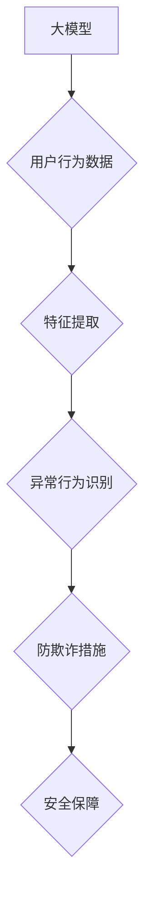

                 

## 大模型技术在电商平台用户行为异常检测与防欺诈中的应用

> 关键词：大模型、电商平台、用户行为异常检测、防欺诈、深度学习、自然语言处理、推荐系统

## 1. 背景介绍

随着电商平台的蓬勃发展，用户规模不断扩大，交易额持续增长。然而，随之而来的是各种网络安全威胁和欺诈行为的频发，给电商平台带来了巨大的经济损失和安全风险。传统的异常检测方法往往依赖于规则匹配和统计模型，难以应对复杂的欺诈模式和不断变化的用户行为。

大模型技术作为人工智能领域的一项重要突破，凭借其强大的学习能力和泛化能力，为电商平台用户行为异常检测和防欺诈提供了新的解决方案。大模型能够从海量用户数据中学习到复杂的模式和特征，并对异常行为进行识别和预测，有效提升了检测精度和效率。

## 2. 核心概念与联系

### 2.1 大模型

大模型是指参数量在数十亿甚至千亿级别的人工智能模型，通过训练海量数据，能够掌握丰富的知识和技能，并应用于各种自然语言处理、计算机视觉、语音识别等领域。

### 2.2 用户行为异常检测

用户行为异常检测是指通过分析用户在电商平台上的行为数据，识别出与正常用户行为相悖的异常行为，例如恶意注册、刷单、虚假交易等。

### 2.3 防欺诈

防欺诈是指通过技术手段和策略，识别和阻止欺诈行为，保护电商平台和用户的利益。

**核心概念与联系流程图**



## 3. 核心算法原理 & 具体操作步骤

### 3.1 算法原理概述

大模型在用户行为异常检测和防欺诈中的应用主要基于以下算法原理：

* **深度学习**: 利用多层神经网络结构，从海量用户行为数据中学习复杂的特征和模式，识别异常行为。
* **自然语言处理**: 对用户评论、聊天记录等文本数据进行分析，识别潜在的欺诈意图和风险。
* **推荐系统**: 基于用户的历史行为和偏好，预测用户的未来行为，识别异常的购买行为或浏览轨迹。

### 3.2 算法步骤详解

1. **数据收集**: 收集电商平台用户的行为数据，包括用户注册信息、浏览记录、购买历史、评论内容、聊天记录等。
2. **数据预处理**: 对收集到的数据进行清洗、转换和格式化，去除噪声数据和无效信息，并将其转换为模型可识别的格式。
3. **特征提取**: 从用户行为数据中提取关键特征，例如用户购买频率、平均消费金额、浏览时长、评论情感倾向等。
4. **模型训练**: 利用深度学习算法，训练大模型，使其能够识别出异常行为的特征模式。
5. **模型评估**: 使用测试数据对模型进行评估，并根据评估结果进行模型调优。
6. **异常行为检测**: 将新用户的行为数据输入到训练好的模型中，识别出异常行为。
7. **防欺诈措施**: 对检测出的异常行为采取相应的防欺诈措施，例如账户冻结、交易拦截、报警通知等。

### 3.3 算法优缺点

**优点**:

* **高精度**: 大模型能够学习到复杂的特征模式，提高异常行为检测的精度。
* **自动化**: 大模型能够自动识别异常行为，减少人工干预。
* **可扩展性**: 大模型能够处理海量数据，并随着数据量的增加而提升性能。

**缺点**:

* **训练成本高**: 大模型的训练需要大量的计算资源和时间。
* **数据依赖性强**: 大模型的性能取决于训练数据的质量和数量。
* **解释性差**: 大模型的决策过程难以解释，难以理解模型是如何识别异常行为的。

### 3.4 算法应用领域

大模型技术在电商平台用户行为异常检测和防欺诈领域具有广泛的应用前景，例如：

* **账户安全**: 检测恶意注册、盗号、账号共享等行为。
* **交易安全**: 识别刷单、虚假交易、恶意退款等行为。
* **内容安全**: 过滤垃圾评论、恶意广告、虚假信息等内容。
* **用户体验**: 识别用户行为异常，提供个性化服务和帮助。

## 4. 数学模型和公式 & 详细讲解 & 举例说明

### 4.1 数学模型构建

在用户行为异常检测中，常用的数学模型包括：

* **贝叶斯网络**: 用于建模用户行为之间的依赖关系，识别异常行为的概率。
* **支持向量机**: 用于分类用户行为，将正常行为和异常行为区分开来。
* **深度神经网络**: 用于学习用户行为的复杂特征模式，识别异常行为。

### 4.2 公式推导过程

例如，使用支持向量机进行用户行为分类，其目标函数为：

$$
min_{w,b} \frac{1}{2}||w||^2 + C \sum_{i=1}^{N} \xi_i
$$

其中：

* $w$ 为模型参数向量。
* $b$ 为模型偏置项。
* $C$ 为惩罚参数，控制模型的复杂度。
* $\xi_i$ 为松弛变量，允许模型在训练过程中出现一些错误分类。

### 4.3 案例分析与讲解

假设电商平台收集了用户购买历史数据，包括用户ID、商品ID、购买时间等信息。可以使用支持向量机将用户行为分为正常购买和异常购买两类。

训练过程中，模型会学习到用户购买行为的特征模式，例如用户购买频率、平均消费金额、购买商品类别等。

在测试阶段，当出现新的用户购买行为时，模型会根据学习到的特征模式，预测该行为是否属于异常购买。

## 5. 项目实践：代码实例和详细解释说明

### 5.1 开发环境搭建

* 操作系统: Ubuntu 20.04
* Python 版本: 3.8
* 框架: TensorFlow 2.x

### 5.2 源代码详细实现

```python
import tensorflow as tf

# 定义模型结构
model = tf.keras.models.Sequential([
    tf.keras.layers.Dense(64, activation='relu', input_shape=(10,)),
    tf.keras.layers.Dense(32, activation='relu'),
    tf.keras.layers.Dense(1, activation='sigmoid')
])

# 编译模型
model.compile(optimizer='adam',
              loss='binary_crossentropy',
              metrics=['accuracy'])

# 训练模型
model.fit(x_train, y_train, epochs=10)

# 评估模型
loss, accuracy = model.evaluate(x_test, y_test)
print('Loss:', loss)
print('Accuracy:', accuracy)
```

### 5.3 代码解读与分析

* 代码首先定义了一个简单的深度神经网络模型，包含三个全连接层和一个sigmoid激活函数的输出层。
* 模型使用Adam优化器、二分类交叉熵损失函数和准确率作为评估指标进行训练。
* 训练完成后，使用测试数据评估模型的性能。

### 5.4 运行结果展示

训练完成后，模型的准确率和损失值将被打印出来，可以根据这些指标评估模型的性能。

## 6. 实际应用场景

大模型技术在电商平台用户行为异常检测和防欺诈领域具有广泛的应用场景，例如：

* **账户安全**: 检测恶意注册、盗号、账号共享等行为，保护用户账户安全。
* **交易安全**: 识别刷单、虚假交易、恶意退款等行为，保障交易安全和平台利益。
* **内容安全**: 过滤垃圾评论、恶意广告、虚假信息等内容，提升用户体验和平台信誉。
* **用户体验**: 识别用户行为异常，例如长时间未登录、频繁修改密码等，提供个性化服务和帮助。

### 6.4 未来应用展望

随着大模型技术的不断发展，其在电商平台用户行为异常检测和防欺诈领域的应用将更加广泛和深入。

例如，未来可能出现：

* **更精准的异常行为识别**: 大模型能够学习到更复杂的特征模式，识别出更细致的异常行为。
* **更智能的防欺诈措施**: 大模型能够根据异常行为的类型和严重程度，采取不同的防欺诈措施，提高防欺诈效率。
* **更个性化的用户体验**: 大模型能够根据用户的行为特征，提供更个性化的服务和帮助，提升用户体验。

## 7. 工具和资源推荐

### 7.1 学习资源推荐

* **书籍**:
    * 《深度学习》 by Ian Goodfellow, Yoshua Bengio, Aaron Courville
    * 《自然语言处理》 by Jurafsky & Martin
* **在线课程**:
    * Coursera: Deep Learning Specialization
    * Udacity: Machine Learning Engineer Nanodegree
* **博客**:
    * Towards Data Science
    * Machine Learning Mastery

### 7.2 开发工具推荐

* **TensorFlow**: 开源深度学习框架，支持多种硬件平台和部署方式。
* **PyTorch**: 开源深度学习框架，以其灵活性和易用性而闻名。
* **Hugging Face**: 提供预训练的大模型和工具，方便开发者快速应用大模型。

### 7.3 相关论文推荐

* **BERT**: Devlin et al. (2018)
* **GPT-3**: Brown et al. (2020)
* **T5**: Raffel et al. (2019)

## 8. 总结：未来发展趋势与挑战

### 8.1 研究成果总结

大模型技术在电商平台用户行为异常检测和防欺诈领域取得了显著的成果，提高了检测精度和效率，有效降低了平台的风险和损失。

### 8.2 未来发展趋势

未来，大模型技术在电商平台用户行为异常检测和防欺诈领域将朝着以下方向发展：

* **模型规模和能力的提升**: 大模型的规模和能力将不断提升，能够学习到更复杂的特征模式，识别出更细致的异常行为。
* **模型解释性和可信度的增强**: 研究者将致力于提高大模型的解释性和可信度，使其决策过程更加透明和可理解。
* **模型的个性化和定制化**: 大模型将更加个性化和定制化，能够根据不同电商平台和用户的需求，提供更精准的异常检测和防欺诈服务。

### 8.3 面临的挑战

大模型技术在电商平台用户行为异常检测和防欺诈领域也面临一些挑战：

* **数据安全和隐私保护**: 大模型的训练需要海量用户数据，如何保证数据安全和隐私保护是一个重要的挑战。
* **模型的公平性和可解释性**: 大模型的决策过程可能存在偏差，如何保证模型的公平性和可解释性是一个需要解决的问题。
* **模型的部署和维护**: 大模型的部署和维护成本较高，需要开发高效的部署和维护方案。

### 8.4 研究展望

未来，研究者将继续探索大模型技术在电商平台用户行为异常检测和防欺诈领域的应用，致力于开发更精准、更智能、更安全、更可解释的大模型，为电商平台提供更有效的安全保障和用户体验。

## 9. 附录：常见问题与解答

**Q1: 大模型的训练成本很高，如何降低训练成本？**

**A1:** 可以采用以下方法降低大模型的训练成本：

* 使用预训练模型，减少模型训练所需的数据量和时间。
* 利用云计算平台的GPU资源，加速模型训练。
* 采用模型压缩和剪枝技术，减小模型规模，降低训练成本。

**Q2: 大模型的解释性差，如何提高模型的可解释性？**

**A2:** 可以采用以下方法提高大模型的可解释性：

* 使用可解释机器学习模型，例如决策树、线性回归等。
* 使用模型解释工具，例如LIME、SHAP等，分析模型的决策过程。
* 设计可解释的模型架构，例如注意力机制，使得模型的决策过程更加透明。


作者：禅与计算机程序设计艺术 / Zen and the Art of Computer Programming 
<end_of_turn>

