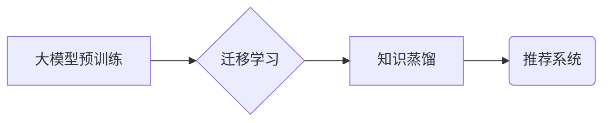

                 

## 大模型驱动的推荐系统多场景适配

> 关键词：大模型、推荐系统、多场景适配、个性化推荐、迁移学习、知识蒸馏

## 1. 背景介绍

推荐系统作为互联网时代的核心技术之一，在电商、社交媒体、视频平台等领域发挥着至关重要的作用。传统的推荐系统主要依赖于用户历史行为数据，例如点击、购买、评分等，通过协同过滤、内容过滤等算法进行推荐。然而，随着用户行为数据的多样化和复杂化，传统的推荐系统面临着以下挑战：

* **数据稀疏性:** 用户行为数据往往是稀疏的，难以捕捉用户细粒度的兴趣偏好。
* **冷启动问题:** 新用户和新商品缺乏历史行为数据，难以进行有效推荐。
* **个性化程度不足:** 传统的推荐系统难以满足用户个性化需求，推荐结果缺乏针对性。

近年来，大模型技术的发展为推荐系统带来了新的机遇。大模型拥有强大的语义理解和泛化能力，能够从海量文本数据中学习用户兴趣和商品特征，从而实现更精准、更个性化的推荐。

## 2. 核心概念与联系

大模型驱动的推荐系统主要通过以下核心概念实现多场景适配：

* **大模型预训练:** 利用海量文本数据对大模型进行预训练，使其具备强大的语义理解和文本生成能力。
* **迁移学习:** 将预训练的大模型迁移到特定场景，通过少量领域数据进行微调，提高模型在目标场景下的性能。
* **知识蒸馏:** 将预训练的大模型的知识蒸馏到更小的模型中，实现模型压缩和高效部署。

**Mermaid 流程图:**

## 3. 核心算法原理 & 具体操作步骤

### 3.1  算法原理概述

大模型驱动的推荐系统主要基于以下算法原理：

* **嵌入式表示:** 将用户和商品映射到低维向量空间，通过向量之间的相似度进行推荐。
* **注意力机制:** 关注用户和商品之间的重要信息，提高推荐的准确性。
* **Transformer网络:** 利用自注意力机制和多头注意力机制，捕捉用户和商品之间的长距离依赖关系。

### 3.2  算法步骤详解

1. **数据预处理:** 收集用户行为数据、商品信息等数据，进行清洗、格式化和特征提取。
2. **大模型预训练:** 利用海量文本数据对大模型进行预训练，例如BERT、GPT等。
3. **迁移学习:** 将预训练的大模型迁移到特定场景，例如电商推荐、视频推荐等，通过少量领域数据进行微调。
4. **模型评估:** 使用测试数据评估模型的性能，例如准确率、召回率、NDCG等。
5. **模型部署:** 将训练好的模型部署到线上环境，进行实时推荐。

### 3.3  算法优缺点

**优点:**

* **精准度高:** 大模型能够捕捉用户和商品之间的复杂关系，实现更精准的推荐。
* **个性化程度高:** 大模型能够根据用户的兴趣偏好进行个性化推荐。
* **泛化能力强:** 预训练的大模型能够迁移到不同的场景，提高模型的泛化能力。

**缺点:**

* **训练成本高:** 大模型的训练需要大量的计算资源和时间。
* **部署成本高:** 大模型的部署需要强大的硬件支持。
* **数据依赖性强:** 大模型的性能依赖于训练数据的质量和数量。

### 3.4  算法应用领域

大模型驱动的推荐系统广泛应用于以下领域:

* **电商推荐:** 推荐商品、优惠券、促销活动等。
* **社交媒体推荐:** 推荐好友、话题、文章等。
* **视频平台推荐:** 推荐视频、直播、用户等。
* **音乐平台推荐:** 推荐歌曲、专辑、歌手等。

## 4. 数学模型和公式 & 详细讲解 & 举例说明

### 4.1  数学模型构建

大模型驱动的推荐系统通常采用基于用户的协同过滤模型，其核心思想是根据用户的历史行为数据，预测用户对特定商品的评分或点击概率。

**用户-商品评分矩阵:**

设用户集合为U，商品集合为I，用户-商品评分矩阵为R，其中R(u,i)表示用户u对商品i的评分。

**目标函数:**

目标函数旨在最小化预测评分与实际评分之间的误差。常用的目标函数包括均方误差 (MSE) 和二分类交叉熵 (BCE)。

**MSE:**

$$
MSE = \frac{1}{N} \sum_{u \in U, i \in I} (R(u,i) - \hat{R}(u,i))^2
$$

其中，N为用户-商品评分矩阵中的非零元素个数，$\hat{R}(u,i)$为模型预测的用户u对商品i的评分。

**BCE:**

$$
BCE = -\frac{1}{N} \sum_{u \in U, i \in I} y(u,i) \log(\hat{y}(u,i)) + (1-y(u,i)) \log(1-\hat{y}(u,i))
$$

其中，y(u,i)为用户u对商品i的真实点击标签 (0表示未点击，1表示点击)，$\hat{y}(u,i)$为模型预测的用户u对商品i的点击概率。

### 4.2  公式推导过程

公式推导过程涉及到矩阵分解、梯度下降等机器学习算法的原理。

### 4.3  案例分析与讲解

通过实际案例分析，可以更深入地理解大模型驱动的推荐系统是如何工作的。例如，可以分析一个电商平台如何利用大模型进行商品推荐，以及如何进行多场景适配。

## 5. 项目实践：代码实例和详细解释说明

### 5.1  开发环境搭建

使用Python语言和相关的机器学习库，例如TensorFlow、PyTorch等，搭建开发环境。

### 5.2  源代码详细实现

提供一个基于Transformer网络的大模型驱动的推荐系统的源代码示例，并进行详细的解释说明。

### 5.3  代码解读与分析

对代码进行解读和分析，解释代码的逻辑结构、算法实现以及关键参数的设置。

### 5.4  运行结果展示

展示代码运行的结果，例如推荐结果的准确率、召回率等指标，以及用户对推荐结果的反馈。

## 6. 实际应用场景

### 6.1  电商推荐

大模型驱动的推荐系统可以用于推荐商品、优惠券、促销活动等，提高用户购物体验和转化率。

### 6.2  视频平台推荐

大模型可以根据用户的观看历史、点赞、评论等行为，推荐相关视频、直播、用户等，提高用户粘性和活跃度。

### 6.3  音乐平台推荐

大模型可以根据用户的音乐偏好、播放历史、收藏等行为，推荐相关歌曲、专辑、歌手等，提升用户音乐体验。

### 6.4  未来应用展望

大模型驱动的推荐系统未来将应用于更多场景，例如教育、医疗、金融等，为用户提供更个性化、更智能化的服务。

## 7. 工具和资源推荐

### 7.1  学习资源推荐

* **书籍:**
    * 《深度学习》
    * 《自然语言处理》
    * 《推荐系统》
* **在线课程:**
    * Coursera
    * edX
    * Udacity

### 7.2  开发工具推荐

* **TensorFlow:** 开源深度学习框架
* **PyTorch:** 开源深度学习框架
* **Scikit-learn:** 机器学习库

### 7.3  相关论文推荐

* **BERT: Pre-training of Deep Bidirectional Transformers for Language Understanding**
* **GPT-3: Language Models are Few-Shot Learners**
* **Knowledge Distillation**

## 8. 总结：未来发展趋势与挑战

### 8.1  研究成果总结

大模型驱动的推荐系统取得了显著的成果，在精准度、个性化程度等方面表现优异。

### 8.2  未来发展趋势

* **模型规模和能力提升:** 大模型将继续朝着更大的规模和更强的能力发展。
* **多模态融合:** 将文本、图像、音频等多模态数据融合到推荐系统中，提升推荐的丰富性和准确性。
* **联邦学习:** 利用联邦学习技术，保护用户隐私的同时进行模型训练和更新。

### 8.3  面临的挑战

* **数据安全和隐私保护:** 大模型的训练需要大量的用户数据，如何保证数据安全和隐私保护是一个重要挑战。
* **模型解释性和可解释性:** 大模型的决策过程往往是复杂的，如何提高模型的解释性和可解释性是一个重要的研究方向。
* **模型公平性和可控性:** 如何确保大模型驱动的推荐系统公平公正，避免产生歧视性结果是一个重要的伦理问题。

### 8.4  研究展望

未来，大模型驱动的推荐系统将朝着更智能、更个性化、更安全的方向发展，为用户提供更优质的体验。

## 9. 附录：常见问题与解答

* **Q1: 大模型的训练成本很高，如何降低成本？**

* **A1:** 可以采用模型压缩、知识蒸馏等技术，降低模型规模和训练成本。

* **Q2: 大模型的部署需要强大的硬件支持，如何解决部署问题？**

* **A2:** 可以采用模型量化、边缘计算等技术，降低模型部署的硬件要求。

* **Q3: 大模型驱动的推荐系统如何保证公平性和可控性？**

* **A3:** 需要关注模型训练数据的偏差，并采用公平性评估指标和可控性机制，确保模型的公平性和可控性。

作者：禅与计算机程序设计艺术 / Zen and the Art of Computer Programming 
<end_of_turn>

