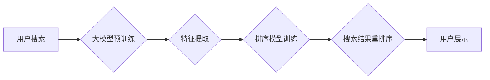

                 

## 大模型驱动的电商个性化搜索结果重排序

> 关键词：大模型、电商搜索、个性化推荐、重排序、Transformer、BERT、深度学习

## 1. 背景介绍

在当今数据爆炸的时代，电商平台面临着海量商品和用户需求的挑战。传统的基于关键词匹配的搜索算法难以满足用户个性化需求，搜索结果往往缺乏针对性和相关性。为了提升用户体验，电商平台纷纷探索个性化搜索解决方案。

大模型技术近年来取得了突破性进展，其强大的语义理解和文本生成能力为电商个性化搜索提供了新的思路。大模型驱动的电商个性化搜索结果重排序，通过学习用户行为、商品特征和搜索上下文等信息，对搜索结果进行重新排序，从而提供更精准、更符合用户偏好的搜索结果。

## 2. 核心概念与联系

### 2.1  电商搜索结果重排序

电商搜索结果重排序是指在用户提交搜索请求后，对初始搜索结果进行重新排序，以提升用户体验和转化率。传统的重排序算法主要基于特征工程和规则匹配，例如：

* **商品销量、评分、价格等特征:**  将商品的销量、评分、价格等特征作为排序依据，优先展示热门商品。
* **用户历史行为:**  根据用户的浏览历史、购买记录等信息，推荐用户可能感兴趣的商品。
* **搜索词语分析:**  分析用户搜索词语的语义和意图，推荐相关商品。

然而，这些传统算法难以捕捉用户需求的复杂性和多样性，且需要大量的特征工程和规则设计，维护成本高。

### 2.2  大模型技术

大模型是指参数规模庞大、训练数据海量的人工智能模型。近年来，Transformer模型的出现极大地推动了大模型的发展。Transformer模型通过自注意力机制，能够捕捉文本序列中的长距离依赖关系，具有强大的语义理解能力。

BERT（Bidirectional Encoder Representations from Transformers）是基于Transformer模型的预训练语言模型，在自然语言理解任务上取得了优异的成绩。BERT通过双向编码，能够更好地理解文本的上下文信息，从而提升语义理解能力。

### 2.3  大模型驱动的电商搜索结果重排序

大模型技术为电商搜索结果重排序提供了新的思路。通过训练大模型，可以学习用户行为、商品特征和搜索上下文等信息，并根据这些信息对搜索结果进行重新排序。

**核心架构:**



## 3. 核心算法原理 & 具体操作步骤

### 3.1  算法原理概述

大模型驱动的电商搜索结果重排序主要基于深度学习技术，利用大模型的语义理解能力和排序模型的精准度，实现个性化搜索结果的重排序。

具体来说，该算法流程如下：

1. **数据预处理:** 收集用户行为数据、商品特征数据和搜索上下文数据，并进行清洗、转换和编码。
2. **大模型预训练:** 利用预训练语言模型，例如BERT，对数据进行语义编码，提取用户行为、商品特征和搜索上下文等信息。
3. **特征提取:** 从大模型的语义编码中提取特征，例如用户兴趣、商品属性、搜索意图等。
4. **排序模型训练:** 利用提取的特征，训练排序模型，例如深度神经网络，以预测商品的排序得分。
5. **搜索结果重排序:** 根据排序模型的预测结果，对搜索结果进行重新排序，并展示给用户。

### 3.2  算法步骤详解

1. **数据预处理:**

* **用户行为数据:** 包括用户浏览历史、购买记录、收藏记录、评论记录等。
* **商品特征数据:** 包括商品名称、描述、价格、分类、属性等。
* **搜索上下文数据:** 包括用户搜索词语、搜索时间、设备类型等。

数据预处理主要包括以下步骤：

* **数据清洗:** 去除重复数据、缺失数据和异常数据。
* **数据转换:** 将数据转换为模型可识别的格式，例如数值化、编码化等。
* **数据编码:** 将文本数据转换为数字向量，例如词嵌入、句子嵌入等。

2. **大模型预训练:**

* 选择预训练语言模型，例如BERT，并根据电商搜索场景进行微调。
* 利用预训练模型对数据进行语义编码，提取用户行为、商品特征和搜索上下文等信息。

3. **特征提取:**

* 从大模型的语义编码中提取特征，例如用户兴趣、商品属性、搜索意图等。
* 可以使用手工设计的特征提取规则，也可以使用深度学习模型进行特征提取。

4. **排序模型训练:**

* 选择排序模型，例如深度神经网络，并根据提取的特征进行训练。
* 训练目标是预测商品的排序得分，以便对搜索结果进行重新排序。

5. **搜索结果重排序:**

* 根据排序模型的预测结果，对搜索结果进行重新排序，并展示给用户。
* 可以根据用户偏好和搜索上下文进行动态调整排序规则。

### 3.3  算法优缺点

**优点:**

* **个性化推荐:** 可以根据用户的行为和偏好，提供更精准的搜索结果。
* **提升用户体验:** 提供更相关的搜索结果，提升用户购物体验。
* **提高转化率:** 更精准的推荐可以提高用户购买意愿，提升转化率。

**缺点:**

* **数据依赖:** 需要大量的用户行为数据和商品特征数据进行训练。
* **模型复杂:** 大模型的训练和部署需要强大的计算资源和技术支持。
* **可解释性:** 深度学习模型的决策过程难以解释，难以进行调试和优化。

### 3.4  算法应用领域

大模型驱动的电商个性化搜索结果重排序技术可以应用于以下领域:

* **电商搜索:** 提供更精准、更个性化的商品搜索结果。
* **推荐系统:** 推荐用户可能感兴趣的商品、服务或内容。
* **内容分类:** 自动分类和组织商品信息、用户评论等内容。
* **广告投放:** 根据用户兴趣和行为，精准投放广告。

## 4. 数学模型和公式 & 详细讲解 & 举例说明

### 4.1  数学模型构建

大模型驱动的电商搜索结果重排序通常采用深度学习模型进行实现，例如深度神经网络。

深度神经网络的数学模型可以表示为：

$$
y = f(W_1x_1 + b_1)
$$

其中：

* $y$ 是输出结果，即商品的排序得分。
* $x_1$ 是输入特征向量，包含用户行为、商品特征和搜索上下文等信息。
* $W_1$ 是权重矩阵，通过训练学习得到。
* $b_1$ 是偏置项，也是通过训练学习得到。
* $f$ 是激活函数，例如ReLU、Sigmoid等。

### 4.2  公式推导过程

深度神经网络的训练过程是通过反向传播算法来优化权重矩阵和偏置项。

反向传播算法的核心思想是：

1. 计算输出结果与真实值的误差。
2. 根据误差反向传播，计算每个神经元的梯度。
3. 利用梯度更新权重矩阵和偏置项，使得误差最小化。

具体的公式推导过程比较复杂，涉及到微积分和线性代数等知识。

### 4.3  案例分析与讲解

假设我们有一个电商平台，用户搜索“手机”。

* **用户行为数据:** 用户浏览历史包含“手机”、“相机”、“电脑”等关键词。
* **商品特征数据:** 商品信息包含“品牌”、“型号”、“价格”、“评价”等特征。
* **搜索上下文数据:** 搜索时间为下午2点，设备类型为手机。

大模型可以将这些数据进行语义编码，提取用户兴趣、商品属性和搜索意图等特征。

排序模型可以根据这些特征，预测商品的排序得分。例如，用户浏览历史包含“手机”关键词，那么搜索结果中包含“手机”的商品排序得分会更高。

## 5. 项目实践：代码实例和详细解释说明

### 5.1  开发环境搭建

* **操作系统:** Linux
* **编程语言:** Python
* **深度学习框架:** TensorFlow 或 PyTorch
* **大模型库:** HuggingFace Transformers

### 5.2  源代码详细实现

```python
# 导入必要的库
import tensorflow as tf
from transformers import BertTokenizer, BertModel

# 定义模型结构
class SearchRanker(tf.keras.Model):
    def __init__(self, bert_model_name):
        super(SearchRanker, self).__init__()
        self.bert = BertModel.from_pretrained(bert_model_name)
        self.dense = tf.keras.layers.Dense(1)

    def call(self, inputs):
        # 获取BERT的输出
        bert_output = self.bert(inputs)
        # 使用全连接层进行分类
        output = self.dense(bert_output[:, 0, :])
        return output

# 实例化模型
model = SearchRanker("bert-base-uncased")

# 定义损失函数和优化器
loss_fn = tf.keras.losses.MeanSquaredError()
optimizer = tf.keras.optimizers.Adam(learning_rate=1e-5)

# 训练模型
# ...

# 预测商品排序得分
def predict_rank(user_query, product_features):
    # 将用户查询和商品特征转换为BERT输入格式
    # ...
    # 获取模型预测结果
    scores = model(inputs)
    return scores

# 使用预测结果对搜索结果进行重排序
# ...
```

### 5.3  代码解读与分析

* **模型结构:** 该代码实现了一个基于BERT的搜索结果重排序模型。BERT模型用于提取用户查询和商品特征的语义信息，全连接层用于预测商品的排序得分。
* **训练过程:** 模型训练过程需要使用大量的用户行为数据和商品特征数据，并使用反向传播算法进行优化。
* **预测过程:** 预测商品排序得分时，需要将用户查询和商品特征转换为BERT输入格式，并通过模型进行预测。

### 5.4  运行结果展示

训练好的模型可以用于对电商搜索结果进行重排序，并展示给用户。

## 6. 实际应用场景

### 6.1  电商搜索结果个性化

大模型驱动的电商搜索结果重排序可以根据用户的历史行为、偏好和搜索上下文，提供更个性化的搜索结果，提升用户体验。

### 6.2  商品推荐

大模型可以学习用户兴趣和商品特征，并推荐用户可能感兴趣的商品，提升商品曝光率和转化率。

### 6.3  内容分类

大模型可以自动分类和组织商品信息、用户评论等内容，方便用户查找和浏览。

### 6.4  未来应用展望

大模型驱动的电商搜索结果重排序技术未来将更加智能化和个性化。

* **多模态搜索:** 将文本、图像、视频等多模态信息融合到搜索结果重排序中，提供更丰富的搜索体验。
* **实时个性化:** 基于用户的实时行为和上下文信息，动态调整排序规则，提供更精准的个性化推荐。
* **跨平台搜索:** 将大模型部署到移动端、智能音箱等多个平台，实现跨平台的个性化搜索体验。

## 7. 工具和资源推荐

### 7.1  学习资源推荐

* **书籍:**
    * 《深度学习》 by Ian Goodfellow, Yoshua Bengio, Aaron Courville
    * 《自然语言处理》 by Dan Jurafsky, James H. Martin
* **在线课程:**
    * Coursera: Deep Learning Specialization
    * Udacity: Deep Learning Nanodegree
* **博客和网站:**
    * TensorFlow Blog: https://blog.tensorflow.org/
    * PyTorch Blog: https://pytorch.org/blog/

### 7.2  开发工具推荐

* **深度学习框架:** TensorFlow, PyTorch
* **大模型库:** HuggingFace Transformers
* **云计算平台:** AWS, Azure, GCP

### 7.3  相关论文推荐

* BERT: Pre-training of Deep Bidirectional Transformers for Language Understanding
* Transformer: Attention Is All You Need
* XLNet: Generalized Autoregressive Pretraining for Language Understanding

## 8. 总结：未来发展趋势与挑战

### 8.1  研究成果总结

大模型驱动的电商个性化搜索结果重排序技术取得了显著的成果，能够提供更精准、更个性化的搜索体验，提升用户满意度和转化率。

### 8.2  未来发展趋势

未来，大模型驱动的电商搜索结果重排序技术将朝着以下方向发展:

* **多模态搜索:** 将文本、图像、视频等多模态信息融合到搜索结果重排序中，提供更丰富的搜索体验。
* **实时个性化:** 基于用户的实时行为和上下文信息，动态调整排序规则，提供更精准的个性化推荐。
* **跨平台搜索:** 将大模型部署到移动端、智能音箱等多个平台，实现跨平台的个性化搜索体验。

### 8.3  面临的挑战

大模型驱动的电商搜索结果重排序技术也面临着一些挑战:

* **数据依赖:** 需要大量的用户行为数据和商品特征数据进行训练。
* **模型复杂:** 大模型的训练和部署需要强大的计算资源和技术支持。
* **可解释性:** 深度学习模型的决策过程难以解释，难以进行调试和优化。

### 8.4  研究展望

未来，需要进一步研究以下问题:

* 如何提高大模型的训练效率和模型压缩率。
* 如何增强大模型的可解释性和鲁棒性。
* 如何将大模型应用于更多电商场景，例如商品推荐、内容分类等。

## 9. 附录：常见问题与解答

**Q1: 大模型的训练需要多少数据？**

A1: 大模型的训练需要大量的训练数据，通常需要百万甚至数十亿条数据。

**Q2: 如何评估大模型的性能？**

A2: 大模型的性能可以评估指标，例如准确率、召回率、F1-score等。

**Q3: 如何部署大模型？**

A3: 大模型可以部署到云端服务器、边缘设备等平台。

**Q4: 大模型的训练成本高吗？**

A4: 大模型的训练成本较高，需要强大的计算资源和电力消耗。

**Q5: 大模型的安全性如何保证？**

A5: 大模型的安全性需要通过数据安全、模型安全和部署安全等多方面措施来保障。


作者：禅与计算机程序设计艺术 / Zen and the Art of Computer Programming<end_of_turn>

