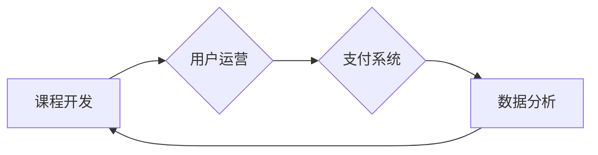

                 

## 如何利用微信小程序开展知识付费业务

> 关键词：微信小程序、知识付费、课程开发、用户运营、支付系统、数据分析

## 1. 背景介绍

近年来，随着互联网技术的快速发展和移动互联网的普及，知识付费行业呈现出爆发式增长。人们对知识的需求日益增长，而微信小程序作为一款轻量级、便捷易用的移动应用平台，为知识付费提供了新的发展机遇。

微信小程序拥有庞大的用户群体、完善的生态系统和便捷的支付功能，这些优势使其成为开展知识付费业务的理想平台。

### 1.1  知识付费行业现状

知识付费是指通过付费的方式获取知识、技能和服务的商业模式。近年来，知识付费行业发展迅速，涵盖了各个领域，例如教育培训、专业技能、兴趣爱好等。

* **市场规模庞大:**  中国知识付费市场规模持续增长，预计未来几年将保持高速发展态势。
* **用户群体广泛:**  知识付费的用户群体涵盖了各个年龄段、职业和阶层，需求旺盛。
* **模式多样化:**  知识付费的模式多种多样，包括在线课程、直播讲座、付费咨询、会员体系等。

### 1.2  微信小程序的优势

微信小程序作为一款轻量级、便捷易用的移动应用平台，拥有以下优势：

* **用户群体庞大:** 微信拥有超过12亿活跃用户，小程序可以轻松触达目标用户。
* **开发成本低:** 小程序开发门槛低，开发周期短，适合中小企业和个人开发者。
* **生态系统完善:** 微信生态系统完善，提供丰富的第三方服务和工具，方便开发者开发和运营小程序。
* **支付功能便捷:** 微信支付功能成熟稳定，用户支付体验良好。

## 2. 核心概念与联系

微信小程序知识付费业务的核心概念包括：课程开发、用户运营、支付系统、数据分析等。

**核心概念原理和架构：**



### 2.1 课程开发

课程开发是知识付费业务的基础，需要精心设计课程内容、制作优质课程素材、选择合适的教学方式等。

* **内容策划:**  根据目标用户需求和市场趋势，策划优质、有价值的课程内容。
* **素材制作:**  制作高质量的课程视频、音频、文档等素材，提升用户学习体验。
* **教学方式:**  选择合适的教学方式，例如直播讲座、录播课程、互动练习等，提高用户参与度。

### 2.2 用户运营

用户运营是知识付费业务的关键环节，需要通过多种方式吸引用户、提升用户粘性、促进用户转化。

* **用户获取:**  通过微信公众号、朋友圈、广告投放等渠道，吸引目标用户关注小程序。
* **用户留存:**  提供优质的课程内容、互动社区、个性化推荐等，提升用户留存率。
* **用户转化:**  通过优惠活动、限时抢购、会员体系等，引导用户付费购买课程。

### 2.3 支付系统

支付系统是知识付费业务的保障，需要选择安全可靠的支付平台，保障用户资金安全。

* **支付平台选择:**  选择微信支付、支付宝等主流支付平台，确保支付安全稳定。
* **支付流程优化:**  简化支付流程，降低用户支付门槛，提升用户支付体验。
* **资金管理:**  建立完善的资金管理制度，保障资金安全和透明度。

### 2.4 数据分析

数据分析是知识付费业务的驱动力，需要通过数据分析，了解用户行为、优化课程内容、提升运营效率。

* **用户行为分析:**  分析用户访问、学习、付费等行为，了解用户需求和痛点。
* **课程效果评估:**  评估课程的学习效果、用户满意度等，不断优化课程内容和教学方式。
* **运营策略优化:**  根据数据分析结果，优化用户运营策略，提升用户获取、留存和转化率。

## 3. 核心算法原理 & 具体操作步骤

### 3.1 算法原理概述

知识付费业务中，常用的算法包括推荐算法、用户画像算法、课程效果评估算法等。

* **推荐算法:**  根据用户的学习历史、兴趣偏好等信息，推荐合适的课程，提升用户学习体验。
* **用户画像算法:**  通过分析用户的行为数据，构建用户画像，了解用户的学习习惯、兴趣爱好等，为用户提供个性化服务。
* **课程效果评估算法:**  通过分析用户的学习进度、考试成绩等数据，评估课程的学习效果，为课程改进提供依据。

### 3.2 算法步骤详解

**推荐算法步骤:**

1. **数据收集:** 收集用户的学习历史、课程浏览记录、评分反馈等数据。
2. **数据预处理:** 对数据进行清洗、转换、特征提取等处理，构建用户-课程交互矩阵。
3. **模型训练:** 选择合适的推荐算法模型，例如协同过滤、内容推荐、深度学习等，对用户-课程交互矩阵进行训练。
4. **模型预测:**  根据训练好的模型，预测用户对不同课程的兴趣评分，并推荐用户感兴趣的课程。

**用户画像算法步骤:**

1. **数据收集:** 收集用户的基本信息、学习行为、兴趣爱好等数据。
2. **数据聚类:**  使用聚类算法将用户划分为不同的用户群体，例如学生、职场人士、兴趣爱好者等。
3. **特征提取:**  对每个用户群体进行特征提取，例如学习习惯、兴趣偏好、消费能力等。
4. **用户画像构建:**  根据特征提取结果，构建每个用户群体的画像，描述其特点和需求。

### 3.3 算法优缺点

**推荐算法:**

* **优点:**  能够根据用户的兴趣偏好推荐个性化课程，提升用户学习体验。
* **缺点:**  需要大量的用户数据进行训练，算法效果依赖于数据质量。

**用户画像算法:**

* **优点:**  能够深入了解用户的学习习惯和兴趣爱好，为用户提供更精准的个性化服务。
* **缺点:**  需要复杂的算法模型和数据分析能力，数据隐私保护也需要引起重视。

### 3.4 算法应用领域

推荐算法和用户画像算法广泛应用于知识付费业务的各个环节，例如：

* **课程推荐:**  根据用户的学习历史和兴趣偏好，推荐合适的课程。
* **用户分群:**  根据用户的学习习惯和兴趣爱好，将用户划分为不同的用户群体，提供个性化服务。
* **内容创作:**  根据用户画像分析，创作更符合用户需求的课程内容。
* **营销推广:**  根据用户画像分析，精准投放广告，提升营销效果。

## 4. 数学模型和公式 & 详细讲解 & 举例说明

### 4.1 数学模型构建

推荐算法中常用的数学模型包括协同过滤模型和内容推荐模型。

**协同过滤模型:**

协同过滤模型基于用户的行为相似性进行推荐。假设用户 $u$ 和用户 $v$ 对课程 $i$ 和课程 $j$ 的评分分别为 $r_{ui}$、$r_{uj}$、$r_{vi}$、$r_{vj}$，则用户 $u$ 对课程 $j$ 的评分预测值可以表示为：

$$
\hat{r}_{uj} = \bar{r}_u + \frac{\text{sim}(u,v) \cdot (r_{vi} - \bar{r}_v)}{\text{sim}(u,v) \cdot (r_{vi} - \bar{r}_v) + \epsilon}
$$

其中：

* $\bar{r}_u$ 和 $\bar{r}_v$ 分别表示用户 $u$ 和用户 $v$ 的平均评分。
* $\text{sim}(u,v)$ 表示用户 $u$ 和用户 $v$ 之间的相似度。
* $\epsilon$ 是一个小的常数，用于避免分母为零。

**内容推荐模型:**

内容推荐模型基于课程内容的特征进行推荐。假设课程 $i$ 的特征向量为 $x_i$，用户 $u$ 的偏好向量为 $w_u$，则用户 $u$ 对课程 $i$ 的评分预测值可以表示为：

$$
\hat{r}_{ui} = w_u \cdot x_i
$$

### 4.2 公式推导过程

协同过滤模型的公式推导过程基于用户的行为相似性，通过计算用户之间的相似度，预测用户对课程的评分。

内容推荐模型的公式推导过程基于课程内容的特征，通过计算用户偏好向量和课程特征向量的内积，预测用户对课程的评分。

### 4.3 案例分析与讲解

**协同过滤模型案例:**

假设有两个用户 $u$ 和 $v$，他们都对课程 $i$ 和课程 $j$ 进行评分。用户 $u$ 对课程 $i$ 的评分为 5，对课程 $j$ 的评分为 4；用户 $v$ 对课程 $i$ 的评分为 4，对课程 $j$ 的评分为 5。

根据协同过滤模型，我们可以计算用户 $u$ 和用户 $v$ 之间的相似度，并预测用户 $u$ 对课程 $j$ 的评分。

**内容推荐模型案例:**

假设课程 $i$ 的特征向量为 $[1, 2, 3]$，用户 $u$ 的偏好向量为 $[0.5, 1, 0.2]$。

根据内容推荐模型，我们可以计算用户 $u$ 对课程 $i$ 的评分预测值：

$$
\hat{r}_{ui} = [0.5, 1, 0.2] \cdot [1, 2, 3] = 0.5 + 2 + 0.6 = 3.1
$$

## 5. 项目实践：代码实例和详细解释说明

### 5.1 开发环境搭建

微信小程序开发环境搭建步骤如下：

1. 下载并安装微信开发者工具。
2. 创建微信小程序项目。
3. 配置微信小程序的appid和secret。

### 5.2 源代码详细实现

以下是一个简单的微信小程序知识付费业务的代码示例：

```javascript
// pages/course/course.js
Page({
  data: {
    courses: [
      {
        id: 1,
        title: '课程一',
        price: 99,
        description: '课程一介绍',
      },
      {
        id: 2,
        title: '课程二',
        price: 199,
        description: '课程二介绍',
      },
    ],
  },
  // 课程详情页跳转
  onCourseTap(event) {
    const courseId = event.currentTarget.dataset.id;
    wx.navigateTo({
      url: `/pages/course-detail/course-detail?id=${courseId}`,
    });
  },
});
```

### 5.3 代码解读与分析

* `data` 属性定义了课程列表数据。
* `onCourseTap` 方法处理用户点击课程卡片的事件，跳转到课程详情页。

### 5.4 运行结果展示

运行代码后，用户可以在小程序页面看到课程列表，点击课程卡片可以跳转到课程详情页。

## 6. 实际应用场景

微信小程序知识付费业务的应用场景广泛，例如：

* **在线教育:**  提供在线课程、直播讲座、互动练习等服务。
* **专业技能培训:**  提供专业技能培训课程，例如编程、设计、营销等。
* **兴趣爱好学习:**  提供兴趣爱好学习课程，例如绘画、音乐、写作等。
* **会员体系:**  提供会员体系，用户可以通过付费订阅获得专属课程、资源和服务。

### 6.4 未来应用展望

未来，微信小程序知识付费业务将朝着以下方向发展：

* **更个性化的课程推荐:**  利用人工智能技术，更加精准地推荐用户感兴趣的课程。
* **更丰富的互动体验:**  通过直播、互动练习、社区等方式，提升用户学习体验。
* **更完善的支付体系:**  支持多种支付方式，保障用户资金安全。
* **更强大的数据分析能力:**  通过数据分析，了解用户需求，优化课程内容和运营策略。

## 7. 工具和资源推荐

### 7.1 学习资源推荐

* **微信小程序官方文档:** https://developers.weixin.qq.com/miniprogram/dev/
* **微信小程序开发教程:** https://www.bilibili.com/video/BV1z5411p71g
* **微信小程序社区:** https://developers.weixin.qq.com/community/

### 7.2 开发工具推荐

* **微信开发者工具:** https://developers.weixin.qq.com/miniprogram/dev/devtools/
* **VSCode:** https://code.visualstudio.com/
* **WebStorm:** https://www.jetbrains.com/webstorm/

### 7.3 相关论文推荐

* **Collaborative Filtering for Recommender Systems:** https://dl.acm.org/doi/10.1145/3062596.3062601
* **Content-Based Recommendation Systems:** https://dl.acm.org/doi/10.1145/2939672.2939702

## 8. 总结：未来发展趋势与挑战

### 8.1 研究成果总结

微信小程序知识付费业务发展迅速，取得了显著成果，为用户提供了便捷、高效的学习体验。

### 8.2 未来发展趋势

未来，微信小程序知识付费业务将朝着更个性化、更互动、更智能的方向发展。

### 8.3 面临的挑战

微信小程序知识付费业务也面临着一些挑战，例如：

* **内容质量控制:**  保证课程内容的质量和权威性。
* **用户隐私保护:**  妥善处理用户数据，保障用户隐私安全。
* **竞争加剧:**  市场竞争日益激烈，需要不断创新和提升服务质量。

### 8.4 研究展望

未来，我们需要继续研究和探索微信小程序知识付费业务的创新模式和发展趋势，为用户提供更优质的学习体验。

## 9. 附录：常见问题与解答

**常见问题:**

* **如何开发微信小程序知识付费业务？**

**解答:**  

开发微信小程序知识付费业务需要以下步骤：

1. 熟悉微信小程序开发规范和技术。
2. 设计课程内容和教学方式。
3. 开发小程序前端和后端代码。
4. 配置微信支付功能。
5. 进行测试和发布。

* **如何保证课程内容的质量？**

**解答:**  

保证课程内容的质量可以通过以下方式：

1. 邀请专业老师或专家授课。
2. 对课程内容进行严格审核和校对。
3. 收集用户反馈，不断改进课程内容。

* **如何保护用户隐私？**

**解答:**  

保护用户隐私可以通过以下方式：

1. 明确用户数据收集和使用范围。
2. 使用加密技术保护用户数据安全。
3. 遵守相关法律法规，保障用户隐私权。


作者：禅与计算机程序设计艺术 / Zen and the Art of Computer Programming<end_of_turn>

