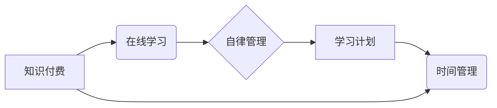

                 

## 如何利用知识付费实现在线学习计划与自律管理？

> 关键词：知识付费、在线学习、自律管理、学习计划、时间管理、效率提升

### 1. 背景介绍

在当今信息爆炸的时代，获取知识变得前所未有的便捷。知识付费平台的兴起，为人们提供了海量优质的在线学习资源，也催生了新的学习模式和思维方式。然而，面对如此丰富的学习内容，如何有效地利用知识付费资源，制定合理的学习计划，并保持自律管理，成为了许多学习者面临的挑战。

### 2. 核心概念与联系

**2.1 知识付费**

知识付费是指知识产权持有者将知识、技能、经验等转化为商品或服务，通过付费的方式向用户提供学习和提升的机会。它打破了传统教育模式的限制，让知识更加民主化、个性化和便捷化。

**2.2 在线学习**

在线学习是指利用互联网技术，通过网络平台进行学习的模式。它不受时间和地域的限制，提供了灵活、便捷的学习体验。

**2.3 自律管理**

自律管理是指个体能够自我约束，按照计划和目标进行学习和工作，并不断提升自我管理能力。它对于在线学习的成功至关重要，能够帮助学习者克服拖延、保持专注，最终实现学习目标。

**2.4 学习计划**

学习计划是指学习者根据自身目标、时间安排和学习内容，制定的一系列学习步骤和安排。它为学习者提供了一个清晰的学习路线，帮助他们有效地利用时间和资源。

**2.5 时间管理**

时间管理是指合理规划和利用时间，提高学习效率和生活质量。它对于在线学习者尤为重要，帮助他们平衡学习、工作和生活，避免时间浪费。

**核心概念关系图:**



### 3. 核心算法原理 & 具体操作步骤

**3.1 算法原理概述**

在线学习计划与自律管理的核心算法原理可以概括为：

* **目标分解:** 将大目标分解成小目标，更容易实现。
* **时间分配:** 根据学习内容和个人情况，合理分配学习时间。
* **进度追踪:** 定期跟踪学习进度，及时调整计划。
* **反馈机制:** 收集学习反馈，不断优化学习方法。
* **激励机制:** 设置奖励机制，增强学习动力。

**3.2 算法步骤详解**

1. **明确学习目标:** 首先要明确自己的学习目标，例如想学习某个编程语言、掌握某个技能、提升某个领域知识等。
2. **选择学习资源:** 根据学习目标，选择合适的知识付费平台和课程。
3. **制定学习计划:** 将学习目标分解成小目标，并根据个人时间安排制定详细的学习计划，包括每天学习时间、学习内容、学习方法等。
4. **利用时间管理工具:** 使用番茄工作法、时间阻塞法等时间管理工具，提高学习效率。
5. **保持自律管理:** 坚持执行学习计划，克服拖延，保持专注。
6. **定期跟踪进度:** 定期回顾学习进度，及时调整计划，确保学习目标的实现。
7. **收集学习反馈:** 反思学习过程，总结经验教训，不断优化学习方法。
8. **设置奖励机制:** 为自己设定学习目标达成后的奖励，增强学习动力。

**3.3 算法优缺点**

**优点:**

* **个性化学习:** 可以根据个人学习目标和进度定制学习计划。
* **高效学习:** 通过时间管理和自律管理，提高学习效率。
* **持续学习:** 可以形成良好的学习习惯，持续学习和提升。

**缺点:**

* **需要自律性:** 需要学习者具备较强的自律性，才能坚持执行学习计划。
* **容易疲劳:** 长时间学习可能会导致学习疲劳，需要合理安排休息时间。
* **缺乏互动:** 在线学习缺乏面对面的互动，可能会影响学习效果。

**3.4 算法应用领域**

* **在线教育:** 在线学习平台可以利用该算法为用户提供个性化学习计划和自律管理工具。
* **个人成长:** 个人可以利用该算法制定自己的学习计划，提升个人技能和知识水平。
* **企业培训:** 企业可以利用该算法为员工提供在线培训，提高员工技能和工作效率。

### 4. 数学模型和公式 & 详细讲解 & 举例说明

**4.1 数学模型构建**

我们可以用一个简单的数学模型来描述学习进度和时间的关系：

```latex
P(t) = P_0 + r * t
```

其中：

* $P(t)$ 表示学习进度在时间 $t$ 时的值。
* $P_0$ 表示初始学习进度。
* $r$ 表示学习速度，即单位时间内学习的进度。
* $t$ 表示学习时间。

**4.2 公式推导过程**

该公式的推导过程基于以下假设：

* 学习速度保持恒定。
* 学习进度是时间函数。

根据这些假设，我们可以推导出上述公式。

**4.3 案例分析与讲解**

假设一个学习者想要学习一门编程语言，总共需要学习 100 个小时才能掌握。学习者每天学习 2 小时，初始学习进度为 0。

根据公式，我们可以计算学习进度：

* $P(t) = 0 + 2 * t$
* 当 $t = 50$ 时，$P(50) = 2 * 50 = 100$

这意味着学习者在学习 50 小时后，就能掌握这门编程语言。

### 5. 项目实践：代码实例和详细解释说明

**5.1 开发环境搭建**

为了实现在线学习计划和自律管理的功能，我们可以使用 Python 语言开发一个简单的应用程序。

所需环境：

* Python 3.x
* Jupyter Notebook

**5.2 源代码详细实现**

```python
class LearningPlan:
    def __init__(self, goal, duration, daily_time):
        self.goal = goal
        self.duration = duration
        self.daily_time = daily_time
        self.progress = 0

    def update_progress(self, time_spent):
        self.progress += time_spent
        print(f"学习进度: {self.progress / self.duration * 100:.2f}%")

    def check_completion(self):
        if self.progress >= self.duration:
            print("恭喜你完成学习目标!")
        else:
            print(f"还有 {self.duration - self.progress} 小时需要学习")

# 创建学习计划
plan = LearningPlan(goal="学习 Python 编程", duration=100, daily_time=2)

# 模拟学习过程
for i in range(50):
    plan.update_progress(plan.daily_time)

# 检查学习完成情况
plan.check_completion()
```

**5.3 代码解读与分析**

该代码定义了一个 `LearningPlan` 类，用于表示学习计划。

* `__init__` 方法初始化学习计划的属性，包括学习目标、总学习时间、每天学习时间和当前学习进度。
* `update_progress` 方法更新学习进度，并打印当前学习进度。
* `check_completion` 方法检查学习是否完成，并打印相应的提示信息。

**5.4 运行结果展示**

运行该代码后，会输出学习进度信息，并最终提示学习目标已完成。

### 6. 实际应用场景

**6.1 在线教育平台**

在线教育平台可以利用该算法为用户提供个性化学习计划和自律管理工具，帮助用户更好地学习和掌握知识。

**6.2 个人学习管理**

个人可以利用该算法制定自己的学习计划，并使用时间管理工具提高学习效率。

**6.3 企业培训**

企业可以利用该算法为员工提供在线培训，并跟踪员工学习进度，确保培训效果。

**6.4 未来应用展望**

随着人工智能技术的不断发展，在线学习计划和自律管理将更加智能化和个性化。未来，我们可以期待看到：

* 基于人工智能的学习计划推荐系统，能够根据用户的学习目标、学习风格和学习进度，推荐最适合的学习计划。
* 基于机器学习的学习效率评估系统，能够实时评估用户的学习效率，并提供个性化的学习建议。
* 基于虚拟现实技术的沉浸式学习体验，能够更加直观地帮助用户理解和掌握知识。

### 7. 工具和资源推荐

**7.1 学习资源推荐**

* **Coursera:** https://www.coursera.org/
* **edX:** https://www.edx.org/
* **Udemy:** https://www.udemy.com/
* **Khan Academy:** https://www.khanacademy.org/

**7.2 开发工具推荐**

* **Python:** https://www.python.org/
* **Jupyter Notebook:** https://jupyter.org/

**7.3 相关论文推荐**

* **Personalized Learning Systems: A Survey**
* **Adaptive Learning Systems: A Survey**
* **The Role of Artificial Intelligence in Education**

### 8. 总结：未来发展趋势与挑战

**8.1 研究成果总结**

在线学习计划和自律管理的研究取得了显著成果，为人们提供了更加便捷、高效和个性化的学习方式。

**8.2 未来发展趋势**

未来，在线学习计划和自律管理将更加智能化、个性化和沉浸式。

**8.3 面临的挑战**

* 如何更好地理解用户的学习需求和学习风格。
* 如何开发更加智能和有效的学习推荐系统。
* 如何提高在线学习的互动性和参与度。

**8.4 研究展望**

未来研究将重点关注以下几个方面：

* 基于深度学习的个性化学习计划推荐系统。
* 基于自然语言处理的学习内容理解和生成。
* 基于虚拟现实技术的沉浸式学习体验。

### 9. 附录：常见问题与解答

**9.1 如何制定有效的学习计划？**

制定有效的学习计划需要考虑以下几个因素：

* 学习目标
* 学习时间
* 学习内容
* 学习方法

**9.2 如何保持自律管理？**

保持自律管理需要：

* 制定明确的学习目标
* 使用时间管理工具
* 设定奖励机制
* 避免干扰

**9.3 如何克服学习疲劳？**

克服学习疲劳需要：

* 合理安排休息时间
* 改变学习环境
* 进行适当的运动
* 保证充足的睡眠

作者：禅与计算机程序设计艺术 / Zen and the Art of Computer Programming


<end_of_turn>

