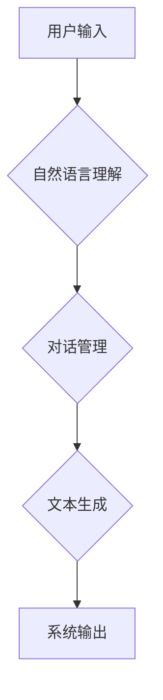

                 

## 对话式AI：构建自然、连贯的人机交互

> 关键词：对话式AI、自然语言处理、深度学习、Transformer、BERT、GPT、对话系统、人机交互

### 1. 背景介绍

近年来，人工智能技术取得了飞速发展，其中对话式AI作为人机交互的新模式，备受关注。对话式AI旨在构建能够与人类进行自然、流畅、连贯对话的智能系统，其应用场景涵盖聊天机器人、虚拟助手、客服系统、教育辅助工具等多个领域。

传统的对话系统主要依赖于基于规则的匹配机制，难以处理复杂、开放式的对话场景。随着深度学习技术的兴起，基于深度学习的对话式AI系统逐渐成为主流，其能够学习和理解人类语言的复杂结构和语义，从而实现更自然、更智能的人机交互。

### 2. 核心概念与联系

对话式AI的核心概念包括自然语言处理（NLP）、深度学习、Transformer模型等。

* **自然语言处理（NLP）**：是指计算机理解、处理和生成人类语言的技术。对话式AI系统需要借助NLP技术来分析用户输入的文本，理解其意图和情感，并生成相应的回复。

* **深度学习**：是一种机器学习的子领域，利用多层神经网络来学习数据中的复杂模式。深度学习在语音识别、图像识别、机器翻译等领域取得了突破性进展，也为对话式AI的发展提供了强大的技术支撑。

* **Transformer模型**：是一种新型的深度学习架构，其能够有效地处理序列数据，例如文本。Transformer模型在对话式AI领域取得了显著的成果，例如BERT、GPT等模型都基于Transformer架构。

**Mermaid 流程图**



### 3. 核心算法原理 & 具体操作步骤

#### 3.1  算法原理概述

对话式AI的核心算法主要包括自然语言理解（NLU）、对话管理（DM）和文本生成（TG）三个部分。

* **自然语言理解（NLU）**：旨在理解用户输入的文本语义，包括识别实体、关系、意图等。常用的NLU算法包括词嵌入、序列标注、条件随机场等。

* **对话管理（DM）**：负责控制对话流程，根据用户输入和对话历史，选择合适的回复策略。常用的DM算法包括状态机、强化学习等。

* **文本生成（TG）**：生成自然流畅的文本回复，常用的TG算法包括序列到序列模型、语言模型等。

#### 3.2  算法步骤详解

**1. 自然语言理解（NLU）**

* **词嵌入**: 将单词映射到低维向量空间，捕捉单词之间的语义关系。常用的词嵌入模型包括Word2Vec、GloVe等。
* **实体识别**: 识别文本中的实体，例如人名、地名、机构名等。常用的实体识别算法包括条件随机场（CRF）、深度神经网络等。
* **关系抽取**: 识别文本中的实体关系，例如“张三是北京大学的学生”。常用的关系抽取算法包括深度神经网络、图神经网络等。
* **意图识别**: 识别用户表达的意图，例如查询信息、预订酒店、支付账单等。常用的意图识别算法包括支持向量机（SVM）、深度神经网络等。

**2. 对话管理（DM）**

* **状态机**: 根据对话历史和用户输入，跳转到不同的对话状态，并执行相应的动作。
* **强化学习**: 利用奖励机制训练对话策略，使对话系统能够学习到更有效的对话策略。

**3. 文本生成（TG）**

* **序列到序列模型**: 将输入序列映射到输出序列，例如将用户输入的文本转换为回复文本。常用的序列到序列模型包括RNN、LSTM、Transformer等。
* **语言模型**: 预训练语言模型，例如BERT、GPT等，能够生成更自然、更流畅的文本回复。

#### 3.3  算法优缺点

**NLU算法**

* **优点**: 能够有效地理解文本语义，识别实体、关系、意图等。
* **缺点**: 对于复杂、模糊的文本理解能力有限，需要大量的训练数据。

**DM算法**

* **优点**: 可以控制对话流程，使对话更自然、更流畅。
* **缺点**: 难以处理开放式对话场景，需要复杂的规则设计。

**TG算法**

* **优点**: 可以生成自然流畅的文本回复，提升用户体验。
* **缺点**: 对于长文本生成能力有限，容易出现重复或不相关的回复。

#### 3.4  算法应用领域

* **聊天机器人**: 提供24小时在线客服、陪伴聊天等服务。
* **虚拟助手**: 帮助用户完成任务，例如设置提醒、查询天气等。
* **客服系统**: 自动处理用户咨询，提高客服效率。
* **教育辅助工具**: 提供个性化学习辅导、答疑解惑等服务。

### 4. 数学模型和公式 & 详细讲解 & 举例说明

#### 4.1  数学模型构建

对话式AI系统通常使用概率模型来表示对话过程和文本生成过程。

* **隐马尔可夫模型（HMM）**: 用于建模对话状态转移过程。

* **条件随机场（CRF）**: 用于建模文本序列标注任务，例如实体识别、关系抽取。

* **语言模型**: 用于预测文本序列的下一个词，例如n-gram语言模型、RNN语言模型、Transformer语言模型。

#### 4.2  公式推导过程

**1. 隐马尔可夫模型（HMM）**

HMM模型的三个核心参数：

* **状态转移概率矩阵A**: 表示在当前状态下转移到下一个状态的概率。

* **观测概率矩阵B**: 表示在当前状态下观测到特定符号的概率。

* **初始状态概率向量π**: 表示系统初始状态的概率分布。

HMM模型的训练目标是找到最优的参数，使得模型能够最大化似然函数。

**2. 条件随机场（CRF）**

CRF模型的能量函数：

$$E(y|x) = -\sum_{i=1}^{n} \alpha_i y_i + \sum_{i=1}^{n-1} \sum_{j=i+1}^{n} \beta_{ij} y_i y_j$$

其中：

* $x$ 是输入序列。
* $y$ 是输出序列。
* $\alpha_i$ 和 $\beta_{ij}$ 是模型参数。

CRF模型的训练目标是找到最优的参数，使得模型能够最小化能量函数。

#### 4.3  案例分析与讲解

**1. 隐马尔可夫模型（HMM）**

在语音识别任务中，HMM模型可以用来建模语音信号的生成过程。语音信号可以看作是一个序列的音素，每个音素都有对应的概率分布。HMM模型可以学习到音素之间的状态转移概率和观测概率，从而实现语音识别的功能。

**2. 条件随机场（CRF）**

在命名实体识别任务中，CRF模型可以用来识别文本中的实体。例如，在句子“张三是北京大学的学生”中，需要识别“张三”为姓名实体，“北京大学”为机构名实体。CRF模型可以学习到实体之间的依赖关系，从而提高实体识别的准确率。

### 5. 项目实践：代码实例和详细解释说明

#### 5.1  开发环境搭建

* **操作系统**: Ubuntu 18.04 或更高版本
* **编程语言**: Python 3.6 或更高版本
* **深度学习框架**: TensorFlow 或 PyTorch
* **其他工具**: Git、Numpy、Pandas等

#### 5.2  源代码详细实现

以下是一个简单的对话式AI系统代码示例，使用Python和TensorFlow框架实现：

```python
import tensorflow as tf

# 定义对话模型
class ChatBot(tf.keras.Model):
    def __init__(self):
        super(ChatBot, self).__init__()
        self.embedding = tf.keras.layers.Embedding(input_dim=10000, output_dim=128)
        self.lstm = tf.keras.layers.LSTM(units=64)
        self.dense = tf.keras.layers.Dense(units=10000, activation='softmax')

    def call(self, inputs):
        x = self.embedding(inputs)
        x = self.lstm(x)
        outputs = self.dense(x)
        return outputs

# 实例化对话模型
model = ChatBot()

# 加载预训练词嵌入
embedding_matrix = ...

# 训练对话模型
model.compile(optimizer='adam', loss='categorical_crossentropy', metrics=['accuracy'])
model.fit(x_train, y_train, epochs=10)

# 生成回复
user_input = "你好"
input_tensor = tf.convert_to_tensor([user_input])
response = model.predict(input_tensor)
```

#### 5.3  代码解读与分析

* **对话模型**: 使用了嵌入层、LSTM层和全连接层构建对话模型。
* **嵌入层**: 将单词映射到低维向量空间。
* **LSTM层**: 用于处理文本序列数据，捕捉文本中的上下文信息。
* **全连接层**: 用于生成文本回复。
* **训练过程**: 使用预训练词嵌入和训练数据训练对话模型。
* **回复生成**: 将用户输入转换为词向量，输入到对话模型中，得到回复文本。

#### 5.4  运行结果展示

运行代码后，对话系统将能够根据用户输入生成相应的回复。例如，当用户输入“你好”时，对话系统可能会回复“你好，请问有什么可以帮您吗？”。

### 6. 实际应用场景

#### 6.1  聊天机器人

* **客服机器人**: 自动处理用户咨询，例如订单查询、退换货等。
* **陪伴机器人**: 提供情感支持、聊天娱乐等服务。
* **教育机器人**: 提供个性化学习辅导、答疑解惑等服务。

#### 6.2  虚拟助手

* **语音助手**: 帮助用户完成任务，例如设置提醒、查询天气等。
* **智能家居助手**: 控制智能家居设备，例如灯光、空调等。
* **个人助理**: 帮助用户管理日程安排、备忘录等。

#### 6.3  其他应用场景

* **游戏**: 为游戏角色提供更自然、更智能的对话交互。
* **医疗**: 辅助医生诊断疾病、提供医疗咨询等。
* **金融**: 提供金融咨询、理财建议等服务。

#### 6.4  未来应用展望

随着人工智能技术的不断发展，对话式AI将应用于更多领域，例如：

* **个性化教育**: 提供个性化的学习方案和辅导。
* **远程医疗**: 提供远程医疗咨询和诊断服务。
* **智能城市**: 构建智能交通、智能安防等系统。

### 7. 工具和资源推荐

#### 7.1  学习资源推荐

* **书籍**:
    * 《深度学习》
    * 《自然语言处理》
    * 《对话系统》
* **在线课程**:
    * Coursera: 自然语言处理
    * edX: 深度学习
    * fast.ai: 深度学习课程

#### 7.2  开发工具推荐

* **深度学习框架**: TensorFlow, PyTorch
* **自然语言处理库**: NLTK, spaCy, HuggingFace Transformers
* **对话系统平台**: Rasa, Dialogflow

#### 7.3  相关论文推荐

* 《BERT: Pre-training of Deep Bidirectional Transformers for Language Understanding》
* 《GPT-3: Language Models are Few-Shot Learners》
* 《Transformer: Attention Is All You Need》

### 8. 总结：未来发展趋势与挑战

#### 8.1  研究成果总结

近年来，对话式AI取得了显著进展，例如：

* **模型性能提升**: Transformer模型的出现，使得对话式AI模型的性能大幅提升。
* **应用场景拓展**: 对话式AI应用于越来越多的领域，例如客服、教育、医疗等。
* **技术融合**: 对话式AI与其他人工智能技术融合，例如计算机视觉、语音识别等。

#### 8.2  未来发展趋势

* **更自然、更智能的对话**: 

对话式AI将更加注重自然语言理解和生成，能够更好地理解用户的意图和情感，并生成更自然、更流畅的回复。
* **个性化对话**: 

对话式AI将更加个性化，能够根据用户的喜好、需求和历史对话记录，提供定制化的服务。
* **多模态对话**: 

对话式AI将融合多模态信息，例如文本、语音、图像等，能够提供更丰富的交互体验。

#### 8.3  面临的挑战

* **数据标注**: 训练高质量的对话式AI模型需要大量的标注数据，数据标注成本高昂。
* **安全性和隐私性**: 对话式AI系统需要保证用户数据的安全性和隐私性。
* **伦理问题**: 对话式AI的应用可能会带来一些伦理问题，例如偏见、欺骗等。

#### 8.4  研究展望

未来，对话式AI的研究将继续深入，探索更先进的算法、模型和应用场景，为人类提供更智能、更便捷的交互体验。

### 9. 附录：常见问题与解答

**1. 如何选择合适的对话式AI模型？**

选择合适的对话式AI模型需要根据具体的应用场景和需求进行选择。例如，对于简单的问答系统，可以使用基于规则的模型；对于复杂的对话场景，可以使用基于深度学习的模型。

**2. 如何训练对话式AI模型？**

训练对话式AI模型需要准备大量的对话数据，并使用深度学习框架进行训练。

**3. 如何评估对话式AI模型的性能？**

常用的评估指标包括准确率、召回率、F1-score等。

**4. 如何解决对话式AI模型的偏见问题？**

可以通过使用更加多样化的训练数据、进行数据预处理、使用公平性评估指标等方法来解决对话式AI模型的偏见问题。


作者：禅与计算机程序设计艺术 / Zen and the Art of Computer Programming<end_of_turn>

