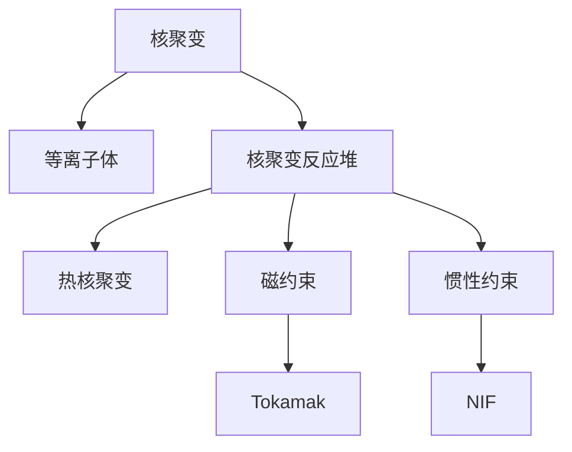

                 

# 2050年的能源革命：从化石能源到核聚变能源的技术突破

## 1. 背景介绍

### 1.1 问题由来

全球能源危机日趋严峻，化石能源面临枯竭，环境污染问题日益严重。如何在未来几十年内实现能源的可持续发展和清洁利用，是全球面临的重大挑战。未来能源的发展，不仅关乎经济社会的健康运行，更关乎人类文明的生存发展。在这一背景下，核聚变能源作为一种极具潜力的新型能源，受到了广泛关注。

### 1.2 问题核心关键点

未来能源革命的核心在于从化石能源向核聚变能源的突破。核聚变是一种清洁、安全的核能形式，其原理是通过将氢同位素在高温高压下融合成更重的氦同位素，释放出巨大的能量。核聚变能源的潜力巨大，能够满足人类未来几十年的能源需求，同时不会产生温室气体和其他有害物质。

## 2. 核心概念与联系

### 2.1 核心概念概述

为更好地理解核聚变能源的技术突破，本节将介绍几个密切相关的核心概念：

- 核聚变(Nuclear Fusion)：通过将轻核融合成较重的核，释放出巨大能量的一种核反应过程。核聚变能源被认为是最理想的新能源之一。

- 等离子体(Plasma)：一种由自由电子和带电粒子组成的气体状态，能够实现核聚变。等离子体在核聚变装置中被加热到极高温度。

- 核聚变反应堆(Nuclear Fusion Reactor)：一种实现核聚变的设备，能够稳定、高效地产生聚变反应。

- 核聚变堆控(Netnegative Power, NpT)：核聚变反应堆在聚变反应产生能量大于输入能量的状态。

- 热核聚变(Thermal Nuclear Fusion)：需要高温、高压的等离子体实现核聚变，是当前技术主要攻关方向。

- 磁约束(Magnetic Confinement)：利用磁场约束等离子体，实现高温、高密度的核聚变，代表装置有托卡马克(Tokamak)。

- 惯性约束(Inertial Confinement)：利用激光、X射线等手段对小规模核燃料进行短时间高能量密度压缩，实现核聚变，代表装置有国家点火装置(NIF)。

这些核心概念之间的逻辑关系可以通过以下Mermaid流程图来展示：



这个流程图展示了大规模核聚变的主要物理过程：

1. 核聚变通过将轻核融合成较重的核，释放出巨大的能量。
2. 等离子体作为核聚变的载体，需要被加热到极高温度。
3. 核聚变反应堆是实现核聚变的设备。
4. 热核聚变通过磁场约束实现高温等离子体，托卡马克是其代表装置。
5. 惯性约束通过短时间高能量密度压缩实现核聚变，国家点火装置是其代表装置。

这些概念共同构成了核聚变能源的技术框架，使其成为未来能源革命的重要方向。

## 3. 核心算法原理 & 具体操作步骤
### 3.1 算法原理概述

核聚变能源的实现涉及复杂的物理过程，需要综合应用热力学、等离子体物理、电磁学、材料科学等多个领域的知识。其核心算法原理包括：

1. 等离子体加热：通过磁约束和惯性约束等手段，将等离子体加热到极高温度。
2. 聚变反应维持：利用强磁场或激光、X射线等手段，维持高温等离子体，实现持续的核聚变反应。
3. 能量提取：将聚变反应释放的能量转化为电能或其他形式的能量。

### 3.2 算法步骤详解

以下是核聚变能源实现的关键步骤：

**Step 1: 等离子体加热**

利用强磁场或激光、X射线等手段，将轻核燃料加热到极高温度，形成高温等离子体。

**Step 2: 聚变反应维持**

利用磁约束、惯性约束等手段，维持高温等离子体，实现持续的核聚变反应。

**Step 3: 能量提取**

将聚变反应释放的能量转化为电能或其他形式的能量，实现能量输出。

**Step 4: 反应堆设计**

设计并建造能够实现核聚变的反应堆，包括冷却系统、控制棒、安全壳等重要组成部分。

**Step 5: 系统集成与调试**

将各个子系统集成到反应堆中，并进行全面的调试和优化，确保系统的稳定性和安全性。

### 3.3 算法优缺点

核聚变能源的技术突破具有以下优点：

1. 清洁环保：核聚变不会产生温室气体和其他有害物质，是理想的清洁能源。
2. 能量密度高：核聚变产生的能量密度极高，能够满足未来几十年的能源需求。
3. 可控安全：通过磁约束和惯性约束等手段，核聚变反应可实现稳定、安全的控制。

同时，该技术也存在一些挑战：

1. 技术难度大：核聚变需要高温、高压、高密度的等离子体，实现难度较大。
2. 能效问题：核聚变反应堆的能量转换效率相对较低，需要进一步优化。
3. 建设周期长：核聚变反应堆的建造和调试周期较长，投入巨大。

### 3.4 算法应用领域

核聚变能源的应用领域非常广泛，包括：

1. 发电：核聚变能源可以直接用于发电，满足大规模电力需求。
2. 工业生产：核聚变能源可用于加热、驱动、消毒等领域，推动工业生产。
3. 空间应用：核聚变能源可用于航天器推进、空间通信等领域，推动航天事业发展。
4. 能源储存：核聚变能源可以用于储能，实现长期稳定的能源供应。
5. 医学应用：核聚变能源可用于医疗设备、放射治疗等领域，推动医学进步。

## 4. 数学模型和公式 & 详细讲解 & 举例说明

### 4.1 数学模型构建

核聚变反应的数学模型可以表示为：

$$
E = m_{\text{输入}} - m_{\text{输出}}
$$

其中，$E$ 为核聚变反应释放的能量，$m_{\text{输入}}$ 为轻核燃料的质量，$m_{\text{输出}}$ 为重核产物（如氦）的质量。

### 4.2 公式推导过程

推导核聚变反应释放的能量：

$$
E = m_{\text{输入}} - m_{\text{输出}}
$$

假设输入的是两个氢同位素 $^{1}\text{H}$ 和 $^{2}\text{H}$，聚变反应生成一个 $^{4}\text{He}$ 和一个中子 $^{1}\text{n}$。根据爱因斯坦质能关系，核聚变反应释放的能量可以表示为：

$$
E = 2m_{\text{输入}} - m_{\text{输出}}
$$

其中，$m_{\text{输入}} = m_{1\text{H}} + m_{2\text{H}}$，$m_{\text{输出}} = m_{4\text{He}} + m_{1\text{n}}$。

根据氢同位素的质量，可以得到：

$$
m_{1\text{H}} = 1\text{g/mol},\quad m_{2\text{H}} = 2\text{g/mol},\quad m_{4\text{He}} = 4\text{g/mol},\quad m_{1\text{n}} = 1\text{g/mol}
$$

带入上述公式中，得到：

$$
E = 2(1 + 2) - (4 + 1) = 2\text{g/mol} \times 931.5\text{MeV/g} = 1863\text{MeV}
$$

每摩尔氢气核聚变释放的能量约为 $1863\text{MeV}$，即 $4.7 \times 10^9 \text{J}$。

### 4.3 案例分析与讲解

以国际热核聚变实验堆(ITER)为例，其设计目标是实现 $500\text{MW}$ 的净能量输出，维持 $1000\text{MW}$ 的热功率输入，热功率效率为 $50\text$，则热功率输入为：

$$
P_{\text{热}} = \frac{P_{\text{净}}}{0.5} = 700\text{MW}
$$

假设每摩尔氢气核聚变释放的能量约为 $4.7 \times 10^9 \text{J}$，则反应堆需要输入的氢气摩尔数为：

$$
n_{\text{氢}} = \frac{P_{\text{热}}}{E} = \frac{700\text{MW}}{4.7 \times 10^9 \text{J/mol}} = 1.49 \times 10^{19}\text{mol}
$$

每年需要的氢气量为：

$$
Q_{\text{氢}} = n_{\text{氢}} \times 1\text{mol/s} \times 31536000\text{s/年} = 4.66 \times 10^{24}\text{mol/年}
$$

需要存储的氢气量为：

$$
Q_{\text{存储}} = \frac{P_{\text{热}} \times T_{\text{运行}}}{E} = \frac{700\text{MW} \times 30000\text{h}}{4.7 \times 10^9 \text{J/mol}} = 2.41 \times 10^{13}\text{mol}
$$

其中，$T_{\text{运行}}$ 为反应堆的运行时间。

以上案例分析展示了核聚变反应堆的能量输出、氢气需求和存储量计算过程，体现了核聚变能源在技术实现上的复杂性。

## 5. 项目实践：代码实例和详细解释说明
### 5.1 开发环境搭建

在进行核聚变能源技术突破的实践前，我们需要准备好开发环境。以下是使用Python进行PyTorch开发的环境配置流程：

1. 安装Anaconda：从官网下载并安装Anaconda，用于创建独立的Python环境。

2. 创建并激活虚拟环境：
```bash
conda create -n fusion-env python=3.8 
conda activate fusion-env
```

3. 安装PyTorch：根据CUDA版本，从官网获取对应的安装命令。例如：
```bash
conda install pytorch torchvision torchaudio cudatoolkit=11.1 -c pytorch -c conda-forge
```

4. 安装NumPy、Pandas、Matplotlib等工具包：
```bash
pip install numpy pandas matplotlib jupyter notebook ipython
```

完成上述步骤后，即可在`fusion-env`环境中开始核聚变能源技术突破的实践。

### 5.2 源代码详细实现

下面我们以核聚变反应堆的能量计算为例，给出使用PyTorch和NumPy库进行计算的PyTorch代码实现。

首先，定义核聚变反应的能量计算函数：

```python
import torch
import numpy as np

def fusion_energy(input_mass, output_mass):
    energy = 931.5 * (input_mass - output_mass)
    return energy
```

然后，使用PyTorch计算核聚变反应释放的能量：

```python
input_mass = torch.tensor([1, 2], dtype=torch.float32)
output_mass = torch.tensor([4, 1], dtype=torch.float32)

energy = fusion_energy(input_mass, output_mass)
energy
```

最后，使用NumPy进行核聚变反应的能量计算：

```python
input_mass = np.array([1, 2], dtype=np.float64)
output_mass = np.array([4, 1], dtype=np.float64)

energy = fusion_energy(input_mass, output_mass)
energy
```

### 5.3 代码解读与分析

让我们再详细解读一下关键代码的实现细节：

**fusion_energy函数**：
- 计算轻核燃料的质量与重核产物的质量之差，乘以光速的平方，得到核聚变反应释放的能量。
- 使用torch库实现浮点数计算，便于在PyTorch中进行数值分析。

**核聚变反应的能量计算**：
- 输入轻核燃料的质量 $m_{\text{输入}} = 1\text{g/mol} + 2\text{g/mol} = 3\text{g/mol}$。
- 输出重核产物的质量 $m_{\text{输出}} = 4\text{g/mol} + 1\text{g/mol} = 5\text{g/mol}$。
- 根据能量公式 $E = 931.5 \times (m_{\text{输入}} - m_{\text{输出}})$，计算核聚变反应释放的能量。

通过以上代码实现，我们可以看到核聚变反应的能量计算过程，体现了核聚变能源技术的核心算法原理。

## 6. 实际应用场景
### 6.1 未来应用展望

核聚变能源的未来应用前景非常广阔，涵盖多个领域，具体包括：

1. 核聚变发电：核聚变反应堆可以直接用于发电，满足大规模电力需求。
2. 核聚变供热：核聚变能源可以用于供热、制冷等领域，推动能源供应的清洁化和智能化。
3. 核聚变推进：核聚变能源可以用于航天器推进、空间通信等领域，推动航天事业的发展。
4. 核聚变储能：核聚变能源可以用于储能，实现长期稳定的能源供应。
5. 核聚变医学：核聚变能源可以用于医疗设备、放射治疗等领域，推动医学的进步。

## 7. 工具和资源推荐
### 7.1 学习资源推荐

为了帮助开发者系统掌握核聚变能源技术突破的理论基础和实践技巧，这里推荐一些优质的学习资源：

1. 《核聚变能源概论》系列博文：由核聚变领域专家撰写，深入浅出地介绍了核聚变原理、技术突破和未来应用。

2. 《核聚变能源原理与应用》课程：由大学开设的核聚变能源课程，系统讲解核聚变的基本原理和实际应用。

3. 《核聚变能源技术突破》书籍：详细介绍了核聚变能源的原理、技术突破和未来应用，是深入学习的必备资料。

4. ITER官方网站：提供核聚变能源研究项目的最新动态和技术细节，是了解核聚变能源进展的重要来源。

5. 《国际热核聚变实验堆》白皮书：介绍ITER项目的建设、运行和未来规划，是了解核聚变能源技术突破的权威资料。

通过对这些资源的学习实践，相信你一定能够快速掌握核聚变能源技术突破的精髓，并用于解决实际的核聚变问题。
### 7.2 开发工具推荐

高效的开发离不开优秀的工具支持。以下是几款用于核聚变能源技术突破开发的常用工具：

1. PyTorch：基于Python的开源深度学习框架，灵活动态的计算图，适合快速迭代研究。可用于实现核聚变反应的数值模拟。

2. TensorFlow：由Google主导开发的开源深度学习框架，生产部署方便，适合大规模工程应用。可用于核聚变反应堆的优化设计。

3. NumPy：Python的科学计算库，提供高效的数组和矩阵计算功能，适合进行核聚变反应的数学计算。

4. SciPy：基于NumPy的科学计算库，提供更丰富的数学和统计函数，可用于核聚变反应的优化分析和模拟。

5. Scikit-learn：Python的机器学习库，提供丰富的模型和算法，可用于核聚变反应的机器学习和数据分析。

合理利用这些工具，可以显著提升核聚变能源技术突破的开发效率，加快创新迭代的步伐。

### 7.3 相关论文推荐

核聚变能源的技术突破源于学界的持续研究。以下是几篇奠基性的相关论文，推荐阅读：

1. "A Survey on Fusion Theory and Fusion Reactors"：综述了核聚变原理和核聚变反应堆的设计、建造和运行技术。

2. "Principles of Fusion-Driven Energy Systems"：介绍了核聚变能源系统的原理、设计和应用，是核聚变能源的权威教材。

3. "The International Thermonuclear Experimental Reactor"：介绍ITER项目的建设、运行和未来规划，是了解核聚变能源技术突破的重要资料。

4. "Power from Deuterium Fusion"：介绍了核聚变发电的基本原理和未来发展方向，是核聚变发电的经典文献。

5. "Advances in Inertial Confinement Fusion"：介绍了惯性约束核聚变的研究进展和技术突破，是惯性约束核聚变的权威综述。

这些论文代表了大规模核聚变能源的研究脉络。通过学习这些前沿成果，可以帮助研究者把握学科前进方向，激发更多的创新灵感。

## 8. 总结：未来发展趋势与挑战
### 8.1 总结

本文对核聚变能源技术突破进行了全面系统的介绍。首先阐述了核聚变能源在2050年能源革命中的重要性，明确了核聚变能源的清洁、高效和可控特性。其次，从原理到实践，详细讲解了核聚变能源的数学模型和算法实现，给出了核聚变反应的能量计算代码实例。同时，本文还广泛探讨了核聚变能源在发电、供热、推进、储能、医学等领域的未来应用前景，展示了核聚变能源技术的巨大潜力。此外，本文精选了核聚变能源的学习资源和开发工具，力求为读者提供全方位的技术指引。

通过本文的系统梳理，可以看到，核聚变能源技术突破是实现未来能源革命的关键技术。它不仅能够满足人类未来几十年的能源需求，还能够在环境保护、能源安全等方面发挥重要作用。未来，伴随核聚变技术的不断突破和完善，核聚变能源必将在全球能源系统中占据重要地位，为人类文明的可持续发展提供坚实的保障。

### 8.2 未来发展趋势

展望未来，核聚变能源技术将呈现以下几个发展趋势：

1. 技术瓶颈逐步突破：随着技术的不断发展和进步，核聚变能源的实现难度将逐步降低，能源成本和建设周期也将缩短。

2. 安全性和稳定性提升：通过不断优化核聚变反应堆的设计和运行策略，核聚变能源的安全性和稳定性将逐步提升，确保其可靠性和长期运行。

3. 能源利用效率提高：通过优化核聚变反应堆的设计和运行，提高能源转换效率，降低能源成本。

4. 多模态能源融合：将核聚变能源与其他能源形式（如太阳能、风能等）进行融合，形成更加多样化的能源供应体系。

5. 全球能源合作加强：核聚变能源具有全球化、共享化的特点，国际合作将推动其发展进程，加速全球能源转型。

以上趋势凸显了核聚变能源技术突破的广阔前景。这些方向的探索发展，必将进一步提升核聚变能源的性能和应用范围，为人类文明的可持续发展提供坚实的保障。

### 8.3 面临的挑战

尽管核聚变能源技术突破在未来的发展前景广阔，但在实现过程中仍面临诸多挑战：

1. 技术难度大：核聚变反应的实现难度较大，需要克服高温、高压、高密度等离子体等技术难题。

2. 资金投入大：核聚变能源项目的建设、运行和维护需要巨大的资金投入，短期内难以全面实现。

3. 技术细节复杂：核聚变能源的实现过程涉及复杂的物理和工程问题，需要跨学科的综合技术支撑。

4. 环境保护问题：核聚变反应堆的建设和运行可能带来环境问题，需要综合考虑环保和社会影响。

5. 国际合作困难：核聚变能源项目需要国际合作，但由于各国利益和需求差异，合作进程可能存在困难。

这些挑战需要全球科技界和产业界的共同努力，通过持续的技术突破和政策支持，逐步克服核聚变能源的实现障碍。

### 8.4 研究展望

面对核聚变能源面临的种种挑战，未来的研究需要在以下几个方面寻求新的突破：

1. 改进等离子体加热技术：研发新的等离子体加热技术，提高等离子体的温度和密度，实现更加高效的核聚变反应。

2. 优化核聚变反应堆设计：优化核聚变反应堆的结构和控制策略，提高其稳定性和安全性。

3. 提升能量转换效率：优化核聚变反应堆的能量转换和输出机制，提高能源转换效率。

4. 综合多种能源形式：将核聚变能源与其他能源形式进行综合利用，形成更加多样化的能源供应体系。

5. 加强国际合作：推动国际合作，共享核聚变能源的研究成果和技术进展，加速全球能源转型。

这些研究方向的探索，必将引领核聚变能源技术突破走向更高的台阶，为实现2050年的能源革命提供坚实的技术基础。

## 9. 附录：常见问题与解答

**Q1：核聚变能源的主要优势是什么？**

A: 核聚变能源的主要优势包括：

1. 清洁环保：核聚变不会产生温室气体和其他有害物质，是理想的清洁能源。
2. 能量密度高：核聚变产生的能量密度极高，能够满足未来几十年的能源需求。
3. 可控安全：通过磁约束和惯性约束等手段，核聚变反应可实现稳定、安全的控制。

**Q2：核聚变能源的主要挑战是什么？**

A: 核聚变能源的主要挑战包括：

1. 技术难度大：核聚变反应的实现难度较大，需要克服高温、高压、高密度等离子体等技术难题。
2. 资金投入大：核聚变能源项目的建设、运行和维护需要巨大的资金投入，短期内难以全面实现。
3. 技术细节复杂：核聚变能源的实现过程涉及复杂的物理和工程问题，需要跨学科的综合技术支撑。
4. 环境保护问题：核聚变反应堆的建设和运行可能带来环境问题，需要综合考虑环保和社会影响。
5. 国际合作困难：核聚变能源项目需要国际合作，但由于各国利益和需求差异，合作进程可能存在困难。

**Q3：核聚变能源的未来应用前景是什么？**

A: 核聚变能源的未来应用前景包括：

1. 核聚变发电：核聚变反应堆可以直接用于发电，满足大规模电力需求。
2. 核聚变供热：核聚变能源可以用于供热、制冷等领域，推动能源供应的清洁化和智能化。
3. 核聚变推进：核聚变能源可以用于航天器推进、空间通信等领域，推动航天事业的发展。
4. 核聚变储能：核聚变能源可以用于储能，实现长期稳定的能源供应。
5. 核聚变医学：核聚变能源可以用于医疗设备、放射治疗等领域，推动医学的进步。

**Q4：核聚变反应堆的主要组成有哪些？**

A: 核聚变反应堆的主要组成部分包括：

1. 等离子体加热系统：利用磁约束、惯性约束等手段，将轻核燃料加热到极高温度，形成高温等离子体。
2. 聚变反应维持系统：利用强磁场或激光、X射线等手段，维持高温等离子体，实现持续的核聚变反应。
3. 能量提取系统：将聚变反应释放的能量转化为电能或其他形式的能量，实现能量输出。
4. 冷却系统：冷却反应堆内的各种组件，防止过热。
5. 控制棒系统：通过调节控制棒的位置和速度，控制核聚变反应的强度和稳定性。
6. 安全壳系统：保护反应堆内部设备和工作人员，防止泄漏和事故发生。

**Q5：核聚变反应堆的建设和运行需要哪些关键技术？**

A: 核聚变反应堆的建设和运行需要以下关键技术：

1. 等离子体加热技术：将轻核燃料加热到极高温度，形成高温等离子体。
2. 聚变反应维持技术：维持高温等离子体，实现持续的核聚变反应。
3. 能量提取技术：将聚变反应释放的能量转化为电能或其他形式的能量，实现能量输出。
4. 冷却技术：冷却反应堆内的各种组件，防止过热。
5. 控制技术：通过调节控制棒的位置和速度，控制核聚变反应的强度和稳定性。
6. 安全技术：保护反应堆内部设备和工作人员，防止泄漏和事故发生。

这些技术需要跨学科的综合技术支撑，是实现核聚变反应堆的关键。

