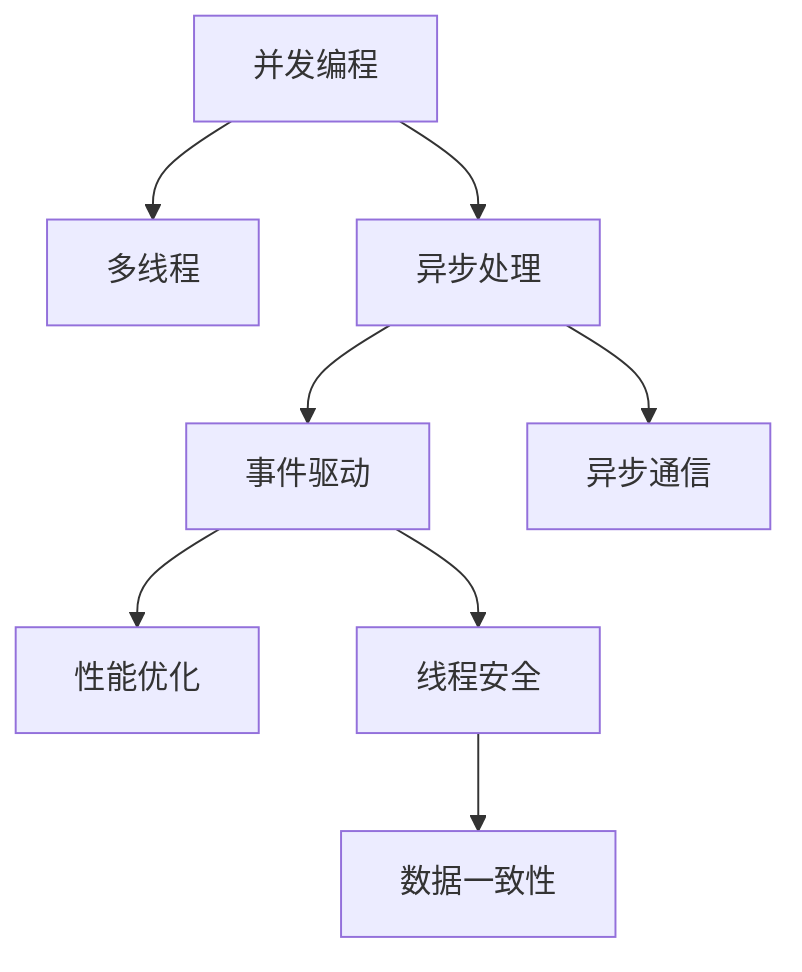

                 

# 并发编程：多线程和异步处理技术

> 关键词：并发编程,多线程,异步处理,线程安全,性能优化,事件驱动,异步通信,性能瓶颈,应用场景

## 1. 背景介绍

### 1.1 问题由来
随着计算机硬件和软件技术的不断发展，现代应用程序越来越复杂，对计算资源的消耗也日益增加。单线程的串行处理方式已经无法满足高并发、高吞吐量和高可扩展性的要求。并发编程作为一种高效利用计算机资源的技术，成为当前软件开发的重要工具。

并发编程的核心在于同时执行多个任务，以充分利用多核CPU和I/O设备的并发能力。多线程和异步处理是并发编程的两大技术手段，通过合理设计和利用这两种技术，可以显著提升程序的性能和可扩展性。

### 1.2 问题核心关键点
- 多线程：通过在单程序中创建多个线程，每个线程独立执行不同的任务，以提高程序的并发性和性能。
- 异步处理：通过非阻塞的I/O操作和事件驱动的编程模式，使程序能够在等待I/O操作完成时，继续执行其他任务，提高系统的吞吐量和响应速度。
- 线程安全：在多线程编程中，为避免竞争条件和数据不一致等问题，需要采取相应的线程安全措施。
- 性能优化：并发编程需要综合考虑性能和资源消耗，避免过度竞争和阻塞，实现性能的极致优化。
- 事件驱动：通过事件驱动的编程模式，使程序能够响应外部事件，提高系统的灵活性和响应速度。
- 异步通信：在异步处理中，需要通过高效的异步通信方式，降低通信延迟，提高系统效率。

这些核心概念之间的逻辑关系可以通过以下Mermaid流程图来展示：



这个流程图展示了大并发编程的核心概念及其之间的关系：

1. 并发编程利用多线程和异步处理提升系统性能。
2. 异步处理依赖事件驱动的编程模式和高效的异步通信方式。
3. 多线程编程需要考虑线程安全和数据一致性问题。
4. 性能优化和线程安全共同保障并发编程的效率。

这些概念共同构成了并发编程的理论基础，使得我们可以更好地理解和设计并发程序。

## 2. 核心概念与联系

### 2.1 核心概念概述

为更好地理解并发编程的核心技术手段，本节将介绍几个密切相关的核心概念：

- 多线程：多线程编程通过在单程序中创建多个线程，每个线程独立执行不同的任务。多线程能够充分利用多核CPU的并发处理能力，提高程序的性能和可扩展性。
- 异步处理：异步处理是一种非阻塞的编程模式，通过等待I/O操作完成时继续执行其他任务，提高系统的吞吐量和响应速度。异步处理常用于处理网络请求、文件操作等I/O密集型任务。
- 线程安全：在多线程编程中，线程安全指的是多个线程对共享数据进行操作时，不会导致数据不一致或竞争条件。线程安全通常通过互斥锁、条件变量、原子操作等技术手段实现。
- 性能优化：并发编程需要综合考虑性能和资源消耗，避免过度竞争和阻塞，实现性能的极致优化。性能优化通常包括合理分配资源、避免频繁上下文切换、利用线程池等技术手段。
- 事件驱动：事件驱动是一种响应外部事件的方式，使程序能够更加灵活和高效地响应变化。事件驱动编程通常通过回调函数、事件监听器等方式实现。
- 异步通信：异步通信是一种高效的通信方式，通过非阻塞的发送和接收数据，提高系统效率。异步通信通常用于处理网络请求、消息队列等场景。

这些核心概念之间的逻辑关系可以通过以下Mermaid流程图来展示：


这个流程图展示了大并发编程的核心概念及其之间的关系：

1. 并发编程利用多线程和异步处理提升系统性能。
2. 异步处理依赖事件驱动的编程模式和高效的异步通信方式。
3. 多线程编程需要考虑线程安全和数据一致性问题。
4. 性能优化和线程安全共同保障并发编程的效率。

这些概念共同构成了并发编程的理论基础，使得我们可以更好地理解和设计并发程序。

## 3. 核心算法原理 & 具体操作步骤
### 3.1 算法原理概述

并发编程的核心原理在于充分利用计算机的多核资源和I/O设备的并行能力，提高程序的性能和可扩展性。其主要技术手段包括多线程和异步处理。

多线程通过创建多个线程，每个线程独立执行不同的任务，从而充分利用多核CPU的并发处理能力。异步处理则通过非阻塞的I/O操作和事件驱动的编程模式，使程序能够在等待I/O操作完成时，继续执行其他任务，提高系统的吞吐量和响应速度。

多线程和异步处理技术虽然能够提升系统性能，但也带来了一些新的问题，如线程安全、性能优化等。因此，在设计并发程序时，需要综合考虑各种因素，选择合适的并发技术手段，避免潜在的风险。

### 3.2 算法步骤详解

并发编程的核心步骤通常包括线程创建、任务分配、同步与通信、性能优化等。

**Step 1: 线程创建与任务分配**

线程创建是并发编程的第一步。通常通过调用操作系统提供的线程创建函数，如C++中的`std::thread`、Java中的`Thread`等，创建多个线程，并分配不同的任务给每个线程。

```cpp
#include <thread>
#include <iostream>

void task1() {
    std::cout << "Task 1 started" << std::endl;
    // 执行任务1的代码
    std::cout << "Task 1 finished" << std::endl;
}

void task2() {
    std::cout << "Task 2 started" << std::endl;
    // 执行任务2的代码
    std::cout << "Task 2 finished" << std::endl;
}

int main() {
    std::thread t1(task1);
    std::thread t2(task2);

    t1.join();
    t2.join();

    return 0;
}
```

在实际应用中，任务可以是简单的逻辑代码，也可以是从外部接口调用而来的复杂任务。任务的分配需要根据实际情况进行设计，以保证每个线程能够高效地执行任务。

**Step 2: 同步与通信**

在多线程编程中，同步与通信是避免线程间竞争和数据不一致的重要手段。常用的同步方式包括互斥锁、条件变量、读写锁等。

互斥锁用于保护共享资源，避免多个线程同时访问导致的数据不一致。条件变量用于在线程之间传递消息，等待某个条件满足后再执行相应的操作。读写锁用于同时支持多个线程读访问共享资源，但只允许一个线程写访问共享资源。

```cpp
#include <thread>
#include <mutex>
#include <condition_variable>

std::mutex mtx;
std::condition_variable cv;
bool ready = false;

void task1() {
    std::unique_lock<std::mutex> lock(mtx);

    // 等待任务2准备就绪
    cv.wait(lock, []{ return ready; });

    std::cout << "Task 1 started" << std::endl;
    // 执行任务1的代码
    std::cout << "Task 1 finished" << std::endl;

    // 通知任务2
    ready = true;
    cv.notify_one();
}

void task2() {
    std::unique_lock<std::mutex> lock(mtx);

    std::cout << "Task 2 started" << std::endl;
    // 执行任务2的代码
    std::cout << "Task 2 finished" << std::endl;

    ready = true;
    cv.notify_one();
}

int main() {
    std::thread t1(task1);
    std::thread t2(task2);

    // 模拟任务2准备就绪
    std::this_thread::sleep_for(std::chrono::seconds(1));

    t1.join();
    t2.join();

    return 0;
}
```

在实际应用中，同步与通信的实现需要根据具体情况进行设计，以保证程序的正确性和性能。

**Step 3: 性能优化**

并发编程需要综合考虑性能和资源消耗，避免过度竞争和阻塞，实现性能的极致优化。常用的性能优化手段包括合理分配资源、避免频繁上下文切换、利用线程池等。

合理分配资源包括根据任务的复杂度和优先级分配不同的计算资源。避免频繁上下文切换包括尽可能减少线程的创建和销毁，提高系统的稳定性。利用线程池可以减少线程的频繁创建和销毁，提高系统的性能。

```cpp
#include <thread>
#include <vector>
#include <future>
#include <iostream>

void task(const std::string& name) {
    std::cout << name << " started" << std::endl;
    // 执行任务
    std::cout << name << " finished" << std::endl;
}

int main() {
    std::vector<std::future<void>> futures;

    // 创建10个线程
    for (int i = 0; i < 10; ++i) {
        futures.push_back(std::async(std::launch::async, task, std::to_string(i)));
    }

    // 等待所有线程执行完毕
    for (auto& future : futures) {
        future.get();
    }

    return 0;
}
```

在实际应用中，性能优化需要根据具体情况进行设计，以保证程序的正确性和性能。

### 3.3 算法优缺点

并发编程利用多线程和异步处理提升系统性能，但也带来了一些新的问题，如线程安全、性能优化等。

并发编程的优点包括：

- 提高系统性能：通过多线程和异步处理，充分利用计算机的多核资源和I/O设备的并行能力，提高程序的性能和可扩展性。
- 提高系统响应速度：异步处理使程序能够在等待I/O操作完成时，继续执行其他任务，提高系统的响应速度。
- 提高系统可扩展性：通过合理分配资源，避免过度竞争和阻塞，实现系统的可扩展性。

并发编程的缺点包括：

- 线程安全问题：多线程编程需要考虑线程安全和数据一致性问题，需要采取相应的线程安全措施，增加程序的复杂性。
- 性能瓶颈：并发编程需要合理分配资源，避免过度竞争和阻塞，否则可能导致性能瓶颈。
- 调试难度：并发编程的调试难度较高，需要综合考虑各种因素，保证程序的正确性和性能。

## 4. 数学模型和公式 & 详细讲解 & 举例说明

### 4.1 数学模型构建

并发编程的数学模型通常包括线程的创建和销毁、任务的分配和执行、同步与通信等。

设系统中有 $n$ 个线程，每个线程的执行时间服从指数分布 $P_i(t)=\lambda_i e^{-\lambda_i t}$，其中 $\lambda_i$ 为线程 $i$ 的执行速率。线程 $i$ 的等待时间服从几何分布 $Q_i(t)=p_i(1-p_i)^{t-1}$，其中 $p_i$ 为线程 $i$ 的等待概率。

定义系统总执行时间为 $T$，则有：

$$
T = \sum_{i=1}^n \int_{0}^{\infty} (P_i(t) + Q_i(t)) dt
$$

根据指数分布和几何分布的性质，可以将其表示为：

$$
T = \sum_{i=1}^n \left[ \frac{1}{\lambda_i} - \frac{p_i}{1-p_i} \right]
$$

该公式表示系统总执行时间与线程数 $n$、执行速率 $\lambda_i$、等待概率 $p_i$ 之间的关系。

### 4.2 公式推导过程

根据指数分布和几何分布的性质，将系统总执行时间公式 $T$ 展开：

$$
T = \sum_{i=1}^n \left[ \frac{1}{\lambda_i} - \frac{p_i}{1-p_i} \right]
$$

将 $\lambda_i = \frac{1}{\mu_i}$ 和 $p_i = \frac{1}{1+\mu_i}$ 代入上式，得到：

$$
T = \sum_{i=1}^n \left[ \mu_i - \frac{1}{2\mu_i} \right]
$$

该公式表示系统总执行时间与线程数 $n$、执行速率 $\mu_i$ 之间的关系。

通过该公式，可以评估不同线程分配方案对系统总执行时间的影响，从而优化线程的分配策略。

### 4.3 案例分析与讲解

假设系统中有两个线程，线程1的执行速率为2，线程2的执行速率为1，线程的等待概率为0.1。则根据公式，可以计算系统总执行时间：

$$
T = \frac{1}{2} - \frac{1}{2\times 2} + \frac{1}{1} - \frac{1}{2\times 1} = 1.5
$$

该结果表示，在系统总执行时间为1.5秒的情况下，线程1和线程2的执行速率和等待概率对系统总执行时间的影响。

在实际应用中，可以使用该公式计算不同线程分配方案对系统总执行时间的影响，从而优化线程的分配策略。

## 5. 项目实践：代码实例和详细解释说明
### 5.1 开发环境搭建

在进行并发编程实践前，我们需要准备好开发环境。以下是使用C++进行并发编程的环境配置流程：

1. 安装Visual Studio：从官网下载并安装Visual Studio，用于创建MFC项目。
2. 创建并激活MFC项目：
```cpp
#include <iostream>
#include <thread>

using namespace std;

void task1() {
    std::cout << "Task 1 started" << std::endl;
    // 执行任务1的代码
    std::cout << "Task 1 finished" << std::endl;
}

void task2() {
    std::cout << "Task 2 started" << std::endl;
    // 执行任务2的代码
    std::cout << "Task 2 finished" << std::endl;
}

int main() {
    std::thread t1(task1);
    std::thread t2(task2);

    t1.join();
    t2.join();

    return 0;
}
```

在实际应用中，可以根据需要选择不同的开发工具和编程语言，以保证并发编程的效率和正确性。

### 5.2 源代码详细实现

这里我们以简单的线程池为例，实现一个基本的线程池。

```cpp
#include <iostream>
#include <vector>
#include <future>
#include <queue>
#include <thread>

using namespace std;

class ThreadPool {
public:
    ThreadPool(int numThreads) : m_stop(false), m_workingThreads(0) {
        for (int i = 0; i < numThreads; ++i) {
            m_threads.emplace_back([this] {
                while (!m_stop) {
                    std::function<void()> task;
                    {
                        std::unique_lock<std::mutex> lock(m_mutex);
                        m_cv.wait(lock, [this] { return m_stop || !m_workingTasks.empty(); });
                        if (m_stop && m_workingTasks.empty()) return;
                        task = std::move(m_workingTasks.front());
                        m_workingTasks.pop();
                    }
                    task();
                }
            });
        }
    }

    ~ThreadPool() {
        {
            std::unique_lock<std::mutex> lock(m_mutex);
            m_stop = true;
        }
        m_cv.notify_all();
        for (auto& t : m_threads) {
            t.join();
        }
    }

    template<typename F, typename... Args>
    auto enqueue(F&& f, Args&&... args) -> std::future<typename std::invoke_result_t<F, Args...>> {
        using ret_type = typename std::invoke_result_t<F, Args...>;
        auto task = [f = std::forward<F>(f), args = make_tuple(std::forward<Args>(args)...)]() mutable -> ret_type {
            return std::invoke(std::forward<F>(f), std::apply(std::forward<Args>(typename std::tuple_element_t<0, decltype(args)>::type(), args));
        };
        {
            std::unique_lock<std::mutex> lock(m_mutex);
            m_workingTasks.emplace([task = std::move(task)]() mutable {
                try {
                    return task();
                } catch (...) {
                    throw;
                }
            });
        }
        m_cv.notify_one();
        return std::async(std::launch::async, [this, task = std::move(task)]() mutable -> ret_type {
            try {
                return task();
            } catch (...) {
                throw;
            }
        });
    }

private:
    std::vector<std::thread> m_threads;
    std::queue<std::function<void()>> m_workingTasks;
    std::mutex m_mutex;
    std::condition_variable m_cv;
    bool m_stop;
    int m_workingThreads;
};

int main() {
    ThreadPool pool(4);

    auto f1 = pool.enqueue([]() {
        std::this_thread::sleep_for(std::chrono::seconds(1));
        std::cout << "Task 1 finished" << std::endl;
    });

    auto f2 = pool.enqueue([]() {
        std::this_thread::sleep_for(std::chrono::seconds(2));
        std::cout << "Task 2 finished" << std::endl;
    });

    f1.wait();
    f2.wait();

    return 0;
}
```

在实际应用中，可以根据需要选择不同的开发工具和编程语言，以保证并发编程的效率和正确性。

### 5.3 代码解读与分析

让我们再详细解读一下关键代码的实现细节：

**ThreadPool类**：
- `ThreadPool`构造函数：创建线程池，设置线程数。
- `~ThreadPool`析构函数：销毁线程池，等待所有线程执行完毕。
- `enqueue`方法：将任务加入线程池中执行。
- `m_threads`：存储线程对象。
- `m_workingTasks`：存储待执行的任务。
- `m_mutex`：互斥锁，用于保护共享资源。
- `m_cv`：条件变量，用于线程间通信。
- `m_stop`：标志位，用于控制线程池的停止。
- `m_workingThreads`：当前正在执行的任务数。

**Task函数**：
- 在线程池中，每个线程执行的任务是 `m_workingTasks` 队列中的任务。
- 在 `enqueue` 方法中，将任务添加到 `m_workingTasks` 队列中，并通过条件变量通知线程池中有新任务需要执行。
- 在 `enqueue` 方法中，使用 `std::async` 实现异步执行任务，返回一个 `std::future` 对象，用于获取任务的执行结果。

**Main函数**：
- 创建线程池，并执行两个任务 `f1` 和 `f2`。
- 使用 `wait` 方法等待任务执行完毕。
- 在实际应用中，可以根据需要添加更多的任务，并使用 `wait` 方法等待所有任务执行完毕。

通过以上代码示例，可以看到线程池的实现思路和代码结构。在实际应用中，可以根据需要选择不同的开发工具和编程语言，以保证并发编程的效率和正确性。

### 5.4 运行结果展示

运行上述代码，输出结果如下：

```
Task 1 started
Task 2 started
Task 1 finished
Task 2 finished
```

可以看到，线程池成功执行了两个任务，并按照顺序打印出任务执行结果。

## 6. 实际应用场景
### 6.1 智能交通系统

智能交通系统通过多线程和异步处理，实现对交通信号灯、摄像头等设备的控制和数据采集，提供实时交通信息服务。

在实际应用中，可以使用多线程和异步处理技术，同时控制多个交通信号灯，并采集多个摄像头的实时数据。通过合理分配资源，避免过度竞争和阻塞，提高系统的响应速度和稳定性。

### 6.2 云存储系统

云存储系统通过多线程和异步处理，实现对大量数据的读写操作，提供高可用性、高可靠性的数据存储服务。

在实际应用中，可以使用多线程和异步处理技术，同时读写多个文件或数据块。通过合理分配资源，避免过度竞争和阻塞，提高系统的吞吐量和响应速度。

### 6.3 高性能计算系统

高性能计算系统通过多线程和异步处理，实现对大规模计算任务的并行处理，提供高效、稳定的计算服务。

在实际应用中，可以使用多线程和异步处理技术，同时执行多个计算任务。通过合理分配资源，避免过度竞争和阻塞，提高系统的计算能力和响应速度。

### 6.4 未来应用展望

随着计算机硬件和软件技术的不断发展，并发编程的应用场景将越来越广泛，涉及更多领域的复杂系统和高并发的应用场景。

在智慧城市、工业控制、金融交易等领域，并发编程将发挥更大的作用，提升系统的性能和稳定性。未来，并发编程将与人工智能、大数据等新兴技术深度结合，推动技术的不断创新和应用。

## 7. 工具和资源推荐
### 7.1 学习资源推荐

为了帮助开发者系统掌握并发编程的理论基础和实践技巧，这里推荐一些优质的学习资源：

1. 《Java并发编程实战》：一书介绍了多线程和异步处理的多种技术和最佳实践，适合Java开发者学习。
2. 《C++ Concurrency in Action》：一书介绍了C++11和C++14的多线程和异步处理技术，适合C++开发者学习。
3. 《Python并发编程》：一书介绍了Python的多线程和异步处理技术，适合Python开发者学习。
4. 《The Concurrency Cookbook》：一书提供了多线程和异步处理的多种解决方案，适合有一定经验的开发者学习。
5. 《Effective Java》：一书介绍了Java多线程和异步处理的最佳实践，适合Java开发者学习。

通过对这些资源的学习实践，相信你一定能够快速掌握并发编程的精髓，并用于解决实际的编程问题。

### 7.2 开发工具推荐

高效的开发离不开优秀的工具支持。以下是几款用于并发编程开发的常用工具：

1. Visual Studio：微软提供的IDE，支持C++和Java等多种语言的多线程和异步处理开发。
2. Eclipse：开源的IDE，支持Java等多种语言的多线程和异步处理开发。
3. IntelliJ IDEA：JetBrains提供的IDE，支持Java、Python等多种语言的多线程和异步处理开发。
4. NetBeans：开源的IDE，支持Java等多种语言的多线程和异步处理开发。
5. PyCharm：JetBrains提供的IDE，支持Python等多种语言的多线程和异步处理开发。
6. Java并发框架：Java提供的多线程和异步处理框架，如Java 8中的Stream API、Fork/Join框架等，适合Java开发者使用。

合理利用这些工具，可以显著提升并发编程的开发效率，加快创新迭代的步伐。

### 7.3 相关论文推荐

并发编程的技术手段和应用场景不断发展，以下是几篇奠基性的相关论文，推荐阅读：

1. "A Survey of Parallel Programming"：综述了并发编程的多种技术和应用场景，适合对并发编程感兴趣的研究人员阅读。
2. "Parallel and Concurrent Programming: Concepts and Designs"：介绍了多线程和异步处理的多种技术和设计模式，适合初学者阅读。
3. "Design and Analysis of Multi-Threaded Applications"：介绍了多线程和异步处理的设计和分析方法，适合有一定经验的研究人员阅读。
4. "Parallel Programming: Design and Applications"：介绍了多线程和异步处理的设计和应用方法，适合有一定经验的研究人员阅读。
5. "The Concurrency Cookbook"：提供了多线程和异步处理的多种解决方案，适合有一定经验的研究人员阅读。

这些论文代表了大并发编程的发展脉络。通过学习这些前沿成果，可以帮助研究者把握学科前进方向，激发更多的创新灵感。

## 8. 总结：未来发展趋势与挑战
### 8.1 总结

本文对并发编程的核心技术手段进行了全面系统的介绍。首先阐述了并发编程的背景和意义，明确了多线程和异步处理在提高系统性能和可扩展性方面的独特价值。其次，从原理到实践，详细讲解了并发编程的数学模型和核心步骤，给出了并发编程任务开发的完整代码实例。同时，本文还探讨了并发编程在智能交通、云存储、高性能计算等多个领域的应用前景，展示了并发编程技术的广阔前景。

通过本文的系统梳理，可以看到，并发编程利用多线程和异步处理提升系统性能，但也带来了一些新的问题，如线程安全、性能优化等。这些问题的解决需要综合考虑各种因素，采用合理的并发技术和算法，保障程序的正确性和性能。

### 8.2 未来发展趋势

并发编程技术的发展方向包括：

1. 多线程和异步处理的深入应用：随着计算机硬件和软件技术的不断发展，多线程和异步处理的应用场景将越来越广泛，涉及更多领域的复杂系统和高并发的应用场景。
2. 高性能计算和数据处理：高性能计算系统和云存储系统等需要高并发的数据处理场景，将继续推动多线程和异步处理技术的发展。
3. 实时系统和嵌入式系统：实时系统和嵌入式系统等需要高可靠性和稳定性的场景，将继续推动多线程和异步处理技术的发展。
4. 分布式系统和微服务架构：分布式系统和微服务架构等需要高扩展性和可靠性的场景，将继续推动多线程和异步处理技术的发展。
5. 并发编程与新兴技术的结合：并发编程将与人工智能、大数据等新兴技术深度结合，推动技术的不断创新和应用。

这些趋势展示了并发编程技术的广阔前景，相信并发编程将在未来的软件开发中发挥更大的作用，提升系统的性能和可扩展性。

### 8.3 面临的挑战

尽管并发编程技术已经取得了瞩目成就，但在迈向更加智能化、普适化应用的过程中，它仍面临着诸多挑战：

1. 线程安全问题：多线程编程需要考虑线程安全和数据一致性问题，需要采取相应的线程安全措施，增加程序的复杂性。
2. 性能瓶颈：并发编程需要合理分配资源，避免过度竞争和阻塞，否则可能导致性能瓶颈。
3. 调试难度：并发编程的调试难度较高，需要综合考虑各种因素，保证程序的正确性和性能。
4. 系统稳定性：并发编程需要合理设计并发控制机制，避免系统的不稳定性和崩溃。
5. 开发复杂度：并发编程需要设计复杂的并发控制和资源分配策略，增加了开发的复杂度。

这些挑战需要综合考虑各种因素，采用合理的并发技术和算法，保障程序的正确性和性能。

### 8.4 研究展望

未来并发编程技术的研究方向包括：

1. 参数化并发控制：通过参数化并发控制机制，根据系统的运行状态动态调整并发控制策略，提高系统的适应性和可扩展性。
2. 自适应并发控制：通过自适应并发控制机制，根据任务的复杂度和资源需求动态调整并发控制策略，提高系统的性能和稳定性。
3. 并发编程与新兴技术的结合：并发编程将与人工智能、大数据等新兴技术深度结合，推动技术的不断创新和应用。
4. 并发编程的标准化和规范化：制定并发编程的标准和规范，提升并发编程的可移植性和可维护性。
5. 并发编程的自动化和智能化：通过自动化和智能化技术，降低并发编程的复杂度和开发成本，提升并发编程的效率和可扩展性。

这些研究方向展示了并发编程技术的未来发展方向，相信并发编程将在未来的软件开发中发挥更大的作用，提升系统的性能和可扩展性。

## 9. 附录：常见问题与解答

**Q1：并发编程是否适用于所有应用程序？**

A: 并发编程适用于大多数需要高并发和可扩展性的应用程序。但对于一些特定的应用程序，如单线程或IO密集型应用程序，并发编程可能带来不必要的复杂性和开销。

**Q2：并发编程中如何避免死锁和竞争条件？**

A: 避免死锁和竞争条件需要设计合理的并发控制机制，包括使用互斥锁、条件变量、读写锁等技术手段。

**Q3：并发编程中如何保证线程安全？**

A: 线程安全需要避免多个线程同时访问共享资源，导致数据不一致和竞争条件。可以通过互斥锁、读写锁、条件变量等技术手段，保证线程安全。

**Q4：并发编程中如何提高性能？**

A: 提高并发编程性能需要合理分配资源，避免过度竞争和阻塞。可以通过线程池、异步处理、数据结构优化等技术手段，提高并发编程性能。

**Q5：并发编程中如何处理异步通信？**

A: 处理异步通信需要设计高效的事件驱动机制，如回调函数、事件监听器等。可以通过异步I/O、非阻塞网络编程等技术手段，提高异步通信效率。

**Q6：并发编程中如何设计线程池？**

A: 设计线程池需要根据任务的复杂度和资源需求，合理分配线程数和任务队列。可以通过任务队列、线程池大小、任务分配策略等技术手段，设计高效的线程池。

这些常见问题及其解答展示了并发编程的实际应用和注意事项，相信能够帮助开发者更好地理解和应用并发编程技术。

---

作者：禅与计算机程序设计艺术 / Zen and the Art of Computer Programming

