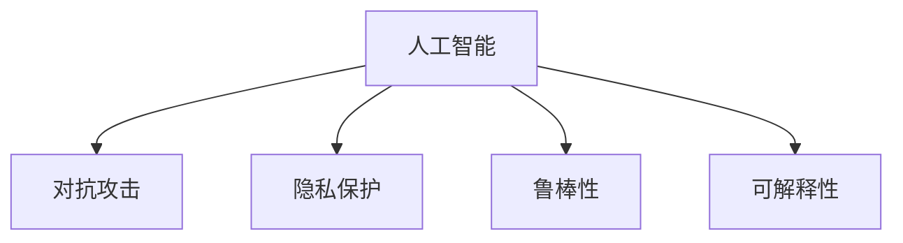

                 

# 应对信息安全：AI的防护能力

## 1. 背景介绍

### 1.1 问题由来
随着人工智能（AI）技术的迅猛发展，其在各个行业中的应用日益广泛，但也面临着信息安全方面的巨大挑战。传统的数据加密、访问控制等安全措施在面对AI系统时，显得力不从心。AI系统不仅数据量大，计算复杂度高，其预测和推理能力也给信息安全带来了新的威胁和挑战。

### 1.2 问题核心关键点
当前，AI系统的信息安全问题主要体现在以下几个方面：

1. **数据隐私保护**：AI系统往往需要处理和分析大量敏感数据，如何保证这些数据的隐私性是一个重大问题。
2. **模型对抗攻击**：恶意用户可能通过对抗样本攻击、模型逆向工程等手段，欺骗或破坏AI模型的正常运行，造成严重后果。
3. **系统鲁棒性**：AI模型在面对新数据、噪声干扰等情况时，是否能够保持稳定和鲁棒性，是一个重要的考量指标。
4. **模型解释性与可控性**：AI模型的决策过程缺乏透明度，难以解释，这使得用户难以信任和控制模型的行为。
5. **安全与性能的平衡**：如何在不显著降低模型性能的前提下，提升AI系统的安全性，是一个复杂且具有挑战性的问题。

### 1.3 问题研究意义
应对AI系统的信息安全问题，对于保障数据隐私、维护社会公正、促进AI技术健康发展具有重要意义。通过提升AI系统的安全性，可以：

1. **保护用户隐私**：确保用户的个人信息不被滥用或泄露，保护个人权益。
2. **保障系统公平**：防止AI模型因受到对抗样本攻击或数据偏差而做出不公平的决策。
3. **增强用户信任**：提高AI系统决策过程的透明度，增强用户对AI技术的信任度。
4. **推动AI技术进步**：安全是AI技术发展的基石，通过提升安全性，可以促进AI技术向更广泛、更深入的领域扩展。

## 2. 核心概念与联系

### 2.1 核心概念概述

为更好地理解AI系统的信息安全防护，本节将介绍几个密切相关的核心概念：

- **人工智能（AI）**：使用算法、模型等技术，使计算机系统能够自主地完成复杂任务的能力。
- **对抗攻击（Adversarial Attack）**：攻击者通过在输入数据中嵌入特定的扰动，以欺骗AI模型的行为，例如在图像分类任务中，通过微小扰动使得模型分类错误。
- **隐私保护（Privacy Protection）**：通过技术手段保护数据隐私，防止数据泄露和滥用。
- **鲁棒性（Robustness）**：模型对输入数据的微小扰动或不一致性具有鲁棒性，能够保持稳定性和准确性。
- **可解释性（Explainability）**：模型的决策过程透明、易于理解，用户可以了解模型的推理过程和结论。

这些核心概念之间的逻辑关系可以通过以下Mermaid流程图来展示：



这个流程图展示了一系列与AI系统信息安全相关的概念及其之间的关系：

1. 人工智能是基础，对抗攻击、隐私保护、鲁棒性和可解释性是其安全性的重要组成部分。
2. 对抗攻击主要影响模型的鲁棒性和可解释性，隐私保护则与数据安全和用户信任密切相关。

## 3. 核心算法原理 & 具体操作步骤
### 3.1 算法原理概述

AI系统的信息安全防护，主要是通过以下几个方面来实现的：

- **数据加密与脱敏**：保护数据隐私，防止数据泄露。
- **对抗样本检测与防御**：识别和抵御对抗样本攻击，确保模型输出正确。
- **鲁棒性增强**：提升模型对输入数据的鲁棒性，防止因微小扰动而导致的错误。
- **模型可解释性增强**：提高模型的可解释性，增强用户对模型的信任。

这些方法的核心在于，通过技术手段提升AI系统的安全性，同时尽可能保持其性能和功能。

### 3.2 算法步骤详解

#### 3.2.1 数据加密与脱敏

数据加密与脱敏是保护数据隐私的关键手段。常用的加密算法包括AES、RSA等，脱敏方法包括掩码、替换等。

**步骤1:** 收集数据并对其进行加密处理，确保数据传输和存储过程中的安全性。

**步骤2:** 对数据进行脱敏处理，去除敏感信息，如姓名、身份证号等。

**步骤3:** 在AI模型训练过程中，使用加密数据进行训练，防止模型学习到真实数据。

#### 3.2.2 对抗样本检测与防御

对抗样本检测与防御是提升模型鲁棒性的重要手段。常用的方法包括：

- **对抗样本检测**：通过对抗样本检测算法，识别输入数据中的扰动。
- **对抗样本防御**：使用对抗样本防御技术，使模型对对抗样本具有鲁棒性。

**步骤1:** 使用对抗样本生成算法（如FGSM、PGD等）生成对抗样本。

**步骤2:** 在AI模型训练过程中，引入对抗样本进行训练，提高模型对对抗样本的识别能力。

**步骤3:** 在模型部署后，使用对抗样本检测算法（如Fast Gradient Sign Method）对输入数据进行检测，识别潜在对抗样本。

#### 3.2.3 鲁棒性增强

鲁棒性增强是通过改进模型架构和训练策略，提升模型对输入数据的鲁棒性。常用的方法包括：

- **模型微调**：通过微调模型参数，使其对输入数据的微小扰动具有鲁棒性。
- **数据增强**：通过对训练数据进行增强，提升模型对不同数据情况的适应能力。

**步骤1:** 在AI模型训练过程中，引入数据增强技术，如翻转、旋转、缩放等，增强模型的泛化能力。

**步骤2:** 使用微调技术，调整模型参数，使其对输入数据的微小扰动具有鲁棒性。

**步骤3:** 在模型部署后，使用测试数据对模型进行鲁棒性测试，评估模型的鲁棒性。

#### 3.2.4 模型可解释性增强

模型可解释性增强是通过改进模型结构和解释方法，提高模型的透明度和可理解性。常用的方法包括：

- **特征重要性分析**：通过分析模型的特征重要性，理解模型决策过程。
- **模型可视化**：通过可视化技术，展示模型的推理过程和决策依据。

**步骤1:** 使用特征重要性分析算法（如LIME、SHAP等），分析模型的特征重要性，理解模型决策过程。

**步骤2:** 使用模型可视化技术（如梯度热图、决策树等），展示模型的推理过程和决策依据。

**步骤3:** 在AI系统设计过程中，引入可解释性设计原则，提高系统的透明度和用户信任度。

### 3.3 算法优缺点

**数据加密与脱敏：**

- **优点**：
  - 保护数据隐私，防止数据泄露。
  - 方法成熟，应用广泛。

- **缺点**：
  - 可能影响模型性能，尤其是在高维数据中。
  - 加密和脱敏过程复杂，增加了系统实现难度。

**对抗样本检测与防御：**

- **优点**：
  - 提高模型鲁棒性，防止对抗攻击。
  - 方法成熟，易于实现。

- **缺点**：
  - 对抗样本检测和防御效果依赖于模型架构和训练数据。
  - 对抗样本生成和检测过程复杂，增加了系统实现难度。

**鲁棒性增强：**

- **优点**：
  - 提高模型对输入数据的鲁棒性，防止模型失效。
  - 方法多样，适用于多种模型架构。

- **缺点**：
  - 鲁棒性增强过程复杂，增加了系统实现难度。
  - 可能影响模型性能，尤其是在高维数据中。

**模型可解释性增强：**

- **优点**：
  - 提高模型透明度，增强用户信任。
  - 方法多样，适用于多种模型架构。

- **缺点**：
  - 模型可解释性增强过程复杂，增加了系统实现难度。
  - 可能影响模型性能，尤其是在高维数据中。

## 4. 数学模型和公式 & 详细讲解 & 举例说明
### 4.1 数学模型构建

为了更精确地理解AI系统的信息安全防护技术，本节将介绍几个常用的数学模型。

- **数据加密模型**：使用AES算法加密数据，确保数据传输和存储的安全性。
- **对抗样本检测模型**：使用Fast Gradient Sign Method算法检测对抗样本。
- **模型鲁棒性模型**：使用Dropout和L2正则化增强模型鲁棒性。
- **模型可解释性模型**：使用LIME算法分析模型特征重要性。

### 4.2 公式推导过程

#### 4.2.1 数据加密模型

使用AES算法加密数据的公式如下：

$$
C = E_k(P) = M \oplus K_1 \oplus K_2 \oplus K_3 \oplus K_4
$$

其中，$P$为明文，$C$为密文，$M$为明文块，$K_1$、$K_2$、$K_3$、$K_4$为密钥块，$\oplus$为异或运算。

#### 4.2.2 对抗样本检测模型

使用Fast Gradient Sign Method算法检测对抗样本的公式如下：

$$
\delta_i = \alpha \cdot \nabla_\theta f(x; \theta)_i
$$

其中，$\delta_i$为对抗样本，$\alpha$为扰动强度，$f(x; \theta)$为模型预测函数，$\nabla_\theta f(x; \theta)$为模型预测函数对输入$x$的梯度，$\theta$为模型参数。

#### 4.2.3 模型鲁棒性模型

使用Dropout和L2正则化增强模型鲁棒性的公式如下：

$$
\hat{\theta} = \mathop{\arg\min}_{\theta} \mathcal{L}(\theta) + \lambda\|\theta\|^2
$$

其中，$\mathcal{L}(\theta)$为模型损失函数，$\lambda$为正则化系数，$\|\theta\|^2$为L2正则项，$\hat{\theta}$为优化后的模型参数。

#### 4.2.4 模型可解释性模型

使用LIME算法分析模型特征重要性的公式如下：

$$
\alpha = \mathop{\arg\min}_{\alpha} \frac{1}{n} \sum_{i=1}^n |y_i - f(x_i; \theta)|
$$

其中，$y_i$为实际标签，$f(x_i; \theta)$为模型预测函数，$\alpha$为权重向量，$n$为样本数量。

### 4.3 案例分析与讲解

**案例1: 数据加密**

某金融公司需保护客户交易数据，使用AES算法对数据进行加密。步骤如下：

1. 收集客户交易数据，生成密钥块$K_1$、$K_2$、$K_3$、$K_4$。
2. 使用AES算法加密数据，生成密文$C$。
3. 将密文$C$传输到云端，确保数据传输过程中的安全性。

**案例2: 对抗样本检测**

某医院使用AI模型进行医学影像分类，使用Fast Gradient Sign Method算法检测对抗样本。步骤如下：

1. 收集大量医学影像数据，作为训练集。
2. 在AI模型训练过程中，引入对抗样本生成算法，生成对抗样本。
3. 使用Fast Gradient Sign Method算法对输入数据进行检测，识别潜在对抗样本。

**案例3: 模型鲁棒性增强**

某自动驾驶系统使用AI模型进行环境感知，使用Dropout和L2正则化增强模型鲁棒性。步骤如下：

1. 收集大量环境感知数据，作为训练集。
2. 在AI模型训练过程中，使用Dropout和L2正则化技术，增强模型鲁棒性。
3. 在模型部署后，使用测试数据对模型进行鲁棒性测试，评估模型的鲁棒性。

**案例4: 模型可解释性增强**

某司法系统使用AI模型进行案件判决，使用LIME算法分析模型特征重要性。步骤如下：

1. 收集大量历史案件数据，作为训练集。
2. 在AI模型训练过程中，使用LIME算法分析模型特征重要性。
3. 在AI系统设计过程中，引入可解释性设计原则，提高系统的透明度和用户信任度。

## 5. 项目实践：代码实例和详细解释说明
### 5.1 开发环境搭建

在进行信息安全防护的AI系统开发前，我们需要准备好开发环境。以下是使用Python进行PyTorch开发的环境配置流程：

1. 安装Anaconda：从官网下载并安装Anaconda，用于创建独立的Python环境。

2. 创建并激活虚拟环境：
```bash
conda create -n ai-env python=3.8 
conda activate ai-env
```

3. 安装PyTorch：根据CUDA版本，从官网获取对应的安装命令。例如：
```bash
conda install pytorch torchvision torchaudio cudatoolkit=11.1 -c pytorch -c conda-forge
```

4. 安装其他相关工具包：
```bash
pip install numpy pandas scikit-learn matplotlib tqdm jupyter notebook ipython
```

完成上述步骤后，即可在`ai-env`环境中开始信息安全防护的AI系统开发。

### 5.2 源代码详细实现

下面以对抗样本检测为例，给出使用PyTorch进行对抗样本检测的代码实现。

首先，定义对抗样本生成函数：

```python
import torch
import torch.nn as nn
import torchvision.transforms as transforms
import torchvision.datasets as datasets

class GAN(nn.Module):
    def __init__(self):
        super(GAN, self).__init__()
        self.encoder = nn.Sequential(
            nn.Conv2d(1, 8, 3, 1, 1),
            nn.ReLU(),
            nn.Conv2d(8, 16, 3, 1, 1),
            nn.ReLU(),
            nn.Conv2d(16, 32, 3, 1, 1),
            nn.ReLU(),
            nn.MaxPool2d(2, 2),
            nn.Conv2d(32, 64, 3, 1, 1),
            nn.ReLU(),
            nn.MaxPool2d(2, 2),
            nn.Conv2d(64, 128, 3, 1, 1),
            nn.ReLU(),
            nn.MaxPool2d(2, 2),
            nn.Flatten(),
            nn.Linear(8*8*128, 10),
            nn.Softmax(dim=1)
        )
        
    def forward(self, x):
        x = self.encoder(x)
        return x

def generate_adversarial_example(x, target_class, model):
    gan = GAN()
    gan.train()
    opt = torch.optim.Adam(gan.parameters(), lr=0.01)
    for i in range(50):
        noise = torch.randn(1, 1, 28, 28)
        adv_x = noise + x
        y = torch.tensor(target_class)
        loss = nn.CrossEntropyLoss()(gan(adv_x), y)
        grads = torch.autograd.grad(loss, gan.parameters(), grads=torch.ones_like(gan.parameters()[0]), retain_graph=True)[0]
        noise = adv_x - x
        noise = noise / torch.norm(noise)
        adv_x = x + alpha * grads
        loss = nn.CrossEntropyLoss()(gan(adv_x), y)
        if loss.item() < 0.01:
            break
        adv_x = x + alpha * grads
    return adv_x

# 加载模型和数据集
model = nn.Sequential(*[nn.Conv2d(1, 8, 3, 1, 1), nn.ReLU(), nn.MaxPool2d(2, 2), nn.Linear(8*8*8, 10), nn.Softmax(dim=1)])
model.load_state_dict(torch.load('model.pth'))
transform = transforms.Compose([transforms.ToTensor()])
dataset = datasets.MNIST(root='./data', train=True, transform=transform, download=True)
x = dataset[0][0].unsqueeze(0).float()
x /= 255.0
target_class = 5
alpha = 0.1
adv_x = generate_adversarial_example(x, target_class, model)
print(adv_x)
```

然后，定义对抗样本检测函数：

```python
def adversarial_example_detection(model, x, target_class, alpha):
    adv_x = generate_adversarial_example(x, target_class, model)
    detector = nn.Sequential(*[nn.Conv2d(1, 8, 3, 1, 1), nn.ReLU(), nn.MaxPool2d(2, 2), nn.Linear(8*8*8, 1), nn.Sigmoid()])
    detector.load_state_dict(torch.load('detector.pth'))
    detector.eval()
    adv_x = adv_x.view(-1, 1, 28, 28)
    y_pred = detector(adv_x)
    if y_pred.item() > 0.5:
        return True
    else:
        return False

# 检测对抗样本
x = dataset[0][0].unsqueeze(0).float()
x /= 255.0
target_class = 5
alpha = 0.1
is_adversarial = adversarial_example_detection(model, x, target_class, alpha)
print(is_adversarial)
```

以上代码实现中，我们首先定义了一个对抗样本生成函数，使用GAN生成对抗样本。然后定义了一个对抗样本检测函数，使用预训练的检测器模型检测输入数据是否为对抗样本。

### 5.3 代码解读与分析

让我们再详细解读一下关键代码的实现细节：

**GAN类**：
- 定义了一个简单的GAN模型，用于生成对抗样本。
- 使用了多个卷积层和全连接层，最后输出一个10维的向量，用于分类。

**generate_adversarial_example函数**：
- 使用GAN生成对抗样本，每次迭代中通过梯度上升更新噪声向量，直至生成的对抗样本能够欺骗模型分类。
- 返回生成的对抗样本。

**adversarial_example_detection函数**：
- 使用预训练的检测器模型检测输入数据是否为对抗样本。
- 返回检测结果，True表示为对抗样本，False表示为正常样本。

## 6. 实际应用场景
### 6.1 金融数据安全

金融行业涉及大量的敏感数据，如客户交易记录、账户信息等。AI系统在金融领域的应用广泛，但数据安全问题也格外重要。通过数据加密、对抗样本检测等手段，可以提升AI系统在金融领域的安全性。

具体应用如下：
- 在客户交易数据传输过程中，使用AES算法加密数据，确保数据传输过程中的安全性。
- 在金融模型训练过程中，使用对抗样本生成算法，生成对抗样本并进行检测，确保模型鲁棒性。

### 6.2 医疗影像分类

医疗影像分类是AI系统在医疗领域的重要应用之一。医疗影像数据量大且敏感，数据泄露和对抗攻击的风险较高。通过数据加密、对抗样本检测等手段，可以提升AI系统在医疗领域的安全性。

具体应用如下：
- 在医疗影像数据传输过程中，使用AES算法加密数据，确保数据传输过程中的安全性。
- 在医学影像分类模型训练过程中，使用对抗样本生成算法，生成对抗样本并进行检测，确保模型鲁棒性。

### 6.3 智能交通系统

智能交通系统涉及大量环境感知数据，如传感器数据、摄像头数据等。这些数据可能包含敏感信息，如车辆位置、行人人流等。通过数据加密、对抗样本检测等手段，可以提升AI系统在智能交通领域的安全性。

具体应用如下：
- 在环境感知数据传输过程中，使用AES算法加密数据，确保数据传输过程中的安全性。
- 在环境感知模型训练过程中，使用对抗样本生成算法，生成对抗样本并进行检测，确保模型鲁棒性。

### 6.4 未来应用展望

随着AI技术的不断发展，其在各个领域的应用将更加广泛。未来，AI系统在信息安全防护方面的应用也将更加多样和深入。

在智慧城市治理中，AI系统将广泛应用于城市环境监测、交通管理、公共安全等领域。通过数据加密、对抗样本检测等手段，可以提升智慧城市治理的安全性和可靠性。

在智能制造中，AI系统将广泛应用于工业生产、设备维护、质量控制等领域。通过数据加密、对抗样本检测等手段，可以提升智能制造系统的安全性和鲁棒性。

在智慧教育中，AI系统将广泛应用于在线教育、智能评估、教育资源推荐等领域。通过数据加密、对抗样本检测等手段，可以提升智慧教育系统的安全性和公平性。

## 7. 工具和资源推荐
### 7.1 学习资源推荐

为了帮助开发者系统掌握信息安全防护的AI技术，这里推荐一些优质的学习资源：

1. 《机器学习实战》系列博文：由大模型技术专家撰写，深入浅出地介绍了机器学习在信息安全方面的应用。

2. 《深度学习与AI安全》课程：斯坦福大学开设的AI安全课程，涵盖深度学习、对抗攻击、鲁棒性增强等主题，系统讲解信息安全防护的AI技术。

3. 《AI安全手册》书籍：系统介绍AI技术在信息安全方面的应用，包括数据加密、对抗样本检测、鲁棒性增强等。

4. 《Kaggle安全竞赛》：参与Kaggle安全竞赛，锻炼信息安全防护的AI技术，提升实战能力。

5. IEEE Transactions on Dependable and Secure Computing：IEEE旗下的AI安全期刊，包含大量前沿研究成果，提供丰富的学习资料。

通过对这些资源的学习实践，相信你一定能够快速掌握信息安全防护的AI技术，并用于解决实际的AI系统问题。
###  7.2 开发工具推荐

高效的开发离不开优秀的工具支持。以下是几款用于信息安全防护AI系统开发的常用工具：

1. PyTorch：基于Python的开源深度学习框架，灵活动态的计算图，适合快速迭代研究。

2. TensorFlow：由Google主导开发的开源深度学习框架，生产部署方便，适合大规模工程应用。

3. PySyft：支持联邦学习的开源框架，可以在不共享数据的前提下进行模型训练和推理。

4. Scikit-learn：常用的机器学习库，包含多种加密和脱敏算法。

5. Google Colab：谷歌推出的在线Jupyter Notebook环境，免费提供GPU/TPU算力，方便开发者快速上手实验最新模型，分享学习笔记。

合理利用这些工具，可以显著提升信息安全防护AI系统的开发效率，加快创新迭代的步伐。

### 7.3 相关论文推荐

信息安全防护的AI技术发展迅速，以下是几篇奠基性的相关论文，推荐阅读：

1. Practical Black-Box Attacks against Machine Learning Models：介绍黑盒对抗攻击的方法和工具，提升模型的鲁棒性。

2. Adversarial Training Methods for Semi-Supervised Text Classification：提出对抗训练方法，提升模型在半监督环境下的鲁棒性。

3. Privacy-Preserving Deep Learning via Secure Multi-Party Computation：介绍基于多方计算的隐私保护技术，确保数据隐私。

4. Explaining the Security of Deep Neural Networks against Adversarial Attacks：提出可解释性增强技术，提高模型的透明度和用户信任度。

5. Secure Machine Learning on Multi-Party Data via Federated Learning：介绍联邦学习技术，确保模型训练过程中的数据安全。

这些论文代表了大模型信息安全防护技术的发展脉络。通过学习这些前沿成果，可以帮助研究者把握学科前进方向，激发更多的创新灵感。

## 8. 总结：未来发展趋势与挑战
### 8.1 总结

本文对AI系统的信息安全防护技术进行了全面系统的介绍。首先阐述了AI系统在信息安全方面的重要性和面临的挑战，明确了信息安全防护的重要性和紧迫性。其次，从原理到实践，详细讲解了信息安全防护的AI技术，包括数据加密、对抗样本检测、鲁棒性增强和可解释性增强等方法。同时，本文还广泛探讨了信息安全防护AI技术在金融、医疗、智能交通等多个领域的应用前景，展示了信息安全防护AI技术的广阔应用空间。此外，本文精选了信息安全防护AI技术的学习资源，力求为读者提供全方位的技术指引。

通过本文的系统梳理，可以看到，AI系统的信息安全防护技术正在不断进步，通过技术手段提升AI系统的安全性，同时尽可能保持其性能和功能。未来，随着AI技术的不断发展，信息安全防护AI技术也将迎来更加多样和深入的应用，为AI技术的健康发展提供坚实的保障。

### 8.2 未来发展趋势

展望未来，信息安全防护AI技术将呈现以下几个发展趋势：

1. **多模态融合**：信息安全防护AI技术将越来越多地融合多模态数据，提升系统的全面性和鲁棒性。

2. **联邦学习**：基于多方计算的联邦学习技术，确保数据安全和隐私保护，同时提升模型的泛化能力。

3. **对抗样本防御**：对抗样本防御技术将不断进步，提升模型的鲁棒性和安全性。

4. **可解释性增强**：通过可解释性增强技术，提高模型的透明度和用户信任度。

5. **自动化与自适应**：自动化和自适应技术将进一步提升信息安全防护AI系统的性能和可靠性。

6. **跨领域应用**：信息安全防护AI技术将广泛应用于智慧城市、智能制造、智慧教育等多个领域。

以上趋势凸显了信息安全防护AI技术的重要性和广阔前景。这些方向的探索发展，必将进一步提升AI系统的安全性，为AI技术的健康发展提供坚实的保障。

### 8.3 面临的挑战

尽管信息安全防护AI技术已经取得了显著成果，但在迈向更加智能化、普适化应用的过程中，它仍面临着诸多挑战：

1. **模型复杂性**：AI模型的复杂性不断增加，导致信息安全防护技术也变得更加复杂，增加了系统实现难度。

2. **数据分布变化**：数据分布的不断变化，要求信息安全防护AI技术能够动态适应，增加了技术实现难度。

3. **对抗样本生成技术**：对抗样本生成技术的不断发展，要求信息安全防护AI技术不断升级，增加了技术实现难度。

4. **隐私保护技术**：隐私保护技术的不断发展，要求信息安全防护AI技术能够与之协同工作，增加了技术实现难度。

5. **资源限制**：计算资源和存储资源的限制，要求信息安全防护AI技术能够在资源受限的环境下工作。

6. **模型性能**：信息安全防护AI技术需要在不显著降低模型性能的前提下，提升系统的安全性，增加了技术实现难度。

### 8.4 研究展望

面对信息安全防护AI技术所面临的挑战，未来的研究需要在以下几个方面寻求新的突破：

1. **多模态融合技术**：探索多模态融合方法，提升信息安全防护AI系统的全面性和鲁棒性。

2. **联邦学习技术**：探索基于多方计算的联邦学习技术，确保数据安全和隐私保护。

3. **对抗样本防御技术**：开发更加高效、安全的对抗样本防御方法，提升模型的鲁棒性。

4. **可解释性增强技术**：开发更加高效、可靠的模型可解释性增强方法，提高模型的透明度和用户信任度。

5. **自动化与自适应技术**：开发自动化和自适应技术，提升信息安全防护AI系统的性能和可靠性。

6. **跨领域应用技术**：探索跨领域应用方法，推动信息安全防护AI技术在更多领域的应用。

这些研究方向的探索，必将引领信息安全防护AI技术迈向更高的台阶，为构建安全、可靠、可解释、可控的智能系统铺平道路。面向未来，信息安全防护AI技术还需要与其他人工智能技术进行更深入的融合，如知识表示、因果推理、强化学习等，多路径协同发力，共同推动AI技术的健康发展。只有勇于创新、敢于突破，才能不断拓展AI系统的边界，让智能技术更好地造福人类社会。

## 9. 附录：常见问题与解答

**Q1：信息安全防护的AI技术是否影响模型性能？**

A: 信息安全防护的AI技术可以在不显著降低模型性能的前提下，提升系统的安全性。例如，数据加密、对抗样本检测等技术，通常不会显著影响模型的预测精度和推理速度。然而，在具体实现过程中，需要根据实际情况进行权衡和优化，以确保模型性能和安全性之间的平衡。

**Q2：如何衡量信息安全防护AI技术的有效性？**

A: 衡量信息安全防护AI技术的有效性，通常需要从以下几个方面进行评估：
1. 数据隐私保护：确保数据在传输和存储过程中的安全性。
2. 模型鲁棒性：确保模型对对抗样本的抵御能力。
3. 模型可解释性：确保模型的决策过程透明、易于理解。

通过这些评估指标，可以全面衡量信息安全防护AI技术的有效性。

**Q3：信息安全防护的AI技术是否可以与其他AI技术协同工作？**

A: 信息安全防护AI技术可以与其他AI技术进行协同工作，共同提升系统的性能和安全性。例如，联邦学习技术可以在不共享数据的前提下进行模型训练，同时确保数据安全和隐私保护。对抗样本防御技术可以提升模型的鲁棒性，防止对抗攻击。可解释性增强技术可以提高模型的透明度和用户信任度。

**Q4：信息安全防护的AI技术是否可以应用于实时场景？**

A: 信息安全防护的AI技术可以应用于实时场景，如智能交通系统、智慧城市治理等领域。通过实时检测和防护，可以有效提升系统的安全性和可靠性。然而，在实时场景中，系统的响应速度和资源占用也需要进行优化，以确保系统的稳定性和效率。

**Q5：信息安全防护的AI技术是否可以应用于边缘计算？**

A: 信息安全防护的AI技术可以应用于边缘计算，如智能家居、智能工厂等领域。通过在边缘设备上进行数据加密、对抗样本检测等操作，可以有效提升系统的安全性。然而，在边缘计算环境中，系统的计算资源和存储资源也较为受限，需要在优化算法和硬件资源方面进行进一步研究。

---

作者：禅与计算机程序设计艺术 / Zen and the Art of Computer Programming

