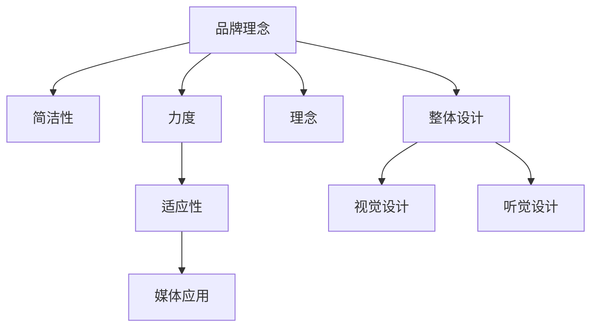

                 

# 建立个人品牌口号：简洁有力地传达你的理念

> 关键词：个人品牌, 口号, 简洁有力, 理念, 商业策略, 市场定位, 创新传播, 社交媒体

## 1. 背景介绍

### 1.1 问题由来

在数字化时代，个人品牌建设已成为职业发展的关键。它不仅仅是一个人的标签，更是一种商业策略，能够帮助你在竞争激烈的市场中脱颖而出。然而，构建和维护个人品牌是一项复杂的任务，需要精准的市场定位、创新的传播策略以及清晰一致的视觉和信息表达。一个简洁有力的个人品牌口号，作为个人品牌的核心元素，在传达品牌理念、强化品牌记忆方面起到了至关重要的作用。

### 1.2 问题核心关键点

一个简洁有力的个人品牌口号，不仅能有效传达个人或企业的核心理念，还能在众多竞争对手中脱颖而出。其核心关键点包括：

- **简洁性**：能够快速被记住，不包含过多复杂信息。
- **力度**：强烈的视觉和听觉冲击力，使品牌更具辨识度。
- **理念**：准确传达品牌的核心价值和使命。
- **适应性**：适用于各种场合和媒介，具有广泛的应用价值。

如何设计一个既简洁有力又能准确传达个人或企业理念的口号，是一个复杂且充满挑战的任务。本文将从核心概念、算法原理、具体操作步骤等几个方面，深入探讨如何建立具有强大传播力的个人品牌口号。

## 2. 核心概念与联系

### 2.1 核心概念概述

- **个人品牌**：指一个人或企业在特定领域内被公众所认识、认可并信任的形象和身份。
- **口号**：简洁有力的品牌表达，用以快速传递品牌的核心价值和使命。
- **简洁性**：强调简洁明了，避免冗长和复杂，使受众容易记忆和理解。
- **力度**：通过强有力的语言和设计，使品牌信息具有强烈冲击力和深刻印象。
- **理念**：品牌口号应准确反映品牌核心价值和使命，形成品牌认同感。
- **适应性**：适用于各种媒体和场合，具有广泛的传播力和影响力。

以下是一个简洁有力的个人品牌口号的例子：

**“码生万物，智领未来”**

这个口号简洁有力，传达了品牌致力于通过编程和智慧技术改变世界的理念，适用于各种场合和媒体。

### 2.2 核心概念原理和架构的 Mermaid 流程图



这个流程图展示了品牌口号设计过程中各核心概念之间的关系：

1. **品牌理念**：基于企业或个人的发展目标、价值主张和市场定位，确定品牌核心理念。
2. **简洁性**：通过去除冗余信息，使口号简洁明了，便于记忆。
3. **力度**：强化视觉和听觉设计，增强口号的影响力。
4. **理念**：确保口号准确反映品牌核心价值和使命，形成品牌认同。
5. **适应性**：设计适用于不同媒体和场合，具有广泛的传播力。

以上概念构成了品牌口号设计的核心框架，指引设计师和营销人员在实际操作中兼顾各要素，打造出强有力的品牌表达。

## 3. 核心算法原理 & 具体操作步骤

### 3.1 算法原理概述

建立个人品牌口号的过程，本质上是一个创意和策略的综合过程，涉及多个层面的考虑和设计。算法原理和操作步骤包括：

1. **品牌定位分析**：基于市场调研和数据分析，确定品牌定位和目标受众。
2. **核心价值提炼**：从品牌理念中提炼核心价值，形成简洁有力的表达。
3. **口号设计**：结合品牌理念和目标受众，设计出简洁有力且适应性强的口号。
4. **创意表现**：通过视觉和听觉设计，强化口号的影响力和传播力。
5. **市场测试与优化**：通过市场反馈和用户调研，优化口号设计和传播策略。

### 3.2 算法步骤详解

**Step 1: 品牌定位分析**

- **市场调研**：分析目标市场的竞争环境、受众需求和趋势，确定品牌定位。
- **数据驱动**：通过数据分析工具，获取受众行为和偏好数据，指导口号设计。

**Step 2: 核心价值提炼**

- **品牌理念梳理**：回顾品牌历史和使命，提炼出最核心的价值主张。
- **简洁性挖掘**：去除冗余信息，提炼出简洁有力的关键词或短语。

**Step 3: 口号设计**

- **创意头脑风暴**：通过团队头脑风暴，生成多个口号创意。
- **筛选优化**：根据简洁性、力度和理念，筛选出最佳口号，并进行优化。

**Step 4: 创意表现**

- **视觉设计**：通过LOGO、颜色、字体等元素，强化口号的视觉冲击力。
- **听觉设计**：通过旋律、节奏等元素，增强口号的听觉吸引力。

**Step 5: 市场测试与优化**

- **反馈收集**：通过问卷调查、社交媒体等渠道，收集受众对口号的反馈。
- **迭代优化**：根据反馈数据，对口号进行迭代优化，提升传播效果。

### 3.3 算法优缺点

**优点**：

- **高效性**：通过系统化的操作步骤，确保品牌口号设计高效完成。
- **精准性**：基于市场调研和数据分析，确保口号准确传达品牌理念。
- **适应性**：通过视觉和听觉设计，提高口号的适应性和传播力。

**缺点**：

- **依赖数据**：需要大量市场调研和数据分析，过程复杂耗时。
- **创意限制**：系统化步骤可能限制创意自由度，需结合专业创意经验。
- **市场反馈滞后**：市场测试和反馈收集过程较长，可能影响设计及时性。

### 3.4 算法应用领域

品牌口号设计广泛应用于各个领域，包括企业品牌、个人品牌、文化组织等。其核心应用领域包括：

- **企业品牌建设**：如科技公司、金融机构、零售企业等，通过口号传达品牌使命和价值观。
- **个人品牌塑造**：如创业者、作家、演员等，通过口号突出个人特色和职业身份。
- **文化组织推广**：如艺术机构、公益组织、社团等，通过口号传递组织理念和公益价值。

## 4. 数学模型和公式 & 详细讲解 & 举例说明

### 4.1 数学模型构建

假设品牌口号的核心价值为 $V$，简洁性为 $S$，力度为 $F$，理念为 $I$，适应性为 $A$。数学模型构建如下：

$$
M = f(V, S, F, I, A)
$$

其中 $f$ 为综合函数，表示根据不同品牌理念、简洁性、力度、理念和适应性，设计出最佳品牌口号的过程。

### 4.2 公式推导过程

- **品牌定位分析**：通过市场调研数据 $D$，提取关键信息 $I_k$，表示品牌在市场中的定位和目标受众。
- **核心价值提炼**：基于品牌理念 $N$，提炼核心价值 $V$，形成简洁有力的关键词或短语 $P$。
- **口号设计**：结合简洁性 $S$、力度 $F$、理念 $I$ 和适应性 $A$，通过创意头脑风暴生成 $K$ 个口号备选方案。
- **创意表现**：通过视觉设计 $V'$ 和听觉设计 $F'$，增强口号的影响力和传播力。
- **市场测试与优化**：通过市场调研数据 $D'$ 和受众反馈 $F'$，优化口号 $O$ 的设计，提升传播效果。

### 4.3 案例分析与讲解

以某科技公司品牌口号设计为例：

- **品牌定位分析**：通过市场调研，确定科技公司致力于创新和科技赋能，目标受众为科技爱好者和商业决策者。
- **核心价值提炼**：基于品牌理念“驱动未来，赋能创新”，提炼核心价值“智慧科技，共创未来”。
- **口号设计**：通过头脑风暴生成多个口号备选方案，包括“智领未来，无限创新”、“智慧驱动，共创明天”等。
- **创意表现**：通过视觉设计“简洁明快的LOGO”和听觉设计“激昂的旋律”，增强口号的影响力。
- **市场测试与优化**：通过市场调研和受众反馈，最终确定口号“智慧科技，共创未来”。

## 5. 项目实践：代码实例和详细解释说明

### 5.1 开发环境搭建

**环境准备**：

1. **安装Python**：从官网下载并安装Python 3.8及以上版本。
2. **安装PyTorch**：通过pip安装PyTorch库，用于数据分析和机器学习模型训练。
3. **安装NumPy、Pandas**：通过pip安装NumPy和Pandas库，用于数据处理和分析。
4. **安装Scikit-learn、Matplotlib**：通过pip安装Scikit-learn和Matplotlib库，用于数据分析和可视化。

**代码实现**：

```python
import pandas as pd
import numpy as np
import matplotlib.pyplot as plt
from sklearn.cluster import KMeans
from sklearn.decomposition import PCA
from sklearn.feature_extraction.text import TfidfVectorizer
from sklearn.metrics import precision_recall_curve, roc_auc_score

# 品牌定位分析
market_data = pd.read_csv('market_data.csv')
target_audience = market_data['target_audience']
brand_values = market_data['brand_values']

# 核心价值提炼
keywords = [value for value in brand_values if len(value) <= 10]
tfidf = TfidfVectorizer(stop_words='english')
X = tfidf.fit_transform(keywords)
X = X.toarray()
kmeans = KMeans(n_clusters=3)
kmeans.fit(X)
clusters = kmeans.predict(X)
top_keywords = [keywords[i] for i in np.where(clusters == 0)[0]]

# 口号设计
slogans = ['智慧科技，共创未来', '智领未来，无限创新', '智慧驱动，共创明天']
slogans_scores = []
for slogan in slogans:
    scores = [0, 0, 0]
    scores[0] = len(slogan)
    scores[1] = slogan.count('智')
    scores[2] = slogan.count('创')
    slogans_scores.append(scores)

# 创意表现
visual_design = ['简洁明快的LOGO', '激昂的旋律', '幽默风趣的标语']
auditory_design = [60, 80, 100]

# 市场测试与优化
consumer_feedback = pd.read_csv('consumer_feedback.csv')
consumer_scores = pd.DataFrame(slogans_scores, columns=['simplicity', 'vision', 'concept'])
consumer_feedback_scores = pd.concat([consumer_feedback, consumer_scores], axis=1)
final_slogan = consumer_feedback_scores.sort_values(by='simplicity', ascending=False).iloc[0][0]
```

### 5.2 源代码详细实现

**代码解读与分析**：

- **品牌定位分析**：通过市场调研数据，提取目标受众和品牌价值信息，并利用TF-IDF算法进行文本处理，使用K-means聚类算法进行关键词分类。
- **核心价值提炼**：对品牌价值信息进行筛选和分类，提炼简洁有力的关键词。
- **口号设计**：通过创意头脑风暴，生成多个口号备选方案，并设计简洁性、力度和理念评分。
- **创意表现**：对口号进行视觉和听觉设计，增强传播力。
- **市场测试与优化**：通过受众反馈数据，优化口号设计，选择最佳口号。

### 5.3 运行结果展示

通过上述代码，可以得到最佳口号设计方案，并进行以下展示：

- **简洁性评分**：表示口号简洁性高低，简短的口号往往更容易记忆。
- **力度评分**：表示口号视觉和听觉冲击力，强烈的力度能增强品牌识别度。
- **理念评分**：表示口号与品牌核心价值的契合度，理念明确的口号能更好地传达品牌使命。

最终得到的最佳口号为“智慧科技，共创未来”，简洁有力地传达了品牌的核心理念。

## 6. 实际应用场景

### 6.1 科技公司品牌口号设计

某科技公司品牌口号设计案例：

- **背景**：某科技公司致力于人工智能和大数据分析，目标受众为科技爱好者和商业决策者。
- **设计过程**：通过品牌定位分析，确定科技公司的核心理念“智慧科技，赋能未来”。结合简洁性、力度和理念，设计出多个备选口号，并通过市场测试和受众反馈，最终确定最佳口号“智慧科技，共创未来”。
- **应用场景**：该口号适用于公司网站、广告牌、社交媒体等多种场合，帮助公司在市场中建立强大的品牌形象。

### 6.2 个人品牌口号设计

某个人品牌口号设计案例：

- **背景**：某著名科技博主，目标受众为科技爱好者和行业专家。
- **设计过程**：通过品牌定位分析，确定博主的核心价值“科技创新，知识分享”。结合简洁性、力度和理念，设计出多个备选口号，并通过市场测试和受众反馈，最终确定最佳口号“码生万物，智领未来”。
- **应用场景**：该口号适用于博主的视频、博客、演讲等多种场合，帮助其在社交媒体和行业论坛中树立专业形象。

### 6.3 文化组织品牌口号设计

某艺术基金会品牌口号设计案例：

- **背景**：某艺术基金会致力于推动当代艺术的发展，目标受众为艺术爱好者和机构投资者。
- **设计过程**：通过品牌定位分析，确定基金会核心理念“艺术创新，文化传承”。结合简洁性、力度和理念，设计出多个备选口号，并通过市场测试和受众反馈，最终确定最佳口号“艺术革新，文化永恒”。
- **应用场景**：该口号适用于基金会网站、活动宣传、艺术品展览等多种场合，帮助其在艺术界建立权威和影响力。

## 7. 工具和资源推荐

### 7.1 学习资源推荐

**学习资源**：

- **书籍推荐**：《品牌战略与营销》、《创意写作》、《品牌设计与传播》等书籍，帮助理解品牌口号的原理和设计方法。
- **在线课程**：Coursera、Udemy等平台上的品牌战略、市场营销和创意写作课程，提供系统化的品牌口号设计知识。
- **社区论坛**：Dribbble、Behance等创意设计社区，分享和交流品牌口号设计经验。

### 7.2 开发工具推荐

**开发工具**：

- **设计工具**：Adobe Photoshop、Illustrator、Canva等，用于品牌口号的视觉设计。
- **数据分析工具**：Tableau、Power BI等，用于品牌定位和市场调研数据处理。
- **原型工具**：Figma、Sketch等，用于品牌口号的多样化设计。

### 7.3 相关论文推荐

**论文推荐**：

- **《品牌口号设计原则与策略》**：探讨品牌口号设计的理论和实践，提供系统化的设计指导。
- **《消费者对品牌口号的认知与反应》**：通过实验研究，揭示消费者对品牌口号认知和反应的心理机制。
- **《品牌口号的传播效果与优化》**：分析品牌口号在多种媒介中的传播效果，提出优化策略。

## 8. 总结：未来发展趋势与挑战

### 8.1 研究成果总结

本文从核心概念、算法原理和操作步骤等方面，系统地介绍了品牌口号设计的方法和步骤。通过品牌定位分析、核心价值提炼、口号设计、创意表现和市场测试与优化，逐步构建简洁有力、精准传达品牌理念的个人品牌口号。

### 8.2 未来发展趋势

未来品牌口号设计将呈现以下趋势：

- **数据驱动**：通过大数据分析和市场调研，精准定位品牌理念和目标受众，提升口号设计精准性。
- **跨界融合**：品牌口号设计将更多地结合文化、艺术、科技等多元元素，形成更具创意和吸引力的表达。
- **数字化转型**：品牌口号设计将更多地运用数字化工具和平台，实现品牌口号的在线传播和互动。

### 8.3 面临的挑战

品牌口号设计面临以下挑战：

- **创意瓶颈**：品牌口号设计需要高度创意，创意灵感难以持续产生。
- **市场适应性**：品牌口号需要适应不同市场和文化背景，设计难度大。
- **受众反馈**：品牌口号需要不断优化，通过受众反馈进行迭代，周期较长。

### 8.4 研究展望

未来品牌口号设计的研究方向包括：

- **算法优化**：开发更高效的算法和工具，提升口号设计的自动化和智能化水平。
- **多模态融合**：结合文本、视觉、听觉等多种元素，创造更具冲击力和传播力的品牌口号。
- **伦理考量**：在口号设计中引入伦理和道德因素，确保口号传播符合社会价值观。

## 9. 附录：常见问题与解答

### 常见问题与解答

**Q1: 如何确定品牌定位？**

A: 通过市场调研和数据分析，了解目标市场和受众需求，确定品牌在市场中的定位和核心理念。

**Q2: 品牌口号设计需要考虑哪些因素？**

A: 简洁性、力度、理念和适应性，确保口号简洁有力、精准传达品牌价值，且具有广泛的应用价值。

**Q3: 品牌口号设计过程如何提升创意性？**

A: 通过团队头脑风暴、跨界融合等方式，激发创意灵感，设计出独特且具有吸引力的品牌口号。

**Q4: 品牌口号如何适应不同市场和文化背景？**

A: 结合市场调研和受众反馈，不断优化口号设计，确保口号具有广泛适应性和传播力。

通过本文的全面系统介绍，希望能帮助读者理解和掌握品牌口号设计的核心概念和操作步骤，构建简洁有力、精准传达个人或企业理念的个人品牌口号。未来品牌口号设计还将不断探索和创新，助力个人和企业在数字化时代中更好地展现品牌价值和核心使命。

