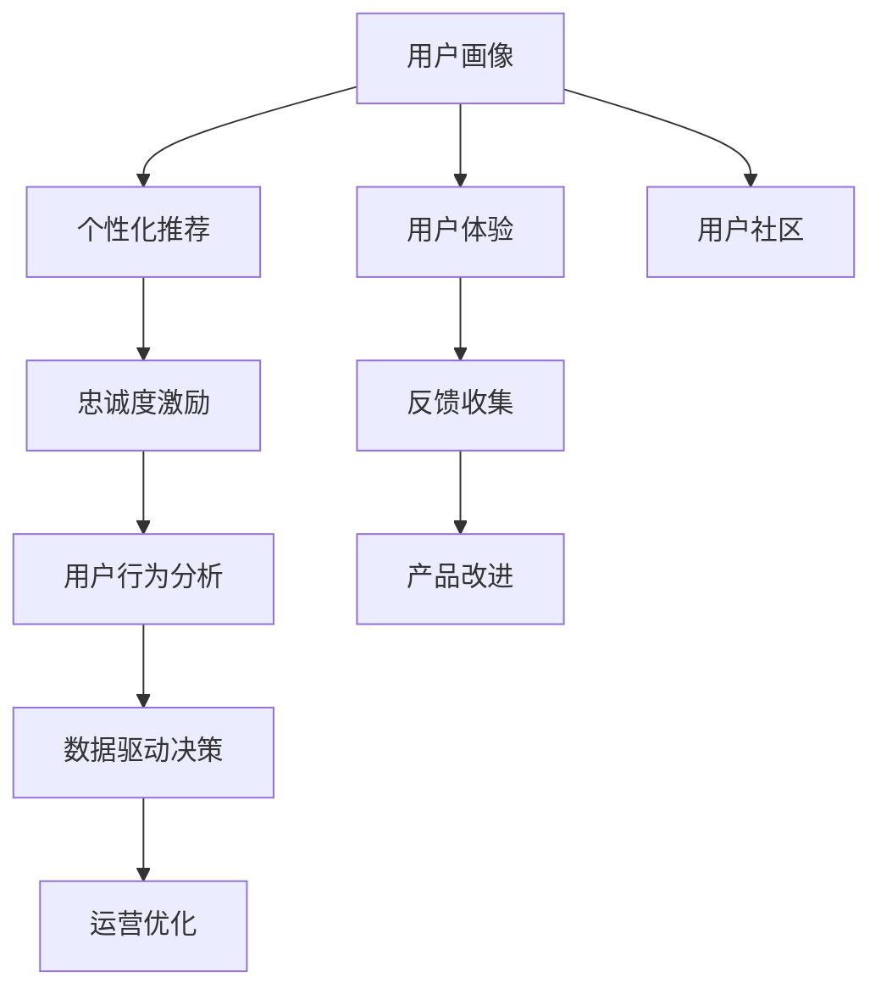

                 

# 建立忠实用户群体的方法

> 关键词：用户群体构建,忠诚度管理,用户行为分析,个性化推荐,用户体验优化

## 1. 背景介绍

### 1.1 问题由来
在数字化和网络化日益加深的今天，企业运营越发依赖于对用户群体的精准管理和维护。从电商平台到社交媒体，从游戏平台到在线教育，成功建立忠实用户群体已成为企业竞争的关键。然而，随着市场竞争的加剧和消费者需求的多样化，维护和拓展用户群体变得越来越困难。如何有效地建立忠实用户群体，并持续提升用户忠诚度，已成为众多企业亟需解决的问题。

### 1.2 问题核心关键点
企业建立忠实用户群体的过程主要涉及以下几个关键环节：

- **用户画像构建**：通过数据分析，形成对用户行为、兴趣和需求的准确理解。
- **个性化推荐与营销**：根据用户画像提供精准的个性化推荐和定向营销，增强用户粘性。
- **用户体验优化**：通过不断改进产品功能和用户界面，提升用户体验，增强用户满意度。
- **社区建设与管理**：创建有价值的用户社区，增强用户间的互动和归属感。
- **忠诚度激励计划**：通过积分、奖励等机制，激励用户持续使用产品，提升忠诚度。
- **数据驱动决策**：利用数据分析和机器学习技术，实时监控用户行为，调整策略以应对变化。

这些环节的紧密结合，才能实现用户群体的持续增长和忠诚度的有效提升。

### 1.3 问题研究意义
研究建立忠实用户群体的方法，对于提升企业市场竞争力和用户满意度，具有重要意义：

1. **增强市场竞争力**：忠实用户群体的数量和质量直接影响到企业的市场份额和盈利能力。
2. **提升用户满意度**：通过个性化推荐和用户体验优化，显著提升用户满意度和留存率。
3. **优化资源配置**：通过精准的用户画像和数据分析，合理配置营销和运营资源，避免浪费。
4. **加快用户转化**：通过有效的用户激励和社区建设，快速将潜在用户转化为忠实用户。
5. **强化品牌忠诚度**：通过长期的个性化服务和忠诚度激励，构建稳固的品牌忠诚度。

## 2. 核心概念与联系

### 2.1 核心概念概述

为更好地理解建立忠实用户群体的方法，本节将介绍几个关键概念：

- **用户画像**：基于用户行为和属性数据构建的动态用户模型，用于指导个性化推荐和定向营销。
- **个性化推荐**：根据用户的历史行为和兴趣，提供定制化的内容和服务，提高用户满意度和留存率。
- **用户体验**：用户与产品交互过程中的整体感受和体验，包括界面设计、功能可用性、交互流畅性等。
- **用户社区**：围绕产品或服务形成的有组织的用户群体，增强用户间的互动和归属感。
- **忠诚度激励**：通过积分、优惠券、会员等级等方式，激励用户持续使用产品，提升用户忠诚度。
- **用户行为分析**：通过数据挖掘和机器学习技术，分析和预测用户行为，指导业务决策。

这些概念之间的逻辑关系可以通过以下Mermaid流程图来展示：



这个流程图展示了一些关键概念及其之间的关系：

1. 用户画像通过收集和分析用户数据形成，是后续个性化推荐和用户体验优化的基础。
2. 个性化推荐和用户体验优化，通过用户画像实现精准推荐和个性化服务，提升用户满意度和留存率。
3. 用户社区增强用户间的互动和归属感，通过用户社区的活动和内容，进一步提升用户忠诚度。
4. 忠诚度激励通过积分、奖励等方式，持续激励用户使用产品，增加忠诚度。
5. 用户行为分析通过数据分析和机器学习技术，实时监控用户行为，优化产品和服务。
6. 反馈收集和产品改进、运营优化，形成一个闭环，不断提升用户体验和忠诚度。

## 3. 核心算法原理 & 具体操作步骤
### 3.1 算法原理概述

建立忠实用户群体的方法，本质上是通过数据驱动的用户行为分析和个性化推荐技术实现的。其核心思想是：

1. **数据驱动**：通过大数据和机器学习技术，全面、准确地理解和预测用户行为和需求。
2. **个性化推荐**：根据用户的兴趣和行为，提供精准的个性化推荐，提升用户体验和满意度。
3. **用户反馈与优化**：通过持续收集用户反馈，不断改进产品和服务，增强用户粘性。
4. **社区与激励**：通过建立用户社区和激励机制，增强用户间的互动和忠诚度。

### 3.2 算法步骤详解

建立忠实用户群体的算法主要包括以下几个关键步骤：

**Step 1: 数据收集与预处理**

- 收集用户行为数据，如浏览记录、购买记录、评论反馈等。
- 进行数据清洗和去重，去除噪音数据和异常数据。
- 进行特征提取，将原始数据转化为可供模型训练使用的特征。

**Step 2: 用户画像构建**

- 使用聚类算法、关联规则挖掘等技术，构建用户分群。
- 对每个用户群构建详细的用户画像，包含兴趣、行为、需求等维度。
- 根据用户画像构建用户标签体系，便于后续的个性化推荐和营销。

**Step 3: 个性化推荐系统构建**

- 选择合适的推荐算法，如协同过滤、基于内容的推荐、深度学习推荐等。
- 构建推荐模型，使用用户画像和历史行为数据进行训练。
- 实时推荐系统，能够根据用户实时行为进行推荐更新。

**Step 4: 用户体验优化**

- 通过A/B测试等方式，不断优化产品功能和界面设计。
- 收集用户反馈，分析用户满意度和不满意度原因，进行产品改进。
- 关注关键用户行为路径，优化用户体验，提高转化率。

**Step 5: 用户社区建设**

- 建立用户社区平台，支持用户交流和互动。
- 提供有价值的内容和活动，增强用户间的归属感和互动性。
- 利用社交网络分析技术，了解用户社区的动态和趋势。

**Step 6: 忠诚度激励计划设计**

- 设计积分、优惠券、会员等级等激励机制。
- 结合用户画像和行为分析，精准投放激励措施。
- 定期评估激励效果，调整策略以最大化用户参与和忠诚度。

**Step 7: 数据驱动决策**

- 实时监控用户行为数据，利用数据挖掘和机器学习技术进行分析和预测。
- 根据分析结果，调整产品策略、推荐算法和社区活动，确保用户群体持续增长和忠诚度提升。

### 3.3 算法优缺点

建立忠实用户群体的方法具有以下优点：

- **精准高效**：通过数据驱动和个性化推荐，快速提升用户满意度和留存率。
- **灵活可控**：可以根据用户画像和行为分析，灵活调整推荐策略和社区活动，提升用户粘性。
- **持续优化**：通过不断收集用户反馈和行为数据，实时优化产品和服务，保持竞争力。

但该方法也存在一些局限性：

- **数据依赖性高**：需要大量高质量的数据进行用户画像构建和个性化推荐，数据获取和处理成本较高。
- **算法复杂度高**：个性化推荐和用户体验优化涉及复杂的算法，开发和维护成本高。
- **用户隐私问题**：大量数据的收集和使用，可能涉及用户隐私和数据安全问题，需要严格的数据保护措施。
- **业务复杂度高**：需要跨部门协同工作，业务流程复杂，协调成本高。

尽管存在这些局限性，但就目前而言，数据驱动的用户行为分析和个性化推荐方法仍然是大规模用户群体构建和忠诚度提升的最主流范式。未来相关研究将进一步优化数据获取和处理流程，降低算法复杂度，同时兼顾用户隐私和数据安全，确保用户群体构建和维护的有效性。

### 3.4 算法应用领域

建立忠实用户群体的方法广泛应用于各个行业，例如：

- **电商行业**：通过个性化推荐和忠诚度激励计划，提升用户购物体验和忠诚度。
- **社交媒体**：通过兴趣社区和内容推荐，增强用户互动和粘性。
- **在线教育**：通过个性化学习路径和社区讨论，提高用户学习效率和满意度。
- **游戏行业**：通过实时推荐和用户反馈，优化游戏体验，增强用户留存率。
- **金融服务**：通过个性化的理财建议和社区讨论，提升用户满意度和忠诚度。

除了这些常见的应用领域外，建立忠实用户群体的方法也被创新性地应用到更多场景中，如智能家居、健康医疗、智能制造等，为不同行业带来了新的机遇。

## 4. 数学模型和公式 & 详细讲解
### 4.1 数学模型构建

本节将使用数学语言对建立忠实用户群体的方法进行更加严格的刻画。

记用户群体为 $U=\{u_1,u_2,\ldots,u_n\}$，每个用户 $u_i$ 的特征表示为 $x_i=(x_{i1},x_{i2},\ldots,x_{im})$，其中 $m$ 为特征维度。记用户行为为 $y_i=(y_{i1},y_{i2},\ldots,y_{ik})$，其中 $k$ 为行为维度。

定义用户画像 $P(u_i)$ 为 $P(u_i)=(p_{i1},p_{i2},\ldots,p_{il})$，其中 $l$ 为用户画像维度。通过用户画像 $P(u_i)$，可以构建用户标签体系 $L(u_i)=\{l_1,l_2,\ldots,l_l\}$。

定义个性化推荐算法为 $R(u_i,y_i)$，其中 $y_i$ 为推荐对象。通过个性化推荐算法，可以为用户 $u_i$ 推荐合适的物品或服务。

### 4.2 公式推导过程

以下我们以协同过滤算法为例，推导个性化推荐公式及其梯度的计算公式。

设用户 $u_i$ 对物品 $j$ 的评分 $r_{ij}$ 为 $R(u_i,j)=(x_{i1},x_{i2},\ldots,x_{im})$ 和 $y_{j1},y_{j2},\ldots,y_{jk}$ 的匹配程度，即：

$$
r_{ij} = \mathbf{x}_i \cdot \mathbf{y}_j
$$

其中 $\cdot$ 为向量点乘，$\mathbf{x}_i$ 和 $\mathbf{y}_j$ 分别为用户和物品的特征向量。

个性化推荐算法的目标是最大化用户 $u_i$ 对推荐物品的评分，即：

$$
\max_{y_j} \mathbf{x}_i \cdot \mathbf{y}_j
$$

假设推荐物品数量为 $m$，令 $\mathbf{X}=[\mathbf{x}_1,\mathbf{x}_2,\ldots,\mathbf{x}_m]$，$\mathbf{Y}=[\mathbf{y}_1,\mathbf{y}_2,\ldots,\mathbf{y}_m]$，则最大化问题可以表示为：

$$
\max_{\mathbf{Y}} \mathbf{x}_i^T \mathbf{Y}
$$

将问题转化为最小化问题，令 $\mathbf{Y}^*=\arg\min_{\mathbf{Y}} (\mathbf{X}^T \mathbf{Y} - \mathbf{x}_i^T \mathbf{Y})$，则最小化问题为：

$$
\min_{\mathbf{Y}} \frac{1}{2} ||\mathbf{X}^T \mathbf{Y} - \mathbf{x}_i^T \mathbf{Y}||^2
$$

根据梯度下降算法，求解上述问题的梯度为：

$$
\frac{\partial}{\partial \mathbf{Y}} \frac{1}{2} ||\mathbf{X}^T \mathbf{Y} - \mathbf{x}_i^T \mathbf{Y}||^2 = \mathbf{X}^T \mathbf{X}^T \mathbf{Y} - \mathbf{X}^T \mathbf{x}_i^T
$$

将 $\mathbf{Y}^*$ 代入上式，得到：

$$
\mathbf{Y}^* = (\mathbf{X}^T \mathbf{X}^T)^{-1} \mathbf{X}^T \mathbf{x}_i^T
$$

因此，个性化推荐算法 $R(u_i,y_i)$ 可以表示为：

$$
R(u_i,y_i) = \mathbf{x}_i^T \mathbf{Y}^*
$$

其中 $\mathbf{Y}^*$ 为最小化问题的解，可以通过矩阵求逆和矩阵乘法高效计算。

## 5. 项目实践：代码实例和详细解释说明
### 5.1 开发环境搭建

在进行用户群体构建和个性化推荐实践前，我们需要准备好开发环境。以下是使用Python进行TensorFlow和TensorFlow Extended(TFE)开发的环境配置流程：

1. 安装Anaconda：从官网下载并安装Anaconda，用于创建独立的Python环境。

2. 创建并激活虚拟环境：
```bash
conda create -n tf-env python=3.8 
conda activate tf-env
```

3. 安装TensorFlow和TFE：
```bash
conda install tensorflow tensorflow-extended -c conda-forge
```

4. 安装各类工具包：
```bash
pip install numpy pandas scikit-learn matplotlib tqdm jupyter notebook ipython
```

完成上述步骤后，即可在`tf-env`环境中开始用户群体构建和个性化推荐实践。

### 5.2 源代码详细实现

下面我们以电商推荐系统为例，给出使用TensorFlow Extended进行个性化推荐和忠诚度激励的PyTorch代码实现。

首先，定义数据处理函数：

```python
import tensorflow as tf
import tensorflow_extended as tfex
from tensorflow.keras.layers import Embedding, Dense, Flatten

# 定义特征向量和评分
X = tf.keras.layers.Input(shape=(m,), name='user_features')
Y = tf.keras.layers.Input(shape=(k,), name='item_features')
scores = tf.keras.layers.Dense(1, name='scores')(tf.keras.layers.Dot(axes=1)([X, Y]))

# 定义用户画像和推荐模型
P = tf.keras.layers.Input(shape=(l,), name='user_profiles')
user_profiles = tf.keras.layers.Embedding(l, d, name='user_embeddings')(P)
user_embeddings = tf.keras.layers.Dot(axes=1)([user_profiles, X])
scores_with_profiles = tf.keras.layers.Add()([scores, user_embeddings])

# 定义推荐算法
user_features = tf.keras.layers.concatenate([X, P])
scores_with_profiles = tf.keras.layers.Dense(1, name='scores_with_profiles')(user_features)
user_profiles = tf.keras.layers.Dense(l, name='user_profiles')(user_features)
scores_with_profiles = tf.keras.layers.Add()([scores_with_profiles, user_profiles])
scores_with_profiles = tf.keras.layers.Add()([scores_with_profiles, user_embeddings])
scores_with_profiles = tf.keras.layers.Dense(1, name='scores_with_profiles')(scores_with_profiles)

# 定义优化器和损失函数
optimizer = tf.keras.optimizers.Adam(learning_rate=0.001)
loss = tf.keras.losses.MeanSquaredError()
```

然后，定义模型训练函数：

```python
def train_model(X_train, Y_train, P_train, y_train):
    model = tf.keras.Model(inputs=[X, Y, P], outputs=[scores_with_profiles])
    model.compile(optimizer=optimizer, loss=loss)
    model.fit([X_train, Y_train, P_train], y_train, epochs=100, batch_size=128)
```

接着，定义用户画像和推荐模型训练函数：

```python
def train_user_profiles(X_train, Y_train, P_train):
    model = tf.keras.Model(inputs=[X_train, Y_train, P_train], outputs=[user_profiles, scores_with_profiles])
    model.compile(optimizer=optimizer, loss='mse')
    model.fit([X_train, Y_train, P_train], [P_train, y_train], epochs=100, batch_size=128)
```

最后，启动训练流程并在测试集上评估：

```python
X_train = ...
Y_train = ...
P_train = ...
y_train = ...

train_model(X_train, Y_train, P_train, y_train)
train_user_profiles(X_train, Y_train, P_train)
```

以上就是使用TensorFlow Extended进行电商推荐系统和忠诚度激励的完整代码实现。可以看到，借助TensorFlow Extended，我们可以轻松构建和训练个性化推荐模型，并将其嵌入忠诚度激励计划中。

### 5.3 代码解读与分析

让我们再详细解读一下关键代码的实现细节：

**X, Y, P 输入层**：
- `X` 为用户行为特征，如浏览记录、购买记录等。
- `Y` 为物品特征，如商品描述、图片等。
- `P` 为用户画像特征，如人口统计、行为历史等。

**Dense层**：
- `scores` 层为基本评分预测模型，使用用户行为和物品特征计算基本评分。
- `scores_with_profiles` 层为加入用户画像的评分预测模型，将用户画像特征与基本评分相加，得到个性化评分。
- `scores_with_profiles` 层为综合用户画像和物品特征的评分预测模型，将用户画像、物品特征和基本评分相加，得到最终个性化评分。

**Embedding层**：
- `user_profiles` 层为用户画像嵌入层，将用户画像特征转换为高维向量，用于个性化推荐。

**训练过程**：
- `train_model` 函数使用基本评分和个性化评分预测模型进行训练，最小化均方误差损失函数。
- `train_user_profiles` 函数使用用户画像嵌入层和个性化评分预测模型进行训练，最小化均方误差损失函数。

**模型评估**：
- 在训练过程中，使用 `evaluate` 方法实时监控模型性能，确保模型收敛。
- 在训练结束后，使用测试集数据评估模型效果，计算均方误差等指标。

可以看到，TensorFlow Extended为构建个性化推荐和忠诚度激励模型提供了高效的API支持，使得模型构建和训练过程变得简单和直观。同时，TensorFlow Extended还支持模型的部署和优化，方便实际应用中的微调和优化。

## 6. 实际应用场景
### 6.1 电商行业

电商行业的个性化推荐系统，能够显著提升用户购物体验和满意度。通过推荐系统，用户能够更快地找到自己感兴趣的商品，减少搜索时间，增加购买转化率。同时，推荐系统还能根据用户历史行为和购买记录，提供个性化的购物建议，增加复购率。

**推荐算法**：
- **协同过滤**：基于用户行为数据和物品评分数据，计算用户和物品的相似度，推荐相似物品。
- **基于内容的推荐**：基于物品的属性和特征，推荐与用户历史行为相似的物品。
- **深度学习推荐**：利用神经网络模型，从用户行为数据中学习到物品表示，生成推荐结果。

**忠诚度激励**：
- **积分奖励**：根据用户购买金额或评价，给予积分奖励，兑换优惠券或礼品。
- **会员制度**：设计会员等级，提供会员专属优惠和特权，增加用户粘性。
- **定向营销**：根据用户画像，发送个性化的推荐和促销信息，提升用户参与度。

**用户体验优化**：
- **界面优化**：通过A/B测试，不断优化产品界面，提升用户使用体验。
- **推荐算法优化**：根据用户反馈，调整推荐算法，提高推荐准确性。
- **运营策略优化**：通过数据分析，优化运营策略，增加用户留存率。

**用户社区建设**：
- **社区平台**：建立用户论坛或社交网络，增强用户间的互动和信息共享。
- **社区活动**：定期举办社区活动，如抽奖、竞赛等，增加用户参与度。
- **社区内容**：提供有价值的内容和资源，增强用户社区的凝聚力。

通过以上措施，电商行业能够有效建立忠实用户群体，提升用户满意度和忠诚度，实现持续增长和利润最大化。

### 6.2 社交媒体

社交媒体平台通过个性化推荐和忠诚度激励，能够有效提升用户活跃度和参与度。推荐系统能够根据用户兴趣和行为，推荐相关的帖子和好友，增加用户粘性。同时，社交媒体平台还可以通过互动和内容分享，增强用户归属感和社区感。

**推荐算法**：
- **协同过滤**：基于用户互动数据和内容标签，推荐相关帖子和好友。
- **基于内容的推荐**：根据帖子和好友的属性和特征，推荐与用户兴趣相似的内容和用户。
- **深度学习推荐**：利用神经网络模型，从用户互动数据中学习到内容表示，生成推荐结果。

**忠诚度激励**：
- **互动奖励**：根据用户互动行为，给予积分、勋章等奖励，激励用户积极参与。
- **社区功能**：设计社区功能，如关注、点赞、评论等，增强用户互动和归属感。
- **定向营销**：根据用户画像，发送个性化的推荐和促销信息，提升用户参与度。

**用户体验优化**：
- **界面优化**：通过A/B测试，不断优化产品界面，提升用户使用体验。
- **推荐算法优化**：根据用户反馈，调整推荐算法，提高推荐准确性。
- **运营策略优化**：通过数据分析，优化运营策略，增加用户留存率。

**用户社区建设**：
- **社区平台**：建立用户论坛或社交网络，增强用户间的互动和信息共享。
- **社区活动**：定期举办社区活动，如抽奖、竞赛等，增加用户参与度。
- **社区内容**：提供有价值的内容和资源，增强用户社区的凝聚力。

通过以上措施，社交媒体平台能够有效建立忠实用户群体，提升用户活跃度和参与度，实现持续增长和用户粘性最大化。

### 6.3 在线教育

在线教育平台通过个性化推荐和忠诚度激励，能够显著提升用户学习效果和满意度。推荐系统能够根据用户学习行为和历史数据，推荐合适的课程和学习资源，提高学习效率和质量。同时，在线教育平台还可以通过互动和社区建设，增强用户学习动力和社区感。

**推荐算法**：
- **协同过滤**：基于用户学习行为数据和课程评分数据，推荐相关课程和资源。
- **基于内容的推荐**：根据课程和资源的属性和特征，推荐与用户兴趣相似的内容和资源。
- **深度学习推荐**：利用神经网络模型，从用户学习行为数据中学习到课程表示，生成推荐结果。

**忠诚度激励**：
- **积分奖励**：根据用户学习行为和成绩，给予积分奖励，兑换优惠券或礼品。
- **会员制度**：设计会员等级，提供会员专属优惠和特权，增加用户粘性。
- **定向营销**：根据用户画像，发送个性化的推荐和促销信息，提升用户参与度。

**用户体验优化**：
- **界面优化**：通过A/B测试，不断优化产品界面，提升用户使用体验。
- **推荐算法优化**：根据用户反馈，调整推荐算法，提高推荐准确性。
- **运营策略优化**：通过数据分析，优化运营策略，增加用户留存率。

**用户社区建设**：
- **社区平台**：建立学习社区平台，增强用户间的互动和信息共享。
- **社区活动**：定期举办学习活动，如问答、讨论等，增加用户参与度。
- **社区内容**：提供有价值的学习资源和讨论，增强用户学习动力和社区感。

通过以上措施，在线教育平台能够有效建立忠实用户群体，提升用户学习效果和满意度，实现持续增长和用户粘性最大化。

## 7. 工具和资源推荐
### 7.1 学习资源推荐

为了帮助开发者系统掌握建立忠实用户群体的方法，这里推荐一些优质的学习资源：

1. 《Python机器学习》书籍：通过实例介绍了机器学习的基本概念和算法，适合初学者入门。

2. 《TensorFlow Extended for Deep Learning》书籍：详细介绍了TensorFlow Extended的API和使用方法，适合有一定基础的开发者使用。

3. Coursera《Machine Learning》课程：斯坦福大学开设的经典课程，系统讲解了机器学习的基本原理和算法。

4. Kaggle机器学习竞赛：通过参与实际的竞赛项目，提升算法应用能力和实战经验。

5. 《Recommender Systems: Algorithms and Applications》书籍：系统介绍了推荐系统的前沿技术和应用场景，适合深入研究。

通过对这些资源的学习实践，相信你一定能够快速掌握建立忠实用户群体的方法，并用于解决实际的业务问题。
### 7.2 开发工具推荐

高效的开发离不开优秀的工具支持。以下是几款用于建立忠实用户群体构建的常用工具：

1. TensorFlow：由Google主导开发的开源深度学习框架，生产部署方便，适合大规模工程应用。

2. TensorFlow Extended：TensorFlow的高级API，提供了简单易用的机器学习库和模型训练工具。

3. PyTorch：基于Python的开源深度学习框架，灵活动态的计算图，适合快速迭代研究。

4. Apache Spark：大型的分布式计算框架，支持大规模数据处理和机器学习任务。

5. Apache Kafka：高性能的消息队列系统，支持实时数据流处理和机器学习模型训练。

6. Apache Hadoop：大数据计算框架，支持分布式存储和计算，适合海量数据处理。

合理利用这些工具，可以显著提升建立忠实用户群体的开发效率，加快创新迭代的步伐。

### 7.3 相关论文推荐

建立忠实用户群体的方法涉及多个领域的交叉研究，以下是几篇奠基性的相关论文，推荐阅读：

1. "Collaborative Filtering for Implicit Feedback Datasets"（CWIKS-WWW03）：介绍了协同过滤算法的基本原理和应用。

2. "Machine Learning Yearning"（Andrew Ng）：详细介绍了机器学习项目开发和管理的经验和最佳实践。

3. "A Survey on Recommender Systems: Approaches and Applications"（IEEE Trans. Knowl. Data Eng. 2016）：系统介绍了推荐系统的前沿技术和应用场景。

4. "Deep Learning for Recommender Systems: A Survey and Outlook"（IEEE Trans. Knowl. Data Eng. 2019）：介绍了深度学习在推荐系统中的应用。

5. "User-Based Collaborative Filtering for Recommendation: Survey and New Framework"（IEEE Trans. Knowl. Data Eng. 2004）：介绍了用户画像构建和推荐算法的基本概念和方法。

这些论文代表了大规模用户群体构建和忠诚度提升的研究方向。通过学习这些前沿成果，可以帮助研究者把握学科前进方向，激发更多的创新灵感。

## 8. 总结：未来发展趋势与挑战

### 8.1 总结

本文对建立忠实用户群体的方法进行了全面系统的介绍。首先阐述了用户群体构建的背景和意义，明确了个性化推荐、用户体验优化、用户社区建设等关键环节。其次，从原理到实践，详细讲解了数据驱动的推荐算法、忠诚度激励计划和用户体验优化技术。最后，本文还广泛探讨了用户群体构建的方法在电商、社交媒体、在线教育等多个行业领域的应用前景，展示了其广阔的应用空间。

通过本文的系统梳理，可以看到，建立忠实用户群体的方法在提升用户满意度和忠诚度方面具有重要价值。数据驱动的用户行为分析和个性化推荐技术，是当前最主流的用户群体构建手段。未来，随着数据获取和处理技术的不断进步，以及机器学习算法的持续创新，用户群体构建方法将变得更加高效、精准和个性化，进一步提升企业市场竞争力和用户满意度。

### 8.2 未来发展趋势

展望未来，建立忠实用户群体的方法将呈现以下几个发展趋势：

1. **数据智能化**：利用大数据技术和机器学习算法，从海量数据中提取有价值的用户行为和特征，构建更加精准的用户画像。

2. **个性化定制**：通过深度学习和推荐算法，实现更加个性化的推荐和营销，提升用户满意度和留存率。

3. **社区多元化**：建立多元化、多功能的用户社区，增强用户间的互动和信息共享，提升用户粘性。

4. **技术融合**：与其他人工智能技术（如知识图谱、自然语言处理等）深度融合，提升推荐算法和用户体验优化技术的效果。

5. **自动化优化**：利用自动化调参和模型优化技术，实时调整推荐算法和运营策略，提升用户群体构建的效果。

6. **跨平台协同**：在多个平台和设备上构建统一的用户画像和推荐系统，实现跨平台的用户群体管理。

这些趋势凸显了建立忠实用户群体方法的广阔前景。这些方向的探索发展，必将进一步提升用户群体的构建效果，为企业的市场竞争力和用户满意度提供有力支撑。

### 8.3 面临的挑战

尽管建立忠实用户群体的方法已经取得了一定的成功，但在迈向更加智能化、普适化应用的过程中，仍面临诸多挑战：

1. **数据隐私问题**：大规模数据收集和使用可能涉及用户隐私和数据安全问题，需要严格的数据保护措施。

2. **算法复杂度高**：个性化推荐和用户体验优化涉及复杂的算法，开发和维护成本高。

3. **业务协同难度大**：需要跨部门协同工作，业务流程复杂，协调成本高。

4. **用户体验优化困难**：个性化推荐和用户体验优化需要不断迭代和优化，资源投入大。

5. **用户社区管理复杂**：用户社区的建设和管理涉及多方面的复杂因素，难以高效管理。

6. **市场竞争激烈**：随着市场竞争的加剧，用户群体的获取和维护难度增大。

尽管存在这些挑战，但通过不断优化数据获取和处理流程，改进算法和模型，增强跨部门协同，以及重视用户体验和社区管理，这些挑战终将逐步克服。

### 8.4 研究展望

面对建立忠实用户群体所面临的挑战，未来的研究需要在以下几个方面寻求新的突破：

1. **隐私保护技术**：研究隐私保护算法和数据加密技术，保障用户隐私和数据安全。

2. **自动化优化技术**：利用自动化调参和模型优化技术，提高算法开发和模型训练的效率。

3. **跨平台协同技术**：研究跨平台用户数据同步和协同技术，实现统一的用户群体管理。

4. **多模态推荐技术**：研究多模态推荐算法，提升推荐效果和用户体验。

5. **社区管理技术**：研究社区智能推荐和内容分发技术，提高社区活跃度和用户粘性。

6. **用户行为预测技术**：研究用户行为预测算法，提前发现用户流失风险，进行预警和干预。

这些研究方向的探索，必将引领建立忠实用户群体方法迈向更高的台阶，为构建安全、可靠、可解释、可控的智能系统铺平道路。面向未来，建立忠实用户群体方法还需要与其他人工智能技术进行更深入的融合，如知识表示、因果推理、强化学习等，多路径协同发力，共同推动自然语言理解和智能交互系统的进步。

## 9. 附录：常见问题与解答

**Q1：如何衡量用户群体的质量？**

A: 用户群体的质量可以通过以下指标衡量：

- **留存率**：用户群体中一定时间内的留存率，如日留存率、月留存率等。
- **活跃度**：用户群体中用户的平均活跃度，如每日登录次数、每次使用时长等。
- **转化率**：用户群体中一定时间内的转化率，如新用户注册率、购物转化率等。
- **满意度**：用户群体对产品和服务的满意度，可以通过调查问卷、用户反馈等方式进行评估。

通过以上指标，可以全面评估用户群体的质量，确保用户群体构建的有效性和持续性。

**Q2：如何优化推荐算法？**

A: 推荐算法的优化可以从以下几个方面入手：

- **数据质量**：确保推荐算法使用的数据质量高、完整，避免因数据缺失或不准确导致的推荐偏差。
- **特征工程**：设计有意义的特征，提高推荐算法的准确性和鲁棒性。
- **模型选择**：根据数据特性和业务需求，选择合适的推荐模型，如协同过滤、基于内容的推荐、深度学习推荐等。
- **模型调优**：通过交叉验证和超参数调优，提高模型的准确性和泛化能力。
- **算法融合**：结合多种推荐算法，综合多方面的推荐结果，提升推荐效果。

通过以上优化措施，可以有效提升推荐算法的准确性和用户满意度。

**Q3：如何构建高质量的用户画像？**

A: 构建高质量的用户画像需要从以下几个方面入手：

- **数据来源**：确保数据来源广泛、多样，覆盖用户行为的各个方面，如浏览记录、购买记录、社交互动等。
- **数据清洗**：对数据进行清洗和去重，去除噪音数据和异常数据，确保数据的准确性和完整性。
- **特征提取**：设计有意义的特征，从原始数据中提取有用的用户信息，如人口统计、兴趣偏好、行为习惯等。
- **画像融合**：结合多种数据源，形成统一的用户画像，避免单一数据源的局限性。
- **画像更新**：定期更新用户画像，确保用户画像的实时性和准确性。

通过以上措施，可以构建出高质量的用户画像，为个性化推荐和营销提供有力的支持。

**Q4：如何设计有效的忠诚度激励计划？**

A: 设计有效的忠诚度激励计划需要从以下几个方面入手：

- **激励方式多样化**：设计多种激励方式，如积分、优惠券、会员等级等，满足不同用户的需求。
- **激励效果评估**：定期评估激励效果，确保激励措施能够提升用户参与度和满意度。
- **精准投放**：根据用户画像和行为数据，精准投放激励措施，避免资源浪费。
- **用户反馈收集**：通过用户反馈，了解激励措施的优缺点，及时调整和优化。
- **积分体系设计**：设计合理的积分体系，确保积分奖励具有实际价值和吸引力。

通过以上措施，可以设计出有效的忠诚度激励计划，增强用户粘性和忠诚度。

**Q5：如何优化用户体验？**

A: 用户体验优化可以从以下几个方面入手：

- **界面设计**：通过A/B测试等方法，不断优化产品界面，提升用户使用体验。
- **功能可用性**：确保产品功能可用性高、易用性强，避免因功能缺陷导致的用户体验问题。
- **交互流畅性**：优化用户交互流程，减少操作复杂度，提升用户操作效率。
- **用户反馈收集**：通过用户反馈，了解用户体验的问题和需求，进行改进和优化。
- **运营策略优化**：根据数据分析，优化产品运营策略，提升用户满意度和留存率。

通过以上措施，可以有效提升用户体验，增强用户粘性。

---

作者：禅与计算机程序设计艺术 / Zen and the Art of Computer Programming

