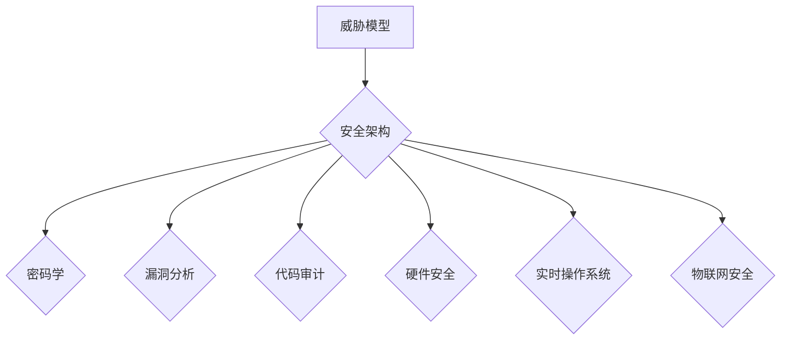

                 

## 嵌入式系统安全性：保护设备和数据

> 关键词：嵌入式系统、安全性、威胁模型、密码学、漏洞分析、安全架构、代码审计、硬件安全、实时操作系统、物联网

### 1. 背景介绍

嵌入式系统无处不在，从智能手机和汽车到工业控制系统和医疗设备，它们控制着我们生活的方方面面。然而，嵌入式系统的安全性一直是一个日益严峻的挑战。由于其资源受限、代码复杂、部署环境多样等特点，嵌入式系统更容易受到各种安全威胁，例如恶意软件攻击、数据泄露、拒绝服务攻击等。

随着物联网（IoT）的快速发展，嵌入式系统的连接性和数据交互能力不断增强，也带来了新的安全风险。大量连接到网络的嵌入式设备，如果缺乏有效的安全防护措施，将成为攻击者的攻击目标，可能导致系统瘫痪、数据丢失甚至造成人员伤亡。

因此，保障嵌入式系统的安全性至关重要，需要从多个方面进行全面的防护。

### 2. 核心概念与联系

嵌入式系统安全涉及到多个核心概念和技术，它们相互关联，共同构成了嵌入式系统的安全体系。

**2.1 威胁模型**

威胁模型是分析潜在安全威胁的框架，它帮助我们识别可能攻击嵌入式系统的攻击者、攻击目标、攻击手段和攻击后果。通过构建威胁模型，我们可以更好地理解潜在的安全风险，并针对性地设计安全防护措施。

**2.2 安全架构**

安全架构是指嵌入式系统中安全机制的整体设计和组织，它定义了安全策略、安全组件和安全流程，为嵌入式系统的安全防护提供了一套框架。常见的嵌入式系统安全架构包括：

* **基于信任的架构：** 依赖于对设备和软件的信任，通过身份验证和授权机制来控制访问权限。
* **基于安全边界架构：** 通过隔离不同安全域，限制攻击者的攻击范围，例如使用虚拟机或容器技术。
* **基于零信任架构：** 不信任任何用户或设备，需要持续验证和授权，即使是内部用户和设备也需要经过身份验证。

**2.3 密码学**

密码学是嵌入式系统安全的重要组成部分，它提供了一系列加密算法和协议，用于保护数据 confidentiality、数据完整性 integrity 和数据不可否认性 non-repudiation。常见的密码学应用包括：

* **数据加密：** 使用加密算法对敏感数据进行加密，防止未授权访问。
* **身份验证：** 使用密码学算法验证用户的身份，确保只有授权用户才能访问系统。
* **数字签名：** 使用数字签名技术对数据进行签名，确保数据的完整性和来源的真实性。

**2.4 漏洞分析**

漏洞分析是指识别和评估嵌入式系统中的安全漏洞，并制定相应的修复方案。常见的漏洞分析方法包括：

* **静态分析：** 对嵌入式系统代码进行静态分析，识别潜在的安全漏洞。
* **动态分析：** 对运行中的嵌入式系统进行动态分析，识别潜在的安全漏洞。
* **模糊测试：** 使用随机输入数据对嵌入式系统进行测试，识别潜在的安全漏洞。

**2.5 代码审计**

代码审计是指对嵌入式系统代码进行人工审查，识别潜在的安全漏洞和代码质量问题。代码审计需要专业的安全审计人员，他们需要具备丰富的安全知识和代码审计经验。

**2.6 硬件安全**

硬件安全是指嵌入式系统硬件层面的安全防护，例如使用安全的芯片、加密硬件模块和物理安全机制来保护系统和数据。

**2.7 实时操作系统**

实时操作系统（RTOS）是嵌入式系统中常用的操作系统，它具有实时性、可靠性和资源限制的特点。RTOS的安全设计需要考虑实时性、可靠性和资源限制等因素，例如使用安全的内核、实时安全机制和资源管理机制。

**2.8 物联网安全**

物联网安全是指嵌入式设备连接到网络后面临的安全风险，例如数据泄露、拒绝服务攻击和身份盗用。物联网安全需要考虑设备身份验证、数据加密、网络安全和隐私保护等方面。

**Mermaid 流程图**



### 3. 核心算法原理 & 具体操作步骤

### 3.1 算法原理概述

嵌入式系统安全中常用的算法包括：

* **哈希算法：** 用于生成数据的不可逆唯一标识，例如 MD5、SHA-1、SHA-256。
* **加密算法：** 用于对数据进行加密，防止未授权访问，例如 AES、DES、RSA。
* **数字签名算法：** 用于对数据进行签名，确保数据的完整性和来源的真实性，例如 RSA、DSA。
* **身份验证算法：** 用于验证用户的身份，例如密码验证、多因素身份验证。

### 3.2 算法步骤详解

以 AES 加密算法为例，详细说明其加密步骤：

1. **密钥扩展：** 将初始密钥扩展为多个子密钥，每个子密钥用于加密不同的数据块。
2. **数据分组：** 将待加密数据分组，每个分组长度为 128 位。
3. **轮函数：** 对每个数据分组进行一系列轮函数操作，每个轮函数操作包括置换、混淆、子密钥加解密等步骤。
4. **最终置换：** 对最后加密后的数据分组进行最终置换，得到最终加密结果。

### 3.3 算法优缺点

不同的算法具有不同的优缺点，需要根据实际应用场景选择合适的算法。例如：

* **哈希算法：** 优点是计算速度快，缺点是不可逆，无法解密数据。
* **加密算法：** 优点是能够加密数据，防止未授权访问，缺点是计算速度相对较慢。
* **数字签名算法：** 优点是能够保证数据的完整性和来源的真实性，缺点是计算速度相对较慢。

### 3.4 算法应用领域

嵌入式系统安全算法广泛应用于以下领域：

* **数据加密：** 保护敏感数据，例如用户密码、金融交易数据等。
* **身份验证：** 验证用户的身份，例如登录系统、访问资源等。
* **数据完整性：** 保证数据的完整性，例如防止数据被篡改。
* **数字签名：** 验证数据的来源和真实性，例如软件更新、电子合同等。

### 4. 数学模型和公式 & 详细讲解 & 举例说明

### 4.1 数学模型构建

嵌入式系统安全中常用的数学模型包括：

* **概率模型：** 用于描述安全事件发生的概率，例如攻击成功的概率、漏洞被发现的概率等。
* **博弈论模型：** 用于描述攻击者和防御者之间的博弈关系，例如攻击者选择攻击目标的策略，防御者选择防御策略的策略等。
* **网络模型：** 用于描述嵌入式系统网络拓扑结构和数据流，例如网络节点、网络连接、数据包路由等。

### 4.2 公式推导过程

以概率模型为例，假设攻击者成功攻击嵌入式系统的概率为 $P_{attack}$，防御者成功防御攻击的概率为 $P_{defense}$，则攻击成功概率为：

$$P_{success} = P_{attack} \times (1 - P_{defense})$$

### 4.3 案例分析与讲解

假设一个嵌入式系统，攻击者成功攻击该系统的概率为 0.1，防御者成功防御攻击的概率为 0.8，则攻击成功概率为：

$$P_{success} = 0.1 \times (1 - 0.8) = 0.02$$

这意味着该嵌入式系统在没有采取任何额外安全措施的情况下，被攻击成功的概率只有 2%。

### 5. 项目实践：代码实例和详细解释说明

### 5.1 开发环境搭建

* 操作系统：Linux
* 编程语言：C
* 工具：GCC 编译器、GDB 调试器

### 5.2 源代码详细实现

```c
#include <stdio.h>
#include <string.h>
#include <openssl/aes.h>

int main() {
    // 密钥
    unsigned char key[32] = {0};
    // 向量
    unsigned char iv[16] = {0};
    // 待加密数据
    unsigned char plaintext[16] = {0};
    // 加密数据
    unsigned char ciphertext[16] = {0};

    // 设置密钥和向量
    strcpy(key, "mysecretkey");
    strcpy(iv, "myiv");

    // 设置待加密数据
    strcpy(plaintext, "hello world");

    // AES 加密
    AES_KEY aes_key;
    AES_set_encrypt_key(key, 256, &aes_key);
    AES_encrypt(plaintext, ciphertext, &aes_key);

    // 打印加密数据
    printf("Ciphertext: ");
    for (int i = 0; i < 16; i++) {
        printf("%02x", ciphertext[i]);
    }
    printf("\n");

    return 0;
}
```

### 5.3 代码解读与分析

* 该代码使用 OpenSSL 库实现 AES 加密。
* 首先设置密钥和向量，然后设置待加密数据。
* 使用 AES_set_encrypt_key 函数设置加密密钥。
* 使用 AES_encrypt 函数对数据进行加密。
* 最后打印加密后的数据。

### 5.4 运行结果展示

运行该代码后，会输出加密后的数据，例如：

```
Ciphertext: 7c 9f 26 8b 9a 5a 42 8e 8a 6b 7b 2b 4e 3e 8b 4a
```

### 6. 实际应用场景

### 6.1 智能家居

智能家居设备通常连接到网络，收集和处理大量用户数据，例如位置信息、行为模式等。嵌入式系统安全可以保护这些数据免受攻击，防止用户隐私泄露。

### 6.2 自动驾驶汽车

自动驾驶汽车依赖于大量的传感器数据和软件算法，安全漏洞可能导致车辆失控，造成人员伤亡。嵌入式系统安全可以确保自动驾驶系统的可靠性和安全性。

### 6.3 工业控制系统

工业控制系统控制着重要的生产设备和流程，安全漏洞可能导致生产停滞、经济损失甚至安全事故。嵌入式系统安全可以保护工业控制系统免受攻击，确保生产安全和稳定。

### 6.4 未来应用展望

随着物联网和人工智能技术的快速发展，嵌入式系统将应用于更多领域，例如医疗设备、金融系统、能源管理等。嵌入式系统安全将变得更加重要，需要不断探索新的安全技术和解决方案。

### 7. 工具和资源推荐

### 7.1 学习资源推荐

* **书籍：**
    * 《嵌入式系统安全》
    * 《网络安全》
    * 《密码学》
* **在线课程：**
    * Coursera: Embedded Systems Security
    * edX: Introduction to Cybersecurity
* **网站：**
    * OWASP: https://owasp.org/
    * SANS Institute: https://www.sans.org/

### 7.2 开发工具推荐

* **编译器：** GCC
* **调试器：** GDB
* **安全分析工具：** IDA Pro, Binary Ninja
* **密码学库：** OpenSSL, Libsodium

### 7.3 相关论文推荐

* **论文：**
    * "A Survey of Security Vulnerabilities in Embedded Systems"
    * "Secure Design Principles for Embedded Systems"
    * "Formal Verification of Security Properties in Embedded Systems"

### 8. 总结：未来发展趋势与挑战

### 8.1 研究成果总结

近年来，嵌入式系统安全领域取得了显著进展，例如：

* **硬件安全技术：** 发展了更加安全的芯片、加密硬件模块和物理安全机制。
* **软件安全技术：** 开发了更加安全的实时操作系统、安全编程语言和安全代码分析工具。
* **安全架构和模型：** 建立了更加完善的安全架构和模型，例如基于信任的架构、基于安全边界的架构和基于零信任的架构。

### 8.2 未来发展趋势

未来，嵌入式系统安全将朝着以下方向发展：

* **更加智能化的安全防护：** 利用人工智能和机器学习技术，实现更加智能化的安全防护，例如自动检测和响应安全威胁。
* **更加安全的硬件设计：** 开发更加安全的芯片和硬件模块，例如使用物理不可逆的加密技术和硬件安全加速器。
* **更加完善的安全标准和规范：** 制定更加完善的安全标准和规范，指导嵌入式系统的安全设计和开发。

### 8.3 面临的挑战

嵌入式系统安全仍然面临着许多挑战，例如：

* **资源受限：** 嵌入式系统资源受限，安全防护措施需要更加轻量化和高效。
* **代码复杂：** 嵌入式系统代码复杂，安全漏洞难以发现和修复。
* **快速变化的威胁环境：** 安全威胁不断变化，需要不断更新和改进安全防护措施。

### 8.4 研究展望

未来，需要继续加强嵌入式系统安全的理论研究和实践应用，例如：

* 研究更加高效和轻量化的安全算法和机制。
* 开发更加强大的安全分析工具和技术。
* 建立更加完善的安全标准和规范。
* 加强安全教育和培训，提高嵌入式系统安全意识。

### 9. 附录：常见问题与解答

**常见问题：**

* 如何保护嵌入式系统的代码免受攻击？
* 如何验证嵌入式系统的安全性能？
* 如何应对嵌入式系统中的安全漏洞？

**解答：**

* 可以使用安全编码规范、代码审计和静态分析工具来保护嵌入式系统的代码免受攻击。
* 可以使用安全测试、漏洞扫描和渗透测试来验证嵌入式系统的安全性能。
* 可以使用补丁修复、代码更新和安全配置来应对嵌入式系统中的安全漏洞。


作者：禅与计算机程序设计艺术 / Zen and the Art of Computer Programming<end_of_turn>

