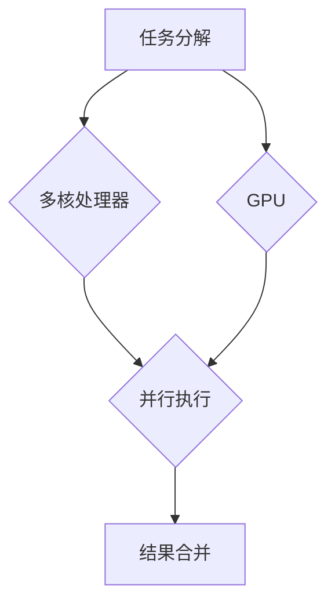

                 

## 并行计算：多核和GPU编程技术

> 关键词：并行计算、多核处理器、GPU编程、OpenMP、CUDA、性能优化、并行算法

## 1. 背景介绍

随着计算任务的日益复杂化和规模化，单核处理器已经难以满足现代应用的需求。为了提高计算效率，并行计算应运而生，它通过将一个任务分解成多个子任务，并同时在多个处理器上执行，从而大幅缩短计算时间。

多核处理器和GPU（图形处理单元）是并行计算的两个主要平台。多核处理器拥有多个独立的CPU核心，可以并行执行多个任务；而GPU拥有数千个并行处理单元，擅长处理大量数据并行计算。

## 2. 核心概念与联系

### 2.1 多核处理器

多核处理器是将多个CPU核心集成在一个芯片上，每个核心可以独立执行指令。多核处理器的出现，使得程序可以同时在多个核心上运行，从而提高计算效率。

### 2.2 GPU

GPU最初设计用于处理图形渲染，拥有大量的并行处理单元，能够高效地处理大量数据并行计算。近年来，GPU在科学计算、机器学习等领域得到了广泛应用。

### 2.3 并行编程模型

为了利用多核处理器和GPU的并行能力，需要使用特定的并行编程模型。常见的并行编程模型包括：

* **OpenMP:** 一种基于共享内存的并行编程模型，适用于多核处理器。
* **CUDA:** 一种基于GPU的并行编程模型，由NVIDIA开发。

**Mermaid 流程图**



## 3. 核心算法原理 & 具体操作步骤

### 3.1 算法原理概述

并行算法的核心思想是将一个大型问题分解成多个子问题，然后在不同的处理器上并行执行这些子问题，最后将子问题的结果合并得到最终结果。

### 3.2 算法步骤详解

1. **任务分解:** 将一个大型问题分解成多个独立的子问题。
2. **数据分配:** 将子问题分配给不同的处理器。
3. **并行执行:** 在不同的处理器上并行执行子问题。
4. **结果合并:** 将子问题的结果合并得到最终结果。

### 3.3 算法优缺点

**优点:**

* **提高计算效率:** 通过并行执行，可以大幅缩短计算时间。
* **提高资源利用率:** 可以充分利用多核处理器和GPU的计算资源。

**缺点:**

* **算法设计复杂:** 需要对算法进行专门的设计和优化，以适应并行计算环境。
* **数据同步问题:** 需要解决不同处理器之间数据同步的问题。

### 3.4 算法应用领域

并行算法广泛应用于以下领域：

* **科学计算:** 天体模拟、分子动力学、气候模型等。
* **机器学习:** 深度学习、图像识别、自然语言处理等。
* **大数据处理:** 数据分析、数据挖掘、数据可视化等。

## 4. 数学模型和公式 & 详细讲解 & 举例说明

### 4.1 数学模型构建

假设一个任务可以分解成N个子任务，每个子任务的执行时间为T，则总的执行时间为：

$$T_{total} = N * T$$

如果使用并行计算，则每个子任务可以分配给不同的处理器执行，假设每个处理器执行一个子任务的时间为T'，则总的执行时间为：

$$T_{parallel} = T'$$

### 4.2 公式推导过程

并行计算的加速比可以表示为：

$$Speedup = \frac{T_{total}}{T_{parallel}} = \frac{N * T}{T'} = \frac{N}{P}$$

其中P为处理器数量。

### 4.3 案例分析与讲解

假设一个任务需要100秒才能完成，并将其分解成10个子任务，每个子任务需要10秒才能完成。如果使用单核处理器执行，则总的执行时间为100秒。如果使用4个处理器并行执行，则每个处理器执行一个子任务，总的执行时间为10秒。

此时，并行计算的加速比为：

$$Speedup = \frac{100}{10} = 10$$

## 5. 项目实践：代码实例和详细解释说明

### 5.1 开发环境搭建

本例使用OpenMP进行并行计算，需要安装支持OpenMP的编译器和开发环境。

### 5.2 源代码详细实现

```c++
#include <iostream>
#include <omp.h>

int main() {
    int N = 10000;
    double sum = 0.0;

    #pragma omp parallel for reduction(+:sum)
    for (int i = 0; i < N; i++) {
        sum += i;
    }

    std::cout << "Sum: " << sum << std::endl;
    return 0;
}
```

### 5.3 代码解读与分析

* `#pragma omp parallel for`: 这是一个OpenMP指令，用于将循环语句并行化执行。
* `reduction(+:sum)`: 这是一个OpenMP clause，用于在并行执行过程中对变量sum进行累加操作。

### 5.4 运行结果展示

编译并运行代码，可以观察到程序执行时间显著缩短，这是由于OpenMP将循环语句并行化执行的结果。

## 6. 实际应用场景

### 6.1 科学计算

在科学计算领域，并行计算可以加速复杂的数值计算，例如天体模拟、分子动力学、气候模型等。

### 6.2 机器学习

在机器学习领域，并行计算可以加速深度学习模型的训练和推理过程，例如图像识别、自然语言处理等。

### 6.3 大数据处理

在数据分析、数据挖掘、数据可视化等大数据处理任务中，并行计算可以提高数据处理速度和效率。

### 6.4 未来应用展望

随着计算任务的不断复杂化和规模化，并行计算将在未来发挥更加重要的作用。例如，在量子计算、人工智能等领域，并行计算将成为实现突破的关键技术。

## 7. 工具和资源推荐

### 7.1 学习资源推荐

* **OpenMP 官方文档:** https://www.openmp.org/
* **CUDA 官方文档:** https://docs.nvidia.com/cuda/

### 7.2 开发工具推荐

* **GCC/Clang:** 支持OpenMP的编译器。
* **NVIDIA CUDA Toolkit:** 用于开发GPU程序的工具包。

### 7.3 相关论文推荐

* **An Overview of OpenMP:** https://www.openmp.org/wp-content/uploads/2019/03/OpenMP-Overview.pdf
* **CUDA C Programming Guide:** https://docs.nvidia.com/cuda/cuda-c-programming-guide/index.html

## 8. 总结：未来发展趋势与挑战

### 8.1 研究成果总结

并行计算技术取得了显著的进展，多核处理器和GPU的性能不断提升，并行编程模型也更加成熟。

### 8.2 未来发展趋势

* **异构计算:** 将CPU、GPU、FPGA等不同类型的处理器结合起来，构建更加高效的计算平台。
* **人工智能加速:** 利用并行计算加速人工智能算法的训练和推理过程。
* **边缘计算:** 将并行计算技术部署到边缘设备上，实现更低延迟和更高效率的计算。

### 8.3 面临的挑战

* **算法设计:** 设计高效的并行算法仍然是一个挑战。
* **数据同步:** 在并行计算环境中，需要解决数据同步的问题。
* **编程复杂性:** 并行编程的复杂性仍然较高，需要更高的编程技能。

### 8.4 研究展望

未来，并行计算技术将继续发展，并应用于更多领域。研究人员将继续探索新的并行计算模型和算法，以提高计算效率和解决更复杂的问题。

## 9. 附录：常见问题与解答

### 9.1 什么是并行计算？

并行计算是指通过同时在多个处理器上执行任务来提高计算效率的一种计算方法。

### 9.2 什么是多核处理器？

多核处理器是将多个CPU核心集成在一个芯片上，每个核心可以独立执行指令。

### 9.3 什么是GPU？

GPU（图形处理单元）最初设计用于处理图形渲染，拥有大量的并行处理单元，擅长处理大量数据并行计算。

### 9.4 如何选择合适的并行编程模型？

选择合适的并行编程模型取决于具体的应用场景和硬件平台。

### 9.5 并行计算有哪些优势？

并行计算可以提高计算效率、提高资源利用率、加速算法执行时间等。


作者：禅与计算机程序设计艺术 / Zen and the Art of Computer Programming 
<end_of_turn>

