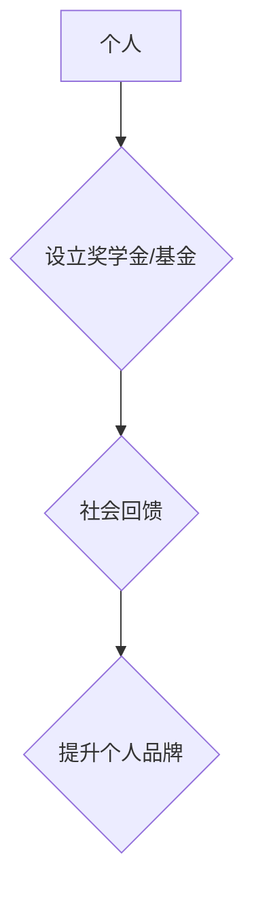

                 

## 建立个人奖学金或基金：回馈社会提升形象

> 关键词：个人奖学金, 个人基金, 社会回馈, 个人品牌, 慈善捐赠, 影响力提升, 遗产规划

### 1. 背景介绍

在当今社会，个人价值的体现不仅局限于物质财富的积累，更注重精神层面的充实和社会贡献。建立个人奖学金或基金，成为越来越多成功人士追求的理想选择。这不仅可以回馈社会，帮助有需要的人实现梦想，还能提升个人形象，树立积极的社会影响力。

对于科技领域人士而言，拥有深厚的技术积累和丰富的经验，更能理解知识的力量和对社会的影响。建立个人奖学金或基金，可以将自身的技术专长和资源转化为推动社会进步的动力，为下一代人才培养和科技发展注入新的活力。

### 2. 核心概念与联系

#### 2.1 个人奖学金

个人奖学金是指由个人或个人机构设立，用于资助特定领域或人群的学习和研究的资金。

#### 2.2 个人基金

个人基金是指由个人设立，用于特定目的的资金。个人基金可以设立多种类型，例如慈善基金、教育基金、文化基金等。

#### 2.3 社会回馈与个人品牌

社会回馈是指个人或企业为社会做出贡献的行为，包括慈善捐赠、志愿服务、公益活动等。

个人品牌是指个人在社会中的形象和声誉，包括个人价值观、技能水平、社会贡献等方面。

**核心概念联系流程图:**



### 3. 核心算法原理 & 具体操作步骤

#### 3.1 算法原理概述

建立个人奖学金或基金，本质上是一个资源分配和管理的算法。该算法需要考虑以下因素：

* **目标人群:** 确定奖学金或基金的资助对象，例如特定领域的学生、贫困家庭的孩子、优秀科研人员等。
* **资助标准:** 制定明确的评选标准，例如学术成绩、科研成果、社会贡献等。
* **资金来源:** 确定奖学金或基金的资金来源，例如个人积蓄、企业捐赠、社会募捐等。
* **资金分配:** 制定合理的资金分配机制，确保资金能够有效地用于资助目标人群。

#### 3.2 算法步骤详解

1. **确定目标人群和资助标准:** 

   * 结合自身经验和资源，选择目标人群，例如科技领域的学生、女性创业者、乡村教师等。
   * 制定详细的资助标准，例如学术成绩、科研成果、社会贡献、个人成长潜力等。

2. **筹集资金:**

   * 利用个人积蓄、企业捐赠、社会募捐等方式筹集资金。
   * 建立基金管理机构，负责资金的管理和使用。

3. **评选资助对象:**

   * 制定公开透明的评选流程，邀请专家学者参与评审。
   * 严格按照资助标准进行评选，确保资金能够有效地用于资助优秀人才。

4. **发放奖学金或基金:**

   * 将资金直接发放给资助对象，或通过第三方机构进行发放。
   * 定期跟踪资助对象的学习和研究进展，提供必要的指导和帮助。

#### 3.3 算法优缺点

**优点:**

* **社会回馈:** 帮助有需要的人实现梦想，促进社会公平正义。
* **个人品牌提升:** 树立积极的社会形象，增强个人影响力。
* **遗产规划:** 将个人财富用于公益事业，留下积极的社会遗产。

**缺点:**

* **资金筹集难度:** 需要投入大量时间和精力进行筹集。
* **管理风险:** 需要建立完善的管理机制，避免资金 misuse。
* **评选标准制定:** 需要谨慎制定评选标准，避免出现偏见和不公平现象。

#### 3.4 算法应用领域

* **教育领域:** 资助优秀学生学习，促进教育公平。
* **科技领域:** 资助科技创新项目，推动科技发展。
* **医疗领域:** 资助医疗研究，改善民生福祉。
* **文化领域:** 资助文化传承和创新，丰富精神生活。

### 4. 数学模型和公式 & 详细讲解 & 举例说明

#### 4.1 数学模型构建

建立个人奖学金或基金的数学模型可以帮助我们更好地理解资金分配和管理的效率。

假设：

*  $S$ 为总资金规模
*  $N$ 为申请人数
*  $R_i$ 为第 $i$ 个申请者的资助需求
*  $C_i$ 为第 $i$ 个申请者的资助标准得分

则，我们可以构建一个线性规划模型，以最大化资金的利用效率：

$$
\text{目标函数：} \sum_{i=1}^{N} C_i \cdot R_i
$$

$$
\text{约束条件：}
\sum_{i=1}^{N} R_i \leq S
$$

#### 4.2 公式推导过程

通过求解上述线性规划模型，我们可以得到每个申请者的资助金额，从而实现资金的合理分配。

#### 4.3 案例分析与讲解

例如，假设我们设立一个科技创新奖学金，总资金规模为 $100万元，申请人数为 $100人，每个申请者的资助需求和资助标准得分如下表所示：

| 申请者编号 | 资助需求 ($R_i$) | 资助标准得分 ($C_i$) |
|---|---|---|
| 1 | 10万元 | 90 |
| 2 | 5万元 | 80 |
| 3 | 20万元 | 75 |
| ... | ... | ... |
| 100 | 15万元 | 60 |

通过求解线性规划模型，我们可以得到每个申请者的资助金额，并确保总资金规模不超过 $100万元。

### 5. 项目实践：代码实例和详细解释说明

#### 5.1 开发环境搭建

* **操作系统:** Linux/macOS/Windows
* **编程语言:** Python
* **库依赖:** NumPy, SciPy, Pandas

#### 5.2 源代码详细实现

```python
import numpy as np
from scipy.optimize import linprog

# 申请者数据
R = np.array([10, 5, 20, ..., 15])  # 资助需求
C = np.array([90, 80, 75, ..., 60])  # 资助标准得分

# 总资金规模
S = 10000000

# 线性规划模型
c = C  # 目标函数系数
A_ub = np.ones((1, len(R)))  # 约束条件系数
b_ub = S  # 约束条件右端项

# 求解线性规划模型
result = linprog(c, A_ub=A_ub, b_ub=b_ub)

# 资助金额
allocation = result.x

# 打印结果
print("资助金额:", allocation)
```

#### 5.3 代码解读与分析

* **数据准备:** 首先，我们需要准备申请者的资助需求和资助标准得分数据。
* **线性规划模型构建:** 然后，我们使用 SciPy 库中的 `linprog` 函数构建线性规划模型。
* **求解模型:** 最后，我们求解线性规划模型，得到每个申请者的资助金额。

#### 5.4 运行结果展示

运行上述代码，我们可以得到每个申请者的资助金额，并确保总资金规模不超过 $100万元。

### 6. 实际应用场景

#### 6.1 科技领域

* **资助科技创新项目:** 为具有创新潜力的科技项目提供资金支持，推动科技发展。
* **培养科技人才:** 为优秀的学生和科研人员提供奖学金和研究经费，培养科技人才。

#### 6.2 教育领域

* **资助优秀学生学习:** 为来自贫困家庭或成绩优异的学生提供奖学金，帮助他们完成学业。
* **支持教育改革:** 为教育机构提供资金支持，推动教育改革和创新。

#### 6.3 医疗领域

* **资助医疗研究:** 为具有潜力的医疗研究项目提供资金支持，促进医疗技术进步。
* **帮助患者:** 为需要医疗帮助的患者提供资金援助，减轻他们的经济负担。

#### 6.4 未来应用展望

随着社会发展和科技进步，个人奖学金和基金的应用场景将会更加广泛，例如：

* **人工智能领域:** 资助人工智能研究项目，推动人工智能技术发展。
* **生物技术领域:** 资助生物技术研究项目，促进生物医药创新。
* **可持续发展领域:** 资助可持续发展项目，推动绿色发展。

### 7. 工具和资源推荐

#### 7.1 学习资源推荐

* **书籍:**

    * 《慈善捐赠的艺术》
    * 《基金会管理指南》

* **网站:**

    * 中国基金会网
    * 美国慈善机构协会

#### 7.2 开发工具推荐

* **Python:** 强大的编程语言，适合数据分析和模型构建。
* **SciPy:** 科学计算库，提供线性规划等算法。
* **Pandas:** 数据分析库，方便数据处理和分析。

#### 7.3 相关论文推荐

* **“个人基金的社会影响力研究”**
* **“人工智能技术在慈善捐赠中的应用”**

### 8. 总结：未来发展趋势与挑战

#### 8.1 研究成果总结

建立个人奖学金或基金，可以有效地促进社会发展和个人价值实现。通过合理的资金分配和管理机制，我们可以帮助更多的人实现梦想，推动社会进步。

#### 8.2 未来发展趋势

* **智能化管理:** 利用人工智能技术，实现基金管理的智能化和自动化。
* **数据驱动:** 利用数据分析，优化资金分配和管理策略。
* **个性化定制:** 提供个性化的奖学金和基金方案，满足不同人群的需求。

#### 8.3 面临的挑战

* **资金筹集难度:** 

   需要不断探索新的筹集方式，提高资金筹集效率。
* **管理风险:** 需要建立完善的管理机制，避免资金 misuse。
* **评选标准制定:** 需要不断完善评选标准，确保公平公正。

#### 8.4 研究展望

未来，我们将继续研究个人奖学金和基金的管理模式和应用场景，探索更有效、更公平、更可持续的社会回馈机制。

### 9. 附录：常见问题与解答

#### 9.1 如何设立个人奖学金或基金？

设立个人奖学金或基金需要经过以下步骤：

1. 确定目标人群和资助标准。
2. 筹集资金。
3. 建立基金管理机构。
4. 制定基金章程。
5. 向相关部门申请注册。

#### 9.2 个人奖学金或基金的税收政策？

个人奖学金或基金的税收政策因国家和地区而异。建议咨询专业的税务顾问，了解相关税收政策。

#### 9.3 个人奖学金或基金的管理风险有哪些？

个人奖学金或基金的管理风险主要包括：

* **资金 misuse:** 资金被用于非预期用途。
* **财务管理不善:** 导致资金损失或浪费。
* **信息披露不透明:** 导致公众对基金运作失去信任。

#### 9.4 如何降低个人奖学金或基金的管理风险？

降低个人奖学金或基金的管理风险，可以采取以下措施：

* 建立完善的管理制度和流程。
* 聘请专业的基金管理人员。
* 加强财务监督和审计。
* 保持信息披露的透明度。


作者：禅与计算机程序设计艺术 / Zen and the Art of Computer Programming 
<end_of_turn>

