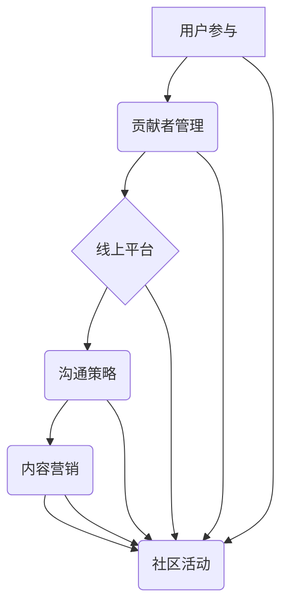

                 

## 建立开源项目的在线社区：社区运营和品牌建设

> 关键词：开源项目、社区运营、品牌建设、用户参与、贡献者管理、线上平台、沟通策略、内容营销、社区活动

## 1. 背景介绍

开源软件已经成为现代软件开发的基石，其灵活、透明和协作的特性推动着技术创新和软件生态的蓬勃发展。然而，开源项目的成功不仅取决于其技术本身，更依赖于一个活跃、充满活力的在线社区。

一个强大的开源社区可以为项目带来诸多益处：

* **加速软件开发：** 社区成员可以共同贡献代码、测试和文档，加速软件的迭代和完善。
* **提升软件质量：** 多方审阅和测试可以有效发现和修复软件中的bug，提高软件的稳定性和可靠性。
* **扩大用户群体：** 社区平台可以帮助项目吸引更多用户，扩大其影响力和应用范围。
* **增强品牌形象：** 一个活跃的社区可以提升开源项目的品牌形象，吸引更多开发者和企业参与。

然而，建立和运营一个成功的开源社区并非易事，需要精心策划和持续的投入。

## 2. 核心概念与联系

开源社区运营的核心概念包括：

* **用户参与：** 鼓励社区成员积极参与项目开发、讨论和贡献。
* **贡献者管理：** 建立有效的贡献者管理机制，引导和协调贡献者的工作。
* **线上平台：** 选择合适的线上平台，提供社区成员交流、协作和获取信息的空间。
* **沟通策略：** 制定有效的沟通策略，及时传递项目信息，回应社区成员的疑问和反馈。
* **内容营销：** 通过高质量的内容吸引和留住社区成员，增强社区的粘性。
* **社区活动：** 组织线上线下活动，增强社区成员之间的互动和凝聚力。

这些概念相互关联，共同构成了开源社区运营的整体框架。



## 3. 核心算法原理 & 具体操作步骤

开源社区运营并非一个纯粹的技术问题，它更像是一个复杂的社会系统，需要运用一定的算法和策略来引导和管理。

### 3.1  算法原理概述

开源社区运营的算法原理主要基于以下几个方面：

* **网络分析：** 通过分析社区成员之间的关系和互动，识别关键人物和活跃群体，制定针对性的运营策略。
* **内容推荐：** 基于用户兴趣和行为，推荐相关内容，提高用户参与度和留存率。
* **社区分层：** 将社区成员按照贡献度、经验和角色进行分层管理，提高社区的组织效率和协作能力。
* **激励机制：** 通过积分、徽章、排名等方式激励社区成员积极参与，增强他们的归属感和贡献意愿。

### 3.2  算法步骤详解

开源社区运营的具体操作步骤可以概括为以下几个阶段：

* **社区建设阶段：** 选择合适的线上平台，制定社区规则和运营策略，招募初始社区成员。
* **社区活跃阶段：** 通过内容营销、社区活动等方式吸引更多用户，鼓励用户参与讨论和贡献。
* **社区发展阶段：** 建立完善的贡献者管理机制，识别和培养社区核心成员，推动项目发展。
* **社区维护阶段：** 持续监控社区运营情况，及时解决问题，维护社区的稳定和健康发展。

### 3.3  算法优缺点

开源社区运营算法的优点在于：

* **提高效率：** 通过算法自动化处理一些重复性任务，提高社区运营效率。
* **个性化服务：** 基于用户数据，提供个性化的内容推荐和服务，提升用户体验。
* **数据驱动决策：** 通过数据分析，了解社区成员的喜好和需求，制定更有效的运营策略。

缺点在于：

* **算法偏差：** 算法本身可能存在偏差，导致运营策略不准确或产生负面影响。
* **数据隐私：** 收集和使用用户数据需要谨慎处理，确保数据隐私安全。
* **缺乏人性化：** 过度依赖算法可能会忽略社区成员的情感需求和个性化需求。

### 3.4  算法应用领域

开源社区运营算法的应用领域非常广泛，包括：

* **软件开发社区：** 帮助开源项目招募贡献者、管理代码库、提升软件质量。
* **学术研究社区：** 促进学术交流、分享研究成果、加速科研进展。
* **兴趣爱好社区：** 帮助用户找到志同道合的朋友、分享兴趣爱好、构建社群。

## 4. 数学模型和公式 & 详细讲解 & 举例说明

开源社区运营可以借助数学模型和公式来量化社区活跃度、用户参与度和贡献度等指标，帮助运营者更好地理解社区发展趋势和制定运营策略。

### 4.1  数学模型构建

一个常用的数学模型是**巴贝洛夫指数**，用于衡量社区活跃度。巴贝洛夫指数定义为：

$$
\text{巴贝洛夫指数} = \frac{\text{活跃用户数}}{\text{总用户数}}
$$

其中，活跃用户是指在一定时间段内至少参与一次社区活动的用户的数量。

### 4.2  公式推导过程

巴贝洛夫指数的推导过程如下：

1. 假设社区总用户数为N，活跃用户数为A。
2. 活跃度可以定义为活跃用户占总用户数的比例。
3. 因此，活跃度公式为：

$$
\text{活跃度} = \frac{A}{N}
$$

### 4.3  案例分析与讲解

假设一个开源社区有1000个用户，其中200个用户在过去一个月内至少参与了一次社区活动。那么，该社区的巴贝洛夫指数为：

$$
\text{巴贝洛夫指数} = \frac{200}{1000} = 0.2
$$

这个巴贝洛夫指数表明，该社区的活跃度相对较低。

## 5. 项目实践：代码实例和详细解释说明

开源社区运营需要借助各种工具和平台来实现。以下是一个简单的代码实例，演示如何使用Python语言构建一个简单的社区论坛：

### 5.1  开发环境搭建

* Python 3.x
* Flask 框架
* SQLite 数据库

### 5.2  源代码详细实现

```python
from flask import Flask, render_template, request

app = Flask(__name__)

# 数据库连接
# ...

@app.route('/')
def index():
    # 获取最新帖子
    posts = get_latest_posts()
    return render_template('index.html', posts=posts)

@app.route('/post', methods=['POST'])
def create_post():
    # 处理用户提交的帖子内容
    # ...
    return redirect('/')

if __name__ == '__main__':
    app.run(debug=True)
```

### 5.3  代码解读与分析

* 代码使用Flask框架构建了一个简单的Web应用程序。
* `index()`函数负责渲染首页，显示最新帖子列表。
* `create_post()`函数处理用户提交的帖子内容，并将其保存到数据库。

### 5.4  运行结果展示

运行代码后，访问`http://127.0.0.1:5000/`，即可看到一个简单的社区论坛首页。

## 6. 实际应用场景

开源社区运营的应用场景非常广泛，以下是一些实际应用案例：

* **Linux内核社区：** Linux内核社区是开源软件开发的典范，其活跃的社区成员和完善的贡献者管理机制推动了Linux内核的持续发展和完善。
* **GitHub社区：** GitHub是一个全球最大的代码托管平台，其社区功能丰富，为开源项目提供了强大的协作和沟通平台。
* **Stack Overflow社区：** Stack Overflow是一个专业的编程问答网站，其社区成员积极回答问题，帮助开发者解决技术难题。

### 6.4  未来应用展望

随着互联网技术的不断发展，开源社区运营将迎来更多新的应用场景和发展机遇：

* **人工智能社区：** 人工智能技术的发展需要大量的开源数据和代码，开源社区将成为人工智能技术发展的关键平台。
* **区块链社区：** 区块链技术正在改变传统行业的运作模式，开源社区将推动区块链技术的普及和应用。
* **元宇宙社区：** 元宇宙的概念正在逐渐成为现实，开源社区将为元宇宙的构建和发展提供重要的技术和资源支持。

## 7. 工具和资源推荐

### 7.1  学习资源推荐

* **开源社区运营书籍：** 《The Open Source Way》
* **在线课程：** Coursera、edX等平台提供开源社区运营相关的课程。
* **博客和论坛：** 关注开源社区运营相关的博客和论坛，学习其他运营者的经验和教训。

### 7.2  开发工具推荐

* **社区平台：** Discourse、Flarum、NodeBB等开源社区平台。
* **协作工具：** GitHub、GitLab、Bitbucket等代码托管平台。
* **项目管理工具：** Trello、Asana、Jira等项目管理工具。

### 7.3  相关论文推荐

* **"The Anatomy of Open Source Communities"**
* **"Community Building for Open Source Software Projects"**

## 8. 总结：未来发展趋势与挑战

开源社区运营是一个不断发展和演进的领域，未来将面临以下趋势和挑战：

### 8.1  研究成果总结

开源社区运营的研究成果表明，社区活跃度、用户参与度和贡献度是开源项目成功的关键因素。

### 8.2  未来发展趋势

* **人工智能驱动的社区运营：** 人工智能技术将被用于自动化社区运营任务，提高运营效率。
* **个性化社区体验：** 基于用户数据，提供个性化的社区体验，增强用户粘性。
* **跨平台社区协作：** 不同平台的社区成员将更加紧密地协作，推动开源项目的共同发展。

### 8.3  面临的挑战

* **社区治理：** 如何有效管理社区成员的行为，维护社区的秩序和健康发展。
* **知识共享：** 如何促进社区成员之间的知识共享，避免知识孤岛的形成。
* **社区可持续发展：** 如何确保开源社区的长期发展和可持续性。

### 8.4  研究展望

未来研究将重点关注以下几个方面：

* **社区治理机制的优化：** 研究更有效的社区治理机制，解决社区治理中的挑战。
* **人工智能在社区运营中的应用：** 深入研究人工智能技术在社区运营中的应用，提高运营效率和用户体验。
* **跨平台社区协作的模式创新：** 探索新的跨平台社区协作模式，促进开源项目的共同发展。

## 9. 附录：常见问题与解答

* **如何招募社区成员？**

可以通过线上线下活动、社交媒体推广、社区论坛等方式招募社区成员。

* **如何管理社区成员？**

可以通过建立社区规则、制定贡献者管理机制、提供社区支持等方式管理社区成员。

* **如何提高社区活跃度？**

可以通过内容营销、社区活动、互动游戏等方式提高社区活跃度。


作者：禅与计算机程序设计艺术 / Zen and the Art of Computer Programming 
<end_of_turn>

