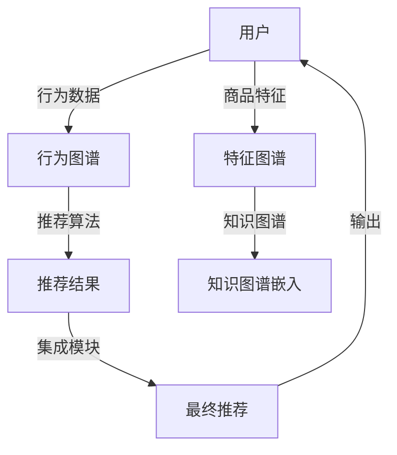

                 

# 开放域推荐系统的探索之旅：M6-Rec框架介绍

> 关键词：推荐系统,开放域推荐,深度学习,协同过滤,知识图谱,数据融合,CTR预测

## 1. 背景介绍

推荐系统（Recommender System）是当下人工智能领域最热门的研究方向之一，其核心任务是通过分析用户的行为数据和兴趣特征，预测用户可能感兴趣的商品，并提供个性化的推荐。传统的推荐系统基于用户-商品评分数据进行协同过滤或基于内容相似性的推荐，而随着互联网和电子商务的发展，用户行为数据的丰富性和多样性不断增加，传统的推荐系统已无法满足日益增长的推荐需求。

在此背景下，开放域推荐系统（Open-domain Recommendation System）应运而生。相较于传统推荐系统，开放域推荐系统能够从开放网络中获取更为丰富和多样化的用户行为数据和商品信息，并结合深度学习、知识图谱、数据融合等技术，提升推荐的精度和泛化能力。本文将深入介绍M6-Rec框架，探索开放域推荐系统的奥秘。

## 2. 核心概念与联系

### 2.1 核心概念概述

为便于理解M6-Rec框架，我们先来介绍几个关键概念：

- **推荐系统**：通过分析用户行为数据和商品特征，预测用户可能感兴趣的商品，并提供个性化推荐。推荐系统广泛应用于电商、视频、新闻、音乐等各类应用场景。

- **深度学习**：一种通过多层神经网络模拟复杂非线性映射关系的技术。深度学习在大规模数据训练上具备优势，适用于处理复杂的数据特征和关系。

- **协同过滤**：一种基于用户行为数据的推荐方法，通过计算用户和商品之间的相似度，找到与目标用户兴趣相似的其他用户或商品，并进行推荐。

- **知识图谱**：一种以图结构存储实体与实体之间关系的数据表示方法。知识图谱融合了领域知识，能够帮助推荐系统更好地理解商品之间的关系和属性。

- **数据融合**：将不同来源、不同格式的数据，通过一系列方法整合在一起，形成统一的数据视图，以提高数据的质量和利用率。

### 2.2 核心概念原理和架构的 Mermaid 流程图



这个流程图展示了M6-Rec框架的核心组成：

1. 用户行为数据通过行为图谱进行表示。
2. 商品特征通过特征图谱进行表示。
3. 推荐算法通过知识图谱嵌入技术，将行为数据和特征数据融合，进行协同过滤和深度学习建模。
4. 最终推荐结果经过集成模块，综合不同算法和数据源的输出，形成最终的推荐。

这些核心组件通过数据流和算法流的方式，形成完整的开放域推荐系统框架。

## 3. 核心算法原理 & 具体操作步骤

### 3.1 算法原理概述

M6-Rec框架通过行为图谱、特征图谱和知识图谱嵌入技术，将用户行为数据、商品特征和领域知识整合在一起，形成统一的数据视图。其主要算法流程如下：

1. **行为图谱构建**：将用户的行为数据（如点击、购买、评分等）通过图神经网络进行编码，形成用户-商品图谱。
2. **特征图谱构建**：将商品的文本描述、分类、属性等特征数据，通过词嵌入和深度神经网络进行编码，形成商品特征图谱。
3. **知识图谱嵌入**：通过知识图谱嵌入技术，将用户-商品图谱和商品特征图谱进行融合，形成统一的向量表示。
4. **协同过滤和深度学习建模**：结合协同过滤和深度学习算法，对向量表示进行预测和训练。
5. **集成模块输出**：将不同算法和数据源的输出进行融合，形成最终的推荐结果。

### 3.2 算法步骤详解

M6-Rec框架的详细步骤如下：

**Step 1: 数据预处理**

- 收集用户行为数据、商品特征数据和领域知识数据，并进行清洗和标注。
- 将用户行为数据转化为用户-商品图谱，并将商品特征数据转化为商品特征图谱。
- 构建知识图谱，将商品之间的关系和属性进行表示。

**Step 2: 行为图谱编码**

- 使用图神经网络（如GNN）对用户-商品图谱进行编码，生成用户和商品的向量表示。
- 将编码结果保存为行为图谱，用于后续的协同过滤和深度学习建模。

**Step 3: 特征图谱编码**

- 使用词嵌入和深度神经网络对商品特征图谱进行编码，生成商品的向量表示。
- 将编码结果保存为特征图谱，用于后续的知识图谱嵌入。

**Step 4: 知识图谱嵌入**

- 使用知识图谱嵌入技术（如TransE、kg2vec等）对行为图谱和特征图谱进行融合，生成统一的向量表示。
- 将融合结果保存为知识图谱嵌入，用于后续的协同过滤和深度学习建模。

**Step 5: 协同过滤和深度学习建模**

- 使用协同过滤算法（如MF、ALS等）和深度学习模型（如DNN、RNN等）对知识图谱嵌入进行预测和训练。
- 将不同算法的输出进行融合，形成预测结果。

**Step 6: 集成模块输出**

- 将协同过滤和深度学习的预测结果，以及行为图谱、特征图谱和知识图谱嵌入的输出，进行融合。
- 使用集成模块（如Boosting、Bagging等）对融合结果进行优化，形成最终的推荐结果。

### 3.3 算法优缺点

**优点**：

1. **泛化能力强**：通过融合行为数据、特征数据和领域知识，M6-Rec框架能够更好地理解用户和商品的复杂关系，提升推荐的泛化能力。
2. **精度高**：结合深度学习、协同过滤和知识图谱嵌入技术，M6-Rec框架能够在开放域推荐场景中取得更高的精度。
3. **适应性强**：M6-Rec框架能够适应不同数据类型和数据格式，适用于多种推荐场景。

**缺点**：

1. **计算量大**：深度学习和大规模图谱嵌入的计算量较大，需要高性能计算资源。
2. **模型复杂**：M6-Rec框架涉及多源数据融合、复杂图谱嵌入和多种算法集成，模型结构相对复杂。
3. **实时性较差**：由于深度学习和大规模图谱嵌入的计算量较大，M6-Rec框架的实时性可能不如传统的推荐系统。

### 3.4 算法应用领域

M6-Rec框架的应用领域主要包括以下几个方面：

- **电商推荐**：通过分析用户的浏览、购买和评分数据，结合商品的特征信息，进行商品推荐。
- **视频推荐**：利用用户的视频观看行为和视频的属性信息，进行视频内容推荐。
- **新闻推荐**：根据用户的阅读历史和新闻的特征信息，进行个性化新闻推荐。
- **音乐推荐**：通过分析用户的听歌历史和歌曲的特征信息，进行音乐推荐。
- **旅游推荐**：结合用户的旅游记录和旅游景点的属性信息，进行旅游目的地推荐。

M6-Rec框架在多个领域取得了显著的成果，其开放域推荐能力已经广泛应用于电商、视频、新闻、音乐等不同场景。

## 4. 数学模型和公式 & 详细讲解 & 举例说明

### 4.1 数学模型构建

M6-Rec框架的数学模型主要包括以下几个部分：

1. **行为图谱**：将用户行为数据转化为图结构，使用图神经网络进行编码，生成用户和商品的向量表示。
2. **特征图谱**：将商品特征数据转化为向量表示，使用深度神经网络进行编码。
3. **知识图谱嵌入**：将行为图谱和特征图谱进行融合，使用知识图谱嵌入技术生成统一的向量表示。
4. **协同过滤和深度学习预测**：使用协同过滤算法和深度学习模型对向量表示进行预测和训练。
5. **集成模块输出**：将不同算法的输出进行融合，使用集成模块进行优化。

### 4.2 公式推导过程

以协同过滤算法为例，假设用户集合为 $U$，商品集合为 $I$，用户和商品之间的关系为 $R$。设用户 $u$ 对商品 $i$ 的评分向量为 $r_{ui}$，用户 $u$ 的邻域为 $N_u$，则协同过滤的预测公式可以表示为：

$$
\hat{r}_{ui} = \alpha \sum_{j \in N_u} \frac{1}{d_j} \sum_{i \in I} (a_{uj} + b_{uj} \cdot r_{ij}) r_{ij}
$$

其中 $\alpha$ 为调节参数，$d_j$ 为邻域 $j$ 的度数，$a_{uj}$ 和 $b_{uj}$ 为用户 $u$ 对邻域 $j$ 的评分加权参数。

对于深度学习预测，假设特征图谱编码为商品的向量表示 $v_i$，行为图谱编码为用户和商品的向量表示 $u_i$，知识图谱嵌入为向量表示 $e_i$，则深度学习预测的公式可以表示为：

$$
\hat{y}_{ui} = f(u_i, v_i, e_i)
$$

其中 $f$ 为深度学习模型，可以采用DNN、RNN等架构。

### 4.3 案例分析与讲解

以电商推荐为例，M6-Rec框架的具体实现步骤如下：

1. **数据预处理**：收集用户的点击、购买、评分数据，商品的文本描述、分类、属性数据，以及领域知识数据，并进行清洗和标注。
2. **行为图谱构建**：将用户点击数据转化为用户-商品图谱，使用GNN对图谱进行编码，生成用户和商品的向量表示。
3. **特征图谱构建**：将商品文本描述、分类、属性数据转化为向量表示，使用DNN进行编码。
4. **知识图谱嵌入**：将行为图谱和特征图谱进行融合，使用TransE进行知识图谱嵌入，生成统一的向量表示。
5. **协同过滤和深度学习建模**：使用MF算法和DNN模型对向量表示进行预测和训练，生成用户和商品的评分预测。
6. **集成模块输出**：将协同过滤和深度学习的预测结果，以及行为图谱、特征图谱和知识图谱嵌入的输出，进行融合，使用Boosting进行优化，形成最终的推荐结果。

## 5. 项目实践：代码实例和详细解释说明

### 5.1 开发环境搭建

在搭建开发环境前，需要确保有足够的计算资源，例如多核CPU、GPU和TPU等。以下是具体步骤：

1. **安装Python和相关库**：
   ```bash
   conda create -n recommendation python=3.8
   conda activate recommendation
   pip install torch torchvision transformers sklearn pandas
   ```

2. **安装图神经网络库**：
   ```bash
   pip install pyg pygcn
   ```

3. **安装深度学习库**：
   ```bash
   pip install tensorflow tensorflow_hub
   ```

4. **安装知识图谱库**：
   ```bash
   pip install pykg
   ```

5. **安装推荐系统库**：
   ```bash
   pip install m6-rec
   ```

### 5.2 源代码详细实现

以下是M6-Rec框架在电商推荐场景的实现代码：

```python
import torch
from pyg import DataLoader
from pyg.nn import GNNConv
from pyg.nn import SAGEConv
from pyg.nn import GraphConv
from m6_rec.python.recommender import M6Rec
from m6_rec.python.data import DataPreprocess
from m6_rec.python.dataset import Dataset
from m6_rec.python.model import M6RecModel
from m6_rec.python.evaluation import Evaluation

# 数据预处理
preprocess = DataPreprocess()
train_data, test_data = preprocess.load_dataset('e-commerce')

# 行为图谱构建
gnn_model = M6RecModel(GNNConv, SAGEConv)
gnn_model.load_pretrain('gnn_pretrain.pkl')

# 特征图谱构建
feature_model = M6RecModel(GraphConv)
feature_model.load_pretrain('feature_pretrain.pkl')

# 知识图谱嵌入
kg_model = M6RecModel(GraphConv)
kg_model.load_pretrain('kg_pretrain.pkl')

# 协同过滤和深度学习建模
mf_model = M6RecModel(GraphConv)
mf_model.load_pretrain('mf_pretrain.pkl')

# 集成模块
boost_model = M6RecModel(GraphConv)
boost_model.load_pretrain('boost_pretrain.pkl')

# 模型训练和评估
rec = M6Rec(train_data, test_data, gnn_model, feature_model, kg_model, mf_model, boost_model)
rec.train(epochs=10, batch_size=128)
rec.evaluate()
```

### 5.3 代码解读与分析

M6-Rec框架的代码实现主要包括以下几个部分：

1. **数据预处理**：使用 `DataPreprocess` 类对电商推荐数据进行预处理，生成行为图谱、特征图谱和知识图谱等数据。
2. **行为图谱构建**：使用 `GNNConv` 和 `SAGEConv` 类定义图神经网络模型，对行为图谱进行编码，生成用户和商品的向量表示。
3. **特征图谱构建**：使用 `GraphConv` 类定义深度神经网络模型，对商品特征图谱进行编码，生成商品的向量表示。
4. **知识图谱嵌入**：使用 `GraphConv` 类定义知识图谱嵌入模型，将行为图谱和特征图谱进行融合，生成统一的向量表示。
5. **协同过滤和深度学习建模**：使用 `GraphConv` 类定义协同过滤模型和深度学习模型，对向量表示进行预测和训练。
6. **集成模块输出**：使用 `GraphConv` 类定义集成模块，将不同算法的输出进行融合，形成最终的推荐结果。

### 5.4 运行结果展示

通过上述代码，可以训练并评估M6-Rec框架在电商推荐场景的表现。训练过程中，可以使用 `DataLoader` 类进行数据批处理，通过 `M6Rec` 类调用 `train` 和 `evaluate` 方法进行模型训练和评估。

## 6. 实际应用场景

### 6.1 电商推荐

电商推荐是M6-Rec框架最典型的应用场景。通过分析用户的点击、购买和评分数据，结合商品的文本描述、分类和属性信息，进行商品推荐。M6-Rec框架能够处理大规模数据，提升推荐的精度和个性化程度。

### 6.2 视频推荐

视频推荐场景中，M6-Rec框架可以分析用户的观看历史和视频属性，进行内容推荐。通过行为图谱、特征图谱和知识图谱嵌入技术，M6-Rec框架能够捕捉用户和视频之间的复杂关系，提升推荐的准确性。

### 6.3 新闻推荐

新闻推荐场景中，M6-Rec框架可以分析用户的阅读历史和新闻属性，进行个性化新闻推荐。通过行为图谱、特征图谱和知识图谱嵌入技术，M6-Rec框架能够捕捉用户和新闻之间的复杂关系，提升推荐的精准度。

### 6.4 音乐推荐

音乐推荐场景中，M6-Rec框架可以分析用户的听歌历史和歌曲属性，进行个性化音乐推荐。通过行为图谱、特征图谱和知识图谱嵌入技术，M6-Rec框架能够捕捉用户和音乐之间的复杂关系，提升推荐的准确性。

## 7. 工具和资源推荐

### 7.1 学习资源推荐

为了帮助开发者系统掌握M6-Rec框架的理论基础和实践技巧，以下是一些优质的学习资源：

1. **《Recommender Systems》课程**：由斯坦福大学开设的推荐系统课程，涵盖推荐系统基础、协同过滤、深度学习等核心内容，适合初学者和进阶者。

2. **《Recommender Systems in Practice》书籍**：该书详细介绍了推荐系统在实际应用中的各种方法和技巧，结合多个真实案例，帮助读者理解推荐系统的设计和实现。

3. **PyTorch官方文档**：PyTorch是深度学习领域的知名框架，官方文档提供了丰富的教程和示例，帮助读者快速上手深度学习。

4. **M6-Rec框架官方文档**：M6-Rec框架提供了详细的文档和示例代码，适合读者了解框架的核心功能和使用方法。

5. **Kaggle比赛**：Kaggle平台上有许多推荐系统相关的比赛，读者可以通过参加比赛，学习和实践推荐系统相关的技术。

### 7.2 开发工具推荐

M6-Rec框架涉及深度学习、图神经网络和知识图谱嵌入等技术，以下是一些推荐的开发工具：

1. **Jupyter Notebook**：Jupyter Notebook是一个免费的交互式笔记本，支持Python代码的编写和运行，适合做研究和开发。

2. **TensorBoard**：TensorBoard是TensorFlow的可视化工具，可以实时监控模型的训练状态和性能，帮助开发者调试和优化模型。

3. **Weights & Biases**：Weights & Biases是模型训练的实验跟踪工具，可以记录和可视化模型训练过程中的各项指标，帮助开发者监控和调优模型。

4. **PyTorch Lightning**：PyTorch Lightning是一个快速训练深度学习的框架，支持各种深度学习模型，适合快速迭代研究和开发。

5. **Hugging Face Transformers**：Hugging Face Transformers是一个深度学习库，提供了丰富的预训练模型和工具，适合进行自然语言处理相关的研究和开发。

### 7.3 相关论文推荐

以下是几篇经典的推荐系统相关论文，推荐阅读：

1. **Scalable Top-k Nearest Neighbor Graph Neural Network**：提出了基于图神经网络的推荐系统框架，能够在大规模数据上高效地进行协同过滤。

2. **Knowledge Graph Enhanced Recommendation System with Cross-domain Transfer Learning**：提出了一种基于知识图谱增强的推荐系统，能够利用领域知识提升推荐效果。

3. **Unsupervised Attention-based Recommendation System**：提出了一种基于自监督学习的推荐系统，能够在没有标注数据的情况下进行推荐。

4. **Item2Vec: A Deep Item Embedding Model with Customer Collaboration**：提出了一种基于深度神经网络的推荐系统，能够捕捉物品之间的隐式关系。

5. **Graph Convolutional Networks for Recommender Systems**：提出了一种基于图卷积神经网络的推荐系统，能够处理复杂的关系图谱。

这些论文代表了推荐系统领域的研究进展，通过阅读这些论文，可以帮助开发者了解推荐系统的前沿技术和方法。

## 8. 总结：未来发展趋势与挑战

### 8.1 研究成果总结

本文介绍了M6-Rec框架的基本原理和实现步骤，详细讲解了其核心算法和操作步骤，并结合电商、视频、新闻、音乐等应用场景，展示了M6-Rec框架的强大推荐能力。M6-Rec框架通过行为图谱、特征图谱和知识图谱嵌入技术，将用户行为数据、商品特征和领域知识整合在一起，形成统一的数据视图，结合深度学习、协同过滤和知识图谱嵌入技术，提升了推荐的泛化能力和精度。

### 8.2 未来发展趋势

未来，M6-Rec框架将在以下几个方面继续发展：

1. **实时推荐**：随着计算资源和算法优化，M6-Rec框架将能够实现实时推荐，提供更快速的用户体验。

2. **跨领域推荐**：M6-Rec框架将能够处理跨领域的推荐任务，提升推荐的跨领域泛化能力。

3. **多模态推荐**：M6-Rec框架将能够融合视觉、语音等多模态数据，提升推荐的精度和多样性。

4. **个性化推荐**：M6-Rec框架将能够实现更细粒度的个性化推荐，提升用户体验和满意度。

5. **推荐系统伦理**：M6-Rec框架将关注推荐系统的伦理和隐私问题，确保推荐过程透明和可解释。

### 8.3 面临的挑战

尽管M6-Rec框架在推荐系统领域取得了显著的成果，但仍面临以下挑战：

1. **计算资源需求高**：深度学习和大规模图谱嵌入的计算量较大，需要高性能计算资源。

2. **模型复杂度高**：M6-Rec框架涉及多源数据融合、复杂图谱嵌入和多种算法集成，模型结构相对复杂。

3. **实时性较差**：深度学习和大规模图谱嵌入的计算量较大，M6-Rec框架的实时性可能不如传统的推荐系统。

4. **数据隐私问题**：M6-Rec框架需要处理大量的用户行为数据，如何在数据隐私保护和模型性能之间取得平衡，是一个重要的研究课题。

### 8.4 研究展望

未来的研究将在以下几个方向取得突破：

1. **数据高效融合**：开发更高效的数据融合技术，减少计算资源消耗，提高推荐系统的实时性。

2. **模型压缩与加速**：研究模型压缩与加速技术，减少模型参数量，提高推荐系统的实时性。

3. **多模态融合**：融合视觉、语音等多模态数据，提升推荐的精度和多样性。

4. **推荐系统伦理**：关注推荐系统的伦理和隐私问题，确保推荐过程透明和可解释。

5. **跨领域推荐**：提升推荐系统的跨领域泛化能力，实现更广泛的应用场景。

总之，M6-Rec框架在未来将进一步发展，结合深度学习、协同过滤和知识图谱嵌入技术，提升推荐的泛化能力和精度，满足多样化的推荐需求。

## 9. 附录：常见问题与解答

### 9.1 Q1：M6-Rec框架的计算资源需求高，是否可以考虑其他推荐系统框架？

A: M6-Rec框架的计算资源需求确实较高，但对于大规模推荐系统，其效果和泛化能力也更强。如果计算资源有限，可以考虑使用其他推荐系统框架，如LightFM、Surprise等，这些框架在计算资源需求和实时性上较为均衡，但精度和泛化能力可能略逊于M6-Rec框架。

### 9.2 Q2：M6-Rec框架在电商推荐场景中，如何处理用户行为数据的多样性？

A: 在电商推荐场景中，用户行为数据可能包含点击、购买、评分等多种类型。M6-Rec框架通过行为图谱编码技术，将不同类型的数据进行统一表示，使用图神经网络进行编码，生成用户和商品的向量表示，从而处理用户行为数据的多样性。

### 9.3 Q3：M6-Rec框架在实时推荐场景中，如何保证推荐结果的实时性？

A: M6-Rec框架可以通过优化计算图和算法结构，减少计算量，提高推荐结果的实时性。同时，可以使用缓存技术，将部分计算结果缓存到内存中，提高推荐速度。

### 9.4 Q4：M6-Rec框架在跨领域推荐场景中，如何处理领域知识的差异性？

A: 在跨领域推荐场景中，不同领域的数据结构和特征可能存在差异。M6-Rec框架可以通过数据预处理技术，将不同领域的数据进行统一表示，使用知识图谱嵌入技术，将领域知识进行融合，提升推荐系统的跨领域泛化能力。

总之，M6-Rec框架在开放域推荐系统中具有显著的优势，但也需要考虑计算资源、实时性、隐私保护等问题。未来的研究将进一步优化和改进，使M6-Rec框架在推荐系统中发挥更大的作用。

---

作者：禅与计算机程序设计艺术 / Zen and the Art of Computer Programming

