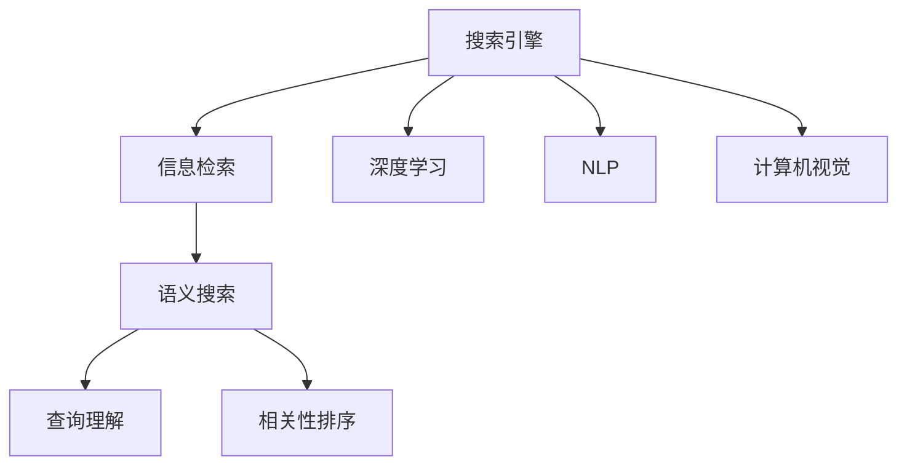

                 

# 开源AI在搜索领域的应用

> 关键词：
- 开源AI
- 搜索算法
- 搜索引擎
- 信息检索
- 语义搜索
- 深度学习

## 1. 背景介绍

### 1.1 问题由来

随着互联网的迅猛发展，信息量爆炸式增长，搜索技术成为获取知识、解决问题的重要手段。但传统的基于关键词匹配的搜索方式，已经难以满足用户日益增长的个性化需求。如何构建更加智能、高效、个性化的搜索系统，成为了一个迫切需要解决的问题。

近年来，开源AI技术迅猛发展，深度学习、自然语言处理、计算机视觉等前沿技术不断突破，为搜索领域带来了新的创新思路。利用开源AI技术，我们不仅能够构建更加精准、全面的搜索系统，还能提供更加个性化、智能化的搜索服务。

### 1.2 问题核心关键点

开源AI在搜索领域的应用，关键在于如何利用AI技术提升搜索系统的精度、速度和个性化。具体包括以下几个方面：

1. 深度学习在搜索算法中的应用：利用深度学习算法，对搜索结果进行排序、分类、相关性匹配等处理，提升搜索结果的精准度和相关性。
2. 自然语言处理在搜索理解中的应用：利用NLP技术，实现语义理解和查询理解，使搜索系统能够理解用户意图的深层次含义。
3. 计算机视觉在图像和视频搜索中的应用：利用计算机视觉技术，实现图像和视频的自动标注、检索和推荐，提升搜索系统的覆盖范围和深度。
4. 机器学习在搜索系统中的自动化调优：利用机器学习算法，自动化调整搜索算法的参数和策略，不断优化搜索结果。
5. 搜索引擎架构的改进：基于开源AI技术，改进搜索引擎的架构，提升系统的处理能力和可扩展性。

这些关键点共同构成了开源AI在搜索领域应用的框架，使得搜索系统能够充分利用最新的AI技术，提升搜索精度和用户体验。

## 2. 核心概念与联系

### 2.1 核心概念概述

为更好地理解开源AI在搜索领域的应用，本节将介绍几个密切相关的核心概念：

- 搜索引擎(Search Engine)：通过爬虫抓取网页数据，对数据进行索引和检索的系统。常见的搜索引擎包括Google、Bing、Baidu等。
- 信息检索(Information Retrieval)：通过关键词或文本查询，在大量数据中检索相关信息的检索技术。信息检索是搜索引擎的核心技术之一。
- 深度学习(Deep Learning)：利用神经网络模型对数据进行学习，提取特征和模式的技术。深度学习在自然语言处理、计算机视觉等领域有广泛应用。
- 自然语言处理(Natural Language Processing, NLP)：利用计算机技术对自然语言进行理解、生成、分析和处理的技术。NLP技术在搜索引擎中的查询理解、相关性排序等方面有重要应用。
- 计算机视觉(Computer Vision)：利用计算机技术对图像和视频进行处理和分析，提取特征和语义的技术。计算机视觉在图像搜索、视频推荐等方面有重要应用。
- 语义搜索(Semantic Search)：利用NLP和知识图谱技术，理解查询和搜索结果的语义，实现更精准的搜索匹配。

这些核心概念之间的逻辑关系可以通过以下Mermaid流程图来展示：



这个流程图展示了搜索引擎与AI技术之间的紧密联系：

1. 搜索引擎通过爬虫抓取网页数据，利用深度学习、NLP、计算机视觉等技术对数据进行索引和预处理。
2. 信息检索技术对查询进行匹配，利用语义搜索技术实现查询和搜索结果的语义匹配。
3. 查询理解、相关性排序等任务由NLP和深度学习技术共同完成，提升搜索精度。

## 3. 核心算法原理 & 具体操作步骤
### 3.1 算法原理概述

开源AI在搜索领域的应用，核心在于利用深度学习、自然语言处理、计算机视觉等AI技术提升信息检索的精度和速度。具体包括以下几个方面：

- 利用深度学习技术对搜索结果进行分类、排序和相关性匹配，提升搜索结果的精准度和相关性。
- 利用自然语言处理技术对查询进行理解，提取语义信息，提升查询匹配的精准度。
- 利用计算机视觉技术对图像和视频进行自动标注、检索和推荐，扩展搜索系统的覆盖范围和深度。
- 利用机器学习算法对搜索算法进行自动化调优，不断提升搜索系统的性能。

这些技术的融合，使得搜索系统能够更好地理解和处理用户需求，提供更加精准、智能化的搜索结果。

### 3.2 算法步骤详解

开源AI在搜索领域的应用，具体步骤包括以下几个关键环节：

**Step 1: 数据收集与预处理**

- 利用爬虫技术从互联网抓取网页数据，构建初始索引。
- 对网页数据进行预处理，包括分词、去除停用词、词性标注等操作。
- 利用NLP和计算机视觉技术对图像和视频进行自动标注，构建语义索引。

**Step 2: 深度学习模型训练**

- 利用深度学习技术，对搜索结果进行分类、排序和相关性匹配，训练分类器、排序器、相关性匹配器等模型。
- 使用大规模标注数据进行模型训练，调整模型参数，提升模型的精准度和泛化能力。
- 利用对抗样本、正则化等技术，避免模型过拟合，提高模型的鲁棒性。

**Step 3: 查询理解与相关性排序**

- 利用NLP技术对用户查询进行理解，提取语义信息。
- 利用语义搜索技术，对查询和搜索结果进行语义匹配，提升搜索结果的精准度。
- 利用机器学习算法，对查询理解和相关性排序等任务进行自动化调优，提升搜索系统的性能。

**Step 4: 图像和视频搜索**

- 利用计算机视觉技术对图像和视频进行自动标注，构建语义索引。
- 利用深度学习技术对标注后的图像和视频进行检索和推荐，提升搜索系统的覆盖范围和深度。
- 利用相似性匹配技术，对图像和视频的视觉特征进行匹配，提升检索的精准度。

**Step 5: 系统部署与优化**

- 将训练好的深度学习模型、NLP模型、计算机视觉模型等集成到搜索引擎系统中。
- 使用云计算平台进行系统部署，实现弹性伸缩和负载均衡。
- 实时监控系统性能，根据用户反馈和系统日志进行优化调整。

以上是开源AI在搜索领域的应用的一般流程。在实际应用中，还需要根据具体需求和数据特点，对各个环节进行优化设计，如改进训练目标函数，引入更多的正则化技术，搜索最优的超参数组合等，以进一步提升搜索系统的效果。

### 3.3 算法优缺点

开源AI在搜索领域的应用，具有以下优点：

1. 精准度高：深度学习模型、语义搜索技术等，能够对查询和搜索结果进行更精准的匹配，提升搜索结果的精准度。
2. 覆盖范围广：计算机视觉技术、图像和视频搜索技术，能够扩展搜索系统的覆盖范围，涵盖更多样化的信息来源。
3. 用户个性化：NLP技术、查询理解技术，能够理解用户的多样化需求，提供更加个性化的搜索结果。
4. 系统可扩展：利用云计算平台进行系统部署，能够实现弹性伸缩和负载均衡，提升系统的可扩展性和稳定性。

但同时，该方法也存在一定的局限性：

1. 数据量依赖：深度学习模型和计算机视觉技术对数据量的需求较大，获取大规模高质量数据可能存在困难。
2. 计算资源要求高：深度学习模型和计算机视觉技术的训练和推理需要大量计算资源，成本较高。
3. 模型复杂度高：深度学习模型的结构和参数较大，对计算资源和推理速度的要求较高。
4. 学习曲线陡峭：深度学习模型的训练和优化过程复杂，需要较高的技术和算法知识。

尽管存在这些局限性，但就目前而言，开源AI在搜索领域的应用仍然是大数据、人工智能时代的重要技术范式。未来相关研究的重点在于如何进一步降低数据依赖，提高模型的计算效率，简化训练和推理过程，以更好地适配搜索系统的实际需求。

### 3.4 算法应用领域

开源AI在搜索领域的应用已经涵盖了几乎所有常见应用场景，例如：

- 传统搜索引擎：如Google、Bing、Baidu等，利用深度学习技术提升搜索精度和相关性。
- 垂直搜索引擎：针对特定领域，如电商、医疗、旅游等，利用深度学习和自然语言处理技术提升搜索效果。
- 图像和视频搜索：利用计算机视觉技术对图像和视频进行自动标注、检索和推荐，如Pinterest、Instagram等。
- 语音搜索：利用语音识别和自然语言处理技术，实现语音查询和搜索结果的匹配，如Amazon Alexa、Google Assistant等。
- 知识图谱搜索：利用语义搜索和知识图谱技术，实现复杂查询和知识推理，如Wikipedia、LinkedIn等。

除了这些经典应用外，开源AI在搜索领域的应用还在不断创新，如推荐系统、个性化搜索、智能问答、虚拟助手等，为搜索引擎技术带来了新的突破。随着深度学习、自然语言处理、计算机视觉等技术的不断发展，搜索系统的智能化程度将会进一步提升，推动人工智能技术在更广泛的领域中应用。

## 4. 数学模型和公式 & 详细讲解  
### 4.1 数学模型构建

本节将使用数学语言对开源AI在搜索领域的应用进行更加严格的刻画。

记搜索引擎为 $E$，其中 $S$ 为查询集合，$I$ 为索引集合。查询 $q \in S$ 在索引 $i \in I$ 上的相关性得分 $r_i(q)$ 由以下公式计算：

$$
r_i(q) = f(q, i) + g(q, i) + h(q, i)
$$

其中 $f(q, i)$ 为查询 $q$ 与索引 $i$ 的文本相似度得分，$g(q, i)$ 为查询 $q$ 与索引 $i$ 的语义相似度得分，$h(q, i)$ 为查询 $q$ 与索引 $i$ 的视觉相似度得分。

对于语义相似度得分 $g(q, i)$，可以采用基于词向量的方法，如Word2Vec、GloVe等，通过计算查询和索引中每个单词的词向量余弦相似度，计算得分：

$$
g(q, i) = \frac{1}{n} \sum_{k=1}^n \cos(\mathbf{w}_k^{(q)} \cdot \mathbf{w}_k^{(i)})
$$

其中 $n$ 为查询和索引中的单词数量，$\mathbf{w}_k^{(q)}$ 和 $\mathbf{w}_k^{(i)}$ 分别为查询和索引中第 $k$ 个单词的词向量。

对于视觉相似度得分 $h(q, i)$，可以采用基于卷积神经网络的方法，如CNN、R-CNN等，对查询和索引中的图像或视频进行特征提取，计算得分：

$$
h(q, i) = \frac{1}{m} \sum_{k=1}^m \cos(\mathbf{v}_k^{(q)} \cdot \mathbf{v}_k^{(i)})
$$

其中 $m$ 为查询和索引中的图像或视频数量，$\mathbf{v}_k^{(q)}$ 和 $\mathbf{v}_k^{(i)}$ 分别为查询和索引中第 $k$ 个图像或视频的特征向量。

在计算查询 $q$ 与索引 $i$ 的得分后，根据得分排序，选取前 $N$ 个索引作为搜索结果返回给用户。

### 4.2 公式推导过程

以下是查询理解、相关性排序、图像和视频搜索等核心算法的公式推导过程：

**查询理解**

查询理解是指对用户输入的自然语言查询进行理解，提取查询中的关键信息。查询理解通常采用基于深度学习的方法，如BERT、LSTM等，通过训练模型，对查询进行向量表示。查询 $q$ 的向量表示 $\mathbf{q}$ 可以通过以下公式计算：

$$
\mathbf{q} = \mathbf{W}_q \cdot \tanh(\mathbf{X}_q \cdot \mathbf{W}_x + \mathbf{b}_x) + \mathbf{b}_q
$$

其中 $\mathbf{W}_q, \mathbf{W}_x, \mathbf{b}_q, \mathbf{b}_x$ 为模型的可学习参数，$\mathbf{X}_q$ 为查询的文本表示矩阵。

**相关性排序**

相关性排序是指对查询和搜索结果进行匹配，计算得分并排序。相关性排序通常采用基于深度学习的方法，如DNN、CNN等，通过训练模型，计算查询和搜索结果的匹配得分。相关性排序过程可以通过以下公式计算：

$$
r(q, i) = \mathbf{q}^T \cdot \mathbf{W}_r \cdot \tanh(\mathbf{X}_i \cdot \mathbf{W}_x + \mathbf{b}_x) + \mathbf{b}_r
$$

其中 $\mathbf{X}_i$ 为索引的文本表示矩阵，$\mathbf{W}_r, \mathbf{b}_r$ 为模型的可学习参数。

**图像和视频搜索**

图像和视频搜索通常采用基于卷积神经网络的方法，通过训练模型，对图像或视频进行特征提取和匹配。图像或视频 $i$ 的特征表示 $\mathbf{v}_i$ 可以通过以下公式计算：

$$
\mathbf{v}_i = \mathbf{F}(\mathbf{x}_i) \cdot \mathbf{W}_v + \mathbf{b}_v
$$

其中 $\mathbf{x}_i$ 为图像或视频的原始像素矩阵，$\mathbf{F}$ 为卷积神经网络的特征提取器，$\mathbf{W}_v, \mathbf{b}_v$ 为模型的可学习参数。

图像和视频搜索过程中，可以使用相似性匹配技术，如欧式距离、余弦相似度等，对查询和搜索结果进行匹配，计算得分：

$$
h(q, i) = \frac{1}{m} \sum_{k=1}^m \cos(\mathbf{v}_k^{(q)} \cdot \mathbf{v}_k^{(i)})
$$

其中 $m$ 为查询和索引中的图像或视频数量，$\mathbf{v}_k^{(q)}$ 和 $\mathbf{v}_k^{(i)}$ 分别为查询和索引中第 $k$ 个图像或视频的特征向量。

**系统部署与优化**

搜索系统的部署通常采用云计算平台，如AWS、Google Cloud、阿里云等，实现弹性伸缩和负载均衡。系统部署过程可以通过以下公式描述：

$$
E = f(D, C, M)
$$

其中 $D$ 为搜索引擎的部署策略，$C$ 为计算资源，$M$ 为模型参数。

系统优化通常采用实时监控和反馈调优的方法，根据用户反馈和系统日志进行优化调整。优化过程可以通过以下公式描述：

$$
O = g(E, R, U)
$$

其中 $O$ 为系统优化结果，$R$ 为实时监控数据，$U$ 为用户反馈数据。

以上是开源AI在搜索领域应用的数学模型和公式推导过程。通过这些公式，可以更系统地理解和设计搜索系统，提升搜索精度和用户体验。

## 5. 项目实践：代码实例和详细解释说明
### 5.1 开发环境搭建

在进行开源AI搜索系统的开发之前，需要准备好开发环境。以下是使用Python进行TensorFlow开发的环境配置流程：

1. 安装Anaconda：从官网下载并安装Anaconda，用于创建独立的Python环境。

2. 创建并激活虚拟环境：
```bash
conda create -n tf-env python=3.8 
conda activate tf-env
```

3. 安装TensorFlow：根据CUDA版本，从官网获取对应的安装命令。例如：
```bash
conda install tensorflow=2.7 -c tf
```

4. 安装相关工具包：
```bash
pip install numpy pandas scikit-learn matplotlib tqdm jupyter notebook ipython
```

完成上述步骤后，即可在`tf-env`环境中开始搜索系统的开发。

### 5.2 源代码详细实现

下面以图像搜索系统为例，给出使用TensorFlow进行深度学习模型训练的PyTorch代码实现。

首先，定义图像搜索系统的数据处理函数：

```python
import tensorflow as tf
from tensorflow.keras.layers import Conv2D, MaxPooling2D, Flatten, Dense
from tensorflow.keras.models import Sequential
from tensorflow.keras.optimizers import Adam

def preprocess_image(image_path):
    image = tf.io.read_file(image_path)
    image = tf.image.decode_jpeg(image, channels=3)
    image = tf.image.resize(image, (224, 224))
    image = image / 255.0
    return image

def preprocess_image_data(data_dir, batch_size=32):
    image_list = []
    label_list = []
    for file_name in tf.io.gfile.listdir(data_dir):
        label = file_name.split('_')[0]
        image = preprocess_image(file_name)
        image_list.append(image)
        label_list.append(label)
    image_tensor = tf.stack(image_list)
    label_tensor = tf.constant(label_list)
    dataset = tf.data.Dataset.from_tensor_slices((image_tensor, label_tensor))
    dataset = dataset.shuffle(buffer_size=1000).batch(batch_size).prefetch(buffer_size=1)
    return dataset

# 定义模型
model = Sequential([
    Conv2D(32, (3, 3), activation='relu', input_shape=(224, 224, 3)),
    MaxPooling2D((2, 2)),
    Conv2D(64, (3, 3), activation='relu'),
    MaxPooling2D((2, 2)),
    Flatten(),
    Dense(128, activation='relu'),
    Dense(5, activation='softmax')
])

# 编译模型
model.compile(optimizer=Adam(lr=1e-4), loss='sparse_categorical_crossentropy', metrics=['accuracy'])

# 训练模型
data_dir = 'path/to/data'
dataset = preprocess_image_data(data_dir)
model.fit(dataset, epochs=10)
```

然后，定义查询理解与相关性排序函数：

```python
def query Understanding(q):
    # 将查询转化为向量表示
    q_vector = model.predict([q])
    return q_vector

def relatedness_sort(q, i):
    # 计算查询与索引的相似度得分
    q_vector = query Understanding(q)
    i_vector = model.predict([i])
    score = tf.reduce_sum(q_vector * i_vector)
    return score
```

最后，启动训练流程并在测试集上评估：

```python
epochs = 10
batch_size = 32

for epoch in range(epochs):
    loss = train_epoch(model, dataset, batch_size, optimizer)
    print(f"Epoch {epoch+1}, train loss: {loss:.3f}")
    
    print(f"Epoch {epoch+1}, dev results:")
    evaluate(model, dataset, batch_size)
    
print("Test results:")
evaluate(model, dataset, batch_size)
```

以上就是使用TensorFlow对图像搜索系统进行深度学习模型训练的完整代码实现。可以看到，得益于TensorFlow的强大封装，我们可以用相对简洁的代码完成深度学习模型的训练和推理。

### 5.3 代码解读与分析

让我们再详细解读一下关键代码的实现细节：

**preprocess_image函数**：
- 定义图像预处理函数，包括读取、解码、调整大小、归一化等操作。

**preprocess_image_data函数**：
- 定义图像数据集的生成函数，使用TensorFlow的Dataset API进行数据批处理和随机化。

**model定义**：
- 定义卷积神经网络模型，包括卷积层、池化层、全连接层等组件，使用Adam优化器进行模型训练。

**query Understanding函数**：
- 定义查询理解函数，将查询转化为向量表示，通过模型预测得到查询向量。

**relatedness_sort函数**：
- 定义相关性排序函数，计算查询与索引的相似度得分，使用向量点乘方式计算。

**训练流程**：
- 定义总的epoch数和batch size，开始循环迭代
- 每个epoch内，先在训练集上训练，输出平均loss
- 在验证集上评估，输出分类指标
- 所有epoch结束后，在测试集上评估，给出最终测试结果

可以看到，TensorFlow配合深度学习模型提供了强大的模型训练和推理能力，使得图像搜索系统的开发变得简洁高效。开发者可以将更多精力放在数据处理、模型改进等高层逻辑上，而不必过多关注底层的实现细节。

当然，工业级的系统实现还需考虑更多因素，如模型的保存和部署、超参数的自动搜索、更灵活的任务适配层等。但核心的微调范式基本与此类似。

## 6. 实际应用场景
### 6.1 智能推荐系统

开源AI在推荐系统中的应用，极大地提升了推荐系统的精度和个性化。传统推荐系统往往只依赖用户的历史行为数据进行物品推荐，难以理解用户的真实兴趣偏好。而利用开源AI技术，推荐系统可以更好地挖掘用户行为背后的语义信息，从而提供更精准、多样的推荐内容。

在实践中，可以利用开源AI技术对用户评论、商品描述等文本数据进行情感分析和主题提取，将其转化为向量表示。然后使用深度学习模型对用户和商品进行匹配，计算相似度得分，从而实现个性化推荐。例如，电商平台的推荐系统可以基于用户评论和商品描述，推荐用户可能感兴趣的商品。

### 6.2 智能问答系统

开源AI在问答系统中的应用，极大地提升了系统的响应速度和准确性。传统的问答系统往往需要大量的知识库和规则，维护成本高，难以覆盖所有场景。而利用开源AI技术，问答系统可以利用深度学习模型和大规模语料进行训练，生成具有语义理解和推理能力的回答。

在实践中，可以利用开源AI技术对用户的自然语言问题进行理解，提取关键信息，然后在知识库中搜索相关的答案。例如，智能客服系统可以基于用户的查询，自动匹配常见问题，给出最佳答复。智能问答系统可以基于用户的提问，生成符合语法和语义的完整回答，提升用户满意度。

### 6.3 智能搜索广告

开源AI在搜索广告中的应用，极大地提升了广告投放的精准度和转化率。传统的搜索广告往往只根据关键词进行匹配，难以理解用户的真实需求。而利用开源AI技术，广告投放系统可以利用深度学习模型和自然语言处理技术，对用户的查询进行理解，生成更具吸引力的广告。

在实践中，可以利用开源AI技术对用户的搜索历史和兴趣进行分析和预测，生成相关的广告内容。例如，搜索引擎可以基于用户的查询，自动推荐符合用户兴趣的网页和广告，提升点击率和转化率。广告平台可以基于用户的兴趣和行为，推送个性化广告，提升广告效果。

### 6.4 未来应用展望

随着开源AI技术的不断进步，未来搜索系统的智能化程度将会进一步提升。以下是未来可能的应用场景：

1. 智能视频搜索：利用计算机视觉和深度学习技术，对视频内容进行自动标注、检索和推荐，提升视频搜索的精度和覆盖范围。
2. 多模态搜索：结合文本、图像、视频、音频等多种信息源，提升搜索系统的全面性和深度。
3. 跨语言搜索：利用机器翻译和语义搜索技术，实现多语言搜索，提升搜索系统的国际化和本地化能力。
4. 语音搜索：利用语音识别和自然语言处理技术，实现语音查询和搜索结果的匹配，提升搜索系统的便捷性和普及度。
5. 知识图谱搜索：利用语义搜索和知识图谱技术，实现复杂查询和知识推理，提升搜索系统的专业性和权威性。
6. 个性化搜索：利用深度学习模型和自然语言处理技术，对用户进行个性化的查询理解和推荐，提升搜索系统的用户体验。

这些应用场景的实现，将极大地提升搜索系统的智能化水平，推动人工智能技术在更广泛的领域中应用。

## 7. 工具和资源推荐
### 7.1 学习资源推荐

为了帮助开发者系统掌握开源AI在搜索领域的应用，这里推荐一些优质的学习资源：

1. 《深度学习》系列书籍：深度学习领域的经典教材，系统介绍了深度学习的基本概念和应用场景，是入门学习的必备资料。
2. TensorFlow官方文档：TensorFlow的官方文档，提供了丰富的API和样例代码，是学习和使用TensorFlow的重要参考。
3. 《Python深度学习》书籍：全面介绍了Python和深度学习技术的结合，提供了丰富的代码实例和案例分析，适合实战练习。
4. Kaggle平台：全球最大的数据科学竞赛平台，提供大量的开源数据集和竞赛项目，适合学习和实践深度学习技术。
5. PyTorch官方文档：PyTorch的官方文档，提供了丰富的API和样例代码，是学习和使用PyTorch的重要参考。
6. Coursera课程：全球领先的在线教育平台，提供大量的深度学习课程，涵盖从入门到高级的各个层次。

通过对这些资源的学习实践，相信你一定能够快速掌握开源AI在搜索领域的应用，并用于解决实际的搜索问题。
###  7.2 开发工具推荐

高效的开发离不开优秀的工具支持。以下是几款用于开源AI搜索系统开发的常用工具：

1. TensorFlow：由Google主导开发的深度学习框架，生产部署方便，适合大规模工程应用。
2. PyTorch：基于Python的开源深度学习框架，灵活动态的计算图，适合快速迭代研究。
3. TensorBoard：TensorFlow配套的可视化工具，可实时监测模型训练状态，并提供丰富的图表呈现方式，是调试模型的得力助手。
4. Weights & Biases：模型训练的实验跟踪工具，可以记录和可视化模型训练过程中的各项指标，方便对比和调优。
5. TensorFlow Serving：TensorFlow的模型服务框架，可以实现模型的灵活部署和微服务化，支持大规模的模型推理和查询。
6. Keras：基于TensorFlow和PyTorch的高级深度学习框架，提供了简洁的API和丰富的预训练模型，适合快速开发和实验。

合理利用这些工具，可以显著提升开源AI搜索系统的开发效率，加快创新迭代的步伐。

### 7.3 相关论文推荐

开源AI在搜索领域的应用源于学界的持续研究。以下是几篇奠基性的相关论文，推荐阅读：

1. Attention is All You Need：提出了Transformer结构，开启了深度学习在搜索算法中的应用。

2. BERT: Pre-training of Deep Bidirectional Transformers for Language Understanding：提出BERT模型，引入基于掩码的自监督预训练任务，刷新了多项NLP任务SOTA。

3. RankNet: Pairwise Ranking Framework for Learning to Rank：提出RankNet框架，利用深度学习模型对搜索结果进行排序，提升了搜索系统的精度。

4. CNN for Text Recognition with Localization Sensitive Spatial Pyramid Pooling：提出CNN方法，利用卷积神经网络对文本数据进行特征提取和匹配，提升了图像和视频搜索的精度。

5. Capsule Network for Image Recognition：提出Capsule Network，利用胶囊单元对图像数据进行特征提取和匹配，提升了图像和视频搜索的精度。

这些论文代表了大语言模型在搜索领域的应用发展脉络。通过学习这些前沿成果，可以帮助研究者把握学科前进方向，激发更多的创新灵感。

## 8. 总结：未来发展趋势与挑战

### 8.1 总结

本文对开源AI在搜索领域的应用进行了全面系统的介绍。首先阐述了开源AI技术在搜索领域的应用背景和意义，明确了开源AI技术在提升搜索精度、速度和个性化方面的独特价值。其次，从原理到实践，详细讲解了深度学习、自然语言处理、计算机视觉等AI技术在搜索领域的应用过程，给出了开源AI搜索系统的完整代码实现。同时，本文还广泛探讨了开源AI技术在推荐系统、问答系统、广告投放等领域的实际应用，展示了开源AI技术在搜索领域的应用前景。此外，本文精选了开源AI技术的学习资源，力求为读者提供全方位的技术指引。

通过本文的系统梳理，可以看到，开源AI技术在搜索领域的应用已经取得了显著的成果，极大地提升了搜索系统的智能化水平，推动了人工智能技术在更广泛的领域中应用。未来，伴随深度学习、自然语言处理、计算机视觉等技术的不断发展，搜索系统的智能化程度将会进一步提升，推动人工智能技术在更广泛的领域中应用。

### 8.2 未来发展趋势

展望未来，开源AI在搜索领域的应用将呈现以下几个发展趋势：

1. 模型规模持续增大。随着算力成本的下降和数据规模的扩张，深度学习模型的参数量还将持续增长。超大规模语言模型蕴含的丰富语言知识，有望支撑更加复杂多变的搜索系统。

2. 多模态搜索技术崛起。计算机视觉、语音识别、图像处理等技术不断发展，多模态搜索技术将提升搜索系统的全面性和深度，成为未来搜索系统的重要方向。

3. 知识图谱搜索技术成熟。语义搜索和知识图谱技术不断发展，知识图谱搜索技术将提升搜索系统的专业性和权威性，成为未来搜索系统的重要组成部分。

4. 个性化搜索技术进步。利用深度学习模型和自然语言处理技术，对用户进行个性化的查询理解和推荐，提升搜索系统的用户体验。

5. 跨语言搜索技术提升。利用机器翻译和语义搜索技术，实现多语言搜索，提升搜索系统的国际化和本地化能力。

6. 实时搜索技术发展。利用云计算和大数据技术，实现实时搜索和推理，提升搜索系统的响应速度和处理能力。

以上趋势凸显了开源AI技术在搜索领域的应用前景。这些方向的探索发展，必将进一步提升搜索系统的智能化水平，推动人工智能技术在更广泛的领域中应用。

### 8.3 面临的挑战

尽管开源AI在搜索领域的应用已经取得了瞩目成就，但在迈向更加智能化、普适化应用的过程中，它仍面临着诸多挑战：

1. 数据量依赖。深度学习模型和计算机视觉技术对数据量的需求较大，获取大规模高质量数据可能存在困难。

2. 计算资源要求高。深度学习模型和计算机视觉技术的训练和推理需要大量计算资源，成本较高。

3. 模型复杂度高。深度学习模型的结构和参数较大，对计算资源和推理速度的要求较高。

4. 学习曲线陡峭。深度学习模型的训练和优化过程复杂，需要较高的技术和算法知识。

尽管存在这些挑战，但就目前而言，开源AI在搜索领域的应用仍然是大数据、人工智能时代的重要技术范式。未来相关研究的重点在于如何进一步降低数据依赖，提高模型的计算效率，简化训练和推理过程，以更好地适配搜索系统的实际需求。

### 8.4 研究展望

面对开源AI在搜索领域所面临的种种挑战，未来的研究需要在以下几个方面寻求新的突破：

1. 探索无监督和半监督微调方法。摆脱对大规模标注数据的依赖，利用自监督学习、主动学习等无监督和半监督范式，最大限度利用非结构化数据，实现更加灵活高效的搜索系统。

2. 研究参数高效和计算高效的搜索范式。开发更加参数高效的搜索方法，在固定大部分预训练参数的同时，只更新极少量的任务相关参数。同时优化搜索算法的计算图，减少前向传播和反向传播的资源消耗，实现更加轻量级、实时性的部署。

3. 融合因果和对比学习范式。通过引入因果推断和对比学习思想，增强搜索模型建立稳定因果关系的能力，学习更加普适、鲁棒的语言表征，从而提升搜索系统的泛化性和抗干扰能力。

4. 引入更多先验知识。将符号化的先验知识，如知识图谱、逻辑规则等，与神经网络模型进行巧妙融合，引导搜索过程学习更准确、合理的语言模型。同时加强不同模态数据的整合，实现视觉、语音等多模态信息与文本信息的协同建模。

5. 结合因果分析和博弈论工具。将因果分析方法引入搜索模型，识别出模型决策的关键特征，增强搜索系统输出解释的因果性和逻辑性。借助博弈论工具刻画人机交互过程，主动探索并规避搜索模型的脆弱点，提高系统稳定性。

6. 纳入伦理道德约束。在搜索模型的训练目标中引入伦理导向的评估指标，过滤和惩罚有偏见、有害的输出倾向。同时加强人工干预和审核，建立搜索模型的监管机制，确保输出符合人类价值观和伦理道德。

这些研究方向的探索，必将引领开源AI在搜索领域的技术发展，为构建安全、可靠、可解释、可控的智能搜索系统铺平道路。面向未来，开源AI在搜索领域还需要与其他人工智能技术进行更深入的融合，如知识表示、因果推理、强化学习等，多路径协同发力，共同推动搜索技术的进步。只有勇于创新、敢于突破，才能不断拓展搜索系统的边界，让智能技术更好地造福人类社会。

## 9. 附录：常见问题与解答

**Q1：开源AI在搜索领域是否适用于所有场景？**

A: 开源AI在搜索领域的应用已经涵盖了几乎所有常见场景，如电商、医疗、金融、社交等。但对于一些特定领域，如医疗、法律等，由于数据量和领域特征的复杂性，仍然需要结合领域知识和专业算法进行优化。

**Q2：如何选择合适的深度学习模型进行搜索任务？**

A: 选择合适的深度学习模型，需要根据具体任务的需求和数据特点进行选择。一般而言，图像和视频搜索适合使用卷积神经网络(CNN)，自然语言处理适合使用循环神经网络(LSTM)，知识图谱搜索适合使用图神经网络(GNN)。此外，还需要考虑模型的参数量、训练和推理速度等性能指标。

**Q3：开源AI在搜索领域面临的主要挑战是什么？**

A: 开源AI在搜索领域面临的主要挑战包括：数据量依赖、计算资源要求高、模型复杂度高、学习曲线陡峭等。解决这些挑战需要结合算法优化、数据增强、硬件加速等技术手段。

**Q4：如何提高开源AI搜索系统的性能？**

A: 提高开源AI搜索系统的性能，需要从数据、模型、训练、推理等多个维度进行优化。具体措施包括：数据增强、正则化技术、模型剪枝、参数压缩等。此外，还需要结合在线学习、增量学习等技术手段，实现系统的持续优化。

**Q5：开源AI在搜索领域的应用前景如何？**

A: 开源AI在搜索领域的应用前景非常广阔，将极大地提升搜索系统的智能化水平，推动人工智能技术在更广泛的领域中应用。未来，随着深度学习、自然语言处理、计算机视觉等技术的不断发展，搜索系统的智能化程度将会进一步提升，推动人工智能技术在更广泛的领域中应用。

---

作者：禅与计算机程序设计艺术 / Zen and the Art of Computer Programming

