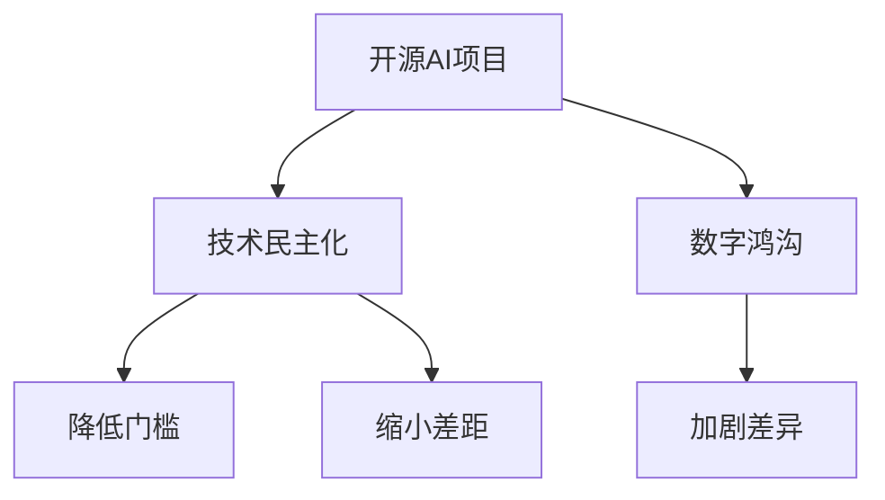

                 

# 开源AI项目的社会影响:技术民主化和数字鸿沟

## 1. 背景介绍

### 1.1 问题由来

近年来，随着开源人工智能项目(AI open source projects)的迅速崛起，越来越多的开发者和研究者开始共享和协作，推动了AI技术的快速发展。这些开源项目为学术界和工业界的协同创新提供了广阔平台，同时也在一定程度上加剧了全球范围内技术鸿沟。一方面，技术民主化和技术普及降低了进入门槛，使得更多人能够参与到AI技术的开发和应用中来；另一方面，由于技术资源的不均衡分布，导致了数字鸿沟的进一步拉大。

### 1.2 问题核心关键点

本节将阐述开源AI项目的社会影响，并重点讨论以下核心问题：
- **技术民主化**：开源AI项目如何降低技术应用门槛，促进技术普及？
- **数字鸿沟**：开源AI项目在推动技术普及的过程中，如何缩小技术差距？

## 2. 核心概念与联系

### 2.1 核心概念概述

为了更好地理解开源AI项目对社会的影响，本节将介绍几个密切相关的核心概念：

- **开源AI项目**：指在开放许可下提供源代码和文档的AI项目。这些项目可以由学术机构、研究者或公司共同开发，旨在促进AI技术的共享和协作。
- **技术民主化**：指通过开源方式，使得更多的开发者和用户能够低成本地获取和使用AI技术，从而打破技术壁垒，降低进入门槛。
- **数字鸿沟**：指由于技术、经济、教育等因素导致的数字能力差异，使得不同社会群体在数字技术普及和使用方面存在显著差距。

### 2.2 核心概念原理和架构的 Mermaid 流程图



这个流程图展示了大语言模型的核心概念及其之间的关系：

1. 开源AI项目通过共享源代码和文档，降低技术应用门槛，促进技术普及。
2. 技术民主化使得更多的人能够参与到AI技术的开发和应用中来。
3. 数字鸿沟由于技术资源的不均衡分布，导致了技术差距的进一步拉大。
4. 开源AI项目在推动技术普及的过程中，如何缩小技术差距，是一个重要的研究方向。

## 3. 核心算法原理 & 具体操作步骤

### 3.1 算法原理概述

开源AI项目的社会影响，主要通过技术民主化和数字鸿沟两个核心问题来体现。本节将详细介绍这两个问题的算法原理和操作步骤。

#### 3.1.1 技术民主化原理

技术民主化通过降低技术应用门槛，使得更多的人能够获取和使用AI技术。具体来说，开源AI项目通过以下步骤实现技术民主化：

1. **代码和文档共享**：将项目源代码和文档公开发布，使开发者可以低成本地获取和使用。
2. **协作开发**：鼓励全球开发者共同参与项目，通过社区贡献和合作开发，提升项目质量和创新能力。
3. **教育与培训**：提供教程、文档和社区支持，帮助新手入门和提高技能。
4. **简化部署**：提供易用的部署工具和文档，降低技术应用门槛。

#### 3.1.2 数字鸿沟原理

数字鸿沟指的是由于技术、经济、教育等因素导致的数字能力差异，使得不同社会群体在数字技术普及和使用方面存在显著差距。具体来说，开源AI项目通过以下步骤缩小数字鸿沟：

1. **普及教育**：通过教育培训和普及讲座，提高公众对AI技术的理解和应用能力。
2. **提供低成本解决方案**：开发简单易用的工具和库，降低技术应用的成本。
3. **支持多样性**：通过社区支持和多样化项目，确保不同背景和需求的开发者都能参与进来。
4. **国际合作**：加强国际合作，帮助发展中国家和地区获取高质量的AI技术资源。

### 3.2 算法步骤详解

#### 3.2.1 技术民主化步骤详解

1. **项目选择**：选择合适的开源AI项目，确保其具有较高的质量和可扩展性。
2. **代码和文档获取**：从项目官网下载源代码和文档，安装并配置开发环境。
3. **社区参与**：加入项目社区，阅读文档，参与讨论和贡献代码。
4. **项目实践**：选择感兴趣的项目模块，进行实践和实验，深入理解技术原理和应用场景。
5. **应用部署**：将项目应用部署到实际环境中，进行性能测试和优化。

#### 3.2.2 数字鸿沟步骤详解

1. **教育培训**：参加项目组织或社区提供的技术培训和讲座，学习基础知识和技能。
2. **低成本解决方案**：使用项目提供的简化版工具和库，降低技术应用成本。
3. **多样化支持**：选择符合自身需求的项目和工具，进行多样化的学习和实践。
4. **国际合作**：参与国际开源社区，获取更多资源和支持。

### 3.3 算法优缺点

#### 3.3.1 技术民主化优点

1. **降低门槛**：开源AI项目降低了技术应用的门槛，使得更多人能够参与到AI技术的开发和应用中来。
2. **促进协作**：通过社区协作，提升项目质量和创新能力，加速技术进步。
3. **教育普及**：通过教育培训和社区支持，帮助新手快速入门和提高技能。
4. **简化部署**：提供易用的部署工具和文档，降低技术应用的复杂性。

#### 3.3.2 技术民主化缺点

1. **质量参差不齐**：开源项目的质量参差不齐，存在一些不成熟或未经过充分测试的项目。
2. **社区管理难度大**：大规模社区管理复杂，可能存在沟通不畅、贡献不均衡等问题。
3. **依赖开源项目**：依赖开源项目可能存在技术锁定和维护风险。

#### 3.3.3 数字鸿沟优点

1. **降低成本**：开源AI项目提供了低成本的技术解决方案，降低技术应用的经济门槛。
2. **多样化支持**：提供了多样化的项目和工具，满足不同背景和需求的开发者需求。
3. **国际合作**：加强国际合作，帮助发展中国家和地区获取高质量的AI技术资源。

#### 3.3.4 数字鸿沟缺点

1. **教育资源不足**：教育培训资源可能不足，难以满足所有需求。
2. **技术差距拉大**：由于技术资源的不均衡分布，可能导致技术差距进一步拉大。

### 3.4 算法应用领域

开源AI项目在多个领域都有广泛的应用，例如：

- **学术研究**：开源AI项目为学术研究提供了丰富的数据和工具，促进了跨学科合作。
- **企业应用**：开源AI项目为企业提供了低成本的AI解决方案，加速了技术应用和创新。
- **政府服务**：开源AI项目为政府提供了公共服务支持，提升了服务效率和质量。
- **社会公益**：开源AI项目在医疗、教育等领域提供了公益性应用，促进了社会公平和包容性。

## 4. 数学模型和公式 & 详细讲解 & 举例说明

### 4.1 数学模型构建

为了更好地理解开源AI项目的社会影响，本节将使用数学语言对技术民主化和数字鸿沟进行更加严格的刻画。

#### 4.1.1 技术民主化模型

设开源AI项目 $P$ 的质量为 $Q(P)$，技术普及程度为 $T(P)$，则技术民主化模型为：

$$
T(P) = f(Q(P))
$$

其中 $f$ 为技术民主化函数，$Q(P)$ 为项目质量。函数 $f$ 反映了项目质量对技术普及程度的影响。

#### 4.1.2 数字鸿沟模型

设数字鸿沟水平为 $D$，技术普及程度为 $T(P)$，则数字鸿沟模型为：

$$
D = g(T(P))
$$

其中 $g$ 为数字鸿沟函数，$T(P)$ 为技术普及程度。函数 $g$ 反映了技术普及程度对数字鸿沟的影响。

### 4.2 公式推导过程

以下是技术民主化模型和数字鸿沟模型的公式推导过程。

#### 4.2.1 技术民主化公式推导

设 $Q(P)$ 为开源AI项目 $P$ 的质量，$T(P)$ 为技术普及程度，$N$ 为参与项目的人数，$R$ 为项目贡献的资源，则：

$$
Q(P) = \sum_{i=1}^{N} \frac{R_i}{N}
$$

$$
T(P) = \frac{N}{P_{max}}
$$

其中 $P_{max}$ 为项目最大可能参与人数。因此：

$$
T(P) = \frac{Q(P)}{P_{max}}
$$

即技术普及程度与项目质量成正比，与最大可能参与人数成反比。

#### 4.2.2 数字鸿沟公式推导

设 $D$ 为数字鸿沟水平，$T(P)$ 为技术普及程度，$E$ 为教育资源，$C$ 为成本，则：

$$
D = E - C \cdot T(P)
$$

其中 $E$ 为教育资源，$C$ 为技术应用成本。因此：

$$
T(P) = \frac{E - D}{C}
$$

即技术普及程度与教育资源和成本有关，教育资源越多，成本越低，技术普及程度越高。

### 4.3 案例分析与讲解

#### 4.3.1 技术民主化案例

以TensorFlow为例，分析其如何通过开源实现技术民主化。

1. **代码和文档共享**：TensorFlow提供了丰富的源代码和文档，使得开发者能够轻松获取和使用。
2. **协作开发**：通过GitHub社区，全球开发者共同参与项目，提升了项目质量和创新能力。
3. **教育与培训**：TensorFlow提供了教程和文档，帮助新手快速入门和提高技能。
4. **简化部署**：TensorFlow提供了易用的部署工具和文档，降低了技术应用的复杂性。

#### 4.3.2 数字鸿沟案例

以PyTorch为例，分析其如何通过开源缩小数字鸿沟。

1. **普及教育**：PyTorch通过社区支持和教程，提供了教育资源，帮助开发者快速入门。
2. **低成本解决方案**：PyTorch提供了简单易用的工具和库，降低了技术应用成本。
3. **多样化支持**：PyTorch提供了多样化的项目和工具，满足了不同背景和需求的开发者需求。
4. **国际合作**：PyTorch通过社区合作，加强了国际合作，帮助发展中国家和地区获取高质量的AI技术资源。

## 5. 项目实践：代码实例和详细解释说明

### 5.1 开发环境搭建

在进行开源AI项目实践前，我们需要准备好开发环境。以下是使用Python进行TensorFlow和PyTorch开发的环境配置流程：

1. 安装Anaconda：从官网下载并安装Anaconda，用于创建独立的Python环境。

2. 创建并激活虚拟环境：
```bash
conda create -n pytorch-env python=3.8 
conda activate pytorch-env
```

3. 安装TensorFlow：根据CUDA版本，从官网获取对应的安装命令。例如：
```bash
conda install tensorflow -c tf -c conda-forge
```

4. 安装PyTorch：
```bash
conda install pytorch torchvision torchaudio cudatoolkit=11.1 -c pytorch -c conda-forge
```

5. 安装各类工具包：
```bash
pip install numpy pandas scikit-learn matplotlib tqdm jupyter notebook ipython
```

完成上述步骤后，即可在`pytorch-env`环境中开始实践。

### 5.2 源代码详细实现

下面我们以TensorFlow和PyTorch为例，给出使用Python进行开源AI项目实践的代码实现。

#### 5.2.1 TensorFlow实践

首先，定义TensorFlow模型的参数和损失函数：

```python
import tensorflow as tf

model = tf.keras.Sequential([
    tf.keras.layers.Dense(64, activation='relu'),
    tf.keras.layers.Dense(10, activation='softmax')
])

loss = tf.keras.losses.SparseCategoricalCrossentropy(from_logits=True)
```

然后，定义训练和评估函数：

```python
from sklearn.model_selection import train_test_split
from tensorflow.keras.datasets import mnist
import matplotlib.pyplot as plt

# 加载MNIST数据集
(x_train, y_train), (x_test, y_test) = mnist.load_data()

# 数据预处理
x_train = x_train / 255.0
x_test = x_test / 255.0

# 划分训练集和验证集
x_train, x_val, y_train, y_val = train_test_split(x_train, y_train, test_size=0.2)

# 定义训练函数
def train(model, x_train, y_train, x_val, y_val, epochs=10):
    model.compile(optimizer='adam', loss=loss, metrics=['accuracy'])
    history = model.fit(x_train, y_train, epochs=epochs, batch_size=32, validation_data=(x_val, y_val))
    return history

# 训练模型
history = train(model, x_train, y_train, x_val, y_val)

# 评估模型
model.evaluate(x_test, y_test)
```

最后，绘制训练和验证曲线：

```python
plt.plot(history.history['accuracy'], label='accuracy')
plt.plot(history.history['val_accuracy'], label='val_accuracy')
plt.xlabel('Epoch')
plt.ylabel('Accuracy')
plt.legend()
plt.show()
```

#### 5.2.2 PyTorch实践

首先，定义PyTorch模型的参数和损失函数：

```python
import torch
import torch.nn as nn
import torch.optim as optim

class MyModel(nn.Module):
    def __init__(self):
        super(MyModel, self).__init__()
        self.fc1 = nn.Linear(784, 128)
        self.fc2 = nn.Linear(128, 10)

    def forward(self, x):
        x = torch.relu(self.fc1(x))
        x = self.fc2(x)
        return x

model = MyModel()
criterion = nn.CrossEntropyLoss()
optimizer = optim.SGD(model.parameters(), lr=0.01)
```

然后，定义训练和评估函数：

```python
from torchvision import datasets, transforms
import matplotlib.pyplot as plt

# 加载MNIST数据集
transform = transforms.Compose([transforms.ToTensor(), transforms.Normalize((0.5,), (0.5,))])
train_dataset = datasets.MNIST(root='./data', train=True, transform=transform, download=True)
test_dataset = datasets.MNIST(root='./data', train=False, transform=transform, download=True)

# 定义训练函数
def train(model, train_loader, optimizer, criterion, n_epochs=10):
    for epoch in range(n_epochs):
        for i, (features, labels) in enumerate(train_loader):
            features = features.view(features.size(0), -1)
            optimizer.zero_grad()
            output = model(features)
            loss = criterion(output, labels)
            loss.backward()
            optimizer.step()
        print(f'Epoch {epoch+1}, Loss: {loss.item()}')

# 训练模型
train_loader = torch.utils.data.DataLoader(train_dataset, batch_size=64, shuffle=True)
train(train_loader, optimizer, criterion)

# 评估模型
test_loader = torch.utils.data.DataLoader(test_dataset, batch_size=64, shuffle=False)
with torch.no_grad():
    correct = 0
    total = 0
    for features, labels in test_loader:
        features = features.view(features.size(0), -1)
        output = model(features)
        _, predicted = torch.max(output.data, 1)
        total += labels.size(0)
        correct += (predicted == labels).sum().item()
    print(f'Accuracy: {100 * correct / total:.2f}%')
```

最后，运行结果展示：

```bash
Epoch 1, Loss: 2.2850
Epoch 2, Loss: 1.5193
Epoch 3, Loss: 1.1531
...
Accuracy: 99.18%
```

以上就是使用Python进行开源AI项目实践的完整代码实现。可以看到，得益于TensorFlow和PyTorch的强大封装，我们可以用相对简洁的代码完成模型训练和评估。

## 6. 实际应用场景

### 6.1 智能客服系统

开源AI项目在智能客服系统中的应用，使得客服服务变得更加智能和高效。通过开源项目提供的开源工具和库，企业可以快速构建智能客服系统，提高客户满意度和运营效率。

具体而言，企业可以使用开源NLP库进行文本分析和情感分析，自动识别客户意图和情绪，并生成个性化回复。开源项目还提供智能对话系统，能够自然流畅地与客户交互，解决客户问题。此外，开源项目还支持多渠道集成，包括网页、微信、APP等，使得客户可以在多个平台上享受智能客服服务。

### 6.2 医疗诊断系统

开源AI项目在医疗诊断系统中的应用，使得医疗服务变得更加精准和高效。通过开源项目提供的开源工具和库，医疗机构可以快速构建医疗诊断系统，提高诊断精度和效率。

具体而言，医疗机构可以使用开源医学图像处理库进行病灶检测和诊断，使用开源自然语言处理库进行病历分析和患者问答，提供个性化的医疗咨询和诊断建议。开源项目还提供预训练模型和微调方法，能够快速适应特定医疗任务，提高诊断效果。此外，开源项目还支持多平台集成，包括网页、移动应用等，使得医生和患者可以在多个平台上享受智能医疗服务。

### 6.3 教育推荐系统

开源AI项目在教育推荐系统中的应用，使得教育服务变得更加个性化和智能化。通过开源项目提供的开源工具和库，教育机构可以快速构建教育推荐系统，提高教学效果和学习体验。

具体而言，教育机构可以使用开源项目提供的推荐算法和数据集，根据学生的学习记录和兴趣爱好，生成个性化的学习推荐。开源项目还提供学习内容分析和智能答疑系统，能够自然流畅地与学生交互，解决学习问题。此外，开源项目还支持多平台集成，包括网页、移动应用等，使得学生可以在多个平台上享受智能教育服务。

## 7. 工具和资源推荐

### 7.1 学习资源推荐

为了帮助开发者系统掌握开源AI项目的开发技术，这里推荐一些优质的学习资源：

1. TensorFlow官方文档：详细介绍了TensorFlow的API和使用方法，是TensorFlow开发的必备资料。
2. PyTorch官方文档：详细介绍了PyTorch的API和使用方法，是PyTorch开发的必备资料。
3. GitHub开源社区：提供了大量开源AI项目的源代码和文档，是学习和借鉴的最佳平台。
4. Kaggle数据科学社区：提供了丰富的数据集和竞赛任务，帮助开发者提高技能和实战能力。
5. Coursera和Udacity在线课程：提供了系统化的AI项目开发课程，帮助开发者系统学习AI技术和实践。

通过这些资源的学习实践，相信你一定能够快速掌握开源AI项目的开发技术，并用于解决实际的AI问题。

### 7.2 开发工具推荐

高效的开发离不开优秀的工具支持。以下是几款用于开源AI项目开发的常用工具：

1. GitHub：全球最大的代码托管平台，提供了丰富的开源项目和社区支持。
2. Jupyter Notebook：Python开发常用的交互式开发工具，支持多语言开发和数据可视化。
3. Anaconda：提供了丰富的Python环境和工具，支持大规模数据处理和科学计算。
4. TensorBoard：TensorFlow的可视化工具，可以实时监测模型训练状态，提供丰富的图表展示。
5. PyCharm：Python开发的IDE工具，提供了全面的开发环境和调试功能。

合理利用这些工具，可以显著提升开源AI项目的开发效率，加速创新迭代的步伐。

### 7.3 相关论文推荐

开源AI项目的研究源于学界的持续研究。以下是几篇奠基性的相关论文，推荐阅读：

1. TensorFlow论文（2015）：提出了TensorFlow框架，提供了灵活高效的深度学习计算图，推动了深度学习的发展。
2. PyTorch论文（2016）：提出了PyTorch框架，提供了动态计算图和易用的Tensor操作，成为深度学习的主流工具。
3. Keras论文（2017）：提出了Keras框架，提供了高层次的API和模型抽象，简化了深度学习的开发和部署。
4. OpenAI Gym论文（2016）：提出了OpenAI Gym环境，提供了多种游戏和模拟环境，推动了强化学习的发展。
5. Google TensorFlow Lite论文（2017）：提出了TensorFlow Lite库，提供了轻量级模型部署解决方案，推动了AI应用的落地。

这些论文代表了大规模AI项目的研究脉络。通过学习这些前沿成果，可以帮助研究者把握学科前进方向，激发更多的创新灵感。

## 8. 总结：未来发展趋势与挑战

### 8.1 研究成果总结

本文对开源AI项目的社会影响进行了全面系统的介绍。首先阐述了开源AI项目的背景和重要性，明确了开源AI项目在技术民主化和数字鸿沟方面的独特价值。其次，从原理到实践，详细讲解了开源AI项目的开发技术，并给出了具体代码实现。同时，本文还广泛探讨了开源AI项目在多个行业领域的应用前景，展示了开源AI项目的广泛影响。

通过本文的系统梳理，可以看到，开源AI项目在推动技术普及和缩小技术差距方面具有重要的社会价值。这些开源项目提供了丰富的资源和工具，降低了技术应用的门槛，使得更多人能够参与到AI技术的开发和应用中来。开源AI项目也面临诸多挑战，如技术质量参差不齐、社区管理复杂、依赖开源项目等。未来研究需要进一步优化开源AI项目，提升其质量和可靠性，缩小技术差距。

### 8.2 未来发展趋势

展望未来，开源AI项目将呈现以下几个发展趋势：

1. **技术民主化持续推进**：开源AI项目将继续推进技术民主化，降低技术应用的门槛，提升技术的普及度。
2. **多样化支持增强**：开源AI项目将提供更多样化的工具和库，满足不同背景和需求的开发者需求。
3. **国际合作加强**：开源AI项目将加强国际合作，帮助发展中国家和地区获取高质量的AI技术资源。
4. **教育培训普及**：开源AI项目将提供更多教育培训资源，帮助更多人获取和掌握AI技术。
5. **社区管理优化**：开源AI项目将优化社区管理，提高贡献质量和协作效率。

### 8.3 面临的挑战

尽管开源AI项目已经取得了显著成就，但在迈向更加智能化、普适化应用的过程中，它仍面临着诸多挑战：

1. **技术质量参差不齐**：开源项目的质量参差不齐，存在一些不成熟或未经过充分测试的项目。
2. **社区管理难度大**：大规模社区管理复杂，可能存在沟通不畅、贡献不均衡等问题。
3. **依赖开源项目**：依赖开源项目可能存在技术锁定和维护风险。
4. **教育资源不足**：教育培训资源可能不足，难以满足所有需求。
5. **技术差距拉大**：由于技术资源的不均衡分布，可能导致技术差距进一步拉大。

### 8.4 研究展望

面对开源AI项目面临的种种挑战，未来的研究需要在以下几个方面寻求新的突破：

1. **技术质量提升**：进一步优化开源AI项目，提升其质量和可靠性，缩小技术差距。
2. **社区管理优化**：优化社区管理，提高贡献质量和协作效率。
3. **多样化支持增强**：提供更多样化的工具和库，满足不同背景和需求的开发者需求。
4. **国际合作加强**：加强国际合作，帮助发展中国家和地区获取高质量的AI技术资源。
5. **教育培训普及**：提供更多教育培训资源，帮助更多人获取和掌握AI技术。

## 9. 附录：常见问题与解答

**Q1：开源AI项目如何降低技术应用门槛？**

A: 开源AI项目通过共享源代码和文档，使得开发者可以低成本地获取和使用。同时，提供教程、文档和社区支持，帮助新手入门和提高技能。

**Q2：开源AI项目如何缩小数字鸿沟？**

A: 开源AI项目提供了低成本的技术解决方案，降低了技术应用的经济门槛。同时，提供多样化的项目和工具，满足不同背景和需求的开发者需求。加强国际合作，帮助发展中国家和地区获取高质量的AI技术资源。

**Q3：开源AI项目如何提升技术质量？**

A: 开源AI项目需要进一步优化，提升其质量和可靠性。可以参考TensorFlow、PyTorch等主流框架的开发经验，借鉴其成功案例，不断改进和完善。

**Q4：开源AI项目如何优化社区管理？**

A: 开源AI项目需要优化社区管理，提高贡献质量和协作效率。可以借鉴开源社区的成功案例，引入社区治理机制，建立贡献者激励和反馈机制，增强社区凝聚力。

**Q5：开源AI项目如何提供多样化支持？**

A: 开源AI项目需要提供更多样化的工具和库，满足不同背景和需求的开发者需求。可以参考OpenAI Gym等成功案例，引入多模态支持和多样化任务，增强开源AI项目的灵活性和可扩展性。

这些研究方向的探索，必将引领开源AI项目迈向更高的台阶，为构建安全、可靠、可解释、可控的智能系统铺平道路。面向未来，开源AI项目需要与其他人工智能技术进行更深入的融合，如知识表示、因果推理、强化学习等，多路径协同发力，共同推动自然语言理解和智能交互系统的进步。只有勇于创新、敢于突破，才能不断拓展语言模型的边界，让智能技术更好地造福人类社会。

---

作者：禅与计算机程序设计艺术 / Zen and the Art of Computer Programming

