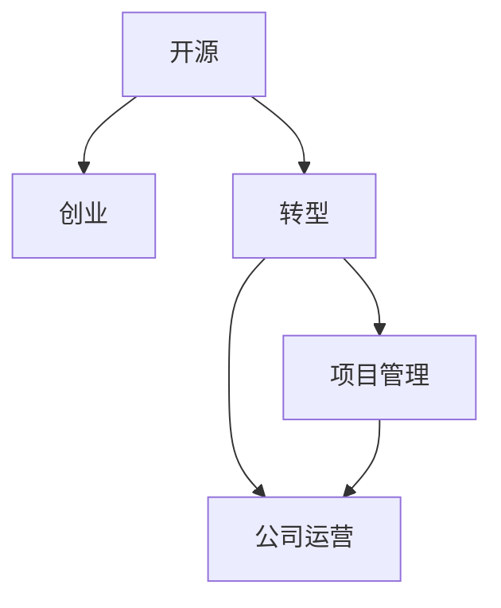

                 

# 开源创业：从项目到公司的转型之路

> 关键词：开源,创业,转型,项目管理,公司运营

## 1. 背景介绍

在数字化时代，开源项目已经成为了创业公司的“加速器”。从早期的Linux到现今的TensorFlow、GitHub，开源项目借助社区的力量，迅速完成了从项目到公司的转型，实现了从技术积累到商业变现的跨越。然而，开源创业并不仅仅是技术积累与输出的简单过程，更是一个多维度融合的系统工程。本文将深入探讨开源创业的核心理念、实施策略和成功案例，为企业转型提供全面而深入的指导。

## 2. 核心概念与联系

### 2.1 核心概念概述

为了更好地理解开源创业，本节将介绍几个核心概念：

- **开源(Open Source)**：指公开源代码，允许用户自由地查看、修改、分发和使用。开源社区通过合作和贡献，共同推动技术的进步。
- **创业(Entrepreneurship)**：指创业者利用创新思维、风险管理，将技术和商业模式转化为商业价值的过程。
- **转型(Transition)**：指从现有状态转变为新状态的过程。在开源创业中，转型通常意味着从个人项目转变为公司运营。
- **项目管理(Project Management)**：指有组织、有计划地管理项目开发和运营的实践，确保项目按时、按质、按预算完成。
- **公司运营(Company Operations)**：指企业日常运营、市场营销、财务控制等管理活动，是公司成功转型的重要保障。

这些概念之间的逻辑关系可以通过以下Mermaid流程图来展示：



这个流程图展示了大语言模型的核心概念及其之间的关系：

1. 开源项目为创业提供了技术基础。
2. 创业是一个从项目到公司的转型过程，涉及技术、管理等多方面。
3. 项目管理与公司运营是创业成功的重要保障。
4. 项目管理与公司运营相辅相成，共同促进项目的成功转型。

## 3. 核心算法原理 & 具体操作步骤
### 3.1 算法原理概述

开源创业的核心理念是通过开源项目的技术积累，在社区和市场中找到商业化路径，最终实现从项目到公司的转型。其关键在于：

- **技术积累与输出**：通过开源项目积累技术资源，在社区中获得反馈和改进，形成成熟的技术体系。
- **商业变现与商业模式创新**：将开源技术转化为产品或服务，开拓新的商业模式，实现商业价值。
- **管理与运营优化**：通过系统化的项目管理与公司运营，保障项目顺利转型和公司高效运作。

### 3.2 算法步骤详解

开源创业一般包括以下几个关键步骤：

**Step 1: 选择目标市场和商业模式**
- 分析市场趋势和竞争格局，确定目标市场。
- 探索合适的商业模式，如软件即服务(SaaS)、开源许可证、咨询服务等。

**Step 2: 建立开源项目和社区**
- 开发和发布具有创新性的开源项目，吸引开发者参与贡献。
- 建立社区平台，提供交流、协作和贡献的平台。

**Step 3: 整合资源与团队建设**
- 整合开源社区的技术资源，组建核心团队。
- 引入财务、市场营销、运营管理等专业人才。

**Step 4: 技术商业化与产品开发**
- 将开源项目技术转化为可用的产品或服务，设计合理的用户界面和用户体验。
- 开发关键功能模块，进行用户测试和反馈收集。

**Step 5: 推广与市场开拓**
- 利用社交媒体、技术博客、会议等渠道推广产品。
- 开展市场调研，开拓新市场，扩大用户群。

**Step 6: 持续迭代与优化**
- 定期收集用户反馈，优化产品功能和用户体验。
- 根据市场变化，调整商业模式和运营策略。

### 3.3 算法优缺点

开源创业具有以下优点：
1. 快速迭代与低成本。开源项目能够快速收集和整合社区反馈，快速迭代开发。
2. 技术开放与社区驱动。开源技术共享和合作，有助于技术创新和成熟。
3. 快速市场扩展。开源产品通常具备高度灵活性，易于部署和扩展。
4. 品牌效应。开源项目往往具有较高的品牌价值和市场信任度。

同时，该方法也存在一定的局限性：
1. 开源风险。开源项目依赖社区贡献，技术资源可能不稳定。
2. 商业化困难。部分开源技术可能难以商业变现，或存在版权风险。
3. 管理复杂。开源项目通常涉及多个团队和利益相关方，管理复杂。
4. 竞争激烈。开源社区竞争激烈，需要持续创新以保持竞争力。

尽管存在这些局限性，但就目前而言，开源创业方法已成为科技创业的重要途径。未来相关研究的重点在于如何进一步降低开源风险，提高商业化能力，同时兼顾技术创新和管理优化等因素。

### 3.4 算法应用领域

开源创业方法已经在科技、软件、硬件等多个领域得到了广泛应用，例如：

- **操作系统**：如Linux、Android等，通过开源积累技术，最终实现商业化。
- **云计算**：如OpenStack、VMware等，通过开源积累技术，形成完整的云平台服务。
- **大数据**：如Hadoop、Spark等，通过开源技术积累，提供高效的数据处理能力。
- **移动应用**：如Apache Cordova、React Native等，通过开源技术，构建跨平台应用。
- **人工智能**：如TensorFlow、PyTorch等，通过开源积累技术，推动AI技术发展。

除了上述这些经典领域外，开源创业还逐渐拓展到更多场景中，如区块链、物联网、智能制造等，为科技创新提供了新的方向。

## 4. 数学模型和公式 & 详细讲解 & 举例说明

### 4.1 数学模型构建

开源创业的数学模型主要涉及以下几个方面：

1. **技术积累与输出的量化**：
   - 使用指标如GitHub贡献数、技术文档完善度等，量化技术积累和输出。

2. **商业变现与市场扩展的模型**：
   - 构建用户增长模型，如用户生命周期价值模型(ULTV)，预测商业变现的收益。

3. **项目管理与运营优化的模型**：
   - 引入敏捷开发模型，如Scrum，确保项目按时、按质、按预算完成。

### 4.2 公式推导过程

以下是几个关键模型的公式推导：

1. **GitHub贡献数统计公式**：
   ```
   C = \sum_{i=1}^N C_i
   ```
   其中，$C$ 为总贡献数，$N$ 为贡献者数量，$C_i$ 为每个贡献者的贡献数。

2. **用户增长模型**：
   ```
   ULTV = \frac{C}{U} \times L
   ```
   其中，$ULTV$ 为用户生命周期价值，$C$ 为每个用户的平均购买次数，$U$ 为平均用户数，$L$ 为用户平均生命周期长度。

3. **敏捷开发模型**：
   ```
   T = \frac{V}{R} \times N
   ```
   其中，$T$ 为项目完成时间，$V$ 为每个迭代的任务完成率，$R$ 为迭代周期，$N$ 为迭代次数。

### 4.3 案例分析与讲解

以TensorFlow为例，分析其开源创业的历程：

1. **技术积累与输出的量化**：
   - 谷歌在2010年启动了TensorFlow项目，通过Google Brain团队和开源社区的共同贡献，逐步形成了成熟的深度学习框架。

2. **商业变现与市场扩展的模型**：
   - TensorFlow通过提供开源版本和商业版TensorFlow Enterprise，覆盖不同规模的用户和企业，实现了快速市场扩展。

3. **项目管理与运营优化的模型**：
   - TensorFlow采用敏捷开发模式，通过频繁的迭代和社区贡献，快速修正问题，提升用户体验。

## 5. 项目实践：代码实例和详细解释说明
### 5.1 开发环境搭建

在进行开源创业项目开发前，我们需要准备好开发环境。以下是使用Python进行Django开发的环境配置流程：

1. 安装Anaconda：从官网下载并安装Anaconda，用于创建独立的Python环境。

2. 创建并激活虚拟环境：
```bash
conda create -n myenv python=3.8 
conda activate myenv
```

3. 安装Django：根据CUDA版本，从官网获取对应的安装命令。例如：
```bash
conda install django
```

4. 安装各类工具包：
```bash
pip install numpy pandas scikit-learn matplotlib tqdm jupyter notebook ipython
```

完成上述步骤后，即可在`myenv`环境中开始开发实践。

### 5.2 源代码详细实现

下面以开源社区构建的Django应用为例，给出完整的开发代码实现。

首先，创建Django应用并配置项目：

```bash
django-admin startproject myproject
cd myproject
```

然后，创建并配置Django应用：

```bash
python manage.py startapp myapp
```

接着，编写视图和模板：

```python
from django.shortcuts import render
from django.http import HttpResponse

def index(request):
    return render(request, 'index.html')
```

```html
<!-- templates/index.html -->
<html>
<head>
    <title>My App</title>
</head>
<body>
    <h1>Welcome to My App</h1>
</body>
</html>
```

最后，启动Django应用并测试：

```bash
python manage.py runserver
```

在浏览器中输入`http://127.0.0.1:8000`，即可访问应用首页。

### 5.3 代码解读与分析

让我们再详细解读一下关键代码的实现细节：

**myproject/settings.py**：
- 配置Django项目的基本信息，如数据库配置、应用配置等。

**myproject/urls.py**：
- 定义URL路由，将请求映射到相应的视图函数。

**myapp/views.py**：
- 编写视图函数，处理请求并返回响应。

**templates/index.html**：
- 定义HTML模板，用于呈现用户界面。

**myproject/settings.py**：
- 配置Django项目的基本信息，如数据库配置、应用配置等。

以上代码展示了一个简单的Django应用开发流程，从项目创建、应用配置、视图编写、模板渲染到应用测试，每一步都严格按照Django框架规范进行。

### 5.4 运行结果展示

访问`http://127.0.0.1:8000`，即可看到应用首页，效果如下：

```html
<h1>Welcome to My App</h1>
```

## 6. 实际应用场景
### 6.1 开源社区构建

开源社区是开源创业的重要基础。通过构建一个活跃、开放的开源社区，可以吸引大量开发者和贡献者，共同推动项目的进展和技术的积累。

- **GitHub社区**：GitHub是最大的开源平台，通过GitHub可以发布项目代码，建立社区讨论区，吸引开发者贡献和交流。
- **Stack Overflow社区**：Stack Overflow是一个技术问答社区，通过参与Stack Overflow的问答，可以积累技术经验，解决实际问题。

### 6.2 开源应用商业化

开源应用的商业化是开源创业的最终目标。通过将开源项目转化为可用的产品或服务，可以开拓新的商业模式，实现商业价值。

- **开源许可证**：选择合适的开源许可证，如Apache 2.0、MIT等，保护知识产权，同时允许自由使用。
- **SaaS模式**：提供基于云的服务，如TensorFlow的Cloud AI Platform，方便用户快速部署和使用。
- **增值服务**：提供高级功能、定制化服务，如GitHub的Pro版和企业版，通过增值服务提升收益。

### 6.3 开源与商业协同

开源与商业的协同是开源创业的关键。通过开源与商业的结合，可以实现技术积累与商业变现的双赢。

- **核心技术开放**：将核心技术开源，吸引开发者贡献，推动技术创新。
- **商业产品驱动**：利用商业产品的市场反馈，不断优化开源项目，提升用户体验。

## 7. 工具和资源推荐
### 7.1 学习资源推荐

为了帮助开发者系统掌握开源创业的理论基础和实践技巧，这里推荐一些优质的学习资源：

1. **《开源创业的艺术》系列博文**：由开源社区专家撰写，深入浅出地介绍了开源创业的基本理念、实施策略和成功案例。

2. **《软件工程实践》课程**：MIT OpenCourseWare开设的软件工程课程，涵盖软件开发、项目管理、敏捷开发等重要内容。

3. **《开源管理》书籍**：介绍开源项目的管理和运营，涵盖社区管理、开源许可证、资金筹集等方面。

4. **GitHub官方文档**：GitHub的官方文档，提供了全面的使用指南和社区协作方法。

5. **Stack Overflow官方指南**：Stack Overflow的官方指南，帮助开发者解决问题，积累技术经验。

通过对这些资源的学习实践，相信你一定能够快速掌握开源创业的精髓，并用于解决实际的创业问题。

### 7.2 开发工具推荐

高效的开发离不开优秀的工具支持。以下是几款用于开源创业开发的常用工具：

1. **Git**：版本控制工具，帮助开发者管理代码变更。
2. **GitHub**：代码托管平台，提供代码存储、协作和版本控制。
3. **JIRA**：项目管理工具，帮助团队管理项目进度和任务。
4. **Redmine**：开源项目管理工具，支持敏捷开发和任务管理。
5. **Slack**：团队沟通工具，帮助团队高效协作和交流。
6. **Trello**：项目管理工具，提供看板式任务管理功能。

合理利用这些工具，可以显著提升开源创业项目的开发效率，加快创新迭代的步伐。

### 7.3 相关论文推荐

开源创业技术的发展源于学界的持续研究。以下是几篇奠基性的相关论文，推荐阅读：

1. **《开源软件：构建与商业化的管理实践》**：分析开源项目的管理和商业化路径，提供详细的实施指南。
2. **《开源社区的管理与运营》**：探讨开源社区的构建、管理和运营策略，提供成功案例和实践经验。
3. **《开源项目的技术积累与商业变现》**：分析开源项目的技术积累和商业变现方法，提供数据驱动的优化建议。

这些论文代表了大语言模型微调技术的发展脉络。通过学习这些前沿成果，可以帮助研究者把握学科前进方向，激发更多的创新灵感。

## 8. 总结：未来发展趋势与挑战
### 8.1 总结

本文对开源创业的核心理念、实施策略和成功案例进行了全面系统的介绍。首先阐述了开源创业的基本概念和实施流程，明确了开源创业在科技创业中的重要价值。其次，从原理到实践，详细讲解了开源创业的数学模型和关键步骤，给出了开源创业项目开发的完整代码实例。同时，本文还广泛探讨了开源创业方法在开源社区构建、开源应用商业化等方面的应用前景，展示了开源创业范式的广阔潜力。

通过本文的系统梳理，可以看到，开源创业方法不仅是一种技术积累与输出的简单过程，更是一个涉及技术、管理、市场等多个维度的系统工程。开源创业的成功离不开开源项目的技术积累、商业变现与市场开拓的协同，以及科学的项目管理和公司运营的保障。相信开源创业必将在数字化时代发挥更大的作用，推动科技创新和产业发展。

### 8.2 未来发展趋势

展望未来，开源创业技术将呈现以下几个发展趋势：

1. **开源工具的普及与优化**：开源工具的易用性和性能将不断提升，进一步降低开源创业的门槛。
2. **开源社区的全球化**：开源社区将突破地域限制，全球开发者和贡献者将共同推动开源项目的发展。
3. **开源与商业的深度融合**：开源与商业的协同将更加紧密，通过开源积累技术，通过商业变现，实现双赢。
4. **开源创新的加速**：开源社区将提供更多协作和贡献的平台，加速技术创新和积累。
5. **开源创业的多样化**：开源创业将拓展到更多领域，如区块链、物联网、智能制造等，为科技创新提供新的方向。

以上趋势凸显了开源创业的广阔前景。这些方向的探索发展，必将进一步提升开源创业项目的成功率，推动科技创新和产业发展。

### 8.3 面临的挑战

尽管开源创业已经取得了瞩目成就，但在迈向更加智能化、普适化应用的过程中，它仍面临着诸多挑战：

1. **开源风险**：开源项目依赖社区贡献，技术资源可能不稳定。
2. **商业化困难**：部分开源技术可能难以商业变现，或存在版权风险。
3. **管理复杂**：开源项目通常涉及多个团队和利益相关方，管理复杂。
4. **竞争激烈**：开源社区竞争激烈，需要持续创新以保持竞争力。

尽管存在这些挑战，但就目前而言，开源创业方法已成为科技创业的重要途径。未来相关研究的重点在于如何进一步降低开源风险，提高商业化能力，同时兼顾技术创新和管理优化等因素。

### 8.4 研究展望

面对开源创业所面临的种种挑战，未来的研究需要在以下几个方面寻求新的突破：

1. **开源风险控制**：引入更多项目管理和风险控制机制，确保技术资源稳定。
2. **商业化路径优化**：探索更多的开源商业化方法，如社区赞助、知识付费等。
3. **开源社区管理**：构建更具吸引力和协作性的开源社区，吸引更多开发者和贡献者。
4. **项目管理优化**：引入更多敏捷开发和管理工具，提高项目管理效率。
5. **开源与商业协同**：加强开源与商业的深度融合，通过开源积累技术，通过商业变现，实现双赢。

这些研究方向的探索，必将引领开源创业技术迈向更高的台阶，为科技创新和产业发展提供新的动力。面向未来，开源创业技术还需要与其他人工智能技术进行更深入的融合，如知识表示、因果推理、强化学习等，多路径协同发力，共同推动自然语言理解和智能交互系统的进步。只有勇于创新、敢于突破，才能不断拓展开源项目的边界，让开源创业为科技创新和产业发展带来新的生机。

## 9. 附录：常见问题与解答

**Q1：开源创业是否适用于所有领域和行业？**

A: 开源创业在科技、软件、硬件等多个领域已经得到了广泛应用，但也并非所有领域都适合开源创业。例如，涉及高度商业机密或知识产权保护的领域，可能难以通过开源方式进行创新和积累。因此，在选择开源创业时，需要根据行业特点进行综合评估。

**Q2：开源创业是否需要引入外部投资？**

A: 开源创业的初始阶段通常依赖社区和开发者的贡献，资金投入较少。但随着项目的扩展和商业化的推进，引入外部投资可以加速项目的发展和商业化进程。因此，开源创业项目应根据自身发展阶段和需求，灵活考虑是否引入外部投资。

**Q3：开源创业如何处理知识产权和版权问题？**

A: 开源创业需要明确开源许可证和版权归属，确保知识产权的保护。常见的开源许可证如Apache 2.0、MIT等，可以满足不同项目的需求。同时，开源项目应明确代码贡献者的版权归属，避免侵权风险。

**Q4：开源创业如何应对市场竞争？**

A: 开源创业项目应通过技术创新和产品优化，保持竞争力。同时，通过社区合作和外部合作，扩展市场影响力和用户群。例如，TensorFlow通过与Google、AWS等平台合作，拓展了市场份额和用户基础。

**Q5：开源创业如何进行项目管理？**

A: 开源创业项目应引入敏捷开发模式，如Scrum，确保项目按时、按质、按预算完成。同时，建立清晰的项目管理和任务分配机制，确保团队高效协作。

这些问题是开源创业过程中常见的问题，通过科学的管理和策略，可以有效应对和解决，确保项目的顺利转型和公司的高效运营。

---

作者：禅与计算机程序设计艺术 / Zen and the Art of Computer Programming

